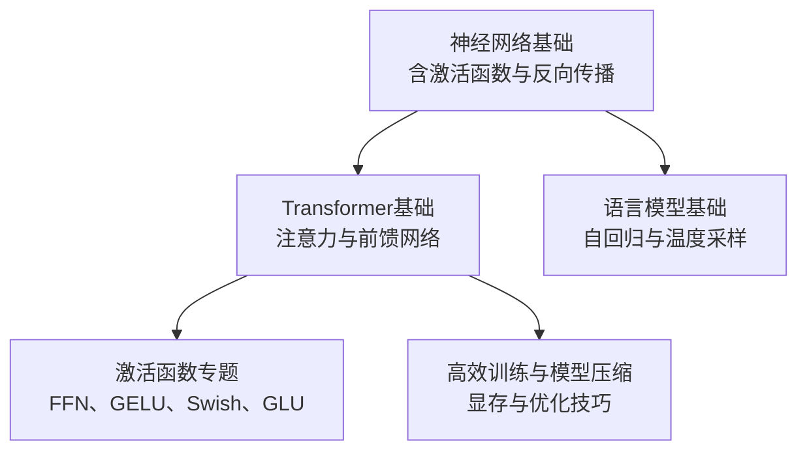
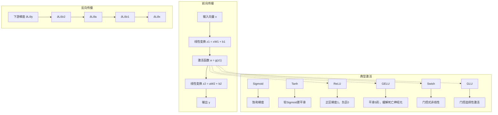
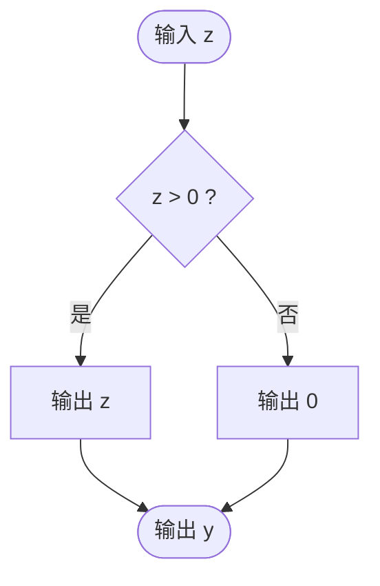
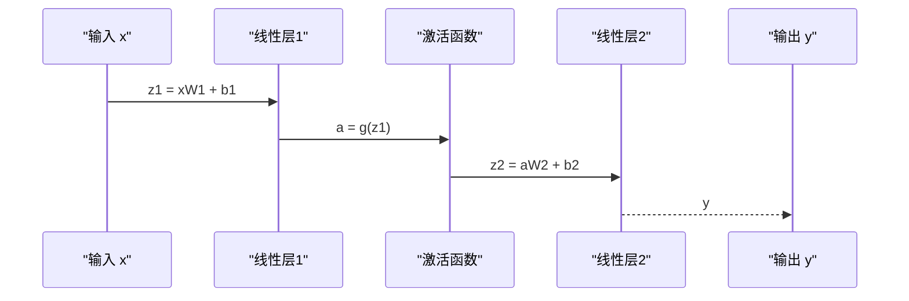
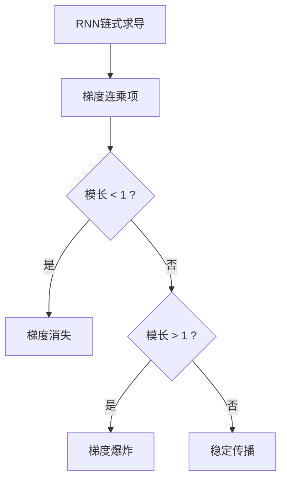
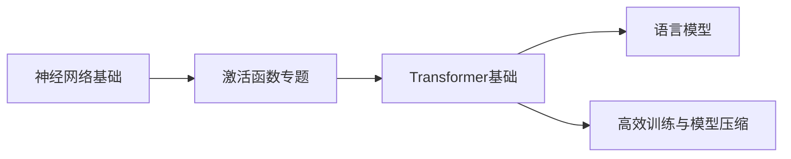

# 激活函数与深度学习基础

<cite>
**本文引用的文件**
- [2.神经网络基础.md](file://98.相关课程/清华大模型公开课/2.神经网络基础/2.神经网络基础.md)
- [6.激活函数.md](file://02.大语言模型架构/6.激活函数/6.激活函数.md)
- [Transformer基础.md](file://98.相关课程/清华大模型公开课/3.Transformer基础/3.Transformer基础.md)
- [Transformer架构细节.md](file://02.大语言模型架构/Transformer架构细节/Transformer架构细节.md)
- [高效训练&模型压缩.md](file://98.相关课程/清华大模型公开课/5.高效训练&模型压缩/5.高效训练&模型压缩.md)
- [1.语言模型.md](file://01.大语言模型基础/1.语言模型/1.语言模型.md)
</cite>

## 目录
1. [简介](#简介)
2. [项目结构](#项目结构)
3. [核心组件](#核心组件)
4. [架构总览](#架构总览)
5. [详细组件分析](#详细组件分析)
6. [依赖分析](#依赖分析)
7. [性能考量](#性能考量)
8. [故障排查指南](#故障排查指南)
9. [结论](#结论)
10. [附录](#附录)

## 简介
本文件围绕激活函数与深度学习基础展开，系统梳理经典激活函数（Sigmoid、Tanh、ReLU）的数学与几何意义，解释其在神经网络中的作用机制，并深入探讨梯度消失与梯度爆炸的成因与应对策略。结合Transformer与大语言模型（LLM）的实际应用，阐明激活函数选择对模型性能与稳定性的影响，帮助读者建立从基础到工程实践的完整认知。

## 项目结构
本仓库聚焦于大模型面试与教学资料，激活函数相关内容分布在“神经网络基础”“Transformer基础”“激活函数专题”“高效训练与模型压缩”等章节中，形成“基础—架构—工程实践”的递进体系。

图表来源
- [2.神经网络基础.md:33-61](file://98.相关课程/清华大模型公开课/2.神经网络基础/2.神经网络基础.md#L33-L61)
- [Transformer基础.md:174-248](file://98.相关课程/清华大模型公开课/3.Transformer基础/3.Transformer基础.md#L174-L248)
- [6.激活函数.md:1-24](file://02.大语言模型架构/6.激活函数/6.激活函数.md#L1-L24)
- [高效训练&模型压缩.md:1-52](file://98.相关课程/清华大模型公开课/5.高效训练&模型压缩/5.高效训练&模型压缩.md#L1-L52)

章节来源
- [2.神经网络基础.md:1-120](file://98.相关课程/清华大模型公开课/2.神经网络基础/2.神经网络基础.md#L1-L120)
- [Transformer基础.md:1-120](file://98.相关课程/清华大模型公开课/3.Transformer基础/3.Transformer基础.md#L1-L120)

## 核心组件
- 激活函数家族与几何意义
  - Sigmoid：输出范围(0,1)，常用于二分类输出层；梯度饱和易引发梯度消失。
  - Tanh：输出范围(-1,1)，零点对称，较Sigmoid更平滑；深层网络仍易梯度消失。
  - ReLU：输出max(0,z)，梯度在正区为1，负区为0，缓解梯度消失，但可能导致“神经元死亡”。
- 前馈网络（FFN）与非线性变换
  - FFN由两层线性变换与激活函数构成，是Transformer子层的重要组成部分。
  - 常见激活：ReLU、GELU、Swish、GLU等，GELU在深层网络中更稳定，Swish在某些任务上收敛更快，GLU引入门控机制增强表达能力。
- 梯度消失与梯度爆炸
  - RNN链式求导中，梯度随层数呈指数衰减或增长，导致训练困难。
  - Transformer通过残差连接、缩放点积注意力与层归一化缓解梯度问题。
- 大语言模型中的应用
  - GPT/Decoder-only采用左到右自回归，FFN中常使用GELU。
  - BERT/Encoder-only采用双向上下文，FFN中亦可使用GELU等激活。
  - 温度参数控制生成多样性，影响激活后的分布形态。

章节来源
- [2.神经网络基础.md:33-61](file://98.相关课程/清华大模型公开课/2.神经网络基础/2.神经网络基础.md#L33-L61)
- [6.激活函数.md:1-51](file://02.大语言模型架构/6.激活函数/6.激活函数.md#L1-L51)
- [Transformer基础.md:174-248](file://98.相关课程/清华大模型公开课/3.Transformer基础/3.Transformer基础.md#L174-L248)
- [1.语言模型.md:37-97](file://01.大语言模型基础/1.语言模型/1.语言模型.md#L37-L97)

## 架构总览
激活函数在深度学习中的作用机制与影响路径如下：

图表来源
- [2.神经网络基础.md:116-156](file://98.相关课程/清华大模型公开课/2.神经网络基础/2.神经网络基础.md#L116-L156)
- [6.激活函数.md:1-51](file://02.大语言模型架构/6.激活函数/6.激活函数.md#L1-L51)

## 详细组件分析

### 组件A：经典激活函数的数学与几何意义
- Sigmoid
  - 数学形式与图像直观展示其饱和特性，输出范围(0,1)。
  - 在深层网络中，梯度在两端饱和，易导致梯度消失。
- Tanh
  - 零点对称，输出范围(-1,1)，较Sigmoid更平滑。
  - 仍存在梯度饱和问题，深层网络中需配合归一化与残差缓解。
- ReLU
  - max(0,z)，正区梯度恒为1，负区为0。
  - 显著缓解梯度消失，但可能导致负区神经元永久失活（死亡神经元）。

图表来源
- [2.神经网络基础.md:37-59](file://98.相关课程/清华大模型公开课/2.神经网络基础/2.神经网络基础.md#L37-L59)

章节来源
- [2.神经网络基础.md:33-61](file://98.相关课程/清华大模型公开课/2.神经网络基础/2.神经网络基础.md#L33-L61)

### 组件B：前馈网络（FFN）与激活函数选择
- FFN结构
  - 两层线性变换与激活函数，常用于Transformer子层。
  - 增大隐状态维度可提升性能，但需平衡计算与显存。
- GELU
  - 平滑S形曲线，梯度更稳定，深层网络中更少出现梯度消失。
  - 计算复杂度高于ReLU，需权衡效率与稳定性。
- Swish/GLU
  - Swish引入门控与可调超参数β，门控式非线性增强表达能力。
  - GLU通过逐元素门控选择性激活，提升特征提取能力。

图表来源
- [6.激活函数.md:1-24](file://02.大语言模型架构/6.激活函数/6.激活函数.md#L1-L24)

章节来源
- [6.激活函数.md:1-139](file://02.大语言模型架构/6.激活函数/6.激活函数.md#L1-L139)

### 组件C：梯度消失与梯度爆炸的成因与对策
- 成因
  - RNN链式求导中，梯度连乘项的模长随层数变化，可能趋近0或发散。
  - 注意力机制通过残差连接与缩放点积注意力缓解梯度问题。
- 对策
  - 残差连接：将输入直接加到输出，避免梯度在深层网络中衰减。
  - 层归一化：稳定激活分布，缓解梯度不稳定。
  - 缩放点积注意力：通过尺度因子抑制softmax输入过大导致的梯度尖锐化。
  - 优化器与学习率：合理设置可缓解梯度爆炸。
  - 激活函数选择：ReLU/GELU等在深层网络中更稳定。

图表来源
- [2.神经网络基础.md:372-384](file://98.相关课程/清华大模型公开课/2.神经网络基础/2.神经网络基础.md#L372-L384)

章节来源
- [2.神经网络基础.md:372-394](file://98.相关课程/清华大模型公开课/2.神经网络基础/2.神经网络基础.md#L372-L394)
- [Transformer架构细节.md:175-228](file://02.大语言模型架构/Transformer架构细节/Transformer架构细节.md#L175-L228)

### 组件D：大语言模型中的激活函数选择与影响
- GPT/Decoder-only
  - 左到右自回归，FFN中常使用GELU，兼顾稳定性与效率。
  - 温度参数控制生成多样性，影响激活后分布的软硬程度。
- BERT/Encoder-only
  - 双向上下文，FFN亦可采用GELU等激活，提升表征质量。
- 训练与推理
  - 混合精度、ZeRO、流水线并行等技术与激活函数共同影响显存与吞吐。
  - 激活函数的计算复杂度与数值稳定性直接影响大规模训练的收敛与收敛速度。

章节来源
- [Transformer基础.md:272-328](file://98.相关课程/清华大模型公开课/3.Transformer基础/3.Transformer基础.md#L272-L328)
- [1.语言模型.md:37-97](file://01.大语言模型基础/1.语言模型/1.语言模型.md#L37-L97)
- [高效训练&模型压缩.md:225-244](file://98.相关课程/清华大模型公开课/5.高效训练&模型压缩/5.高效训练&模型压缩.md#L225-L244)

## 依赖分析
激活函数与深度学习基础的依赖关系如下：

图表来源
- [2.神经网络基础.md:1-120](file://98.相关课程/清华大模型公开课/2.神经网络基础/2.神经网络基础.md#L1-L120)
- [6.激活函数.md:1-51](file://02.大语言模型架构/6.激活函数/6.激活函数.md#L1-L51)
- [Transformer基础.md:1-120](file://98.相关课程/清华大模型公开课/3.Transformer基础/3.Transformer基础.md#L1-L120)
- [高效训练&模型压缩.md:1-52](file://98.相关课程/清华大模型公开课/5.高效训练&模型压缩/5.高效训练&模型压缩.md#L1-L52)

章节来源
- [2.神经网络基础.md:1-120](file://98.相关课程/清华大模型公开课/2.神经网络基础/2.神经网络基础.md#L1-L120)
- [6.激活函数.md:1-51](file://02.大语言模型架构/6.激活函数/6.激活函数.md#L1-L51)
- [Transformer基础.md:1-120](file://98.相关课程/清华大模型公开课/3.Transformer基础/3.Transformer基础.md#L1-L120)
- [高效训练&模型压缩.md:1-52](file://98.相关课程/清华大模型公开课/5.高效训练&模型压缩/5.高效训练&模型压缩.md#L1-L52)

## 性能考量
- 激活函数选择与计算效率
  - ReLU计算最简单，适合大规模部署；GELU更平滑，深层网络更稳定；Swish/GLU引入门控，表达能力强但计算开销更大。
- 显存与吞吐
  - 深度网络中，激活函数的数值稳定性与梯度行为直接影响收敛速度与显存占用。
  - 混合精度、层归一化、残差连接等工程手段与激活函数协同提升训练效率。
- 训练稳定性
  - 梯度消失/爆炸的缓解策略（残差、归一化、缩放注意力）与激活函数选择共同决定模型的可训练性。

章节来源
- [6.激活函数.md:46-51](file://02.大语言模型架构/6.激活函数/6.激活函数.md#L46-L51)
- [高效训练&模型压缩.md:225-244](file://98.相关课程/清华大模型公开课/5.高效训练&模型压缩/5.高效训练&模型压缩.md#L225-L244)

## 故障排查指南
- 症状：训练停滞、梯度接近0
  - 可能原因：深层网络中激活函数饱和（Sigmoid/Tanh）、负区神经元死亡（ReLU）、梯度消失。
  - 排查建议：检查激活函数类型与分布，确认是否使用GELU或Swish；核对残差连接与层归一化是否生效。
- 症状：训练发散、梯度爆炸
  - 可能原因：学习率过高、权重初始化不当、注意力缩放缺失。
  - 排查建议：降低学习率、检查缩放点积注意力实现、确认梯度裁剪策略。
- 症状：显存不足
  - 可能原因：激活函数计算与中间结果占用高、未启用混合精度或ZeRO。
  - 排查建议：开启混合精度、使用ZeRO/流水线并行，必要时降低批次或模型维度。

章节来源
- [2.神经网络基础.md:372-394](file://98.相关课程/清华大模型公开课/2.神经网络基础/2.神经网络基础.md#L372-L394)
- [Transformer架构细节.md:175-228](file://02.大语言模型架构/Transformer架构细节/Transformer架构细节.md#L175-L228)
- [高效训练&模型压缩.md:165-208](file://98.相关课程/清华大模型公开课/5.高效训练&模型压缩/5.高效训练&模型压缩.md#L165-L208)

## 结论
激活函数是深度学习非线性表达的核心构件。Sigmoid/Tanh在输出层仍有价值，但深层网络更推荐ReLU/GELU等以缓解梯度消失；Swish/GLU引入门控机制，适合对表达能力要求更高的场景。Transformer通过残差、缩放注意力与层归一化显著改善训练稳定性，结合合适的激活函数与工程优化（混合精度、ZeRO、流水线并行），可在大模型训练中取得更优的性能与效率。

## 附录
- 术语速览
  - 激活函数：将线性变换后的信号映射到非线性空间的函数。
  - 前馈网络（FFN）：由线性层与激活函数组成的两层网络，常用于Transformer子层。
  - 梯度消失/爆炸：反向传播中梯度随层数衰减或增长，导致训练困难。
  - GELU/Swish/GLU：平滑或门控式激活，常用于现代Transformer模型。
  - 温度参数：控制生成分布的软硬程度，影响激活后的概率分布。