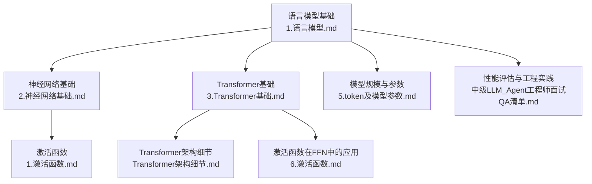
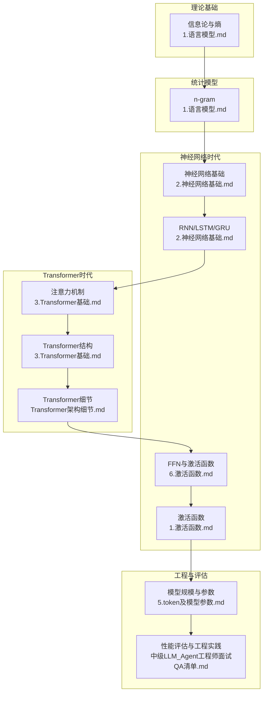
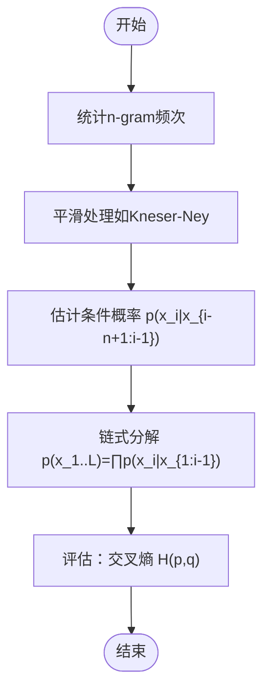
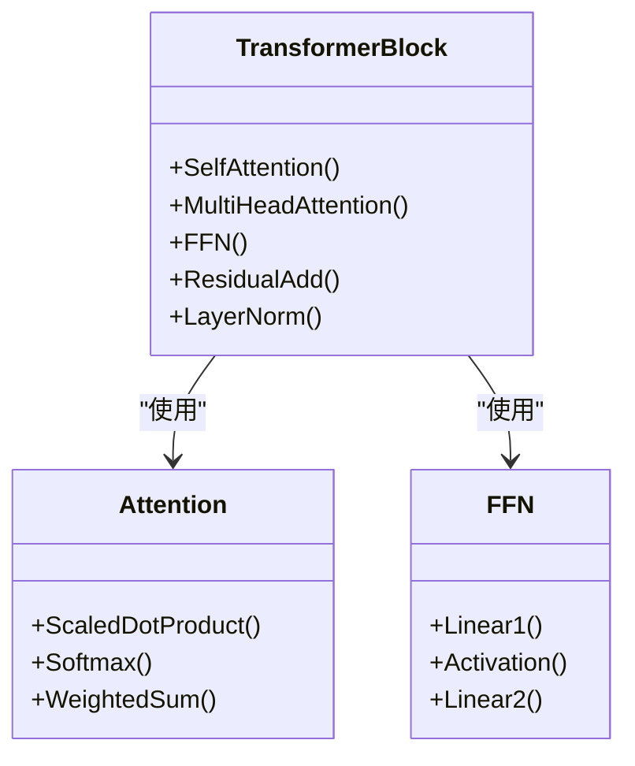
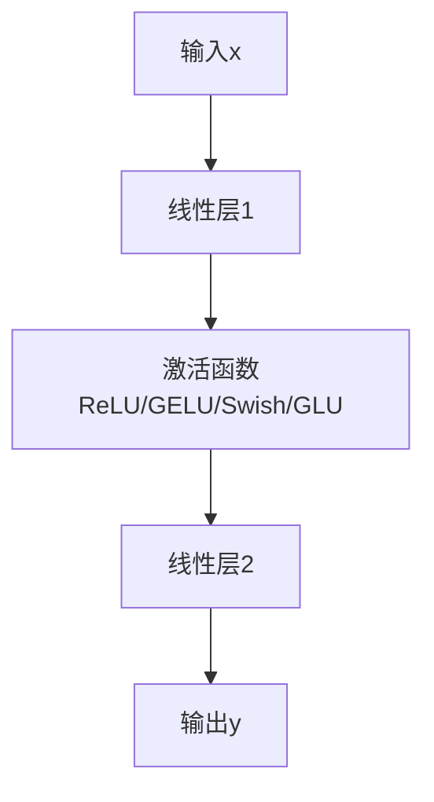
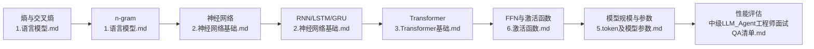

# 语言模型发展历程

<cite>
**本文引用的文件**
- [1.语言模型.md](file://01.大语言模型基础/1.语言模型/1.语言模型.md)
- [2.神经网络基础.md](file://98.相关课程/清华大模型公开课/2.神经网络基础/2.神经网络基础.md)
- [3.Transformer基础.md](file://98.相关课程/清华大模型公开课/3.Transformer基础/3.Transformer基础.md)
- [Transformer架构细节.md](file://02.大语言模型架构/Transformer架构细节/Transformer架构细节.md)
- [6.激活函数.md](file://02.大语言模型架构/6.激活函数/6.激活函数.md)
- [1.激活函数.md](file://01.大语言模型基础/1.激活函数/1.激活函数.md)
- [5.token及模型参数.md](file://02.大语言模型架构/5.token及模型参数/5.token及模型参数.md)
- [中级LLM_Agent工程师面试QA清单.md](file://ai_generataion/中级LLM_Agent工程师面试QA清单.md)
</cite>

## 目录
1. [引言](#引言)
2. [项目结构](#项目结构)
3. [核心组件](#核心组件)
4. [架构总览](#架构总览)
5. [详细组件分析](#详细组件分析)
6. [依赖分析](#依赖分析)
7. [性能考量](#性能考量)
8. [故障排查指南](#故障排查指南)
9. [结论](#结论)
10. [附录](#附录)

## 引言
本文件系统梳理语言模型从n-gram到神经网络再到Transformer的发展脉络，解释传统统计语言模型的局限性与深度学习语言模型的优势，阐述语言模型的核心概念、数学原理与计算方法，并结合仓库中的课程与资料，提供实现思路与性能评估建议，帮助读者把握语言模型技术的关键突破点与演进路径。

## 项目结构
本仓库围绕“语言模型”主题，提供了从基础概念、神经网络、Transformer架构到性能评估与工程实践的完整知识体系。与语言模型发展历程直接相关的内容主要分布在以下文件：
- 语言模型基础与历史回顾：[1.语言模型.md](file://01.大语言模型基础/1.语言模型/1.语言模型.md)
- 神经网络基础与激活函数：[2.神经网络基础.md](file://98.相关课程/清华大模型公开课/2.神经网络基础/2.神经网络基础.md)、[1.激活函数.md](file://01.大语言模型基础/1.激活函数/1.激活函数.md)
- Transformer与注意力机制：[3.Transformer基础.md](file://98.相关课程/清华大模型公开课/3.Transformer基础/3.Transformer基础.md)、[Transformer架构细节.md](file://02.大语言模型架构/Transformer架构细节/Transformer架构细节.md)
- 激活函数在FFN中的应用：[6.激活函数.md](file://02.大语言模型架构/6.激活函数/6.激活函数.md)
- 模型规模与参数量：[5.token及模型参数.md](file://02.大语言模型架构/5.token及模型参数/5.token及模型参数.md)
- 性能评估与工程实践：[中级LLM_Agent工程师面试QA清单.md](file://ai_generataion/中级LLM_Agent工程师面试QA清单.md)



**图表来源**
- [1.语言模型.md:1-215](file://01.大语言模型基础/1.语言模型/1.语言模型.md#L1-L215)
- [2.神经网络基础.md:1-534](file://98.相关课程/清华大模型公开课/2.神经网络基础/2.神经网络基础.md#L1-L534)
- [3.Transformer基础.md:1-394](file://98.相关课程/清华大模型公开课/3.Transformer基础/3.Transformer基础.md#L1-L394)
- [Transformer架构细节.md:1-285](file://02.大语言模型架构/Transformer架构细节/Transformer架构细节.md#L1-L285)
- [1.激活函数.md:1-292](file://01.大语言模型基础/1.激活函数/1.激活函数.md#L1-L292)
- [6.激活函数.md:1-80](file://02.大语言模型架构/6.激活函数/6.激活函数.md#L1-L80)
- [5.token及模型参数.md:1-25](file://02.大语言模型架构/5.token及模型参数/5.token及模型参数.md#L1-L25)
- [中级LLM_Agent工程师面试QA清单.md:241-320](file://ai_generataion/中级LLM_Agent工程师面试QA清单.md#L241-L320)

**章节来源**
- [1.语言模型.md:1-215](file://01.大语言模型基础/1.语言模型/1.语言模型.md#L1-L215)
- [2.神经网络基础.md:1-534](file://98.相关课程/清华大模型公开课/2.神经网络基础/2.神经网络基础.md#L1-L534)
- [3.Transformer基础.md:1-394](file://98.相关课程/清华大模型公开课/3.Transformer基础/3.Transformer基础.md#L1-L394)
- [Transformer架构细节.md:1-285](file://02.大语言模型架构/Transformer架构细节/Transformer架构细节.md#L1-L285)
- [1.激活函数.md:1-292](file://01.大语言模型基础/1.激活函数/1.激活函数.md#L1-L292)
- [6.激活函数.md:1-80](file://02.大语言模型架构/6.激活函数/6.激活函数.md#L1-L80)
- [5.token及模型参数.md:1-25](file://02.大语言模型架构/5.token及模型参数/5.token及模型参数.md#L1-L25)
- [中级LLM_Agent工程师面试QA清单.md:241-320](file://ai_generataion/中级LLM_Agent工程师面试QA清单.md#L241-L320)

## 核心组件
- 语言模型定义与自回归分解
  - 语言模型是对令牌序列的概率分布；自回归分解将联合分布写成链式乘积，便于条件概率建模与采样。
  - 温度参数用于控制采样多样性与确定性。
- 统计语言模型（n-gram）
  - 基于马尔可夫假设，仅依赖最后n-1个词；训练成本低但统计效率低，长程依赖受限。
- 神经语言模型
  - 以神经网络替代n-gram的条件概率估计，具备更强的统计效率；早期受限于计算成本。
- RNN/LSTM/GRU
  - 具备“顺序记忆”，可对整个历史建模；但训练困难、易梯度问题。
- Transformer与注意力
  - 通过自注意力与多头注意力实现并行化与长程依赖建模；适合大规模并行训练。
- 激活函数与FFN
  - ReLU/GELU/Swish/GLU等在深度网络中承担非线性与门控作用，缓解梯度问题并提升表达能力。
- 模型规模与参数
  - 模型表现与参数量、训练Token数、计算量呈幂律关系；需在预算内协同提升。

**章节来源**
- [1.语言模型.md:3-96](file://01.大语言模型基础/1.语言模型/1.语言模型.md#L3-L96)
- [1.语言模型.md:100-215](file://01.大语言模型基础/1.语言模型/1.语言模型.md#L100-L215)
- [2.神经网络基础.md:33-66](file://98.相关课程/清华大模型公开课/2.神经网络基础/2.神经网络基础.md#L33-L66)
- [2.神经网络基础.md:330-514](file://98.相关课程/清华大模型公开课/2.神经网络基础/2.神经网络基础.md#L330-L514)
- [3.Transformer基础.md:1-394](file://98.相关课程/清华大模型公开课/3.Transformer基础/3.Transformer基础.md#L1-L394)
- [6.激活函数.md:1-80](file://02.大语言模型架构/6.激活函数/6.激活函数.md#L1-L80)
- [1.激活函数.md:1-292](file://01.大语言模型基础/1.激活函数/1.激活函数.md#L1-L292)
- [5.token及模型参数.md:9-25](file://02.大语言模型架构/5.token及模型参数/5.token及模型参数.md#L9-L25)

## 架构总览
语言模型的发展路径可概括为：信息论与熵度量奠定理论基础；n-gram以统计方法建模局部依赖；神经网络引入非线性与更强统计效率；RNN/LSTM/GRU扩展至全局依赖但训练困难；Transformer以注意力机制实现并行化与长程建模；激活函数与FFN模块进一步提升表达能力；大规模参数与数据驱动模型性能跃迁。



**图表来源**
- [1.语言模型.md:100-215](file://01.大语言模型基础/1.语言模型/1.语言模型.md#L100-L215)
- [2.神经网络基础.md:330-514](file://98.相关课程/清华大模型公开课/2.神经网络基础/2.神经网络基础.md#L330-L514)
- [3.Transformer基础.md:1-394](file://98.相关课程/清华大模型公开课/3.Transformer基础/3.Transformer基础.md#L1-L394)
- [Transformer架构细节.md:1-285](file://02.大语言模型架构/Transformer架构细节/Transformer架构细节.md#L1-L285)
- [1.激活函数.md:1-292](file://01.大语言模型基础/1.激活函数/1.激活函数.md#L1-L292)
- [6.激活函数.md:1-80](file://02.大语言模型架构/6.激活函数/6.激活函数.md#L1-L80)
- [5.token及模型参数.md:9-25](file://02.大语言模型架构/5.token及模型参数/5.token及模型参数.md#L9-L25)
- [中级LLM_Agent工程师面试QA清单.md:241-320](file://ai_generataion/中级LLM_Agent工程师面试QA清单.md#L241-L320)

## 详细组件分析

### 组件A：n-gram模型与统计局限性
- 数学与实现
  - 条件概率仅依赖最后n-1个词，通过统计计数与平滑（如Kneser-Ney）估计概率。
  - 优点：训练成本低、可扩展；缺点：统计效率低、长程依赖弱、对未见过长序列估计差。
- 性能与应用
  - 在语音识别、机器翻译等任务中与声学/翻译模型联合使用；受限于上下文长度n的选择。
- 训练与评估
  - 通过语言模型估计熵与交叉熵，交叉熵上界为熵，用于衡量模型对真实分布的逼近程度。



**图表来源**
- [1.语言模型.md:146-190](file://01.大语言模型基础/1.语言模型/1.语言模型.md#L146-L190)
- [1.语言模型.md:100-145](file://01.大语言模型基础/1.语言模型/1.语言模型.md#L100-L145)

**章节来源**
- [1.语言模型.md:100-190](file://01.大语言模型基础/1.语言模型/1.语言模型.md#L100-L190)

### 组件B：神经网络语言模型与RNN/LSTM/GRU
- 数学与实现
  - 以神经网络建模条件概率，突破n-gram的上下文长度限制；RNN/LSTM/GRU具备顺序记忆能力，理论上可建模无限历史。
  - 激活函数引入非线性，缓解多层线性塌缩；梯度问题（消失/爆炸）通过门控与归一化缓解。
- 训练与优化
  - 反向传播与链式法则；梯度裁剪、残差连接、归一化等技巧改善训练稳定性。
- 优缺点
  - 统计效率高但计算成本高；RNN训练困难、长序列梯度不稳定；LSTM/GRU通过门控缓解问题。

```mermaid
sequenceDiagram
participant Data as "数据序列"
participant RNN as "RNN/GRU/LSTM"
participant Act as "激活函数"
participant Loss as "损失函数"
participant Opt as "优化器"
Data->>RNN : 输入x_t，更新隐藏状态h_{t-1}→h_t
RNN->>Act : 非线性变换
Act-->>RNN : 输出h_t
RNN->>Loss : 计算损失
Loss->>Opt : 反向传播更新参数
Opt-->>RNN : 参数更新
```

**图表来源**
- [2.神经网络基础.md:330-514](file://98.相关课程/清华大模型公开课/2.神经网络基础/2.神经网络基础.md#L330-L514)
- [1.激活函数.md:1-292](file://01.大语言模型基础/1.激活函数/1.激活函数.md#L1-L292)

**章节来源**
- [2.神经网络基础.md:330-514](file://98.相关课程/清华大模型公开课/2.神经网络基础/2.神经网络基础.md#L330-L514)
- [1.激活函数.md:1-292](file://01.大语言模型基础/1.激活函数/1.激活函数.md#L1-L292)

### 组件C：Transformer与注意力机制
- 数学与实现
  - 自注意力通过查询-键-值的点积相似度计算权重，实现对序列任意位置的并行建模；多头注意力并行聚合多子空间特征。
  - Transformer块包含自注意力与前馈网络（FFN），并辅以残差连接、层归一化等技巧。
- 优缺点
  - 并行化能力强、长程依赖建模好；对输入长度敏感（如早期限制在512以内），需位置编码与掩码等技巧。
- 应用
  - GPT（自回归）、BERT（双向掩码）等预训练语言模型均基于Transformer。



**图表来源**
- [3.Transformer基础.md:174-248](file://98.相关课程/清华大模型公开课/3.Transformer基础/3.Transformer基础.md#L174-L248)
- [Transformer架构细节.md:7-285](file://02.大语言模型架构/Transformer架构细节/Transformer架构细节.md#L7-L285)

**章节来源**
- [3.Transformer基础.md:1-394](file://98.相关课程/清华大模型公开课/3.Transformer基础/3.Transformer基础.md#L1-L394)
- [Transformer架构细节.md:1-285](file://02.大语言模型架构/Transformer架构细节/Transformer架构细节.md#L1-L285)

### 组件D：激活函数与FFN模块
- 激活函数
  - ReLU、GELU、Swish、GLU等在深度网络中承担非线性与门控作用；GELU在FFN中广泛应用，Swish与GLU在现代架构中逐步引入。
- FFN与门控
  - FFN通过两层线性变换与激活函数实现非线性映射；GLU通过门控机制提升特征选择能力。



**图表来源**
- [6.激活函数.md:1-80](file://02.大语言模型架构/6.激活函数/6.激活函数.md#L1-L80)
- [1.激活函数.md:148-292](file://01.大语言模型基础/1.激活函数/1.激活函数.md#L148-L292)

**章节来源**
- [6.激活函数.md:1-80](file://02.大语言模型架构/6.激活函数/6.激活函数.md#L1-L80)
- [1.激活函数.md:148-292](file://01.大语言模型基础/1.激活函数/1.激活函数.md#L148-L292)

### 组件E：模型规模与参数量
- 规模与表现
  - 模型表现与参数量、训练Token数、计算量呈幂律关系；在给定预算下应同比提升参数量与数据规模。
- 参数构成
  - Embedding等参数外，模型参数量与训练Token数、FLOPs密切相关；不同规模的参数量与训练预算存在对应关系。

**章节来源**
- [5.token及模型参数.md:9-25](file://02.大语言模型架构/5.token及模型参数/5.token及模型参数.md#L9-L25)

## 依赖分析
- 理论到实践的依赖
  - 信息论与熵度量为n-gram与神经网络提供统一的评估视角；n-gram为早期主流，神经网络突破统计效率瓶颈；RNN/LSTM/GRU扩展至全局依赖；Transformer以注意力实现并行化与长程建模。
- 技术耦合
  - Transformer依赖注意力与多头机制；激活函数与FFN共同提升非线性表达；模型规模与数据量决定性能上限。
- 工程实践
  - 性能评估指标（准确率、ROUGE、BLEU、延迟、吞吐量）与A/B测试、用户满意度调查相结合。



**图表来源**
- [1.语言模型.md:100-215](file://01.大语言模型基础/1.语言模型/1.语言模型.md#L100-L215)
- [2.神经网络基础.md:330-514](file://98.相关课程/清华大模型公开课/2.神经网络基础/2.神经网络基础.md#L330-L514)
- [3.Transformer基础.md:1-394](file://98.相关课程/清华大模型公开课/3.Transformer基础/3.Transformer基础.md#L1-L394)
- [6.激活函数.md:1-80](file://02.大语言模型架构/6.激活函数/6.激活函数.md#L1-L80)
- [5.token及模型参数.md:9-25](file://02.大语言模型架构/5.token及模型参数/5.token及模型参数.md#L9-L25)
- [中级LLM_Agent工程师面试QA清单.md:241-320](file://ai_generataion/中级LLM_Agent工程师面试QA清单.md#L241-L320)

**章节来源**
- [1.语言模型.md:100-215](file://01.大语言模型基础/1.语言模型/1.语言模型.md#L100-L215)
- [2.神经网络基础.md:330-514](file://98.相关课程/清华大模型公开课/2.神经网络基础/2.神经网络基础.md#L330-L514)
- [3.Transformer基础.md:1-394](file://98.相关课程/清华大模型公开课/3.Transformer基础/3.Transformer基础.md#L1-L394)
- [6.激活函数.md:1-80](file://02.大语言模型架构/6.激活函数/6.激活函数.md#L1-L80)
- [5.token及模型参数.md:9-25](file://02.大语言模型架构/5.token及模型参数/5.token及模型参数.md#L9-L25)
- [中级LLM_Agent工程师面试QA清单.md:241-320](file://ai_generataion/中级LLM_Agent工程师面试QA清单.md#L241-L320)

## 性能考量
- 指标体系
  - 自动化指标：准确率、召回率、F1分数（任务相关）、ROUGE、BLEU、METEOR（生成质量）、延迟、吞吐量、错误率（系统性能）。
  - 人工评估：相关性、流畅性、有用性评分；A/B测试与用户满意度调查。
  - 业务指标：用户留存率、任务完成率、客服工单减少量、转化率提升。
- 评估框架
  - 通过批处理评估、推理时延测量与用户反馈分析，形成闭环评估。

**章节来源**
- [中级LLM_Agent工程师面试QA清单.md:241-320](file://ai_generataion/中级LLM_Agent工程师面试QA清单.md#L241-L320)

## 故障排查指南
- 训练稳定性
  - 梯度爆炸/消失：使用梯度裁剪、残差连接、归一化（LayerNorm/RMSNorm）；选择合适的激活函数（ReLU/GELU）。
- 模型容量与数据
  - 参数量与数据规模不足：扩大模型规模与训练数据，遵循幂律关系；合理分配计算预算。
- 推理性能
  - 延迟与吞吐：结合并行化策略（数据/流水线/张量并行）、混合精度、检查点重计算等优化手段。

**章节来源**
- [1.激活函数.md:1-292](file://01.大语言模型基础/1.激活函数/1.激活函数.md#L1-L292)
- [Transformer架构细节.md:258-275](file://02.大语言模型架构/Transformer架构细节/Transformer架构细节.md#L258-L275)
- [中级LLM_Agent工程师面试QA清单.md:241-320](file://ai_generataion/中级LLM_Agent工程师面试QA清单.md#L241-L320)

## 结论
语言模型从n-gram到神经网络再到Transformer的发展，体现了从统计效率到计算效率再到并行化与长程建模能力的跃迁。信息论为评估提供统一框架，n-gram奠定实践基础，神经网络突破统计瓶颈，RNN/LSTM/GRU扩展全局依赖，Transformer以注意力机制实现并行化与强表达能力。配合大规模参数与数据、完善的评估体系与工程优化，现代语言模型在多类任务中取得显著进展。

## 附录
- 术语速查
  - 语言模型：对令牌序列的概率分布；自回归分解：链式乘积形式；温度参数：控制采样多样性。
  - n-gram：基于马尔可夫假设的局部依赖建模；交叉熵：衡量模型对真实分布的逼近。
  - RNN/LSTM/GRU：顺序记忆与门控机制；Transformer：自注意力与多头注意力；FFN：前馈网络与门控。
  - 激活函数：ReLU、GELU、Swish、GLU等；层归一化：Pre-Norm架构中的关键组件。
- 参考资料
  - 语言模型与历史回顾：[1.语言模型.md:100-215](file://01.大语言模型基础/1.语言模型/1.语言模型.md#L100-L215)
  - 神经网络与激活函数：[2.神经网络基础.md:330-514](file://98.相关课程/清华大模型公开课/2.神经网络基础/2.神经网络基础.md#L330-L514)、[1.激活函数.md:1-292](file://01.大语言模型基础/1.激活函数/1.激活函数.md#L1-L292)
  - Transformer与注意力：[3.Transformer基础.md:1-394](file://98.相关课程/清华大模型公开课/3.Transformer基础/3.Transformer基础.md#L1-L394)、[Transformer架构细节.md:1-285](file://02.大语言模型架构/Transformer架构细节/Transformer架构细节.md#L1-L285)
  - 激活函数在FFN中的应用：[6.激活函数.md:1-80](file://02.大语言模型架构/6.激活函数/6.激活函数.md#L1-L80)
  - 模型规模与参数：[5.token及模型参数.md:9-25](file://02.大语言模型架构/5.token及模型参数/5.token及模型参数.md#L9-L25)
  - 性能评估与工程实践：[中级LLM_Agent工程师面试QA清单.md:241-320](file://ai_generataion/中级LLM_Agent工程师面试QA清单.md#L241-L320)