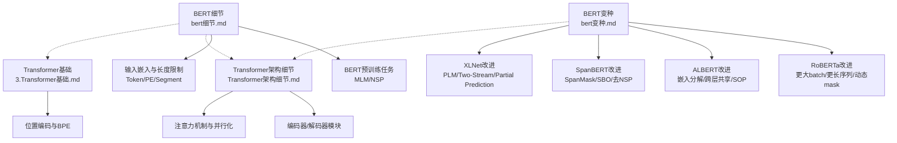
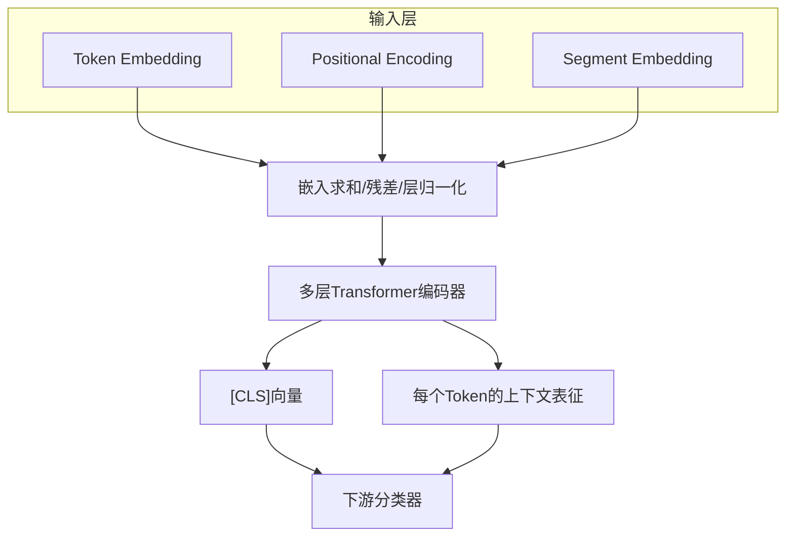
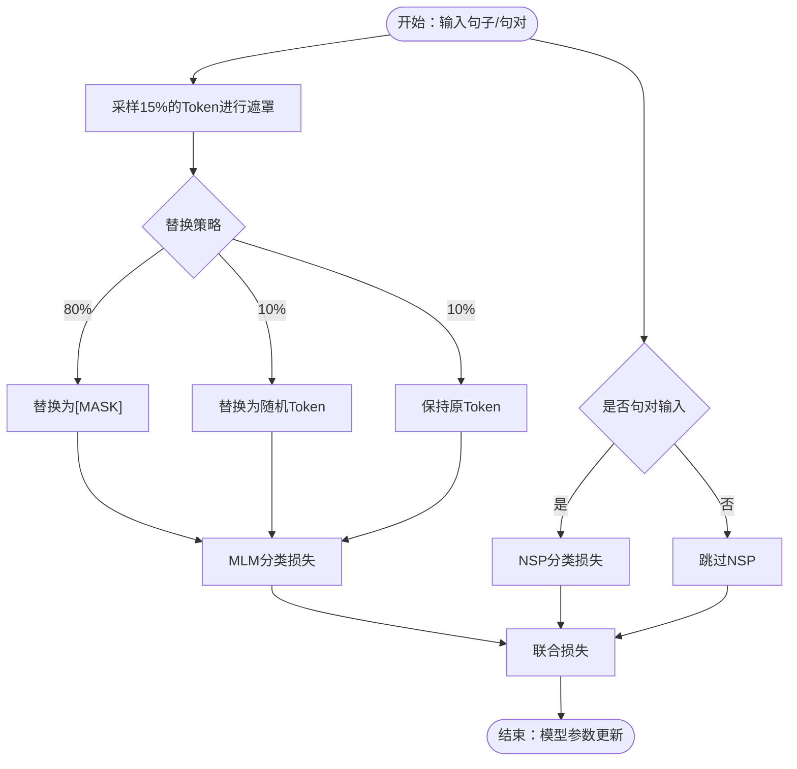
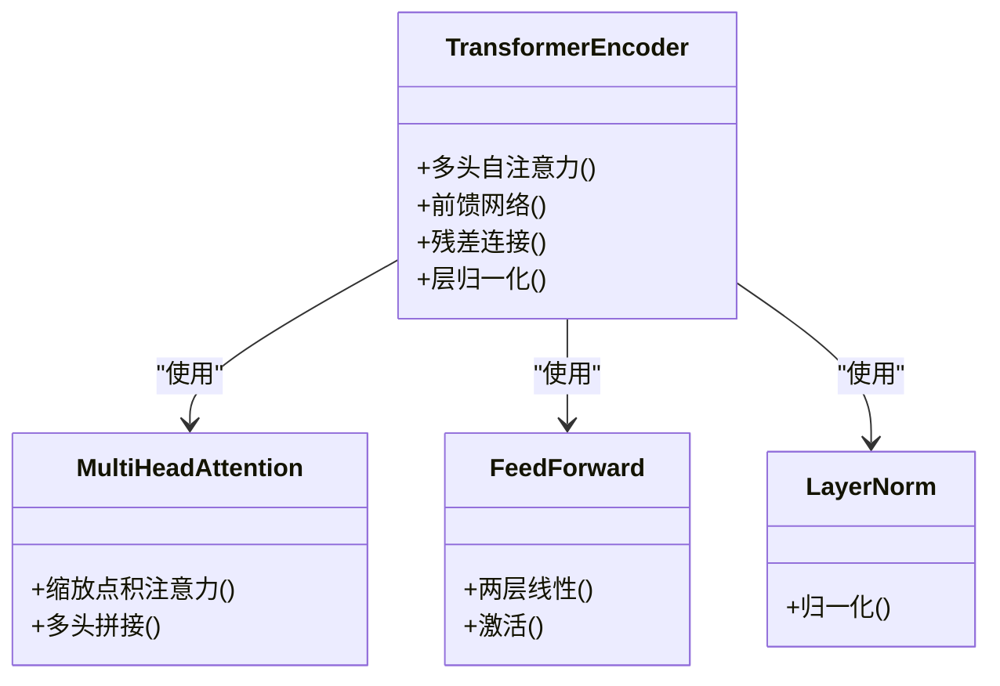
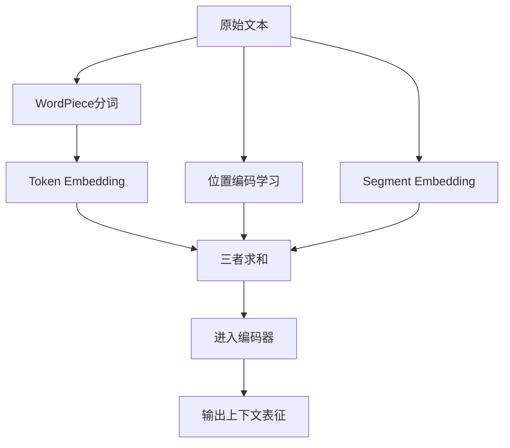
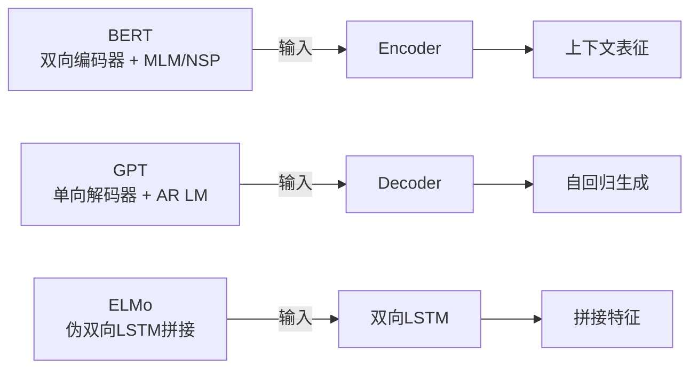
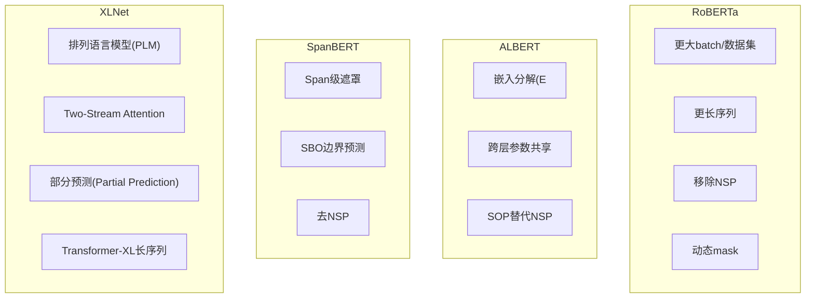
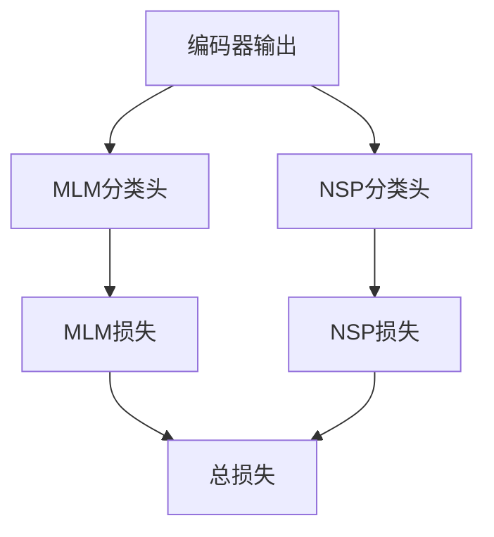
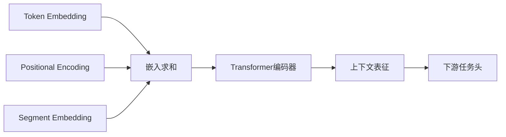

# BERT架构详解

<cite>
**本文引用的文件列表**
- [bert细节.md](file://02.大语言模型架构/bert细节/bert细节.md)
- [bert变种.md](file://02.大语言模型架构/bert变种/bert变种.md)
- [Transformer架构细节.md](file://02.大语言模型架构/Transformer架构细节/Transformer架构细节.md)
- [3.Transformer基础.md](file://98.相关课程/清华大模型公开课/3.Transformer基础/3.Transformer基础.md)
</cite>

## 目录
1. [简介](#简介)
2. [项目结构](#项目结构)
3. [核心组件](#核心组件)
4. [架构总览](#架构总览)
5. [详细组件分析](#详细组件分析)
6. [依赖关系分析](#依赖关系分析)
7. [性能考量](#性能考量)
8. [故障排查指南](#故障排查指南)
9. [结论](#结论)
10. [附录](#附录)

## 简介
本文件系统性梳理BERT（Bidirectional Encoder Representations from Transformers）的架构设计、预训练任务（MLM与NSP）、双向编码器工作机制，并对比其与Transformer、GPT、ELMo等变体的差异。随后总结BERT主要变体（RoBERTa、ALBERT、SpanBERT、XLNet等）的改进点与优化策略，辅以架构图与流程图帮助读者建立从理论到实现的完整认知。

## 项目结构
围绕BERT主题，仓库中与之直接相关的核心资料集中在“大语言模型架构”与“清华大模型公开课”两个目录下：
- 02.大语言模型架构/bert细节：覆盖BERT背景、输入嵌入、预训练任务、损失函数、优缺点与局限性
- 02.大语言模型架构/bert变种：覆盖RoBERTa、ALBERT、SpanBERT、XLNet等变体的改进点
- 02.大语言模型架构/Transformer架构细节：覆盖Transformer编码器/解码器模块、注意力机制、并行化等
- 98.相关课程/清华大模型公开课/3.Transformer基础：覆盖Transformer基础、注意力机制、位置编码、BPE等

**图表来源**
- [bert细节.md:1-272](file://02.大语言模型架构/bert细节/bert细节.md#L1-L272)
- [bert变种.md:1-171](file://02.大语言模型架构/bert变种/bert变种.md#L1-L171)
- [Transformer架构细节.md:1-321](file://02.大语言模型架构/Transformer架构细节/Transformer架构细节.md#L1-L321)
- [3.Transformer基础.md:1-394](file://98.相关课程/清华大模型公开课/3.Transformer基础/3.Transformer基础.md#L1-L394)

**章节来源**
- [bert细节.md:1-272](file://02.大语言模型架构/bert细节/bert细节.md#L1-L272)
- [bert变种.md:1-171](file://02.大语言模型架构/bert变种/bert变种.md#L1-L171)
- [Transformer架构细节.md:1-321](file://02.大语言模型架构/Transformer架构细节/Transformer架构细节.md#L1-L321)
- [3.Transformer基础.md:1-394](file://98.相关课程/清华大模型公开课/3.Transformer基础/3.Transformer基础.md#L1-L394)

## 核心组件
- 双向Transformer编码器：BERT仅使用Transformer的Encoder部分，通过MLM与NSP实现双向语义建模
- 预训练任务：
  - 随机遮罩15%的Token进行MLM，80%替换为[MASK]、10%替换为随机Token、10%保持原Token
  - 句子对任务NSP（Next Sentence Prediction），用于学习句子级语义
- 输入嵌入：
  - Token Embedding（WordPiece）
  - 位置嵌入（Positional Encoding）
  - 段落嵌入（Segment Embedding，区分句对）
- 损失函数：MLM分类损失 + NSP分类损失的加和

**章节来源**
- [bert细节.md:75-91](file://02.大语言模型架构/bert细节/bert细节.md#L75-L91)
- [bert细节.md:92-133](file://02.大语言模型架构/bert细节/bert细节.md#L92-L133)
- [bert细节.md:220-244](file://02.大语言模型架构/bert细节/bert细节.md#L220-L244)

## 架构总览
BERT以Transformer编码器为核心，输入为三类嵌入的和，经多层编码器堆叠后输出每个Token的上下文表征；[CLS]向量用于句子级分类任务；预训练阶段联合MLM与NSP，微调阶段在下游任务上接入分类器。

**图表来源**
- [bert细节.md:92-133](file://02.大语言模型架构/bert细节/bert细节.md#L92-L133)
- [bert细节.md:102-104](file://02.大语言模型架构/bert细节/bert细节.md#L102-L104)
- [Transformer架构细节.md:9-14](file://02.大语言模型架构/Transformer架构细节/Transformer架构细节.md#L9-L14)

## 详细组件分析

### 1) 预训练任务：MLM与NSP
- MLM（Masked Language Model）
  - 随机遮罩15%的Token，80%替换为[MASK]，10%替换为随机Token，10%保持原Token
  - 通过上下文预测被遮罩的词，学习双向语义
- NSP（Next Sentence Prediction）
  - 句对输入，判断第二句是否为原文的后续句
  - 用于学习句子级语义与连贯性

**图表来源**
- [bert细节.md:77-91](file://02.大语言模型架构/bert细节/bert细节.md#L77-L91)

**章节来源**
- [bert细节.md:77-91](file://02.大语言模型架构/bert细节/bert细节.md#L77-L91)

### 2) 双向编码器工作机制
- 编码器堆叠：多层自注意力与前馈网络交替堆叠，每层包含残差连接与层归一化
- 自注意力：通过缩放点积注意力聚合上下文信息，实现远距离依赖建模
- 句子级表示：[CLS]向量在最后一层可作为整句语义的聚合表示

**图表来源**
- [Transformer架构细节.md:9-14](file://02.大语言模型架构/Transformer架构细节/Transformer架构细节.md#L9-L14)
- [Transformer架构细节.md:60-83](file://02.大语言模型架构/Transformer架构细节/Transformer架构细节.md#L60-L83)

**章节来源**
- [Transformer架构细节.md:9-14](file://02.大语言模型架构/Transformer架构细节/Transformer架构细节.md#L9-L14)
- [Transformer架构细节.md:60-83](file://02.大语言模型架构/Transformer架构细节/Transformer架构细节.md#L60-L83)

### 3) 输入嵌入与长度限制
- Token Embedding：WordPiece分词，解决OOV问题
- Positional Encoding：学习位置编码，而非三角函数
- Segment Embedding：区分句对，保证顺序信息
- 长度限制：最大512（由位置编码与段落编码共同决定）

**图表来源**
- [bert细节.md:127-133](file://02.大语言模型架构/bert细节/bert细节.md#L127-L133)
- [3.Transformer基础.md:154-171](file://98.相关课程/清华大模型公开课/3.Transformer基础/3.Transformer基础.md#L154-L171)

**章节来源**
- [bert细节.md:127-133](file://02.大语言模型架构/bert细节/bert细节.md#L127-L133)
- [3.Transformer基础.md:154-171](file://98.相关课程/清华大模型公开课/3.Transformer基础/3.Transformer基础.md#L154-L171)

### 4) BERT与其他变体的差异
- BERT vs GPT：BERT使用双向编码器（Encoder），GPT使用单向解码器（Decoder），GPT采用自回归语言模型，BERT采用自编码语言模型
- BERT vs ELMo：ELMo为伪双向（左右双向LSTM拼接），BERT为真双向（Transformer Encoder一体化融合）
- BERT vs Transformer：BERT仅使用Encoder，且引入Segment Embedding以区分句对

**图表来源**
- [bert细节.md:23-55](file://02.大语言模型架构/bert细节/bert细节.md#L23-L55)
- [bert细节.md:156-166](file://02.大语言模型架构/bert细节/bert细节.md#L156-L166)
- [Transformer架构细节.md:16-22](file://02.大语言模型架构/Transformer架构细节/Transformer架构细节.md#L16-L22)

**章节来源**
- [bert细节.md:23-55](file://02.大语言模型架构/bert细节/bert细节.md#L23-L55)
- [bert细节.md:156-166](file://02.大语言模型架构/bert细节/bert细节.md#L156-L166)
- [Transformer架构细节.md:16-22](file://02.大语言模型架构/Transformer架构细节/Transformer架构细节.md#L16-L22)

### 5) BERT变体：RoBERTa、ALBERT、SpanBERT、XLNet
- RoBERTa
  - 更大batch与数据集、更长序列、移除NSP、动态mask
- ALBERT
  - 嵌入参数因式分解（E < H）、跨层参数共享、SOP替代NSP
- SpanBERT
  - Span级遮罩、边界预测（SBO）损失、去NSP
- XLNet
  - 排列语言模型（PLM）、Two-Stream Self-Attention、部分预测（Partial Prediction）、借鉴Transformer-XL长序列

**图表来源**
- [bert变种.md:3-21](file://02.大语言模型架构/bert变种/bert变种.md#L3-L21)
- [bert变种.md:22-55](file://02.大语言模型架构/bert变种/bert变种.md#L22-L55)
- [bert变种.md:56-82](file://02.大语言模型架构/bert变种/bert变种.md#L56-L82)
- [bert变种.md:82-171](file://02.大语言模型架构/bert变种/bert变种.md#L82-L171)

**章节来源**
- [bert变种.md:3-21](file://02.大语言模型架构/bert变种/bert变种.md#L3-L21)
- [bert变种.md:22-55](file://02.大语言模型架构/bert变种/bert变种.md#L22-L55)
- [bert变种.md:56-82](file://02.大语言模型架构/bert变种/bert变种.md#L56-L82)
- [bert变种.md:82-171](file://02.大语言模型架构/bert变种/bert变种.md#L82-L171)

### 6) 损失函数与训练策略
- 总损失：MLM分类损失 + NSP分类损失
- 训练策略：联合多任务学习，释放BERT潜力；RoBERTa进一步通过更大训练强度与动态mask提升性能

**图表来源**
- [bert细节.md:220-244](file://02.大语言模型架构/bert细节/bert细节.md#L220-L244)

**章节来源**
- [bert细节.md:220-244](file://02.大语言模型架构/bert细节/bert细节.md#L220-L244)

## 依赖关系分析
- BERT依赖于Transformer编码器模块与注意力机制
- 输入嵌入依赖于WordPiece分词与位置编码
- 变体在BERT基础上进行模块级改进（嵌入分解、跨层共享、遮罩策略、任务替换等）

**图表来源**
- [bert细节.md:92-133](file://02.大语言模型架构/bert细节/bert细节.md#L92-L133)
- [Transformer架构细节.md:9-14](file://02.大语言模型架构/Transformer架构细节/Transformer架构细节.md#L9-L14)

**章节来源**
- [bert细节.md:92-133](file://02.大语言模型架构/bert细节/bert细节.md#L92-L133)
- [Transformer架构细节.md:9-14](file://02.大语言模型架构/Transformer架构细节/Transformer架构细节.md#L9-L14)

## 性能考量
- 并行化：编码器层内可并行计算注意力与前馈网络，显著提升吞吐
- 计算复杂度：注意力复杂度随序列长度平方增长，建议控制在512以内
- 硬件需求：BERT参数量大，训练与推理对显存与算力要求高
- 微调成本：下游任务只需添加分类头，迁移学习成本低

**章节来源**
- [Transformer架构细节.md:260-321](file://02.大语言模型架构/Transformer架构细节/Transformer架构细节.md#L260-L321)
- [bert细节.md:246-263](file://02.大语言模型架构/bert细节/bert细节.md#L246-L263)

## 故障排查指南
- 预训练与微调不一致：[MASK]仅存在于预训练，微调阶段无[MASK]，需注意任务适配
- 收敛缓慢：MLM仅15%的Token被预测，需更长训练步数
- OOV问题：WordPiece分词可缓解，但部分变体（如SpanBERT）建议整体词粒度遮罩
- 长文本处理：截断（head-only/tail-only/head+tail）或切分（Max-pooling/Average pooling/self-attention）

**章节来源**
- [bert细节.md:186-219](file://02.大语言模型架构/bert细节/bert细节.md#L186-L219)

## 结论
BERT以双向Transformer编码器为核心，通过MLM与NSP实现强大的上下文建模能力；变体在训练强度、遮罩策略、任务设计与参数共享等方面持续优化。理解BERT的输入嵌入、注意力机制与预训练策略，是掌握现代PLM的关键。

## 附录
- 术语速览
  - MLM：掩码语言模型
  - NSP：下一句预测
  - SOP：句子顺序预测
  - PLM：排列语言模型
  - SBO：边界预测
  - RoBERTa：稳健优化的BERT方法
  - ALBERT：更轻量的BERT
  - SpanBERT：Span级遮罩与边界预测
  - XLNet：融合自回归与自编码的排列语言模型