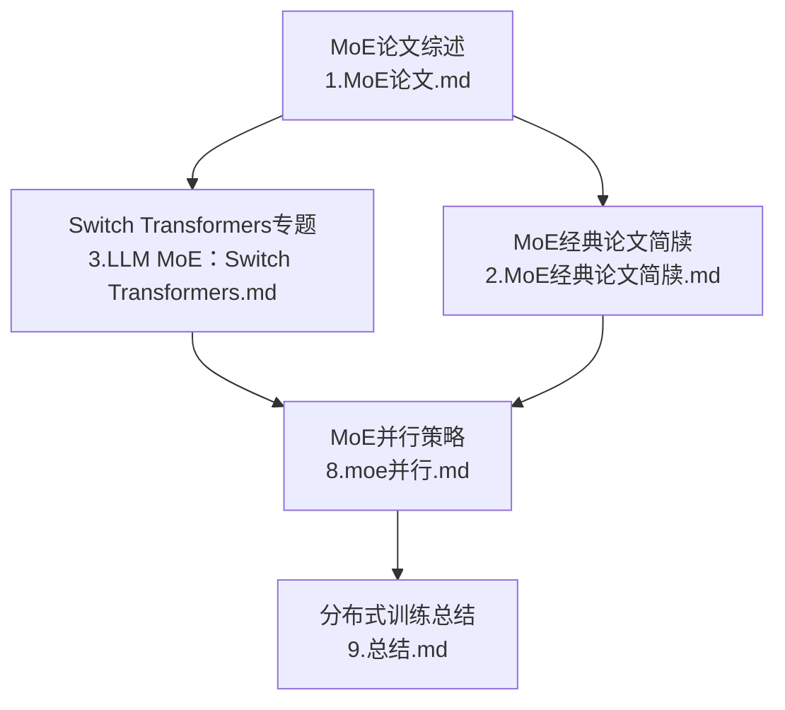
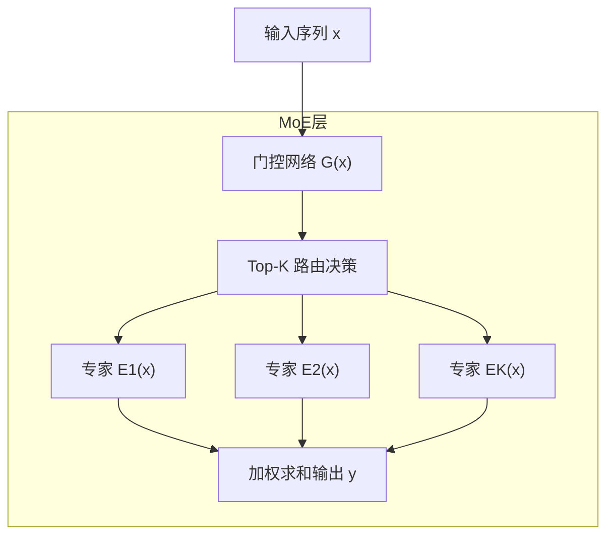
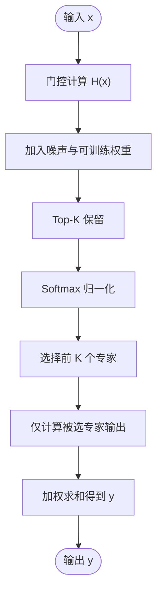
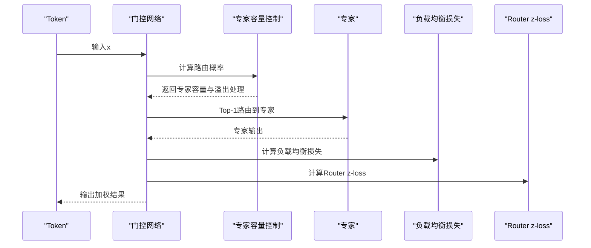
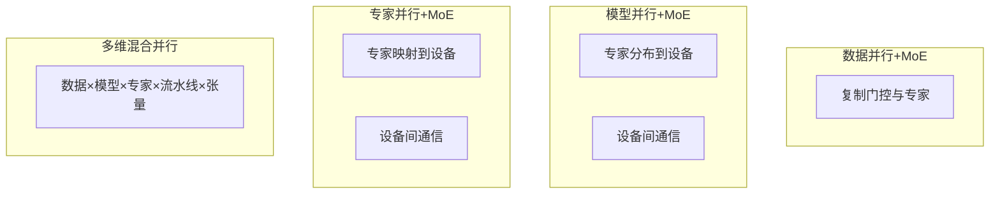
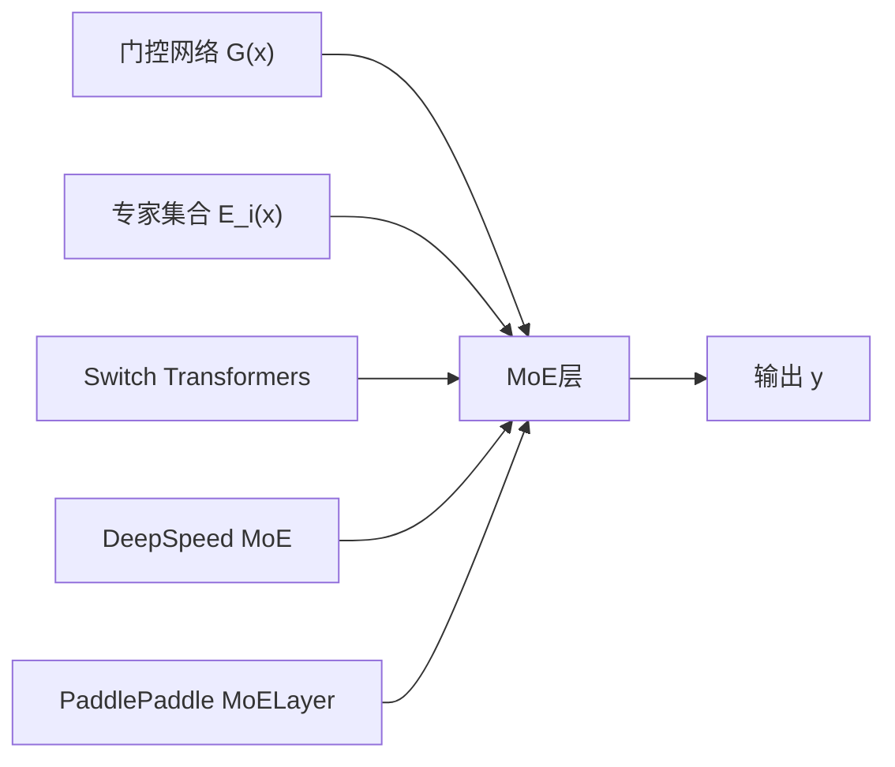

# MoE架构

<cite>
**本文引用的文件**
- [MoE论文.md](file://02.大语言模型架构/1.MoE论文/1.MoE论文.md)
- [MoE经典论文简牍.md](file://02.大语言模型架构/2.MoE经典论文简牍/2.MoE经典论文简牍.md)
- [LLM MoE：Switch Transformers.md](file://02.大语言模型架构/3.LLM MoE ：Switch Transformers/3.LLM MoE ：Switch Transformers.md)
- [moe并行.md](file://04.分布式训练/8.moe并行/8.moe并行.md)
- [分布式训练总结.md](file://04.分布式训练/9.总结/9.总结.md)
</cite>

## 更新摘要
**变更内容**
- 扩展了Switch Transformers架构的详细分析，包括容量因子影响机制
- 新增了负载均衡损失的数学公式和计算方法
- 补充了混合精度训练策略的详细说明
- 增加了专家dropout等高级训练技术的深入解析
- 完善了MoE模型的训练方法与优化策略

## 目录
1. [简介](#简介)
2. [项目结构](#项目结构)
3. [核心组件](#核心组件)
4. [架构总览](#架构总览)
5. [详细组件分析](#详细组件分析)
6. [依赖关系分析](#依赖关系分析)
7. [性能考量](#性能考量)
8. [故障排查指南](#故障排查指南)
9. [结论](#结论)
10. [附录](#附录)

## 简介
本文件围绕Mixture of Experts（MoE，专家混合）架构展开，系统阐述其基本原理、专家网络与门控机制设计、Switch Transformers的路由策略与负载均衡、稀疏激活与通信开销、训练方法与扩展性优势，并结合仓库中的论文与分布式训练资料，提供实现要点与优化策略，覆盖在大语言模型中的应用前景。

## 项目结构
本仓库与MoE相关的核心内容主要集中在"大语言模型架构"和"分布式训练"两大板块：
- "大语言模型架构"包含MoE论文综述、Switch Transformers专题、MoE经典论文简牍等；
- "分布式训练"包含MoE并行策略、框架集成示例与训练总结。

**图表来源**
- [MoE论文.md:1-238](file://02.大语言模型架构/1.MoE论文/1.MoE论文.md#L1-L238)
- [LLM MoE：Switch Transformers.md:1-323](file://02.大语言模型架构/3.LLM MoE ：Switch Transformers/3.LLM MoE ：Switch Transformers.md#L1-L323)
- [MoE经典论文简牍.md:1-359](file://02.大语言模型架构/2.MoE经典论文简牍/2.MoE经典论文简牍.md#L1-L359)
- [moe并行.md:1-317](file://04.分布式训练/8.moe并行/8.moe并行.md#L1-L317)
- [分布式训练总结.md:1-125](file://04.分布式训练/9.总结/9.总结.md#L1-L125)

**章节来源**
- [MoE论文.md:1-238](file://02.大语言模型架构/1.MoE论文/1.MoE论文.md#L1-L238)
- [LLM MoE：Switch Transformers.md:1-323](file://02.大语言模型架构/3.LLM MoE ：Switch Transformers/3.LLM MoE ：Switch Transformers.md#L1-L323)
- [MoE经典论文简牍.md:1-359](file://02.大语言模型架构/2.MoE经典论文简牍/2.MoE经典论文简牍.md#L1-L359)
- [moe并行.md:1-317](file://04.分布式训练/8.moe并行/8.moe并行.md#L1-L317)
- [分布式训练总结.md:1-125](file://04.分布式训练/9.总结/9.总结.md#L1-L125)

## 核心组件
- 专家网络（Experts）
  - 专家是独立的前馈子网络，通常与MoE层中的其他专家共享结构但参数独立。
  - 在大模型中，专家数量可达数千，单次前向仅激活少量专家，实现稀疏激活。
- 门控网络（Gating Network）
  - 根据输入动态计算每个专家的权重，常用Softmax Top-K策略，引入噪声以促进负载均衡。
  - 门控输出在数学上体现为对专家输出的加权求和，稀疏性由Top-K保留的权重决定。
- 路由策略（Routing）
  - Switch Transformers采用Top-1路由，使MoE层计算效率最高；其他工作常采用Top-2或Top-K。
  - 专家容量（Expert Capacity）用于控制每个专家处理的token数量，避免溢出并减少通信。
- 负载均衡与稳定性
  - 重要度损失（Importance Loss）与负载均衡损失（Load Balancing Loss）缓解"赢者通吃"。
  - Router z-loss稳定路由logits，混合精度（如bfloat16）与更小初始化提升训练稳定性。
- 分布式并行
  - 数据并行+MoE、模型并行+MoE、专家并行+MoE、以及多维混合并行（数据×模型×专家×流水线×张量）。
  - 框架集成：PaddlePaddle MoELayer、DeepSpeed MoE层与ZeRO Offload组合。

**章节来源**
- [MoE论文.md:78-144](file://02.大语言模型架构/1.MoE论文/1.MoE论文.md#L78-L144)
- [LLM MoE：Switch Transformers.md:62-323](file://02.大语言模型架构/3.LLM MoE ：Switch Transformers/3.LLM MoE ：Switch Transformers.md#L62-L323)
- [MoE经典论文简牍.md:154-359](file://02.大语言模型架构/2.MoE经典论文简牍/2.MoE经典论文简牍.md#L154-L359)
- [moe并行.md:25-317](file://04.分布式训练/8.moe并行/8.moe并行.md#L25-L317)
- [分布式训练总结.md:46-125](file://04.分布式训练/9.总结/9.总结.md#L46-L125)

## 架构总览
下图展示MoE在Transformer中的典型位置与交互：门控网络根据输入token选择专家，专家仅对被选中的token进行计算，其余token跳过专家计算并通过残差连接传递。

**图表来源**
- [MoE论文.md:80-100](file://02.大语言模型架构/1.MoE论文/1.MoE论文.md#L80-L100)
- [LLM MoE：Switch Transformers.md:85-96](file://02.大语言模型架构/3.LLM MoE ：Switch Transformers/3.LLM MoE ：Switch Transformers.md#L85-L96)

## 详细组件分析

### 1) 专家网络与门控机制
- 专家网络
  - 结构一致、参数独立，便于并行扩展与容量控制。
  - 在大模型中，专家数量可达数千，单token仅激活少量专家，实现条件计算与稀疏激活。
- 门控网络
  - Softmax Gating：非稀疏门控，权重和为1。
  - Noise Top-K Gating：在Softmax前加入高斯噪声与可训练权重矩阵，保留Top-K权重，其余置零，实现稀疏性与负载均衡。
- 数学表达
  - MoE输出：y = Σ G(x)_i · E_i(x)
  - 门控：G(x) = Softmax(KeepTopK(H(x), k))
  - H(x)_i = (x·W_g)_i + ε·Softplus((x·W_noise)_i)

**图表来源**
- [MoE论文.md:113-144](file://02.大语言模型架构/1.MoE论文/1.MoE论文.md#L113-L144)

**章节来源**
- [MoE论文.md:78-144](file://02.大语言模型架构/1.MoE论文/1.MoE论文.md#L78-L144)

### 2) Switch Transformers的路由与负载均衡
- 路由策略
  - Switch Transformers采用Top-1路由，每次仅选择1个专家，最大化稀疏性与计算效率。
  - 专家容量（Expert Capacity）= (tokens/batch)/num_experts × capacity_factor；容量因子过大导致资源浪费，过小导致溢出。
- 负载均衡损失
  - 通过辅助损失项最小化Σ f_i · P_i，其中f_i为被路由到专家i的token占比，P_i为路由概率，α为超参数。
- 训练稳定性与精度
  - 混合精度：路由器输入使用float32，其余使用bfloat16；或使用float32训练路由器，以稳定指数类路由计算。
  - 更小初始化：减小权重初始化尺度，提升训练稳定性。
- 微调正则化
  - 增加专家层dropout（expert dropout），缓解过拟合；提高学习率、降低batch size。

**图表来源**
- [LLM MoE：Switch Transformers.md:97-184](file://02.大语言模型架构/3.LLM MoE ：Switch Transformers/3.LLM MoE ：Switch Transformers.md#L97-L184)

**章节来源**
- [LLM MoE：Switch Transformers.md:62-323](file://02.大语言模型架构/3.LLM MoE ：Switch Transformers/3.LLM MoE ：Switch Transformers.md#L62-L323)

### 3) 分布式并行与通信开销
- 并行策略
  - 数据并行+MoE：门控与专家复制到各设备，适合小规模专家；受单卡显存限制。
  - 模型并行+MoE：专家分布到不同设备，引入额外通信；可扩展专家数量。
  - 专家并行+MoE：专家映射到设备，数据切分，适合大规模专家。
  - 多维混合并行：数据×模型×专家×流水线×张量组合，平衡通信与内存。
- 框架集成
  - PaddlePaddle MoELayer：封装专家列表与门控配置，支持分布式组通信。
  - DeepSpeed MoE：支持多种并行形式，可与ZeRO Offload组合，降低显存占用。
- 通信与负载
  - 路由通信：Top-1路由减少通信；Top-2路由增加通信与带宽压力。
  - 专家容量与溢出：容量因子控制溢出，避免跳过计算导致的信息丢失。

**图表来源**
- [moe并行.md:25-49](file://04.分布式训练/8.moe并行/8.moe并行.md#L25-L49)
- [分布式训练总结.md:46-125](file://04.分布式训练/9.总结/9.总结.md#L46-L125)

**章节来源**
- [moe并行.md:1-317](file://04.分布式训练/8.moe并行/8.moe并行.md#L1-L317)
- [分布式训练总结.md:1-125](file://04.分布式训练/9.总结/9.总结.md#L1-L125)

### 4) 训练方法与扩展性
- 训练方法
  - 反向传播联合训练门控与专家；重要度损失与负载均衡损失稳定训练。
  - Router z-loss稳定路由logits；混合精度与更小初始化提升稳定性。
- 扩展性优势
  - 在相同计算预算下扩大模型规模与数据规模；Switch Transformers在相同FLOPs下实现更高样本效率。
  - 专家数量增加带来收益递减，可通过增大模型维度（d_model、d_ff）继续提升效果，配合并行技术解决显存与通信瓶颈。

**章节来源**
- [MoE论文.md:145-238](file://02.大语言模型架构/1.MoE论文/1.MoE论文.md#L145-L238)
- [LLM MoE：Switch Transformers.md:252-323](file://02.大语言模型架构/3.LLM MoE ：Switch Transformers/3.LLM MoE ：Switch Transformers.md#L252-L323)

## 依赖关系分析
- MoE层依赖门控网络与专家集合；门控网络与专家共同参与反向传播。
- Switch Transformers在MoE基础上引入更严格的路由与损失设计，降低通信与计算成本。
- 分布式训练依赖框架API（如MoELayer、DeepSpeed MoE）与并行策略组合，形成端到端的可扩展训练管线。

**图表来源**
- [MoE论文.md:80-100](file://02.大语言模型架构/1.MoE论文/1.MoE论文.md#L80-L100)
- [LLM MoE：Switch Transformers.md:62-96](file://02.大语言模型架构/3.LLM MoE ：Switch Transformers/3.LLM MoE ：Switch Transformers.md#L62-L96)
- [moe并行.md:92-180](file://04.分布式训练/8.moe并行/8.moe并行.md#L92-L180)

**章节来源**
- [MoE论文.md:1-238](file://02.大语言模型架构/1.MoE论文/1.MoE论文.md#L1-L238)
- [LLM MoE：Switch Transformers.md:1-323](file://02.大语言模型架构/3.LLM MoE ：Switch Transformers/3.LLM MoE ：Switch Transformers.md#L1-L323)
- [moe并行.md:1-317](file://04.分布式训练/8.moe并行/8.moe并行.md#L1-L317)

## 性能考量
- 计算效率
  - Top-1路由（Switch Transformers）在MoE层计算效率上最优；Top-2路由提升负载均衡但增加通信与计算开销。
- 内存与通信
  - 专家容量因子需权衡：过小导致溢出，过大导致资源浪费；溢出通常通过残差连接传递，避免跳过计算。
- 精度与稳定性
  - 混合精度：bfloat16为主，路由器输入使用float32；或采用Router z-loss稳定logits。
  - 更小初始化与专家dropout缓解过拟合与训练不稳定。
- 并行策略选择
  - 单机多卡：优先考虑ZeRO或TP；若节点内通信快，可选PP+TP+DP。
  - 多机多卡：节点间通信快时可选ZeRO或PP+TP+DP；慢时可选DP+PP+TP+ZeRO-1。

**章节来源**
- [LLM MoE：Switch Transformers.md:201-323](file://02.大语言模型架构/3.LLM MoE ：Switch Transformers/3.LLM MoE ：Switch Transformers.md#L201-L323)
- [分布式训练总结.md:52-125](file://04.分布式训练/9.总结/9.总结.md#L52-L125)

## 故障排查指南
- 训练不稳定
  - 使用Router z-loss；路由器输入使用更高精度；减小权重初始化尺度。
- 过拟合风险
  - 增加专家层dropout（expert dropout）；提高学习率、降低batch size。
- 路由溢出与负载不均
  - 调整专家容量因子；使用负载均衡损失；检查Top-K设置与噪声强度。
- 通信瓶颈
  - 采用Top-1路由；优化并行策略组合；在框架中启用通信重叠与分桶聚合。

**章节来源**
- [LLM MoE：Switch Transformers.md:201-323](file://02.大语言模型架构/3.LLM MoE ：Switch Transformers/3.LLM MoE ：Switch Transformers.md#L201-L323)
- [MoE经典论文简牍.md:300-345](file://02.大语言模型架构/2.MoE经典论文简牍/2.MoE经典论文简牍.md#L300-L345)

## 结论
MoE通过稀疏激活与专家并行，实现了在相同计算预算下扩大模型规模与数据规模的目标；Switch Transformers以Top-1路由与负载均衡损失显著降低通信与计算成本，提升训练效率；结合分布式并行与混合精度策略，可在大模型训练中取得更优的性价比。未来在多模态与通用智能方向，MoE仍有广阔的应用前景。

## 附录
- 实现示例路径
  - PaddlePaddle MoELayer使用示例：[moe并行.md:92-180](file://04.分布式训练/8.moe并行/8.moe并行.md#L92-L180)
  - DeepSpeed MoE与ZeRO Offload组合示例：[moe并行.md:182-312](file://04.分布式训练/8.moe并行/8.moe并行.md#L182-L312)
- 关键公式路径
  - MoE输出与门控Top-K噪声：[MoE论文.md:89-144](file://02.大语言模型架构/1.MoE论文/1.MoE论文.md#L89-L144)
  - 负载均衡损失与Router z-loss：[LLM MoE：Switch Transformers.md:153-184](file://02.大语言模型架构/3.LLM MoE ：Switch Transformers/3.LLM MoE ：Switch Transformers.md#L153-L184)