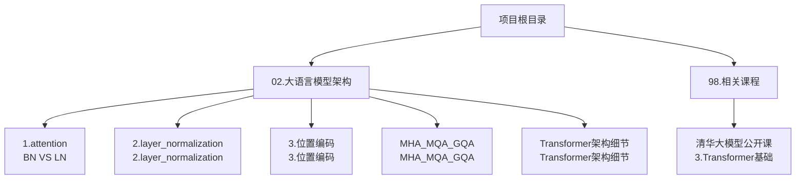
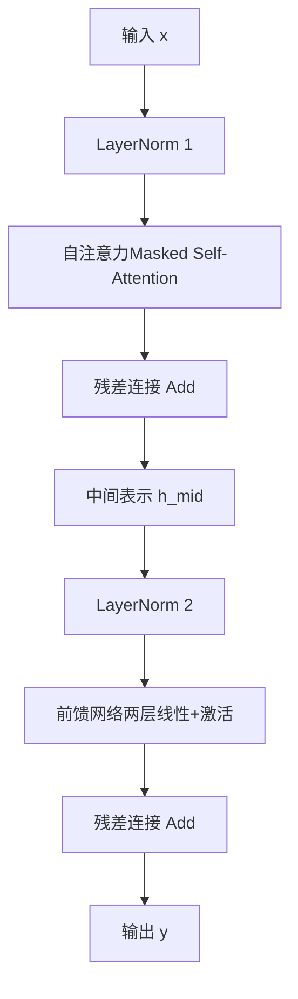
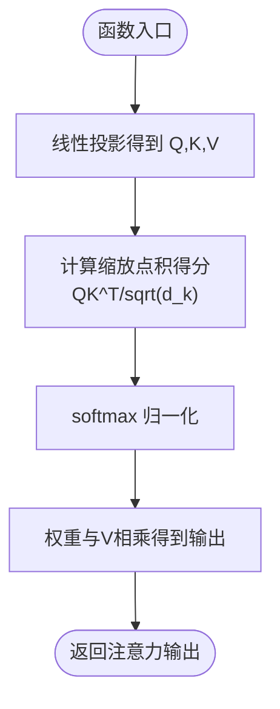
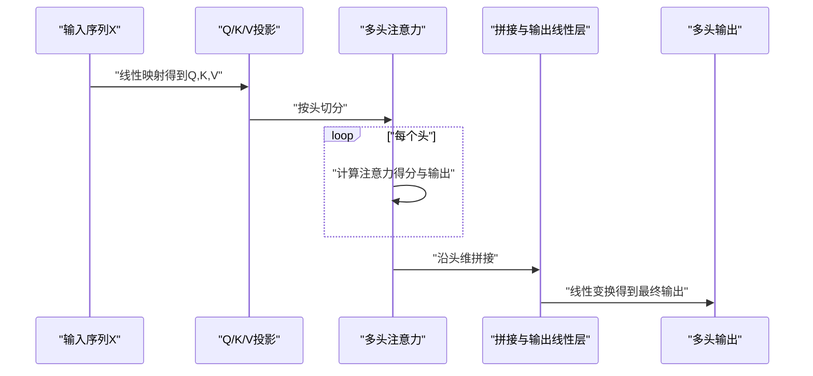
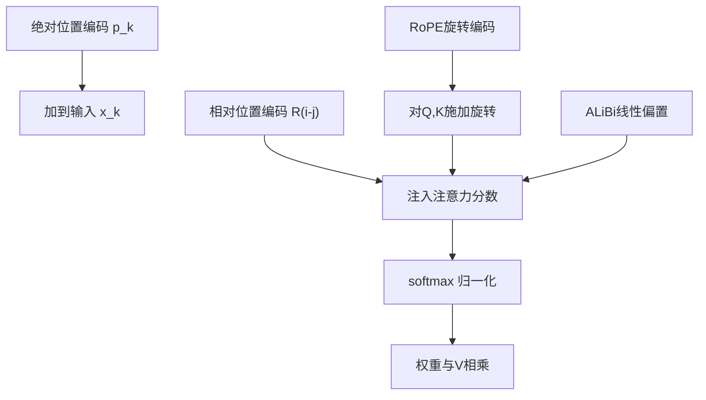
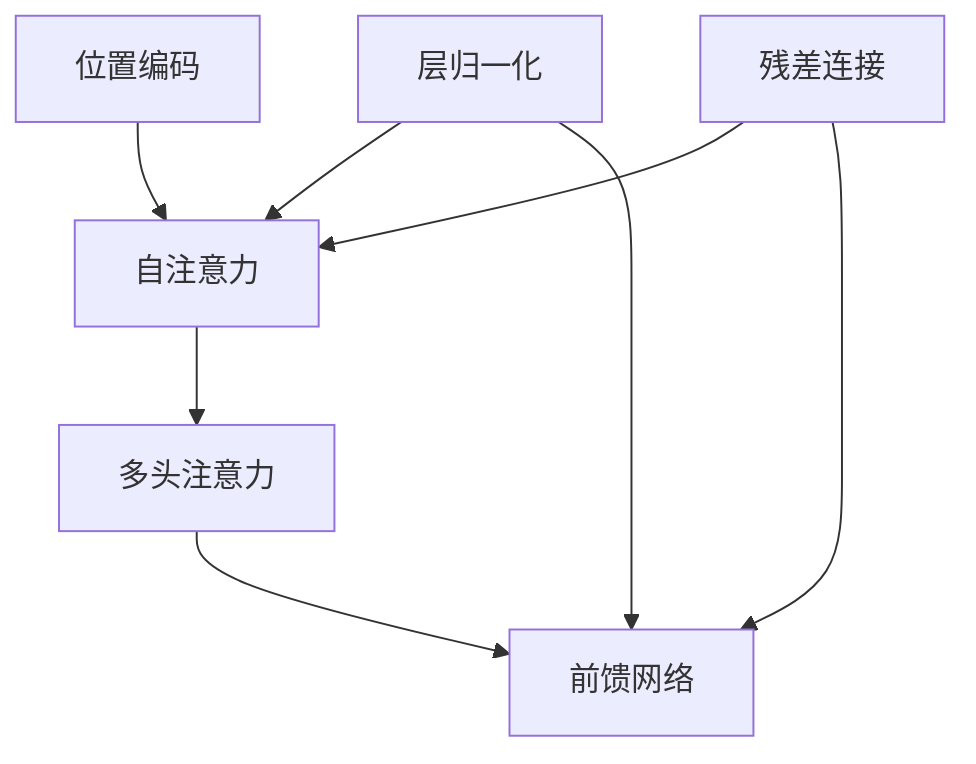

# Transformer核心机制

<cite>
**本文引用的文件**
- [Transformer架构细节.md](file://02.大语言模型架构/Transformer架构细节/Transformer架构细节.md)
- [BN VS LN.md](file://02.大语言模型架构/1.attention/BN VS LN.md)
- [2.layer_normalization.md](file://02.大语言模型架构/2.layer_normalization/2.layer_normalization.md)
- [3.位置编码.md](file://02.大语言模型架构/3.位置编码/3.位置编码.md)
- [MHA_MQA_GQA.md](file://02.大语言模型架构/MHA_MQA_GQA/MHA_MQA_GQA.md)
- [3.Transformer基础.md](file://98.相关课程/清华大模型公开课/3.Transformer基础/3.Transformer基础.md)
</cite>

## 目录
1. [引言](#引言)
2. [项目结构](#项目结构)
3. [核心组件](#核心组件)
4. [架构总览](#架构总览)
5. [详细组件分析](#详细组件分析)
6. [依赖分析](#依赖分析)
7. [性能考量](#性能考量)
8. [故障排查指南](#故障排查指南)
9. [结论](#结论)
10. [附录](#附录)

## 引言
本文件系统梳理Transformer的核心机制，围绕自注意力的计算原理、多头注意力的并行处理、层归一化的正则化作用、位置编码的序列信息注入方法，逐项给出数学推导、代码实现示例路径与性能优化策略，并辅以可视化图表帮助理解。读者可据此快速掌握Transformer的关键构件与其协同工作机制。

## 项目结构
本仓库与Transformer主题相关的内容主要分布在“大语言模型架构”与“课程资料”两大板块：
- “大语言模型架构”包含：自注意力与归一化、位置编码、多头/多查询/分组查询注意力、Transformer架构细节等专题文档
- “课程资料”包含：清华大学公开课中关于Transformer基础的推导与图示

**章节来源**
- [Transformer架构细节.md:1-321](file://02.大语言模型架构/Transformer架构细节/Transformer架构细节.md#L1-L321)
- [3.Transformer基础.md:184-247](file://98.相关课程/清华大模型公开课/3.Transformer基础/3.Transformer基础.md#L184-L247)

## 核心组件
- 自注意力（Self-Attention）
  - 通过Q、K、V三元组计算注意力权重，实现序列内任意位置间的直接关联
  - 采用缩放点积注意力以抑制softmax输入方差过大导致的梯度消失
- 多头注意力（Multi-Head Attention）
  - 将特征维切分为多个头，分别计算注意力后拼接，提升对不同子空间信息的建模能力
- 层归一化（LayerNorm）
  - 在子层前后可采用Post-Norm或Pre-Norm，显著改善深层训练稳定性与收敛速度
- 位置编码（Positional Encoding）
  - 注入序列顺序信息，支持绝对/相对位置编码、旋转位置编码（RoPE）、线性偏差（ALiBi）等
- 残差连接（Residual Connection）
  - 将子层输入与输出相加，缓解梯度消失，增强深层网络表达能力
- 前馈网络（Feed-Forward Network）
  - 两层线性变换夹带激活，扩展非线性表达能力

**章节来源**
- [Transformer架构细节.md:60-321](file://02.大语言模型架构/Transformer架构细节/Transformer架构细节.md#L60-L321)
- [BN VS LN.md:1-107](file://02.大语言模型架构/1.attention/BN VS LN.md#L1-L107)
- [2.layer_normalization.md:37-193](file://02.大语言模型架构/2.layer_normalization/2.layer_normalization.md#L37-L193)
- [3.位置编码.md:1-397](file://02.大语言模型架构/3.位置编码/3.位置编码.md#L1-L397)

## 架构总览
下图展示Decoder Block中典型的Pre-Norm结构：LN在子层前，残差连接在子层后；自注意力与前馈网络均遵循该模式。

**图示来源**
- [BN VS LN.md:82-107](file://02.大语言模型架构/1.attention/BN VS LN.md#L82-L107)

**章节来源**
- [BN VS LN.md:37-107](file://02.大语言模型架构/1.attention/BN VS LN.md#L37-L107)
- [Transformer架构细节.md:24-31](file://02.大语言模型架构/Transformer架构细节/Transformer架构细节.md#L24-L31)

## 详细组件分析

### 自注意力机制（Self-Attention）
- 计算流程
  - Q、K、V由输入经线性投影得到
  - 注意力分数为缩放点积：$ \frac{QK^T}{\sqrt{d_k}} $
  - softmax归一化得到权重矩阵
  - 输出为权重与V的矩阵乘：$ \text{Attention}(Q,K,V) = \text{softmax}(\frac{QK^T}{\sqrt{d_k}})V $
- 为什么需要缩放
  - 点积方差随维度增大而增大，softmax易饱和，梯度消失；缩放将方差拉回1，缓解该问题
- 代码实现示例路径
  - [MHA_MQA_GQA.md:33-87](file://02.大语言模型架构/MHA_MQA_GQA/MHA_MQA_GQA.md#L33-L87)

**图示来源**
- [MHA_MQA_GQA.md:21-29](file://02.大语言模型架构/MHA_MQA_GQA/MHA_MQA_GQA.md#L21-L29)

**章节来源**
- [Transformer架构细节.md:84-244](file://02.大语言模型架构/Transformer架构细节/Transformer架构细节.md#L84-L244)
- [3.Transformer基础.md:198-210](file://98.相关课程/清华大模型公开课/3.Transformer基础/3.Transformer基础.md#L198-L210)

### 多头注意力（Multi-Head Attention）
- 设计动机
  - 将特征维切分为多个头，形成多子空间，关注不同方面信息，再拼接融合
- 计算要点
  - 每个头独立计算注意力，最后沿头维拼接并通过输出线性层
  - 代码实现示例路径：[MHA_MQA_GQA.md:33-87](file://02.大语言模型架构/MHA_MQA_GQA/MHA_MQA_GQA.md#L33-L87)
- 与MQA/GQA的关系
  - MQA：仅一组KV，多查询，推理加速
  - GQA：将Q分组，组内共享KV，兼顾性能与精度
  - 代码实现示例路径：
    - [MHA_MQA_GQA.md:95-154](file://02.大语言模型架构/MHA_MQA_GQA/MHA_MQA_GQA.md#L95-L154)
    - [MHA_MQA_GQA.md:164-225](file://02.大语言模型架构/MHA_MQA_GQA/MHA_MQA_GQA.md#L164-L225)

**图示来源**
- [MHA_MQA_GQA.md:17-30](file://02.大语言模型架构/MHA_MQA_GQA/MHA_MQA_GQA.md#L17-L30)

**章节来源**
- [Transformer架构细节.md:245-257](file://02.大语言模型架构/Transformer架构细节/Transformer架构细节.md#L245-L257)
- [MHA_MQA_GQA.md:1-14](file://02.大语言模型架构/MHA_MQA_GQA/MHA_MQA_GQA.md#L1-L14)

### 层归一化（LayerNorm）与残差连接
- 为何用LN而非BN
  - NLP序列长度可变、需Padding，BN受填充污染；LN按样本内特征维归一，不受Batch影响，推理一致
- Pre-Norm vs Post-Norm
  - Pre-Norm：子层前LN，利于深层稳定训练
  - Post-Norm：子层后LN，理论上正则更强
- 代码实现示例路径
  - [BN VS LN.md:82-107](file://02.大语言模型架构/1.attention/BN VS LN.md#L82-L107)
  - [2.layer_normalization.md:37-72](file://02.大语言模型架构/2.layer_normalization/2.layer_normalization.md#L37-L72)

**图示来源**
- [BN VS LN.md:82-107](file://02.大语言模型架构/1.attention/BN VS LN.md#L82-L107)

**章节来源**
- [BN VS LN.md:8-34](file://02.大语言模型架构/1.attention/BN VS LN.md#L8-L34)
- [2.layer_normalization.md:37-72](file://02.大语言模型架构/2.layer_normalization/2.layer_normalization.md#L37-L72)

### 位置编码（Positional Encoding）
- 绝对位置编码
  - 三角函数式（正弦/余弦）：显式生成，具外推潜力；训练式：可学习，但外推性受限
  - 递归式（RNN/ODE）：具外推性但牺牲并行性
  - 相乘式：以乘法形式注入位置信息
- 相对位置编码
  - 经典式：在Q/K/V中注入相对位置偏置
  - XLNet式：将绝对位置替换为相对位置向量并引入额外参数
  - T5式：仅在注意力矩阵加可训练偏置
  - DeBERTa式：保留相对位置对Q/K的贡献
- RoPE（旋转位置编码）
  - 通过复数旋转在Q/K中显式注入相对位置信息，兼具绝对/相对编码优点
- ALiBi（Attention with Linear Biases）
  - 在注意力分数上加线性偏置，体现远距离衰减，改善长上下文外推
- 代码实现示例路径
  - [3.位置编码.md:14-43](file://02.大语言模型架构/3.位置编码/3.位置编码.md#L14-L43)
  - [3.位置编码.md:44-141](file://02.大语言模型架构/3.位置编码/3.位置编码.md#L44-L141)
  - [3.位置编码.md:194-317](file://02.大语言模型架构/3.位置编码/3.位置编码.md#L194-L317)

**图示来源**
- [3.位置编码.md:52-106](file://02.大语言模型架构/3.位置编码/3.位置编码.md#L52-L106)
- [3.位置编码.md:198-299](file://02.大语言模型架构/3.位置编码/3.位置编码.md#L198-L299)
- [3.位置编码.md:300-317](file://02.大语言模型架构/3.位置编码/3.位置编码.md#L300-L317)

**章节来源**
- [3.位置编码.md:1-193](file://02.大语言模型架构/3.位置编码/3.位置编码.md#L1-L193)

### 前馈网络（Feed-Forward Network）
- 结构
  - 两层线性变换，中间加激活（如ReLU/GELU），维度扩展（常见4倍关系）
- 作用
  - 提升非线性表达能力，扩展特征空间
- 代码实现示例路径
  - [Transformer架构细节.md:11-14](file://02.大语言模型架构/Transformer架构细节/Transformer架构细节.md#L11-L14)

**章节来源**
- [Transformer架构细节.md:11-14](file://02.大语言模型架构/Transformer架构细节/Transformer架构细节.md#L11-L14)

## 依赖分析
- 组件耦合
  - 自注意力与多头注意力紧密耦合，多头并行计算依赖统一的Q/K/V投影与拼接
  - 层归一化贯穿每个子层前后，影响梯度流动与训练稳定性
  - 位置编码与注意力分数直接耦合，决定序列顺序信息的注入方式
- 外部依赖
  - 线性代数库（如PyTorch）提供高效的矩阵乘与softmax实现
  - 归一化与激活函数作为通用算子被广泛复用

**图示来源**
- [Transformer架构细节.md:24-31](file://02.大语言模型架构/Transformer架构细节/Transformer架构细节.md#L24-L31)
- [BN VS LN.md:37-67](file://02.大语言模型架构/1.attention/BN VS LN.md#L37-L67)
- [3.位置编码.md:10-13](file://02.大语言模型架构/3.位置编码/3.位置编码.md#L10-L13)

**章节来源**
- [Transformer架构细节.md:24-31](file://02.大语言模型架构/Transformer架构细节/Transformer架构细节.md#L24-L31)
- [BN VS LN.md:37-67](file://02.大语言模型架构/1.attention/BN VS LN.md#L37-L67)
- [3.位置编码.md:10-13](file://02.大语言模型架构/3.位置编码/3.位置编码.md#L10-L13)

## 性能考量
- 并行化
  - 自注意力层采用矩阵运算一次性计算所有位置注意力，具备强并行能力；训练阶段Decoder也可并行，预测阶段因自回归逐步解码不具备并行性
- 推理效率
  - MQA/GQA通过共享KV降低参数与计算开销，适合自回归解码
  - RoPE/ALiBi等位置编码可减少显式PE存储与外推问题
- 数值稳定性
  - 缩放点积注意力与LayerNorm共同缓解softmax饱和与梯度消失
- 代码实现建议
  - 使用广播机制与张量视图减少内存拷贝
  - 合理设置head数与维度，平衡吞吐与显存

**章节来源**
- [Transformer架构细节.md:260-321](file://02.大语言模型架构/Transformer架构细节/Transformer架构细节.md#L260-L321)
- [MHA_MQA_GQA.md:89-154](file://02.大语言模型架构/MHA_MQA_GQA/MHA_MQA_GQA.md#L89-L154)
- [3.位置编码.md:194-317](file://02.大语言模型架构/3.位置编码/3.位置编码.md#L194-L317)

## 故障排查指南
- softmax梯度消失
  - 症状：训练停滞、梯度接近零
  - 原因：点积方差过大导致softmax饱和
  - 处理：启用缩放点积注意力、检查维度设置
  - 参考路径：[Transformer架构细节.md:84-244](file://02.大语言模型架构/Transformer架构细节/Transformer架构细节.md#L84-L244)
- 归一化选择错误
  - 症状：跨样本统计不稳定、推理与训练不一致
  - 原因：在NLP变长序列场景下BN不适用
  - 处理：采用LayerNorm（推荐Pre-Norm）
  - 参考路径：[BN VS LN.md:8-34](file://02.大语言模型架构/1.attention/BN VS LN.md#L8-L34)
- 位置编码外推失败
  - 症状：训练短上下文、推理长上下文效果差
  - 处理：采用RoPE/ALiBi或具备外推能力的PE方案
  - 参考路径：[3.位置编码.md:318-397](file://02.大语言模型架构/3.位置编码/3.位置编码.md#L318-L397)
- 多头/多查询实现错误
  - 症状：KV维度不匹配、广播失败
  - 处理：确保头数与维度整除关系正确，检查split_head与expand逻辑
  - 参考路径：[MHA_MQA_GQA.md:164-225](file://02.大语言模型架构/MHA_MQA_GQA/MHA_MQA_GQA.md#L164-L225)

**章节来源**
- [Transformer架构细节.md:84-244](file://02.大语言模型架构/Transformer架构细节/Transformer架构细节.md#L84-L244)
- [BN VS LN.md:8-34](file://02.大语言模型架构/1.attention/BN VS LN.md#L8-L34)
- [3.位置编码.md:318-397](file://02.大语言模型架构/3.位置编码/3.位置编码.md#L318-L397)
- [MHA_MQA_GQA.md:164-225](file://02.大语言模型架构/MHA_MQA_GQA/MHA_MQA_GQA.md#L164-L225)

## 结论
Transformer通过自注意力的全局建模、多头并行的丰富表征、层归一化的稳定训练、位置编码的顺序注入，以及残差连接与前馈网络的非线性扩展，形成了强大的序列理解与生成能力。在工程实践中，合理选择归一化范式、注意力变体与位置编码策略，是实现高性能与高稳定性的关键。

## 附录
- 数学公式速查
  - 缩放点积注意力：$ \text{Attention}(Q,K,V) = \text{softmax}(\frac{QK^T}{\sqrt{d_k}})V $
  - 多头注意力：$ \text{MultiHead}(Q,K,V) = \text{Concat}(\text{head}_1,\dots,\text{head}_h)W^O $
  - RoPE旋转：对Q/K施加角度为相对位置的二维旋转矩阵
  - ALiBi偏置：在注意力分数上按相对距离线性衰减加偏置
- 代码实现示例路径
  - [MHA_MQA_GQA.md:33-87](file://02.大语言模型架构/MHA_MQA_GQA/MHA_MQA_GQA.md#L33-L87)
  - [MHA_MQA_GQA.md:95-154](file://02.大语言模型架构/MHA_MQA_GQA/MHA_MQA_GQA.md#L95-L154)
  - [MHA_MQA_GQA.md:164-225](file://02.大语言模型架构/MHA_MQA_GQA/MHA_MQA_GQA.md#L164-L225)