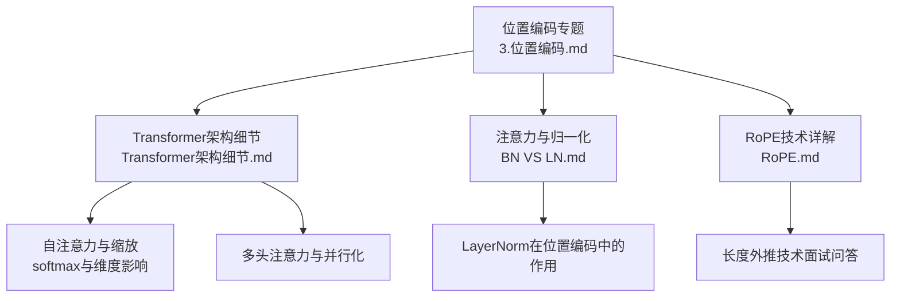
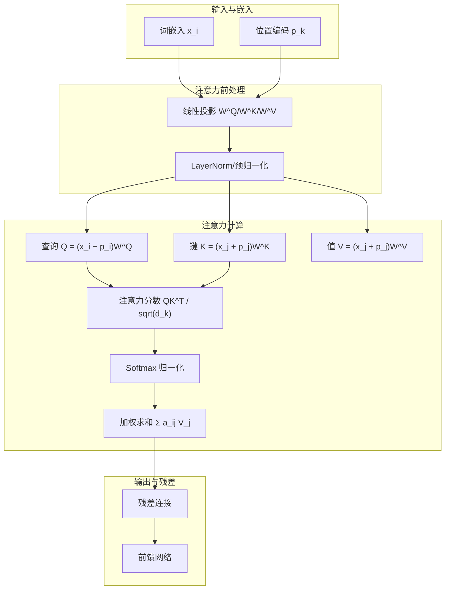
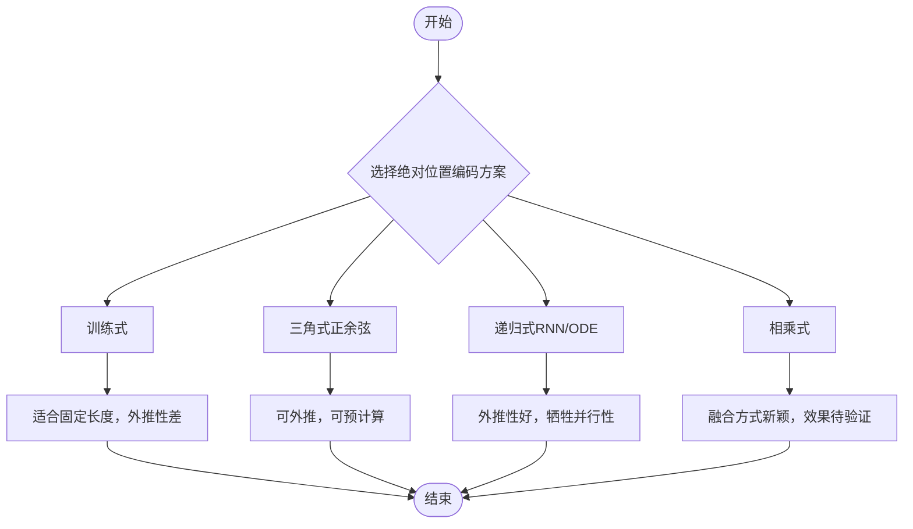
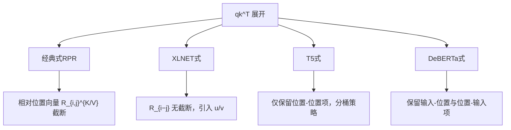
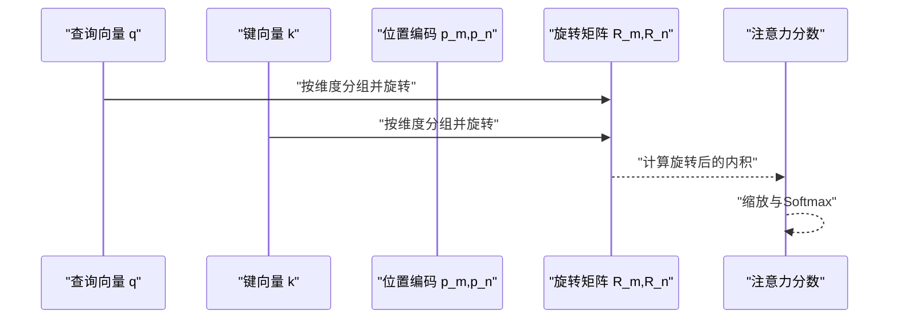
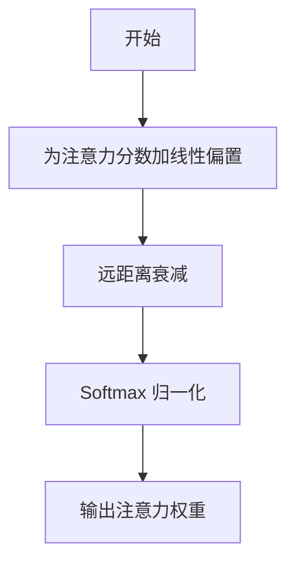
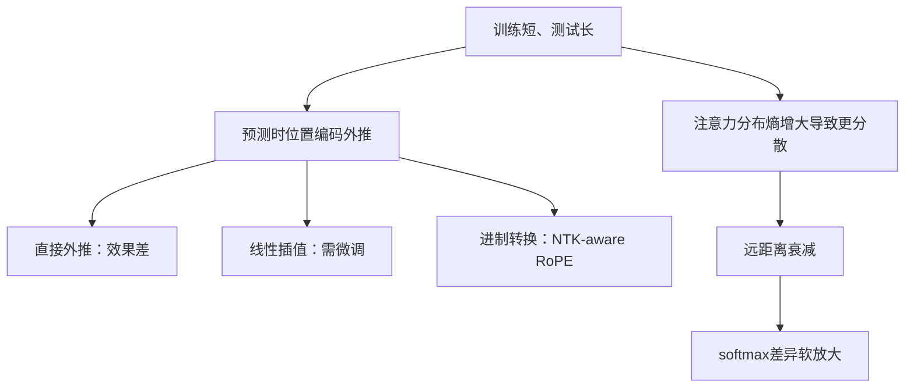
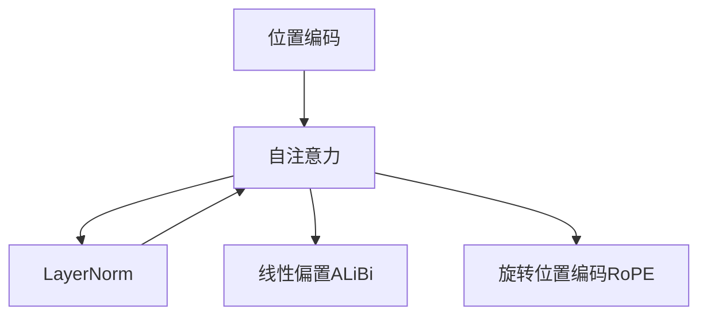

# 位置编码技术

<cite>
**本文引用的文件**
- [3.位置编码.md](file://02.大语言模型架构/3.位置编码/3.位置编码.md)
- [RoPE.md](file://02.大语言模型架构/3.位置编码/RoPE.md)
- [Transformer架构细节.md](file://02.大语言模型架构/Transformer架构细节/Transformer架构细节.md)
- [BN VS LN.md](file://02.大语言模型架构/1.attention/BN VS LN.md)
</cite>

## 目录
1. [引言](#引言)
2. [项目结构](#项目结构)
3. [核心组件](#核心组件)
4. [架构总览](#架构总览)
5. [详细组件分析](#详细组件分析)
6. [依赖分析](#依赖分析)
7. [性能考量](#性能考量)
8. [故障排查指南](#故障排查指南)
9. [结论](#结论)
10. [附录](#附录)

## 引言
本节系统梳理位置编码在Transformer中的必要性与设计原理，涵盖绝对位置编码与相对位置编码两类主流方案，并对RoPE、ALiBi等现代扩展进行深入解析。文档从数学公式与实现细节入手，解释如何在自注意力机制中注入序列位置信息，给出不同方案的优缺点对比、可视化解释与扩展应用建议，帮助读者建立从理论到实践的完整认知。

**更新** 新增了RoPE长度外推技术的详细面试问答内容，包括xPos、线性内插、NTK-Aware Scaled RoPE等技术的详细说明和数值示例。

## 项目结构
本仓库与位置编码相关的核心资料集中在"大语言模型架构"下的"位置编码"专题与"Transformer架构细节"两份文档中，辅以"注意力与归一化"专题对LN在位置编码体系中的作用进行补充说明。



图表来源
- [3.位置编码.md:1-497](file://02.大语言模型架构/3.位置编码/3.位置编码.md#L1-L497)
- [RoPE.md:1-61](file://02.大语言模型架构/3.位置编码/RoPE.md#L1-L61)
- [Transformer架构细节.md:1-321](file://02.大语言模型架构/Transformer架构细节/Transformer架构细节.md#L1-L321)
- [BN VS LN.md:1-107](file://02.大语言模型架构/1.attention/BN VS LN.md#L1-L107)

章节来源
- [3.位置编码.md:1-497](file://02.大语言模型架构/3.位置编码/3.位置编码.md#L1-L497)
- [RoPE.md:1-61](file://02.大语言模型架构/3.位置编码/RoPE.md#L1-L61)
- [Transformer架构细节.md:1-321](file://02.大语言模型架构/Transformer架构细节/Transformer架构细节.md#L1-L321)
- [BN VS LN.md:1-107](file://02.大语言模型架构/1.attention/BN VS LN.md#L1-L107)

## 核心组件
- 绝对位置编码
  - 训练式：将位置编码作为可训练参数，典型尺寸为最大长度×维度，适合直接外推但需注意长度外推性问题。
  - 三角式（正余弦）：显式生成的周期性编码，具备一定外推潜力，但实践中较少直接使用。
  - 递归式：通过RNN/ODE学习位置编码，具备较好外推性与灵活性，但牺牲并行性。
  - 相乘式：将输入与位置编码相乘而非相加，提供另一种融合方式。
- 相对位置编码
  - 经典式（RPR）：在绝对位置编码基础上，将依赖于(i,j)的向量改为仅依赖相对距离i−j，并进行截断。
  - XLNET式：完全展开qk^T项，将p替换为相对位置向量R_{i−j}，并引入u、v等可训练向量。
  - T5式：去除"输入-位置"和"位置-输入"项，仅保留"位置-位置"项并引入分桶策略。
  - DeBERTa式：去除"位置-位置"项，保留"输入-位置"和"位置-输入"项，提出"解码增强"的双阶段结构。
- 现代扩展
  - RoPE（旋转位置编码）：通过复数旋转将绝对位置信息注入q、k，使其内积中自然体现相对位置信息。
  - ALiBi（Attention with Linear Biases）：在注意力分数上直接加线性偏置，体现相对距离衰减，提升长序列外推能力。
- 长度外推问题
  - 训练与推理长度不一致导致泛化能力下降；可通过进制转换、线性插值、直接外推等方式缓解，NTK-aware RoPE等方案在不微调的情况下取得显著进展。

**更新** 新增了RoPE长度外推技术的详细分类，包括xPos、线性内插、NTK-Aware Scaled RoPE等技术的发展历程和实现细节。

章节来源
- [3.位置编码.md:10-196](file://02.大语言模型架构/3.位置编码/3.位置编码.md#L10-L196)
- [3.位置编码.md:194-317](file://02.大语言模型架构/3.位置编码/3.位置编码.md#L194-L317)
- [3.位置编码.md:318-497](file://02.大语言模型架构/3.位置编码/3.位置编码.md#L318-L497)
- [RoPE.md:41-61](file://02.大语言模型架构/3.位置编码/RoPE.md#L41-L61)

## 架构总览
下图展示位置编码在Transformer中的角色与与其他模块的交互关系，强调其在自注意力中的注入路径与对注意力分布的影响。



图表来源
- [Transformer架构细节.md:60-107](file://02.大语言模型架构/Transformer架构细节/Transformer架构细节.md#L60-L107)
- [3.位置编码.md:52-74](file://02.大语言模型架构/3.位置编码/3.位置编码.md#L52-L74)

## 详细组件分析

### 绝对位置编码
- 设计动机
  - Transformer原生注意力不具备顺序感知能力，必须通过外部手段注入位置信息。
- 实现要点
  - 训练式：将p_k作为可训练参数，适合固定长度场景；外推性受限。
  - 三角式：基于正余弦函数的显式编码，具备周期性与相对位置表达潜力。
  - 递归式：通过RNN/ODE学习p_k，兼顾外推性与灵活性，但牺牲并行性。
  - 相乘式：将x_k与p_k相乘，探索不同融合方式。
- 数学与实现细节
  - 三角式编码的分量形式与维度d的关系，以及softmax前的缩放因子。
  - 训练式编码在超过预训练长度时的处理策略与层次分解外推思路。
- 优缺点对比
  - 训练式：实现简单、速度快，但外推性差；可通过层次分解改善。
  - 三角式：可外推、可预计算，但实践中较少直接使用。
  - 递归式：外推性好、灵活，但并行性受影响。
  - 相乘式：融合方式新颖，效果待验证。



图表来源
- [3.位置编码.md:14-43](file://02.大语言模型架构/3.位置编码/3.位置编码.md#L14-L43)

章节来源
- [3.位置编码.md:10-43](file://02.大语言模型架构/3.位置编码/3.位置编码.md#L10-L43)

### 相对位置编码
- 设计动机
  - 自然语言更依赖相对位置，相对位置编码能直接体现token间的相对距离。
- 经典式（RPR）
  - 将绝对位置编码替换为相对位置向量R_{i,j}^{K/V}，并对相对距离进行截断。
  - 优点：直接体现相对位置，外推性强。
- XLNET式
  - 完全展开qk^T项，将p替换为R_{i−j}，引入u、v等可训练向量，不进行截断。
  - 优点：更灵活，适合长序列。
- T5式
  - 去除"输入-位置"和"位置-输入"项，仅保留"位置-位置"项并引入分桶策略。
  - 优点：实现简单，效果良好。
- DeBERTa式
  - 去除"位置-位置"项，保留"输入-位置"和"位置-输入"项，提出"解码增强"的双阶段结构。
  - 优点：在某些任务上优于仅用相对位置的方案。



图表来源
- [3.位置编码.md:48-141](file://02.大语言模型架构/3.位置编码/3.位置编码.md#L48-L141)

章节来源
- [3.位置编码.md:44-141](file://02.大语言模型架构/3.位置编码/3.位置编码.md#L44-L141)

### RoPE（旋转位置编码）
- 设计思想
  - 通过复数旋转将绝对位置信息注入q、k，使其内积中自然体现相对位置信息。
- 数学推导要点
  - 将q、k表示为复数形式，构造等式f(q,m)·f^*(k,n)=g(q,k,m−n)，通过初值条件与差分关系推导出旋转角度随m线性增长。
  - 二维旋转矩阵形式与多维推广，以及与三角式编码的周期性外推关系。
- 实现细节
  - 将q、k按偶数维两两分组，分别进行二维旋转；在高维时采用分块策略。
  - 注意与维度d/2的匹配与旋转矩阵的构造。
- 优缺点
  - 优点：结合绝对与相对位置编码的优势，外推性较好；在长序列上表现稳定。
  - 缺点：实现复杂度较高，需注意维度与旋转矩阵的正确性。

**更新** 新增了RoPE长度外推技术的详细发展历程：

#### RoPE长度外推技术的进化路线

**第1代：直接外推（Vanilla RoPE）**
```
训练长度：2048，推理长度：8192
处理方式：直接计算位置 2049~8192 的 RoPE
结果：💥 效果极差！
```
**原因**：当位置远超训练范围时，三角函数失去区分度，Attention 分数分布异常。

**第2代：xPos（2022）**
**改进**：引入指数衰减因子，降低长距离旋转角度。
```
原始：位置 m 的旋转角度 = m × θ
xPos：位置 m 的旋转角度 = m × θ × scale(m)
```
**特点**：保持短距离区分度，降低长距离震荡频率。

**第3代：线性内插（Position Interpolation, PI）**
**论文**：Extending Context Window of Large Language Models via Position Interpolation（Meta, 2023）
**核心思想**：将位置"压缩"到训练范围内。
```
新位置 = m × (L_train / L_test)

例：训练长度 2048，测试长度 8192
    位置 4096 → 4096 × (2048/8192) = 1024
    位置 8192 → 8192 × (2048/8192) = 2048
```
**优点**：所有位置都在训练分布内。
**缺点**：**需要微调**；短距离相邻位置的区分度下降。

**第4代：NTK-Aware Scaled RoPE（2023）**
**作者**：苏剑林（科学空间）
**核心洞察**：**RoPE 本质是一种"进制编码"**
```
高频维度 = 个位（变化快，区分短距离）
低频维度 = 百位（变化慢，区分长距离）

线性内插的问题：所有数位同等压缩 → 个位被压得太紧
NTK-RoPE 的解决：高频不变，低频压缩
```
**具体做法**：修改 base 参数
```
原始：θ_i = 1 / (base^(2i/d))
NTK：base' = base × scale^(d/(d-2))
```
**优点**：
- ✅ **无需微调**即可外推
- ✅ 短距离精度保留
- ✅ 实现简单（只需改 base 参数）

**进化路线总结**
```
直接外推（失败）
    ↓
xPos（衰减因子，缓解但不完美）
    ↓
线性内插 PI（有效但需微调）
    ↓
NTK-Aware（免微调突破）
    ↓
YaRN / Dynamic NTK（结合注意力温度优化）
```

> **一句话总结**：RoPE 外推的核心矛盾是既要让长位置"挤进"训练分布，又要保留短距离的精细区分。**NTK-RoPE 通过"进制转换"思想，对高低频维度差异化处理，实现了免微调的长文本外推**。



图表来源
- [3.位置编码.md:194-317](file://02.大语言模型架构/3.位置编码/3.位置编码.md#L194-L317)

章节来源
- [3.位置编码.md:194-317](file://02.大语言模型架构/3.位置编码/3.位置编码.md#L194-L317)
- [RoPE.md:19-40](file://02.大语言模型架构/3.位置编码/RoPE.md#L19-L40)

### ALiBi（Attention with Linear Biases）
- 设计思想
  - 在注意力分数上直接加线性偏置，偏置与相对位置差成比例，体现远距离衰减。
- 实现细节
  - 预设偏置矩阵，按头数设置衰减系数；通过softmax的差异软放大缓解远距离衰减。
- 优缺点
  - 优点：无需训练，外推性优于传统三角式编码；在长序列上表现稳定。
  - 缺点：偏置矩阵的设置与头数相关，需要合理选择m。



图表来源
- [3.位置编码.md:300-317](file://02.大语言模型架构/3.位置编码/3.位置编码.md#L300-L317)

章节来源
- [3.位置编码.md:300-317](file://02.大语言模型架构/3.位置编码/3.位置编码.md#L300-L317)

### 长度外推问题与解决方案
- 问题定义
  - 训练与推理长度不一致导致泛化能力下降；目标是"训练短、测试长"场景下的外推。
- 解决方案
  - 进制表示：通过更高基数的进制降低跨度，但维度增加。
  - 直接外推：预留维度，推理阶段替换，但训练阶段未充分学习可能导致效果不佳。
  - 线性插值：压缩范围后微调，但不同维度分布不均衡。
  - 进制转换：通过进制转换保持相邻差异，NTK-aware RoPE等方案在不微调下取得显著外推效果。
- 总结
  - 直接外推与内插若不微调效果较差；NTK-RoPE等方案在不微调下取得非平凡外推结果；加入logn集中注意力有助于提升性能。

**更新** 新增了RoPE长度外推技术的详细数值示例和对比分析。



图表来源
- [3.位置编码.md:318-497](file://02.大语言模型架构/3.位置编码/3.位置编码.md#L318-L497)

章节来源
- [3.位置编码.md:318-497](file://02.大语言模型架构/3.位置编码/3.位置编码.md#L318-L497)

## 依赖分析
- 与自注意力的关系
  - 绝对位置编码通过在Q/K/V中加入p_k，使注意力能够区分不同位置；相对位置编码通过将依赖于(i,j)的项替换为仅依赖i−j的R_{i,j}^{K/V}，直接体现相对距离。
- 与归一化的关系
  - LN在位置编码体系中起到稳定数值分布、缓解梯度消失的作用，尤其在Pre-Norm架构中更为关键。
- 与长序列的关系
  - ALiBi通过在线性偏置中体现相对距离，缓解远距离衰减；RoPE通过旋转将绝对位置信息转化为相对位置信息，提升外推能力。



图表来源
- [3.位置编码.md:52-74](file://02.大语言模型架构/3.位置编码/3.位置编码.md#L52-L74)
- [BN VS LN.md:37-67](file://02.大语言模型架构/1.attention/BN VS LN.md#L37-L67)

章节来源
- [3.位置编码.md:52-74](file://02.大语言模型架构/3.位置编码/3.位置编码.md#L52-L74)
- [BN VS LN.md:37-67](file://02.大语言模型架构/1.attention/BN VS LN.md#L37-L67)

## 性能考量
- 计算复杂度
  - 绝对位置编码（训练式/三角式）：预计算或可并行；递归式因序列依赖牺牲并行性。
  - 相对位置编码：经典式与XLNET式在计算上更灵活，但需额外存储R_{i,j}^{K/V}或u、v向量。
  - RoPE：按维度分组进行旋转，计算量与维度相关，但可利用矩阵运算并行化。
  - ALiBi：预设偏置矩阵，计算开销较小，但需按头数设置。
- 外推性
  - 三角式与RoPE具备一定外推潜力；训练式外推性差；ALiBi在外推方面优于传统三角式。
- 训练稳定性
  - LN在Pre-Norm架构中显著提升训练稳定性，有利于长序列与深层网络的收敛。

**更新** 新增了RoPE长度外推技术的性能对比分析。

## 故障排查指南
- 症状：长序列推理效果显著下降
  - 排查：确认是否使用了RoPE或ALiBi等外推友好方案；检查是否对RoPE的维度与旋转矩阵实现正确。
- 症状：训练与推理长度不一致导致困惑
  - 排查：评估是否采用进制转换或NTK-aware RoPE；确认是否需要微调以适配内插/外推策略。
- 症状：注意力分布过于分散
  - 排查：检查是否启用ALiBi的线性偏置；确认softmax的缩放因子与数值稳定性。

**更新** 新增了RoPE长度外推技术的故障排查指导。

章节来源
- [3.位置编码.md:318-497](file://02.大语言模型架构/3.位置编码/3.位置编码.md#L318-L497)

## 结论
位置编码是Transformer中不可或缺的模块，绝对与相对两类方案各有侧重：前者强调显式位置信息，后者强调相对距离表达。RoPE与ALiBi作为现代扩展，分别在相对位置表达与长序列外推方面取得突破。结合LN的稳定性与合理的外推策略，可在保证max_length内效果的同时，逐步提升长序列泛化能力。

**更新** RoPE长度外推技术的发展历程展示了从直接外推到xPos、线性内插再到NTK-Aware Scaled RoPE的技术演进，其中NTK-RoPE通过"进制转换"思想实现了免微调的长文本外推突破。

## 附录
- 实现建议
  - 绝对位置编码：优先考虑RoPE或ALiBi；若使用三角式，注意维度与周期性外推的限制。
  - 相对位置编码：经典式适合通用场景；XLNET式适合长序列；T5式适合轻量化；DeBERTa式适合特定任务。
  - 长度外推：优先采用进制转换与NTK-aware RoPE；内插需配合微调；直接外推谨慎使用。
- 可视化建议
  - 绘制注意力热力图，观察不同位置编码对远距离依赖的影响。
  - 对比不同方案在不同长度下的困惑度（PPL）与下游任务指标。
- RoPE长度外推技术对比表

| 技术名称 | 是否需要微调 | 短距离精度 | 实现复杂度 | 适用场景 |
|---------|-------------|-----------|-----------|----------|
| 直接外推 | ❌ | 差 | 简单 | 仅限小幅外推 |
| xPos | ❌ | 良好 | 简单 | 长距离增强 |
| 线性内插 | ✅ | 良好 | 中等 | 需要微调的场景 |
| NTK-Aware | ❌ | 优秀 | 简单 | 免微调长文本 |
| YaRN/Dynamic NTK | ❌ | 优秀 | 中等 | 高级长文本 |

**更新** 新增了RoPE长度外推技术的详细对比表格和应用场景分析。