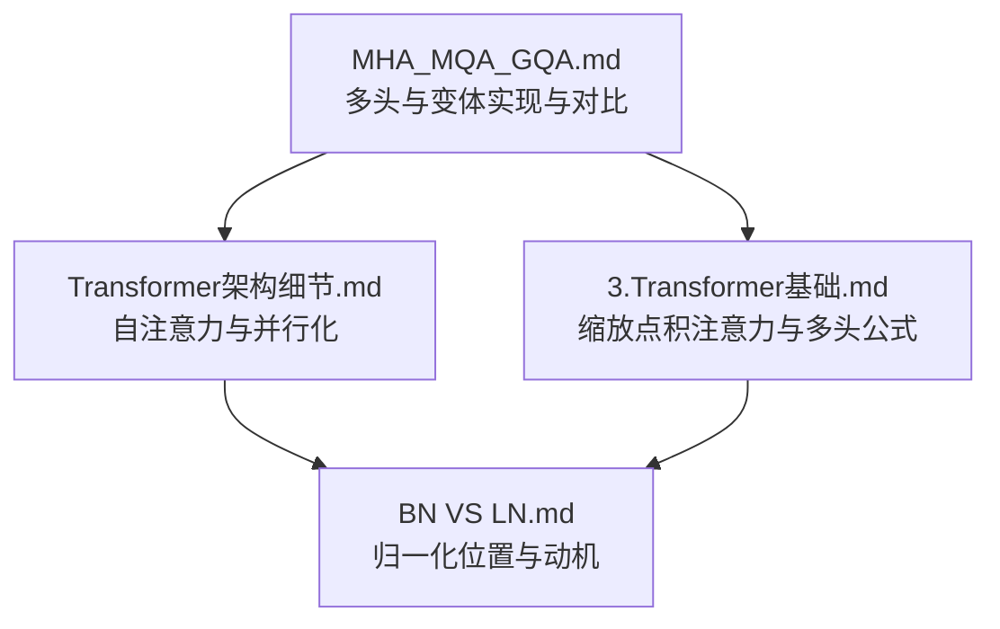
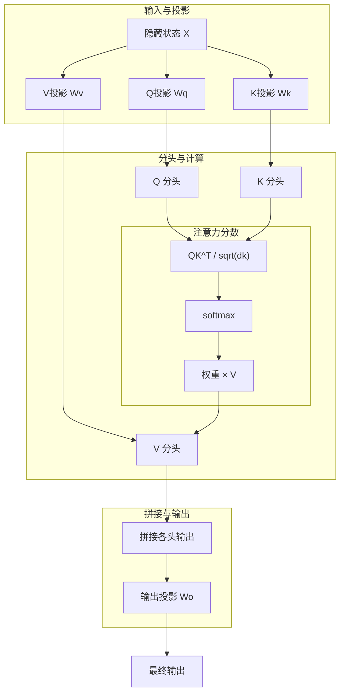
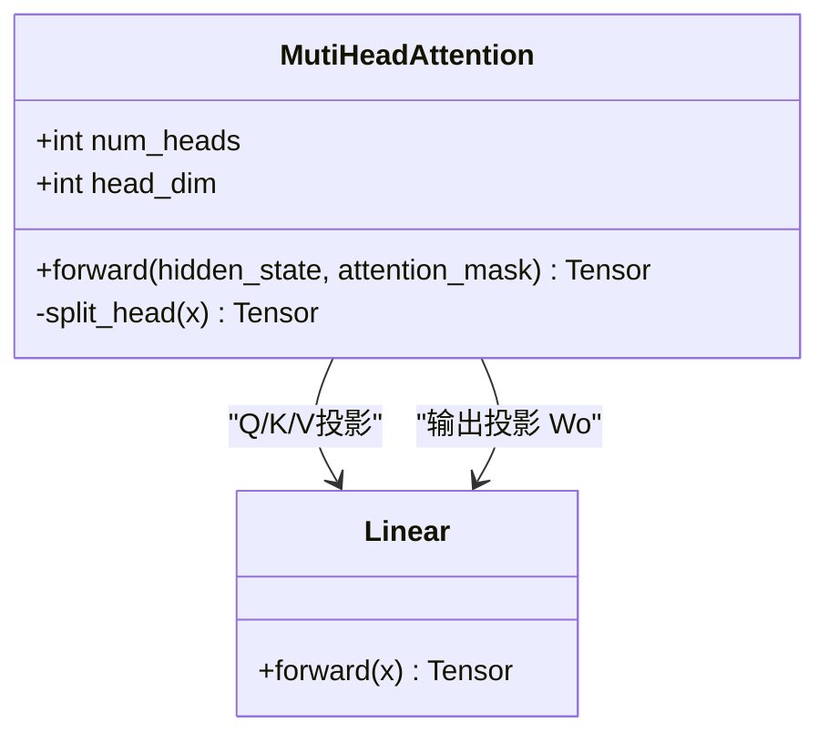
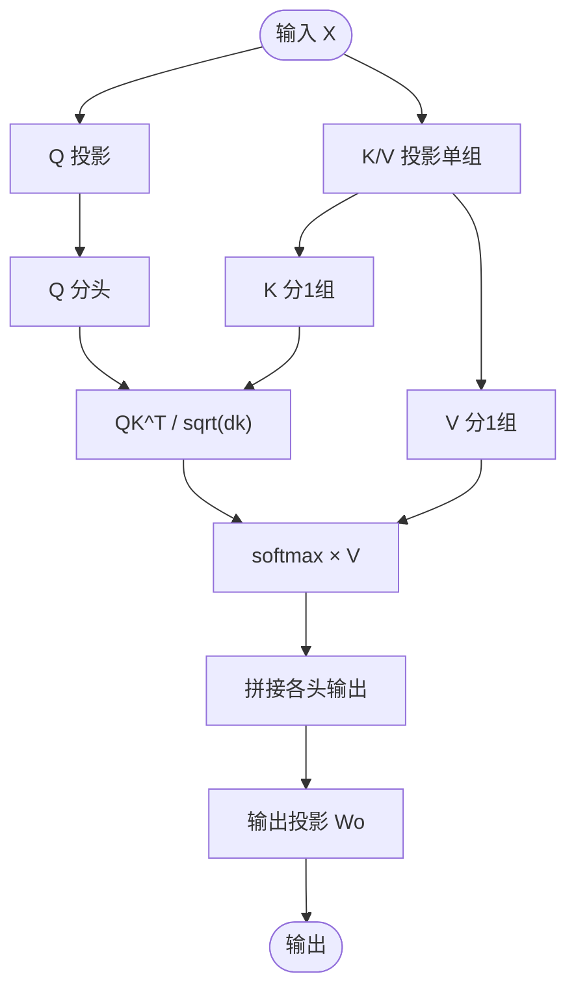
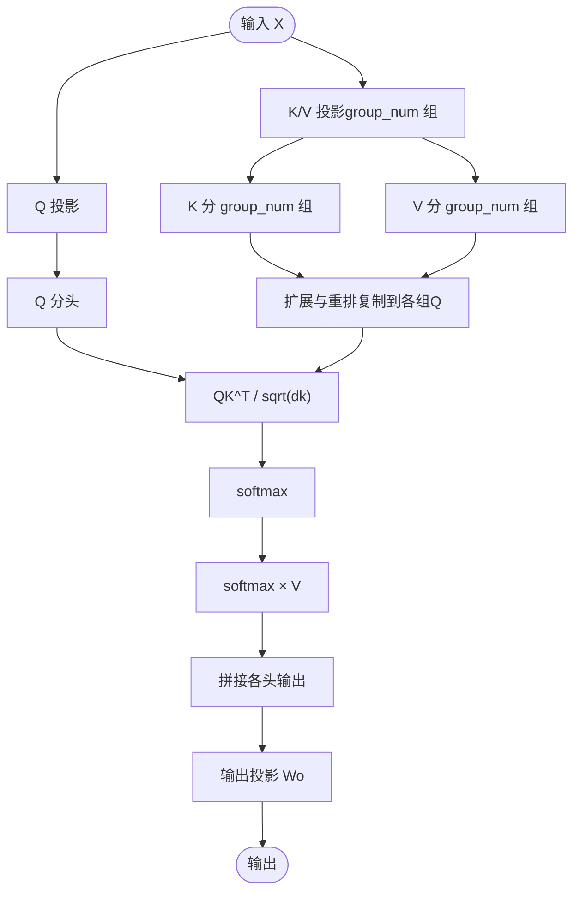
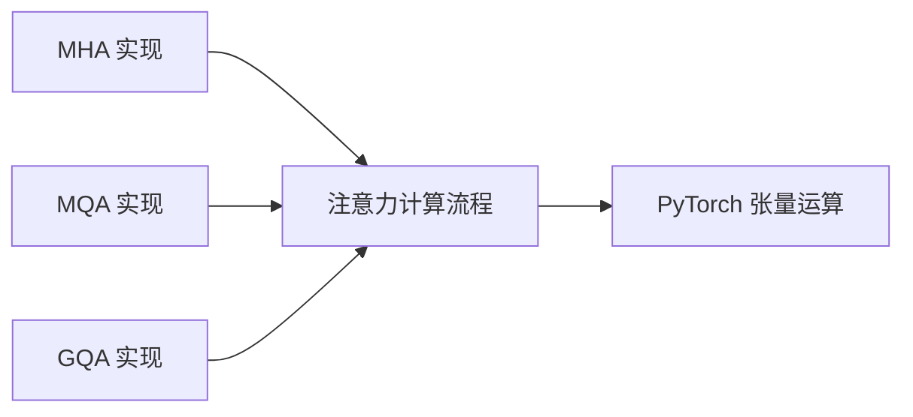

# 多头注意力机制

<cite>
**本文引用的文件**
- [MHA_MQA_GQA.md](file://02.大语言模型架构/MHA_MQA_GQA/MHA_MQA_GQA.md)
- [Transformer架构细节.md](file://02.大语言模型架构/Transformer架构细节/Transformer架构细节.md)
- [3.Transformer基础.md](file://98.相关课程/清华大模型公开课/3.Transformer基础/3.Transformer基础.md)
- [BN VS LN.md](file://02.大语言模型架构/1.attention/BN VS LN.md)
</cite>

## 目录
1. [简介](#简介)
2. [项目结构](#项目结构)
3. [核心组件](#核心组件)
4. [架构总览](#架构总览)
5. [详细组件分析](#详细组件分析)
6. [依赖分析](#依赖分析)
7. [性能考量](#性能考量)
8. [故障排查指南](#故障排查指南)
9. [结论](#结论)
10. [附录](#附录)

## 简介
本文件围绕多头注意力机制（Multi-Head Attention, MHA）及其变体（MQA、GQA）进行系统化讲解，覆盖设计原理、数学公式、并行计算策略、参数共享与头维度降维的必要性、性能对比与适用场景，并结合仓库中的实现示例路径进行说明。读者可据此理解MHA如何让模型关注不同表示子空间的信息，以及MQA/GQA在推理效率与参数规模上的折衷。

## 项目结构
本仓库与注意力机制相关的内容主要分布在以下位置：
- 多头注意力与变体实现与对比：02.大语言模型架构/MHA_MQA_GQA/MHA_MQA_GQA.md
- Transformer整体架构与自注意力细节：02.大语言模型架构/Transformer架构细节/Transformer架构细节.md
- Transformer基础与缩放点积注意力、多头注意力公式：98.相关课程/清华大模型公开课/3.Transformer基础/3.Transformer基础.md
- 归一化（LayerNorm）在注意力中的位置与动机：02.大语言模型架构/1.attention/BN VS LN.md

图表来源
- [MHA_MQA_GQA.md:1-225](file://02.大语言模型架构/MHA_MQA_GQA/MHA_MQA_GQA.md#L1-L225)
- [Transformer架构细节.md:1-321](file://02.大语言模型架构/Transformer架构细节/Transformer架构细节.md#L1-L321)
- [3.Transformer基础.md:198-247](file://98.相关课程/清华大模型公开课/3.Transformer基础/3.Transformer基础.md#L198-L247)
- [BN VS LN.md:37-107](file://02.大语言模型架构/1.attention/BN VS LN.md#L37-L107)

章节来源
- [MHA_MQA_GQA.md:1-225](file://02.大语言模型架构/MHA_MQA_GQA/MHA_MQA_GQA.md#L1-L225)
- [Transformer架构细节.md:1-321](file://02.大语言模型架构/Transformer架构细节/Transformer架构细节.md#L1-L321)
- [3.Transformer基础.md:198-247](file://98.相关课程/清华大模型公开课/3.Transformer基础/3.Transformer基础.md#L198-L247)
- [BN VS LN.md:37-107](file://02.大语言模型架构/1.attention/BN VS LN.md#L37-L107)

## 核心组件
- 多头注意力（MHA）
  - 设计要点：将隐藏维度按头数均分，每个头独立计算注意力，最后拼接并通过输出投影得到最终输出。
  - 数学公式与缩放：注意力分数经缩放点积，随后softmax归一化，再与V加权求和。
  - 并行性：自注意力层采用矩阵运算一次性计算所有token间的注意力关系，具备良好的并行潜力。
- 多查询注意力（MQA）
  - 设计要点：仅一组KV（共享），每个头拥有独立的Q；通过广播机制实现Q与共享KV的注意力计算。
  - 参数规模：显著降低KV参数量，提升推理效率。
- 分组查询注意力（GQA）
  - 设计要点：将Q按组划分，每组共享一组KV；组数需能整除头数。GQA-1等价MQA，GQA-H等价MHA。
  - 折衷：在保持MHA部分性能的同时，减少KV参数与计算开销。

章节来源
- [MHA_MQA_GQA.md:17-156](file://02.大语言模型架构/MHA_MQA_GQA/MHA_MQA_GQA.md#L17-L156)
- [MHA_MQA_GQA.md:158-224](file://02.大语言模型架构/MHA_MQA_GQA/MHA_MQA_GQA.md#L158-L224)
- [Transformer架构细节.md:245-256](file://02.大语言模型架构/Transformer架构细节/Transformer架构细节.md#L245-L256)

## 架构总览
下图展示MHA、MQA、GQA在Q/K/V投影与注意力计算上的差异，以及拼接与输出投影的整体流程。

图表来源
- [MHA_MQA_GQA.md:33-87](file://02.大语言模型架构/MHA_MQA_GQA/MHA_MQA_GQA.md#L33-L87)
- [MHA_MQA_GQA.md:95-154](file://02.大语言模型架构/MHA_MQA_GQA/MHA_MQA_GQA.md#L95-L154)
- [MHA_MQA_GQA.md:164-224](file://02.大语言模型架构/MHA_MQA_GQA/MHA_MQA_GQA.md#L164-L224)

## 详细组件分析

### 多头注意力（MHA）
- 设计原理
  - 将隐藏维度划分为若干头，每头独立计算注意力，再拼接并通过输出投影得到最终输出。
  - 通过并行计算多个头，模型可在不同子空间捕获多样信息，提升表达能力。
- 数学公式与缩放
  - 注意力分数：缩放点积注意力，避免因维度增大导致softmax饱和。
  - 归一化：softmax确保注意力权重非负且和为1。
  - 输出：注意力权重与V加权求和，再拼接各头输出并通过Wo投影。
- 实现要点
  - 分头与转置：将序列维度与头维度交换，便于矩阵乘法。
  - 掩码：可选的注意力掩码用于屏蔽无效位置（如未来信息）。
  - 拼接与输出：将各头输出按头维度拼接，再经线性层投影。

图表来源
- [MHA_MQA_GQA.md:36-83](file://02.大语言模型架构/MHA_MQA_GQA/MHA_MQA_GQA.md#L36-L83)

章节来源
- [MHA_MQA_GQA.md:19-30](file://02.大语言模型架构/MHA_MQA_GQA/MHA_MQA_GQA.md#L19-L30)
- [MHA_MQA_GQA.md:50-77](file://02.大语言模型架构/MHA_MQA_GQA/MHA_MQA_GQA.md#L50-L77)
- [3.Transformer基础.md:198-208](file://98.相关课程/清华大模型公开课/3.Transformer基础/3.Transformer基础.md#L198-L208)

### 多查询注意力（MQA）
- 设计原理
  - 仅一组KV（共享），每个头拥有独立Q；通过广播机制实现Q与共享KV的注意力计算。
  - 降低KV参数量与KV缓存，提升解码阶段的推理效率。
- 实现要点
  - Q投影维度与MHA一致，K/V投影维度仅为单头维度。
  - 分头时K/V仅分1组，随后通过广播与各头Q进行注意力计算。
  - 其余流程与MHA一致。

图表来源
- [MHA_MQA_GQA.md:99-154](file://02.大语言模型架构/MHA_MQA_GQA/MHA_MQA_GQA.md#L99-L154)

章节来源
- [MHA_MQA_GQA.md:89-156](file://02.大语言模型架构/MHA_MQA_GQA/MHA_MQA_GQA.md#L89-L156)

### 分组查询注意力（GQA）
- 设计原理
  - 将Q按组划分，每组共享一组KV；组数需能整除头数。
  - GQA-1等价MQA，GQA-H等价MHA；介于二者之间，兼顾性能与效率。
- 实现要点
  - K/V投影维度为 group_num × head_dim。
  - 分头时K/V按group_num分组，随后通过扩展与重排，使每组Q共享对应组的KV。
  - 其余流程与MHA一致。

图表来源
- [MHA_MQA_GQA.md:168-224](file://02.大语言模型架构/MHA_MQA_GQA/MHA_MQA_GQA.md#L168-L224)

章节来源
- [MHA_MQA_GQA.md:158-224](file://02.大语言模型架构/MHA_MQA_GQA/MHA_MQA_GQA.md#L158-L224)

### 自注意力与缩放点积注意力
- 自注意力机制
  - Q=K=V，直接计算序列内任意token之间的注意力关系，具备远距离依赖建模能力。
- 缩放点积注意力
  - 通过除以sqrt(dk)抑制点积方差随维度增大而发散，避免softmax饱和与梯度消失。
- 多头注意力
  - 将隐藏维度按头数均分，每个头在子空间中独立计算注意力，再拼接并通过输出投影融合。

章节来源
- [Transformer架构细节.md:60-83](file://02.大语言模型架构/Transformer架构细节/Transformer架构细节.md#L60-L83)
- [Transformer架构细节.md:84-244](file://02.大语言模型架构/Transformer架构细节/Transformer架构细节.md#L84-L244)
- [3.Transformer基础.md:198-231](file://98.相关课程/清华大模型公开课/3.Transformer基础/3.Transformer基础.md#L198-L231)

### 归一化与残差连接
- LayerNorm在Transformer中的位置
  - 现代大模型普遍采用Pre-Norm结构，子层前先归一化，再残差连接，有利于深层稳定训练。
- 与注意力的关系
  - 注意力子层与FFN子层后均有残差与归一化，保证数值稳定与梯度流动。

章节来源
- [BN VS LN.md:37-107](file://02.大语言模型架构/1.attention/BN VS LN.md#L37-L107)

## 依赖分析
- 组件耦合
  - MHA/MQA/GQA共享相同的注意力计算流程（缩放点积、softmax、加权求和、拼接与输出投影）。
  - 主要差异体现在Q/K/V的投影维度与分头策略。
- 外部依赖
  - PyTorch张量运算（矩阵乘法、转置、softmax、view/transpose等）。
  - 可选的注意力掩码（用于屏蔽未来信息或padding）。

图表来源
- [MHA_MQA_GQA.md:33-224](file://02.大语言模型架构/MHA_MQA_GQA/MHA_MQA_GQA.md#L33-L224)

章节来源
- [MHA_MQA_GQA.md:33-224](file://02.大语言模型架构/MHA_MQA_GQA/MHA_MQA_GQA.md#L33-L224)

## 性能考量
- 计算复杂度
  - 自注意力层的复杂度为O(n^2)，其中n为序列长度；多头头数h增加线性复杂度，但对单头维度d的平方增长更为敏感。
- 参数规模
  - MHA：Q/K/V投影参数量为3×d×d，拼接后输出投影为d×d。
  - MQA：K/V投影参数量为2×d×d_head，显著减少KV参数。
  - GQA：K/V投影参数量为2×d×(num_heads/group_num)×group_num，参数规模介于MHA与MQA之间。
- 推理效率
  - MQA/GQA通过共享KV降低KV缓存与KV投影开销，提升解码阶段吞吐。
  - GQA在保持较高精度的同时，兼顾参数与计算开销。
- 并行性
  - 自注意力层采用矩阵运算，可一次性计算所有token的注意力关系，具备良好并行潜力；训练与推理阶段的并行化机制详见Transformer架构细节。

章节来源
- [Transformer架构细节.md:245-256](file://02.大语言模型架构/Transformer架构细节/Transformer架构细节.md#L245-L256)
- [Transformer架构细节.md:287-321](file://02.大语言模型架构/Transformer架构细节/Transformer架构细节.md#L287-L321)
- [MHA_MQA_GQA.md:5-13](file://02.大语言模型架构/MHA_MQA_GQA/MHA_MQA_GQA.md#L5-L13)

## 故障排查指南
- 注意力掩码使用
  - 若出现信息泄漏（未来信息影响当前token），检查是否正确传入注意力掩码并对无效位置施加足够大的负值。
- 维度不匹配
  - 确保Q/K/V的头维度一致；在MQA/GQA中，K/V的头数应与分组策略一致。
- 数值不稳定
  - 若softmax输出极端分布，检查缩放因子与输入数值范围；确认归一化与残差连接顺序符合模型配置。
- 归一化位置
  - 若训练不稳定或收敛困难，确认是否采用Pre-Norm结构并正确应用LayerNorm。

章节来源
- [MHA_MQA_GQA.md:64-65](file://02.大语言模型架构/MHA_MQA_GQA/MHA_MQA_GQA.md#L64-L65)
- [BN VS LN.md:46-56](file://02.大语言模型架构/1.attention/BN VS LN.md#L46-L56)

## 结论
- MHA通过多头并行计算在不同子空间捕获多样化信息，提升模型表达能力；MQA/GQA通过参数共享与分组策略在推理效率与参数规模上做出折衷。
- 选择注意力变体时需综合考虑任务精度、参数预算与推理延迟；GQA在多数场景下提供较好的平衡点。
- 归一化与残差连接在深层Transformer中至关重要，建议采用Pre-Norm结构以提升训练稳定性。

## 附录
- 代码实现示例路径
  - MHA实现：[MHA_MQA_GQA.md:33-87](file://02.大语言模型架构/MHA_MQA_GQA/MHA_MQA_GQA.md#L33-L87)
  - MQA实现：[MHA_MQA_GQA.md:95-154](file://02.大语言模型架构/MHA_MQA_GQA/MHA_MQA_GQA.md#L95-L154)
  - GQA实现：[MHA_MQA_GQA.md:164-224](file://02.大语言模型架构/MHA_MQA_GQA/MHA_MQA_GQA.md#L164-L224)
- 数学公式与缩放点积注意力
  - [3.Transformer基础.md:198-208](file://98.相关课程/清华大模型公开课/3.Transformer基础/3.Transformer基础.md#L198-L208)
- 多头注意力公式
  - [3.Transformer基础.md:225-231](file://98.相关课程/清华大模型公开课/3.Transformer基础/3.Transformer基础.md#L225-L231)