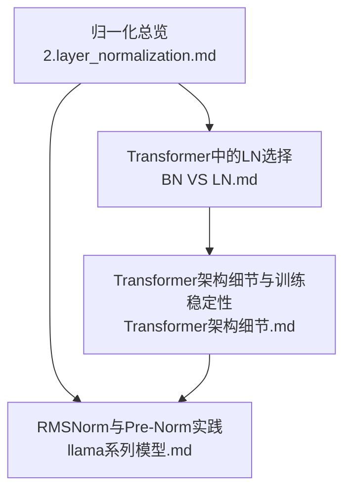
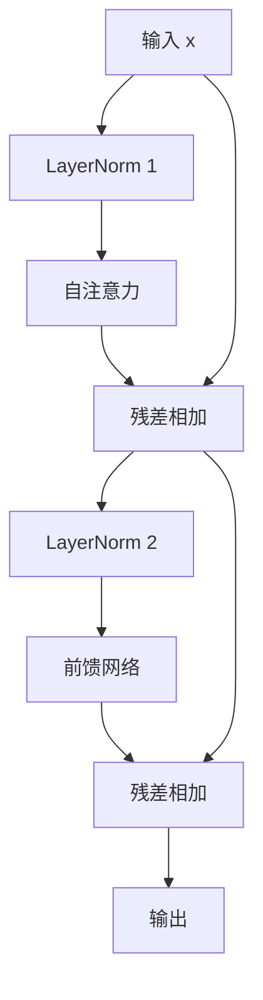
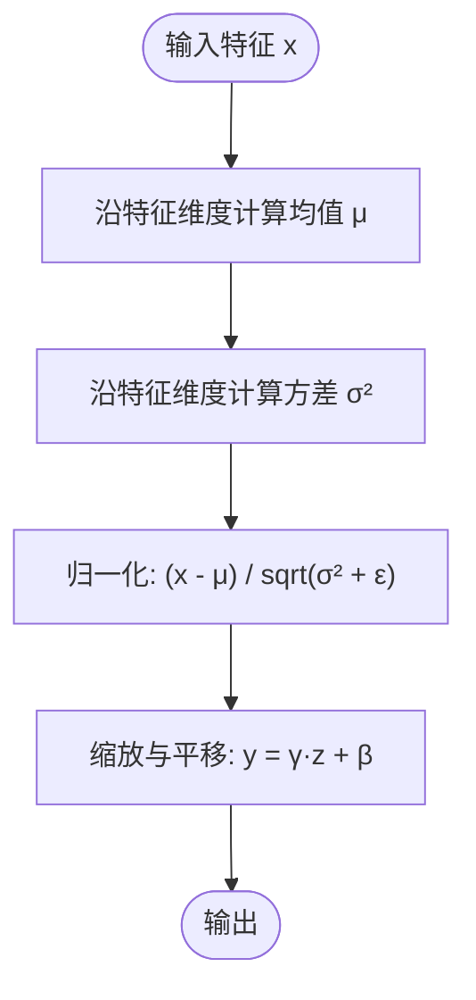
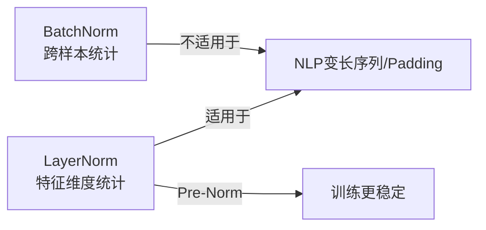
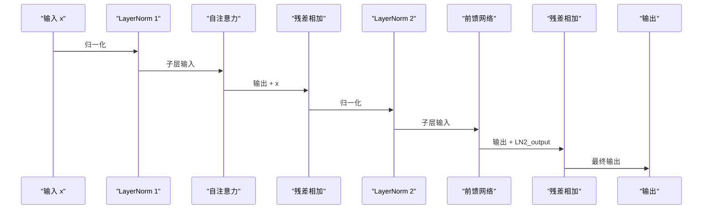
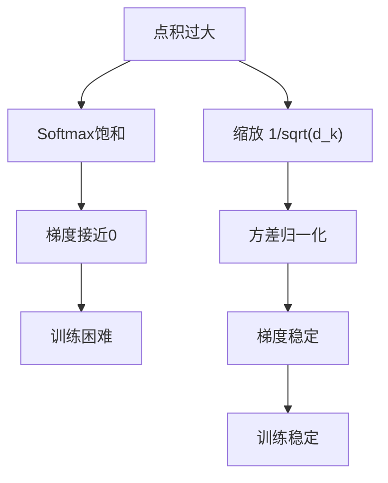
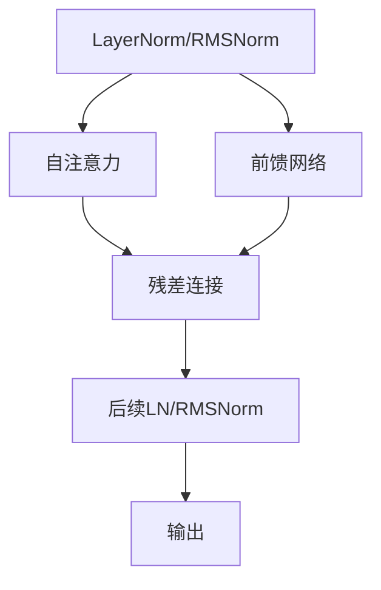

# 层归一化技术

<cite>
**本文引用的文件**
- [2.layer_normalization.md](file://02.大语言模型架构/2.layer_normalization/2.layer_normalization.md)
- [BN VS LN.md](file://02.大语言模型架构/1.attention/BN VS LN.md)
- [Transformer架构细节.md](file://02.大语言模型架构/Transformer架构细节/Transformer架构细节.md)
- [llama系列模型.md](file://02.大语言模型架构/llama系列模型/llama系列模型.md)
</cite>

## 目录
1. [引言](#引言)
2. [项目结构](#项目结构)
3. [核心组件](#核心组件)
4. [架构总览](#架构总览)
5. [详细组件分析](#详细组件分析)
6. [依赖分析](#依赖分析)
7. [性能考量](#性能考量)
8. [故障排查指南](#故障排查指南)
9. [结论](#结论)
10. [附录](#附录)

## 引言
本文件系统性梳理层归一化（Layer Normalization, LN）的数学原理、实现机制与在Transformer中的应用，重点对比Batch Normalization（BN）与LN在NLP场景下的适用性差异，解释LN如何缓解梯度消失、提升训练稳定性，并给出与RMSNorm、Deep Norm等变体的关系与实践建议。内容基于仓库中的文档整理而成，适合对NLP与大模型训练感兴趣的读者循序渐进掌握。

## 项目结构
围绕层归一化主题，仓库中与之直接相关的核心文档包括：
- 归一化方法总览与对比：2.layer_normalization.md
- Transformer中为何选LN：BN VS LN.md
- Transformer架构细节与训练稳定性：Transformer架构细节.md
- LLaMA/RMSNorm/Pre-Norm实践：llama系列模型.md

图表来源
- [2.layer_normalization.md:1-193](file://02.大语言模型架构/2.layer_normalization/2.layer_normalization.md#L1-L193)
- [BN VS LN.md:1-107](file://02.大语言模型架构/1.attention/BN VS LN.md#L1-L107)
- [Transformer架构细节.md:1-321](file://02.大语言模型架构/Transformer架构细节/Transformer架构细节.md#L1-L321)
- [llama系列模型.md:100-131](file://02.大语言模型架构/llama系列模型/llama系列模型.md#L100-L131)

章节来源
- [2.layer_normalization.md:1-193](file://02.大语言模型架构/2.layer_normalization/2.layer_normalization.md#L1-L193)
- [BN VS LN.md:1-107](file://02.大语言模型架构/1.attention/BN VS LN.md#L1-L107)
- [Transformer架构细节.md:1-321](file://02.大语言模型架构/Transformer架构细节/Transformer架构细节.md#L1-L321)
- [llama系列模型.md:100-131](file://02.大语言模型架构/llama系列模型/llama系列模型.md#L100-L131)

## 核心组件
- 层归一化（LayerNorm）：对特征维度进行0均值、1方差归一化，公式为
  $$
  y = \frac{x - \mathbb{E}(x)}{\sqrt{\text{Var}(x) + \epsilon}} \cdot \gamma + \beta
  $$
  适用于NLP变长序列、推理一致性与Pre-Norm结构。
- RMSNorm：去除均值中心化，仅使用RMS缩放，公式为
  $$
  \bar{a}_i = \frac{a_i}{\sqrt{\frac{1}{n} \sum_{i=1}^{n} a_i^2}} \cdot g_i
  $$
  在LLaMA等模型中替代LN，降低计算开销。
- Deep Norm：对Post-Norm进行改进，通过残差缩放与初始化约束抑制梯度爆炸与更新累积。
- Softmax梯度与点积放缩：解释为何需要缩放与归一化以避免梯度消失。

章节来源
- [2.layer_normalization.md:39-72](file://02.大语言模型架构/2.layer_normalization/2.layer_normalization.md#L39-L72)
- [2.layer_normalization.md:106-117](file://02.大语言模型架构/2.layer_normalization/2.layer_normalization.md#L106-L117)
- [2.layer_normalization.md:120-142](file://02.大语言模型架构/2.layer_normalization/2.layer_normalization.md#L120-L142)
- [Transformer架构细节.md:84-244](file://02.大语言模型架构/Transformer架构细节/Transformer架构细节.md#L84-L244)

## 架构总览
LN在Transformer中的位置经历了Post-Norm到Pre-Norm的演进。现代大模型普遍采用Pre-Norm，将LN置于子层之前，使梯度可通过残差直接传播，缓解深层网络的梯度消失，提升训练稳定性。

图表来源
- [BN VS LN.md:37-67](file://02.大语言模型架构/1.attention/BN VS LN.md#L37-L67)
- [BN VS LN.md:81-107](file://02.大语言模型架构/1.attention/BN VS LN.md#L81-L107)

章节来源
- [BN VS LN.md:37-67](file://02.大语言模型架构/1.attention/BN VS LN.md#L37-L67)
- [BN VS LN.md:81-107](file://02.大语言模型架构/1.attention/BN VS LN.md#L81-L107)

## 详细组件分析

### 数学原理与实现机制
- LN对特征维度进行归一化，避免跨样本统计带来的不一致，天然适配NLP的变长序列与推理一致性。
- RMSNorm去均值中心化，仅用RMS缩放，计算更高效，广泛用于LLaMA等模型。
- Deep Norm在Post-Norm基础上引入残差缩放与初始化约束，抑制深层网络的更新累积与梯度爆炸。

图表来源
- [2.layer_normalization.md:39-72](file://02.大语言模型架构/2.layer_normalization/2.layer_normalization.md#L39-L72)

章节来源
- [2.layer_normalization.md:39-72](file://02.大语言模型架构/2.layer_normalization/2.layer_normalization.md#L39-L72)
- [2.layer_normalization.md:106-117](file://02.大语言模型架构/2.layer_normalization/2.layer_normalization.md#L106-L117)
- [2.layer_normalization.md:120-142](file://02.大语言模型架构/2.layer_normalization/2.layer_normalization.md#L120-L142)

### 与BatchNormalization的区别与优势
- BN在batch维度计算统计量，依赖batch size与样本独立性，对NLP的变长序列与padding敏感。
- LN在特征维度归一化，不依赖batch间统计，天然支持变长序列、单样本推理与在线学习。
- LN在Pre-Norm结构中，梯度可直接通过残差传播，缓解深层网络的梯度消失与不稳定。

图表来源
- [BN VS LN.md:12-34](file://02.大语言模型架构/1.attention/BN VS LN.md#L12-L34)
- [BN VS LN.md:37-67](file://02.大语言模型架构/1.attention/BN VS LN.md#L37-L67)

章节来源
- [BN VS LN.md:12-34](file://02.大语言模型架构/1.attention/BN VS LN.md#L12-L34)
- [BN VS LN.md:37-67](file://02.大语言模型架构/1.attention/BN VS LN.md#L37-L67)

### 在Transformer中的应用位置与作用机制
- 原始Post-Norm：LN位于子层之后、残差之前，收敛性较好但深层易不稳定。
- 现代Pre-Norm：LN位于子层之前，梯度可直接通过残差传播，训练更稳定，便于构建更深网络。
- LLaMA等采用RMSNorm替代LN，进一步降低计算成本，位置与作用逻辑一致。

图表来源
- [BN VS LN.md:37-67](file://02.大语言模型架构/1.attention/BN VS LN.md#L37-L67)
- [llama系列模型.md:100-131](file://02.大语言模型架构/llama系列模型/llama系列模型.md#L100-L131)

章节来源
- [BN VS LN.md:37-67](file://02.大语言模型架构/1.attention/BN VS LN.md#L37-L67)
- [llama系列模型.md:100-131](file://02.大语言模型架构/llama系列模型/llama系列模型.md#L100-L131)

### 解释如何解决梯度消失与改善训练稳定性
- Softmax梯度消失：当点积过大，softmax趋于one-hot，导致梯度接近零，参数难以更新。
- 点积放缩：通过除以$\sqrt{d_k}$将方差控制在1，缓解梯度消失。
- LN/Pre-Norm：在深层网络中，LN将输入分布稳定在合理范围，Pre-Norm使梯度可直接通过残差传播，显著提升训练稳定性。

图表来源
- [Transformer架构细节.md:84-244](file://02.大语言模型架构/Transformer架构细节/Transformer架构细节.md#L84-L244)

章节来源
- [Transformer架构细节.md:84-244](file://02.大语言模型架构/Transformer架构细节/Transformer架构细节.md#L84-L244)

### 与不同归一化方法的性能对比
- BN：适合固定深度网络（如CNN），对小batch size效果差，不适用于NLP变长序列与推理。
- LN：适用于NLP，支持变长序列、单样本推理，训练更稳定。
- IN/GN：IN用于图像风格化，GN在显存受限任务中折中BN与LN。
- RMSNorm：计算更高效，广泛用于LLaMA等模型，位置与作用逻辑与LN一致。
- Deep Norm：在Post-Norm基础上抑制梯度爆炸与更新累积，兼顾性能与稳定性。

章节来源
- [2.layer_normalization.md:144-170](file://02.大语言模型架构/2.layer_normalization/2.layer_normalization.md#L144-L170)
- [2.layer_normalization.md:106-117](file://02.大语言模型架构/2.layer_normalization/2.layer_normalization.md#L106-L117)
- [2.layer_normalization.md:120-142](file://02.大语言模型架构/2.layer_normalization/2.layer_normalization.md#L120-L142)

### 实际使用场景与最佳实践
- 使用Pre-Norm结构：将LN置于子层之前，提升深层网络训练稳定性。
- 采用RMSNorm：在追求更高计算效率时，可用RMSNorm替代LN，保持相同位置与作用逻辑。
- 控制点积规模：在注意力中进行点积放缩，避免softmax饱和与梯度消失。
- 避免BN用于NLP变长序列：BN对padding敏感且需跨样本统计，不适配NLP场景。

章节来源
- [BN VS LN.md:37-67](file://02.大语言模型架构/1.attention/BN VS LN.md#L37-L67)
- [llama系列模型.md:100-131](file://02.大语言模型架构/llama系列模型/llama系列模型.md#L100-L131)
- [Transformer架构细节.md:84-244](file://02.大语言模型架构/Transformer架构细节/Transformer架构细节.md#L84-L244)

## 依赖分析
LN在Transformer中的位置与作用依赖于：
- 自注意力与前馈网络的实现细节
- 残差连接的顺序安排
- 点积缩放与softmax梯度行为
- RMSNorm的实现与参数可学习性

图表来源
- [BN VS LN.md:37-67](file://02.大语言模型架构/1.attention/BN VS LN.md#L37-L67)
- [Transformer架构细节.md:84-244](file://02.大语言模型架构/Transformer架构细节/Transformer架构细节.md#L84-L244)

章节来源
- [BN VS LN.md:37-67](file://02.大语言模型架构/1.attention/BN VS LN.md#L37-L67)
- [Transformer架构细节.md:84-244](file://02.大语言模型架构/Transformer架构细节/Transformer架构细节.md#L84-L244)

## 性能考量
- 计算开销：RMSNorm省去均值中心化，计算更高效，适合大规模推理。
- 训练稳定性：Pre-Norm结合LN/RMSNorm可显著缓解深层网络的梯度消失与不稳定。
- 点积放缩：在注意力中进行缩放，避免softmax饱和，提升训练稳定性与收敛速度。

章节来源
- [2.layer_normalization.md:106-117](file://02.大语言模型架构/2.layer_normalization/2.layer_normalization.md#L106-L117)
- [Transformer架构细节.md:84-244](file://02.大语言模型架构/Transformer架构细节/Transformer架构细节.md#L84-L244)

## 故障排查指南
- 症状：训练不稳定、梯度消失、收敛缓慢
  - 排查：确认是否采用Pre-Norm与LN/RMSNorm；检查点积缩放是否正确；确认batch size与padding处理是否合理。
- 症状：推理与训练结果差异大
  - 排查：BN需要运行时统计，LN无需运行时统计；确认是否误用BN导致推理不一致。
- 症状：显存占用高
  - 排查：RMSNorm可降低计算开销；评估是否可替换LN为RMSNorm。

章节来源
- [BN VS LN.md:27-34](file://02.大语言模型架构/1.attention/BN VS LN.md#L27-L34)
- [2.layer_normalization.md:106-117](file://02.大语言模型架构/2.layer_normalization/2.layer_normalization.md#L106-L117)

## 结论
层归一化是Transformer稳定训练的关键组件。相较BN，LN在NLP场景下具备更强的适应性与稳定性；Pre-Norm结构进一步提升了深层网络的训练效率与收敛性。RMSNorm在保持相同作用逻辑的同时降低了计算成本，广泛应用于现代大模型。通过合理的归一化位置、点积放缩与残差设计，可有效缓解梯度消失、提升训练稳定性与推理一致性。

## 附录
- 代码实现参考：RMSNorm在LLaMA中的实现与参数可学习性
- 参考资料：相关论文与仓库中的技术总结

章节来源
- [llama系列模型.md:100-131](file://02.大语言模型架构/llama系列模型/llama系列模型.md#L100-L131)
- [2.layer_normalization.md:183-193](file://02.大语言模型架构/2.layer_normalization/2.layer_normalization.md#L183-L193)