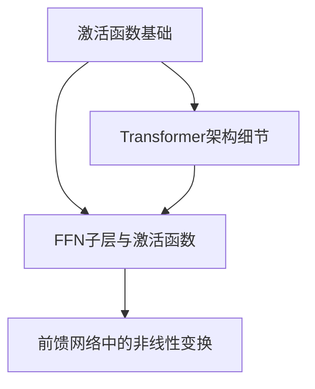
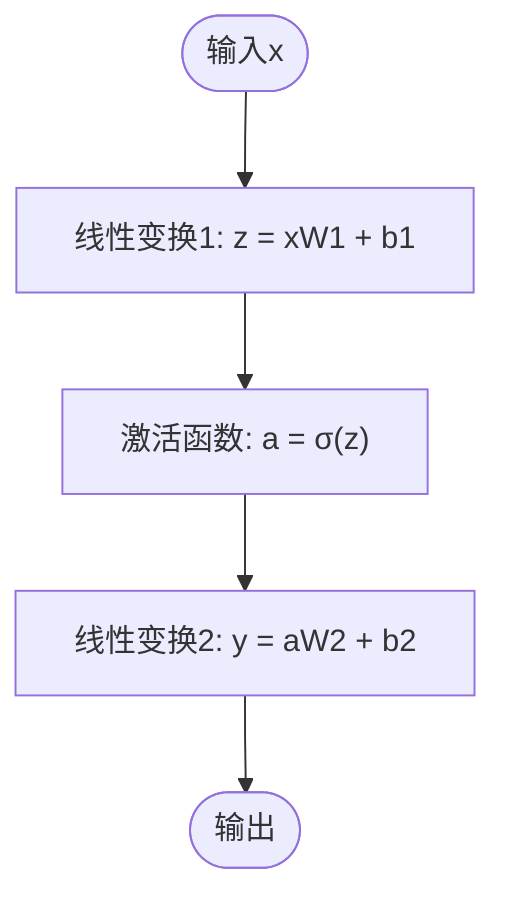
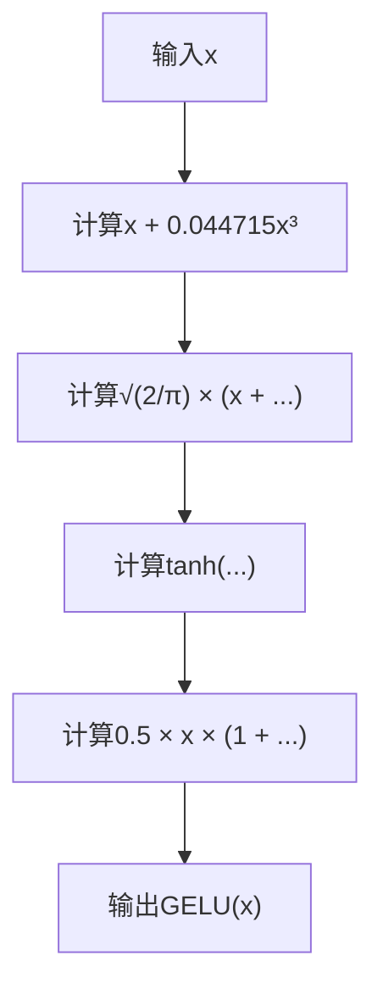
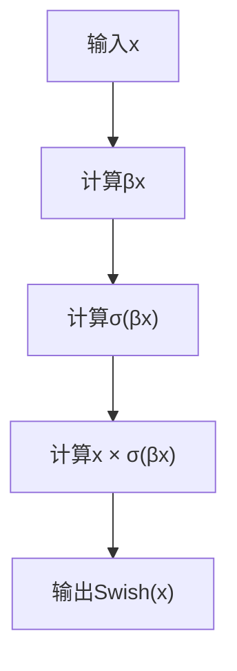
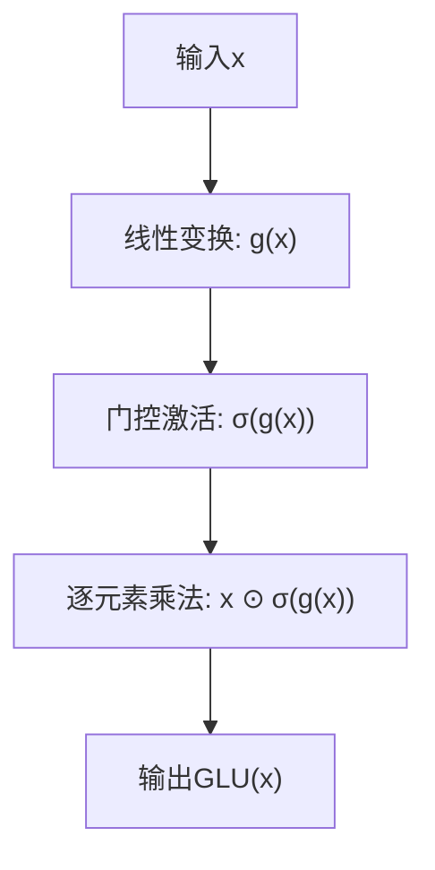
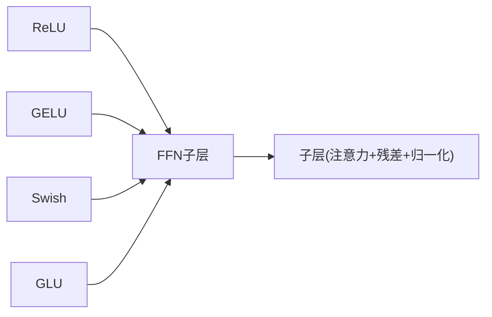

# 激活函数详解

<cite>
**本文档引用的文件**
- [02.大语言模型架构/6.激活函数/6.激活函数.md](file://02.大语言模型架构/6.激活函数/6.激活函数.md)
- [01.大语言模型基础/1.激活函数/1.激活函数.md](file://01.大语言模型基础/1.激活函数/1.激活函数.md)
- [02.大语言模型架构/Transformer架构细节/Transformer架构细节.md](file://02.大语言模型架构/Transformer架构细节/Transformer架构细节.md)
</cite>

## 目录
1. [简介](#简介)
2. [项目结构](#项目结构)
3. [核心组件](#核心组件)
4. [架构概览](#架构概览)
5. [详细组件分析](#详细组件分析)
6. [依赖分析](#依赖分析)
7. [性能考量](#性能考量)
8. [故障排查指南](#故障排查指南)
9. [结论](#结论)
10. [附录](#附录)

## 简介
本文件系统性梳理Transformer中激活函数的应用与机制，重点覆盖ReLU、GELU、Swish以及GLU等激活函数的数学原理、特点与实现要点，并结合Transformer前馈网络（FFN）子层的结构，解释非线性变换对模型表达能力的提升。同时提供不同激活函数的性能对比、最佳实践与优化建议，帮助读者在工程实践中做出合理选择。

## 项目结构
本仓库围绕“激活函数”主题提供了两套资料：
- 基础层面：系统讲解激活函数的数学原理、梯度问题与典型激活函数的特性
- 架构层面：聚焦Transformer中FFN子层的结构与激活函数的实际应用

图表来源
- [01.大语言模型基础/1.激活函数/1.激活函数.md:1-292](file://01.大语言模型基础/1.激活函数/1.激活函数.md#L1-L292)
- [02.大语言模型架构/Transformer架构细节/Transformer架构细节.md:1-321](file://02.大语言模型架构/Transformer架构细节/Transformer架构细节.md#L1-L321)
- [02.大语言模型架构/6.激活函数/6.激活函数.md:1-139](file://02.大语言模型架构/6.激活函数/6.激活函数.md#L1-L139)

章节来源
- [01.大语言模型基础/1.激活函数/1.激活函数.md:1-292](file://01.大语言模型基础/1.激活函数/1.激活函数.md#L1-L292)
- [02.大语言模型架构/Transformer架构细节/Transformer架构细节.md:1-321](file://02.大语言模型架构/Transformer架构细节/Transformer架构细节.md#L1-L321)
- [02.大语言模型架构/6.激活函数/6.激活函数.md:1-139](file://02.大语言模型架构/6.激活函数/6.激活函数.md#L1-L139)

## 核心组件
- 前馈网络（FFN）子层：由两层线性变换与一个激活函数构成，负责对注意力子层输出进行非线性变换，提升模型表达能力
- 激活函数家族：包括ReLU、GELU、Swish、GLU等，各自在数学性质、梯度行为与计算复杂度上存在差异
- Transformer中的应用：FFN在Encoder与Decoder中均有出现，维度通常按4倍关系扩展，以增强非线性能力

章节来源
- [02.大语言模型架构/6.激活函数/6.激活函数.md:5-24](file://02.大语言模型架构/6.激活函数/6.激活函数.md#L5-L24)
- [02.大语言模型架构/Transformer架构细节/Transformer架构细节.md:11-22](file://02.大语言模型架构/Transformer架构细节/Transformer架构细节.md#L11-L22)

## 架构概览
Transformer的每个子层（Encoder/Decoder）均包含：
- 子层内部：多头自注意力、前馈网络（FFN）、残差连接与层归一化（Add & Norm）
- FFN子层：两层线性变换与激活函数，维度扩展至4倍，以提升非线性表达能力

图表来源
- [02.大语言模型架构/Transformer架构细节/Transformer架构细节.md:11-31](file://02.大语言模型架构/Transformer架构细节/Transformer架构细节.md#L11-L31)

章节来源
- [02.大语言模型架构/Transformer架构细节/Transformer架构细节.md:11-31](file://02.大语言模型架构/Transformer架构细节/Transformer架构细节.md#L11-L31)

## 详细组件分析

### 前馈网络（FFN）与激活函数
- 结构：两层线性变换与一个激活函数，典型公式为：FFN(x) = σ(xW1 + b1)W2 + b2，其中σ为激活函数
- 维度扩展：FFN内部维度通常为输入维度的4倍，以增强非线性能力
- 作用：在注意力子层之后引入非线性变换，提升模型对复杂模式的拟合能力

图表来源
- [02.大语言模型架构/6.激活函数/6.激活函数.md:9-23](file://02.大语言模型架构/6.激活函数/6.激活函数.md#L9-L23)

章节来源
- [02.大语言模型架构/6.激活函数/6.激活函数.md:5-24](file://02.大语言模型架构/6.激活函数/6.激活函数.md#L5-L24)

### ReLU：简单高效的非线性
- 数学性质：当输入为正时输出为自身，负值时输出为0；导数在正区为1，负区为0
- 优点：计算简单、梯度消失问题小、收敛速度快
- 缺点：负区梯度为0易导致“神经元死亡”，输出非零均值
- 在Transformer中的应用：早期FFN常用ReLU，但现代模型更倾向GELU/Swish

章节来源
- [01.大语言模型基础/1.激活函数/1.激活函数.md:75-93](file://01.大语言模型基础/1.激活函数/1.激活函数.md#L75-L93)

### GELU：平滑的非线性与近似实现
- 数学定义：GELU(x) = x · Φ(x)，Φ为标准正态分布累积分布函数
- 近似公式：GELU(x) ≈ 0.5x[1 + tanh(√(2/π)(x + 0.044715x³))]
- 特点：在负区非零输出，缓解“神经元死亡”；连续可导，梯度更稳定
- 在Transformer中的应用：现代FFN常用GELU，兼顾性能与稳定性

图表来源
- [02.大语言模型架构/6.激活函数/6.激活函数.md:25-42](file://02.大语言模型架构/6.激活函数/6.激活函数.md#L25-L42)

章节来源
- [02.大语言模型架构/6.激活函数/6.激活函数.md:25-51](file://02.大语言模型架构/6.激活函数/6.激活函数.md#L25-L51)
- [01.大语言模型基础/1.激活函数/1.激活函数.md:148-244](file://01.大语言模型基础/1.激活函数/1.激活函数.md#L148-L244)

### Swish：门控风格的非线性
- 数学定义：Swish(x) = x · σ(βx)，σ为Sigmoid，β为可学习或可调超参数
- 特点：非单调、处处连续可导、在负区有下界，具备一定正则化效果
- 在Transformer中的应用：部分模型采用Swish或其变体（如SwiGLU）替换FFN，以提升表达能力

图表来源
- [02.大语言模型架构/6.激活函数/6.激活函数.md:52-69](file://02.大语言模型架构/6.激活函数/6.激活函数.md#L52-L69)

章节来源
- [02.大语言模型架构/6.激活函数/6.激活函数.md:52-69](file://02.大语言模型架构/6.激活函数/6.激活函数.md#L52-L69)
- [01.大语言模型基础/1.激活函数/1.激活函数.md:246-274](file://01.大语言模型基础/1.激活函数/1.激活函数.md#L246-L274)

### GLU：门控线性单元
- 数学定义：GLU(x) = x ⊙ σ(g(x))，其中g为线性变换，⊙为逐元素乘法
- 特点：通过门控机制选择性激活，增强非线性能力；在Transformer中广泛用于编码器/解码器
- 与GELU/Swish结合：可使用GELU或Swish作为门控激活函数，形成SwiGLU等变体

图表来源
- [02.大语言模型架构/6.激活函数/6.激活函数.md:70-87](file://02.大语言模型架构/6.激活函数/6.激活函数.md#L70-L87)

章节来源
- [02.大语言模型架构/6.激活函数/6.激活函数.md:70-113](file://02.大语言模型架构/6.激活函数/6.激活函数.md#L70-L113)
- [01.大语言模型基础/1.激活函数/1.激活函数.md:275-292](file://01.大语言模型基础/1.激活函数/1.激活函数.md#L275-L292)

### 激活函数在FFN中的作用机制
- 非线性变换：激活函数引入非线性，使FFN能够逼近复杂函数，提升模型表达能力
- 维度扩展：FFN内部维度通常为输入的4倍，配合激活函数实现更强的非线性映射
- 残差与归一化：FFN前后结合残差连接与层归一化，缓解梯度消失并稳定训练

章节来源
- [02.大语言模型架构/Transformer架构细节/Transformer架构细节.md:11-31](file://02.大语言模型架构/Transformer架构细节/Transformer架构细节.md#L11-L31)
- [02.大语言模型架构/6.激活函数/6.激活函数.md:21-23](file://02.大语言模型架构/6.激活函数/6.激活函数.md#L21-L23)

## 依赖分析
- 激活函数与FFN的耦合：激活函数的选择直接影响FFN的非线性能力与训练稳定性
- 激活函数与Transformer子层的集成：FFN位于注意力子层之后，激活函数的梯度行为与残差/归一化共同决定整体收敛性
- 实现复杂度与性能权衡：GELU/Swish在精度与稳定性上更优，但计算成本高于ReLU；GLU通过门控机制增强表达力，但带来额外计算开销

图表来源
- [02.大语言模型架构/6.激活函数/6.激活函数.md:5-24](file://02.大语言模型架构/6.激活函数/6.激活函数.md#L5-L24)
- [02.大语言模型架构/Transformer架构细节/Transformer架构细节.md:11-31](file://02.大语言模型架构/Transformer架构细节/Transformer架构细节.md#L11-L31)

章节来源
- [02.大语言模型架构/6.激活函数/6.激活函数.md:5-24](file://02.大语言模型架构/6.激活函数/6.激活函数.md#L5-L24)
- [02.大语言模型架构/Transformer架构细节/Transformer架构细节.md:11-31](file://02.大语言模型架构/Transformer架构细节/Transformer架构细节.md#L11-L31)

## 性能考量
- 计算复杂度
  - ReLU：极低，仅阈值判断与逐元素操作
  - GELU：中等，包含tanh与多项式项，近似实现可显著提速
  - Swish：中等偏高，需Sigmoid与逐元素乘法
  - GLU：较高，需线性变换、Sigmoid与逐元素乘法
- 梯度行为
  - ReLU：正区梯度恒为1，负区为0，易引发“神经元死亡”
  - GELU：连续可导，负区非零输出，缓解死亡问题
  - Swish：非单调、连续可导，具备一定正则化效果
- 收敛与稳定性
  - GELU与Swish在深层网络中更稳定，收敛更快
  - GLU通过门控机制提升表达力，但需注意计算开销

章节来源
- [02.大语言模型架构/6.激活函数/6.激活函数.md:46-51](file://02.大语言模型架构/6.激活函数/6.激活函数.md#L46-L51)
- [01.大语言模型基础/1.激活函数/1.激活函数.md:83-93](file://01.大语言模型基础/1.激活函数/1.激活函数.md#L83-L93)
- [01.大语言模型基础/1.激活函数/1.激活函数.md:219-244](file://01.大语言模型基础/1.激活函数/1.激活函数.md#L219-L244)

## 故障排查指南
- 症状：训练停滞、梯度消失
  - 排查：确认激活函数是否为ReLU且存在大量负区；检查是否使用GELU/Swish等更稳定的替代
  - 建议：优先采用GELU或Swish；若使用ReLU，注意初始化与学习率
- 症状：梯度爆炸
  - 排查：检查激活函数与残差/归一化组合是否合理
  - 建议：采用梯度裁剪、归一化与合适的权重初始化
- 症状：收敛缓慢
  - 排查：确认FFN维度是否按4倍扩展，激活函数是否合适
  - 建议：使用GELU/Swish；必要时尝试SwiGLU

章节来源
- [01.大语言模型基础/1.激活函数/1.激活函数.md:12-23](file://01.大语言模型基础/1.激活函数/1.激活函数.md#L12-L23)
- [02.大语言模型架构/6.激活函数/6.激活函数.md:46-51](file://02.大语言模型架构/6.激活函数/6.激活函数.md#L46-L51)

## 结论
- 激活函数是Transformer FFN子层的核心构件，直接影响模型的非线性表达能力与训练稳定性
- 在工程实践中，GELU与Swish因其连续可导与更稳定的梯度行为成为主流选择；GLU通过门控机制进一步增强表达力
- 选择激活函数时需综合考虑计算复杂度、收敛速度与实现成本，结合具体任务与硬件资源进行权衡

## 附录
- 实际实现示例（路径）
  - GELU实现示例：[02.大语言模型架构/6.激活函数/6.激活函数.md:37-42](file://02.大语言模型架构/6.激活函数/6.激活函数.md#L37-L42)
- 参考公式（路径）
  - FFN计算公式：[02.大语言模型架构/6.激活函数/6.激活函数.md:9-23](file://02.大语言模型架构/6.激活函数/6.激活函数.md#L9-L23)
  - GELU近似公式：[02.大语言模型架构/6.激活函数/6.激活函数.md:100-104](file://02.大语言模型架构/6.激活函数/6.激活函数.md#L100-L104)
  - Swish公式：[02.大语言模型架构/6.激活函数/6.激活函数.md:56-58](file://02.大语言模型架构/6.激活函数/6.激活函数.md#L56-L58)
  - GLU公式：[02.大语言模型架构/6.激活函数/6.激活函数.md:76-78](file://02.大语言模型架构/6.激活函数/6.激活函数.md#L76-L78)