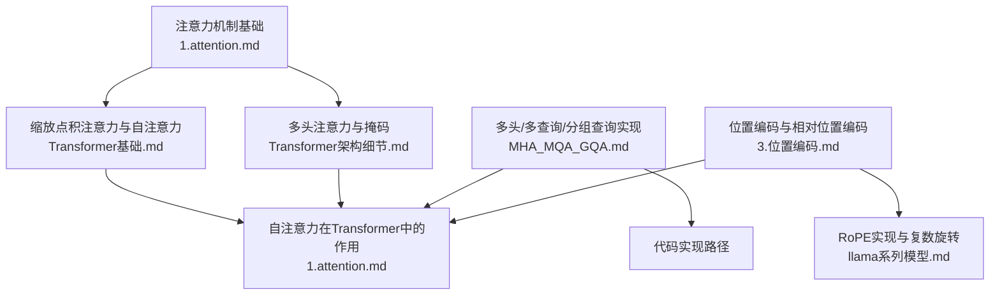
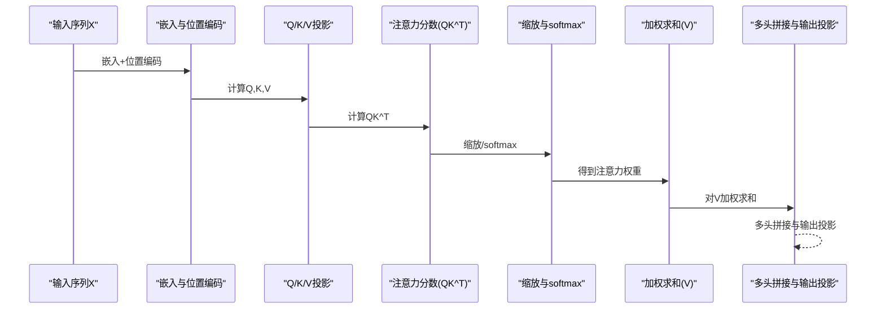
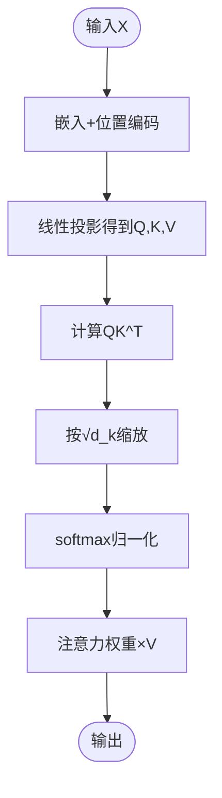
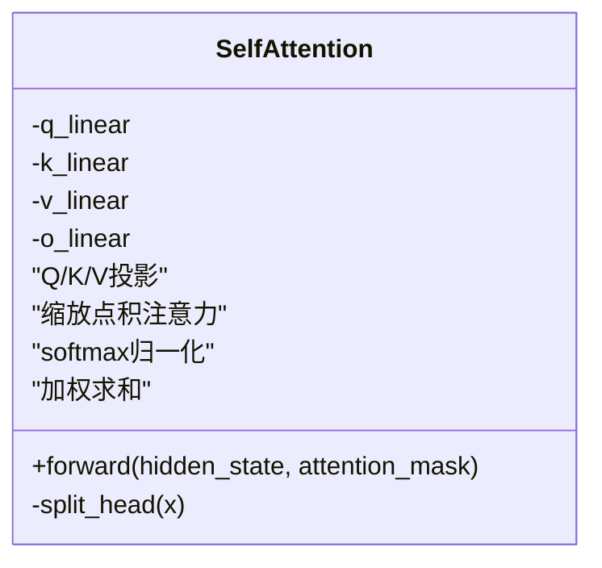
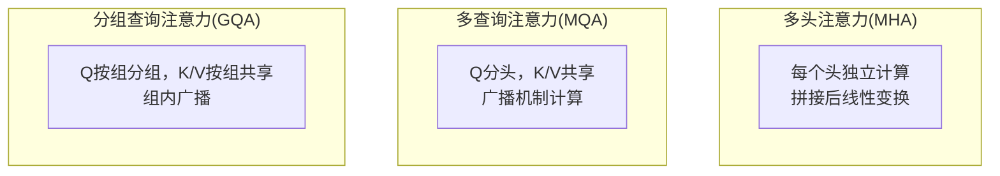
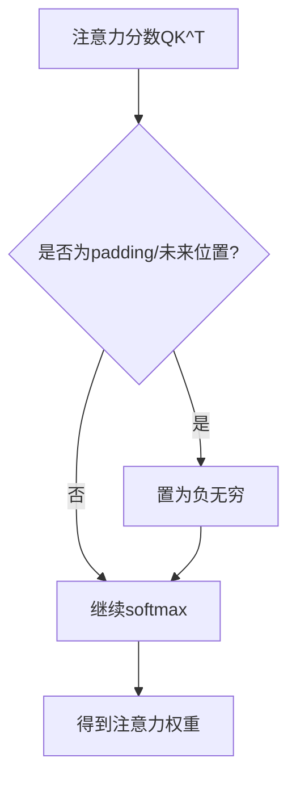
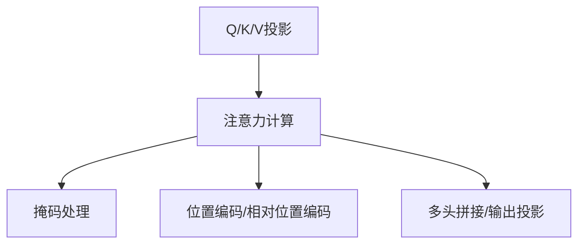

# 自注意力机制

<cite>
**本文引用的文件**
- [1.attention.md](file://02.大语言模型架构/1.attention/1.attention.md)
- [MHA_MQA_GQA.md](file://02.大语言模型架构/MHA_MQA_GQA/MHA_MQA_GQA.md)
- [Transformer基础.md](file://98.相关课程/清华大模型公开课/3.Transformer基础/3.Transformer基础.md)
- [Transformer架构细节.md](file://02.大语言模型架构/Transformer架构细节/Transformer架构细节.md)
- [3.位置编码.md](file://02.大语言模型架构/3.位置编码/3.位置编码.md)
- [llama系列模型.md](file://02.大语言模型架构/llama系列模型/llama系列模型.md)
</cite>

## 目录
1. [简介](#简介)
2. [项目结构](#项目结构)
3. [核心组件](#核心组件)
4. [架构总览](#架构总览)
5. [详细组件分析](#详细组件分析)
6. [依赖分析](#依赖分析)
7. [性能考量](#性能考量)
8. [故障排查指南](#故障排查指南)
9. [结论](#结论)
10. [附录](#附录)

## 简介
本章节围绕自注意力机制（Self-Attention）展开，系统阐述其核心计算原理、QKV矩阵分解、注意力权重计算、缩放点积注意力的数学推导，以及在Transformer中的作用机制。重点解释如何通过查询-键-值（Q, K, V）机制实现序列内部的信息交互，给出具体的计算步骤、数学公式、代码实现示例路径与性能优化策略，并辅以可视化图表帮助理解注意力权重的计算过程与信息流动。

## 项目结构
本仓库与自注意力机制相关的内容主要分布在以下目录与文件：
- 02.大语言模型架构/1.attention：涵盖注意力机制的通用定义、Self-Attention、多头注意力、掩码与复杂度分析等
- 02.大语言模型架构/MHA_MQA_GQA：提供多头、多查询、分组查询注意力的代码实现与要点
- 98.相关课程/清华大模型公开课/3.Transformer基础：系统讲解点积注意力、缩放点积注意力、自注意力与多头注意力
- 02.大语言模型架构/Transformer架构细节：解释Self-Attention的原理、归一化与放缩、并行化等
- 02.大语言模型架构/3.位置编码：说明位置编码与相对位置编码（含RoPE）在注意力中的作用
- 02.大语言模型架构/llama系列模型：给出RoPE的实现示例与复数旋转几何意义

**图表来源**
- [1.attention.md:15-34](file://02.大语言模型架构/1.attention/1.attention.md#L15-L34)
- [Transformer基础.md:176-247](file://98.相关课程/清华大模型公开课/3.Transformer基础/3.Transformer基础.md#L176-L247)
- [Transformer架构细节.md:60-83](file://02.大语言模型架构/Transformer架构细节/Transformer架构细节.md#L60-L83)
- [MHA_MQA_GQA.md:17-87](file://02.大语言模型架构/MHA_MQA_GQA/MHA_MQA_GQA.md#L17-L87)
- [3.位置编码.md:1-212](file://02.大语言模型架构/3.位置编码/3.位置编码.md#L1-L212)
- [llama系列模型.md:169-255](file://02.大语言模型架构/llama系列模型/llama系列模型.md#L169-L255)

**章节来源**
- [1.attention.md:15-34](file://02.大语言模型架构/1.attention/1.attention.md#L15-L34)
- [Transformer基础.md:176-247](file://98.相关课程/清华大模型公开课/3.Transformer基础/3.Transformer基础.md#L176-L247)
- [Transformer架构细节.md:60-83](file://02.大语言模型架构/Transformer架构细节/Transformer架构细节.md#L60-L83)
- [MHA_MQA_GQA.md:17-87](file://02.大语言模型架构/MHA_MQA_GQA/MHA_MQA_GQA.md#L17-L87)
- [3.位置编码.md:1-212](file://02.大语言模型架构/3.位置编码/3.位置编码.md#L1-L212)
- [llama系列模型.md:169-255](file://02.大语言模型架构/llama系列模型/llama系列模型.md#L169-L255)

## 核心组件
- 查询-键-值（Q, K, V）投影与缩放点积注意力
- 多头注意力（MHA）与多查询注意力（MQA）、分组查询注意力（GQA）
- 掩码（Padding掩码、因果掩码）与位置编码（绝对/相对/RoPE）
- 复杂度与并行化特性

**章节来源**
- [1.attention.md:15-34](file://02.大语言模型架构/1.attention/1.attention.md#L15-L34)
- [MHA_MQA_GQA.md:17-87](file://02.大语言模型架构/MHA_MQA_GQA/MHA_MQA_GQA.md#L17-L87)
- [Transformer架构细节.md:60-83](file://02.大语言模型架构/Transformer架构细节/Transformer架构细节.md#L60-L83)
- [3.位置编码.md:1-212](file://02.大语言模型架构/3.位置编码/3.位置编码.md#L1-L212)

## 架构总览
自注意力在Transformer中作为核心子层，广泛存在于Encoder与Decoder的每个Block中。其计算流程包括：
- 输入序列经嵌入与位置编码后，通过线性投影得到Q、K、V
- 计算注意力分数（QK^T），进行缩放与softmax归一化
- 使用注意力权重对V加权求和，得到每个位置的上下文表示
- 多头注意力通过拼接各头输出并经线性变换整合
- 掩码在训练/推理阶段用于屏蔽无效位置与未来信息

**图表来源**
- [1.attention.md:15-34](file://02.大语言模型架构/1.attention/1.attention.md#L15-L34)
- [Transformer基础.md:176-247](file://98.相关课程/清华大模型公开课/3.Transformer基础/3.Transformer基础.md#L176-L247)
- [MHA_MQA_GQA.md:50-77](file://02.大语言模型架构/MHA_MQA_GQA/MHA_MQA_GQA.md#L50-L77)

## 详细组件分析

### 自注意力与缩放点积注意力
- 自注意力是注意力机制的特殊情况，Q=K=V，用于序列内部的全局交互
- 缩放点积注意力通过将QK^T除以√d_k，控制点积方差，避免softmax进入饱和区导致梯度消失
- 数学公式与图示详见课程资料

**图表来源**
- [Transformer基础.md:176-247](file://98.相关课程/清华大模型公开课/3.Transformer基础/3.Transformer基础.md#L176-L247)
- [1.attention.md:113-123](file://02.大语言模型架构/1.attention/1.attention.md#L113-L123)

**章节来源**
- [Transformer基础.md:176-247](file://98.相关课程/清华大模型公开课/3.Transformer基础/3.Transformer基础.md#L176-L247)
- [1.attention.md:113-123](file://02.大语言模型架构/1.attention/1.attention.md#L113-L123)

### QKV矩阵分解与注意力权重计算
- Q、K、V分别由输入X经不同权重矩阵线性变换得到
- 注意力分数为QK^T，softmax后作为权重，对V加权求和
- 代码实现示例路径：[MHA实现:33-87](file://02.大语言模型架构/MHA_MQA_GQA/MHA_MQA_GQA.md#L33-L87)

**图表来源**
- [MHA_MQA_GQA.md:36-87](file://02.大语言模型架构/MHA_MQA_GQA/MHA_MQA_GQA.md#L36-L87)

**章节来源**
- [MHA_MQA_GQA.md:33-87](file://02.大语言模型架构/MHA_MQA_GQA/MHA_MQA_GQA.md#L33-L87)

### 多头注意力（MHA）与多查询注意力（MQA）、分组查询注意力（GQA）
- MHA：每个头独立计算注意力，最后拼接并线性变换
- MQA：多头共享一份K/V，仅Q分头，降低KV参数量
- GQA：将Q分组，每组共享一组K/V，兼顾性能与效率
- 代码实现示例路径：
  - [MHA实现:33-87](file://02.大语言模型架构/MHA_MQA_GQA/MHA_MQA_GQA.md#L33-L87)
  - [MQA实现:95-154](file://02.大语言模型架构/MHA_MQA_GQA/MHA_MQA_GQA.md#L95-L154)
  - [GQA实现:164-224](file://02.大语言模型架构/MHA_MQA_GQA/MHA_MQA_GQA.md#L164-L224)

**图表来源**
- [MHA_MQA_GQA.md:17-224](file://02.大语言模型架构/MHA_MQA_GQA/MHA_MQA_GQA.md#L17-L224)

**章节来源**
- [MHA_MQA_GQA.md:17-224](file://02.大语言模型架构/MHA_MQA_GQA/MHA_MQA_GQA.md#L17-L224)

### 掩码与位置信息
- Padding掩码：将padding位置的分数置为负无穷，使softmax后权重为0
- 因果掩码（Decoder自注意力）：屏蔽未来位置，避免信息泄漏
- 位置编码：绝对位置编码（三角函数）与相对位置编码（RoPE），后者通过复数旋转在内积中引入相对位置

**图表来源**
- [1.attention.md:64-66](file://02.大语言模型架构/1.attention/1.attention.md#L64-L66)
- [Transformer架构细节.md:18-28](file://02.大语言模型架构/Transformer架构细节/Transformer架构细节.md#L18-L28)

**章节来源**
- [1.attention.md:64-66](file://02.大语言模型架构/1.attention/1.attention.md#L64-L66)
- [3.位置编码.md:1-212](file://02.大语言模型架构/3.位置编码/3.位置编码.md#L1-L212)
- [llama系列模型.md:169-255](file://02.大语言模型架构/llama系列模型/llama系列模型.md#L169-L255)

### 复杂度与并行化
- Self-Attention时间复杂度O(n^2·d)，空间复杂度O(n^2)
- 多头注意力复杂度与单头相同，拼接不改变主项
- Transformer在自注意力层采用矩阵运算实现“伪并行”，训练阶段可并行，推理阶段因自回归逐步生成不并行

**章节来源**
- [1.attention.md:374-406](file://02.大语言模型架构/1.attention/1.attention.md#L374-L406)
- [Transformer架构细节.md:288-321](file://02.大语言模型架构/Transformer架构细节/Transformer架构细节.md#L288-L321)

## 依赖分析
- 自注意力依赖于嵌入与位置编码，确保序列顺序信息
- 多头注意力通过线性投影与拼接整合不同子空间的特征
- 掩码与位置编码在注意力计算前后参与，影响权重分布与信息流动
- RoPE通过复数旋转在内积中显式引入相对位置，提升长程依赖与外推能力

**图表来源**
- [1.attention.md:15-34](file://02.大语言模型架构/1.attention/1.attention.md#L15-L34)
- [3.位置编码.md:1-212](file://02.大语言模型架构/3.位置编码/3.位置编码.md#L1-L212)
- [MHA_MQA_GQA.md:50-77](file://02.大语言模型架构/MHA_MQA_GQA/MHA_MQA_GQA.md#L50-L77)

**章节来源**
- [1.attention.md:15-34](file://02.大语言模型架构/1.attention/1.attention.md#L15-L34)
- [3.位置编码.md:1-212](file://02.大语言模型架构/3.位置编码/3.位置编码.md#L1-L212)
- [MHA_MQA_GQA.md:50-77](file://02.大语言模型架构/MHA_MQA_GQA/MHA_MQA_GQA.md#L50-L77)

## 性能考量
- 缩放点积注意力：控制点积方差，避免softmax饱和与梯度消失
- 多头注意力降维：在保持表达能力的同时降低计算与存储开销
- MQA/GQA：通过共享K/V或分组共享，显著减少KV参数量，提升推理速度
- RoPE：在不改变模型结构的前提下引入相对位置，提升长程依赖与外推能力
- 掩码：避免无效位置参与计算，减少无意义的注意力权重

**章节来源**
- [1.attention.md:113-123](file://02.大语言模型架构/1.attention/1.attention.md#L113-L123)
- [MHA_MQA_GQA.md:17-224](file://02.大语言模型架构/MHA_MQA_GQA/MHA_MQA_GQA.md#L17-L224)
- [3.位置编码.md:189-192](file://02.大语言模型架构/3.位置编码/3.位置编码.md#L189-L192)
- [llama系列模型.md:169-255](file://02.大语言模型架构/llama系列模型/llama系列模型.md#L169-L255)

## 故障排查指南
- softmax饱和与梯度消失：检查是否正确进行缩放（除以√d_k）
- 掩码错误导致信息泄漏：确认padding与因果掩码的负无穷设置与维度匹配
- 多头注意力维度不一致：确保head_dim与hidden_size匹配，拼接维度正确
- 位置编码缺失：若模型对顺序敏感，需确认是否加入绝对或相对位置编码

**章节来源**
- [1.attention.md:113-123](file://02.大语言模型架构/1.attention/1.attention.md#L113-L123)
- [1.attention.md:64-66](file://02.大语言模型架构/1.attention/1.attention.md#L64-L66)
- [MHA_MQA_GQA.md:80-83](file://02.大语言模型架构/MHA_MQA_GQA/MHA_MQA_GQA.md#L80-L83)
- [3.位置编码.md:1-212](file://02.大语言模型架构/3.位置编码/3.位置编码.md#L1-L212)

## 结论
自注意力通过Q、K、V的线性变换与缩放点积注意力，实现了序列内部的全局交互与动态权重分配。多头注意力、MQA/GQA在表达能力与效率之间取得平衡，掩码与位置编码保障了信息流动的正确性与顺序感知。理解这些机制有助于在实践中优化模型性能与稳定性。

## 附录
- 代码实现示例路径
  - [MHA实现:33-87](file://02.大语言模型架构/MHA_MQA_GQA/MHA_MQA_GQA.md#L33-L87)
  - [MQA实现:95-154](file://02.大语言模型架构/MHA_MQA_GQA/MHA_MQA_GQA.md#L95-L154)
  - [GQA实现:164-224](file://02.大语言模型架构/MHA_MQA_GQA/MHA_MQA_GQA.md#L164-L224)
  - [RoPE实现:189-255](file://02.大语言模型架构/llama系列模型/llama系列模型.md#L189-L255)