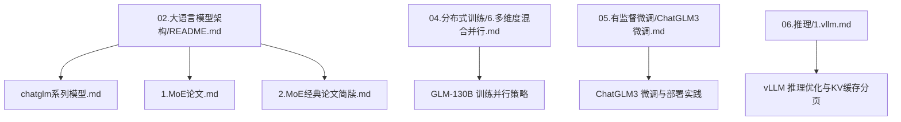
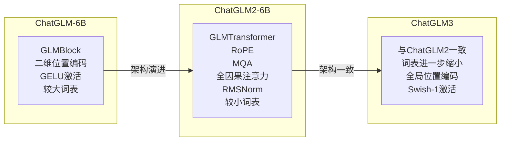
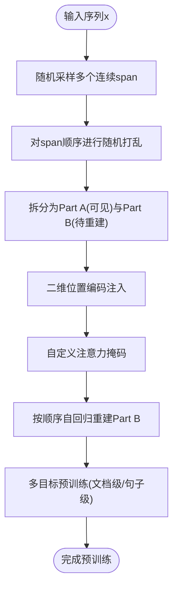
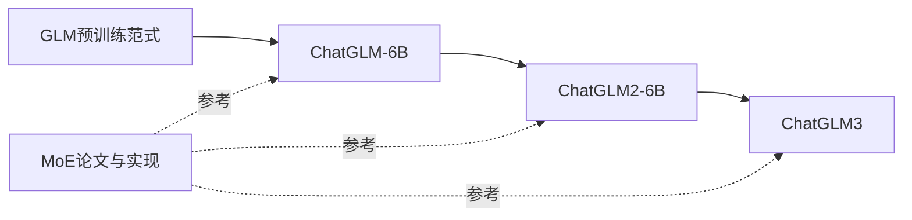

# ChatGLM系列模型

<cite>
**本文引用的文件列表**
- [chatglm系列模型.md](file://02.大语言模型架构/chatglm系列模型/chatglm系列模型.md)
- [1.MoE论文.md](file://02.大语言模型架构/1.MoE论文/1.MoE论文.md)
- [2.MoE经典论文简牍.md](file://02.大语言模型架构/2.MoE经典论文简牍/2.MoE经典论文简牍.md)
- [6.多维度混合并行.md](file://04.分布式训练/6.多维度混合并行/6.多维度混合并行.md)
- [ChatGLM3微调.md](file://05.有监督微调/ChatGLM3微调/ChatGLM3微调.md)
- [1.vllm.md](file://06.推理/1.vllm/1.vllm.md)
- [README.md](file://02.大语言模型架构/README.md)
</cite>

## 目录
1. [简介](#简介)
2. [项目结构](#项目结构)
3. [核心组件](#核心组件)
4. [架构总览](#架构总览)
5. [详细组件分析](#详细组件分析)
6. [依赖关系分析](#依赖关系分析)
7. [性能考量](#性能考量)
8. [故障排查指南](#故障排查指南)
9. [结论](#结论)
10. [附录](#附录)

## 简介
本文件系统性梳理ChatGLM系列模型的设计理念、架构演进与关键技术特性，重点覆盖：
- 中文场景优化策略与GLM预训练范式
- 与MoE（混合专家）的关联与差异
- ChatGLM-6B、ChatGLM2-6B、ChatGLM3的版本差异与性能表现
- 训练策略、推理优化与部署实践
- 基准测试与应用案例的资料索引

## 项目结构
围绕ChatGLM主题，仓库在“大语言模型架构”章节下提供了系列模型的背景、架构与演进说明；在“分布式训练”“推理”“有监督微调”等章节提供了并行训练、推理优化与微调实践的支撑材料。下图给出与ChatGLM相关的核心文件与定位关系。

图表来源
- [README.md:33-41](file://02.大语言模型架构/README.md#L33-L41)
- [chatglm系列模型.md:1-214](file://02.大语言模型架构/chatglm系列模型/chatglm系列模型.md#L1-L214)
- [1.MoE论文.md:1-238](file://02.大语言模型架构/1.MoE论文/1.MoE论文.md#L1-L238)
- [2.MoE经典论文简牍.md:1-359](file://02.大语言模型架构/2.MoE经典论文简牍/2.MoE经典论文简牍.md#L1-L359)
- [6.多维度混合并行.md:61-89](file://04.分布式训练/6.多维度混合并行/6.多维度混合并行.md#L61-L89)
- [ChatGLM3微调.md:1-12](file://05.有监督微调/ChatGLM3微调/ChatGLM3微调.md#L1-L12)
- [1.vllm.md:1-220](file://06.推理/1.vllm/1.vllm.md#L1-L220)

章节来源
- [README.md:1-52](file://02.大语言模型架构/README.md#L1-L52)

## 核心组件
- GLM预训练范式与空格填充任务：通过自回归重建缺失span，结合Part A（双向）与Part B（单向）的注意力掩码，实现NLU与生成任务的统一。
- ChatGLM-6B：采用GLMBlock结构，使用二维位置编码与GELU激活，词表规模较大。
- ChatGLM2-6B：引入RoPE、Multi-Query Attention、全因果注意力掩码，词表规模缩小，推理效率与上下文长度显著提升。
- ChatGLM3：与ChatGLM2架构一致，词表规模进一步缩小，位置编码与前馈网络激活方式优化，修复维度不一致问题。

章节来源
- [chatglm系列模型.md:17-106](file://02.大语言模型架构/chatglm系列模型/chatglm系列模型.md#L17-L106)

## 架构总览
下图展示ChatGLM系列在不同版本中的关键架构差异与演进路径。

图表来源
- [chatglm系列模型.md:120-214](file://02.大语言模型架构/chatglm系列模型/chatglm系列模型.md#L120-L214)

## 详细组件分析

### GLM预训练范式与空格填充任务
- 自编码思想：对输入文本进行随机连续span遮蔽，Part A为可见的原始上下文，Part B为目标重建的span。
- 自回归思想：按顺序重建Part B，重建时可访问Part A与已生成的前置span。
- 二维位置编码：分别记录Part A绝对位置与Part B内部相对位置，增强跨区域依赖。
- 注意力掩码：Part A双向可见但不可见Part B；Part B可见Part A与自身过去span，不可见未来span。
- 多目标预训练：文档级长文本生成与句子级完整段落生成，覆盖NLU与生成任务。

图表来源
- [chatglm系列模型.md:28-55](file://02.大语言模型架构/chatglm系列模型/chatglm系列模型.md#L28-L55)

章节来源
- [chatglm系列模型.md:19-64](file://02.大语言模型架构/chatglm系列模型/chatglm系列模型.md#L19-L64)

### ChatGLM-6B 架构与参数
- 结构要点：GLMBlock堆叠，LayerNorm与残差顺序调整，输出层直接预测token，激活函数为GELU。
- 词表规模：较大词表，便于多语言与多任务表达。
- 位置编码：二维位置编码，增强跨区域依赖。

章节来源
- [chatglm系列模型.md:120-145](file://02.大语言模型架构/chatglm系列模型/chatglm系列模型.md#L120-L145)

### ChatGLM2-6B 架构与优化
- RoPE替换二维位置编码，适配主流架构趋势。
- Multi-Query Attention（MQA）：共享Key/Value Head，降低显存与计算开销。
- 全因果注意力掩码：不再区分Part A/Part B，统一为decoder-only。
- 多目标任务：V2版本摒弃gMask等特殊token，与注意力掩码一致。
- 性能提升：推理速度提升、INT4量化下对话长度显著增长、词表规模缩小。

章节来源
- [chatglm系列模型.md:81-96](file://02.大语言模型架构/chatglm系列模型/chatglm系列模型.md#L81-L96)

### ChatGLM3 架构与细节
- 架构一致性：与ChatGLM2完全一致。
- 词表规模：进一步缩小至65024，加载速度与显存占用优化。
- 位置编码：从每Block一份提升为全局一份，减少冗余。
- 前馈网络激活：使用Swish-1，修复GLU维度不一致问题，前后维度匹配更合理。

章节来源
- [chatglm系列模型.md:97-106](file://02.大语言模型架构/chatglm系列模型/chatglm系列模型.md#L97-L106)

### 与MoE的关系与差异
- ChatGLM系列未采用MoE层，其核心创新在于GLM预训练范式与架构细节（如二维位置编码、注意力掩码设计）。
- MoE在其他大模型中广泛应用，通过稀疏门控路由专家，实现更大模型容量与高效推理；ChatGLM系列则通过架构与训练策略优化实现性能提升。
- 相关MoE论文与实现可参考“1.MoE论文”“2.MoE经典论文简牍”。

章节来源
- [1.MoE论文.md:1-238](file://02.大语言模型架构/1.MoE论文/1.MoE论文.md#L1-L238)
- [2.MoE经典论文简牍.md:1-359](file://02.大语言模型架构/2.MoE经典论文简牍/2.MoE经典论文简牍.md#L1-L359)

### 训练策略与并行
- GLM-130B展示了大规模训练的并行策略：流水线并行、张量并行与数据并行的3D混合策略，结合PipeDream-Flush减少气泡，实现高吞吐与高GPU利用率。
- ChatGLM系列在中文场景下的预训练目标与数据分布策略，可参考GLM-130B的多任务指令预训练与自回归空格填充目标。

章节来源
- [6.多维度混合并行.md:61-89](file://04.分布式训练/6.多维度混合并行/6.多维度混合并行.md#L61-L89)

### 推理优化与部署
- vLLM提供连续批处理（Continuous Batching）与PagedAttention，显著提升KV缓存管理效率，降低显存碎片化，提升吞吐。
- ChatGLM系列在推理侧可通过MQA、RoPE与词表优化降低显存占用，配合量化与分页KV缓存策略进一步提升性能。

章节来源
- [1.vllm.md:1-220](file://06.推理/1.vllm/1.vllm.md#L1-L220)

### 微调与应用实践
- ChatGLM3微调与部署实践：提供官方教程与魔搭最佳实践，覆盖Function Call、Code Interpreter、Agent等高级能力。
- 常见微调方法：LoRA、INT4量化、多卡部署等，结合仓库中的微调与推理资料可快速落地。

章节来源
- [ChatGLM3微调.md:1-12](file://05.有监督微调/ChatGLM3微调/ChatGLM3微调.md#L1-L12)

## 依赖关系分析
- ChatGLM-6B → ChatGLM2-6B：注意力掩码与位置编码替换、词表规模缩小、MQA引入。
- ChatGLM2-6B → ChatGLM3：架构保持一致，词表进一步缩小，位置编码与激活函数优化。
- MoE相关论文与实现为通用技术参考，ChatGLM系列未采用MoE层。

图表来源
- [chatglm系列模型.md:17-106](file://02.大语言模型架构/chatglm系列模型/chatglm系列模型.md#L17-L106)
- [1.MoE论文.md:1-238](file://02.大语言模型架构/1.MoE论文/1.MoE论文.md#L1-L238)
- [2.MoE经典论文简牍.md:1-359](file://02.大语言模型架构/2.MoE经典论文简牍/2.MoE经典论文简牍.md#L1-L359)

## 性能考量
- 上下文长度：ChatGLM2-6B通过FlashAttention等技术将上下文长度从2K扩展到32K，对话阶段可达8K。
- 推理效率：MQA与RoPE降低显存占用与计算开销，INT4量化进一步提升长对话支持能力。
- 训练效率：3D混合并行（数据/流水线/张量）与PipeDream-Flush减少气泡，提升GPU利用率。
- 推理吞吐：vLLM的连续批处理与PagedAttention显著提升KV缓存管理效率，降低显存碎片化。

章节来源
- [chatglm系列模型.md:83-88](file://02.大语言模型架构/chatglm系列模型/chatglm系列模型.md#L83-L88)
- [6.多维度混合并行.md:61-89](file://04.分布式训练/6.多维度混合并行/6.多维度混合并行.md#L61-L89)
- [1.vllm.md:1-220](file://06.推理/1.vllm/1.vllm.md#L1-L220)

## 故障排查指南
- 显存不足：优先启用MQA、RoPE与词表优化；结合INT4量化与分页KV缓存策略；必要时降低batch size或序列长度。
- 推理吞吐低：检查是否开启连续批处理与PagedAttention；确认GPU利用率与KV缓存碎片化情况。
- 微调效果不佳：参考LoRA与INT4量化实践，结合官方教程与魔搭最佳实践进行参数与数据准备。
- 预训练稳定性：参考MoE论文中的负载均衡与Router z-loss等稳定化策略，结合3D并行与PipeDream-Flush减少气泡。

章节来源
- [1.vllm.md:1-220](file://06.推理/1.vllm/1.vllm.md#L1-L220)
- [ChatGLM3微调.md:1-12](file://05.有监督微调/ChatGLM3微调/ChatGLM3微调.md#L1-L12)
- [1.MoE论文.md:145-176](file://02.大语言模型架构/1.MoE论文/1.MoE论文.md#L145-L176)
- [2.MoE经典论文简牍.md:300-344](file://02.大语言模型架构/2.MoE经典论文简牍/2.MoE经典论文简牍.md#L300-L344)

## 结论
- ChatGLM系列以GLM预训练范式为核心，通过架构细节优化（RoPE、MQA、注意力掩码、词表与激活函数）在中文场景下实现更优的上下文长度、推理效率与性能表现。
- ChatGLM2-6B相较ChatGLM-6B在上下文长度、性能与推理效率方面有显著提升；ChatGLM3与ChatGLM2架构一致，进一步优化词表与位置编码细节。
- ChatGLM系列未采用MoE层，其创新点集中在预训练范式与架构细节；MoE相关论文与实现可作为通用技术参考。
- 结合分布式训练、推理优化与微调实践，可在中文场景下高效部署与应用ChatGLM系列模型。

## 附录
- 中文场景应用与部署实践：参考ChatGLM3微调与部署实践资料，结合LoRA、INT4量化与多卡部署策略。
- 基准测试与评测：可参考LongBench等评测工具与数据集，结合仓库中的评测结果与性能对比进行基准测试。

章节来源
- [ChatGLM3微调.md:1-12](file://05.有监督微调/ChatGLM3微调/ChatGLM3微调.md#L1-L12)
- [chatglm系列模型.md:83-88](file://02.大语言模型架构/chatglm系列模型/chatglm系列模型.md#L83-L88)