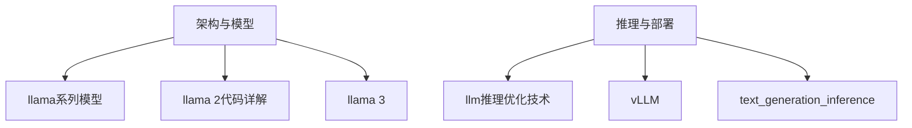
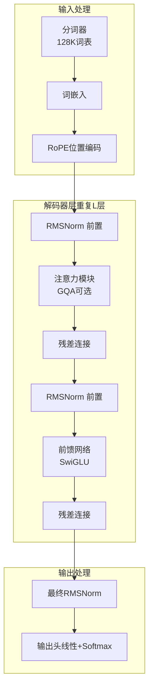
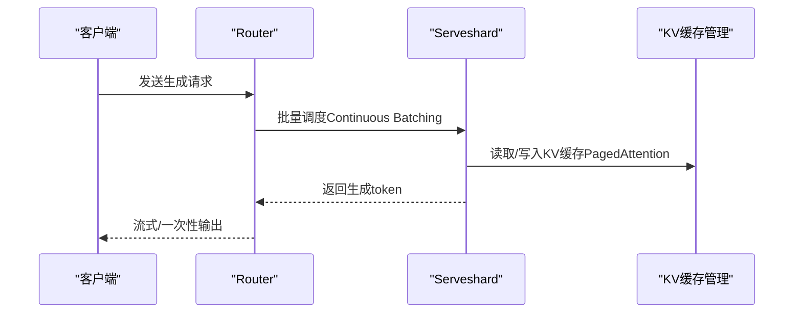
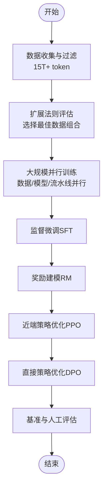
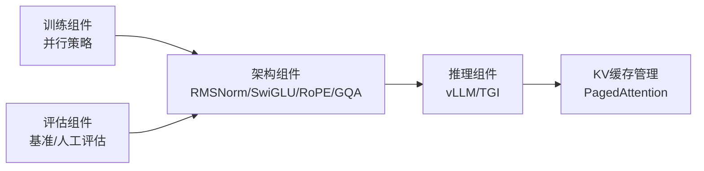

# LLaMA-3模型介绍

<cite>
**本文引用的文件**
- [llama 3.md](file://02.大语言模型架构/llama 3/llama 3.md)
- [llama系列模型.md](file://02.大语言模型架构/llama系列模型/llama系列模型.md)
- [llama 2代码详解.md](file://02.大语言模型架构/llama 2代码详解/llama 2代码详解.md)
- [llm推理优化技术.md](file://06.推理/llm推理优化技术/llm推理优化技术.md)
- [1.vllm.md](file://06.推理/1.vllm/1.vllm.md)
- [2.text_generation_inference.md](file://06.推理/2.text_generation_inference/2.text_generation_inference.md)
- [README.md](file://06.推理/README.md)
- [README.md](file://05.有监督微调/README.md)
- [README.md](file://02.大语言模型架构/README.md)
</cite>

## 目录
1. [引言](#引言)
2. [项目结构](#项目结构)
3. [核心组件](#核心组件)
4. [架构总览](#架构总览)
5. [详细组件分析](#详细组件分析)
6. [依赖分析](#依赖分析)
7. [性能考量](#性能考量)
8. [故障排查指南](#故障排查指南)
9. [结论](#结论)
10. [附录](#附录)

## 引言
本文件围绕LLaMA-3模型进行全面技术解读，重点覆盖其架构改进、训练与微调方法、推理优化与部署实践，并与LLaMA-2进行对比分析。LLaMA-3作为Meta公开的最先进开源大模型，具备更强的推理能力、更长上下文、更丰富的多语言支持与更高的训练数据规模，同时在安全性与扩展性方面引入了多项新工具与并行策略。

## 项目结构
本仓库与LLaMA-3相关的内容主要集中在“大语言模型架构”与“推理”两大板块：
- 架构与模型：包含LLaMA系列演进、注意力机制（含GQA）、位置编码（RoPE）等基础组件与LLaMA-3的改进点
- 推理与部署：包含推理优化技术、vLLM与TGI等服务框架的使用与原理

**章节来源**
- [README.md:1-52](file://02.大语言模型架构/README.md#L1-L52)
- [README.md:1-28](file://06.推理/README.md#L1-L28)

## 核心组件
- 解码器架构与标准化：采用前置RMSNorm、SwiGLU激活、RoPE位置编码，并在部分模型中引入GQA以平衡效率与性能
- 分词器与上下文：使用128K词表的分词器，支持最长8192 token的上下文长度
- 长序列与数据工程：预训练数据达15万亿token以上，包含高质量非英语数据与代码数据，配合数据过滤与质量控制管线
- 训练与扩展：结合数据/模型/流水线并行，依据扩展法则选择数据组合，提升训练效率与模型性能
- 微调与对齐：采用SFT、拒绝采样、PPO与DPO的组合，提升响应对齐与多样性
- 安全与可靠性：引入Llama Guard 2、Code Shield与CyberSec Eval 2等工具

**章节来源**
- [llama 3.md:1-110](file://02.大语言模型架构/llama 3/llama 3.md#L1-L110)
- [llama系列模型.md:1-377](file://02.大语言模型架构/llama系列模型/llama系列模型.md#L1-L377)

## 架构总览
下图展示了LLaMA-3的通用GPT解码器架构与关键改进点，包括RMSNorm、SwiGLU、RoPE与GQA等。

**图表来源**
- [llama 3.md:24-51](file://02.大语言模型架构/llama 3/llama 3.md#L24-L51)

**章节来源**
- [llama 3.md:24-51](file://02.大语言模型架构/llama 3/llama 3.md#L24-L51)

## 详细组件分析

### 1) LLaMA-3架构与参数配置
- 模型规模：8B与70B两种参数规模，支持8k上下文长度
- 关键组件：
  - RMSNorm：前置归一化，提升训练稳定性
  - SwiGLU：替代ReLU的激活函数，增强表达能力
  - RoPE：将绝对位置编码转化为相对位置信息，利于长序列建模
  - GQA：在部分模型中采用，减少KV缓存与计算开销
- 分词器：128K词表，提升语言编码效率
- 数据规模：超过15万亿token，包含高质量非英语与代码数据

**章节来源**
- [llama 3.md:15-51](file://02.大语言模型架构/llama 3/llama 3.md#L15-L51)

### 2) 训练与扩展策略
- 数据并行、模型并行与流水线并行协同，实现大规模GPU集群高效训练
- 基于扩展法则（scaling laws）选择数据组合，验证在15T token上继续提升性能
- 先进训练堆栈：自动错误检测与处理、硬件可靠性与静默数据损坏检测、可扩展存储系统，有效训练时间超95%

**章节来源**
- [llama 3.md:61-71](file://02.大语言模型架构/llama 3/llama 3.md#L61-L71)

### 3) 微调与指令对齐
- 方法组合：SFT、拒绝采样、PPO与DPO，提升对齐质量与多样性
- 数据质量：通过多轮标注与质量保证，提升提示质量与偏好排序效果
- 性能收益：对复杂推理问题，模型能产生正确推理轨迹并学会选择正确答案

**章节来源**
- [llama 3.md:73-78](file://02.大语言模型架构/llama 3/llama 3.md#L73-L78)

### 4) 推理优化与KV缓存
- KV缓存内存估算：每个token的KV缓存大小与层数、头数、维度与精度相关
- 序列并行与模型并行：在输入序列维度上进行分区，提升内存效率
- GQA在LLaMA-2中的应用：通过分组共享KV，显著提升吞吐量

**章节来源**
- [llm推理优化技术.md:56-131](file://06.推理/llm推理优化技术/llm推理优化技术.md#L56-L131)
- [llama 2代码详解.md:393-401](file://02.大语言模型架构/llama 2代码详解/llama 2代码详解.md#L393-L401)

### 5) 推理服务框架（vLLM与TGI）
- vLLM
  - 特性：PagedAttention、Continuous Batching、高性能CUDA kernel、张量并行、OpenAI兼容API
  - KV缓存管理：以分页块管理KV缓存，显著降低内存碎片与浪费
- Text Generation Inference（TGI）
  - 特性：张量并行、Continuous Batching、Flash Attention/PagedAttention优化、量化（LLM.int8/GPT-Q）、服务评估与指标
  - 架构：Launcher-Router-Server三层协作，Prefill/Decode/FilterBatch等内部接口

**图表来源**
- [1.vllm.md:89-150](file://06.推理/1.vllm/1.vllm.md#L89-L150)
- [2.text_generation_inference.md:46-131](file://06.推理/2.text_generation_inference/2.text_generation_inference.md#L46-L131)

**章节来源**
- [1.vllm.md:1-220](file://06.推理/1.vllm/1.vllm.md#L1-L220)
- [2.text_generation_inference.md:1-140](file://06.推理/2.text_generation_inference/2.text_generation_inference.md#L1-L140)

### 6) 与LLaMA-2的对比分析
- 训练数据：LLaMA-3相较LLaMA-2扩大约7倍，代码数据扩大约4倍
- 上下文长度：LLaMA-3为8k，相较LLaMA-2的4k（部分模型）有显著提升
- GQA：LLaMA-2在部分模型中引入GQA-8，LLaMA-3在8B与70B模型中继续采用GQA以提升推理效率
- 多语言与安全性：LLaMA-3包含超过30种语言的高质量非英语数据，并引入Llama Guard 2、Code Shield等安全工具
- 性能基准：LLaMA-3在多个基准测试中超越同类开源模型，70B版本在部分任务上接近或超越闭源模型

**章节来源**
- [llama 3.md:7-19](file://02.大语言模型架构/llama 3/llama 3.md#L7-L19)
- [llama系列模型.md:309-327](file://02.大语言模型架构/llama系列模型/llama系列模型.md#L309-L327)

### 7) 预训练与微调流程（概念性）

**图表来源**
- [llama 3.md:61-78](file://02.大语言模型架构/llama 3/llama 3.md#L61-L78)

## 依赖分析
- 组件耦合
  - 架构层：解码器层内部通过RMSNorm、注意力与FFN形成强耦合，GQA进一步影响KV缓存与注意力计算
  - 推理层：vLLM/TGI依赖KV缓存管理与PagedAttention，以降低内存碎片并提升吞吐
- 外部依赖
  - 模型生态：广泛支持HuggingFace模型与OpenAI兼容API
  - 并行策略：数据并行、模型并行、流水线并行协同，支撑大规模训练

**图表来源**
- [llama 3.md:61-78](file://02.大语言模型架构/llama 3/llama 3.md#L61-L78)
- [1.vllm.md:89-150](file://06.推理/1.vllm/1.vllm.md#L89-L150)
- [2.text_generation_inference.md:46-131](file://06.推理/2.text_generation_inference/2.text_generation_inference.md#L46-L131)

**章节来源**
- [llama 3.md:61-78](file://02.大语言模型架构/llama 3/llama 3.md#L61-L78)
- [README.md:1-28](file://06.推理/README.md#L1-L28)

## 性能考量
- 训练效率：通过并行策略与先进训练堆栈，有效训练时间超95%，训练效率相较LLaMA-2提升约3倍
- 推理吞吐：GQA减少KV缓存与计算开销；PagedAttention降低内存碎片；Continuous Batching提升GPU利用率
- 内存与延迟：KV缓存大小与序列长度、层数、头数与精度呈线性关系；序列并行与模型并行有助于缓解内存压力

**章节来源**
- [llama 3.md:69-71](file://02.大语言模型架构/llama 3/llama 3.md#L69-L71)
- [llm推理优化技术.md:56-131](file://06.推理/llm推理优化技术/llm推理优化技术.md#L56-L131)
- [1.vllm.md:61-132](file://06.推理/1.vllm/1.vllm.md#L61-L132)

## 故障排查指南
- 推理吞吐低
  - 检查是否启用Continuous Batching与PagedAttention
  - 确认GPU显存是否充足，必要时降低batch size或序列长度
- KV缓存异常
  - 核对KV块大小与内存分配策略，避免碎片化
  - 使用TGI的ClearCache接口清理缓存后重试
- 并行训练不稳定
  - 检查并行策略配置与硬件可靠性，确认静默数据损坏检测机制正常

**章节来源**
- [1.vllm.md:61-132](file://06.推理/1.vllm/1.vllm.md#L61-L132)
- [2.text_generation_inference.md:109-131](file://06.推理/2.text_generation_inference/2.text_generation_inference.md#L109-L131)

## 结论
LLaMA-3在LLaMA-2基础上实现了显著的架构与工程优化：更大的训练数据规模、更长的上下文长度、更强的多语言与代码能力、更完善的指令微调与对齐流程，以及更高效的推理服务框架。这些改进使其在开源大模型领域达到新的高度，并为未来更大规模模型（如400B）的发展奠定了基础。

## 附录
- 部署与调优建议
  - 推理阶段优先采用vLLM或TGI，结合PagedAttention与Continuous Batching
  - 根据硬件条件调整batch size与序列长度，平衡吞吐与延迟
  - 在微调阶段重视数据质量与多轮标注，提升对齐效果
- 未来方向
  - 更大规模参数模型（如400B）的训练与推理优化
  - 多模态与多语言能力的进一步融合
  - 安全与可控性工具的持续演进

**章节来源**
- [llama 3.md:101-110](file://02.大语言模型架构/llama 3/llama 3.md#L101-L110)
- [README.md:1-28](file://06.推理/README.md#L1-L28)
- [README.md:1-30](file://05.有监督微调/README.md#L1-L30)