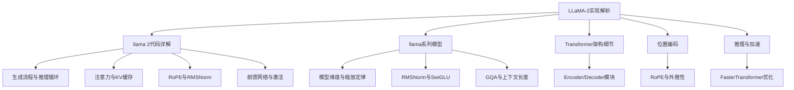
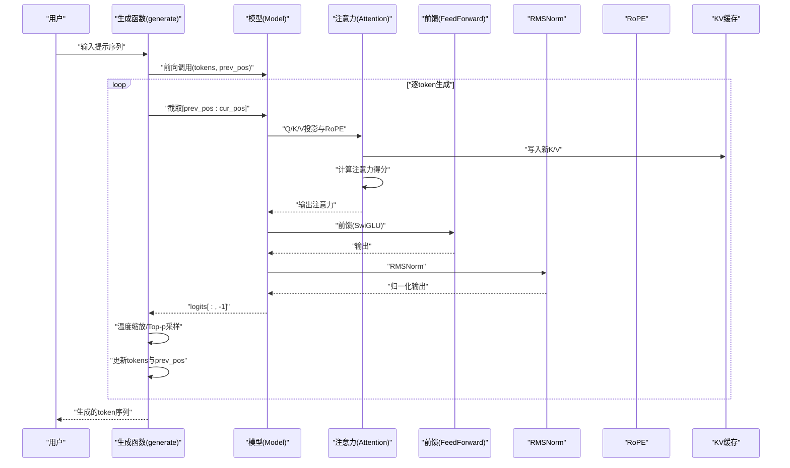
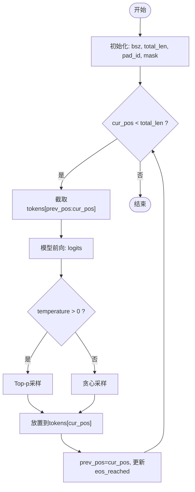
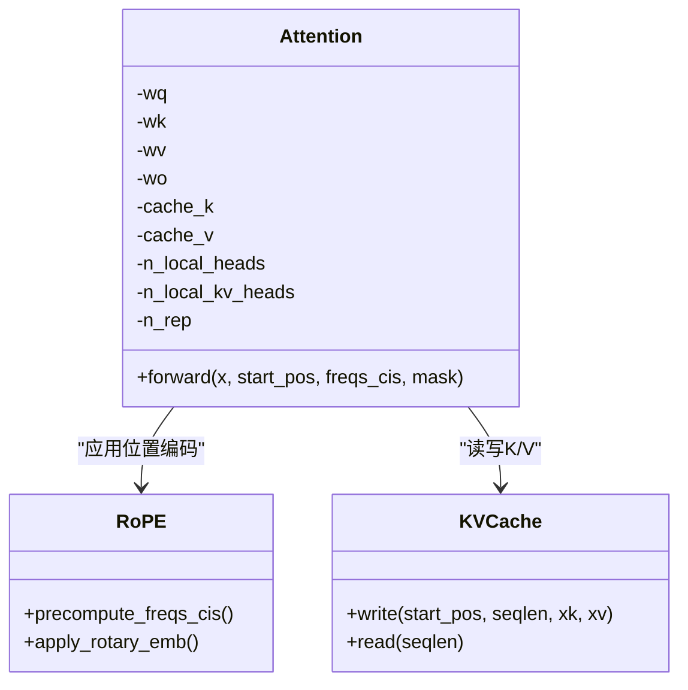
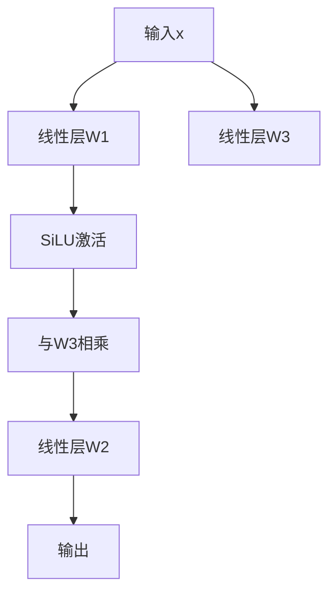
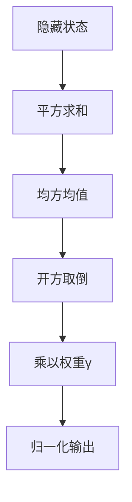
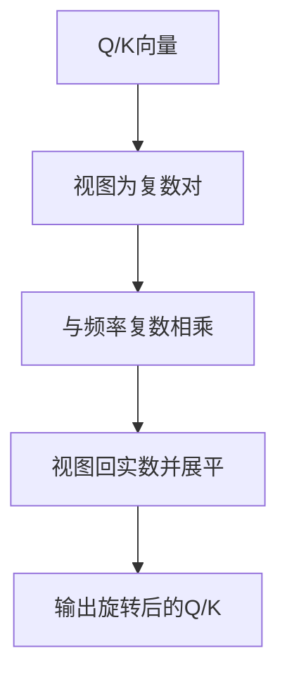
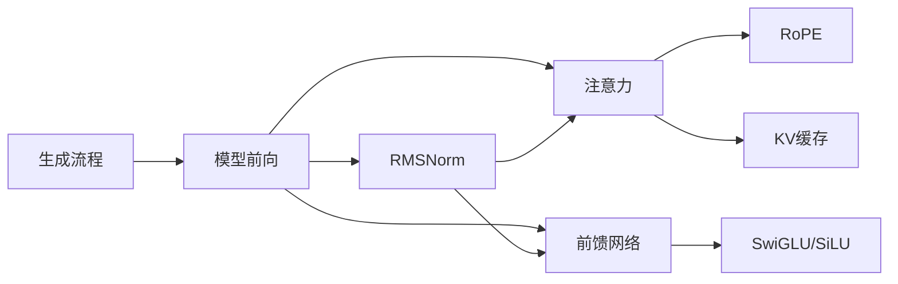

# LLaMA代码实现解析

<cite>
**本文引用的文件**
- [llama 2代码详解.md](file://02.大语言模型架构/llama 2代码详解/llama 2代码详解.md)
- [llama系列模型.md](file://02.大语言模型架构/llama系列模型/llama系列模型.md)
- [Transformer架构细节.md](file://02.大语言模型架构/Transformer架构细节/Transformer架构细节.md)
- [3.位置编码.md](file://02.大语言模型架构/3.位置编码/3.位置编码.md)
- [1.推理.md](file://06.推理/1.推理/1.推理.md)
- [3.faster_transformer.md](file://06.推理/3.faster_transformer/3.faster_transformer.md)
</cite>

## 目录
1. [简介](#简介)
2. [项目结构](#项目结构)
3. [核心组件](#核心组件)
4. [架构总览](#架构总览)
5. [组件详细分析](#组件详细分析)
6. [依赖关系分析](#依赖关系分析)
7. [性能考虑](#性能考虑)
8. [故障排查指南](#故障排查指南)
9. [结论](#结论)
10. [附录](#附录)

## 简介
本文件围绕LLaMA-2的源代码实现进行系统化解析，重点覆盖模型架构、关键组件（注意力机制、前馈网络、层归一化）、推理流程、参数加载与保存、性能优化与扩展开发建议。文档以仓库中的讲解材料为基础，结合图示与流程图，帮助读者从高层到代码级逐步理解LLaMA-2的实现要点与工程实践。

## 项目结构
本仓库以主题章节组织，与LLaMA-2实现相关的核心内容分布在“大语言模型架构”“推理”等章节中。下图给出与LLaMA-2实现相关的知识结构概览。

图表来源
- [llama 2代码详解.md:17-170](file://02.大语言模型架构/llama 2代码详解/llama 2代码详解.md#L17-L170)
- [llama系列模型.md:1-120](file://02.大语言模型架构/llama系列模型/llama系列模型.md#L1-L120)
- [Transformer架构细节.md:1-22](file://02.大语言模型架构/Transformer架构细节/Transformer架构细节.md#L1-L22)
- [3.位置编码.md:330-397](file://02.大语言模型架构/3.位置编码/3.位置编码.md#L330-L397)
- [1.推理.md:53-64](file://06.推理/1.推理/1.推理.md#L53-L64)
- [3.faster_transformer.md:20-38](file://06.推理/3.faster_transformer/3.faster_transformer.md#L20-L38)

章节来源
- [llama 2代码详解.md:17-170](file://02.大语言模型架构/llama 2代码详解/llama 2代码详解.md#L17-L170)
- [llama系列模型.md:1-120](file://02.大语言模型架构/llama系列模型/llama系列模型.md#L1-L120)

## 核心组件
- 生成与推理循环：自回归解码、温度采样、Top-p采样、logprobs计算与输出处理。
- 注意力与KV缓存：多头注意力、RoPE位置编码、Group Query Attention（GQA）、KV缓存复用。
- 前馈网络：SwiGLU激活、并行线性层、维度缩放。
- 层归一化：RMSNorm前置归一化，替代LayerNorm。
- 位置编码：RoPE旋转位置编码，支持相对位置建模。
- 模型维度与缩放：隐藏维度、中间维度、层数、头数与头维的工程权衡。

章节来源
- [llama 2代码详解.md:108-170](file://02.大语言模型架构/llama 2代码详解/llama 2代码详解.md#L108-L170)
- [llama 2代码详解.md:173-204](file://02.大语言模型架构/llama 2代码详解/llama 2代码详解.md#L173-L204)
- [llama 2代码详解.md:206-331](file://02.大语言模型架构/llama 2代码详解/llama 2代码详解.md#L206-L331)
- [llama 2代码详解.md:333-481](file://02.大语言模型架构/llama 2代码详解/llama 2代码详解.md#L333-L481)
- [llama 2代码详解.md:483-514](file://02.大语言模型架构/llama 2代码详解/llama 2代码详解.md#L483-L514)
- [llama系列模型.md:100-131](file://02.大语言模型架构/llama系列模型/llama系列模型.md#L100-L131)
- [llama系列模型.md:133-156](file://02.大语言模型架构/llama系列模型/llama系列模型.md#L133-L156)
- [llama系列模型.md:157-255](file://02.大语言模型架构/llama系列模型/llama系列模型.md#L157-L255)

## 架构总览
下图展示了LLaMA-2的推理主干流程与关键模块交互。

图表来源
- [llama 2代码详解.md:112-158](file://02.大语言模型架构/llama 2代码详解/llama 2代码详解.md#L112-L158)
- [llama 2代码详解.md:308-331](file://02.大语言模型架构/llama 2代码详解/llama 2代码详解.md#L308-L331)
- [llama 2代码详解.md:413-481](file://02.大语言模型架构/llama 2代码详解/llama 2代码详解.md#L413-L481)

## 组件详细分析

### 生成与推理循环
- 输入与批处理：计算最小/最大提示长度、总长度、填充ID、mask。
- 自回归循环：按位置滑窗前向，温度采样或贪心采样，Top-p采样，logprobs可选计算。
- 输出：返回生成的token序列。

图表来源
- [llama 2代码详解.md:112-158](file://02.大语言模型架构/llama 2代码详解/llama 2代码详解.md#L112-L158)

章节来源
- [llama 2代码详解.md:108-170](file://02.大语言模型架构/llama 2代码详解/llama 2代码详解.md#L108-L170)

### 注意力机制与KV缓存
- RoPE：对Q/K在注意力前进行旋转位置编码，支持相对位置建模。
- GQA：Q多头、K/V分组共享，减少KV缓存与内存压力。
- KV缓存：将历史K/V按start_pos写入缓存，新token仅计算Q，复用历史K/V。
- 注意力计算：QK^T/√d，mask，softmax，加权求和。

图表来源
- [llama 2代码详解.md:258-331](file://02.大语言模型架构/llama 2代码详解/llama 2代码详解.md#L258-L331)
- [llama 2代码详解.md:413-481](file://02.大语言模型架构/llama 2代码详解/llama 2代码详解.md#L413-L481)

章节来源
- [llama 2代码详解.md:206-331](file://02.大语言模型架构/llama 2代码详解/llama 2代码详解.md#L206-L331)
- [llama 2代码详解.md:333-481](file://02.大语言模型架构/llama 2代码详解/llama 2代码详解.md#L333-L481)

### 前馈网络与激活
- SwiGLU：两路分支分别经线性层与SiLU激活，再与第三路相乘，最后经输出线性层。
- 维度设计：隐藏维度按比例缩放并向上取整到倍数，保证硬件友好与参数量控制。

图表来源
- [llama 2代码详解.md:483-514](file://02.大语言模型架构/llama 2代码详解/llama 2代码详解.md#L483-L514)
- [llama系列模型.md:133-156](file://02.大语言模型架构/llama系列模型/llama系列模型.md#L133-L156)

章节来源
- [llama 2代码详解.md:483-514](file://02.大语言模型架构/llama 2代码详解/llama 2代码详解.md#L483-L514)
- [llama系列模型.md:133-156](file://02.大语言模型架构/llama系列模型/llama系列模型.md#L133-L156)

### 层归一化（RMSNorm）
- RMSNorm：仅按均方根缩放，引入可学习缩放参数，无均值与偏置项。
- 前置归一化：在注意力与FFN之前进行，有助于训练稳定性与收敛。

图表来源
- [llama 2代码详解.md:173-204](file://02.大语言模型架构/llama 2代码详解/llama 2代码详解.md#L173-L204)
- [llama系列模型.md:100-131](file://02.大语言模型架构/llama系列模型/llama系列模型.md#L100-L131)

章节来源
- [llama 2代码详解.md:173-204](file://02.大语言模型架构/llama 2代码详解/llama 2代码详解.md#L173-L204)
- [llama系列模型.md:100-131](file://02.大语言模型架构/llama系列模型/llama系列模型.md#L100-L131)

### 位置编码（RoPE）
- 绝对位置编码 vs 旋转位置编码：RoPE通过复数旋转实现相对位置建模，利于外推与长序列。
- 实现要点：预计算频率、复数视图变换、广播对齐、复数回实数。

图表来源
- [llama 2代码详解.md:258-307](file://02.大语言模型架构/llama 2代码详解/llama 2代码详解.md#L258-L307)
- [llama系列模型.md:157-255](file://02.大语言模型架构/llama系列模型/llama系列模型.md#L157-L255)
- [3.位置编码.md:330-397](file://02.大语言模型架构/3.位置编码/3.位置编码.md#L330-L397)

章节来源
- [llama 2代码详解.md:258-307](file://02.大语言模型架构/llama 2代码详解/llama 2代码详解.md#L258-L307)
- [llama系列模型.md:157-255](file://02.大语言模型架构/llama系列模型/llama系列模型.md#L157-L255)
- [3.位置编码.md:330-397](file://02.大语言模型架构/3.位置编码/3.位置编码.md#L330-L397)

### 模型维度与缩放
- 维度关系：hidden_dim = num_heads × head_dim；中间维度按比例缩放并向上取整。
- 工程权衡：2的幂次方维度、Tensor Core友好、参数量控制、与头数匹配。

章节来源
- [llama系列模型.md:17-96](file://02.大语言模型架构/llama系列模型/llama系列模型.md#L17-L96)

## 依赖关系分析
- 生成流程依赖模型前向接口与采样策略。
- 注意力模块依赖RoPE与KV缓存；前馈模块依赖SwiGLU与并行线性层。
- 层归一化作为前置模块贯穿注意力与FFN之前。
- 位置编码与注意力紧密耦合，影响注意力的相对位置建模能力。

图表来源
- [llama 2代码详解.md:108-170](file://02.大语言模型架构/llama 2代码详解/llama 2代码详解.md#L108-L170)
- [llama 2代码详解.md:206-331](file://02.大语言模型架构/llama 2代码详解/llama 2代码详解.md#L206-L331)
- [llama 2代码详解.md:483-514](file://02.大语言模型架构/llama 2代码详解/llama 2代码详解.md#L483-L514)

章节来源
- [llama 2代码详解.md:108-170](file://02.大语言模型架构/llama 2代码详解/llama 2代码详解.md#L108-L170)
- [llama 2代码详解.md:206-331](file://02.大语言模型架构/llama 2代码详解/llama 2代码详解.md#L206-L331)
- [llama 2代码详解.md:483-514](file://02.大语言模型架构/llama 2代码详解/llama 2代码详解.md#L483-L514)

## 性能考虑
- KV缓存与GQA：显著降低推理阶段KV缓存占用，提升吞吐。
- RoPE：避免绝对位置编码的全局开销，利于长序列与外推。
- 前置RMSNorm：改善训练稳定性，有助于收敛与数值稳健性。
- FasterTransformer优化：层融合、激活缓存、多GPU张量并行与流水线并行，降低延迟、提升吞吐。
- 推理省内存策略：梯度累积、量化、分块处理、分布式推理等。

章节来源
- [llama 2代码详解.md:333-481](file://02.大语言模型架构/llama 2代码详解/llama 2代码详解.md#L333-L481)
- [1.推理.md:53-64](file://06.推理/1.推理/1.推理.md#L53-L64)
- [3.faster_transformer.md:20-38](file://06.推理/3.faster_transformer/3.faster_transformer.md#L20-L38)

## 故障排查指南
- 生成异常或卡顿
  - 检查生成循环中的prev_pos与cur_pos更新是否正确。
  - 确认温度与Top-p采样参数设置合理，避免极端采样导致退化。
  - 关注logprobs计算与ignore_index设置，避免填充位置影响损失。
- 注意力与KV缓存问题
  - 确保start_pos与seqlen对齐，KV缓存写入与读取范围一致。
  - GQA重复头数n_rep应与n_heads/n_kv_heads匹配。
- 归一化与数值稳定性
  - RMSNorm的eps值与dtype一致性，避免数值溢出或精度丢失。
- 位置编码与外推
  - RoPE频率预计算与广播维度对齐，避免形状不匹配。
  - 长序列外推可通过NTK-RoPE等策略，结合训练微调提升鲁棒性。

章节来源
- [llama 2代码详解.md:112-158](file://02.大语言模型架构/llama 2代码详解/llama 2代码详解.md#L112-L158)
- [llama 2代码详解.md:413-481](file://02.大语言模型架构/llama 2代码详解/llama 2代码详解.md#L413-L481)
- [3.位置编码.md:330-397](file://02.大语言模型架构/3.位置编码/3.位置编码.md#L330-L397)

## 结论
LLaMA-2在标准Transformer Decoder基础上引入了RMSNorm、RoPE、GQA与SwiGLU等关键改进，显著提升了推理效率与长序列建模能力。通过KV缓存与GQA减少内存占用，结合前置RMSNorm与RoPE，实现了更稳定的训练与更优的外推性能。结合FasterTransformer等推理优化技术，可在多GPU环境下实现更低延迟与更高吞吐。本解析以仓库材料为基础，提供了从高层架构到代码级实现的系统化理解路径。

## 附录
- 术语与缩写
  - KV缓存：Key-Value Cache，缓存历史K/V以加速自回归推理。
  - GQA：Group Query Attention，Q多头、K/V分组共享，降低缓存与计算开销。
  - RoPE：Rotary Positional Embedding，旋转位置编码，支持相对位置建模与外推。
  - SwiGLU：Swish激活与门控的组合，提升表达能力。
  - RMSNorm：Root Mean Square Normalization，前置归一化，无均值与偏置项。