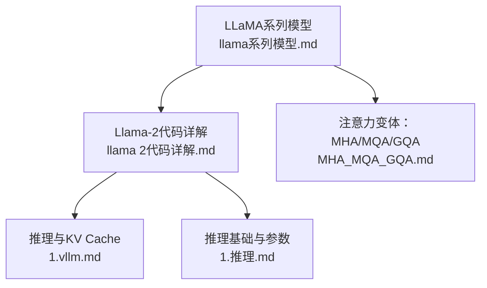
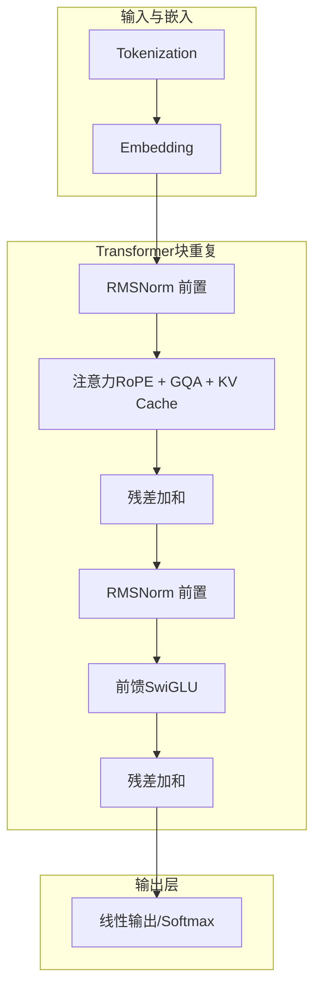
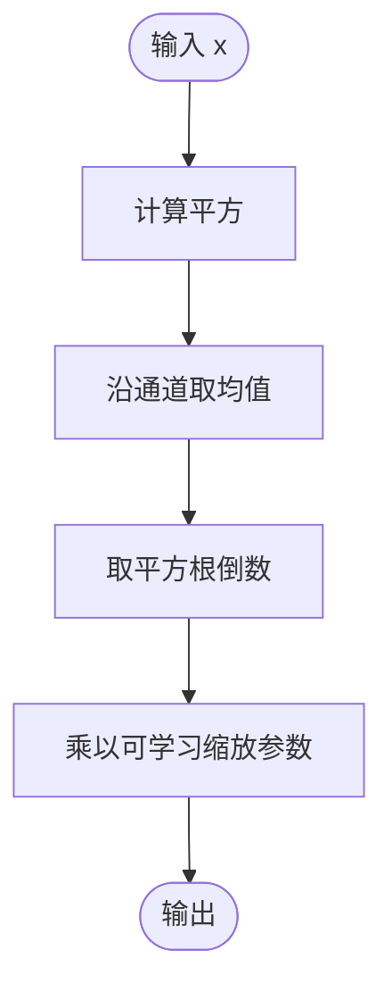
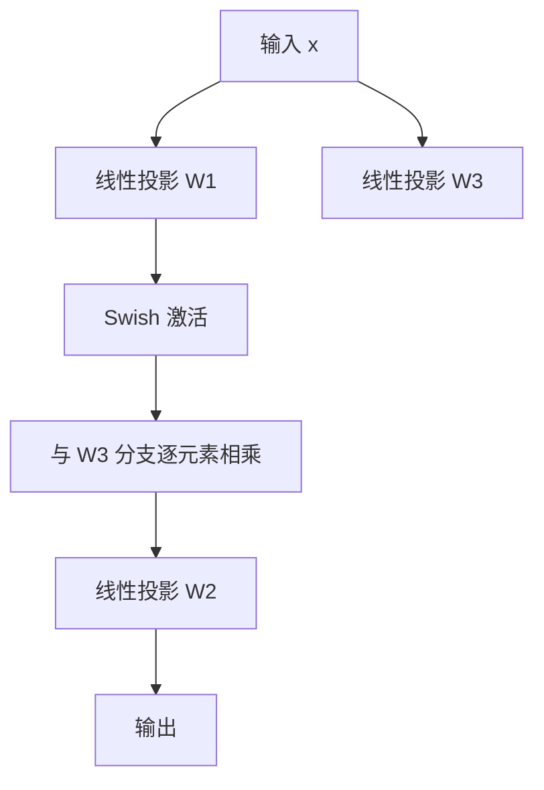
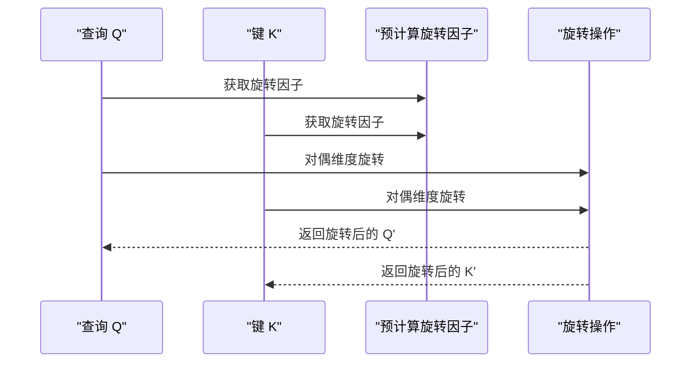
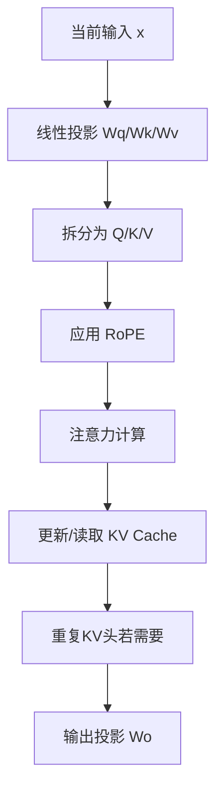
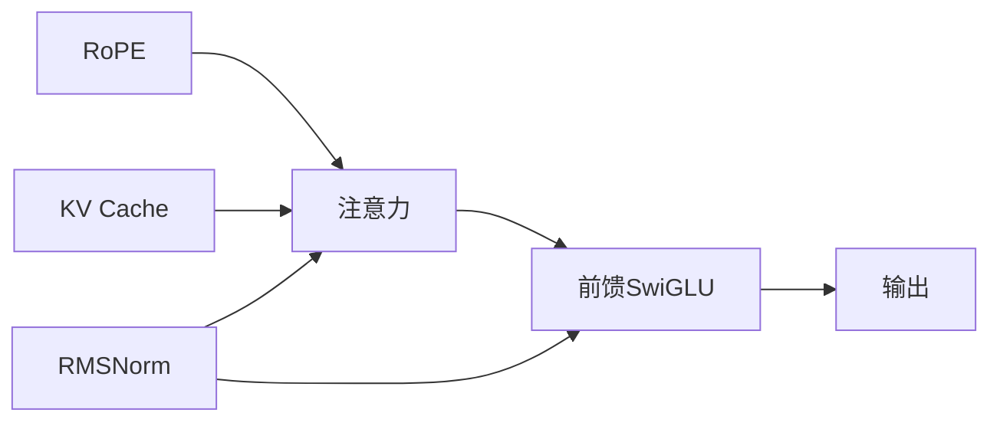

# LLaMA系列模型

<cite>
**本文引用的文件**
- [llama系列模型.md](file://02.大语言模型架构/llama系列模型/llama系列模型.md)
- [llama 2代码详解.md](file://02.大语言模型架构/llama 2代码详解/llama 2代码详解.md)
- [MHA_MQA_GQA.md](file://02.大语言模型架构/MHA_MQA_GQA/MHA_MQA_GQA.md)
- [1.vllm.md](file://06.推理/1.vllm/1.vllm.md)
- [1.推理.md](file://06.推理/1.推理/1.推理.md)
</cite>

## 目录
1. [简介](#简介)
2. [项目结构](#项目结构)
3. [核心组件](#核心组件)
4. [架构总览](#架构总览)
5. [详细组件分析](#详细组件分析)
6. [依赖关系分析](#依赖关系分析)
7. [性能与优化](#性能与优化)
8. [故障排查指南](#故障排查指南)
9. [结论](#结论)
10. [附录](#附录)

## 简介
本文件系统性梳理LLaMA系列模型的设计理念、架构要点与关键技术，覆盖前置层归一化、RMSNorm、SwiGLU、旋转位置嵌入（RoPE）、GQA注意力、上下文窗口扩展、指令微调（Alpaca）与代码生成（Code Llama）等主题。文档同时给出不同规模模型（7B、13B、33B、65B）的维度设计原理与工程权衡，并结合推理优化（KV Cache、PagedAttention、vLLM）与常见应用场景进行说明。

## 项目结构
围绕LLaMA系列模型，仓库中与之直接相关的知识主要集中在“大语言模型架构”和“推理”两大板块：
- 架构与模型细节：llama系列模型、llama 2代码详解、MHA_MQA_GQA
- 推理与性能优化：vLLM、LLM推理常见参数、推理基础与优化

图表来源
- [llama系列模型.md:1-377](file://02.大语言模型架构/llama系列模型/llama系列模型.md#L1-L377)
- [llama 2代码详解.md:1-527](file://02.大语言模型架构/llama 2代码详解/llama 2代码详解.md#L1-L527)
- [MHA_MQA_GQA.md:1-225](file://02.大语言模型架构/MHA_MQA_GQA/MHA_MQA_GQA.md#L1-L225)
- [1.vllm.md:1-220](file://06.推理/1.vllm/1.vllm.md#L1-L220)
- [1.推理.md:1-94](file://06.推理/1.推理/1.推理.md#L1-L94)

章节来源
- [llama系列模型.md:1-377](file://02.大语言模型架构/llama系列模型/llama系列模型.md#L1-L377)
- [llama 2代码详解.md:1-527](file://02.大语言模型架构/llama 2代码详解/llama 2代码详解.md#L1-L527)
- [MHA_MQA_GQA.md:1-225](file://02.大语言模型架构/MHA_MQA_GQA/MHA_MQA_GQA.md#L1-L225)
- [1.vllm.md:1-220](file://06.推理/1.vllm/1.vllm.md#L1-L220)
- [1.推理.md:1-94](file://06.推理/1.推理/1.推理.md#L1-L94)

## 核心组件
- 前置层归一化与RMSNorm：在注意力与前馈层之前进行归一化，提升训练稳定性与收敛速度。
- SwiGLU激活函数：替代ReLU，提升FFN表达能力，配合维度放缩（约2/3×4d）。
- 旋转位置嵌入（RoPE）：将绝对位置编码转化为相对位置信息，适合长序列与高效注意力。
- GQA注意力：在MHA与MQA之间折中，显著降低KV缓存与内存压力，同时保持性能。
- 上下文窗口扩展：Llama-2将上下文长度从2048扩展到4096，扩大训练语料与上下文容量。
- 指令微调（Alpaca）：在LLaMA基础上使用52K指令数据进行精调，获得指令遵循能力。
- Code Llama：面向代码的多语言模型，支持代码补全、代码推理与代码生成任务。

章节来源
- [llama系列模型.md:100-186](file://02.大语言模型架构/llama系列模型/llama系列模型.md#L100-L186)
- [llama 2代码详解.md:160-220](file://02.大语言模型架构/llama 2代码详解/llama 2代码详解.md#L160-L220)
- [MHA_MQA_GQA.md:1-225](file://02.大语言模型架构/MHA_MQA_GQA/MHA_MQA_GQA.md#L1-L225)
- [llama系列模型.md:257-377](file://02.大语言模型架构/llama系列模型/llama系列模型.md#L257-L377)

## 架构总览
下图展示LLaMA系列（以Llama-2为代表）的典型Decoder-only结构与关键模块：前置RMSNorm、RoPE位置编码、GQA注意力、KV Cache、SwiGLU前馈。

图表来源
- [llama 2代码详解.md:160-220](file://02.大语言模型架构/llama 2代码详解/llama 2代码详解.md#L160-L220)
- [llama 2代码详解.md:206-331](file://02.大语言模型架构/llama 2代码详解/llama 2代码详解.md#L206-L331)
- [llama 2代码详解.md:333-481](file://02.大语言模型架构/llama 2代码详解/llama 2代码详解.md#L333-L481)
- [llama 2代码详解.md:483-514](file://02.大语言模型架构/llama 2代码详解/llama 2代码详解.md#L483-L514)

## 详细组件分析

### 前置层归一化与RMSNorm
- 设计动机：将归一化前置到注意力与前馈之前，提升训练稳定性与收敛速度。
- RMSNorm公式与实现要点：仅对平方均值的根倒数进行缩放，引入可学习缩放参数，避免均值与偏置项，计算更高效。
- 与LayerNorm差异：省去均值与偏置，仅保留缩放参数，数值稳定性和硬件友好性更优。

图表来源
- [llama系列模型.md:100-131](file://02.大语言模型架构/llama系列模型/llama系列模型.md#L100-L131)
- [llama 2代码详解.md:173-204](file://02.大语言模型架构/llama 2代码详解/llama 2代码详解.md#L173-L204)

章节来源
- [llama系列模型.md:100-131](file://02.大语言模型架构/llama系列模型/llama系列模型.md#L100-L131)
- [llama 2代码详解.md:173-204](file://02.大语言模型架构/llama 2代码详解/llama 2代码详解.md#L173-L204)

### SwiGLU激活函数
- 作用：在FFN中替代ReLU，提升表达能力；配合维度放缩（约2/3×4d）以维持参数量与计算量可控。
- 形态：由Swish激活与门控机制组成，结合两个线性投影分支进行逐元素乘法。

图表来源
- [llama系列模型.md:133-156](file://02.大语言模型架构/llama系列模型/llama系列模型.md#L133-L156)
- [llama 2代码详解.md:483-514](file://02.大语言模型架构/llama 2代码详解/llama 2代码详解.md#L483-L514)

章节来源
- [llama系列模型.md:133-156](file://02.大语言模型架构/llama系列模型/llama系列模型.md#L133-L156)
- [llama 2代码详解.md:483-514](file://02.大语言模型架构/llama 2代码详解/llama 2代码详解.md#L483-L514)

### 旋转位置嵌入（RoPE）
- 思想：借助复数/旋转矩阵，将绝对位置编码转化为相对位置信息，适合自回归与长序列。
- 实现要点：预计算复数旋转因子，按维度成对应用到Q/K，实现二维旋转后还原为实向量。
- 与绝对位置编码对比：RoPE在注意力计算时动态注入相对位置，避免固定位置表。

图表来源
- [llama系列模型.md:157-255](file://02.大语言模型架构/llama系列模型/llama系列模型.md#L157-L255)
- [llama 2代码详解.md:206-331](file://02.大语言模型架构/llama 2代码详解/llama 2代码详解.md#L206-L331)

章节来源
- [llama系列模型.md:157-255](file://02.大语言模型架构/llama系列模型/llama系列模型.md#L157-L255)
- [llama 2代码详解.md:206-331](file://02.大语言模型架构/llama 2代码详解/llama 2代码详解.md#L206-L331)

### GQA注意力与KV Cache
- GQA：将查询头分组，组内共享KV，兼顾MHA的精度与MQA的内存效率。
- KV Cache：缓存历史时刻的K/V，避免重复计算，显著降低推理延迟。
- 实现要点：预分配缓存张量，按步追加新K/V，必要时重复KV头以匹配查询头数。

图表来源
- [llama 2代码详解.md:333-481](file://02.大语言模型架构/llama 2代码详解/llama 2代码详解.md#L333-L481)
- [MHA_MQA_GQA.md:158-224](file://02.大语言模型架构/MHA_MQA_GQA/MHA_MQA_GQA.md#L158-L224)

章节来源
- [llama 2代码详解.md:333-481](file://02.大语言模型架构/llama 2代码详解/llama 2代码详解.md#L333-L481)
- [MHA_MQA_GQA.md:158-224](file://02.大语言模型架构/MHA_MQA_GQA/MHA_MQA_GQA.md#L158-L224)

### 不同规模模型的维度设计（7B/13B/33B/65B）
- 基本原则：遵循缩放定律与工程实践，兼顾参数量、计算量与硬件友好性。
- 关键关系：hidden_dim = num_heads × head_dim，head_dim通常为128的倍数，便于Tensor Core优化。
- 规模对比：随参数量增加，hidden_dim按约√2倍增长，层数与头数相应增加，以维持约7B、13B、32.5B、65B的总参数量目标。

章节来源
- [llama系列模型.md:64-96](file://02.大语言模型架构/llama系列模型/llama系列模型.md#L64-L96)

### 指令微调（Alpaca）
- 数据来源：使用52K指令数据在LLaMA上进行精调，成本极低（数据约$500 + 机器约$100）。
- 数据格式：包含instruction、input（可选）、output三要素，支持多样化的指令任务。
- 效果：在多项评测中达到与text-davinci-003相当的水平，具备良好的指令遵循能力。

章节来源
- [llama系列模型.md:257-295](file://02.大语言模型架构/llama系列模型/llama系列模型.md#L257-L295)

### Code Llama（代码生成）
- 多语言支持：Python、C++、Java、PHP、TypeScript、C#、Bash等。
- 特色任务：Code Infilling（代码补全），在7B/13B上支持，通过掩码上下文预测缺失代码。
- 上下文窗口：可达100K，适合长代码片段与工程场景。

章节来源
- [llama系列模型.md:333-361](file://02.大语言模型架构/llama系列模型/llama系列模型.md#L333-L361)

## 依赖关系分析
- 模块耦合：注意力模块依赖RoPE与KV Cache；前馈模块依赖SwiGLU；归一化模块贯穿各子层。
- 外部依赖：推理优化依赖KV Cache与分页管理（如PagedAttention），与硬件内存带宽密切相关。
- 注意力家族：MHA/MQA/GQA在KV缓存与吞吐之间权衡，GQA在LLaMA-2中成为主流。

图表来源
- [llama 2代码详解.md:206-331](file://02.大语言模型架构/llama 2代码详解/llama 2代码详解.md#L206-L331)
- [llama 2代码详解.md:483-514](file://02.大语言模型架构/llama 2代码详解/llama 2代码详解.md#L483-L514)

章节来源
- [llama 2代码详解.md:206-331](file://02.大语言模型架构/llama 2代码详解/llama 2代码详解.md#L206-L331)
- [llama 2代码详解.md:483-514](file://02.大语言模型架构/llama 2代码详解/llama 2代码详解.md#L483-L514)

## 性能与优化
- KV Cache与GQA：显著降低KV缓存占用，提升吞吐；GQA在精度与效率间取得平衡。
- PagedAttention：将KV缓存分页存储，减少碎片与浪费，提升内存利用率与并发序列数。
- 推理框架：vLLM通过连续批处理（Continuous Batching）与PagedAttention，实现高吞吐与低延迟。
- 硬件与精度：INT8/FP16相较FP32可提升吞吐，但需权衡精度与硬件支持；GPU推理普遍快于CPU。

章节来源
- [1.vllm.md:55-150](file://06.推理/1.vllm/1.vllm.md#L55-L150)
- [1.推理.md:16-38](file://06.推理/1.推理/1.推理.md#L16-L38)

## 故障排查指南
- 显存占用高：检查是否开启KV Cache、是否使用分页管理（PagedAttention）、是否量化（INT8/FP16）。
- 推理吞吐低：确认是否启用GQA、是否使用连续批处理（Continuous Batching）、是否合理设置温度与Top-p采样。
- 上下文过短：确认模型上下文长度配置（Llama-2为4096），并评估输入长度与批处理策略。
- 代码生成异常：检查Code Llama的代码补全任务格式与掩码策略，确保输入上下文与语言模式匹配。

章节来源
- [1.vllm.md:55-150](file://06.推理/1.vllm/1.vllm.md#L55-L150)
- [1.推理.md:1-94](file://06.推理/1.推理/1.推理.md#L1-L94)

## 结论
LLaMA系列以简洁而高效的架构设计奠定了开源大模型的基石：前置RMSNorm、RMSNorm、SwiGLU、RoPE与GQA等技术共同提升了训练稳定性、表达能力与推理效率。Llama-2在上下文窗口、注意力优化与工程落地方面进一步完善，Alpaca与Code Llama则分别拓展了指令遵循与代码生成能力。结合KV Cache、PagedAttention与现代推理框架（如vLLM），可在保证质量的前提下实现高吞吐与低延迟。

## 附录
- 应用场景建议：
  - 通用对话与问答：Llama-2 Chat（7B/13B/70B）适合不同资源与延迟需求。
  - 代码生成与补全：Code Llama（7B/13B/34B）支持多语言与长上下文。
  - 指令遵循：Alpaca在少量指令数据上即可获得良好效果，适合快速部署。
- 性能基准与对比：仓库未提供具体数值，建议结合公开榜单与自测环境评估不同规模与精度设置下的吞吐与延迟。