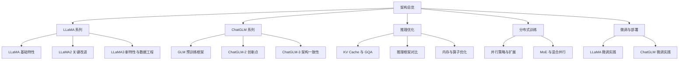
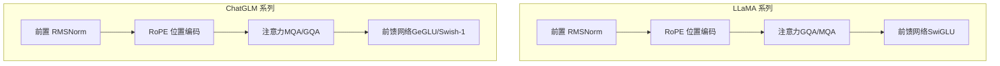
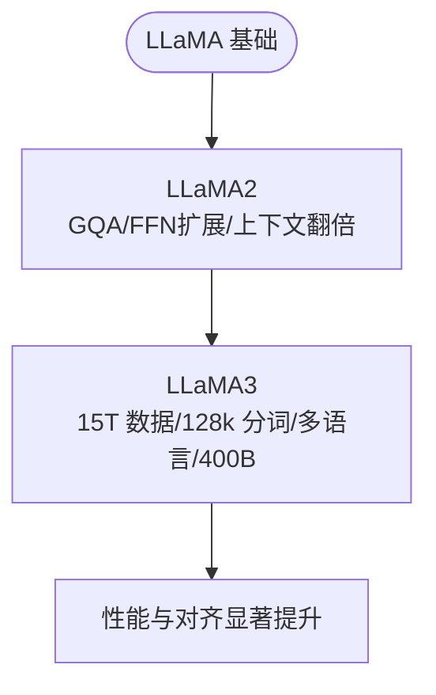
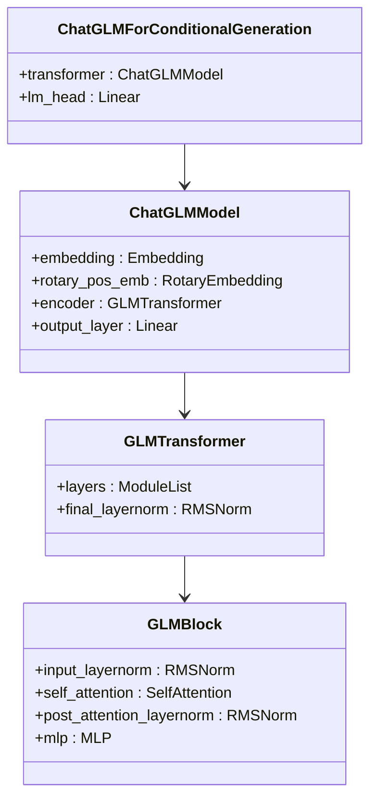
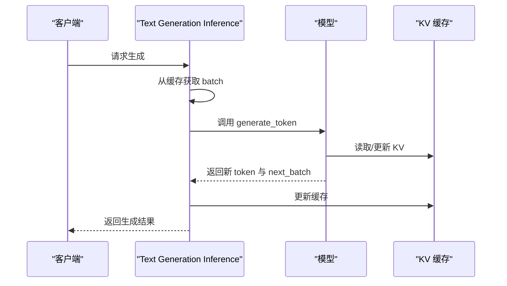
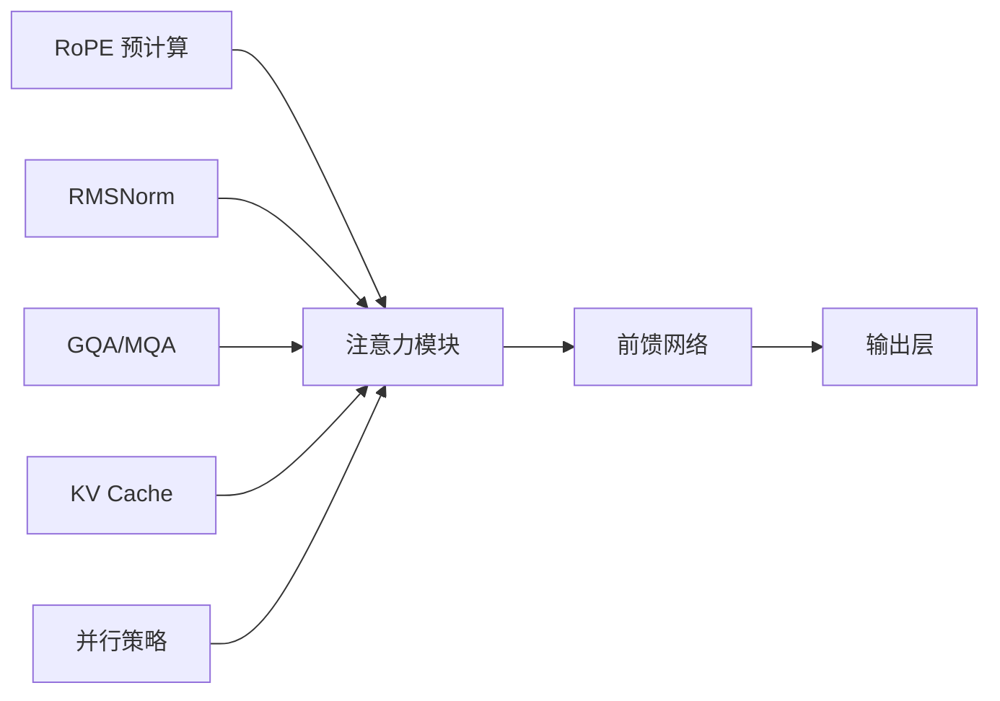

# 主流大模型架构

<cite>
**本文引用的文件**
- [llama系列模型.md](file://02.大语言模型架构/llama系列模型/llama系列模型.md)
- [llama 2代码详解.md](file://02.大语言模型架构/llama 2代码详解/llama 2代码详解.md)
- [llama 3.md](file://02.大语言模型架构/llama 3/llama 3.md)
- [chatglm系列模型.md](file://02.大语言模型架构/chatglm系列模型/chatglm系列模型.md)
- [llm推理优化技术.md](file://06.推理/llm推理优化技术/llm推理优化技术.md)
- [3.faster_transformer.md](file://06.推理/3.faster_transformer/3.faster_transformer.md)
- [2.text_generation_inference.md](file://06.推理/2.text_generation_inference/2.text_generation_inference.md)
- [llama2微调.md](file://05.有监督微调/llama2微调/llama2微调.md)
- [ChatGLM3微调.md](file://05.有监督微调/ChatGLM3微调/ChatGLM3微调.md)
- [README.md](file://02.大语言模型架构/README.md)
</cite>

## 目录
1. [引言](#引言)
2. [项目结构](#项目结构)
3. [核心组件](#核心组件)
4. [架构总览](#架构总览)
5. [详细组件分析](#详细组件分析)
6. [依赖分析](#依赖分析)
7. [性能考量](#性能考量)
8. [故障排查指南](#故障排查指南)
9. [结论](#结论)
10. [附录](#附录)

## 引言
本文件围绕主流大模型架构，系统梳理 LLaMA 系列（LLaMA、LLaMA2、LLaMA3）的发展脉络、架构演进与性能提升，同时深入解析 ChatGLM 系列模型的结构与创新点。文档覆盖模型参数规模、训练数据、推理性能、代码实现与部署实践，并提供适用场景与选型策略，帮助读者在不同任务与资源约束下做出合理决策。

## 项目结构
本仓库以“大语言模型架构”为主线，围绕 Transformer 解码器架构、注意力机制、位置编码、归一化、前馈网络等核心模块组织内容；同时包含推理优化、分布式训练、微调与部署等实践章节。LLaMA 与 ChatGLM 的架构与实现细节在“架构”与“推理”两大板块中均有体现。

图表来源
- [README.md:1-52](file://02.大语言模型架构/README.md#L1-L52)

章节来源
- [README.md:1-52](file://02.大语言模型架构/README.md#L1-L52)

## 核心组件
- 解码器架构与 Transformer Block：主流 LLM 采用 Decoder-only 的 Transformer 架构，包含 RMSNorm、RoPE、注意力（含 GQA/MQA/GQA）、前馈网络（SwiGLU/GeGLU/SiLU）等关键模块。
- 位置编码：RoPE 在 LLaMA/ChatGLM 等现代模型中成为标准，用于建模相对位置关系并提升长序列性能。
- 归一化与激活：RMSNorm 与 SwiGLU/GeGLU/SiLU 等激活函数在稳定性与表达能力上各有侧重。
- 注意力优化：GQA/MQA/分组注意力在 KV 缓存与吞吐之间取得平衡，是大模型推理的关键优化手段。
- 推理框架：TGI、FasterTransformer、vLLM 等框架在 KV Cache、张量/流水线并行、算子自动调优等方面提供工程化支撑。

章节来源
- [llama系列模型.md:1-377](file://02.大语言模型架构/llama系列模型/llama系列模型.md#L1-L377)
- [llama 2代码详解.md:160-527](file://02.大语言模型架构/llama 2代码详解/llama 2代码详解.md#L160-L527)
- [llama 3.md:1-110](file://02.大语言模型架构/llama 3/llama 3.md#L1-L110)
- [chatglm系列模型.md:1-214](file://02.大语言模型架构/chatglm系列模型/chatglm系列模型.md#L1-L214)
- [llm推理优化技术.md:108-150](file://06.推理/llm推理优化技术/llm推理优化技术.md#L108-L150)
- [3.faster_transformer.md:40-54](file://06.推理/3.faster_transformer/3.faster_transformer.md#L40-L54)
- [2.text_generation_inference.md:126-140](file://06.推理/2.text_generation_inference/2.text_generation_inference.md#L126-L140)

## 架构总览
下图给出 LLaMA/ChatGLM 的通用解码器架构要点与关键差异，帮助快速建立整体认知。

图表来源
- [llama系列模型.md:100-156](file://02.大语言模型架构/llama系列模型/llama系列模型.md#L100-L156)
- [llama 2代码详解.md:173-331](file://02.大语言模型架构/llama 2代码详解/llama 2代码详解.md#L173-L331)
- [chatglm系列模型.md:119-213](file://02.大语言模型架构/chatglm系列模型/chatglm系列模型.md#L119-L213)

## 详细组件分析

### LLaMA 系列：发展脉络与架构演进
- LLaMA（基础版）
  - 采用前置 RMSNorm 与 RoPE，激活函数为 SwiGLU，整体结构与 GPT-2 类似。
  - 维度设计遵循缩放定律与工程实践，隐藏维度、注意力头数与头维度协同，兼顾硬件友好与参数量控制。
  - 维度与参数量关系呈现“每参数翻倍，隐藏维度约增√2”的规律。
- LLaMA2
  - 引入 GQA（如 GQA-8）与 FFN 维度扩展，上下文长度翻倍（2048→4096），训练语料从 1.4T 增长到 2.0T。
  - 推理吞吐显著提升，KV 缓存压力有效缓解。
- LLaMA3
  - 参数规模扩展至 8B/70B，支持 8k 上下文，采用 128k 分词器，训练数据达 15T+，包含大量代码与多语言数据。
  - 指令微调链路完善，结合 SFT、拒绝采样、PPO/DPO，显著提升对齐质量与多样性。
  - 400B 模型训练进行中，早期检查点已接近 GPT-4 级别性能。

图表来源
- [llama系列模型.md:3-100](file://02.大语言模型架构/llama系列模型/llama系列模型.md#L3-L100)
- [llama 2代码详解.md:160-527](file://02.大语言模型架构/llama 2代码详解/llama 2代码详解.md#L160-L527)
- [llama 3.md:1-110](file://02.大语言模型架构/llama 3/llama 3.md#L1-L110)

章节来源
- [llama系列模型.md:1-377](file://02.大语言模型架构/llama系列模型/llama系列模型.md#L1-L377)
- [llama 2代码详解.md:160-527](file://02.大语言模型架构/llama 2代码详解/llama 2代码详解.md#L160-L527)
- [llama 3.md:1-110](file://02.大语言模型架构/llama 3/llama 3.md#L1-L110)

### ChatGLM 系列：GLM 预训练框架与架构演进
- GLM 预训练框架
  - 自回归空格填充（AR Blank Infilling）结合自编码思想与双向/单向注意力掩码，支持无条件生成与条件生成统一训练。
  - 二维位置编码与 span shuffle 技术，使模型同时具备 encoder 与 decoder 的能力。
- ChatGLM-2
  - 引入 FlashAttention 技术，上下文长度扩展至 32K；采用 Multi-Query Attention，推理速度提升、显存占用降低。
  - 完全转向 decoder-only 架构，RoPE 替代二维位置编码，Attention Mask 全部使用因果掩码。
- ChatGLM-3
  - 与 ChatGLM-2 架构一致，词表规模缩小、位置编码全局化、前馈网络激活函数调整（Swish-1），修复 GLU 维度不一致问题。

图表来源
- [chatglm系列模型.md:119-213](file://02.大语言模型架构/chatglm系列模型/chatglm系列模型.md#L119-L213)

章节来源
- [chatglm系列模型.md:1-214](file://02.大语言模型架构/chatglm系列模型/chatglm系列模型.md#L1-L214)

### 推理优化：KV Cache 与注意力变体
- KV Cache：在自回归解码中缓存 K/V，避免重复计算，显著降低延迟与显存占用。
- GQA/MQA：通过共享 K/V 头或分组共享，减少 KV 缓存与内存带宽压力，提升吞吐；GQA 在精度与效率间取得平衡。
- 推理框架对比
  - TGI：通过缓存 batch 与词向量，减少重复计算，支持高吞吐服务化部署。
  - FasterTransformer：重用激活/输出缓冲、张量并行与流水线并行、GEMM 自动调优，降低每层内存占用。
  - vLLM：在仓库中另有专题，聚焦吞吐与内存优化策略。

图表来源
- [2.text_generation_inference.md:126-140](file://06.推理/2.text_generation_inference/2.text_generation_inference.md#L126-L140)

章节来源
- [llm推理优化技术.md:108-150](file://06.推理/llm推理优化技术/llm推理优化技术.md#L108-L150)
- [3.faster_transformer.md:40-54](file://06.推理/3.faster_transformer/3.faster_transformer.md#L40-L54)
- [2.text_generation_inference.md:126-140](file://06.推理/2.text_generation_inference/2.text_generation_inference.md#L126-L140)

### 代码实现解析与部署经验
- LLaMA2 推理主流程
  - 生成循环：按步取 logits，温度采样与 top-p 采样，逐步扩展输入序列，直至达到最大长度或命中结束标记。
  - RoPE 预计算与广播、注意力掩码、KV Cache 管理与重复扩展（repeat_kv）等关键步骤在注意力模块中实现。
- ChatGLM 推理要点
  - 词表规模与位置编码全局化、前馈网络激活函数差异，需在加载与推理时注意维度一致性与量化策略。
- 微调与部署
  - LLaMA2 微调：从模型下载、数据准备到 LoRA/QLoRA/Adapter 等轻量微调方案，结合数据质量与标注成本进行权衡。
  - ChatGLM3 微调：官方教程覆盖 Function Call、Code Interpreter、Agent 等应用场景，强调在中文与多任务场景下的适配。

章节来源
- [llama 2代码详解.md:112-158](file://02.大语言模型架构/llama 2代码详解/llama 2代码详解.md#L112-L158)
- [llama 2代码详解.md:413-481](file://02.大语言模型架构/llama 2代码详解/llama 2代码详解.md#L413-L481)
- [llama2微调.md:1-4](file://05.有监督微调/llama2微调/llama2微调.md#L1-L4)
- [ChatGLM3微调.md:1-12](file://05.有监督微调/ChatGLM3微调/ChatGLM3微调.md#L1-L12)

## 依赖分析
- 组件耦合
  - LLaMA/ChatGLM 的注意力模块与位置编码紧密耦合，RoPE 的预计算与广播在注意力前执行。
  - 前馈网络与激活函数的选择直接影响模型表达能力与训练稳定性。
  - 推理优化（GQA/MQA、KV Cache、并行策略）与硬件资源（显存、带宽）密切相关。
- 外部依赖
  - 推理框架（TGI、FasterTransformer、vLLM）提供工程化落地能力，需结合业务吞吐与延迟目标进行选型。
  - 分布式训练（数据/模型/流水线并行）与 MoE 并行策略在大规模模型训练中至关重要。

图表来源
- [llama 2代码详解.md:258-331](file://02.大语言模型架构/llama 2代码详解/llama 2代码详解.md#L258-L331)
- [llm推理优化技术.md:108-150](file://06.推理/llm推理优化技术/llm推理优化技术.md#L108-L150)

章节来源
- [llama 2代码详解.md:160-527](file://02.大语言模型架构/llama 2代码详解/llama 2代码详解.md#L160-L527)
- [llm推理优化技术.md:108-150](file://06.推理/llm推理优化技术/llm推理优化技术.md#L108-L150)

## 性能考量
- 训练数据与规模
  - LLaMA3 训练数据达 15T+，包含大量代码与多语言数据，显著提升跨任务与多语言能力。
  - ChatGLM-2 通过 FlashAttention 将上下文长度扩展至 32K，配合 MQA/GQA 提升推理效率。
- 推理吞吐与显存
  - GQA/MQA 通过减少 KV 缓存与内存带宽消耗，提升吞吐；在受限显存场景下优先考虑 MQA/GQA。
  - 推理框架通过 KV 缓存复用、算子自动调优与并行策略，降低每 token 的延迟与内存峰值。
- 激活函数与归一化
  - RMSNorm 与 SwiGLU/GeGLU/SiLU 在稳定性与表达能力之间取得平衡，适合大规模模型训练与推理。

章节来源
- [llama 3.md:53-71](file://02.大语言模型架构/llama 3/llama 3.md#L53-L71)
- [llm推理优化技术.md:108-150](file://06.推理/llm推理优化技术/llm推理优化技术.md#L108-L150)
- [3.faster_transformer.md:40-54](file://06.推理/3.faster_transformer/3.faster_transformer.md#L40-L54)

## 故障排查指南
- 推理延迟异常
  - 检查 KV Cache 是否正确初始化与复用，确认 repeat_kv 与掩码逻辑。
  - 评估是否启用 GQA/MQA，核对显存与带宽瓶颈。
- 显存溢出
  - 降低 batch size 或序列长度，启用 INT4/8 量化与分片并行。
  - 使用 FasterTransformer 的激活重用与算子自动调优。
- 对齐与多样性不足
  - 指令微调链路（SFT/PPO/DPO）与偏好数据质量密切相关，需加强数据清洗与标注质量保障。
- ChatGLM 维度不一致
  - 注意 GLU 门控分支的维度设计，确保前馈网络输入/输出维度一致。

章节来源
- [llama 2代码详解.md:413-481](file://02.大语言模型架构/llama 2代码详解/llama 2代码详解.md#L413-L481)
- [3.faster_transformer.md:40-54](file://06.推理/3.faster_transformer/3.faster_transformer.md#L40-L54)
- [llama 3.md:73-78](file://02.大语言模型架构/llama 3/llama 3.md#L73-L78)
- [chatglm系列模型.md:101-106](file://02.大语言模型架构/chatglm系列模型/chatglm系列模型.md#L101-L106)

## 结论
- LLaMA 系列以“解码器架构 + RoPE + RMSNorm + SwiGLU + GQA/MQA”为核心范式，持续在数据规模、上下文长度与推理效率上取得突破。
- ChatGLM 系列以 GLM 预训练框架为基础，通过 FlashAttention、MQA/GQA 与 RoPE，实现长上下文与高效推理，并在中文场景具备优势。
- 工程化层面，KV Cache、GQA/MQA、并行策略与推理框架（TGI/FasterTransformer/vLLM）共同构成大模型部署的“软硬协同”体系。
- 选型建议：若追求通用与对齐质量，优先 LLaMA3；若强调中文与长上下文，优先 ChatGLM-2/3；若资源受限，优先采用 MQA/GQA 与量化策略。

## 附录
- 适用场景与选择策略
  - 通用生成与对齐：LLaMA3（8B/70B）
  - 中文对话与长上下文：ChatGLM-2/3（32K 上下文）
  - 资源受限与高吞吐：MQA/GQA + 量化 + 推理框架（TGI/FasterTransformer）
  - 代码与多语言：LLaMA3（代码数据占比高）、多语言数据增强
- 微调与部署
  - LLaMA2：LoRA/QLoRA/Adapter 等轻量微调方案，结合高质量指令数据与偏好对齐。
  - ChatGLM3：Function Call、Code Interpreter、Agent 场景的官方教程与实践路径。

章节来源
- [llama 3.md:1-110](file://02.大语言模型架构/llama 3/llama 3.md#L1-L110)
- [chatglm系列模型.md:81-106](file://02.大语言模型架构/chatglm系列模型/chatglm系列模型.md#L81-L106)
- [llama2微调.md:1-4](file://05.有监督微调/llama2微调/llama2微调.md#L1-L4)
- [ChatGLM3微调.md:1-12](file://05.有监督微调/ChatGLM3微调/ChatGLM3微调.md#L1-L12)