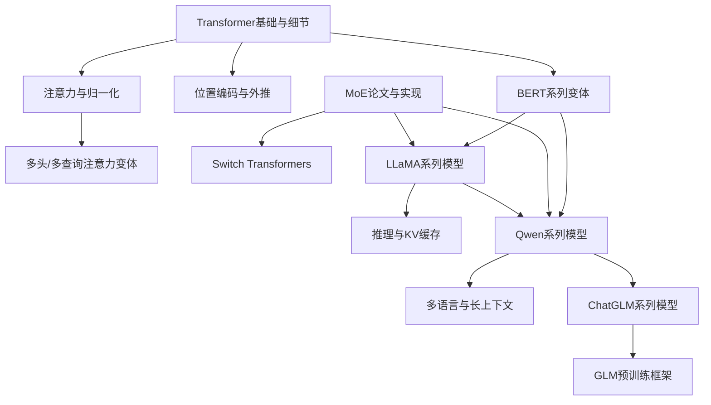
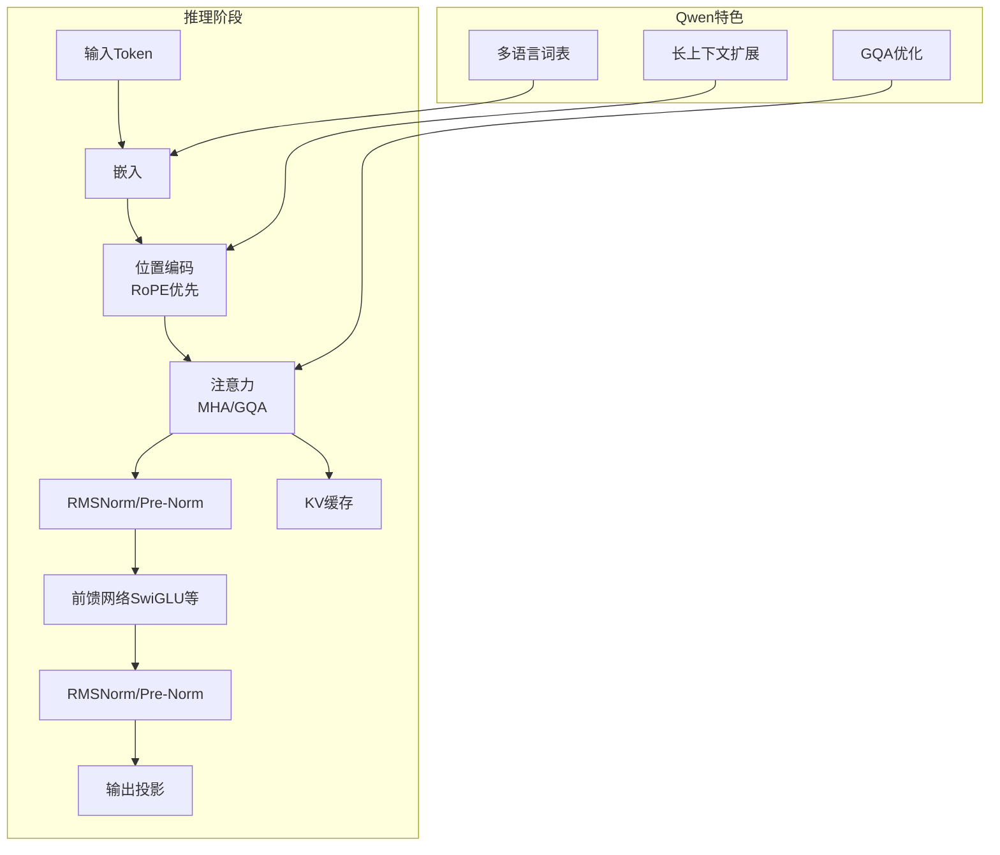
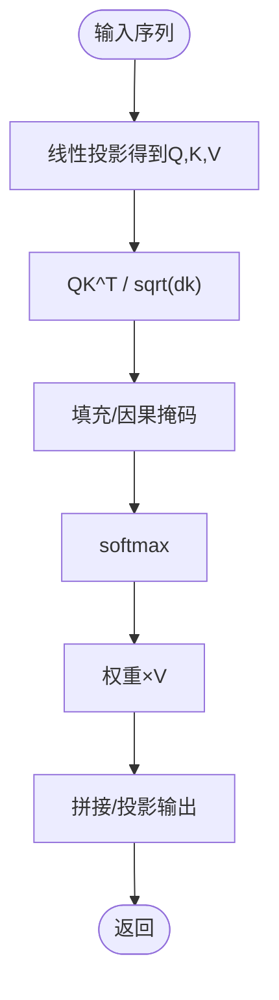
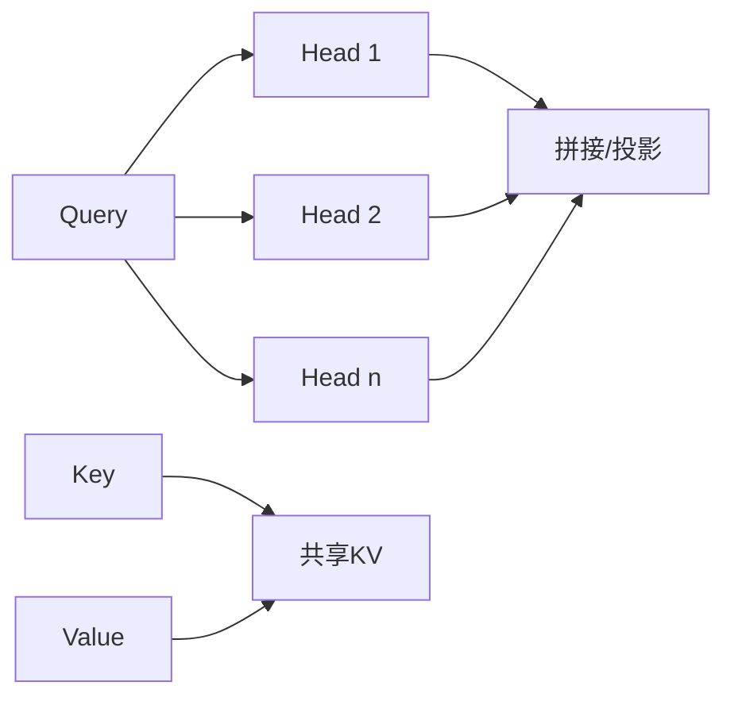
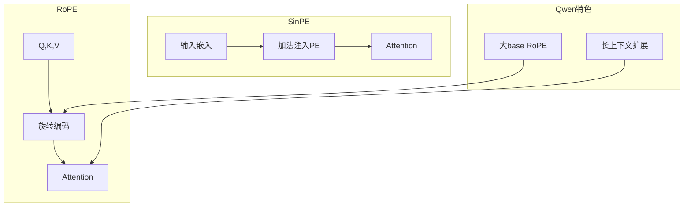
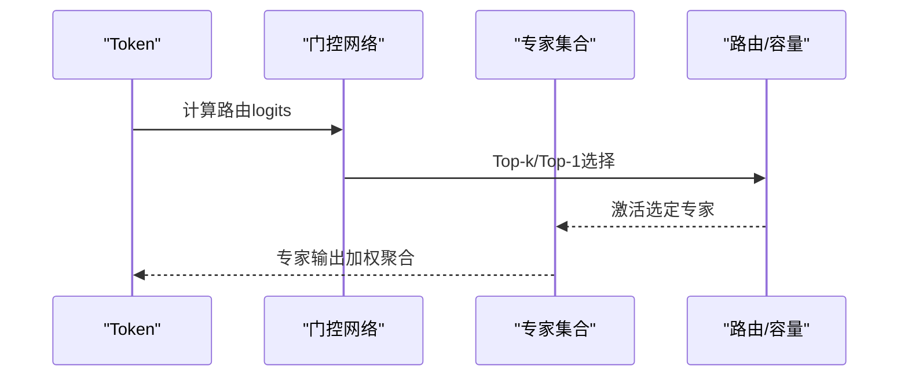
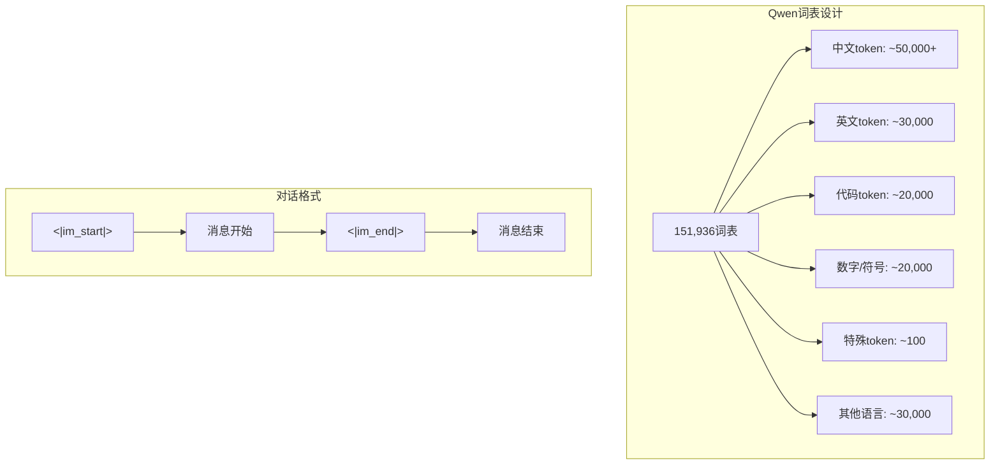
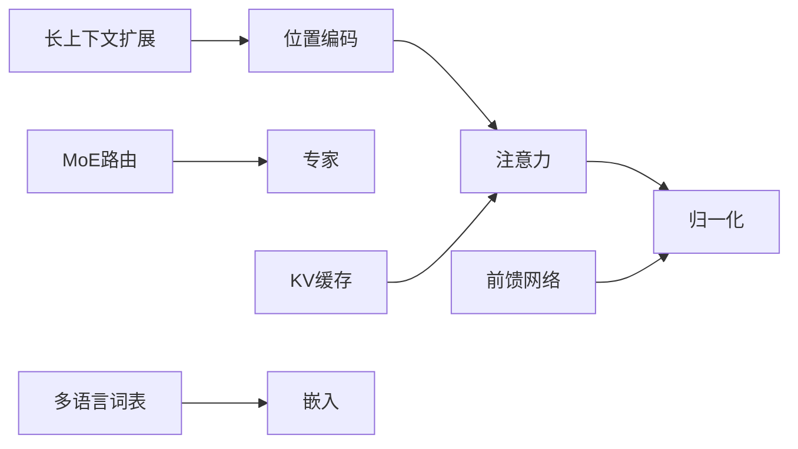

# 大语言模型架构

<cite>
**本文引用的文件**
- [Transformer架构细节.md](file://02.大语言模型架构/Transformer架构细节/Transformer架构细节.md)
- [1.attention.md](file://02.大语言模型架构/1.attention/1.attention.md)
- [BN VS LN.md](file://02.大语言模型架构/1.attention/BN VS LN.md)
- [2.layer_normalization.md](file://02.大语言模型架构/2.layer_normalization/2.layer_normalization.md)
- [3.位置编码.md](file://02.大语言模型架构/3.位置编码/3.位置编码.md)
- [位置编码.md](file://02.大语言模型架构/1.attention/位置编码.md)
- [MHA_MQA_GQA.md](file://02.大语言模型架构/MHA_MQA_GQA/MHA_MQA_GQA.md)
- [bert变种.md](file://02.大语言模型架构/bert变种/bert变种.md)
- [bert细节.md](file://02.大语言模型架构/bert细节/bert细节.md)
- [1.MoE论文.md](file://02.大语言模型架构/1.MoE论文/1.MoE论文.md)
- [2.MoE经典论文简牍.md](file://02.大语言模型架构/2.MoE经典论文简牍/2.MoE经典论文简牍.md)
- [3.LLM MoE ：Switch Transformers.md](file://02.大语言模型架构/3.LLM MoE ：Switch Transformers/3.LLM MoE ：Switch Transformers.md)
- [llama系列模型.md](file://02.大语言模型架构/llama系列模型/llama系列模型.md)
- [llama 2代码详解.md](file://02.大语言模型架构/llama 2代码详解/llama 2代码详解.md)
- [qwen系列模型.md](file://02.大语言模型架构/qwen系列模型/qwen系列模型.md)
- [chatglm系列模型.md](file://02.大语言模型架构/chatglm系列模型/chatglm系列模型.md)
</cite>

## 更新摘要
**变更内容**
- 新增Qwen系列模型架构详解章节
- 扩展主流模型对比分析，包含Qwen、LLaMA、ChatGLM三大系列
- 添加多模态模型（Qwen-VL、Qwen-Audio）相关内容
- 更新架构对比表格，体现各模型的技术特色
- 完善模型选型建议和应用场景指导

## 目录
1. [引言](#引言)
2. [项目结构](#项目结构)
3. [核心组件](#核心组件)
4. [架构总览](#架构总览)
5. [详细组件分析](#详细组件分析)
6. [主流模型架构对比](#主流模型架构对比)
7. [依赖分析](#依赖分析)
8. [性能考量](#性能考量)
9. [故障排查指南](#故障排查指南)
10. [结论](#结论)
11. [附录](#附录)

## 引言
本文件系统性梳理大语言模型（LLM）的架构设计，围绕Transformer核心机制、自注意力与多头注意力、位置编码、归一化策略、MoE（Mixture of Experts）架构，以及BERT、LLaMA、ChatGLM、Qwen等主流模型的差异与优化策略，辅以架构图与代码示例路径，帮助读者建立从原理到实现的完整认知。

## 项目结构
本仓库围绕"大语言模型架构"主题，按主题模块组织，涵盖：
- Transformer基础与细节
- 注意力与归一化
- 位置编码与外推
- 多头/多查询注意力变体
- BERT系列变体
- MoE论文与实现要点
- LLaMA系列模型与推理细节
- **新增** Qwen系列模型架构详解
- **新增** ChatGLM系列模型架构分析

**图表来源**
- [Transformer架构细节.md:1-321](file://02.大语言模型架构/Transformer架构细节/Transformer架构细节.md#L1-L321)
- [1.attention.md:1-544](file://02.大语言模型架构/1.attention/1.attention.md#L1-L544)
- [3.位置编码.md:1-397](file://02.大语言模型架构/3.位置编码/3.位置编码.md#L1-L397)
- [MHA_MQA_GQA.md:1-225](file://02.大语言模型架构/MHA_MQA_GQA/MHA_MQA_GQA.md#L1-L225)
- [bert变种.md:1-171](file://02.大语言模型架构/bert变种/bert变种.md#L1-L171)
- [1.MoE论文.md:1-238](file://02.大语言模型架构/1.MoE论文/1.MoE论文.md#L1-L238)
- [3.LLM MoE ：Switch Transformers.md:1-323](file://02.大语言模型架构/3.LLM MoE ：Switch Transformers/3.LLM MoE ：Switch Transformers.md#L1-L323)
- [llama系列模型.md:1-377](file://02.大语言模型架构/llama系列模型/llama系列模型.md#L1-L377)
- [llama 2代码详解.md:1-527](file://02.大语言模型架构/llama 2代码详解/llama 2代码详解.md#L1-L527)
- [qwen系列模型.md:1-545](file://02.大语言模型架构/qwen系列模型/qwen系列模型.md#L1-L545)
- [chatglm系列模型.md:1-340](file://02.大语言模型架构/chatglm系列模型/chatglm系列模型.md#L1-L340)

**章节来源**
- [Transformer架构细节.md:1-321](file://02.大语言模型架构/Transformer架构细节/Transformer架构细节.md#L1-L321)
- [1.attention.md:1-544](file://02.大语言模型架构/1.attention/1.attention.md#L1-L544)
- [3.位置编码.md:1-397](file://02.大语言模型架构/3.位置编码/3.位置编码.md#L1-L397)
- [MHA_MQA_GQA.md:1-225](file://02.大语言模型架构/MHA_MQA_GQA/MHA_MQA_GQA.md#L1-L225)
- [bert变种.md:1-171](file://02.大语言模型架构/bert变种/bert变种.md#L1-L171)
- [1.MoE论文.md:1-238](file://02.大语言模型架构/1.MoE论文/1.MoE论文.md#L1-L238)
- [3.LLM MoE ：Switch Transformers.md:1-323](file://02.大语言模型架构/3.LLM MoE ：Switch Transformers/3.LLM MoE ：Switch Transformers.md#L1-L323)
- [llama系列模型.md:1-377](file://02.大语言模型架构/llama系列模型/llama系列模型.md#L1-L377)
- [llama 2代码详解.md:1-527](file://02.大语言模型架构/llama 2代码详解/llama 2代码详解.md#L1-L527)
- [qwen系列模型.md:1-545](file://02.大语言模型架构/qwen系列模型/qwen系列模型.md#L1-L545)
- [chatglm系列模型.md:1-340](file://02.大语言模型架构/chatglm系列模型/chatglm系列模型.md#L1-L340)

## 核心组件
- 自注意力与缩放点积注意力：通过Q、K、V三元组计算注意力权重，缩放以稳定softmax分布，拼接多头输出并投影。
- 多头注意力（MHA）与多查询注意力（MQA）、分组查询注意力（GQA）：在推理吞吐与参数/KV缓存占用之间权衡。
- 位置编码：绝对位置编码（SinPE）与旋转位置编码（RoPE），前者通过加法注入，后者通过旋转实现相对位置归纳偏置。
- 归一化：Pre-Norm与RMSNorm在深层网络稳定性与收敛速度上的优势。
- MoE：稀疏门控路由、专家容量与负载均衡损失，实现更大模型规模与更低训练成本。
- **新增** 词表设计：大规模多语言词表，支持中英文高效编码与多模态融合。

**章节来源**
- [1.attention.md:15-34](file://02.大语言模型架构/1.attention/1.attention.md#L15-L34)
- [MHA_MQA_GQA.md:1-225](file://02.大语言模型架构/MHA_MQA_GQA/MHA_MQA_GQA.md#L1-L225)
- [位置编码.md:1-151](file://02.大语言模型架构/1.attention/位置编码.md#L1-L151)
- [3.位置编码.md:1-397](file://02.大语言模型架构/3.位置编码/3.位置编码.md#L1-L397)
- [BN VS LN.md:1-107](file://02.大语言模型架构/1.attention/BN VS LN.md#L1-L107)
- [2.layer_normalization.md:1-193](file://02.大语言模型架构/2.layer_normalization/2.layer_normalization.md#L1-L193)
- [1.MoE论文.md:78-144](file://02.大语言模型架构/1.MoE论文/1.MoE论文.md#L78-L144)
- [2.MoE经典论文简牍.md:154-359](file://02.大语言模型架构/2.MoE经典论文简牍/2.MoE经典论文简牍.md#L154-L359)
- [qwen系列模型.md:290-335](file://02.大语言模型架构/qwen系列模型/qwen系列模型.md#L290-L335)

## 架构总览
下图展示Decoder-only（自回归）LLM的典型模块流：嵌入→位置编码→多头注意力（可选RoPE）→归一化→前馈网络→归一化→输出投影。KV缓存与GQA在推理阶段显著提升吞吐。**新增** Qwen系列在词表设计、长上下文处理、多模态融合方面的特色。

**图表来源**
- [llama 2代码详解.md:333-481](file://02.大语言模型架构/llama 2代码详解/llama 2代码详解.md#L333-L481)
- [位置编码.md:35-51](file://02.大语言模型架构/1.attention/位置编码.md#L35-L51)
- [llama系列模型.md:100-156](file://02.大语言模型架构/llama系列模型/llama系列模型.md#L100-L156)
- [qwen系列模型.md:32-44](file://02.大语言模型架构/qwen系列模型/qwen系列模型.md#L32-L44)

**章节来源**
- [llama 2代码详解.md:160-527](file://02.大语言模型架构/llama 2代码详解/llama 2代码详解.md#L160-L527)
- [llama系列模型.md:297-377](file://02.大语言模型架构/llama系列模型/llama系列模型.md#L297-L377)
- [qwen系列模型.md:26-44](file://02.大语言模型架构/qwen系列模型/qwen系列模型.md#L26-L44)

## 详细组件分析

### 自注意力与缩放点积注意力
- 计算流程：Q、K、V线性投影→缩放点积→掩码（因果/填充）→softmax→加权求和→拼接/投影。
- 缩放必要性：避免点积方差过大导致softmax饱和与梯度消失。
- 与RNN对比：并行计算、全局依赖、长程建模能力更强。

**图表来源**
- [1.attention.md:24-34](file://02.大语言模型架构/1.attention/1.attention.md#L24-L34)
- [Transformer架构细节.md:84-244](file://02.大语言模型架构/Transformer架构细节/Transformer架构细节.md#L84-L244)

**章节来源**
- [1.attention.md:15-34](file://02.大语言模型架构/1.attention/1.attention.md#L15-L34)
- [Transformer架构细节.md:60-120](file://02.大语言模型架构/Transformer架构细节/Transformer架构细节.md#L60-L120)

### 多头注意力（MHA）与GQA/MQA
- MHA：多头并行，丰富子空间表示；GQA：按组共享KV，降低KV缓存与通信；MQA：所有头共享KV，极致吞吐但精度折扣。
- LLaMA-2采用GQA（如GQA-8）在精度与吞吐间取得平衡。
- **新增** Qwen系列全面采用GQA架构，显著降低KV缓存占用，提升推理效率。

**图表来源**
- [MHA_MQA_GQA.md:1-225](file://02.大语言模型架构/MHA_MQA_GQA/MHA_MQA_GQA.md#L1-L225)
- [llama 2代码详解.md:395-481](file://02.大语言模型架构/llama 2代码详解/llama 2代码详解.md#L395-L481)
- [qwen系列模型.md:77-91](file://02.大语言模型架构/qwen系列模型/qwen系列模型.md#L77-L91)

**章节来源**
- [MHA_MQA_GQA.md:1-225](file://02.大语言模型架构/MHA_MQA_GQA/MHA_MQA_GQA.md#L1-L225)
- [llama 2代码详解.md:395-481](file://02.大语言模型架构/llama 2代码详解/llama 2代码详解.md#L395-L481)
- [qwen系列模型.md:77-91](file://02.大语言模型架构/qwen系列模型/qwen系列模型.md#L77-L91)

### 位置编码：SinPE vs RoPE
- SinPE（加法注入）：绝对位置明确，相对位置需模型内化；外推能力弱。
- RoPE（旋转注入）：显式相对位置归纳偏置，长序列外推能力强，成为现代LLM主流。
- **新增** Qwen系列采用大幅扩大的RoPE base（1,000,000 vs LLaMA的10,000），显著提升长序列外推能力。

**图表来源**
- [位置编码.md:10-64](file://02.大语言模型架构/1.attention/位置编码.md#L10-L64)
- [3.位置编码.md:194-317](file://02.大语言模型架构/3.位置编码/3.位置编码.md#L194-L317)
- [qwen系列模型.md:105-123](file://02.大语言模型架构/qwen系列模型/qwen系列模型.md#L105-L123)

**章节来源**
- [位置编码.md:1-151](file://02.大语言模型架构/1.attention/位置编码.md#L1-L151)
- [3.位置编码.md:1-397](file://02.大语言模型架构/3.位置编码/3.位置编码.md#L1-L397)
- [qwen系列模型.md:105-123](file://02.大语言模型架构/qwen系列模型/qwen系列模型.md#L105-L123)

### 归一化：LN与RMSNorm
- LN与RMSNorm在Pre-Norm结构中稳定深层网络训练，RMSNorm省去均值与β，计算更高效。
- BN在NLP中受Padding与样本间差异限制，LN更合适。
- **新增** Qwen系列在词表设计、长上下文处理中充分利用RMSNorm的稳定性优势。

**图表来源**
- [BN VS LN.md:37-107](file://02.大语言模型架构/1.attention/BN VS LN.md#L37-L107)
- [2.layer_normalization.md:171-193](file://02.大语言模型架构/2.layer_normalization/2.layer_normalization.md#L171-L193)
- [llama系列模型.md:100-132](file://02.大语言模型架构/llama系列模型/llama系列模型.md#L100-L132)
- [qwen系列模型.md:124-135](file://02.大语言模型架构/qwen系列模型/qwen系列模型.md#L124-L135)

**章节来源**
- [BN VS LN.md:1-107](file://02.大语言模型架构/1.attention/BN VS LN.md#L1-L107)
- [2.layer_normalization.md:1-193](file://02.大语言模型架构/2.layer_normalization/2.layer_normalization.md#L1-L193)
- [llama系列模型.md:100-132](file://02.大语言模型架构/llama系列模型/llama系列模型.md#L100-L132)
- [qwen系列模型.md:124-135](file://02.大语言模型架构/qwen系列模型/qwen系列模型.md#L124-L135)

### MoE：稀疏门控与专家容量
- 结构：门控网络（gating）选择少量专家（Top-k/Top-1），专家为轻量FFN，整体参数量大但激活稀疏。
- 关键技术：专家容量（capacity factor）、负载均衡损失、Router z-loss、混合精度与初始化缩放。
- Switch Transformers：Top-1路由、专家容量与负载均衡损失协同，显著提升训练速度与效果。
- **新增** Qwen3系列引入稠密+MoE双轨架构，实现参数规模与推理效率的平衡。

**图表来源**
- [1.MoE论文.md:78-144](file://02.大语言模型架构/1.MoE论文/1.MoE论文.md#L78-L144)
- [2.MoE经典论文简牍.md:154-359](file://02.大语言模型架构/2.MoE经典论文简牍/2.MoE经典论文简牍.md#L154-L359)
- [3.LLM MoE ：Switch Transformers.md:81-200](file://02.大语言模型架构/3.LLM MoE ：Switch Transformers/3.LLM MoE ：Switch Transformers.md#L81-L200)
- [qwen系列模型.md:173-189](file://02.大语言模型架构/qwen系列模型/qwen系列模型.md#L173-L189)

**章节来源**
- [1.MoE论文.md:1-238](file://02.大语言模型架构/1.MoE论文/1.MoE论文.md#L1-L238)
- [2.MoE经典论文简牍.md:1-359](file://02.大语言模型架构/2.MoE经典论文简牍/2.MoE经典论文简牍.md#L1-L359)
- [3.LLM MoE ：Switch Transformers.md:1-323](file://02.大语言模型架构/3.LLM MoE ：Switch Transformers/3.LLM MoE ：Switch Transformers.md#L1-L323)
- [qwen系列模型.md:173-189](file://02.大语言模型架构/qwen系列模型/qwen系列模型.md#L173-L189)

### 词表设计与多语言支持
- **新增** Qwen系列采用151,936大小的多语言词表，显著优于LLaMA的32,000词表。
- 中文token设计：直接支持中文词汇级编码，中文文本效率提升2-3倍。
- 多语言覆盖：支持201种语言和方言，从30+扩展到201+。
- 特殊token设计：包含对话格式、工具调用、代码填充等专用标记。

**图表来源**
- [qwen系列模型.md:290-335](file://02.大语言模型架构/qwen系列模型/qwen系列模型.md#L290-L335)
- [qwen系列模型.md:479-499](file://02.大语言模型架构/qwen系列模型/qwen系列模型.md#L479-L499)

**章节来源**
- [qwen系列模型.md:290-335](file://02.大语言模型架构/qwen系列模型/qwen系列模型.md#L290-L335)
- [qwen系列模型.md:479-499](file://02.大语言模型架构/qwen系列模型/qwen系列模型.md#L479-L499)

## 主流模型架构对比

### 三大系列模型架构对比

| 对比维度 | **Qwen系列** | **LLaMA系列** | **ChatGLM系列** |
|---------|-------------|--------------|----------------|
| **架构类型** | Decoder-Only | Decoder-Only | Encoder-Decoder/GLM框架 |
| **词表规模** | 151,936 | 32,000 | 65,536 |
| **RoPE base** | 1,000,000 | 10,000 | 10,000 |
| **上下文长度** | 32K/128K | 4K/32K | 8K/16K |
| **注意力实现** | GQA | GQA | 自定义注意力 |
| **激活函数** | SwiGLU | SwiGLU | GeLU |
| **归一化** | RMSNorm | RMSNorm | RMSNorm/Pre-Norm |
| **多语言支持** | ✅ 中英双语优化 | ✅ 英文为主 | ✅ 多语言 |
| **长上下文** | ✅ 原生支持 | ❌ 有限 | ✅ 逐步扩展 |

### Qwen系列发展演进

| 版本 | 发布时间 | 模型规模 | 核心特性 | 适用场景 |
|------|---------|---------|---------|---------|
| **Qwen** | 2023.08 | 7B/14B/72B | 初代模型，双语预训练 | 基础应用 |
| **Qwen-1.5** | 2024.02 | 0.5B~110B | 全尺寸覆盖，代码/数学增强 | 通用场景 |
| **Qwen2** | 2024.06 | 0.5B~72B + MoE | GQA引入，推理优化 | 生产部署 |
| **Qwen2.5** | 2024.09 | 0.5B~72B | 指令跟随、长上下文全面提升 | 企业应用 |
| **Qwen3** | 2025.05 | 0.6B~235B-A22B | 思考模式，稠密+MoE双轨 | 研究探索 |
| **Qwen3-Next** | 2025.09 | 80B-A3B | 超稀疏MoE，混合注意力 | 极致效率 |
| **Qwen3.5** | 2026.02 | 0.8B~397B-A17B | 统一多模态基础，RL规模化 | 多模态应用 |
| **Qwen3.6** | 2026.04 | 35B-A3B/27B | Agentic Coding，思考保持 | 智能体应用 |

### 多模态模型架构

**Qwen-VL（视觉语言）**
- 架构：视觉编码器（ViT）+ Qwen语言模型
- 处理流程：图像→ViT→视觉特征→投影层→与文本token拼接→Qwen→输出
- 特点：支持图像理解、图文对话，多图输入

**Qwen-Audio（音频理解）**
- 架构：音频编码器 + Qwen语言模型
- 特点：支持语音、音乐、环境音理解，音频转文本（ASR）

**章节来源**
- [qwen系列模型.md:1-23](file://02.大语言模型架构/qwen系列模型/qwen系列模型.md#L1-L23)
- [qwen系列模型.md:448-476](file://02.大语言模型架构/qwen系列模型/qwen系列模型.md#L448-L476)
- [qwen系列模型.md:151-287](file://02.大语言模型架构/qwen系列模型/qwen系列模型.md#L151-L287)
- [chatglm系列模型.md:1-17](file://02.大语言模型架构/chatglm系列模型/chatglm系列模型.md#L1-L17)

## 依赖分析
- 模块耦合：注意力与位置编码紧密耦合（RoPE在Attention前），归一化贯穿子层前后，MoE与路由/容量策略强耦合。
- 外部依赖：KV缓存与GQA依赖硬件内存带宽与并行策略；RoPE依赖高效旋转算子实现。
- **新增** 词表设计影响：大规模词表增加内存占用，但提升多语言编码效率；多模态融合需要额外的特征对齐模块。

**图表来源**
- [llama 2代码详解.md:333-481](file://02.大语言模型架构/llama 2代码详解/llama 2代码详解.md#L333-L481)
- [位置编码.md:35-64](file://02.大语言模型架构/1.attention/位置编码.md#L35-L64)
- [2.layer_normalization.md:171-193](file://02.大语言模型架构/2.layer_normalization/2.layer_normalization.md#L171-L193)
- [2.MoE经典论文简牍.md:154-359](file://02.大语言模型架构/2.MoE经典论文简牍/2.MoE经典论文简牍.md#L154-L359)
- [qwen系列模型.md:32-44](file://02.大语言模型架构/qwen系列模型/qwen系列模型.md#L32-L44)

**章节来源**
- [llama 2代码详解.md:1-527](file://02.大语言模型架构/llama 2代码详解/llama 2代码详解.md#L1-L527)
- [位置编码.md:1-151](file://02.大语言模型架构/1.attention/位置编码.md#L1-L151)
- [2.layer_normalization.md:1-193](file://02.大语言模型架构/2.layer_normalization/2.layer_normalization.md#L1-L193)
- [2.MoE经典论文简牍.md:1-359](file://02.大语言模型架构/2.MoE经典论文简牍/2.MoE经典论文简牍.md#L1-L359)
- [qwen系列模型.md:32-44](file://02.大语言模型架构/qwen系列模型/qwen系列模型.md#L32-L44)

## 性能考量
- 注意力复杂度：自注意力O(n²d)，序列长度n是瓶颈；FFN O(nd²)。
- GQA/MQA：显著降低KV缓存与通信，提升推理吞吐；容量因子平衡溢出与资源浪费。
- RoPE：长序列外推能力强，支持动态长度与更高上下文。
- MoE：稀疏激活与并行策略（数据/模型/专家并行）提升样本效率与扩展性。
- **新增** 词表效率：大规模词表提升多语言编码效率，但增加内存占用；Qwen通过GQA和优化的词表设计实现平衡。

**章节来源**
- [1.attention.md:374-441](file://02.大语言模型架构/1.attention/1.attention.md#L374-L441)
- [MHA_MQA_GQA.md:1-225](file://02.大语言模型架构/MHA_MQA_GQA/MHA_MQA_GQA.md#L1-L225)
- [3.位置编码.md:318-397](file://02.大语言模型架构/3.位置编码/3.位置编码.md#L318-L397)
- [3.LLM MoE ：Switch Transformers.md:252-323](file://02.大语言模型架构/3.LLM MoE ：Switch Transformers/3.LLM MoE ：Switch Transformers.md#L252-L323)
- [qwen系列模型.md:520-542](file://02.大语言模型架构/qwen系列模型/qwen系列模型.md#L520-L542)

## 故障排查指南
- 训练不稳定：检查MoE负载均衡损失系数、Router z-loss、混合精度与初始化缩放。
- 过拟合风险：Fine-Tuning阶段对专家层增加dropout，或采用专家dropout策略。
- KV缓存溢出：调整专家容量因子，避免过高导致资源浪费；结合GQA降低KV占用。
- 归一化选择：Pre-LN/RMSNorm提升深层稳定性；BN在NLP中通常不适用。
- **新增** 词表相关问题：大规模词表可能导致内存不足，需要优化batch size或使用词表压缩技术。
- **新增** 多模态融合：注意视觉特征与文本特征的对齐，避免跨模态信息冲突。

**章节来源**
- [2.MoE经典论文简牍.md:322-341](file://02.大语言模型架构/2.MoE经典论文简牍/2.MoE经典论文简牍.md#L322-L341)
- [3.LLM MoE ：Switch Transformers.md:201-251](file://02.大语言模型架构/3.LLM MoE ：Switch Transformers/3.LLM MoE ：Switch Transformers.md#L201-L251)
- [llama 2代码详解.md:333-481](file://02.大语言模型架构/llama 2代码详解/llama 2代码详解.md#L333-L481)
- [BN VS LN.md:1-107](file://02.大语言模型架构/1.attention/BN VS LN.md#L1-L107)
- [qwen系列模型.md:520-542](file://02.大语言模型架构/qwen系列模型/qwen系列模型.md#L520-L542)

## 结论
Transformer以自注意力为核心，通过多头并行、缩放点积、位置编码与归一化实现强表达与并行性。现代LLM在推理效率上采用GQA、RoPE、KV缓存与RMSNorm；在扩展性上采用MoE稀疏激活与并行策略。BERT、LLaMA、ChatGLM与Qwen等模型在架构细节与优化策略上各有侧重，其中Qwen系列通过大规模多语言词表、长上下文原生支持、GQA优化和多模态融合等技术创新，实现了在中文场景和多语言应用中的显著优势。三大系列模型共同推动大模型向更大规模、更高效率与更强泛化能力迈进。

## 附录
- 代码示例路径（不直接展示代码，仅提供定位）
  - 多头注意力实现：[MHA实现:33-87](file://02.大语言模型架构/MHA_MQA_GQA/MHA_MQA_GQA.md#L33-L87)
  - 多查询注意力实现：[MQA实现:95-154](file://02.大语言模型架构/MHA_MQA_GQA/MHA_MQA_GQA.md#L95-L154)
  - 分组查询注意力实现：[GQA实现:164-225](file://02.大语言模型架构/MHA_MQA_GQA/MHA_MQA_GQA.md#L164-L225)
  - RoPE旋转实现（LLaMA风格）：[RoPE实现:189-255](file://02.大语言模型架构/llama系列模型/llama系列模型.md#L189-L255)
  - **新增** RoPE扩展实现（Qwen风格）：[RoPE扩展:105-123](file://02.大语言模型架构/qwen系列模型/qwen系列模型.md#L105-L123)
  - LLaMA推理生成流程：[推理流程:108-158](file://02.大语言模型架构/llama 2代码详解/llama 2代码详解.md#L108-L158)
  - **新增** Qwen推理生成流程：[Qwen推理:376-444](file://02.大语言模型架构/qwen系列模型/qwen系列模型.md#L376-L444)
  - MoE门控与路由：[门控与路由:113-143](file://02.大语言模型架构/1.MoE论文/1.MoE论文.md#L113-L143)
  - Switch Transformers稀疏路由与容量：[路由与容量:97-128](file://02.大语言模型架构/3.LLM MoE ：Switch Transformers/3.LLM MoE ：Switch Transformers.md#L97-L128)
  - **新增** Qwen词表设计：[词表设计:290-335](file://02.大语言模型架构/qwen系列模型/qwen系列模型.md#L290-L335)
  - **新增** 多模态融合实现：[多模态实现:448-476](file://02.大语言模型架构/qwen系列模型/qwen系列模型.md#L448-L476)