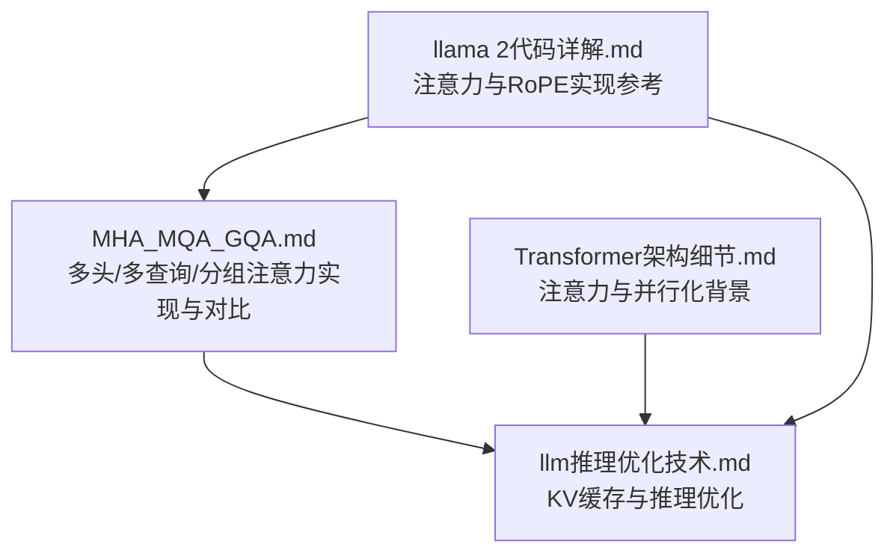
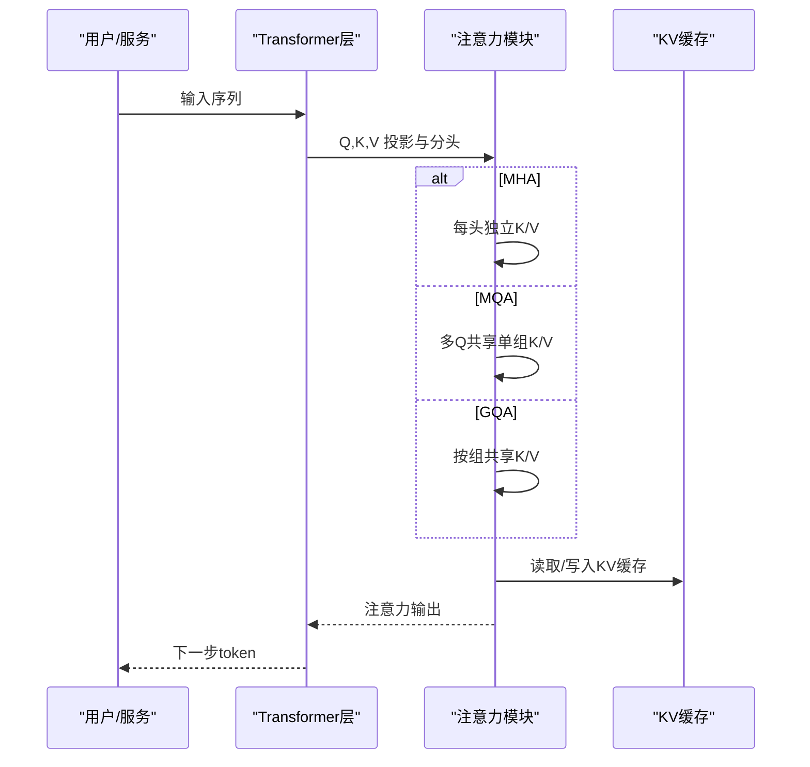
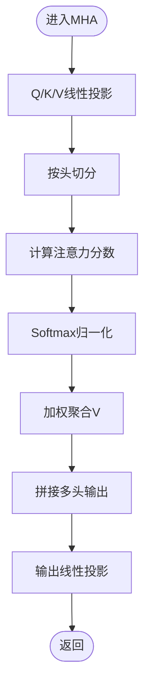
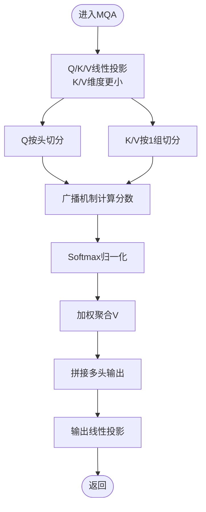
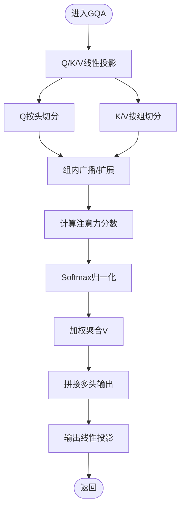
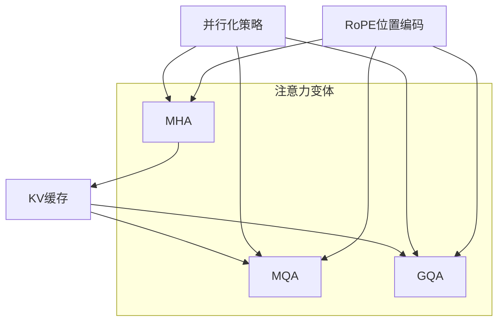

# 注意力机制变体

<cite>
**本文引用的文件**
- [MHA_MQA_GQA.md](file://02.大语言模型架构/MHA_MQA_GQA/MHA_MQA_GQA.md)
- [llm推理优化技术.md](file://06.推理/llm推理优化技术/llm推理优化技术.md)
- [Transformer架构细节.md](file://02.大语言模型架构/Transformer架构细节/Transformer架构细节.md)
- [llama 2代码详解.md](file://02.大语言模型架构/llama 2代码详解/llama 2代码详解.md)
</cite>

## 目录
1. [简介](#简介)
2. [项目结构](#项目结构)
3. [核心组件](#核心组件)
4. [架构总览](#架构总览)
5. [详细组件分析](#详细组件分析)
6. [依赖分析](#依赖分析)
7. [性能考量](#性能考量)
8. [故障排查指南](#故障排查指南)
9. [结论](#结论)
10. [附录](#附录)

## 简介
本文件系统性梳理多头注意力（MHA）、多查询注意力（MQA）与分组查询注意力（GQA）的差异、优势与适用场景，重点覆盖：
- 计算复杂度与内存使用
- 推理效率与KV缓存优化
- 注意力头数量选择策略与查询分组优化
- 在不同场景下的性能表现
- 结合仓库中的实现与优化资料，提供可落地的参考路径

## 项目结构
围绕注意力机制变体，本仓库提供了：
- 文档层面的对比与实现要点：MHA_MQA_GQA.md
- 推理优化与KV缓存背景：llm推理优化技术.md
- Transformer基础与注意力细节：Transformer架构细节.md
- LLaMA2中注意力与RoPE实现参考：llama 2代码详解.md

图表来源
- [MHA_MQA_GQA.md:1-225](file://02.大语言模型架构/MHA_MQA_GQA/MHA_MQA_GQA.md#L1-L225)
- [llm推理优化技术.md:1-271](file://06.推理/llm推理优化技术/llm推理优化技术.md#L1-L271)
- [Transformer架构细节.md:1-321](file://02.大语言模型架构/Transformer架构细节/Transformer架构细节.md#L1-L321)
- [llama 2代码详解.md:258-522](file://02.大语言模型架构/llama 2代码详解/llama 2代码详解.md#L258-L522)

章节来源
- [MHA_MQA_GQA.md:1-225](file://02.大语言模型架构/MHA_MQA_GQA/MHA_MQA_GQA.md#L1-L225)
- [llm推理优化技术.md:1-271](file://06.推理/llm推理优化技术/llm推理优化技术.md#L1-L271)
- [Transformer架构细节.md:1-321](file://02.大语言模型架构/Transformer架构细节/Transformer架构细节.md#L1-L321)
- [llama 2代码详解.md:258-522](file://02.大语言模型架构/llama 2代码详解/llama 2代码详解.md#L258-L522)

## 核心组件
- 多头注意力（MHA）：每个注意力头拥有独立的Q/K/V投影，便于并行计算与多子空间建模。
- 多查询注意力（MQA）：多个查询头共享同一组K/V，显著减少KV参数与KV缓存占用，适合解码阶段的内存受限场景。
- 分组查询注意力（GQA）：将查询头按组分组，每组共享一组K/V，处于MHA与MQA之间，兼顾质量与效率。

章节来源
- [MHA_MQA_GQA.md:3-14](file://02.大语言模型架构/MHA_MQA_GQA/MHA_MQA_GQA.md#L3-L14)
- [llm推理优化技术.md:132-150](file://06.推理/llm推理优化技术/llm推理优化技术.md#L132-L150)

## 架构总览
注意力机制变体在Transformer解码阶段的典型交互流程如下：

图表来源
- [MHA_MQA_GQA.md:15-225](file://02.大语言模型架构/MHA_MQA_GQA/MHA_MQA_GQA.md#L15-L225)
- [llm推理优化技术.md:37-72](file://06.推理/llm推理优化技术/llm推理优化技术.md#L37-L72)

## 详细组件分析

### 多头注意力（MHA）
- 特征
  - 每个头独立的K/V投影，便于并行计算与多子空间建模。
  - 计算与内存开销随头数线性增长。
- 实现要点
  - Q/K/V线性投影后按头切分，计算注意力分数与加权聚合，最后拼接并线性投影。
- 复杂度与内存
  - 计算复杂度与头数成正比；KV缓存占用与头数成正比。
- 适用场景
  - 训练阶段与高精度要求场景；对内存带宽不敏感或显存充足的环境。

图表来源
- [MHA_MQA_GQA.md:36-87](file://02.大语言模型架构/MHA_MQA_GQA/MHA_MQA_GQA.md#L36-L87)

章节来源
- [MHA_MQA_GQA.md:17-87](file://02.大语言模型架构/MHA_MQA_GQA/MHA_MQA_GQA.md#L17-L87)
- [Transformer架构细节.md:245-256](file://02.大语言模型架构/Transformer架构细节/Transformer架构细节.md#L245-L256)

### 多查询注意力（MQA）
- 特征
  - 多个Q头共享单组K/V，显著减少KV参数与KV缓存占用。
  - 计算量与MHA相同，但内存读取压力大幅降低。
- 实现要点
  - Q按头切分，K/V仅按1组切分，通过广播机制完成矩阵乘法。
- 复杂度与内存
  - 计算复杂度与MHA相当；KV缓存占用显著下降。
- 适用场景
  - 解码阶段内存受限、追求更高吞吐与更低KV缓存占用的场景。
- 注意
  - 需要在启用MQA的条件下进行训练或微调以维持质量。

图表来源
- [MHA_MQA_GQA.md:99-154](file://02.大语言模型架构/MHA_MQA_GQA/MHA_MQA_GQA.md#L99-L154)
- [llm推理优化技术.md:132-138](file://06.推理/llm推理优化技术/llm推理优化技术.md#L132-L138)

章节来源
- [MHA_MQA_GQA.md:89-154](file://02.大语言模型架构/MHA_MQA_GQA/MHA_MQA_GQA.md#L89-L154)
- [llm推理优化技术.md:132-138](file://06.推理/llm推理优化技术/llm推理优化技术.md#L132-L138)

### 分组查询注意力（GQA）
- 特征
  - 将查询头按组分组，每组共享一组K/V，处于MHA与MQA之间。
  - 可在质量与效率间取得平衡，支持“升级训练”以接近MHA质量。
- 实现要点
  - Q按头切分，K/V按组切分，通过广播与扩展实现组内共享。
- 复杂度与内存
  - 计算复杂度介于MHA与MQA之间；KV缓存占用随组数减少而下降。
- 适用场景
  - 需要在推理效率与模型质量之间折衷的场景；Llama 2 70B等模型采用GQA。
- 注意
  - 组数需能整除头数，确保分组均匀。

图表来源
- [MHA_MQA_GQA.md:168-224](file://02.大语言模型架构/MHA_MQA_GQA/MHA_MQA_GQA.md#L168-L224)
- [llm推理优化技术.md:140-148](file://06.推理/llm推理优化技术/llm推理优化技术.md#L140-L148)

章节来源
- [MHA_MQA_GQA.md:158-224](file://02.大语言模型架构/MHA_MQA_GQA/MHA_MQA_GQA.md#L158-L224)
- [llm推理优化技术.md:140-148](file://06.推理/llm推理优化技术/llm推理优化技术.md#L140-L148)

### 代码实现与参考
- MHA实现要点
  - Q/K/V线性投影与按头切分，注意力分数计算与拼接输出。
- MQA实现要点
  - K/V投影维度更小，通过广播机制完成计算。
- GQA实现要点
  - K/V按组切分，并通过广播/扩展实现组内共享。

章节来源
- [MHA_MQA_GQA.md:36-224](file://02.大语言模型架构/MHA_MQA_GQA/MHA_MQA_GQA.md#L36-L224)

### LLaMA2注意力与RoPE参考
- LLaMA2中注意力与RoPE的实现路径可作为注意力模块的工程参考，便于理解头数、维度与位置编码的协同。

章节来源
- [llama 2代码详解.md:258-522](file://02.大语言模型架构/llama 2代码详解/llama 2代码详解.md#L258-L522)

## 依赖分析
注意力机制变体与KV缓存、并行化、位置编码等密切相关：

图表来源
- [llm推理优化技术.md:37-72](file://06.推理/llm推理优化技术/llm推理优化技术.md#L37-L72)
- [llama 2代码详解.md:258-522](file://02.大语言模型架构/llama 2代码详解/llama 2代码详解.md#L258-L522)

章节来源
- [llm推理优化技术.md:37-72](file://06.推理/llm推理优化技术/llm推理优化技术.md#L37-L72)
- [llama 2代码详解.md:258-522](file://02.大语言模型架构/llama 2代码详解/llama 2代码详解.md#L258-L522)

## 性能考量
- 计算复杂度
  - MHA：随头数线性增长；GQA：介于MHA与MQA之间；MQA：与MHA计算量相当但KV访问显著减少。
- 内存与KV缓存
  - KV缓存大小与头数/层数/维度/精度成正比；MQA/GQA通过减少K/V头数显著降低KV缓存占用。
- 推理效率
  - 在解码阶段，MQA/GQA可提升内存带宽利用率，降低KV缓存管理开销，提高吞吐。
- 优化技术
  - FlashAttention等I/O感知融合可进一步降低内存访问成本，提升吞吐。
  - PagedAttention可高效管理KV缓存，减少碎片与浪费。

章节来源
- [llm推理优化技术.md:54-72](file://06.推理/llm推理优化技术/llm推理优化技术.md#L54-L72)
- [llm推理优化技术.md:152-164](file://06.推理/llm推理优化技术/llm推理优化技术.md#L152-L164)
- [llm推理优化技术.md:168-179](file://06.推理/llm推理优化技术/llm推理优化技术.md#L168-L179)

## 故障排查指南
- KV缓存过大导致显存不足
  - 优先考虑MQA/GQA以减少KV头数；结合PagedAttention优化缓存管理。
- 训练与推理不一致
  - MQA/GQA需在启用相应机制的条件下进行训练或微调，否则可能出现质量下降。
- 并行化瓶颈
  - 在解码阶段，注意力计算易受内存带宽限制；可结合FlashAttention与KV缓存优化提升吞吐。

章节来源
- [llm推理优化技术.md:37-72](file://06.推理/llm推理优化技术/llm推理优化技术.md#L37-L72)
- [llm推理优化技术.md:132-138](file://06.推理/llm推理优化技术/llm推理优化技术.md#L132-L138)
- [llm推理优化技术.md:152-164](file://06.推理/llm推理优化技术/llm推理优化技术.md#L152-L164)
- [llm推理优化技术.md:168-179](file://06.推理/llm推理优化技术/llm推理优化技术.md#L168-L179)

## 结论
- MHA提供最强的多子空间建模能力，适合训练与高精度场景。
- MQA在解码阶段显著降低KV缓存与内存带宽压力，适合高吞吐与低显存占用场景。
- GQA在质量与效率之间取得平衡，支持“升级训练”，是工程实践中的优选方案。
- 结合KV缓存优化（PagedAttention）与I/O感知融合（FlashAttention）可进一步提升推理效率。

## 附录
- 注意力头数量选择策略
  - 训练阶段优先保证质量，头数与维度的乘积保持稳定；推理阶段结合KV缓存预算与吞吐目标选择MQA/GQA。
- 查询分组优化
  - 组数需能整除头数；在保证质量的前提下逐步增大组数以降低KV占用。
- 性能对比数据
  - 仓库未提供具体数值对比，建议基于KV缓存占用、吞吐与延迟指标在目标硬件上进行基准测试。