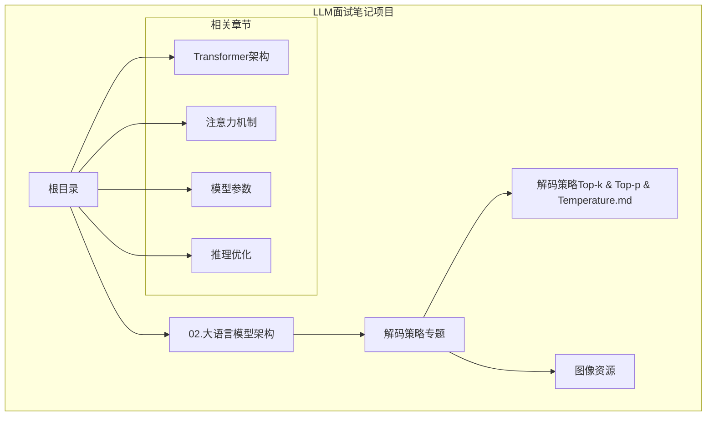
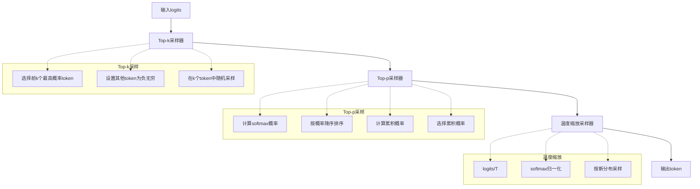
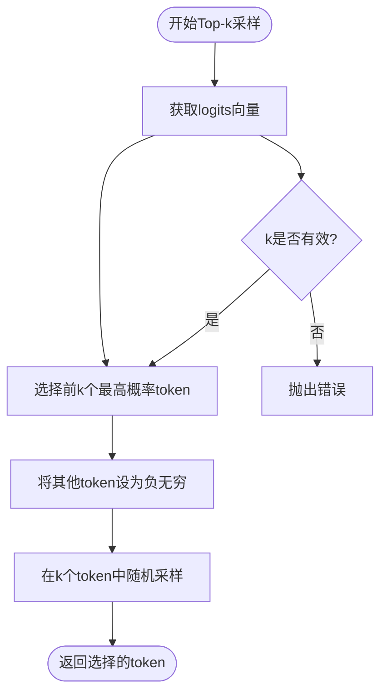
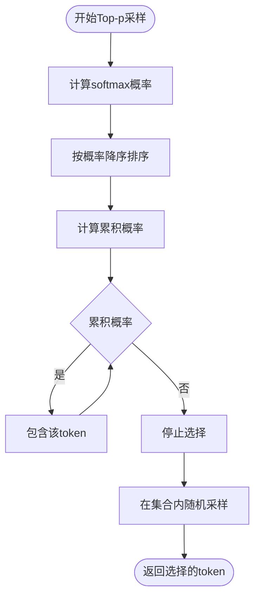
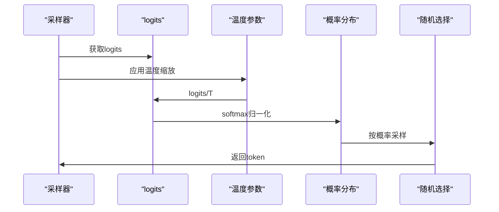
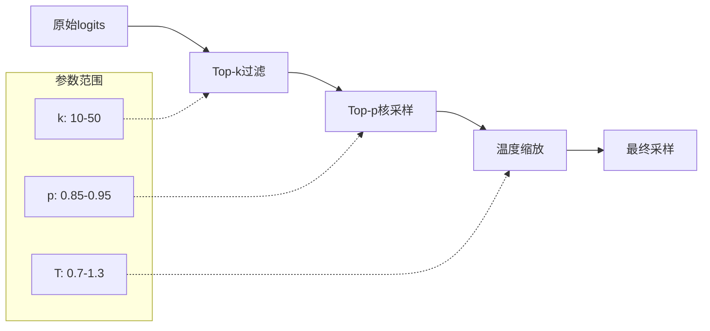

# 解码策略

<cite>
**本文引用的文件**
- [解码策略（Top-k & Top-p & Temperature）.md](file://02.大语言模型架构/解码策略（Top-k & Top-p & Temperatu/解码策略（Top-k & Top-p & Temperature）.md)
- [README.md](file://README.md)
- [README.md](file://02.大语言模型架构/README.md)
</cite>

## 目录
1. [简介](#简介)
2. [项目结构](#项目结构)
3. [核心组件](#核心组件)
4. [架构概览](#架构概览)
5. [详细组件分析](#详细组件分析)
6. [依赖分析](#依赖分析)
7. [性能考虑](#性能考虑)
8. [故障排除指南](#故障排除指南)
9. [结论](#结论)
10. [附录](#附录)

## 简介
解码策略是大语言模型推理过程中的关键环节，直接影响生成文本的质量和多样性。本文档深入解析三种主流解码策略：Top-k采样、Top-p（核）采样和温度缩放，详细说明它们的原理、应用场景、参数调节方法和最佳实践。

## 项目结构
该文档来源于LLM面试笔记项目中的解码策略专题，位于大语言模型架构章节下。



**图表来源**
- [README.md:37-80](file://README.md#L37-L80)
- [README.md:1-52](file://02.大语言模型架构/README.md#L1-L52)

**章节来源**
- [README.md:37-80](file://README.md#L37-L80)
- [README.md:1-52](file://02.大语言模型架构/README.md#L1-L52)

## 核心组件
解码策略主要包含三个核心组件：Top-k采样、Top-p采样和温度缩放采样器。

### 解码参数配置
典型的解码参数配置包括：
- top_k: 10（Top-k采样参数）
- temperature: 0.95（温度缩放参数）
- num_beams: 1（束搜索参数）
- top_p: 0.8（Top-p采样参数）
- repetition_penalty: 1.5（重复惩罚）
- max_tokens: 30000（最大生成长度）

### 解码策略分类
1. **贪心解码**: 直接选择概率最高的token
2. **随机采样**: 按概率分布随机选择
3. **束搜索**: 维护k个候选序列集合
4. **Top-k采样**: 从前k个最高概率token中随机采样
5. **Top-p采样**: 从累积概率超过阈值p的最小token集合中采样
6. **温度缩放**: 调整概率分布的平滑程度

**章节来源**
- [解码策略（Top-k & Top-p & Temperature）.md:9-24](file://02.大语言模型架构/解码策略（Top-k & Top-p & Temperatu/解码策略（Top-k & Top-p & Temperature）.md#L9-L24)
- [解码策略（Top-k & Top-p & Temperature）.md:30-36](file://02.大语言模型架构/解码策略（Top-k & Top-p & Temperatu/解码策略（Top-k & Top-p & Temperature）.md#L30-L36)

## 架构概览
解码策略的整体架构采用组合模式，将不同的采样策略按特定顺序组合使用。



**图表来源**
- [解码策略（Top-k & Top-p & Temperature）.md:56-82](file://02.大语言模型架构/解码策略（Top-k & Top-p & Temperatu/解码策略（Top-k & Top-p & Temperature）.md#L56-L82)
- [解码策略（Top-k & Top-p & Temperature）.md:109-164](file://02.大语言模型架构/解码策略（Top-k & Top-p & Temperatu/解码策略（Top-k & Top-p & Temperature）.md#L109-L164)
- [解码策略（Top-k & Top-p & Temperature）.md:198-226](file://02.大语言模型架构/解码策略（Top-k & Top-p & Temperatu/解码策略（Top-k & Top-p & Temperature）.md#L198-L226)

## 详细组件分析

### Top-k采样策略
Top-k采样是对贪心解码的改进，通过限制候选集大小来平衡生成质量和多样性。

#### 工作原理
1. 对logits进行排序，选择前k个最高概率的token
2. 将其他token的概率设为负无穷（等价于零概率）
3. 在k个候选token中进行随机采样

#### 核心实现流程


**图表来源**
- [解码策略（Top-k & Top-p & Temperature）.md:71-82](file://02.大语言模型架构/解码策略（Top-k & Top-p & Temperatu/解码策略（Top-k & Top-p & Temperature）.md#L71-L82)

#### 参数调节策略
- **k值选择**: 
  - 较小k值（1-5）: 更保守，质量更高但多样性较低
  - 中等k值（10-50）: 平衡质量与多样性
  - 较大k值（100+）: 更具创造性但可能降低质量

#### 最佳实践
- **对话系统**: k=10-30，平衡流畅性和多样性
- **创意写作**: k=50-200，增加创造性
- **事实问答**: k=1-10，确保准确性

**章节来源**
- [解码策略（Top-k & Top-p & Temperature）.md:38-95](file://02.大语言模型架构/解码策略（Top-k & Top-p & Temperatu/解码策略（Top-k & Top-p & Temperature）.md#L38-L95)

### Top-p采样策略（核采样）
Top-p采样（Nucleus Sampling）根据累积概率动态确定候选集大小。

#### 工作原理
1. 计算softmax概率分布
2. 按概率降序排列
3. 选择累积概率达到阈值p的最小token集合
4. 在该集合内进行随机采样

#### 核心实现流程


**图表来源**
- [解码策略（Top-k & Top-p & Temperature）.md:131-164](file://02.大语言模型架构/解码策略（Top-k & Top-p & Temperatu/解码策略（Top-k & Top-p & Temperature）.md#L131-L164)

#### 参数调节策略
- **p值范围**: 通常设置为0.75-0.95
- **p值影响**: 
  - p越接近1: 候选集越大，多样性越高
  - p越接近0.5: 候选集较小，质量更高

#### 最佳实践
- **学术写作**: p=0.85-0.95，保持严谨性
- **创意内容**: p=0.90-0.95，增加多样性
- **对话生成**: p=0.80-0.90，平衡自然度

**章节来源**
- [解码策略（Top-k & Top-p & Temperature）.md:97-108](file://02.大语言模型架构/解码策略（Top-k & Top-p & Temperatu/解码策略（Top-k & Top-p & Temperature）.md#L97-L108)

### 温度缩放策略
温度缩放通过调整概率分布的平滑程度来控制生成的确定性。

#### 物理原理
温度缩放基于统计热力学中的玻尔兹曼分布：
- 低温: 概率分布更尖锐，模型更有确定性
- 高温: 概率分布更平滑，模型更随机

#### 数学实现
温度缩放的数学公式为：
```
P(token_i) ∝ exp(logit_i / T) / Σ_j exp(logit_j / T)
```
其中T为温度参数。

#### 核心实现流程


**图表来源**
- [解码策略（Top-k & Top-p & Temperature）.md:216-226](file://02.大语言模型架构/解码策略（Top-k & Top-p & Temperatu/解码策略（Top-k & Top-p & Temperature）.md#L216-L226)

#### 参数调节策略
- **T=0.1-0.5**: 非常确定，适合严格任务
- **T=0.7-1.0**: 正常范围，平衡质量与多样性
- **T=1.2-2.0**: 更具创造性，可能降低准确性

#### 最佳实践
- **代码生成**: T=0.7-0.9，确保正确性
- **诗歌创作**: T=1.0-1.3，增加艺术性
- **数据分析**: T=0.5-0.8，保持客观性

**章节来源**
- [解码策略（Top-k & Top-p & Temperature）.md:166-197](file://02.大语言模型架构/解码策略（Top-k & Top-p & Temperatu/解码策略（Top-k & Top-p & Temperature）.md#L166-L197)

### 联合采样策略
实际应用中通常将三种策略组合使用，遵循`Top-k → Top-p → Temperature`的顺序。

#### 组合工作流程


**图表来源**
- [解码策略（Top-k & Top-p & Temperature）.md:228-244](file://02.大语言模型架构/解码策略（Top-k & Top-p & Temperatu/解码策略（Top-k & Top-p & Temperature）.md#L228-L244)

#### 效果对比示例
- **Top-k alone**: 生成稳定但可能单调
- **Top-p alone**: 动态适应但可能不稳定
- **Temperature alone**: 控制确定性但缺乏多样性
- **联合策略**: 平衡质量、多样性和稳定性

**章节来源**
- [解码策略（Top-k & Top-p & Temperature）.md:228-244](file://02.大语言模型架构/解码策略（Top-k & Top-p & Temperatu/解码策略（Top-k & Top-p & Temperature）.md#L228-L244)

## 依赖分析
解码策略的实现依赖于PyTorch的张量操作和概率分布模块。

```mermaid
graph TB
subgraph "核心依赖"
A[torch.Tensor] --> B[torch.topk]
A --> C[torch.sort]
A --> D[torch.log]
A --> E[torch.exp]
A --> F[torch.softmax]
end
subgraph "概率分布"
G[torch.distributions.Categorical] --> H[sample()]
I[torch.nn.Softmax] --> J[概率归一化]
end
subgraph "掩码操作"
K[torch.zeros_like] --> L[float('-inf')]
M[scatter_] --> N[设置特定位置值]
end
A --> B
A --> C
A --> D
A --> E
A --> F
A --> L
A --> N
```

**图表来源**
- [解码策略（Top-k & Top-p & Temperature）.md:56-82](file://02.大语言模型架构/解码策略（Top-k & Top-p & Temperatu/解码策略（Top-k & Top-p & Temperature）.md#L56-L82)
- [解码策略（Top-k & Top-p & Temperature）.md:109-164](file://02.大语言模型架构/解码策略（Top-k & Top-p & Temperatu/解码策略（Top-k & Top-p & Temperature）.md#L109-L164)
- [解码策略（Top-k & Top-p & Temperature）.md:198-226](file://02.大语言模型架构/解码策略（Top-k & Top-p & Temperatu/解码策略（Top-k & Top-p & Temperature）.md#L198-L226)

## 性能考虑
不同解码策略在计算复杂度和内存使用方面存在差异：

### 计算复杂度分析
- **Top-k采样**: O(n log n)，主要消耗在排序操作
- **Top-p采样**: O(n log n)，包含排序和累积求和
- **温度缩放**: O(n)，线性时间复杂度
- **联合策略**: O(n log n)，受最耗时操作限制

### 内存使用特点
- **Top-k采样**: 需要存储k个token的索引和值
- **Top-p采样**: 需要存储排序后的概率和累积和
- **温度缩放**: 内存开销最小

### 优化建议
1. **批量处理**: 利用PyTorch的向量化操作
2. **内存管理**: 及时释放中间结果
3. **数值稳定性**: 使用log-space计算避免溢出

## 故障排除指南

### 常见问题及解决方案

#### 问题1: 生成文本质量下降
**症状**: 输出过于保守或缺乏创意
**可能原因**: 
- k值过小
- p值过低  
- 温度过低

**解决方案**:
- 适当增大k值（10-50）
- 提高p值（0.85-0.95）
- 增加温度（1.0-1.3）

#### 问题2: 生成文本不连贯
**症状**: 输出语法错误或逻辑混乱
**可能原因**:
- k值过大
- 温度过高
- 缺少重复惩罚

**解决方案**:
- 减小k值（5-20）
- 降低温度（0.7-1.0）
- 添加重复惩罚（1.05-1.2）

#### 问题3: 收敛速度慢
**症状**: 解码过程耗时过长
**可能原因**:
- 候选集过大
- 计算精度不足

**解决方案**:
- 优化Top-k和Top-p参数
- 使用混合精度计算
- 实现早期停止机制

**章节来源**
- [解码策略（Top-k & Top-p & Temperature）.md:84-95](file://02.大语言模型架构/解码策略（Top-k & Top-p & Temperatu/解码策略（Top-k & Top-p & Temperature）.md#L84-L95)

## 结论
解码策略是控制大语言模型生成质量的关键工具。通过合理配置Top-k、Top-p和温度参数，可以在生成质量、多样性和稳定性之间找到最佳平衡点。

### 选择指导原则
1. **严格任务**（代码、事实问答）: Top-k(5-10) + Temperature(0.5-0.8)
2. **创意任务**（写作、故事）: Top-k(20-50) + Top-p(0.90-0.95) + Temperature(1.0-1.3)
3. **对话任务**（聊天、问答）: Top-k(10-30) + Top-p(0.85-0.90) + Temperature(0.7-1.0)

### 未来发展方向
- 自适应解码策略
- 多目标优化解码
- 实时参数调整机制

## 附录

### 参数调优参考表
| 任务类型 | Top-k | Top-p | Temperature |
|---------|-------|-------|-------------|
| 代码生成 | 5-10 | 0.85-0.90 | 0.5-0.8 |
| 学术写作 | 10-20 | 0.90-0.95 | 0.7-1.0 |
| 创意写作 | 20-50 | 0.90-0.95 | 1.0-1.3 |
| 对话系统 | 10-30 | 0.85-0.90 | 0.7-1.0 |
| 数据分析 | 5-15 | 0.85-0.90 | 0.5-0.8 |

### 实践建议
1. **渐进式调参**: 先调整Top-k，再调整Top-p，最后调整温度
2. **A/B测试**: 对比不同参数组合的效果
3. **监控指标**: 关注流畅度、相关性和创造性指标
4. **用户反馈**: 结合实际使用效果调整参数