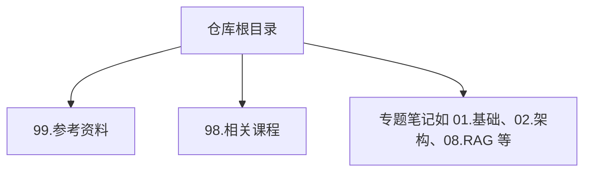
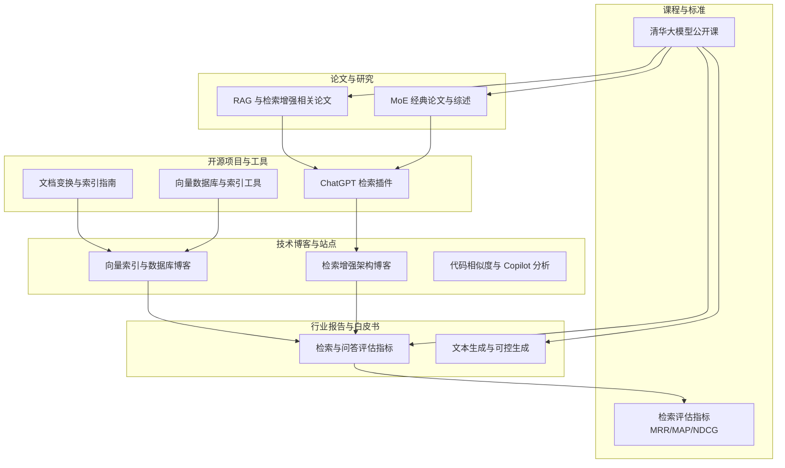
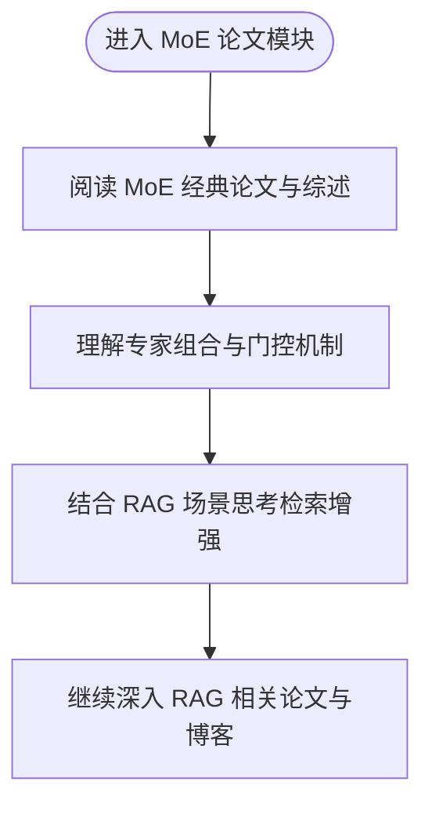
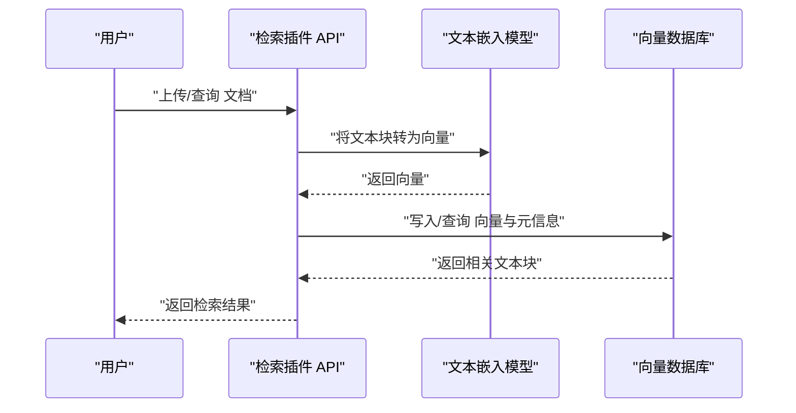

# 参考资料

<cite>
**本文引用的文件**
- [README.md](file://README.md)
- [99.参考资料/README.md](file://99.参考资料/README.md)
- [08.检索增强rag/检索增强llm/检索增强llm.md](file://08.检索增强rag/检索增强llm/检索增强llm.md)
- [98.相关课程/清华大模型公开课/清华大模型公开课.md](file://98.相关课程/清华大模型公开课/清华大模型公开课.md)
- [98.相关课程/清华大模型公开课/1.NLP&大模型基础/1.NLP&大模型基础.md](file://98.相关课程/清华大模型公开课/1.NLP&大模型基础/1.NLP&大模型基础.md)
- [98.相关课程/清华大模型公开课/6.文本理解和生成大模型/6.文本理解和生成大模型.md](file://98.相关课程/清华大模型公开课/6.文本理解和生成大模型/6.文本理解和生成大模型.md)
- [02.大语言模型架构/1.MoE论文/1.MoE论文.md](file://02.大语言模型架构/1.MoE论文/1.MoE论文.md)
- [02.大语言模型架构/2.MoE经典论文简牍/2.MoE经典论文简牍.md](file://02.大语言模型架构/2.MoE经典论文简牍/2.MoE经典论文简牍.md)
- [index.html](file://index.html)
</cite>

## 目录
1. [简介](#简介)
2. [项目结构](#项目结构)
3. [核心组件](#核心组件)
4. [架构总览](#架构总览)
5. [详细组件分析](#详细组件分析)
6. [依赖分析](#依赖分析)
7. [性能考虑](#性能考虑)
8. [故障排查指南](#故障排查指南)
9. [结论](#结论)
10. [附录](#附录)

## 简介
本资料模块旨在为学习者提供系统、可扩展的参考资料体系，覆盖大模型领域的经典论文与最新进展、高质量开源项目、权威技术博客与个人站点、行业报告与白皮书、标准文档，以及按学习阶段划分的参考书目与在线资源。通过本模块，读者可以：
- 快速定位高质量论文与技术博客，建立知识地图
- 获取可直接访问的开源项目链接，便于动手实践
- 收集权威报告与白皮书，把握行业趋势
- 按阶段规划学习路径，从基础到进阶逐步深入

## 项目结构
本仓库采用按主题分层的组织方式，参考资料模块位于顶层目录，与各专题笔记并列，便于导航与检索。

**图表来源**
- [README.md:37-161](file://README.md#L37-L161)

**章节来源**
- [README.md:1-169](file://README.md#L1-L169)

## 核心组件
- 经典论文与最新研究
  - MoE 经典论文与综述
  - 检索增强生成（RAG）相关论文与博客
- 开源项目与工具库
  - RAG 检索插件、向量数据库、索引工具等
- 技术博客与个人站点
  - 权威博客、技术分析文章、视频教程
- 行业报告与白皮书
  - 检索与问答、文本生成、评估指标等方向的报告
- 标准与规范
  - 检索评估指标（如 MRR@k、MAP@k、NDCG@k）
- 学习资源与课程
  - 清华大模型公开课（视频与讲义）

**章节来源**
- [99.参考资料/README.md:1-10](file://99.参考资料/README.md#L1-L10)
- [02.大语言模型架构/1.MoE论文/1.MoE论文.md:1-17](file://02.大语言模型架构/1.MoE论文/1.MoE论文.md#L1-L17)
- [02.大语言模型架构/2.MoE经典论文简牍/2.MoE经典论文简牍.md:1-22](file://02.大语言模型架构/2.MoE经典论文简牍/2.MoE经典论文简牍.md#L1-L22)
- [08.检索增强rag/检索增强llm/检索增强llm.md:414-526](file://08.检索增强rag/检索增强llm/检索增强llm.md#L414-L526)
- [98.相关课程/清华大模型公开课/清华大模型公开课.md:1-21](file://98.相关课程/清华大模型公开课/清华大模型公开课.md#L1-L21)
- [98.相关课程/清华大模型公开课/1.NLP&大模型基础/1.NLP&大模型基础.md:1-229](file://98.相关课程/清华大模型公开课/1.NLP&大模型基础/1.NLP&大模型基础.md#L1-L229)
- [98.相关课程/清华大模型公开课/6.文本理解和生成大模型/6.文本理解和生成大模型.md:68-113](file://98.相关课程/清华大模型公开课/6.文本理解和生成大模型/6.文本理解和生成大模型.md#L68-L113)

## 架构总览
本模块的“知识架构”由“论文—项目—博客—报告—课程—评估指标”构成，形成从理论到实践、从宏观到微观的完整闭环。

**图表来源**
- [02.大语言模型架构/1.MoE论文/1.MoE论文.md:1-17](file://02.大语言模型架构/1.MoE论文/1.MoE论文.md#L1-L17)
- [02.大语言模型架构/2.MoE经典论文简牍/2.MoE经典论文简牍.md:1-22](file://02.大语言模型架构/2.MoE经典论文简牍/2.MoE经典论文简牍.md#L1-L22)
- [08.检索增强rag/检索增强llm/检索增强llm.md:414-526](file://08.检索增强rag/检索增强llm/检索增强llm.md#L414-L526)
- [98.相关课程/清华大模型公开课/清华大模型公开课.md:1-21](file://98.相关课程/清华大模型公开课/清华大模型公开课.md#L1-L21)
- [98.相关课程/清华大模型公开课/6.文本理解和生成大模型/6.文本理解和生成大模型.md:68-113](file://98.相关课程/清华大模型公开课/6.文本理解和生成大模型/6.文本理解和生成大模型.md#L68-L113)

## 详细组件分析

### 经典论文与最新研究
- MoE 经典论文与综述
  - 提供 MoE 概念引入与经典综述链接，便于初学者与进阶读者快速建立知识框架。
- RAG 与检索增强相关论文
  - 涵盖检索式与生成式开放问答、REALM、WebGPT 等代表性工作，帮助理解检索增强范式的发展脉络。

**图表来源**
- [02.大语言模型架构/1.MoE论文/1.MoE论文.md:1-17](file://02.大语言模型架构/1.MoE论文/1.MoE论文.md#L1-L17)
- [02.大语言模型架构/2.MoE经典论文简牍/2.MoE经典论文简牍.md:1-22](file://02.大语言模型架构/2.MoE经典论文简牍/2.MoE经典论文简牍.md#L1-L22)

**章节来源**
- [02.大语言模型架构/1.MoE论文/1.MoE论文.md:1-17](file://02.大语言模型架构/1.MoE论文/1.MoE论文.md#L1-L17)
- [02.大语言模型架构/2.MoE经典论文简牍/2.MoE经典论文简牍.md:1-22](file://02.大语言模型架构/2.MoE经典论文简牍/2.MoE经典论文简牍.md#L1-L22)

### 开源项目与工具库
- ChatGPT 检索插件
  - 提供 upsert/query/delete 等接口说明与向量数据库集成思路，适合快速落地 RAG 系统。
- 向量数据库与索引工具
  - Pinecone、FAISS 等工具与索引指南，支撑大规模相似检索与重排。
- 文档变换与索引指南
  - LangChain、LlamaIndex 等文档变换与索引组件，便于构建问答系统。

**图表来源**
- [08.检索增强rag/检索增强llm/检索增强llm.md:414-475](file://08.检索增强rag/检索增强llm/检索增强llm.md#L414-L475)

**章节来源**
- [08.检索增强rag/检索增强llm/检索增强llm.md:414-526](file://08.检索增强rag/检索增强llm/检索增强llm.md#L414-L526)

### 技术博客与个人站点
- 检索增强架构博客
  - 提供检索增强 LLM 的整体架构与实现要点，便于理解端到端流程。
- 向量索引与数据库博客
  - 涵盖向量索引、数据库选型与性能优化，支撑工程实践。
- 代码相似度与 Copilot 分析
  - 展示检索增强在代码生成场景中的应用，强调相似度度量与上下文建模。

**章节来源**
- [08.检索增强rag/检索增强llm/检索增强llm.md:506-526](file://08.检索增强rag/检索增强llm/检索增强llm.md#L506-L526)

### 行业报告与白皮书
- 检索与问答评估指标
  - MRR@k、MAP@k、NDCG@k 等指标的定义与计算，支撑检索系统评估。
- 文本生成与可控生成
  - 文本生成任务、解码策略（贪心、束搜索、采样）、可控生成方法等，帮助理解生成质量与控制。

**章节来源**
- [98.相关课程/清华大模型公开课/6.文本理解和生成大模型/6.文本理解和生成大模型.md:68-113](file://98.相关课程/清华大模型公开课/6.文本理解和生成大模型/6.文本理解和生成大模型.md#L68-L113)
- [98.相关课程/清华大模型公开课/6.文本理解和生成大模型/6.文本理解和生成大模型.md:563-595](file://98.相关课程/清华大模型公开课/6.文本理解和生成大模型/6.文本理解和生成大模型.md#L563-L595)

### 课程与标准
- 清华大模型公开课
  - 提供视频与讲义链接，覆盖 NLP 基础、Transformer、Prompt Tuning、高效训练与模型压缩、文本理解与生成等主题。
- 检索评估指标
  - 课程中对 IR 评估指标的系统讲解，便于在实践中统一评估标准。

**章节来源**
- [98.相关课程/清华大模型公开课/清华大模型公开课.md:1-21](file://98.相关课程/清华大模型公开课/清华大模型公开课.md#L1-L21)
- [98.相关课程/清华大模型公开课/1.NLP&大模型基础/1.NLP&大模型基础.md:1-229](file://98.相关课程/清华大模型公开课/1.NLP&大模型基础/1.NLP&大模型基础.md#L1-L229)
- [98.相关课程/清华大模型公开课/6.文本理解和生成大模型/6.文本理解和生成大模型.md:68-113](file://98.相关课程/清华大模型公开课/6.文本理解和生成大模型/6.文本理解和生成大模型.md#L68-L113)

## 依赖分析
- 内容耦合关系
  - 论文模块为检索与生成提供理论基础，开源项目与博客提供工程实现与最佳实践，课程与标准提供系统化知识与评估方法。
- 外部依赖与集成点
  - 检索插件与向量数据库的对接，文档变换与索引工具的组合，课程与报告的交叉引用。

**图表来源**
- [02.大语言模型架构/1.MoE论文/1.MoE论文.md:1-17](file://02.大语言模型架构/1.MoE论文/1.MoE论文.md#L1-L17)
- [08.检索增强rag/检索增强llm/检索增强llm.md:414-526](file://08.检索增强rag/检索增强llm/检索增强llm.md#L414-L526)
- [98.相关课程/清华大模型公开课/清华大模型公开课.md:1-21](file://98.相关课程/清华大模型公开课/清华大模型公开课.md#L1-L21)

**章节来源**
- [README.md:1-169](file://README.md#L1-L169)

## 性能考虑
- 检索性能与评估
  - 使用 MRR@k、MAP@k、NDCG@k 等指标衡量检索质量，结合工程实践选择合适的向量索引与数据库。
- 生成质量与控制
  - 结合解码策略（贪心、束搜索、采样）与可控生成方法，平衡多样性与一致性。
- 工程落地
  - 优先采用双塔架构进行检索阶段的高效匹配，重排阶段采用交叉编码器提升精度。

[本节为通用指导，无需引用具体文件]

## 故障排查指南
- 检索结果不相关
  - 检查嵌入质量、分块策略与过滤参数；确认向量索引与相似度度量是否合理。
- 生成重复或逻辑不一致
  - 调整解码策略（如温度、top-k/top-p）与约束条件；必要时引入可控生成模块。
- 评估指标异常
  - 明确评估范围与阈值，确保指标计算与业务目标一致。

[本节为通用指导，无需引用具体文件]

## 结论
本参考资料模块通过“论文—项目—博客—报告—课程—评估指标”的体系化组织，帮助学习者从理论到实践、从宏观到微观全面掌握大模型相关知识。建议按阶段推进：先以课程与博客建立整体认知，再以论文与报告深化理论，最后以开源项目与工具库进行工程实践与评估验证。

[本节为总结性内容，无需引用具体文件]

## 附录
- 在线阅读与导航
  - 通过仓库提供的在线阅读链接与侧边栏导航，快速定位到各专题与参考资料页面。

**章节来源**
- [README.md:23-25](file://README.md#L23-L25)
- [index.html:14-39](file://index.html#L14-L39)