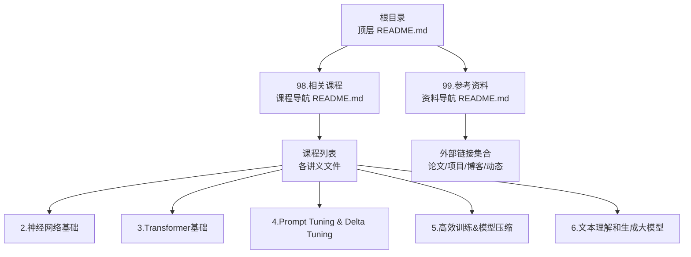
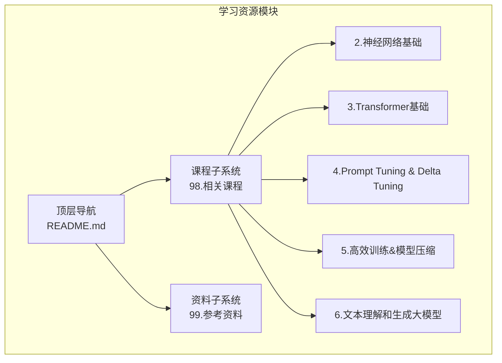
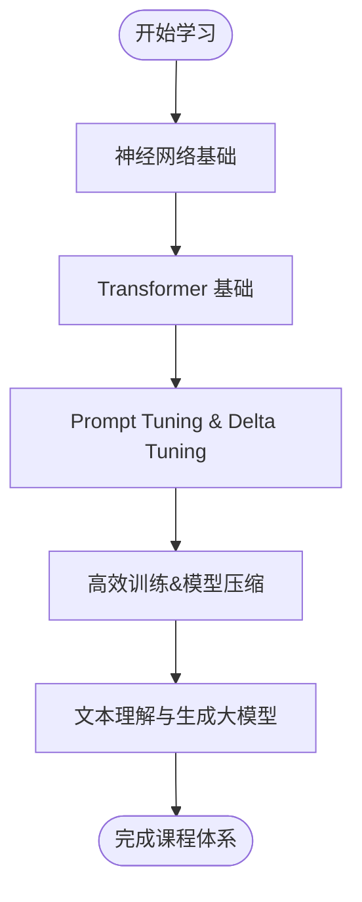
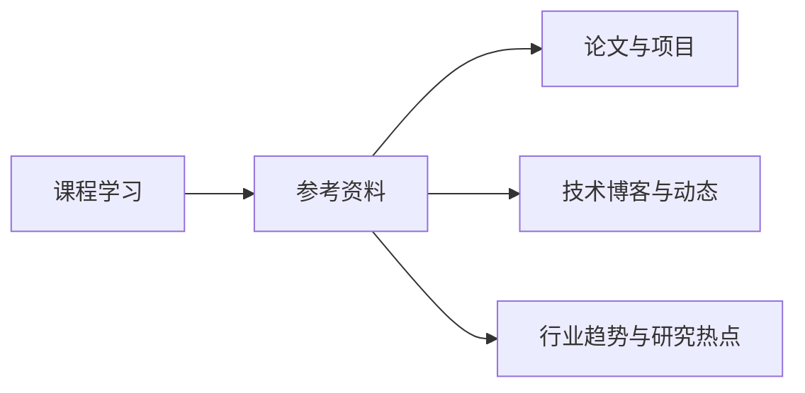
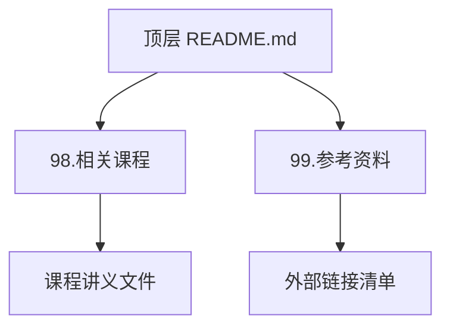

# 学习资源

<cite>
**本文引用的文件**
- [README.md](file://README.md)
- [98.相关课程/README.md](file://98.相关课程/README.md)
- [99.参考资料/README.md](file://99.参考资料/README.md)
- [98.相关课程/清华大模型公开课/2.神经网络基础/2.神经网络基础.md](file://98.相关课程/清华大模型公开课/2.神经网络基础/2.神经网络基础.md)
- [98.相关课程/清华大模型公开课/3.Transformer基础/3.Transformer基础.md](file://98.相关课程/清华大模型公开课/3.Transformer基础/3.Transformer基础.md)
- [98.相关课程/清华大模型公开课/4.Prompt Tuning & Delta Tuning/4.Prompt Tuning & Delta Tuning.md](file://98.相关课程/清华大模型公开课/4.Prompt Tuning & Delta Tuning/4.Prompt Tuning & Delta Tuning.md)
- [98.相关课程/清华大模型公开课/5.高效训练&模型压缩/5.高效训练&模型压缩.md](file://98.相关课程/清华大模型公开课/5.高效训练&模型压缩/5.高效训练&模型压缩.md)
- [98.相关课程/清华大模型公开课/6.文本理解和生成大模型/6.文本理解和生成大模型.md](file://98.相关课程/清华大模型公开课/6.文本理解和生成大模型/6.文本理解和生成大模型.md)
</cite>

## 目录
1. [简介](#简介)
2. [项目结构](#项目结构)
3. [核心组件](#核心组件)
4. [架构总览](#架构总览)
5. [详细组件分析](#详细组件分析)
6. [依赖分析](#依赖分析)
7. [性能考虑](#性能考虑)
8. [故障排查指南](#故障排查指南)
9. [结论](#结论)
10. [附录](#附录)

## 简介
本章节面向希望系统化学习大语言模型（LLM）的学习者，围绕“清华大学公开课”系列课程与“参考资料”两大板块，梳理从基础理论到前沿实践的学习路径。通过课程讲义与外部资料的整合，帮助读者建立从语言模型基础、神经网络、Transformer 架构，到高效训练、Prompt Tuning、文本理解与生成、以及最新研究动态的完整知识体系。

## 项目结构
该仓库以主题模块组织知识内容，其中“98.相关课程”收录了清华大学公开课的讲义要点，“99.参考资料”汇总了论文、开源项目、技术博客与行业动态链接。顶层 README 提供导航与实践项目入口，便于读者按需跳转至具体课程或资料页面。

图表来源
- [README.md:1-169](file://README.md#L1-L169)
- [98.相关课程/README.md:1-4](file://98.相关课程/README.md#L1-L4)
- [99.参考资料/README.md:1-10](file://99.参考资料/README.md#L1-L10)

章节来源
- [README.md:1-169](file://README.md#L1-L169)
- [98.相关课程/README.md:1-4](file://98.相关课程/README.md#L1-L4)
- [99.参考资料/README.md:1-10](file://99.参考资料/README.md#L1-L10)

## 核心组件
- 清华大学公开课讲义
  - 覆盖神经网络基础、Transformer 基础、Prompt Tuning 与 Delta Tuning、高效训练与模型压缩、文本理解与生成等主题，形成从基础到进阶的知识谱系。
- 参考资料与外部链接
  - 汇集论文、开源项目、技术博客、行业动态等资源，补充课程内容并引导深入研究。

章节来源
- [98.相关课程/清华大模型公开课/2.神经网络基础/2.神经网络基础.md](file://98.相关课程/清华大模型公开课/2.神经网络基础/2.神经网络基础.md)
- [98.相关课程/清华大模型公开课/3.Transformer基础/3.Transformer基础.md](file://98.相关课程/清华大模型公开课/3.Transformer基础/3.Transformer基础.md)
- [98.相关课程/清华大模型公开课/4.Prompt Tuning & Delta Tuning/4.Prompt Tuning & Delta Tuning.md](file://98.相关课程/清华大模型公开课/4.Prompt Tuning & Delta Tuning/4.Prompt Tuning & Delta Tuning.md)
- [98.相关课程/清华大模型公开课/5.高效训练&模型压缩/5.高效训练&模型压缩.md](file://98.相关课程/清华大模型公开课/5.高效训练&模型压缩/5.高效训练&模型压缩.md)
- [98.相关课程/清华大模型公开课/6.文本理解和生成大模型/6.文本理解和生成大模型.md](file://98.相关课程/清华大模型公开课/6.文本理解和生成大模型/6.文本理解和生成大模型.md)
- [99.参考资料/README.md:1-10](file://99.参考资料/README.md#L1-L10)

## 架构总览
下图展示“学习资源模块”的整体架构：顶层导航作为入口，课程与资料两个子系统分别承载系统化课程与扩展阅读，二者相互补充，构成完整的知识闭环。

图表来源
- [README.md:1-169](file://README.md#L1-L169)
- [98.相关课程/README.md:1-4](file://98.相关课程/README.md#L1-L4)
- [99.参考资料/README.md:1-10](file://99.参考资料/README.md#L1-L10)

## 详细组件分析

### 组件一：清华大学公开课（课程子系统）
- 设计目标
  - 提供系统化的课程讲义，覆盖从基础理论到前沿实践的主题，便于学习者按顺序推进。
- 内容组织
  - 课程讲义以独立 Markdown 文件形式组织，便于查阅与维护。
- 关键主题
  - 神经网络基础：奠定深度学习与语言模型的数学与工程基础。
  - Transformer 基础：讲解注意力机制、位置编码、层归一化等关键组件。
  - Prompt Tuning 与 Delta Tuning：介绍高效微调范式与参数高效调优方法。
  - 高效训练与模型压缩：聚焦训练效率与模型规模的平衡。
  - 文本理解与生成大模型：结合下游任务，讲解大模型的应用与优化。
- 学习建议
  - 建议按顺序学习：神经网络基础 → Transformer 基础 → Prompt Tuning → 高效训练 → 文本理解与生成。
  - 结合实践项目（如 tiny-llm-zh、tiny-rag、tiny-mcp、llama3-from-scratch-zh）加深理解。

图表来源
- [98.相关课程/清华大模型公开课/2.神经网络基础/2.神经网络基础.md](file://98.相关课程/清华大模型公开课/2.神经网络基础/2.神经网络基础.md)
- [98.相关课程/清华大模型公开课/3.Transformer基础/3.Transformer基础.md](file://98.相关课程/清华大模型公开课/3.Transformer基础/3.Transformer基础.md)
- [98.相关课程/清华大模型公开课/4.Prompt Tuning & Delta Tuning/4.Prompt Tuning & Delta Tuning.md](file://98.相关课程/清华大模型公开课/4.Prompt Tuning & Delta Tuning/4.Prompt Tuning & Delta Tuning.md)
- [98.相关课程/清华大模型公开课/5.高效训练&模型压缩/5.高效训练&模型压缩.md](file://98.相关课程/清华大模型公开课/5.高效训练&模型压缩/5.高效训练&模型压缩.md)
- [98.相关课程/清华大模型公开课/6.文本理解和生成大模型/6.文本理解和生成大模型.md](file://98.相关课程/清华大模型公开课/6.文本理解和生成大模型/6.文本理解和生成大模型.md)

章节来源
- [98.相关课程/README.md:1-4](file://98.相关课程/README.md#L1-L4)
- [98.相关课程/清华大模型公开课/2.神经网络基础/2.神经网络基础.md](file://98.相关课程/清华大模型公开课/2.神经网络基础/2.神经网络基础.md)
- [98.相关课程/清华大模型公开课/3.Transformer基础/3.Transformer基础.md](file://98.相关课程/清华大模型公开课/3.Transformer基础/3.Transformer基础.md)
- [98.相关课程/清华大模型公开课/4.Prompt Tuning & Delta Tuning/4.Prompt Tuning & Delta Tuning.md](file://98.相关课程/清华大模型公开课/4.Prompt Tuning & Delta Tuning/4.Prompt Tuning & Delta Tuning.md)
- [98.相关课程/清华大模型公开课/5.高效训练&模型压缩/5.高效训练&模型压缩.md](file://98.相关课程/清华大模型公开课/5.高效训练&模型压缩/5.高效训练&模型压缩.md)
- [98.相关课程/清华大模型公开课/6.文本理解和生成大模型/6.文本理解和生成大模型.md](file://98.相关课程/清华大模型公开课/6.文本理解和生成大模型/6.文本理解和生成大模型.md)

### 组件二：参考资料（资料子系统）
- 设计目标
  - 提供论文、开源项目、技术博客、行业动态等扩展阅读资源，辅助课程学习并拓展视野。
- 内容组织
  - 以链接清单形式呈现，便于快速检索与跳转。
- 关键类别
  - 论文与项目：涵盖算法、工程与应用方向的代表性工作与实现。
  - 技术博客与动态：提供持续更新的研究进展与行业趋势信息。
- 使用建议
  - 先完成课程学习，再根据兴趣选择相应资料深入阅读。
  - 将资料与课程主题对齐，形成“课程+资料”的双轨学习路径。

图表来源
- [99.参考资料/README.md:1-10](file://99.参考资料/README.md#L1-L10)

章节来源
- [99.参考资料/README.md:1-10](file://99.参考资料/README.md#L1-L10)

## 依赖分析
- 课程与资料的耦合关系
  - 课程提供系统化知识框架，资料提供扩展与深化内容，二者互补，无直接代码依赖，但存在“主题依赖”：资料中的论文与项目常与课程主题对应。
- 导航与入口
  - 顶层 README 作为统一入口，串联课程与资料，并提供实践项目链接，便于学习者从理论到实践闭环推进。

图表来源
- [README.md:1-169](file://README.md#L1-L169)
- [98.相关课程/README.md:1-4](file://98.相关课程/README.md#L1-L4)
- [99.参考资料/README.md:1-10](file://99.参考资料/README.md#L1-L10)

章节来源
- [README.md:1-169](file://README.md#L1-L169)
- [98.相关课程/README.md:1-4](file://98.相关课程/README.md#L1-L4)
- [99.参考资料/README.md:1-10](file://99.参考资料/README.md#L1-L10)

## 性能考虑
- 学习路径优化
  - 建议先完成基础课程（神经网络与 Transformer），再进入高效训练与 Prompt Tuning，最后结合文本理解与生成任务巩固知识。
- 资料筛选策略
  - 优先选择与当前课程主题匹配的资料，避免信息过载；定期更新资料清单，关注最新研究动态与开源进展。

## 故障排查指南
- 无法访问课程文件
  - 确认文件路径与命名是否正确；若为中文路径导致的问题，可尝试复制到英文路径后访问。
- 资料链接失效
  - 若外部链接不可达，可尝试通过搜索引擎检索关键词或访问镜像站点；同时关注仓库中“参考资料”的更新说明。
- 学习进度不清晰
  - 建立个人学习计划，按课程顺序推进，并在完成每章后进行小结与回顾。

## 结论
通过“清华大学公开课”课程体系与“参考资料”扩展资源的结合，学习者可以构建从基础理论到前沿实践的完整知识图谱。建议以课程为主线，以资料为辅线，配合实践项目，逐步提升对大语言模型的理解与应用能力。

## 附录
- 实践项目入口
  - tiny-llm-zh：从零实现中文大语言模型，涵盖预训练、微调、RL 等关键技术。
  - tiny-rag：实现简易 RAG 系统，支持多路召回与重排。
  - tiny-mcp：基于 Prompt 与 Function Calling 的 MCP 服务端与客户端实现。
  - llama3-from-scratch-zh：从零实现 llama3，支持加载官方权重并在本地调试运行。

章节来源
- [README.md:8-14](file://README.md#L8-L14)