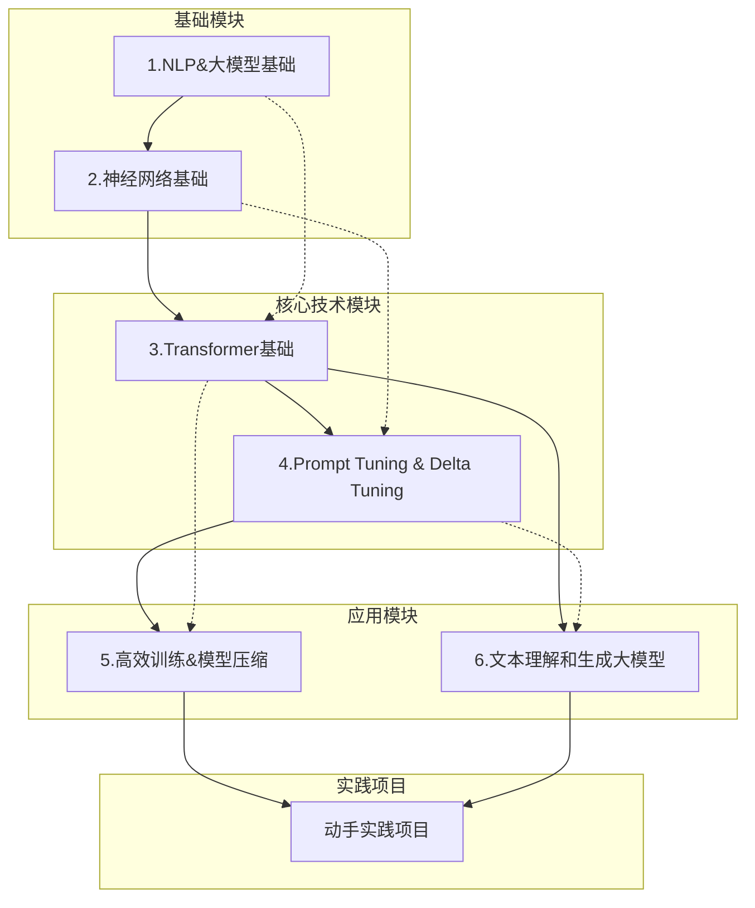
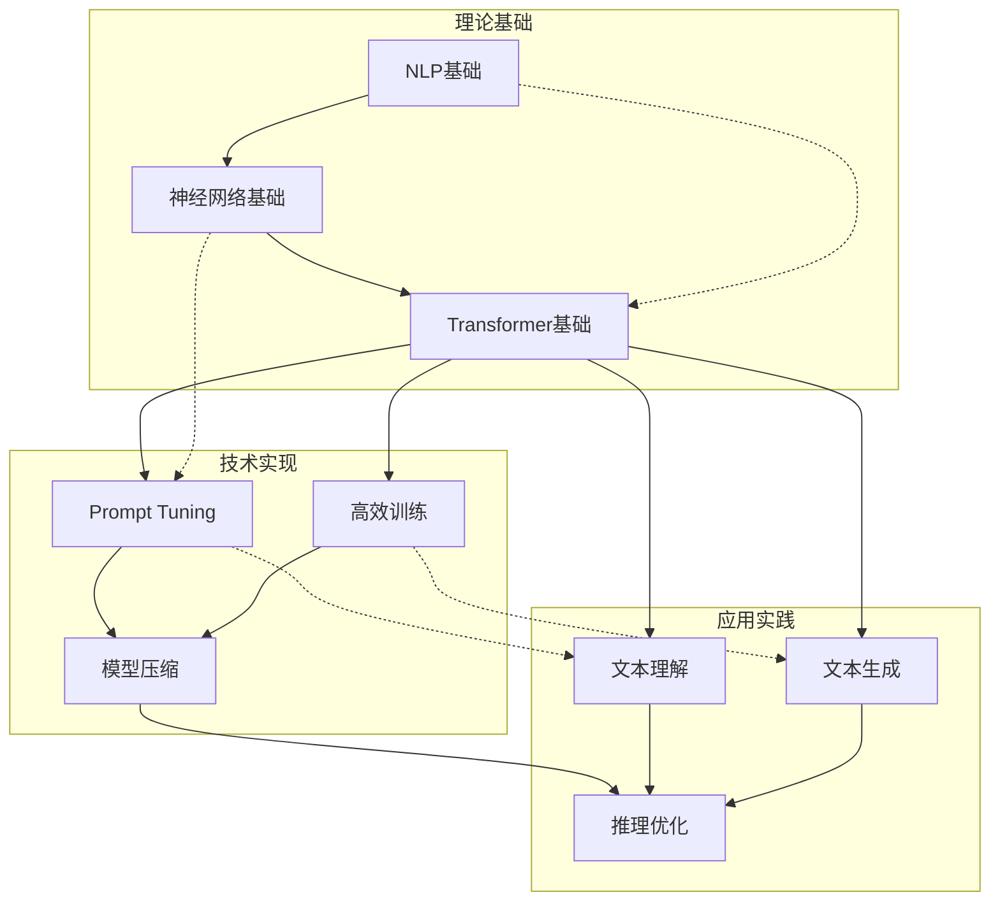

# 课程资源

<cite>
**本文档引用的文件**
- [1.NLP&大模型基础.md](file://98.相关课程/清华大模型公开课/1.NLP&大模型基础/1.NLP&大模型基础.md)
- [2.神经网络基础.md](file://98.相关课程/清华大模型公开课/2.神经网络基础/2.神经网络基础.md)
- [3.Transformer基础.md](file://98.相关课程/清华大模型公开课/3.Transformer基础/3.Transformer基础.md)
- [4.Prompt Tuning & Delta Tuning.md](file://98.相关课程/清华大模型公开课/4.Prompt Tuning & Delta Tuning/4.Prompt Tuning & Delta Tuning.md)
- [5.高效训练&模型压缩.md](file://98.相关课程/清华大模型公开课/5.高效训练&模型压缩/5.高效训练&模型压缩.md)
- [6.文本理解和生成大模型.md](file://98.相关课程/清华大模型公开课/6.文本理解和生成大模型/6.文本理解和生成大模型.md)
- [README.md](file://README.md)
</cite>

## 目录
1. [课程简介](#课程简介)
2. [课程体系架构](#课程体系架构)
3. [核心课程详解](#核心课程详解)
4. [学习路径规划](#学习路径规划)
5. [课程关联关系](#课程关联关系)
6. [实践项目与资源](#实践项目与资源)
7. [学习成果与评估](#学习成果与评估)
8. [进阶学习建议](#进阶学习建议)

## 课程简介

清华大学大模型公开课系列课程是专为系统性学习大语言模型技术而设计的完整知识体系。该课程体系涵盖了从基础理论到前沿应用的全方位内容，旨在帮助学习者建立扎实的大模型知识基础和实践能力。

### 课程特色
- **系统性强**：从神经网络基础到大模型应用，形成完整的知识链条
- **理论与实践并重**：既有深入的理论分析，又有实用的技术实现
- **循序渐进**：按照学习难度和知识关联度精心设计课程顺序
- **前沿导向**：涵盖当前大模型领域的最新发展和技术

### 适用人群
- 有一定编程基础的计算机科学学生
- 希望转向AI领域的软件工程师
- 需要掌握大模型技术的科研人员
- 对大模型技术感兴趣的爱好者

## 课程体系架构

清华大学大模型公开课系列课程采用模块化设计，共包含6个核心模块，每个模块都有明确的学习目标和实践要求。



**图表来源**
- [1.NLP&大模型基础.md:1-229](file://98.相关课程/清华大模型公开课/1.NLP&大模型基础/1.NLP&大模型基础.md#L1-L229)
- [2.神经网络基础.md:1-534](file://98.相关课程/清华大模型公开课/2.神经网络基础/2.神经网络基础.md#L1-L534)
- [3.Transformer基础.md:1-394](file://98.相关课程/清华大模型公开课/3.Transformer基础/3.Transformer基础.md#L1-L394)

## 核心课程详解

### 1. NLP&大模型基础

#### 学习目标
- 理解自然语言处理的基本概念和发展历程
- 掌握大模型的核心特征和演进轨迹
- 建立对词嵌入、语言模型等基础概念的深入理解
- 了解预训练+微调范式的理论基础

#### 主要内容
- 自然语言处理任务分类与应用
- 词表示方法的演进：one-hot到词嵌入
- 语言模型的发展历程：N-gram到神经语言模型
- 大模型的特点：参数量、数据量、计算资源的增长趋势
- 预训练+微调范式的理论基础和实践意义

#### 适合学习者水平
- 编程基础：Python基础语法
- 数学基础：线性代数、概率论基础
- 机器学习入门：监督学习、无监督学习概念

#### 学习要点
- 理解词嵌入如何解决one-hot表示的局限性
- 掌握语言模型从统计方法到神经网络的演进
- 了解大模型发展的三个关键特征

**章节来源**
- [1.NLP&大模型基础.md:1-229](file://98.相关课程/清华大模型公开课/1.NLP&大模型基础/1.NLP&大模型基础.md#L1-L229)

### 2. 神经网络基础

#### 学习目标
- 掌握神经网络的基本组成和工作机制
- 理解激活函数的作用和选择原则
- 熟悉训练目标函数和优化算法
- 了解反向传播算法的实现原理

#### 主要内容
- 神经元模型和网络结构
- 激活函数：Sigmoid、Tanh、ReLU的特性和应用场景
- 输出层设计和多层网络的表达能力
- 训练目标：均方根误差和交叉熵
- 随机梯度下降和链式求导法则
- 反向传播算法的计算图表示

#### 适合学习者水平
- 线性代数基础：矩阵运算、向量运算
- 微积分基础：偏导数、链式法则
- 编程实践：使用深度学习框架进行简单实验

#### 学习要点
- 理解非线性激活函数对网络表达能力的重要性
- 掌握反向传播算法的数学原理和实现细节
- 了解梯度消失和梯度爆炸问题及其解决方案

**章节来源**
- [2.神经网络基础.md:1-534](file://98.相关课程/清华大模型公开课/2.神经网络基础/2.神经网络基础.md#L1-L534)

### 3. Transformer基础

#### 学习目标
- 深入理解注意力机制的原理和实现
- 掌握Transformer架构的设计思想和关键技术
- 了解预训练语言模型的发展历程和应用
- 熟悉现代大模型的典型架构和优化技巧

#### 主要内容
- 注意力机制：Seq2Seq注意力和通用定义
- Transformer架构：Encoder-Decoder设计
- 输入编码：BPE分词和位置编码
- 注意力变体：加性注意力、点积注意力、缩放点积注意力
- 多头注意力和自注意力机制
- 预训练语言模型：GPT、BERT、T5等架构对比
- 大模型优化技巧：残差连接、层归一化、标签平滑等

#### 适合学习者水平
- 神经网络基础：前馈网络、反向传播
- 线性代数：矩阵运算、向量空间
- 编程实践：使用PyTorch/TensorFlow实现简单模型

#### 学习要点
- 理解注意力机制如何解决序列建模的瓶颈问题
- 掌握Transformer架构中各个组件的作用和相互关系
- 了解不同预训练范式的优缺点和适用场景

**章节来源**
- [3.Transformer基础.md:1-394](file://98.相关课程/清华大模型公开课/3.Transformer基础/3.Transformer基础.md#L1-L394)

### 4. Prompt Tuning & Delta Tuning

#### 学习目标
- 理解提示学习的理论基础和实践方法
- 掌握参数高效微调技术的原理和实现
- 了解大模型参数量增长带来的挑战和解决方案
- 熟悉现代大模型微调的最佳实践

#### 主要内容
- 提示学习：模板设计和词汇映射
- 参数高效微调：增量式、指定式、重参数化式
- BitFit方法：仅微调偏置参数
- LoRA低秩适应：矩阵低秩分解技术
- 自动机器学习搜索最优微调结构
- OpenPrompt工具包的使用和实践

#### 适合学习者水平
- Transformer架构：编码器-解码器理解
- 线性代数：矩阵分解、低秩近似
- 编程实践：深度学习模型的微调和优化

#### 学习要点
- 理解大模型参数量增长对传统微调方法的挑战
- 掌握参数高效微调技术的数学原理和实现细节
- 了解不同类型微调方法的适用场景和性能特点

**章节来源**
- [4.Prompt Tuning & Delta Tuning.md:1-1108](file://98.相关课程/清华大模型公开课/4.Prompt Tuning & Delta Tuning/4.Prompt Tuning & Delta Tuning.md#L1-L1108)

### 5. 高效训练&模型压缩

#### 学习目标
- 掌握大规模模型训练的分布式策略
- 理解显存管理的重要性和优化方法
- 了解模型压缩技术的原理和应用
- 熟悉现代大模型推理优化技术

#### 主要内容
- 显存组成：参数、梯度、中间结果、优化器
- 数据并行：参数服务器、All Reduce、Reduce Scatter
- 模型并行：线性层参数划分和通信优化
- ZeRO优化器：Stage 1-3的显存优化策略
- Pipeline并行：流水线式模型执行
- 混合精度训练：FP16优化和梯度累积
- 模型压缩：知识蒸馏、模型剪枝、模型量化
- 推理优化：BMInf工具包和内存调度

#### 适合学习者水平
- 深度学习框架：PyTorch、TensorFlow使用
- 分布式计算：MPI、NCCL基础概念
- 编程实践：CUDA编程、内存管理

#### 学习要点
- 理解大规模模型训练的显存瓶颈和解决方案
- 掌握分布式训练的核心通信原语和优化策略
- 了解不同类型模型压缩技术的原理和适用场景

**章节来源**
- [5.高效训练&模型压缩.md:1-564](file://98.相关课程/清华大模型公开课/5.高效训练&模型压缩/5.高效训练&模型压缩.md#L1-L564)

### 6. 文本理解和生成大模型

#### 学习目标
- 掌握信息检索的基础理论和现代神经网络方法
- 理解机器阅读理解和开放域问答的实现原理
- 了解文本生成任务的分类和生成策略
- 熟悉大模型在不同NLP任务中的应用

#### 主要内容
- 信息检索：BM25传统方法和神经网络方法
- 机器阅读理解：传统流水线和大模型方法
- 开放域问答：生成式和检索式方法
- 文本生成：条件语言模型、Seq2Seq、自回归模型
- 控制文本生成：提示方法、概率分布修改、架构重构
- 评估方法：BLEU、ROUGE、困惑度等指标

#### 适合学习者水平
- NLP基础：分词、词性标注、命名实体识别
- 机器学习：排序学习、推荐系统基础
- 编程实践：使用Hugging Face Transformers库

#### 学习要点
- 理解信息检索从基于词汇匹配到语义匹配的演进
- 掌握大模型如何简化传统NLP任务的处理流程
- 了解不同文本生成策略的优缺点和适用场景

**章节来源**
- [6.文本理解和生成大模型.md:1-595](file://98.相关课程/清华大模型公开课/6.文本理解和生成大模型/6.文本理解和生成大模型.md#L1-L595)

## 学习路径规划

### 基础阶段（1-2周）
**目标**：建立大模型基础知识框架

#### 学习计划
- 第1周：NLP&大模型基础
  - 重点掌握：词表示方法、语言模型概念、大模型发展历程
  - 实践任务：实现简单的词嵌入可视化、语言模型训练
- 第2周：神经网络基础
  - 重点掌握：神经元模型、激活函数、反向传播算法
  - 实践任务：手写神经网络实现、梯度计算验证

**预期成果**
- 能够解释词嵌入如何解决one-hot表示的局限性
- 能够实现简单的前馈神经网络并进行梯度计算

### 核心阶段（3-6周）
**目标**：深入理解Transformer架构和微调技术

#### 学习计划
- 第3周：Transformer基础
  - 重点掌握：注意力机制、多头注意力、位置编码
  - 实践任务：实现注意力机制、可视化注意力权重
- 第4周：Prompt Tuning & Delta Tuning
  - 重点掌握：提示学习、参数高效微调、LoRA技术
  - 实践任务：使用OpenPrompt进行文本分类任务
- 第5周：高效训练&模型压缩
  - 重点掌握：分布式训练、ZeRO优化器、模型压缩
  - 实践任务：实现数据并行、模型剪枝实验
- 第6周：文本理解和生成大模型
  - 重点掌握：信息检索、机器阅读理解、文本生成
  - 实践任务：实现简单的问答系统、文本生成模型

**预期成果**
- 能够实现Transformer的关键组件并进行可视化分析
- 能够使用提示学习技术进行下游任务微调
- 能够理解和实现分布式训练策略

### 应用阶段（1-2周）
**目标**：综合运用所学知识解决实际问题

#### 学习计划
- 第7周：综合实践项目
  - 任务1：构建一个完整的问答系统
  - 任务2：实现文本摘要生成
  - 任务3：设计个性化推荐系统
- 第8周：项目展示与优化
  - 项目展示、性能评估、优化改进

**预期成果**
- 能够独立设计和实现一个完整的NLP应用系统
- 具备系统性的问题分析和解决能力

## 课程关联关系

### 知识关联图



### 依赖关系分析

| 课程 | 前置课程 | 依赖技能 | 关键概念 |
|------|----------|----------|----------|
| 神经网络基础 | NLP基础 | 线性代数、微积分 | 激活函数、反向传播 |
| Transformer基础 | 神经网络基础 | 矩阵运算、概率论 | 注意力机制、位置编码 |
| Prompt Tuning | Transformer基础 | PyTorch/TensorFlow | 提示学习、参数高效微调 |
| 高效训练 | Transformer基础 | 分布式计算 | 数据并行、ZeRO优化 |
| 文本理解 | Transformer基础 | NLP基础 | 信息检索、阅读理解 |
| 文本生成 | Transformer基础 | 机器学习 | 条件语言模型、解码策略 |

### 学习建议

1. **循序渐进**：严格按照课程顺序学习，确保理论基础扎实
2. **理论联系实际**：每个理论概念都要结合编程实践
3. **注重理解**：重点理解算法原理而非死记硬背公式
4. **及时复习**：定期回顾前面学过的概念，建立知识网络

## 实践项目与资源

### 项目一：问答系统构建

#### 项目目标
构建一个基于大模型的问答系统，支持开放域问题回答

#### 技术栈
- 编程语言：Python 3.8+
- 深度学习框架：PyTorch或TensorFlow
- NLP库：Transformers、Datasets
- 可视化：Matplotlib、Seaborn

#### 项目要求
- 实现基于检索的问答系统
- 支持多轮对话
- 具备基本的性能评估指标
- 提供可视化界面

#### 评估标准
- 功能完整性：100分
- 代码质量：80分
- 性能表现：70分
- 文档完整性：50分

### 项目二：文本摘要生成

#### 项目目标
实现一个自动文本摘要生成系统

#### 技术要求
- 支持新闻文章摘要
- 提供多种摘要策略
- 实现摘要质量评估
- 支持批量处理

#### 评估标准
- 摘要质量：100分
- 系统性能：80分
- 用户体验：70分
- 代码规范：50分

### 学习资源

#### 在线资源
- [Hugging Face Transformers官方文档](https://huggingface.co/docs/transformers/)
- [PyTorch官方教程](https://pytorch.org/tutorials/)
- [Google AI博客](https://ai.googleblog.com/)

#### 书籍推荐
- 《深度学习》- Ian Goodfellow
- 《机器学习》- 周志华
- 《统计学习方法》- 李航

#### 工具包
- **OpenPrompt**：提示学习工具包
- **BMTrain**：大模型训练工具包
- **BMInf**：大模型推理工具包
- **FAISS**：高效相似性搜索

## 学习成果与评估

### 知识掌握评估

#### 理论理解（40%）
- 能够解释大模型的核心概念和原理
- 理解不同技术方案的优缺点
- 具备跨学科知识整合能力

#### 实践能力（40%）
- 能够独立实现核心算法
- 具备系统性问题分析能力
- 能够进行性能优化和调试

#### 项目应用（20%）
- 能够设计完整的解决方案
- 具备团队协作和沟通能力
- 能够进行技术文档编写

### 技能认证体系

#### 初级认证（通过基础课程）
- 掌握NLP基础概念
- 理解神经网络基本原理
- 能够实现简单模型

#### 中级认证（完成核心课程）
- 熟练掌握Transformer架构
- 能够进行模型微调
- 具备分布式训练能力

#### 高级认证（完成应用课程）
- 能够设计复杂NLP系统
- 具备性能优化能力
- 能够进行技术创新

### 学习进度跟踪

#### 月度评估
- 第1个月：理论基础掌握情况
- 第2个月：核心算法实现能力
- 第3个月：综合应用能力评估

#### 最终项目评估
- 项目完成度：100分
- 技术创新性：80分
- 团队协作：70分
- 学习反思：50分

## 进阶学习建议

### 学术深造方向

#### 研究领域选择
1. **大模型理论研究**
   - 参数高效微调技术
   - 大模型压缩与优化
   - 多模态大模型

2. **应用技术研究**
   - 检索增强生成（RAG）
   - 大模型推理优化
   - 多模态对话系统

3. **系统工程研究**
   - 分布式训练系统
   - 模型服务化架构
   - 大模型安全与伦理

#### 学术资源
- **顶级会议**：NeurIPS、ICML、CVPR、ACL
- **期刊**：IEEE TPAMI、JMLR、TACL
- **预印本**：arXiv、Papers with Code

### 产业应用方向

#### 技术岗位
1. **算法工程师**
   - 负责大模型算法实现
   - 参与模型优化和部署
   - 解决实际业务问题

2. **系统架构师**
   - 设计大规模分布式系统
   - 优化模型训练和推理
   - 确保系统稳定性

3. **产品经理**
   - 定义产品需求和功能
   - 协调技术团队开发
   - 评估产品市场表现

#### 职业发展路径
```
初级工程师 → 高级工程师 → 技术专家 → 架构师 → 技术总监
```

### 终身学习建议

#### 技术更新
- 关注大模型领域最新进展
- 参加学术会议和行业论坛
- 阅读顶级期刊和会议论文

#### 能力提升
- 参与开源项目贡献
- 发表技术博客和文章
- 培训新人和分享经验

#### 社区参与
- 加入专业组织和协会
- 参与技术社区讨论
- 组织或参加技术活动

### 资源推荐

#### 在线学习平台
- **Coursera**：深度学习专项课程
- **edX**：MIT的AI和机器学习课程
- **Fast.ai**：实用深度学习课程

#### 专业社区
- **GitHub**：开源项目和代码分享
- **Stack Overflow**：技术问题解答
- **知乎**：中文技术社区

#### 专业组织
- **中国计算机学会**（CCF）
- **中国人工智能学会**（CAAI）
- **中国中文信息学会**（CIPS）

通过系统性的学习和实践，学员将能够：
- 深入理解大模型技术的核心原理
- 具备独立开发和优化大模型应用的能力
- 为进入大模型相关领域做好充分准备
- 建立持续学习和发展的良好基础