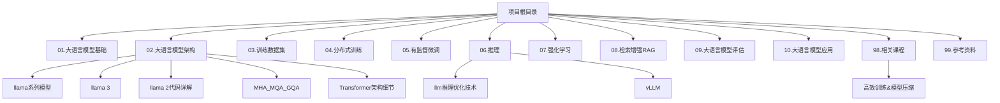
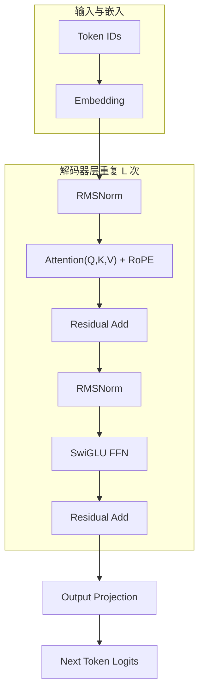
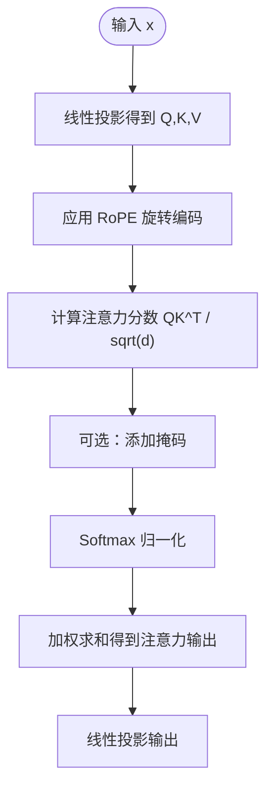
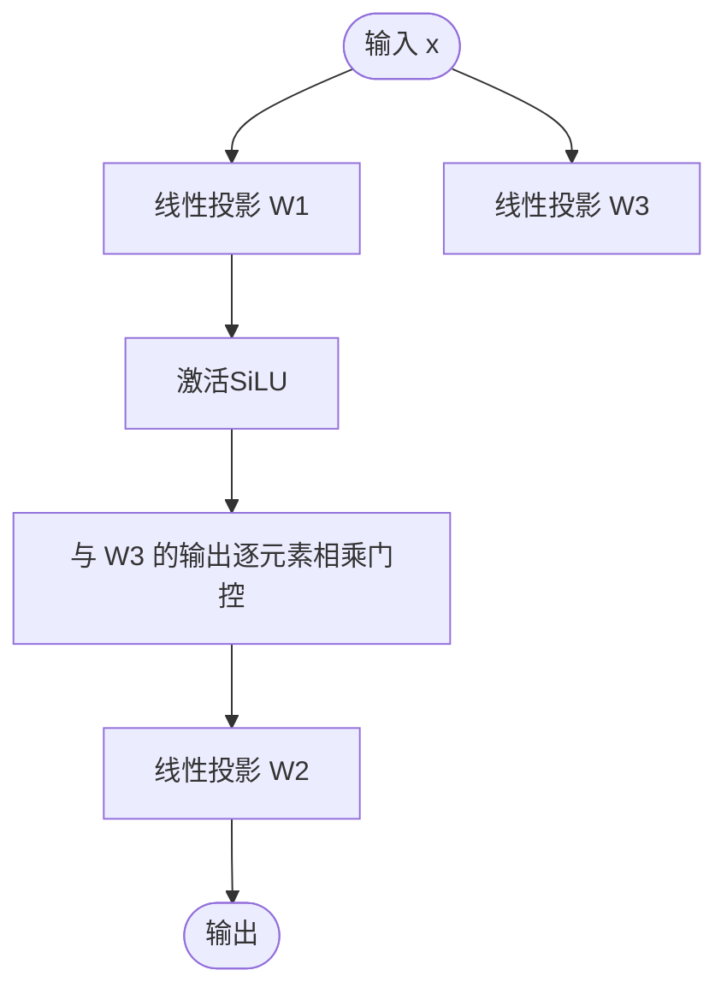
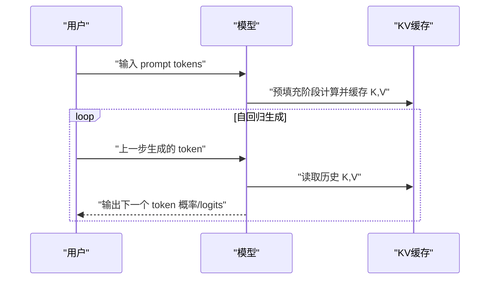
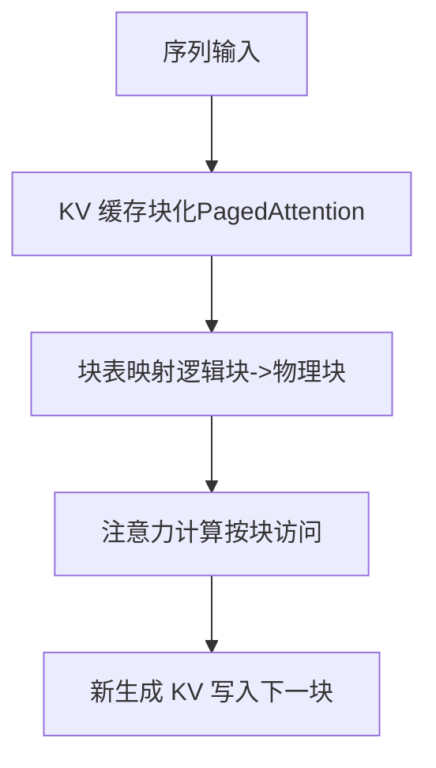
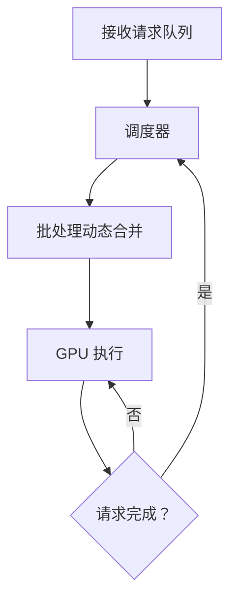
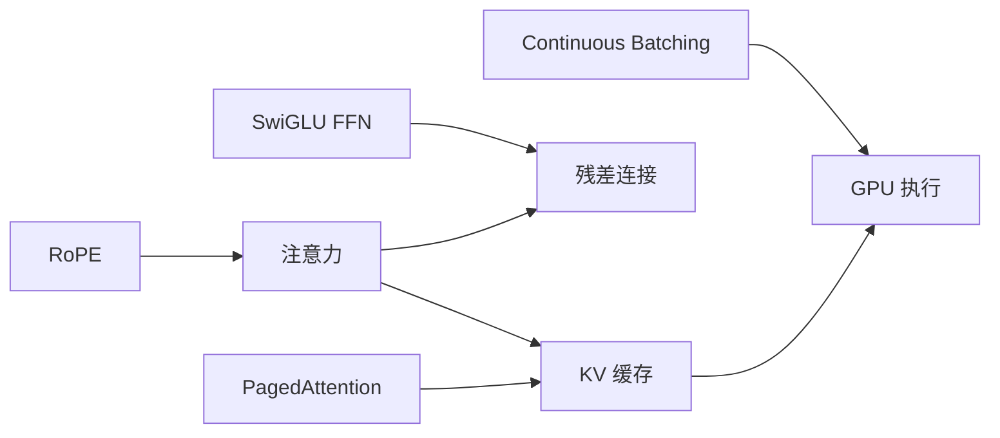

# llama3-from-scratch 项目

<cite>
**本文引用的文件列表**
- [README.md](file://README.md)
- [llama系列模型.md](file://02.大语言模型架构/llama系列模型/llama系列模型.md)
- [llama 3.md](file://02.大语言模型架构/llama 3/llama 3.md)
- [llama 2代码详解.md](file://02.大语言模型架构/llama 2代码详解/llama 2代码详解.md)
- [MHA_MQA_GQA.md](file://02.大语言模型架构/MHA_MQA_GQA/MHA_MQA_GQA.md)
- [Transformer架构细节.md](file://02.大语言模型架构/Transformer架构细节/Transformer架构细节.md)
- [llm推理优化技术.md](file://06.推理/llm推理优化技术/llm推理优化技术.md)
- [1.vllm.md](file://06.推理/1.vllm/1.vllm.md)
- [5.高效训练&模型压缩.md](file://98.相关课程/清华大模型公开课/5.高效训练&模型压缩/5.高效训练&模型压缩.md)
</cite>

## 目录
1. [简介](#简介)
2. [项目结构](#项目结构)
3. [核心组件](#核心组件)
4. [架构总览](#架构总览)
5. [详细组件分析](#详细组件分析)
6. [依赖关系分析](#依赖关系分析)
7. [性能与优化](#性能与优化)
8. [故障排查指南](#故障排查指南)
9. [结论](#结论)
10. [附录](#附录)

## 简介
本项目围绕“从零实现 Llama3”的目标，系统梳理 Llama3 的架构要点、关键组件与推理优化技术，帮助读者在本地笔记本（16G 内存）环境下完成模型的加载、推理与调试。文档基于仓库中已有的架构与实现细节资料，结合 Llama 系列模型的通用设计（如 RMSNorm、SwiGLU、RoPE、GQA 等），给出可落地的实践路径与优化建议。

## 项目结构
仓库以知识体系为主，围绕 LLM 的基础、架构、推理与优化等主题组织内容。与“llama3-from-scratch”目标直接相关的内容集中在“大语言模型架构”“推理”等章节，尤其是 Llama 系列模型、注意力机制（MHA/MQA/GQA）、Transformer 细节、推理优化与 vLLM 等。

图表来源
- [README.md:1-169](file://README.md#L1-L169)
- [llama系列模型.md:1-377](file://02.大语言模型架构/llama系列模型/llama系列模型.md#L1-L377)
- [llama 3.md:1-110](file://02.大语言模型架构/llama 3/llama 3.md#L1-L110)
- [llama 2代码详解.md:1-522](file://02.大语言模型架构/llama 2代码详解/llama 2代码详解.md#L1-L522)
- [MHA_MQA_GQA.md:1-225](file://02.大语言模型架构/MHA_MQA_GQA/MHA_MQA_GQA.md#L1-L225)
- [Transformer架构细节.md:1-321](file://02.大语言模型架构/Transformer架构细节/Transformer架构细节.md#L1-L321)
- [llm推理优化技术.md:1-271](file://06.推理/llm推理优化技术/llm推理优化技术.md#L1-L271)
- [1.vllm.md:1-220](file://06.推理/1.vllm/1.vllm.md#L1-L220)
- [5.高效训练&模型压缩.md:519-564](file://98.相关课程/清华大模型公开课/5.高效训练&模型压缩/5.高效训练&模型压缩.md#L519-L564)

章节来源
- [README.md:1-169](file://README.md#L1-L169)

## 核心组件
- 模型架构与组件
  - 解码器架构与层堆叠：标准的纯解码器 Transformer，包含 RMSNorm、注意力（含 RoPE）、前馈网络（SwiGLU）等。
  - 分组查询注意力（GQA）：在多头注意力与多查询注意力之间取得平衡，减少 KV 缓存与内存带宽压力。
  - 旋转位置编码（RoPE）：以复数/旋转方式注入相对位置信息，提升长序列建模能力。
  - 前馈网络（SwiGLU）：替代 ReLU，提升表达能力与训练稳定性。
- 推理与优化
  - KV 缓存与 PagedAttention：通过分页管理 KV 缓存，降低碎片与内存浪费，提升吞吐。
  - 连续批处理（Continuous Batching）：动态调度，提升 GPU 利用率。
  - 量化与稀疏：降低权重/激活精度或结构化稀疏，减少显存占用。
- 本地调试与运行
  - 在 16G 内存笔记本上运行，需关注显存占用、批大小、序列长度与 KV 缓存管理策略。

章节来源
- [llama系列模型.md:1-377](file://02.大语言模型架构/llama系列模型/llama系列模型.md#L1-L377)
- [llama 3.md:1-110](file://02.大语言模型架构/llama 3/llama 3.md#L1-L110)
- [llm推理优化技术.md:1-271](file://06.推理/llm推理优化技术/llm推理优化技术.md#L1-L271)
- [1.vllm.md:1-220](file://06.推理/1.vllm/1.vllm.md#L1-L220)

## 架构总览
下图展示 Llama3 解码器端的典型处理流程：输入 token 经词嵌入后进入多层 Transformer Block，每层包含 RMSNorm、注意力（含 RoPE）、残差连接、RMSNorm、前馈网络（SwiGLU）与残差连接，最终经输出投影得到下一个 token 的 logits。

图表来源
- [llama系列模型.md:100-156](file://02.大语言模型架构/llama系列模型/llama系列模型.md#L100-L156)
- [llama 3.md:22-52](file://02.大语言模型架构/llama 3/llama 3.md#L22-L52)
- [Transformer架构细节.md:24-31](file://02.大语言模型架构/Transformer架构细节/Transformer架构细节.md#L24-L31)

## 详细组件分析

### 注意力与位置编码（RoPE）
- RoPE 通过复数旋转将位置信息注入 Q/K，提升相对位置建模能力，适合长序列与自回归解码。
- GQA 在多头注意力与多查询注意力之间折中，减少 KV 缓存与内存带宽压力，同时保持较好质量。

图表来源
- [llama 2代码详解.md:258-331](file://02.大语言模型架构/llama 2代码详解/llama 2代码详解.md#L258-L331)
- [MHA_MQA_GQA.md:162-225](file://02.大语言模型架构/MHA_MQA_GQA/MHA_MQA_GQA.md#L162-L225)

章节来源
- [llama 2代码详解.md:258-331](file://02.大语言模型架构/llama 2代码详解/llama 2代码详解.md#L258-L331)
- [MHA_MQA_GQA.md:162-225](file://02.大语言模型架构/MHA_MQA_GQA/MHA_MQA_GQA.md#L162-L225)

### 前馈网络（SwiGLU）
- 使用 Swish（SiLU）与门控机制，提升非线性表达能力，参数规模与维度设计遵循缩放定律与工程实践。

图表来源
- [llama系列模型.md:133-156](file://02.大语言模型架构/llama系列模型/llama系列模型.md#L133-L156)

章节来源
- [llama系列模型.md:133-156](file://02.大语言模型架构/llama系列模型/llama系列模型.md#L133-L156)

### 推理流程与解码策略
- 预填充阶段：一次性处理输入序列，计算 KV 缓存。
- 解码阶段：自回归生成，每步依赖前一步的 KV 缓存，受内存带宽限制。
- 解码策略：温度采样、Top-p、Top-k 等，控制多样性与稳定性。

图表来源
- [llm推理优化技术.md:11-28](file://06.推理/llm推理优化技术/llm推理优化技术.md#L11-L28)
- [llama 2代码详解.md:110-158](file://02.大语言模型架构/llama 2代码详解/llama 2代码详解.md#L110-L158)

章节来源
- [llm推理优化技术.md:11-28](file://06.推理/llm推理优化技术/llm推理优化技术.md#L11-L28)
- [llama 2代码详解.md:110-158](file://02.大语言模型架构/llama 2代码详解/llama 2代码详解.md#L110-L158)

### KV 缓存与分页注意力（PagedAttention）
- KV 缓存是解码阶段的内存瓶颈，PagedAttention 将 KV 缓存按块分页存储，减少碎片与浪费，提升吞吐。
- vLLM 的 PagedAttention 通过块表映射逻辑块到物理块，支持高效内存共享与并行访问。

图表来源
- [1.vllm.md:61-135](file://06.推理/1.vllm/1.vllm.md#L61-L135)
- [llm推理优化技术.md:168-180](file://06.推理/llm推理优化技术/llm推理优化技术.md#L168-L180)

章节来源
- [1.vllm.md:61-135](file://06.推理/1.vllm/1.vllm.md#L61-L135)
- [llm推理优化技术.md:168-180](file://06.推理/llm推理优化技术/llm推理优化技术.md#L168-L180)

### 连续批处理（Continuous Batching）
- 动态调度：当某请求提前完成时，立即插入新请求，提升 GPU 利用率，避免静态批处理的空闲浪费。

图表来源
- [llm推理优化技术.md:240-249](file://06.推理/llm推理优化技术/llm推理优化技术.md#L240-L249)

章节来源
- [llm推理优化技术.md:240-249](file://06.推理/llm推理优化技术/llm推理优化技术.md#L240-L249)

## 依赖关系分析
- 组件耦合
  - 注意力模块与位置编码（RoPE）紧密耦合，RoPE 在注意力前应用，影响 Q/K 的相对位置表示。
  - 前馈网络（SwiGLU）与注意力模块并行堆叠，残差连接贯穿各子层。
  - KV 缓存与注意力模块强耦合，解码阶段的内存瓶颈主要由 KV 缓存决定。
- 外部依赖与集成
  - 推理优化依赖于分页注意力（PagedAttention）与连续批处理（Continuous Batching）等技术。
  - 量化与稀疏等模型压缩技术可与上述优化协同，进一步降低显存占用。

图表来源
- [llama 2代码详解.md:258-331](file://02.大语言模型架构/llama 2代码详解/llama 2代码详解.md#L258-L331)
- [llm推理优化技术.md:168-180](file://06.推理/llm推理优化技术/llm推理优化技术.md#L168-L180)
- [1.vllm.md:89-135](file://06.推理/1.vllm/1.vllm.md#L89-L135)

章节来源
- [llm推理优化技术.md:168-180](file://06.推理/llm推理优化技术/llm推理优化技术.md#L168-L180)
- [1.vllm.md:89-135](file://06.推理/1.vllm/1.vllm.md#L89-L135)

## 性能与优化
- 显存与吞吐
  - KV 缓存是主要显存占用来源，需通过 GQA、PagedAttention、连续批处理等技术降低占用与碎片。
  - 在 16G 内存笔记本上，建议控制批大小与序列长度，优先使用 FP16/BF16，必要时采用量化或稀疏。
- 计算效率
  - 使用 FlashAttention/优化注意力内核，减少内存访问与带宽压力。
  - 通过连续批处理与 PagedAttention 提升 GPU 利用率与吞吐。
- 模型并行与内存调度
  - 参考“高效训练&模型压缩”课程中的内存调度思想，合理安排层间参数加载与释放，减少加载时间带来的额外开销。

章节来源
- [llm推理优化技术.md:47-73](file://06.推理/llm推理优化技术/llm推理优化技术.md#L47-L73)
- [1.vllm.md:89-135](file://06.推理/1.vllm/1.vllm.md#L89-L135)
- [5.高效训练&模型压缩.md:519-564](file://98.相关课程/清华大模型公开课/5.高效训练&模型压缩/5.高效训练&模型压缩.md#L519-L564)

## 故障排查指南
- 显存不足
  - 降低批大小、序列长度或使用 FP16/BF16；开启 PagedAttention 与连续批处理；必要时采用量化或稀疏。
- 解码缓慢
  - 检查 KV 缓存管理策略，确认是否启用分页与连续批处理；评估注意力内核是否优化。
- 生成质量不稳定
  - 调整温度、Top-p、Top-k 等采样策略；确保 RoPE 与注意力实现正确；检查 SwiGLU 前馈网络配置。
- 内存碎片与浪费
  - 使用 PagedAttention 的块化管理，避免过度配置 KV 缓存；优化块大小与块表映射策略。

章节来源
- [1.vllm.md:61-135](file://06.推理/1.vllm/1.vllm.md#L61-L135)
- [llm推理优化技术.md:168-180](file://06.推理/llm推理优化技术/llm推理优化技术.md#L168-L180)

## 结论
通过整合 Llama 系列模型的通用设计（RMSNorm、RoPE、SwiGLU、GQA）与推理优化技术（PagedAttention、连续批处理、量化/稀疏），可在本地笔记本（16G 内存）上实现 Llama3 的加载与推理。建议以“先实现核心组件，再逐步引入优化技术”的方式推进，先保证正确性，再追求性能与稳定性。

## 附录
- 运行与调试建议
  - 从最小配置开始：单层注意力、小批大小、短序列，逐步扩大规模。
  - 使用 FP16/BF16，避免混合精度问题；确保 RoPE 与注意力实现一致。
  - 在推理阶段启用 KV 缓存与分页管理，结合连续批处理提升吞吐。
  - 若显存紧张，优先采用量化与稀疏策略，其次降低批大小与序列长度。