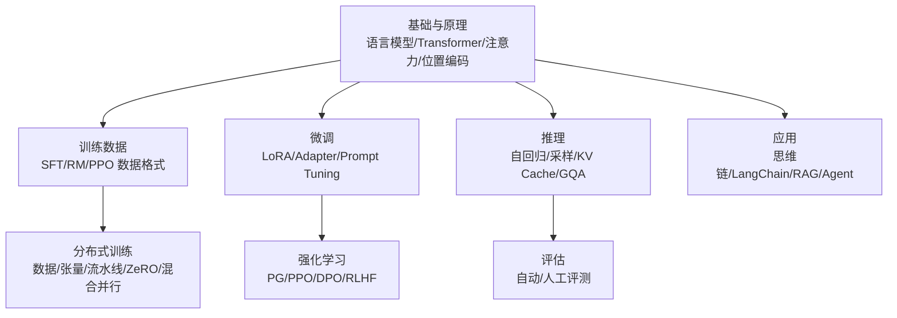
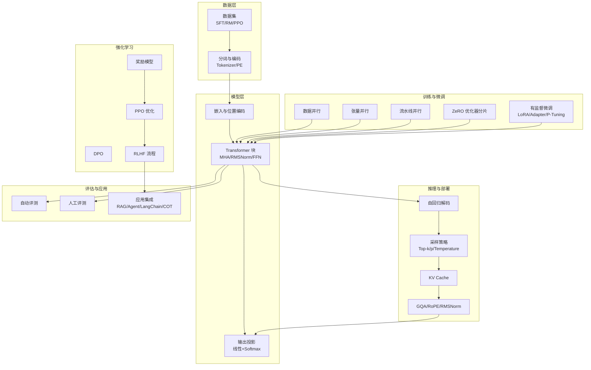
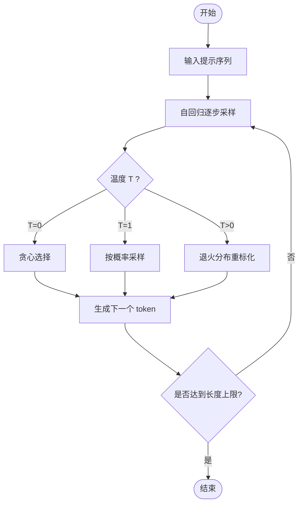
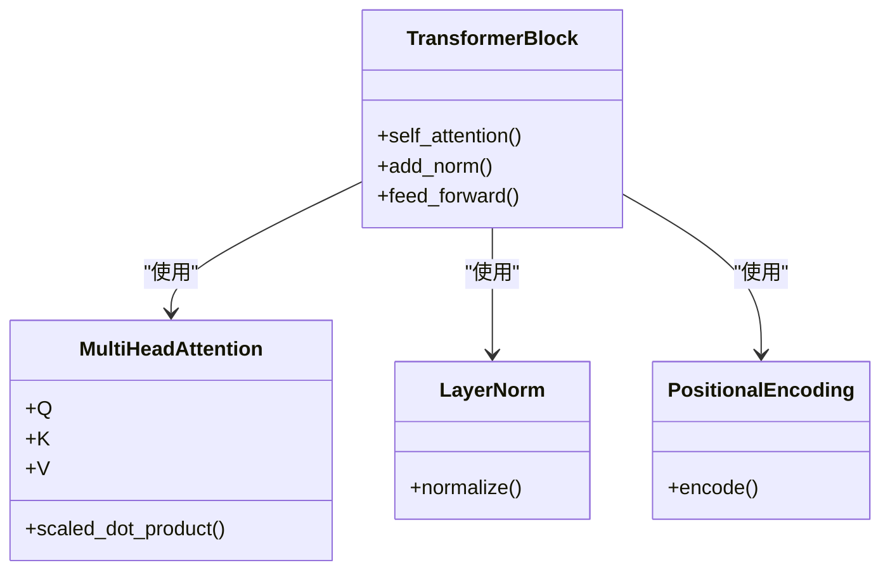
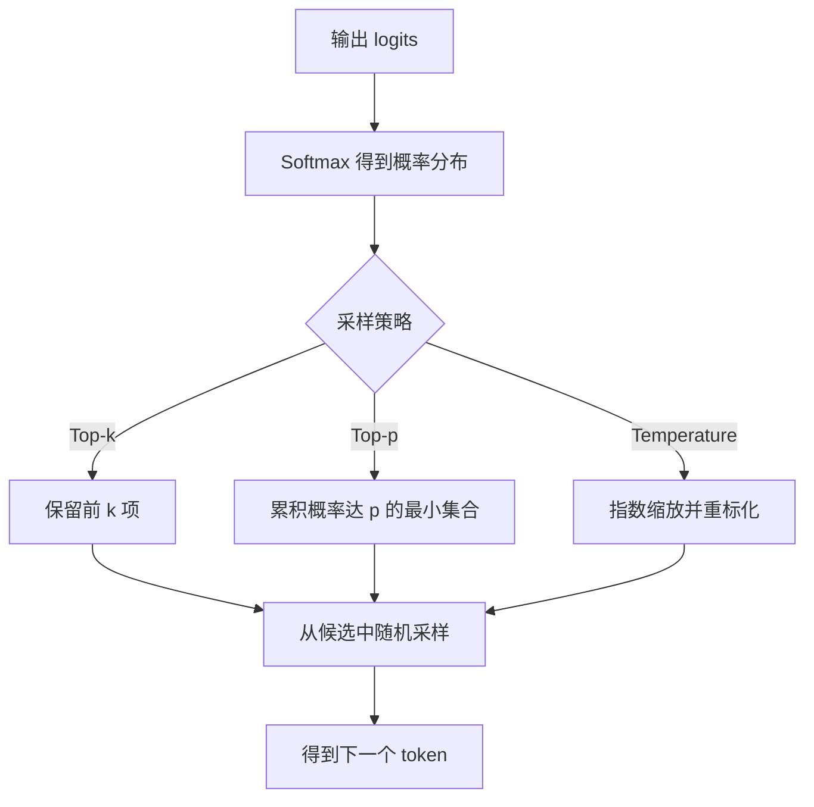
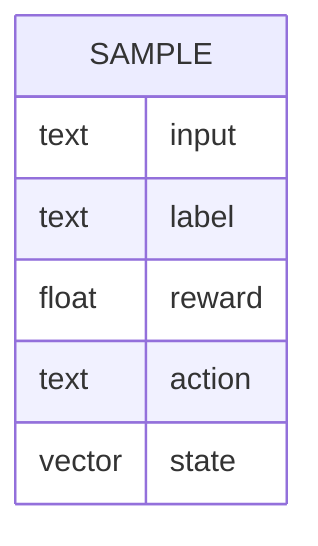
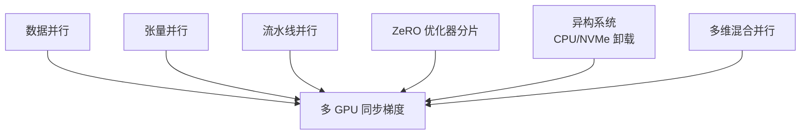
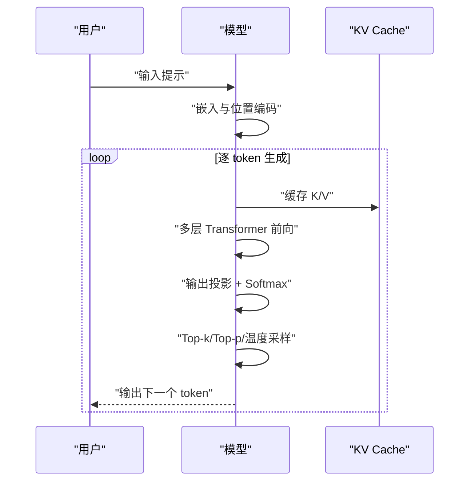
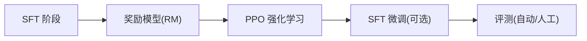
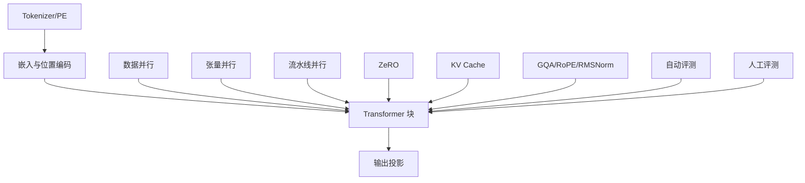

# tiny-llm-zh 项目

<cite>
**本文引用的文件**   
- [README.md](file://README.md)
- [语言模型.md](file://01.大语言模型基础/1.语言模型/1.语言模型.md)
- [Transformer架构细节.md](file://02.大语言模型架构/Transformer架构细节/Transformer架构细节.md)
- [llama 2代码详解.md](file://02.大语言模型架构/llama 2代码详解/llama 2代码详解.md)
- [数据格式.md](file://03.训练数据集/数据格式/数据格式.md)
- [1.概述.md](file://04.分布式训练/1.概述/1.概述.md)
- [README.md](file://05.有监督微调/README.md)
- [README.md](file://06.推理/README.md)
- [README.md](file://07.强化学习/README.md)
- [1.评测.md](file://09.大语言模型评估/1.评测/1.评测.md)
- [README.md](file://10.大语言模型应用/README.md)
- [README.md](file://08.检索增强rag/README.md)
- [README.md](file://98.相关课程/README.md)
</cite>

## 目录
1. [简介](#简介)
2. [项目结构](#项目结构)
3. [核心组件](#核心组件)
4. [架构总览](#架构总览)
5. [详细组件分析](#详细组件分析)
6. [依赖分析](#依赖分析)
7. [性能考量](#性能考量)
8. [故障排查指南](#故障排查指南)
9. [结论](#结论)
10. [附录](#附录)

## 简介
本仓库为大模型面试相关知识整理，包含从零实现小参数量中文大语言模型（tiny-llm-zh）的实践路径与技术要点。项目已在 ModelScope 平台部署，提供在线体验，便于在低资源环境下动手实践预训练、微调、RLHF 等关键技术。

- 在线体验地址：[ModelScope Tiny LLM](https://www.modelscope.cn/studios/wdndev/tiny_llm_92m_demo/summary)
- 项目目标：构建小参数量中文 LLM，覆盖数据预处理、模型架构、训练与微调、推理与部署、RLHF 与评估等全流程

章节来源
- [README.md:1-169](file://README.md#L1-L169)

## 项目结构
本仓库以知识体系为主，围绕 LLM 的基础、架构、训练数据、分布式训练、微调、推理、强化学习、评估与应用组织内容。与 tiny-llm-zh 实践相关的关键模块如下：

- 基础与原理：语言模型、Transformer 架构、注意力机制、位置编码、解码策略
- 训练数据：SFT/RM/PPO 数据格式与数据来源
- 分布式训练：数据并行、张量并行、流水线并行、ZeRO、异构系统与混合并行
- 微调：LoRA、Adapter、Prompt Tuning 等高效微调方法
- 推理：自回归解码、采样策略（Top-k、Top-p、Temperature）、KV Cache 与 GQA
- 强化学习：策略梯度、PPO、DPO、RLHF 流程
- 评估：自动与人工评测、评测指标与基准
- 应用：思维链提示、LangChain、RAG、Agent

章节来源
- [README.md:37-169](file://README.md#L37-L169)

## 核心组件
- 语言模型与自回归生成：理解语言模型的概率建模、自回归采样与温度控制，为预训练与推理提供基础
- Transformer 架构与注意力：掌握 Self-Attention、Multi-Head Attention、位置编码与并行化特性
- 解码策略：Top-k、Top-p、Temperature 控制生成多样性与稳定性
- 数据格式与数据集：SFT/RM/PPO 数据组织方式与数据来源
- 分布式训练：数据并行、张量并行、流水线并行、ZeRO、异构系统与混合并行
- 微调方法：LoRA、Adapter、Prompt Tuning 等高效微调
- 推理优化：KV Cache、GQA、RoPE、RMSNorm 等
- 强化学习：策略梯度、PPO、DPO、RLHF
- 评估：自动与人工评测、评测指标与基准
- 应用：思维链提示、LangChain、RAG、Agent

章节来源
- [语言模型.md:1-215](file://01.大语言模型基础/1.语言模型/1.语言模型.md#L1-L215)
- [Transformer架构细节.md:1-321](file://02.大语言模型架构/Transformer架构细节/Transformer架构细节.md#L1-L321)
- [llama 2代码详解.md:1-527](file://02.大语言模型架构/llama 2代码详解/llama 2代码详解.md#L1-L527)
- [数据格式.md:1-117](file://03.训练数据集/数据格式/数据格式.md#L1-L117)
- [1.概述.md:1-102](file://04.分布式训练/1.概述/1.概述.md#L1-L102)
- [README.md:107-119](file://05.有监督微调/README.md#L1-L30)
- [README.md:120-133](file://06.推理/README.md#L1-L28)
- [README.md:133-142](file://07.强化学习/README.md#L1-L22)
- [1.评测.md:1-43](file://09.大语言模型评估/1.评测/1.评测.md#L1-L43)
- [README.md:155-159](file://10.大语言模型应用/README.md#L1-L10)
- [README.md:1-14](file://08.检索增强rag/README.md#L1-L14)

## 架构总览
tiny-llm-zh 的实现以 Decoder-Only Transformer 为核心，结合自回归解码、高效微调与推理优化，形成从数据到部署的完整闭环。

图表来源
- [llama 2代码详解.md:160-527](file://02.大语言模型架构/llama 2代码详解/llama 2代码详解.md#L160-L527)
- [Transformer架构细节.md:1-321](file://02.大语言模型架构/Transformer架构细节/Transformer架构细节.md#L1-L321)
- [数据格式.md:1-117](file://03.训练数据集/数据格式/数据格式.md#L1-L117)
- [1.概述.md:1-102](file://04.分布式训练/1.概述/1.概述.md#L1-L102)
- [README.md:107-119](file://05.有监督微调/README.md#L1-L30)
- [README.md:120-133](file://06.推理/README.md#L1-L28)
- [README.md:133-142](file://07.强化学习/README.md#L1-L22)
- [1.评测.md:1-43](file://09.大语言模型评估/1.评测/1.评测.md#L1-L43)
- [README.md:155-159](file://10.大语言模型应用/README.md#L1-L10)

## 详细组件分析

### 语言模型与自回归生成
- 语言模型是序列的概率分布，自回归建模通过链式法则分解条件概率，适合用前馈网络高效计算
- 温度参数控制采样多样性，T=0 为贪心，T=1 为原分布采样，T→∞ 为均匀分布
- 条件生成通过提示（prompt）引导补全，温度与采样策略共同决定生成质量

章节来源
- [语言模型.md:37-97](file://01.大语言模型基础/1.语言模型/1.语言模型.md#L37-L97)

### Transformer 架构与注意力
- Encoder/Decoder 模块、Add&Norm、位置编码、Self-Attention 与 Multi-Head Attention
- 注意力归一化与放缩、梯度消失问题与解决方案
- 并行化特性：Embedding、FFN 层可并行；Self-Attention 采用矩阵运算实现“并行”

章节来源
- [Transformer架构细节.md:7-321](file://02.大语言模型架构/Transformer架构细节/Transformer架构细节.md#L7-L321)

### 解码策略与采样
- Top-k、Top-p、Temperature 采样策略，控制生成多样性与稳定性
- 采样流程：概率排序、累积概率阈值、归一化、随机采样

章节来源
- [llama 2代码详解.md:75-106](file://02.大语言模型架构/llama 2代码详解/llama 2代码详解.md#L75-L106)

### 数据格式与数据集
- SFT：输入文本与标签（如指令-输出）
- RM：输入文本与奖励值（人工/模型打分）
- PPO：输入、奖励、动作（生成文本）、状态（隐藏状态）
- 数据来源：Common Crawl、Wikipedia、OpenWebText、BookCorpus、新闻、领域数据等
- 数据增强：EDA、AEDA、回译、MLM 等

章节来源
- [数据格式.md:5-117](file://03.训练数据集/数据格式/数据格式.md#L5-L117)

### 分布式训练与并行
- 数据并行：沿 batch 维度切分，DDP 同步梯度
- 模型并行：张量并行（层内）、流水线并行（层间）
- 优化器并行：ZeRO-1/2/3 分片优化器状态、梯度与参数
- 异构系统：CPU 内存/NVMe 卸载未使用张量
- 混合并行：多维混合并行组合，提升吞吐与效率

章节来源
- [1.概述.md:3-102](file://04.分布式训练/1.概述/1.概述.md#L3-L102)

### 微调方法
- LoRA：低秩适配，冻结主模型，仅训练低秩矩阵
- Adapter：在 Transformer 层间插入小型 MLP 适配器
- Prompt Tuning：训练可学习的软提示，引导模型行为
- 适用场景：资源受限、快速定制、零样本泛化

章节来源
- [README.md:107-119](file://05.有监督微调/README.md#L1-L30)

### 推理与部署
- 自回归解码：逐 token 生成，使用前文上下文预测下一个 token
- 采样策略：Top-k、Top-p、Temperature
- 推理优化：KV Cache、GQA、RoPE、RMSNorm
- 生成流程：提示编码 → 嵌入与位置编码 → 多层 Transformer → 输出投影 → 采样

章节来源
- [llama 2代码详解.md:71-158](file://02.大语言模型架构/llama 2代码详解/llama 2代码详解.md#L71-L158)

### 强化学习与 RLHF
- 策略梯度（PG）、近端策略优化（PPO）、直接偏好优化（DPO）
- RLHF 流程：SFT → RM → PPO → SFT（可选）
- 评估：自动与人工评测，确保 helpful、honest、harmless

章节来源
- [README.md:133-142](file://07.强化学习/README.md#L1-L22)
- [1.评测.md:1-43](file://09.大语言模型评估/1.评测/1.评测.md#L1-L43)

### 评估与应用
- 评测：直接指标、间接启发式、基于模型的评估
- 应用：思维链提示（COT）、LangChain、RAG、Agent

章节来源
- [1.评测.md:31-43](file://09.大语言模型评估/1.评测/1.评测.md#L31-L43)
- [README.md:155-159](file://10.大语言模型应用/README.md#L1-L10)
- [README.md:1-14](file://08.检索增强rag/README.md#L1-L14)

## 依赖分析
- 模块耦合：数据层 → 模型层 → 训练/微调 → 推理/部署 → 评估/应用
- 关键依赖：Tokenizer/PE → 嵌入与位置编码 → Transformer 块 → 输出投影
- 并行依赖：数据并行、张量并行、流水线并行、ZeRO 优化器分片
- 推理依赖：KV Cache、GQA、RoPE、RMSNorm
- 评估依赖：自动评测工具与人工评测流程

图表来源
- [llama 2代码详解.md:160-527](file://02.大语言模型架构/llama 2代码详解/llama 2代码详解.md#L160-L527)
- [1.概述.md:1-102](file://04.分布式训练/1.概述/1.概述.md#L1-L102)

## 性能考量
- 并行化：优先数据并行提升吞吐，结合张量/流水线并行与 ZeRO 降低显存占用
- 推理优化：KV Cache 减少重复计算，GQA/RoPE/RMSNorm 提升推理效率与稳定性
- 采样策略：合理设置 Top-k/p 与温度，平衡多样性与确定性
- 数据质量：高质量、多样化的数据集与数据增强策略提升模型泛化

## 故障排查指南
- 生成质量差：检查温度、Top-k/p 设置；确认 Tokenizer 与 PE 是否匹配
- 显存不足：启用 ZeRO、张量并行、流水线并行；考虑异构系统卸载
- 训练不稳定：检查学习率调度、梯度裁剪、并行通信；确认数据并行梯度同步
- 评测偏差：采用自动与人工双轨评测；确保评测指标与任务匹配

章节来源
- [1.评测.md:31-43](file://09.大语言模型评估/1.评测/1.评测.md#L31-L43)
- [1.概述.md:47-62](file://04.分布式训练/1.概述/1.概述.md#L47-L62)

## 结论
tiny-llm-zh 项目以轻量参数为目标，系统覆盖从数据到部署的全流程：以 Decoder-Only Transformer 为基础，结合高效微调、推理优化与 RLHF 技术，辅以完善的评估与应用体系。通过本仓库的知识体系与实践路径，可在低资源环境下完成中文大模型的从零实现与落地。

## 附录
- 在线体验：[ModelScope Tiny LLM](https://www.modelscope.cn/studios/wdndev/tiny_llm_92m_demo/summary)
- 相关课程与资料：[清华大模型公开课](/98.相关课程/清华大模型公开课/清华大模型公开课.md)