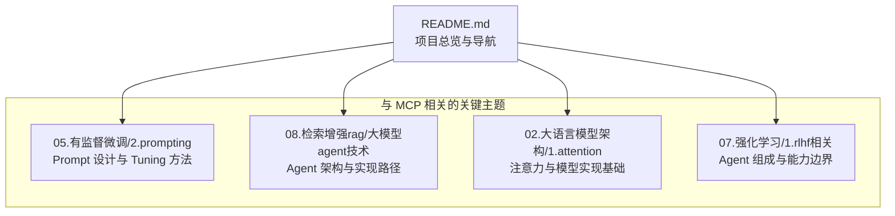
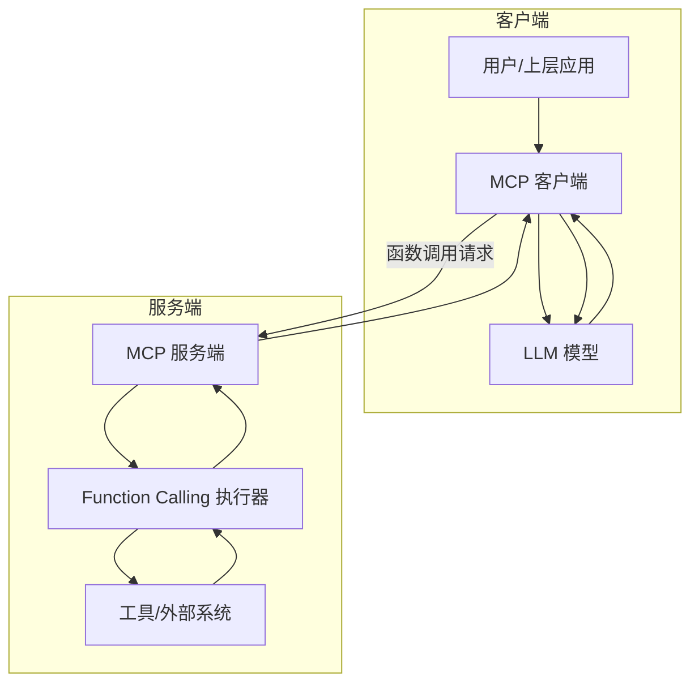
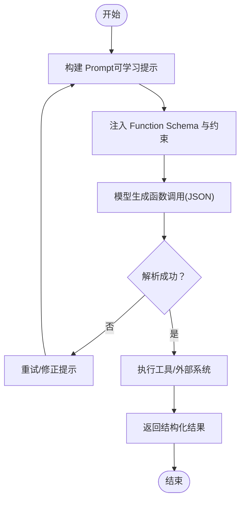
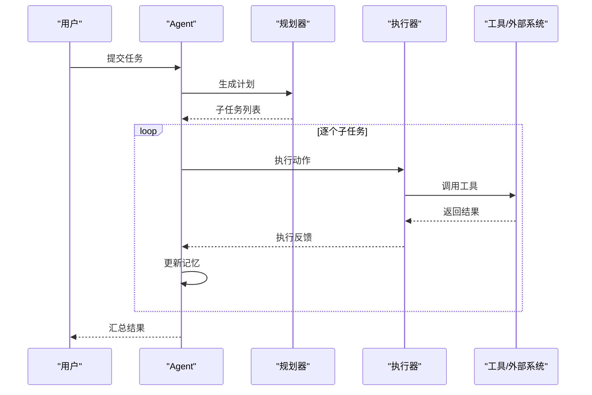
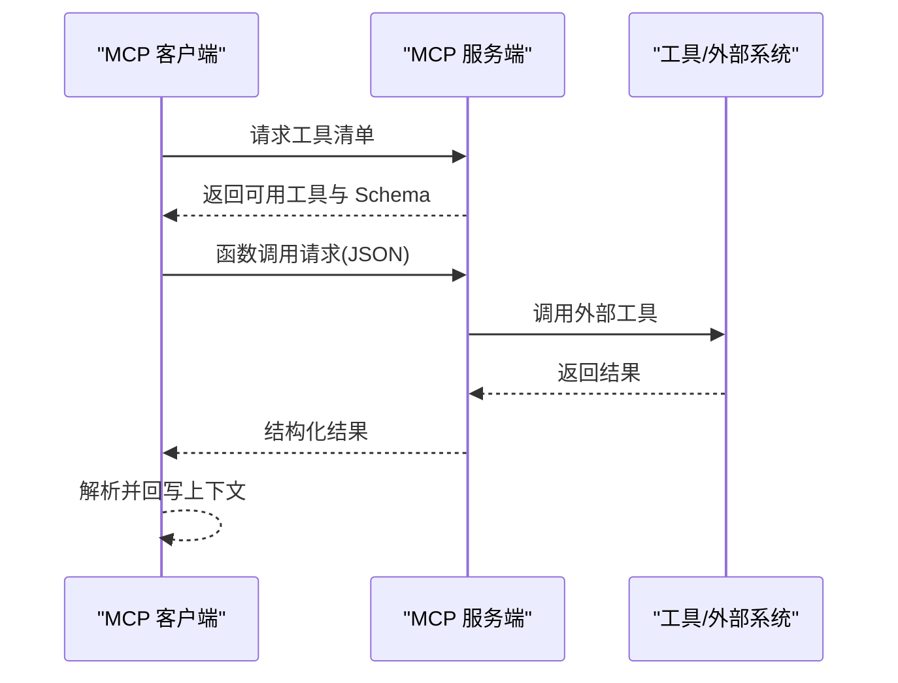
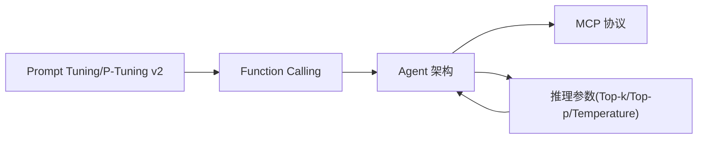

# tiny-mcp 项目

<cite>
**本文引用的文件**   
- [README.md](file://README.md)
- [大模型agent技术.md](file://08.检索增强rag/大模型agent技术/大模型agent技术.md)
- [2.prompting.md](file://05.有监督微调/2.prompting/2.prompting.md)
- [1.attention.md](file://02.大语言模型架构/1.attention/1.attention.md)
- [1.rlhf相关.md](file://07.强化学习/1.rlhf相关/1.rlhf相关.md)
</cite>

## 目录
1. [简介](#简介)
2. [项目结构](#项目结构)
3. [核心组件](#核心组件)
4. [架构总览](#架构总览)
5. [详细组件分析](#详细组件分析)
6. [依赖分析](#依赖分析)
7. [性能考量](#性能考量)
8. [故障排查指南](#故障排查指南)
9. [结论](#结论)
10. [附录](#附录)

## 简介
本项目为“tiny-mcp”，目标是使用 Prompt 与 Function Calling 实现 MCP（模型上下文协议）的服务端与客户端，帮助读者快速基于 MCP 搭建智能体（Agent）应用。仓库中提供了 MCP 协议的背景、Prompt 设计方法、Function Calling 的实现思路，以及 Agent 项目的搭建路径，适合希望在低资源环境下落地智能体应用的读者。

- 项目定位与目标：通过 Prompt 与 Function Calling，快速实现 MCP 服务端与客户端，支撑智能体应用的开发与部署。
- 适用场景：需要将外部工具与模型能力结合、以函数调用方式扩展模型能力的 Agent 场景；强调“低资源、可实践”。

章节来源
- [README.md:13](file://README.md#L13)

## 项目结构
仓库为知识整理与实践项目集合，tiny-mcp 作为其中一项动手实践项目，与其他模块（如 Prompt 工程、Agent 技术、推理参数等）共同构成完整的知识体系。下图给出与本项目相关的主要模块关系：

图表来源
- [README.md:10-14](file://README.md#L10-L14)
- [2.prompting.md:1-173](file://05.有监督微调/2.prompting/2.prompting.md#L1-L173)
- [大模型agent技术.md:1-483](file://08.检索增强rag/大模型agent技术/大模型agent技术.md#L1-L483)
- [1.attention.md:250-449](file://02.大语言模型架构/1.attention/1.attention.md#L250-L449)
- [1.rlhf相关.md:137-150](file://07.强化学习/1.rlhf相关/1.rlhf相关.md#L137-L150)

章节来源
- [README.md:10-14](file://README.md#L10-L14)

## 核心组件
围绕 MCP 的服务端与客户端实现，建议从以下核心组件入手理解与落地：

- Prompt 设计与调优
  - 通过 Prefix Tuning、Prompt Tuning、P-Tuning v2 等方法，将提示作为可学习的连续向量，降低人工设计成本，提升任务适配效率。
  - 与 Function Calling 结合，将“如何调用工具”的指令显式化为可训练的提示，提升模型在工具选择与调用上的稳定性。

- Function Calling 与工具集成
  - 将外部 API、数据库、搜索引擎等工具以函数形式暴露给模型，模型输出 JSON 格式的函数调用签名，由客户端执行并回传结果。
  - 与 Prompt 结合，确保函数调用的上下文与约束清晰，减少歧义与错误调用。

- Agent 项目搭建
  - 以“LLM + Prompt Recipe + Tools + Interface + Knowledge + Memory”为骨架，明确角色职责与交互协议。
  - 通过 MCP 服务端统一暴露工具与能力，客户端以标准化协议进行调用，实现多 Agent 协作与任务编排。

章节来源
- [2.prompting.md:36-173](file://05.有监督微调/2.prompting/2.prompting.md#L36-L173)
- [大模型agent技术.md:118-121](file://08.检索增强rag/大模型agent技术/大模型agent技术.md#L118-L121)
- [1.rlhf相关.md:137-150](file://07.强化学习/1.rlhf相关/1.rlhf相关.md#L137-L150)

## 架构总览
下图展示 MCP 服务端与客户端的整体交互：客户端通过 MCP 协议向服务端发起工具调用请求，服务端根据 Prompt 与 Function Schema 进行解析与执行，返回结构化结果给客户端，客户端再将结果反馈给模型，形成“思考-行动-观察-反思”的循环。

图表来源
- [大模型agent技术.md:118-121](file://08.检索增强rag/大模型agent技术/大模型agent技术.md#L118-L121)
- [README.md:13](file://README.md#L13)

## 详细组件分析

### 组件一：Prompt 设计与 Function Calling 的协同
- 目标：通过可学习的提示（Prompt Tuning/P-Tuning v2）与 Function Calling 的 JSON Schema，使模型在不同任务中稳定地选择与调用工具。
- 关键点：
  - 将“如何调用工具”的规则显式化为提示的一部分，减少模型在工具选择上的不确定性。
  - 使用连续提示（Prefix Tuning/P-Tuning v2）替代手工模板，提升对不同任务的泛化能力。
  - 在 Function Calling 中，明确函数签名、参数约束与错误处理策略，确保客户端可稳定解析与执行。

图表来源
- [2.prompting.md:75-173](file://05.有监督微调/2.prompting/2.prompting.md#L75-L173)
- [大模型agent技术.md:118-121](file://08.检索增强rag/大模型agent技术/大模型agent技术.md#L118-L121)

章节来源
- [2.prompting.md:75-173](file://05.有监督微调/2.prompting/2.prompting.md#L75-L173)
- [大模型agent技术.md:118-121](file://08.检索增强rag/大模型agent技术/大模型agent技术.md#L118-L121)

### 组件二：Agent 项目搭建流程
- 角色与职责
  - Planner：负责任务分解与计划制定。
  - Executor：负责执行具体动作（如函数调用、外部系统交互）。
  - Critic：对执行结果进行评估与反馈。
  - Memory：提供短期与长期记忆，支撑多步任务一致性。
- 流程
  - 输入任务描述 → Prompt 规划 → 生成子任务 → 逐个执行并回写记忆 → 评估与汇总。

图表来源
- [大模型agent技术.md:128-176](file://08.检索增强rag/大模型agent技术/大模型agent技术.md#L128-L176)
- [1.rlhf相关.md:137-150](file://07.强化学习/1.rlhf相关/1.rlhf相关.md#L137-L150)

章节来源
- [大模型agent技术.md:128-176](file://08.检索增强rag/大模型agent技术/大模型agent技术.md#L128-L176)
- [1.rlhf相关.md:137-150](file://07.强化学习/1.rlhf相关/1.rlhf相关.md#L137-L150)

### 组件三：MCP 协议与工具暴露
- MCP 服务端职责
  - 统一暴露工具与能力，提供标准化的函数调用接口。
  - 结合 Prompt 与 Schema，确保调用的上下文与约束清晰。
- MCP 客户端职责
  - 将模型输出的函数调用解析为标准请求，发送至服务端。
  - 处理错误与重试，回传结果给模型，形成闭环。

图表来源
- [README.md:13](file://README.md#L13)
- [大模型agent技术.md:118-121](file://08.检索增强rag/大模型agent技术/大模型agent技术.md#L118-L121)

章节来源
- [README.md:13](file://README.md#L13)
- [大模型agent技术.md:118-121](file://08.检索增强rag/大模型agent技术/大模型agent技术.md#L118-L121)

## 依赖分析
- 模块耦合
  - Prompt 设计模块与 Function Calling 模块强耦合：提示的可学习性直接影响模型对工具调用的稳定性。
  - Agent 模块与 MCP 服务端/客户端弱耦合：通过标准化协议进行交互，便于替换与扩展。
- 外部依赖
  - 大模型推理参数（如 top-k、top-p、temperature 等）影响模型输出的多样性与稳定性，需与 Function Calling 的约束配合使用。
  - 注意力机制与模型实现基础（如注意力计算复杂度）影响推理性能，需结合批处理与缓存策略优化。

图表来源
- [2.prompting.md:75-173](file://05.有监督微调/2.prompting/2.prompting.md#L75-L173)
- [1.attention.md:374-406](file://02.大语言模型架构/1.attention/1.attention.md#L374-L406)

章节来源
- [2.prompting.md:75-173](file://05.有监督微调/2.prompting/2.prompting.md#L75-L173)
- [1.attention.md:374-406](file://02.大语言模型架构/1.attention/1.attention.md#L374-L406)

## 性能考量
- 推理参数调优
  - top-k/top-p 控制采样多样性，temperature 影响输出锐利度；在 Function Calling 场景中，适当降低 temperature 与 top-p 可提升调用稳定性。
- 注意力与计算复杂度
  - 注意力计算复杂度与序列长度呈平方关系，需结合动态批处理与 KV 缓存策略，减少重复计算。
- 批处理与缓存
  - 对于工具调用密集的场景，建议采用批处理与结果缓存，降低外部系统调用频率与延迟。

章节来源
- [1.attention.md:374-406](file://02.大语言模型架构/1.attention/1.attention.md#L374-L406)

## 故障排查指南
- Function Calling 解析失败
  - 检查 Prompt 是否明确函数签名与参数约束；确认 Schema 与工具实现一致。
  - 若模型输出非标准 JSON，回退到重试/修正提示流程，确保输出可解析。
- 工具调用错误
  - 校验工具可用性与权限；对异常进行捕获与重试；记录调用上下文以便复盘。
- Agent 协作问题
  - 明确角色边界与通信协议；对记忆与状态进行一致性校验；必要时引入 Critic 进行反馈与纠偏。

章节来源
- [大模型agent技术.md:118-121](file://08.检索增强rag/大模型agent技术/大模型agent技术.md#L118-L121)

## 结论
tiny-mcp 项目通过 Prompt 与 Function Calling 的协同，为 MCP 服务端与客户端的实现提供了清晰路径。结合 Prompt Tuning、Agent 架构与 MCP 协议，可在低资源环境下快速搭建稳定的智能体应用。建议在实践中重点关注提示的可学习性、工具调用的稳定性与 Agent 的协作与反馈机制。

## 附录
- 相关模块与文件
  - Prompt 设计与 Tuning：[2.prompting.md](file://05.有监督微调/2.prompting/2.prompting.md)
  - Agent 技术与架构：[大模型agent技术.md](file://08.检索增强rag/大模型agent技术/大模型agent技术.md)
  - 注意力与模型实现基础：[1.attention.md](file://02.大语言模型架构/1.attention/1.attention.md)
  - Agent 组成与能力边界：[1.rlhf相关.md](file://07.强化学习/1.rlhf相关/1.rlhf相关.md)