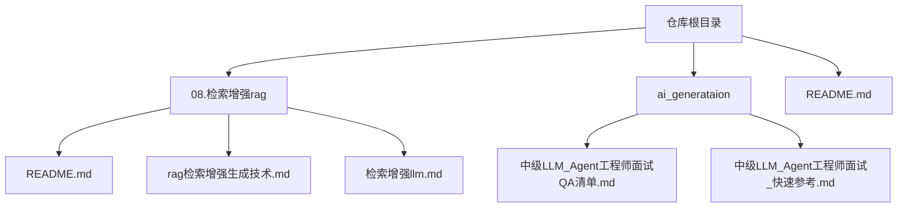
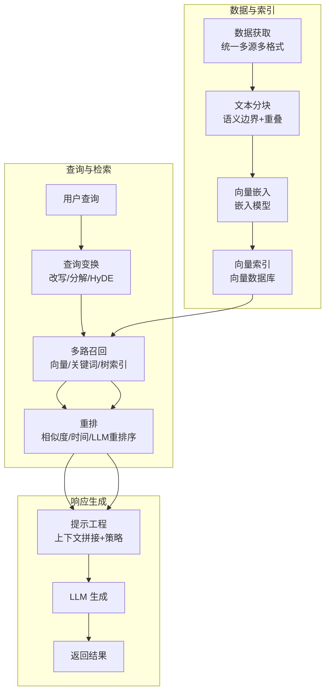
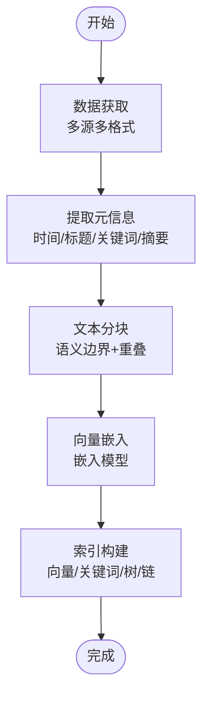
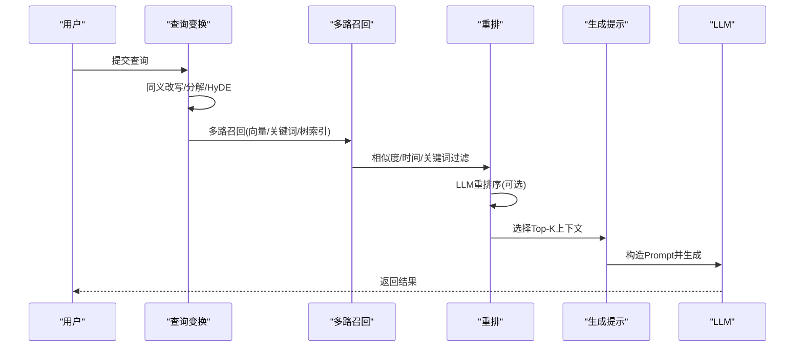
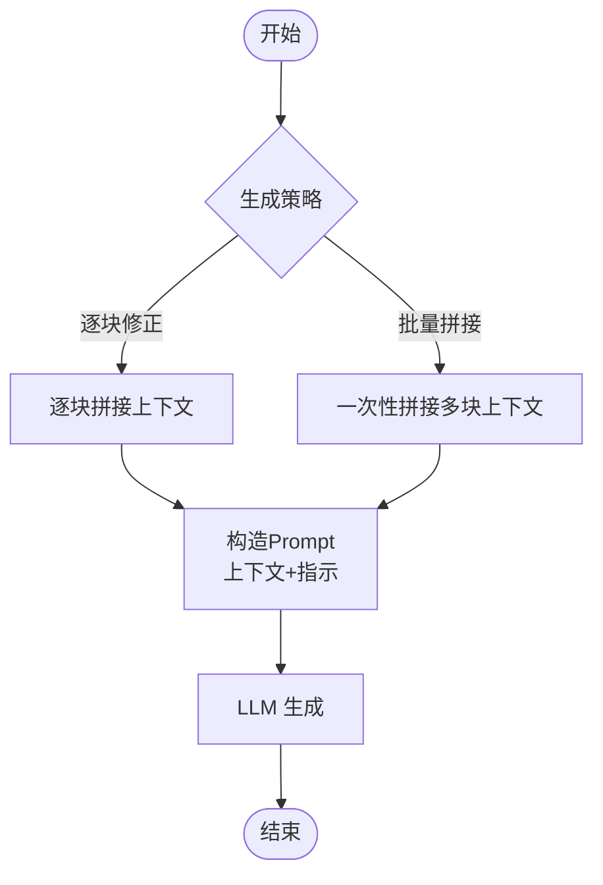
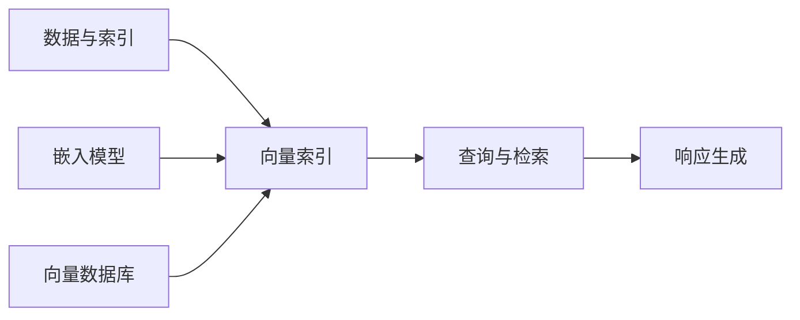

# tiny-rag 项目

<cite>
**本文引用的文件列表**
- [README.md](file://README.md)
- [检索增强llm.md](file://08.检索增强rag/检索增强llm/检索增强llm.md)
- [rag（检索增强生成）技术.md](file://08.检索增强rag/rag（检索增强生成）技术/rag（检索增强生成）技术.md)
- [README.md](file://08.检索增强rag/README.md)
- [中级LLM_Agent工程师面试QA清单.md](file://ai_generataion/中级LLM_Agent工程师面试QA清单.md)
- [中级LLM_Agent工程师面试_快速参考.md](file://ai_generataion/中级LLM_Agent工程师面试_快速参考.md)
</cite>

## 目录
1. [简介](#简介)
2. [项目结构](#项目结构)
3. [核心组件](#核心组件)
4. [架构总览](#架构总览)
5. [组件详解](#组件详解)
6. [依赖关系分析](#依赖关系分析)
7. [性能与优化](#性能与优化)
8. [故障排查](#故障排查)
9. [结论](#结论)
10. [附录](#附录)

## 简介
本文件面向“tiny-rag”项目，提供一份系统化、可操作的实践文档。tiny-rag 是一个“简单”的 RAG（检索增强生成）系统实现，强调在低资源条件下快速理解与落地检索增强生成的关键流程，包括多路召回、重排等能力。本文将从技术原理、系统架构、关键模块、数据与索引、检索与重排、生成提示工程、部署与运维等方面进行深入讲解，并辅以可视化图示与参考路径，帮助读者快速掌握 RAG 的核心要点与工程实践。

## 项目结构
仓库以主题模块组织，RAG 相关内容集中在“08.检索增强rag”目录下，配套的面试与知识参考位于“ai_generataion”目录。README 中明确指出 tiny-rag 的定位：实现一个简单的 RAG 系统，支持多路召回、重排等功能，帮助快速了解检索相关内容。

图表来源
- [README.md:1-169](file://README.md#L1-L169)
- [README.md:1-14](file://08.检索增强rag/README.md#L1-L14)
- [rag（检索增强生成）技术.md:1-73](file://08.检索增强rag/rag（检索增强生成）技术/rag（检索增强生成）技术.md#L1-L73)
- [检索增强llm.md:1-526](file://08.检索增强rag/检索增强llm/检索增强llm.md#L1-L526)

章节来源
- [README.md:1-169](file://README.md#L1-L169)
- [README.md:1-14](file://08.检索增强rag/README.md#L1-L14)

## 核心组件
tiny-rag 的核心围绕“数据与索引模块”、“查询与检索模块”、“响应生成模块”展开，三者协同完成“检索增强生成”的闭环。

- 数据与索引模块
  - 数据获取：统一多来源、多格式外部数据为文档对象，携带元信息（时间、标题、关键词、摘要等）。
  - 文本分块：基于语义边界与重叠窗口的分块策略，平衡上下文长度与相关性。
  - 索引构建：向量索引（嵌入模型 + 向量数据库）、关键词索引、树索引、链式索引等。
- 查询与检索模块
  - 查询变换：同义改写、查询分解、HyDE（假设文档嵌入）等。
  - 排序与后处理：相似度过滤、关键词过滤、时间过滤、LLM 重排序等。
- 响应生成模块
  - 生成策略：逐块修正、批量拼接上下文、Prompt 模板等。
  - 提示工程：明确指示 LLM 结合检索上下文与自身知识，控制“不可知时”的回答策略。

章节来源
- [检索增强llm.md:81-87](file://08.检索增强rag/检索增强llm/检索增强llm.md#L81-L87)
- [检索增强llm.md:91-118](file://08.检索增强rag/检索增强llm/检索增强llm.md#L91-L118)
- [检索增强llm.md:122-179](file://08.检索增强rag/检索增强llm/检索增强llm.md#L122-L179)
- [检索增强llm.md:181-220](file://08.检索增强rag/检索增强llm/检索增强llm.md#L181-L220)
- [检索增强llm.md:223-239](file://08.检索增强rag/检索增强llm/检索增强llm.md#L223-L239)
- [检索增强llm.md:241-286](file://08.检索增强rag/检索增强llm/检索增强llm.md#L241-L286)
- [检索增强llm.md:332-375](file://08.检索增强rag/检索增强llm/检索增强llm.md#L332-L375)
- [检索增强llm.md:376-412](file://08.检索增强rag/检索增强llm/检索增强llm.md#L376-L412)

## 架构总览
下图展示 tiny-rag 的端到端工作流：数据入库 → 文本分块 → 向量嵌入 → 索引构建 → 查询变换 → 多路召回 → 重排 → 生成提示 → LLM 生成 → 结果返回。

图表来源
- [检索增强llm.md:81-87](file://08.检索增强rag/检索增强llm/检索增强llm.md#L81-L87)
- [检索增强llm.md:223-286](file://08.检索增强rag/检索增强llm/检索增强llm.md#L223-L286)
- [检索增强llm.md:332-375](file://08.检索增强rag/检索增强llm/检索增强llm.md#L332-L375)
- [检索增强llm.md:376-412](file://08.检索增强rag/检索增强llm/检索增强llm.md#L376-L412)

## 组件详解

### 数据与索引模块
- 数据获取
  - 多来源：Doc、Sheet、Slides、Calendar、Drive、Slack、Discord、GitHub/GitLab、Confluence、Web、API、本地文件等。
  - 多格式：txt、csv、pdf、markdown、json 等。
  - 元信息：时间、标题、关键词、实体、类别、摘要等，用于检索与过滤。
- 文本分块
  - 分割符策略：句号、换行、空格，或递归按段落/层级结构切分。
  - 块大小与重叠：按字符或 token 统计，兼顾上下文长度与语义连贯。
  - 结构化文本：代码、Markdown、LaTeX 等需特殊处理以保持完整性。
- 索引构建
  - 向量索引：嵌入模型 + 向量数据库（如 FAISS、Pinecone、Milvus、Weaviate 等）。
  - 传统索引：关键词表、树索引、链式索引，适配不同检索需求与性能目标。

图表来源
- [检索增强llm.md:91-118](file://08.检索增强rag/检索增强llm/检索增强llm.md#L91-L118)
- [检索增强llm.md:122-179](file://08.检索增强rag/检索增强llm/检索增强llm.md#L122-L179)
- [检索增强llm.md:181-220](file://08.检索增强rag/检索增强llm/检索增强llm.md#L181-L220)
- [检索增强llm.md:223-239](file://08.检索增强rag/检索增强llm/检索增强llm.md#L223-L239)
- [检索增强llm.md:241-286](file://08.检索增强rag/检索增强llm/检索增强llm.md#L241-L286)

章节来源
- [检索增强llm.md:89-118](file://08.检索增强rag/检索增强llm/检索增强llm.md#L89-L118)
- [检索增强llm.md:122-179](file://08.检索增强rag/检索增强llm/检索增强llm.md#L122-L179)
- [检索增强llm.md:181-220](file://08.检索增强rag/检索增强llm/检索增强llm.md#L181-L220)
- [检索增强llm.md:223-239](file://08.检索增强rag/检索增强llm/检索增强llm.md#L223-L239)
- [检索增强llm.md:241-286](file://08.检索增强rag/检索增强llm/检索增强llm.md#L241-L286)

### 查询与检索模块
- 查询变换
  - 同义改写：通过 LLM 生成多种语义等价表达，扩大召回集合。
  - 查询分解：单步/多步分解，将复杂问题拆分为子查询，逐步生成答案。
  - HyDE：先生成假设文档，再以假设文档作为查询进行检索，提升相关性。
- 排序与后处理
  - 相似度过滤与排序：基于余弦相似度、时间、关键词等。
  - LLM 重排序：利用交叉编码器或 LLM 对候选进行二次排序。
  - 多路召回融合：向量、关键词、树索引等多路结果融合，提升覆盖率与准确性。

图表来源
- [检索增强llm.md:332-375](file://08.检索增强rag/检索增强llm/检索增强llm.md#L332-L375)
- [检索增强llm.md:366-375](file://08.检索增强rag/检索增强llm/检索增强llm.md#L366-L375)

章节来源
- [检索增强llm.md:332-375](file://08.检索增强rag/检索增强llm/检索增强llm.md#L332-L375)

### 响应生成模块
- 生成策略
  - 逐块修正：每次结合一块上下文，逐步修正答案，多次 LLM 调用。
  - 批量拼接：将多块上下文一次性放入 Prompt，减少调用次数。
- 提示工程
  - 明确指示 LLM 结合检索上下文与自身知识，控制“不可知时”的回答策略。
  - 使用分隔符区分上下文，避免混淆。

图表来源
- [检索增强llm.md:376-412](file://08.检索增强rag/检索增强llm/检索增强llm.md#L376-L412)

章节来源
- [检索增强llm.md:376-412](file://08.检索增强rag/检索增强llm/检索增强llm.md#L376-L412)

## 依赖关系分析
- 模块内聚与耦合
  - 数据与索引模块与检索模块存在强耦合：索引质量直接影响检索效果。
  - 检索模块与生成模块存在弱耦合：通过上下文拼接与 Prompt 控制。
- 外部依赖
  - 向量数据库：Pinecone、Milvus、Weaviate、Chroma 等。
  - 嵌入模型：Sentence Transformers、text-embedding-ada-002、BGE、Instructor 等。
  - 检索库：FAISS（CPU/GPU）、HNSW、Product Quantization 等。
- 可能的循环依赖
  - 通过清晰的接口（如“查询向量 -> 检索结果 -> 上下文”）避免循环依赖。

图表来源
- [检索增强llm.md:223-286](file://08.检索增强rag/检索增强llm/检索增强llm.md#L223-L286)

章节来源
- [检索增强llm.md:223-286](file://08.检索增强rag/检索增强llm/检索增强llm.md#L223-L286)

## 性能与优化
- 检索性能
  - 向量相似度：优先使用余弦相似度；大规模场景采用 FAISS、HNSW、PQ 等索引。
  - 多路召回：向量 + 关键词 + 树索引组合，提升召回覆盖率与准确性。
  - 重排：交叉编码器或 LLM 重排序，显著提升排序质量。
- 生成性能
  - 动态批处理、KV Cache 管理、异步 I/O 等推理优化策略。
  - Prompt 设计与上下文长度控制，避免超出上下文窗口导致的性能退化。
- 资源与成本
  - 低资源场景下，优先使用轻量嵌入模型与小规模向量库；按需扩展。
  - 通过缓存热点查询与结果、增量索引更新等方式降低成本。

章节来源
- [检索增强llm.md:241-286](file://08.检索增强rag/检索增强llm/检索增强llm.md#L241-L286)
- [检索增强llm.md:332-375](file://08.检索增强rag/检索增强llm/检索增强llm.md#L332-L375)
- [中级LLM_Agent工程师面试QA清单.md:55-87](file://ai_generataion/中级LLM_Agent工程师面试QA清单.md#L55-L87)

## 故障排查
- 常见问题
  - 检索相关性不足：检查分块策略、嵌入模型、索引类型与相似度度量。
  - 上下文过长：缩短分块或减少上下文拼接数量，控制 Prompt 长度。
  - 幻觉问题：启用重排、严格过滤、明确“不可知时”的回答策略。
  - 性能瓶颈：优化向量索引、引入缓存、异步批处理与 KV Cache 管理。
- 参考实践
  - 使用 HyDE、查询分解、多向量检索、LLM 重排序等策略提升检索质量。
  - 结合时间过滤、关键词过滤与 LLM 重排序，平衡准确率与延迟。

章节来源
- [检索增强llm.md:332-375](file://08.检索增强rag/检索增强llm/检索增强llm.md#L332-L375)
- [检索增强llm.md:366-375](file://08.检索增强rag/检索增强llm/检索增强llm.md#L366-L375)
- [中级LLM_Agent工程师面试QA清单.md:114-130](file://ai_generataion/中级LLM_Agent工程师面试QA清单.md#L114-L130)

## 结论
tiny-rag 以“简单”为目标，聚焦 RAG 的关键闭环：数据与索引、查询与检索、响应生成。通过合理的分块策略、多路召回与重排、提示工程与 LLM 生成，能够在低资源条件下快速落地检索增强生成。建议在实际部署中结合业务场景选择合适的嵌入模型与向量数据库，持续优化检索与生成策略，以获得更优的准确率与性能。

## 附录
- 术语
  - RAG：检索增强生成
  - 嵌入模型：将文本映射为稠密向量的模型
  - 向量数据库：存储与检索向量的数据库
  - 重排：对初步检索结果进行二次排序
- 参考资料
  - RAG 技术综述与案例
  - 向量数据库与索引实现
  - 推理优化与系统设计

章节来源
- [rag（检索增强生成）技术.md:1-73](file://08.检索增强rag/rag（检索增强生成）技术/rag（检索增强生成）技术.md#L1-L73)
- [检索增强llm.md:1-526](file://08.检索增强rag/检索增强llm/检索增强llm.md#L1-L526)