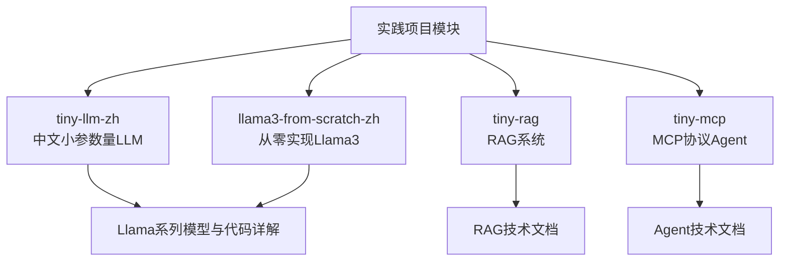
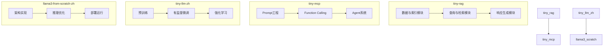
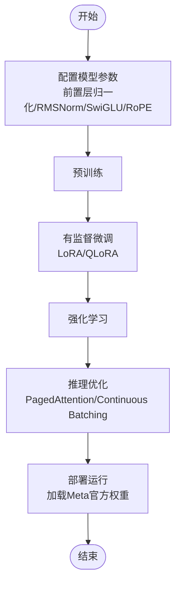
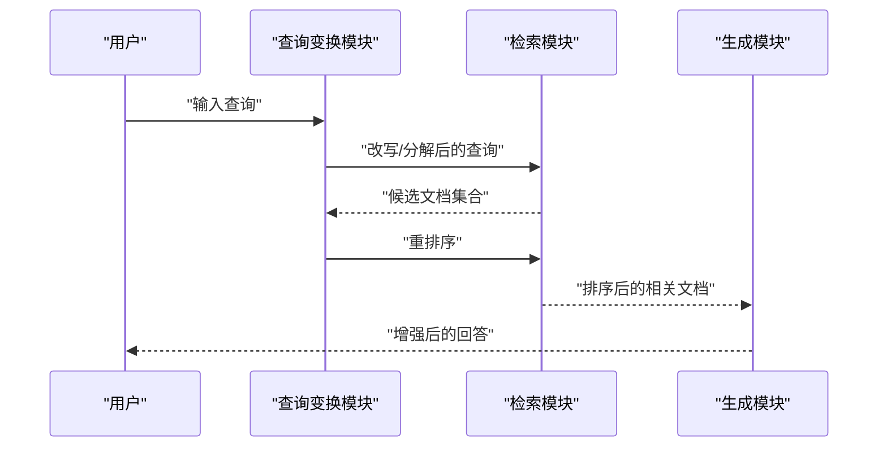
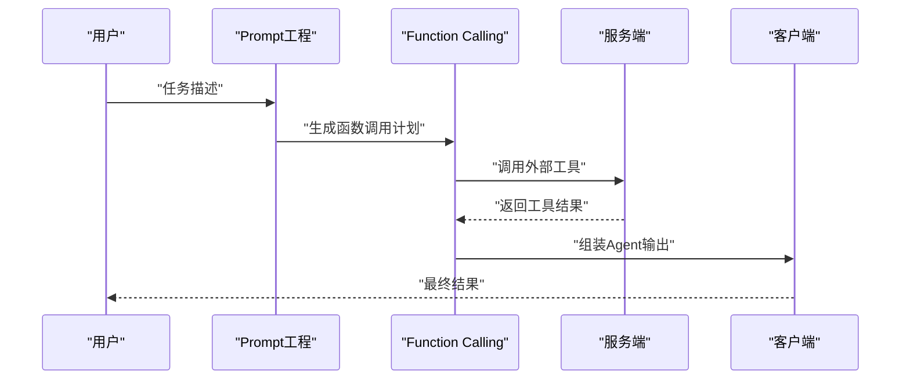
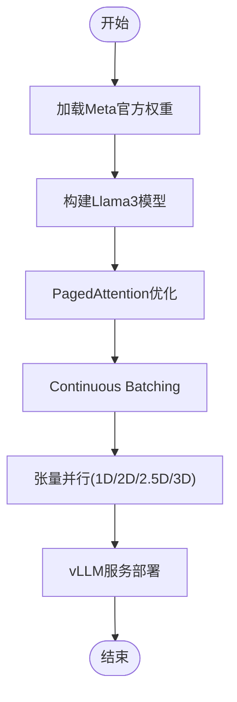
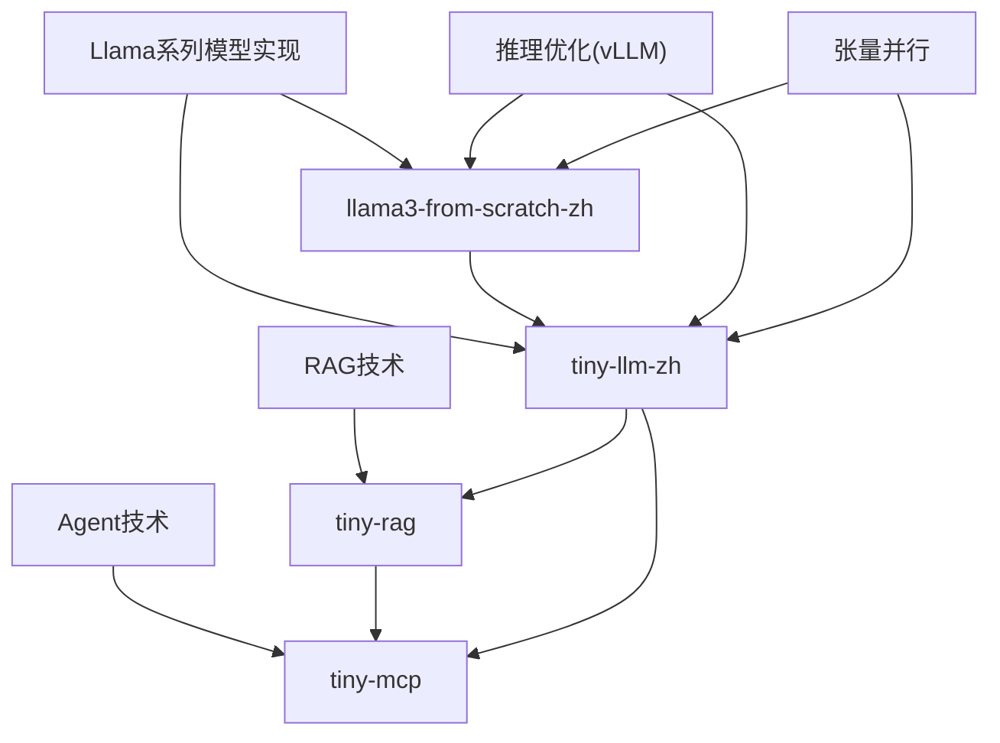

# 实践项目

<cite>
**本文引用的文件**
- [README.md](file://README.md)
- [_navbar.md](file://_navbar.md)
- [08.检索增强rag/README.md](file://08.检索增强rag/README.md)
- [08.检索增强rag/rag（检索增强生成）技术/rag（检索增强生成）技术.md](file://08.检索增强rag/rag（检索增强生成）技术/rag（检索增强生成）技术.md)
- [08.检索增强rag/大模型agent技术/大模型agent技术.md](file://08.检索增强rag/大模型agent技术/大模型agent技术.md)
- [02.大语言模型架构/llama系列模型/llama系列模型.md](file://02.大语言模型架构/llama系列模型/llama系列模型.md)
- [02.大语言模型架构/llama 2代码详解/llama 2代码详解.md](file://02.大语言模型架构/llama 2代码详解/llama 2代码详解.md)
- [06.推理/1.vllm/1.vllm.md](file://06.推理/1.vllm/1.vllm.md)
- [05.有监督微调/4.lora/4.lora.md](file://05.有监督微调/4.lora/4.lora.md)
- [04.分布式训练/4.张量并行/4.张量并行.md](file://04.分布式训练/4.张量并行/4.张量并行.md)
- [ai_generataion/中级LLM_Agent工程师面试QA清单.md](file://ai_generataion/中级LLM_Agent工程师面试QA清单.md)
- [ai_generataion/中级LLM_Agent工程师面试_快速参考.md](file://ai_generataion/中级LLM_Agent工程师面试_快速参考.md)
</cite>

## 目录
1. [简介](#简介)
2. [项目结构](#项目结构)
3. [核心组件](#核心组件)
4. [架构总览](#架构总览)
5. [详细组件分析](#详细组件分析)
6. [依赖关系分析](#依赖关系分析)
7. [性能考量](#性能考量)
8. [故障排查指南](#故障排查指南)
9. [结论](#结论)
10. [附录](#附录)

## 简介
本章节概述实践项目模块的目标与定位，聚焦于四个代表性项目：tiny-llm-zh、tiny-rag、tiny-mcp、llama3-from-scratch-zh。这些项目围绕“低资源、可动手、可落地”的原则设计，帮助读者从零实现中文小参数量大模型、构建RAG系统、使用MCP协议搭建Agent、以及从零实现Llama3（可加载Meta官方权重并在本地笔记本调试运行）。文档将系统阐述每个项目的架构设计、关键技术实现、部署方案与运行指南，并配套面试题库与快速参考材料，助力读者通过实践深入掌握大模型相关技术。

- tiny-llm-zh：从零实现中文小参数量大语言模型，涵盖预训练、微调、RL等关键环节，已在平台部署，便于体验与学习。
- tiny-rag：实现简易RAG系统，支持多路召回、重排等，帮助快速理解检索增强生成的工作原理与工程化要点。
- tiny-mcp：使用Prompt与Function Calling实现MCP（模型上下文协议）服务端与客户端，快速搭建Agent项目。
- llama3-from-scratch-zh：从零实现Llama3，兼容Meta官方权重，可在本地笔记本（16G内存）调试运行，适合深入理解架构细节与工程落地。

**章节来源**
- [README.md:1-32](file://README.md#L1-L32)
- [_navbar.md:1-5](file://_navbar.md#L1-L5)

## 项目结构
实践项目模块位于知识库的顶层导航中，与“大语言模型基础、架构、训练数据集、分布式训练、有监督微调、推理、强化学习、检索增强RAG、模型评估、应用”等主题并列。其中，RAG与Agent相关内容集中在“08.检索增强rag”目录下，涵盖RAG技术与Agent技术两大主题。

- RAG主题：包含“检索增强llm”“rag（检索增强生成）技术”等文档，系统讲解RAG的动机、关键模块、调用模式与对比分析。
- Agent主题：包含“大模型agent技术”，系统梳理从Prompt工程到Agent、多Agent、面向目标架构等演进路径与关键技术。

**图表来源**
- [README.md:10-14](file://README.md#L10-L14)
- [08.检索增强rag/README.md:1-14](file://08.检索增强rag/README.md#L1-L14)

**章节来源**
- [README.md:10-14](file://README.md#L10-L14)
- [08.检索增强rag/README.md:1-14](file://08.检索增强rag/README.md#L1-L14)

## 核心组件
本节从“目标—实现—应用”三个维度，对四个实践项目进行概览式剖析，并给出关键实现线索与参考路径，便于读者快速定位到相应技术细节与代码示例。

- tiny-llm-zh
  - 目标：构建小参数量中文大语言模型，掌握预训练、微调、RL等全流程。
  - 实现：参考Llama系列模型的架构与实现细节，结合中文语料与工程化优化。
  - 应用：平台已部署，支持在线体验，便于教学与演示。
  - 参考路径：[02.大语言模型架构/llama系列模型/llama系列模型.md](file://02.大语言模型架构/llama系列模型/llama系列模型.md)、[02.大语言模型架构/llama 2代码详解/llama 2代码详解.md](file://02.大语言模型架构/llama 2代码详解/llama 2代码详解.md)

- tiny-rag
  - 目标：实现简易RAG系统，支持多路召回、重排等，理解检索增强生成。
  - 实现：数据与索引模块、查询与检索模块、响应生成模块三部分协同。
  - 应用：适用于知识库问答、私有数据检索增强、长尾知识与数据新鲜度场景。
  - 参考路径：[08.检索增强rag/rag（检索增强生成）技术/rag（检索增强生成）技术.md](file://08.检索增强rag/rag（检索增强生成）技术/rag（检索增强生成）技术.md)

- tiny-mcp
  - 目标：使用Prompt与Function Calling实现MCP（模型上下文协议）服务端与客户端，快速搭建Agent。
  - 实现：Prompt工程、Function Calling、Agent编排与工具调用。
  - 应用：构建可扩展的Agent系统，支持多Agent协作与任务分解。
  - 参考路径：[08.检索增强rag/大模型agent技术/大模型agent技术.md](file://08.检索增强rag/大模型agent技术/大模型agent技术.md)

- llama3-from-scratch-zh
  - 目标：从零实现Llama3，兼容Meta官方权重，本地笔记本可调试运行。
  - 实现：参考Llama系列模型的架构细节与实现，结合张量并行、推理优化等技术。
  - 应用：深入理解Transformer解码器、注意力机制、KV Cache与PagedAttention等。
  - 参考路径：[02.大语言模型架构/llama系列模型/llama系列模型.md](file://02.大语言模型架构/llama系列模型/llama系列模型.md)、[06.推理/1.vllm/1.vllm.md](file://06.推理/1.vllm/1.vllm.md)、[04.分布式训练/4.张量并行/4.张量并行.md](file://04.分布式训练/4.张量并行/4.张量并行.md)

**章节来源**
- [README.md:8-14](file://README.md#L8-L14)
- [08.检索增强rag/rag（检索增强生成）技术/rag（检索增强生成）技术.md:1-73](file://08.检索增强rag/rag（检索增强生成）技术/rag（检索增强生成）技术.md#L1-L73)
- [08.检索增强rag/大模型agent技术/大模型agent技术.md:1-483](file://08.检索增强rag/大模型agent技术/大模型agent技术.md#L1-L483)
- [02.大语言模型架构/llama系列模型/llama系列模型.md:1-377](file://02.大语言模型架构/llama系列模型/llama系列模型.md#L1-L377)
- [06.推理/1.vllm/1.vllm.md:1-220](file://06.推理/1.vllm/1.vllm.md#L1-L220)
- [04.分布式训练/4.张量并行/4.张量并行.md:1-441](file://04.分布式训练/4.张量并并行/4.张量并行.md#L1-L441)

## 架构总览
本节以系统化视角展示四个实践项目的整体架构与关键交互关系，突出“数据—检索—生成—推理—部署”的闭环。

**图表来源**
- [08.检索增强rag/rag（检索增强生成）技术/rag（检索增强生成）技术.md:39-73](file://08.检索增强rag/rag（检索增强生成）技术/rag（检索增强生成）技术.md#L39-L73)
- [08.检索增强rag/大模型agent技术/大模型agent技术.md:122-176](file://08.检索增强rag/大模型agent技术/大模型agent技术.md#L122-L176)
- [02.大语言模型架构/llama系列模型/llama系列模型.md:362-377](file://02.大语言模型架构/llama系列模型/llama系列模型.md#L362-L377)

## 详细组件分析

### tiny-llm-zh：中文小参数量大语言模型
- 目标与场景
  - 构建小参数量中文LLM，覆盖预训练、微调、RL等关键环节，适合低资源学习与快速迭代。
  - 已部署上线，支持在线体验，便于教学与演示。
- 架构设计
  - 参考Llama系列模型的Transformer架构，采用前置层归一化、RMSNorm、SwiGLU激活、旋转位置嵌入（RoPE）等关键设计。
  - 通过合理的维度设计（如hidden_dim=4096）平衡参数量与计算效率。
- 关键技术实现
  - 前置层归一化与RMSNorm：提升训练稳定性与收敛速度。
  - SwiGLU激活：在FFN中替代ReLU，提升表达能力。
  - RoPE位置编码：实现相对位置建模，利于长序列与泛化。
  - 低秩适配（LoRA）：在微调阶段以少量参数实现高效适配，节省显存与计算。
- 部署方案
  - 本地笔记本（16G内存）可运行，结合推理优化框架（如vLLM）实现高效解码。
  - 支持加载Meta官方权重，便于迁移与复现。
- 运行指南（示例路径）
  - 预训练与微调：参考LoRA与QLoRA微调策略，结合分布式训练的张量并行方案。
  - 推理优化：参考vLLM的PagedAttention与Continuous Batching，提升吞吐与内存效率。
- 代码示例与参考
  - Llama系列模型实现细节与配置：[02.大语言模型架构/llama系列模型/llama系列模型.md](file://02.大语言模型架构/llama系列模型/llama系列模型.md)
  - LoRA/QLoRA微调原理与实现要点：[05.有监督微调/4.lora/4.lora.md](file://05.有监督微调/4.lora/4.lora.md)
  - 分布式训练张量并行：[04.分布式训练/4.张量并行/4.张量并行.md](file://04.分布式训练/4.张量并行/4.张量并行.md)
  - 推理优化与部署：[06.推理/1.vllm/1.vllm.md](file://06.推理/1.vllm/1.vllm.md)

**图表来源**
- [02.大语言模型架构/llama系列模型/llama系列模型.md:100-156](file://02.大语言模型架构/llama系列模型/llama系列模型.md#L100-L156)
- [05.有监督微调/4.lora/4.lora.md:9-42](file://05.有监督微调/4.lora/4.lora.md#L9-L42)
- [06.推理/1.vllm/1.vllm.md:55-151](file://06.推理/1.vllm/1.vllm.md#L55-L151)

**章节来源**
- [README.md:8-14](file://README.md#L8-L14)
- [02.大语言模型架构/llama系列模型/llama系列模型.md:100-156](file://02.大语言模型架构/llama系列模型/llama系列模型.md#L100-L156)
- [05.有监督微调/4.lora/4.lora.md:9-42](file://05.有监督微调/4.lora/4.lora.md#L9-L42)
- [06.推理/1.vllm/1.vllm.md:55-151](file://06.推理/1.vllm/1.vllm.md#L55-L151)
- [04.分布式训练/4.张量并行/4.张量并行.md:47-103](file://04.分布式训练/4.张量并行/4.张量并行.md#L47-L103)

### tiny-rag：检索增强生成系统
- 目标与场景
  - 构建简易RAG系统，支持多路召回、重排，理解检索增强生成在长尾知识、私有数据、数据新鲜度与来源可解释性方面的优势。
- 架构设计
  - 数据与索引模块：统一文档对象，携带元信息，便于检索与过滤。
  - 查询与检索模块：查询变换（同义改写、查询分解）、多路召回与重排序。
  - 响应生成模块：将检索到的相关信息作为上下文增强LLM输出。
- 关键技术实现
  - 向量检索与重排序：结合Embedding模型与向量数据库，实现高效检索与排序。
  - 查询改写与分解：通过LLM改写与分解提升召回质量。
  - 多种调用模式：非结构化数据嵌入、长时记忆、缓存命中等。
- 部署方案
  - 向量数据库（如FAISS、Pinecone）与检索引擎结合，支持高并发与低延迟。
  - 与LLM服务集成，实现端到端检索增强生成。
- 运行指南（示例路径）
  - RAG关键模块与调用模式：[08.检索增强rag/rag（检索增强生成）技术/rag（检索增强生成）技术.md](file://08.检索增强rag/rag（检索增强生成）技术/rag（检索增强生成）技术.md)
  - Agent系统设计与任务分解：[08.检索增强rag/大模型agent技术/大模型agent技术.md](file://08.检索增强rag/大模型agent技术/大模型agent技术.md)

**图表来源**
- [08.检索增强rag/rag（检索增强生成）技术/rag（检索增强生成）技术.md:332-354](file://08.检索增强rag/rag（检索增强生成）技术/rag（检索增强生成）技术.md#L332-L354)

**章节来源**
- [08.检索增强rag/rag（检索增强生成）技术/rag（检索增强生成）技术.md:1-73](file://08.检索增强rag/rag（检索增强生成）技术/rag（检索增强生成）技术.md#L1-L73)
- [08.检索增强rag/rag（检索增强生成）技术/rag（检索增强生成）技术.md:332-354](file://08.检索增强rag/rag（检索增强生成）技术/rag（检索增强生成）技术.md#L332-L354)
- [08.检索增强rag/大模型agent技术/大模型agent技术.md:122-176](file://08.检索增强rag/大模型agent技术/大模型agent技术.md#L122-L176)

### tiny-mcp：基于MCP协议的Agent系统
- 目标与场景
  - 使用Prompt与Function Calling实现MCP（模型上下文协议）服务端与客户端，快速搭建Agent项目，支持工具调用与任务分解。
- 架构设计
  - Prompt工程：明确角色、任务、目标与输出格式。
  - Function Calling：将外部工具调用内化为模型原生能力。
  - Agent系统：任务分解、角色分配、通信协议、状态同步、错误处理。
- 关键技术实现
  - ReAct范式：先思考再行动，基于行动结果反馈迭代。
  - 反射机制：在执行后根据结果反思，提升性能。
  - 多Agent协作：双循环机制（外循环规划、内循环执行）。
- 部署方案
  - 服务端与客户端分离，通过API进行通信；支持多Agent编排与任务路由。
- 运行指南（示例路径）
  - Agent系统设计与任务分解：[08.检索增强rag/大模型agent技术/大模型agent技术.md](file://08.检索增强rag/大模型agent技术/大模型agent技术.md)
  - RAG与Agent结合：检索增强生成与任务执行的协同。

**图表来源**
- [08.检索增强rag/大模型agent技术/大模型agent技术.md:102-121](file://08.检索增强rag/大模型agent技术/大模型agent技术.md#L102-L121)

**章节来源**
- [08.检索增强rag/大模型agent技术/大模型agent技术.md:102-121](file://08.检索增强rag/大模型agent技术/大模型agent技术.md#L102-L121)
- [08.检索增强rag/大模型agent技术/大模型agent技术.md:164-176](file://08.检索增强rag/大模型agent技术/大模型agent技术.md#L164-L176)

### llama3-from-scratch-zh：从零实现Llama3
- 目标与场景
  - 从零实现Llama3，兼容Meta官方权重，可在本地笔记本（16G内存）调试运行，深入理解架构细节与工程落地。
- 架构设计
  - Transformer解码器、多头注意力、前馈网络、层归一化、激活函数、位置编码等。
  - GQA（Grouped Query Attention）在推理阶段减少KV缓存，提升吞吐。
- 关键技术实现
  - PagedAttention：KV缓存分页管理，以内存换计算，显著降低内存碎片与浪费。
  - Continuous Batching：动态批处理，提升GPU利用率，减少空闲等待。
  - 张量并行：1D/2D/2.5D/3D并行，降低激活内存与通信开销。
- 部署方案
  - 结合vLLM进行推理服务，支持OpenAI兼容API；在单机环境下实现高效解码。
- 运行指南（示例路径）
  - Llama系列模型实现细节与配置：[02.大语言模型架构/llama系列模型/llama系列模型.md](file://02.大语言模型架构/llama系列模型/llama系列模型.md)
  - vLLM推理优化与PagedAttention：[06.推理/1.vllm/1.vllm.md](file://06.推理/1.vllm/1.vllm.md)
  - 张量并行与分布式训练：[04.分布式训练/4.张量并行/4.张量并行.md](file://04.分布式训练/4.张量并行/4.张量并行.md)

**图表来源**
- [02.大语言模型架构/llama系列模型/llama系列模型.md:297-328](file://02.大语言模型架构/llama系列模型/llama系列模型.md#L297-L328)
- [06.推理/1.vllm/1.vllm.md:55-151](file://06.推理/1.vllm/1.vllm.md#L55-L151)
- [04.分布式训练/4.张量并行/4.张量并行.md:47-103](file://04.分布式训练/4.张量并行/4.张量并行.md#L47-L103)

**章节来源**
- [02.大语言模型架构/llama系列模型/llama系列模型.md:297-328](file://02.大语言模型架构/llama系列模型/llama系列模型.md#L297-L328)
- [06.推理/1.vllm/1.vllm.md:55-151](file://06.推理/1.vllm/1.vllm.md#L55-L151)
- [04.分布式训练/4.张量并行/4.张量并行.md:47-103](file://04.分布式训练/4.张量并行/4.张量并行.md#L47-L103)

## 依赖关系分析
四个实践项目在技术栈与实现上存在交叉与互补关系，形成“模型—检索—推理—部署”的闭环依赖。

**图表来源**
- [02.大语言模型架构/llama系列模型/llama系列模型.md:362-377](file://02.大语言模型架构/llama系列模型/llama系列模型.md#L362-L377)
- [08.检索增强rag/rag（检索增强生成）技术/rag（检索增强生成）技术.md:39-73](file://08.检索增强rag/rag（检索增强生成）技术/rag（检索增强生成）技术.md#L39-L73)
- [08.检索增强rag/大模型agent技术/大模型agent技术.md:122-176](file://08.检索增强rag/大模型agent技术/大模型agent技术.md#L122-L176)
- [06.推理/1.vllm/1.vllm.md:55-151](file://06.推理/1.vllm/1.vllm.md#L55-L151)
- [04.分布式训练/4.张量并行/4.张量并行.md:47-103](file://04.分布式训练/4.张量并行/4.张量并行.md#L47-L103)

**章节来源**
- [02.大语言模型架构/llama系列模型/llama系列模型.md:362-377](file://02.大语言模型架构/llama系列模型/llama系列模型.md#L362-L377)
- [08.检索增强rag/rag（检索增强生成）技术/rag（检索增强生成）技术.md:39-73](file://08.检索增强rag/rag（检索增强生成）技术/rag（检索增强生成）技术.md#L39-L73)
- [08.检索增强rag/大模型agent技术/大模型agent技术.md:122-176](file://08.检索增强rag/大模型agent技术/大模型agent技术.md#L122-L176)
- [06.推理/1.vllm/1.vllm.md:55-151](file://06.推理/1.vllm/1.vllm.md#L55-L151)
- [04.分布式训练/4.张量并行/4.张量并行.md:47-103](file://04.分布式训练/4.张量并行/4.张量并行.md#L47-L103)

## 性能考量
- 推理优化
  - PagedAttention：KV缓存分页管理，显著降低内存浪费与碎片化，提升吞吐。
  - Continuous Batching：动态批处理，提升GPU利用率，减少空闲等待。
- 训练与微调
  - LoRA/QLoRA：以少量参数实现高效适配，节省显存与计算；QLoRA支持4bit微调，进一步降低内存占用。
  - 张量并行：1D/2D/2.5D/3D并行，降低激活内存与通信开销，提升大规模模型训练效率。
- 部署与服务
  - vLLM兼容OpenAI API，支持多种解码算法（parallel sampling、beam search等），便于快速集成与扩展。

**章节来源**
- [06.推理/1.vllm/1.vllm.md:55-151](file://06.推理/1.vllm/1.vllm.md#L55-L151)
- [05.有监督微调/4.lora/4.lora.md:81-114](file://05.有监督微调/4.lora/4.lora.md#L81-L114)
- [04.分布式训练/4.张量并行/4.张量并行.md:436-441](file://04.分布式训练/4.张量并行/4.张量并行.md#L436-L441)

## 故障排查指南
- 推理阶段
  - KV缓存不足：检查PagedAttention配置与块大小，确保内存共享与碎片化最小化。
  - GPU利用率低：确认是否启用Continuous Batching，调整批处理策略。
- 训练阶段
  - 显存溢出：采用LoRA/QLoRA参数高效微调，或使用张量并行降低激活内存。
  - 收敛困难：检查学习率、warmup与优化器配置，确保权重初始化与正交性约束。
- 部署阶段
  - API兼容性：确保服务端与客户端遵循OpenAI兼容接口规范，校验请求参数与响应格式。
  - 工具调用失败：检查Function Calling的Schema定义与权限配置，确保外部工具可用性与稳定性。

**章节来源**
- [06.推理/1.vllm/1.vllm.md:124-151](file://06.推理/1.vllm/1.vllm.md#L124-L151)
- [05.有监督微调/4.lora/4.lora.md:43-114](file://05.有监督微调/4.lora/4.lora.md#L43-L114)
- [04.分布式训练/4.张量并行/4.张量并行.md:436-441](file://04.分布式训练/4.张量并行/4.张量并行.md#L436-L441)

## 结论
通过四个实践项目，读者可以系统掌握从模型实现、RAG检索、Agent编排到推理优化与部署的完整技术链路。tiny-llm-zh与llama3-from-scratch-zh侧重模型架构与工程落地；tiny-rag与tiny-mcp强调检索增强与Agent系统设计。结合面试题库与快速参考材料，读者可在实践中深化理解，并具备独立完成相关项目的能力。

## 附录
- 面试题库与快速参考
  - 面试题库：涵盖基础理论、系统设计、编码实践、项目经验与行为问题，提供参考答案与深入追问。
  - 快速参考：核心知识点、编码题模板、系统设计要点与行为问题准备。
- 在线体验
  - tiny-llm-zh已在平台部署，支持在线体验与学习。

**章节来源**
- [ai_generataion/中级LLM_Agent工程师面试QA清单.md:1-133](file://ai_generataion/中级LLM_Agent工程师面试QA清单.md#L1-L133)
- [ai_generataion/中级LLM_Agent工程师面试_快速参考.md:1-50](file://ai_generataion/中级LLM_Agent工程师面试_快速参考.md#L1-L50)
- [_navbar.md:3-5](file://_navbar.md#L3-L5)