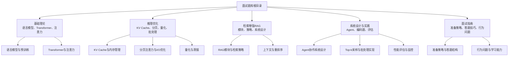
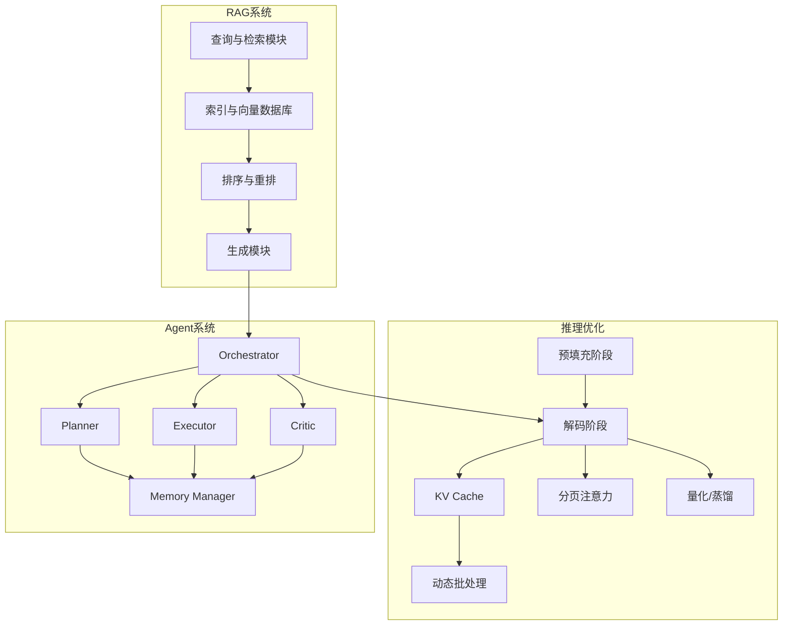
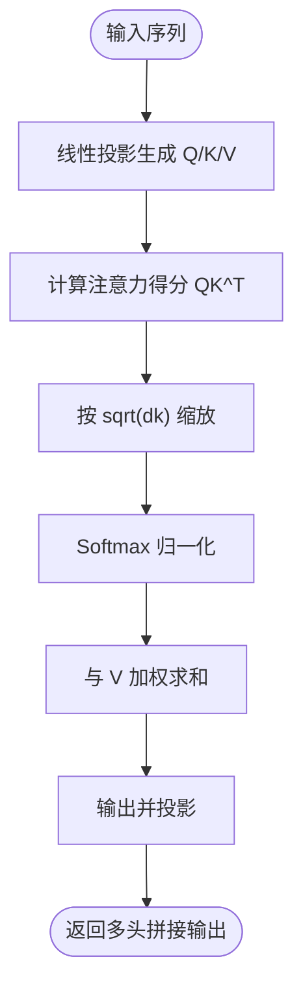
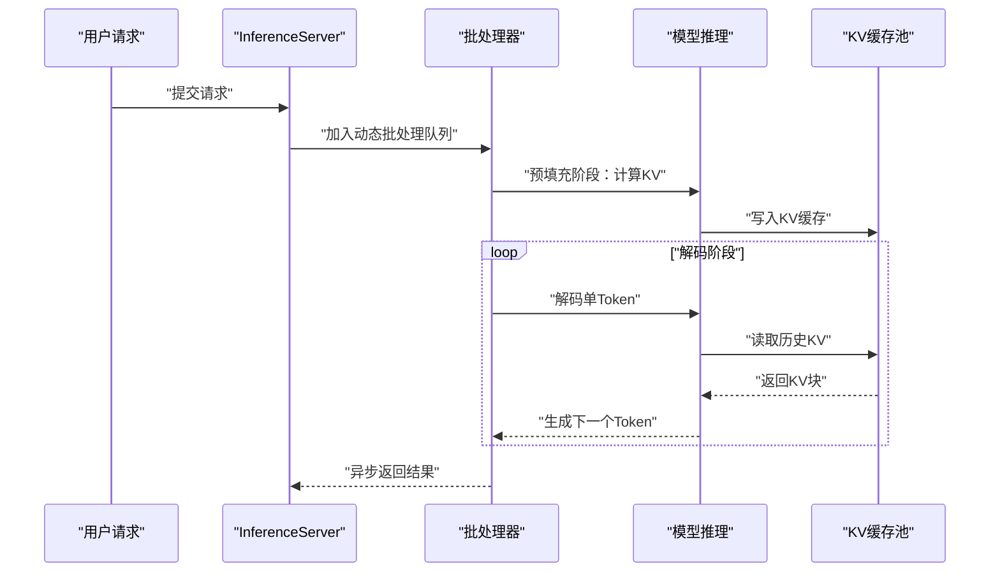
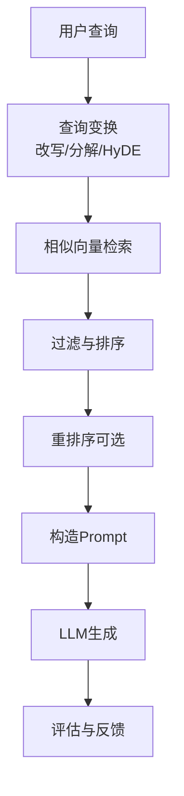
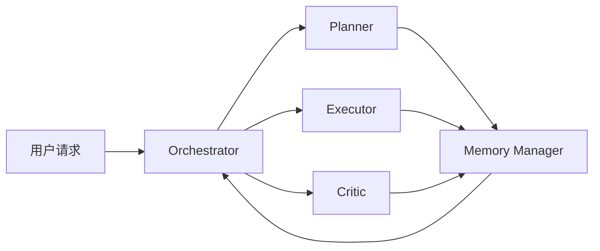
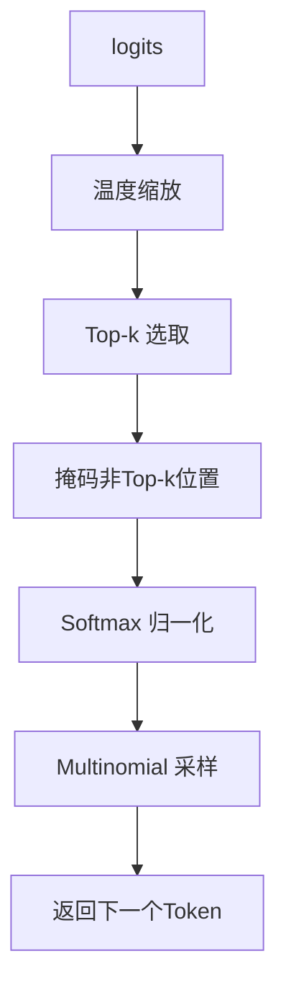
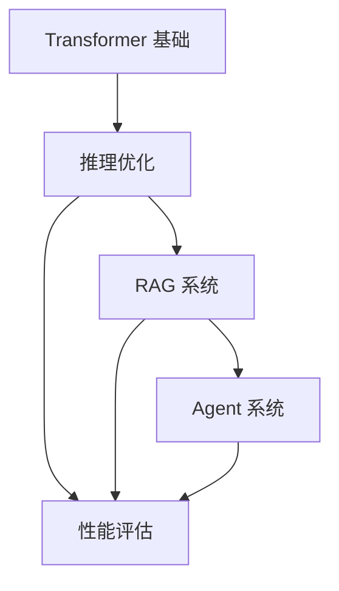

# 面试题库

<cite>
**本文引用的文件**   
- [中级LLM_Agent工程师面试QA清单.md](file://ai_generataion/中级LLM_Agent工程师面试QA清单.md)
- [中级LLM_Agent工程师面试_快速参考.md](file://ai_generataion/中级LLM_Agent工程师面试_快速参考.md)
- [README.md](file://README.md)
- [01.大语言模型基础\README.md](file://01.大语言模型基础/README.md)
- [01.大语言模型基础\1.语言模型\1.语言模型.md](file://01.大语言模型基础/1.语言模型/1.语言模型.md)
- [02.大语言模型架构\README.md](file://02.大语言模型架构/README.md)
- [02.大语言模型架构\1.attention\1.attention.md](file://02.大语言模型架构/1.attention/1.attention.md)
- [06.推理\README.md](file://06.推理/README.md)
- [06.推理\llm推理优化技术\llm推理优化技术.md](file://06.推理/llm推理优化技术/llm推理优化技术.md)
- [08.检索增强rag\README.md](file://08.检索增强rag/README.md)
- [08.检索增强rag\检索增强llm\检索增强llm.md](file://08.检索增强rag/检索增强llm/检索增强llm.md)
</cite>

## 目录
1. [简介](#简介)
2. [项目结构](#项目结构)
3. [核心组件](#核心组件)
4. [架构概览](#架构概览)
5. [详细组件分析](#详细组件分析)
6. [依赖分析](#依赖分析)
7. [性能考量](#性能考量)
8. [故障排查指南](#故障排查指南)
9. [结论](#结论)
10. [附录](#附录)

## 简介
本仓库面向中级 LLM/Agent 工程师的面试准备，围绕“大模型、Agent、RAG、推理优化”四大核心领域，系统整理了理论、实践与项目经验相关的面试问题与参考答案，并提供快速复习要点、答题技巧与常见陷阱提示。文档同时给出可落地的系统设计与编码实现思路，帮助读者在有限时间内高效准备，覆盖从基础概念到工程落地的完整知识链路。

## 项目结构
仓库采用主题化目录组织，便于按领域检索与复习：
- 基础理论：大语言模型基础、Transformer 架构、注意力机制等
- 推理优化：KV Cache、分页注意力、量化、动态批处理等
- 检索增强：RAG 的模块、检索策略、重排序与上下文管理
- 系统设计与实践：Agent 协作、编码题模板、性能评估与监控
- 面试指南：准备策略、答题结构、行为问题与学习能力展示

图表来源
- [README.md:37-169](file://README.md#L37-L169)
- [01.大语言模型基础\README.md:1-36](file://01.大语言模型基础/README.md#L1-L36)
- [02.大语言模型架构\README.md:1-52](file://02.大语言模型架构/README.md#L1-L52)
- [06.推理\README.md:1-28](file://06.推理/README.md#L1-L28)
- [08.检索增强rag\README.md:1-14](file://08.检索增强rag/README.md#L1-L14)

章节来源
- [README.md:1-169](file://README.md#L1-L169)

## 核心组件
本节聚焦面试高频考点与工程实现要点，覆盖以下主题：
- Transformer 与注意力机制（自注意力、多头注意力、缩放点积、相对/绝对位置编码）
- 推理优化（KV Cache、分页注意力、动态批处理、量化、蒸馏）
- RAG 系统（数据与索引、查询变换、排序与重排、生成策略）
- Agent 系统（角色定义、通信协议、任务分解与协调）
- 编码实践（Top-k 采样、KV Cache 内存池、批处理调度）

章节来源
- [中级LLM_Agent工程师面试QA清单.md:12-343](file://ai_generataion/中级LLM_Agent工程师面试QA清单.md#L12-L343)
- [中级LLM_Agent工程师面试_快速参考.md:1-66](file://ai_generataion/中级LLM_Agent工程师面试_快速参考.md#L1-L66)

## 架构概览
下图展示了“检索增强 LLM”与“推理优化”两大体系在面试中的核心位置与相互关系，便于建立全局视角与知识地图。

图表来源
- [08.检索增强rag\检索增强llm\检索增强llm.md:1-526](file://08.检索增强rag/检索增强llm/检索增强llm.md#L1-L526)
- [06.推理\llm推理优化技术\llm推理优化技术.md:1-271](file://06.推理/llm推理优化技术/llm推理优化技术.md#L1-L271)
- [中级LLM_Agent工程师面试QA清单.md:55-131](file://ai_generataion/中级LLM_Agent工程师面试QA清单.md#L55-L131)

## 详细组件分析

### 1. Transformer 与注意力机制
- 自注意力与缩放点积注意力的数学与实现要点
- 多头注意力的并行优势与降维策略
- 位置编码（绝对/相对）与层归一化（Pre-LN/Post-LN）差异
- 注意力复杂度与长序列瓶颈、稀疏化与 FlashAttention 的 I/O 优化

图表来源
- [02.大语言模型架构\1.attention\1.attention.md:31-33](file://02.大语言模型架构/1.attention/1.attention.md#L31-L33)

章节来源
- [02.大语言模型架构\1.attention\1.attention.md:1-544](file://02.大语言模型架构/1.attention/1.attention.md#L1-L544)

### 2. 推理优化：KV Cache 与分页注意力
- 预填充阶段与解码阶段的差异与内存瓶颈
- KV Cache 的缓存与复用策略，内存池与块管理
- 分页注意力（PagedAttention）的块化存储与索引
- 动态批处理与 Speculative Inference 的吞吐提升

图表来源
- [中级LLM_Agent工程师面试QA清单.md:65-81](file://ai_generataion/中级LLM_Agent工程师面试QA清单.md#L65-L81)
- [06.推理\llm推理优化技术\llm推理优化技术.md:17-72](file://06.推理/llm推理优化技术/llm推理优化技术.md#L17-L72)

章节来源
- [中级LLM_Agent工程师面试QA清单.md:185-226](file://ai_generataion/中级LLM_Agent工程师面试QA清单.md#L185-L226)
- [06.推理\llm推理优化技术\llm推理优化技术.md:1-271](file://06.推理/llm推理优化技术/llm推理优化技术.md#L1-L271)

### 3. RAG 系统：检索与生成
- 数据与索引：文本分块、元数据、向量索引与相似检索
- 查询变换：同义改写、查询分解、HyDE（假设文档嵌入）
- 排序与重排：相似度过滤、时间加权、LLM 重排
- 生成策略：Prompt 模板、逐步修正、上下文截断与幻觉控制

图表来源
- [08.检索增强rag\检索增强llm\检索增强llm.md:332-413](file://08.检索增强rag/检索增强llm/检索增强llm.md#L332-L413)

章节来源
- [08.检索增强rag\检索增强llm\检索增强llm.md:1-526](file://08.检索增强rag/检索增强llm/检索增强llm.md#L1-L526)

### 4. Agent 系统设计
- 角色定义：Orchestrator、Planner、Executor、Critic、Memory Manager
- 通信协议与任务分解：消息格式、路由与状态同步
- 错误处理与重试：死锁避免、长期/短期记忆设计
- 性能评估：吞吐、延迟、成功率与用户满意度

图表来源
- [中级LLM_Agent工程师面试QA清单.md:88-113](file://ai_generataion/中级LLM_Agent工程师面试QA清单.md#L88-L113)

章节来源
- [中级LLM_Agent工程师面试QA清单.md:55-131](file://ai_generataion/中级LLM_Agent工程师面试QA清单.md#L55-L131)

### 5. 编码实践：Top-k 采样与 KV Cache 内存池
- Top-k 采样：温度缩放、掩码、softmax 与采样
- KV Cache 内存池：预分配、循环缓冲、块管理与释放
- 批处理调度：动态批处理、异步返回与资源复用

图表来源
- [中级LLM_Agent工程师面试QA清单.md:136-184](file://ai_generataion/中级LLM_Agent工程师面试QA清单.md#L136-L184)

章节来源
- [中级LLM_Agent工程师面试QA清单.md:136-226](file://ai_generataion/中级LLM_Agent工程师面试QA清单.md#L136-L226)

## 依赖分析
- 知识依赖：Transformer 基础 → 推理优化 → RAG 系统 → Agent 设计
- 工程依赖：KV Cache 与分页注意力是解码阶段的性能关键；RAG 的检索质量直接影响生成稳定性；Agent 的任务分解与通信协议决定系统可扩展性
- 外部依赖：向量数据库（如 FAISS/Pinecone）、批处理调度器、量化/蒸馏工具链

图表来源
- [02.大语言模型架构\1.attention\1.attention.md:374-406](file://02.大语言模型架构/1.attention/1.attention.md#L374-L406)
- [06.推理\llm推理优化技术\llm推理优化技术.md:116-180](file://06.推理/llm推理优化技术/llm推理优化技术.md#L116-L180)
- [08.检索增强rag\检索增强llm\检索增强llm.md:81-120](file://08.检索增强rag/检索增强llm/检索增强llm.md#L81-L120)

章节来源
- [02.大语言模型架构\1.attention\1.attention.md:374-406](file://02.大语言模型架构/1.attention/1.attention.md#L374-L406)
- [06.推理\llm推理优化技术\llm推理优化技术.md:116-180](file://06.推理/llm推理优化技术/llm推理优化技术.md#L116-L180)
- [08.检索增强rag\检索增强llm\检索增强llm.md:81-120](file://08.检索增强rag/检索增强llm/检索增强llm.md#L81-L120)

## 性能考量
- 注意力复杂度：Self-Attention 为 O(n²d)，需优先优化 n 与 d 的乘积
- KV Cache 内存：随 batch×seq×layers×dim×precision 线性增长，需分页与池化
- 批处理策略：动态批处理提升 GPU 利用率，避免“最长请求”阻塞
- I/O 优化：FlashAttention 与分页注意力减少 HBM 读写，提升吞吐
- 量化与蒸馏：降低权重与激活精度，缩小模型体积，提升吞吐

章节来源
- [02.大语言模型架构\1.attention\1.attention.md:374-406](file://02.大语言模型架构/1.attention/1.attention.md#L374-L406)
- [06.推理\llm推理优化技术\llm推理优化技术.md:47-72](file://06.推理/llm推理优化技术/llm推理优化技术.md#L47-L72)
- [06.推理\llm推理优化技术\llm推理优化技术.md:152-167](file://06.推理/llm推理优化技术/llm推理优化技术.md#L152-L167)

## 故障排查指南
- 生成幻觉与事实性错误：引入检索增强、控制上下文长度、使用重排序与外部验证
- 长尾知识不足：通过检索外部知识库补充，避免依赖模型参数记忆
- 私有数据与隐私：使用检索增强避免将私有数据注入模型，降低泄露风险
- 数据新鲜度：通过外部数据库实时检索，避免模型参数滞后
- 性能瓶颈定位：关注解码阶段的 KV Cache 与注意力 I/O，优先优化热点路径

章节来源
- [08.检索增强rag\检索增强llm\检索增强llm.md:35-80](file://08.检索增强rag/检索增强llm/检索增强llm.md#L35-L80)
- [06.推理\llm推理优化技术\llm推理优化技术.md:11-28](file://06.推理/llm推理优化技术/llm推理优化技术.md#L11-L28)

## 结论
本面试题库以“系统化知识地图 + 工程实践模板 + 行为问题范式”三位一体，帮助中级 LLM/Agent 工程师在有限时间内高效准备。建议以“Transformer 基础 → 推理优化 → RAG 系统 → Agent 设计”的路径复习，并结合编码题与项目经验案例进行演练，最终形成可迁移的工程思维与表达能力。

## 附录
- 面试准备策略
  - 技术深度与广度：在 2-3 个核心领域深入，同时把握整体技术栈
  - 编码能力：手写采样、注意力、批处理等核心算法
  - 项目经验：准备 2-3 个深度案例，突出技术决策与量化结果
  - 学习能力：跟踪前沿论文与开源实现，展示从研究到工程的转化
- 答题技巧
  - 先澄清边界与假设，再给出复杂度分析
  - 讨论多种方案的权衡，强调 trade-off
  - 代码注重可读性与可维护性，必要时给出伪代码与流程图
- 常见陷阱
  - 过度理论化或停留在表面
  - 忽视工程约束（内存、延迟、吞吐）
  - 未考虑多租户、可扩展性与可观测性
  - 对检索质量、Agent 协作与系统监控缺乏系统性设计

章节来源
- [中级LLM_Agent工程师面试QA清单.md:321-341](file://ai_generataion/中级LLM_Agent工程师面试QA清单.md#L321-L341)
- [中级LLM_Agent工程师面试_快速参考.md:52-66](file://ai_generataion/中级LLM_Agent工程师面试_快速参考.md#L52-L66)