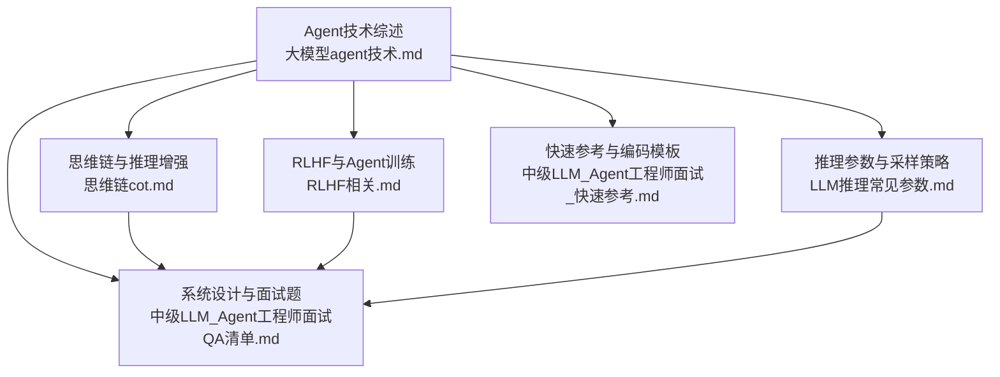
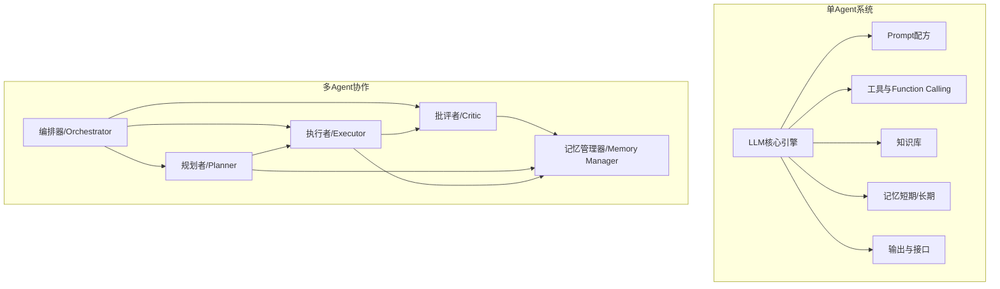
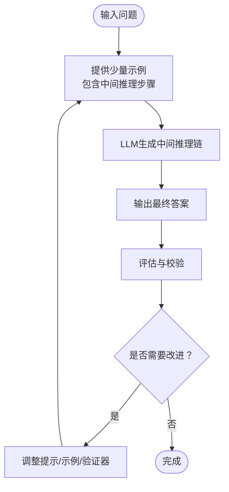
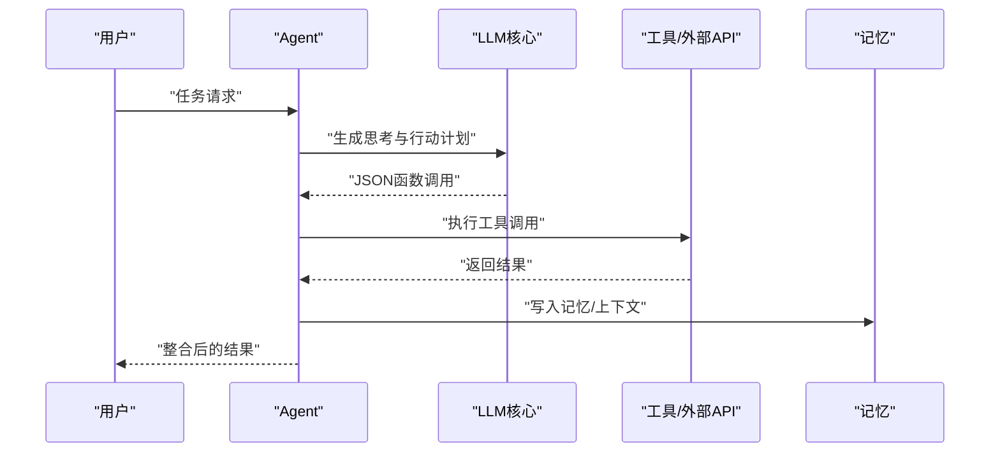
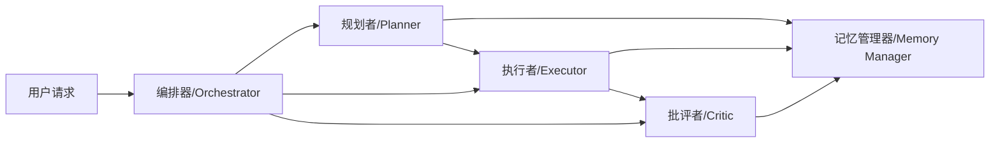
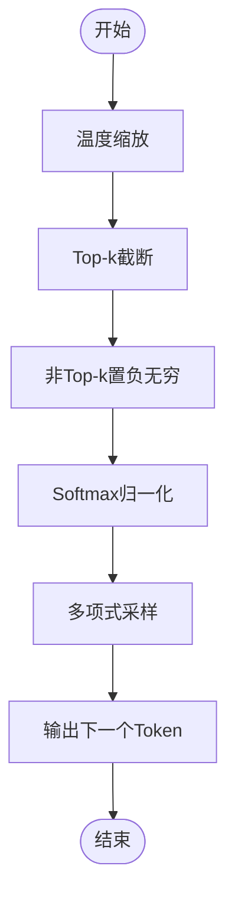
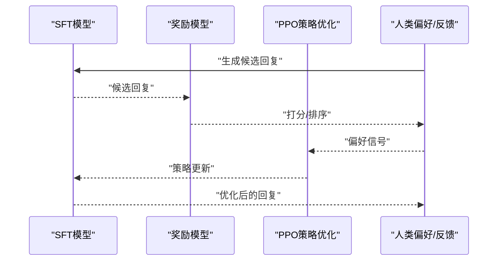
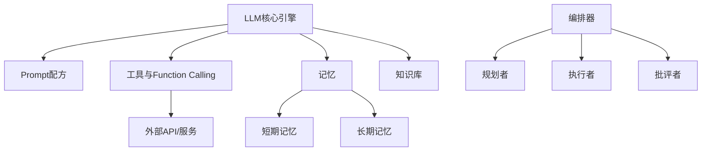

# Agent应用

<cite>
**本文引用的文件**
- [大模型agent技术.md](file://08.检索增强rag/大模型agent技术/大模型agent技术.md)
- [思维链（cot）.md](file://10.大语言模型应用/1.思维链（cot）/1.思维链（cot）.md)
- [RLHF相关.md](file://07.强化学习/1.rlhf相关/1.rlhf相关.md)
- [LLM推理常见参数.md](file://06.推理/LLM推理常见参数/LLM推理常见参数.md)
- [中级LLM_Agent工程师面试QA清单.md](file://ai_generataion/中级LLM_Agent工程师面试QA清单.md)
- [中级LLM_Agent工程师面试_快速参考.md](file://ai_generataion/中级LLM_Agent工程师面试_快速参考.md)
</cite>

## 目录
1. [简介](#简介)
2. [项目结构](#项目结构)
3. [核心组件](#核心组件)
4. [架构总览](#架构总览)
5. [详细组件分析](#详细组件分析)
6. [依赖分析](#依赖分析)
7. [性能考量](#性能考量)
8. [故障排查指南](#故障排查指南)
9. [结论](#结论)
10. [附录](#附录)

## 简介
本文件围绕智能体（Agent）应用，系统梳理大模型Agent的核心概念、架构设计与工作原理，深入分析多Agent协作机制、任务分解与执行策略、Function Calling技术的应用，并结合仓库中的资料总结不同类型Agent的特点与适用场景。文档同时提供可落地的实现思路与最佳实践，帮助读者设计高效的Agent系统以解决复杂业务问题。

## 项目结构
本仓库与Agent相关的内容主要集中在以下几类文件：
- 大模型Agent技术综述与实现范式
- 思维链（Chain-of-Thought, CoT）与推理增强
- 基于人类反馈的强化学习（RLHF）与Agent训练
- 推理参数与采样策略
- 面试题与系统设计要点（涵盖多Agent协作、KV Cache、Top-k采样等）

图表来源
- [大模型agent技术.md:1-483](file://08.检索增强rag/大模型agent技术/大模型agent技术.md#L1-L483)
- [思维链（cot）.md:1-147](file://10.大语言模型应用/1.思维链（cot）/1.思维链（cot）.md#L1-L147)
- [RLHF相关.md:1-172](file://07.强化学习/1.rlhf相关/1.rlhf相关.md#L1-L172)
- [LLM推理常见参数.md:1-17](file://06.推理/LLM推理常见参数/LLM推理常见参数.md#L1-L17)
- [中级LLM_Agent工程师面试QA清单.md:1-343](file://ai_generataion/中级LLM_Agent工程师面试QA清单.md#L1-L343)
- [中级LLM_Agent工程师面试_快速参考.md:1-66](file://ai_generataion/中级LLM_Agent工程师面试_快速参考.md#L1-L66)

章节来源
- [大模型agent技术.md:1-483](file://08.检索增强rag/大模型agent技术/大模型agent技术.md#L1-L483)
- [思维链（cot）.md:1-147](file://10.大语言模型应用/1.思维链（cot）/1.思维链（cot）.md#L1-L147)
- [RLHF相关.md:1-172](file://07.强化学习/1.rlhf相关/1.rlhf相关.md#L1-L172)
- [LLM推理常见参数.md:1-17](file://06.推理/LLM推理常见参数/LLM推理常见参数.md#L1-L17)
- [中级LLM_Agent工程师面试QA清单.md:1-343](file://ai_generataion/中级LLM_Agent工程师面试QA清单.md#L1-L343)
- [中级LLM_Agent工程师面试_快速参考.md:1-66](file://ai_generataion/中级LLM_Agent工程师面试_快速参考.md#L1-L66)

## 核心组件
- LLM核心引擎：作为感知、推理与决策的中枢，承担语言理解、思维链生成、规划与执行建议。
- Prompt配方（Prompt Recipe）：定义内容要求、语气、受众、输出长度与创造性水平，指导LLM按需生成。
- 工具与Function Calling：通过JSON输出的函数调用协议，将外部API、计算器、搜索引擎等工具内化为原生能力。
- 知识与记忆：知识库扩展LLM内容，记忆（短期/长期）保障上下文一致性与多步任务执行。
- 多Agent协作：Planner、Executor、Critic、Memory等角色协同，配合通信协议与状态同步。
- 推理优化：KV Cache、动态批处理、Top-k/Top-p/温度采样等，保障高并发与低延迟。

章节来源
- [大模型agent技术.md:118-121](file://08.检索增强rag/大模型agent技术/大模型agent技术.md#L118-L121)
- [RLHF相关.md:137-144](file://07.强化学习/1.rlhf相关/1.rlhf相关.md#L137-L144)
- [中级LLM_Agent工程师面试QA清单.md:88-113](file://ai_generataion/中级LLM_Agent工程师面试QA清单.md#L88-L113)
- [LLM推理常见参数.md:1-17](file://06.推理/LLM推理常见参数/LLM推理常见参数.md#L1-L17)

## 架构总览
Agent系统以“感知—推理—决策—行动—反馈”闭环为核心，结合工具调用与记忆，形成可扩展的多Agent协作架构。下图展示典型Agent系统与多Agent协作的高层关系。

图表来源
- [大模型agent技术.md:118-121](file://08.检索增强rag/大模型agent技术/大模型agent技术.md#L118-L121)
- [RLHF相关.md:137-144](file://07.强化学习/1.rlhf相关/1.rlhf相关.md#L137-L144)
- [中级LLM_Agent工程师面试QA清单.md:88-113](file://ai_generataion/中级LLM_Agent工程师面试QA清单.md#L88-L113)

## 详细组件分析

### 1) 思维链（CoT）与推理增强
- 思维链通过在少样本示例中提供中间推理步骤，显著提升复杂推理任务的表现，尤其在算术、常识与符号推理上。
- 优势包括：问题分解、步骤示范、逻辑思维强化、解释性增强与少样本学习。
- 局限与改进方向：思路链事实性、提示工程成本、模型规模依赖、泛化能力与小模型适配。

图表来源
- [思维链（cot）.md:1-147](file://10.大语言模型应用/1.思维链（cot）/1.思维链（cot）.md#L1-L147)

章节来源
- [思维链（cot）.md:1-147](file://10.大语言模型应用/1.思维链（cot）/1.思维链（cot）.md#L1-L147)

### 2) Function Calling与工具调用
- Agent通过JSON输出函数调用协议，将外部工具（API、计算器、搜索引擎）内化为原生能力，提升任务执行能力与准确性。
- 与Function Calling结合的ReAct模式强调“思考—行动—观察—再思考”的循环，形成可解释的行动闭环。

图表来源
- [大模型agent技术.md:118-121](file://08.检索增强rag/大模型agent技术/大模型agent技术.md#L118-L121)

章节来源
- [大模型agent技术.md:118-121](file://08.检索增强rag/大模型agent技术/大模型agent技术.md#L118-L121)

### 3) 多Agent协作机制
- 角色定义：Planner（规划）、Executor（执行）、Critic（批评）、Memory（记忆管理）等。
- 通信与协调：消息格式、路由机制、任务分解与状态同步、错误处理与重试。
- 典型架构：编排器负责任务分解，规划者串联思路，执行者落地动作，批评者提供反馈，记忆管理器贯穿全程。

图表来源
- [中级LLM_Agent工程师面试QA清单.md:88-113](file://ai_generataion/中级LLM_Agent工程师面试QA清单.md#L88-L113)

章节来源
- [中级LLM_Agent工程师面试QA清单.md:88-113](file://ai_generataion/中级LLM_Agent工程师面试QA清单.md#L88-L113)

### 4) 推理优化与采样策略
- 推理优化：KV Cache内存池、动态批处理、PagedAttention等，降低重复计算与内存压力。
- 采样策略：Top-k、Top-p（核采样）、温度参数、重复惩罚等，平衡多样性与稳定性。
- 采样流程：温度缩放、截断、softmax归一化、多项式采样。

图表来源
- [LLM推理常见参数.md:1-17](file://06.推理/LLM推理常见参数/LLM推理常见参数.md#L1-L17)
- [中级LLM_Agent工程师面试QA清单.md:136-184](file://ai_generataion/中级LLM_Agent工程师面试QA清单.md#L136-L184)

章节来源
- [LLM推理常见参数.md:1-17](file://06.推理/LLM推理常见参数/LLM推理常见参数.md#L1-L17)
- [中级LLM_Agent工程师面试QA清单.md:136-184](file://ai_generataion/中级LLM_Agent工程师面试QA清单.md#L136-L184)

### 5) RLHF与Agent训练
- RLHF三阶段：预训练语言模型（SFT）→ 奖励模型（RM）→ 强化学习微调（PPO）。
- RRHF：Rank Response from Human Feedback，以排名损失对齐人类偏好，减少模型数量与复杂性。
- 在Agent场景中，奖励模型可评估多Agent协作的收益与一致性，PPO用于策略优化与稳定性控制。

图表来源
- [RLHF相关.md:100-121](file://07.强化学习/1.rlhf相关/1.rlhf相关.md#L100-L121)
- [RLHF相关.md:89-99](file://07.强化学习/1.rlhf相关/1.rlhf相关.md#L89-L99)

章节来源
- [RLHF相关.md:100-121](file://07.强化学习/1.rlhf相关/1.rlhf相关.md#L100-L121)
- [RLHF相关.md:89-99](file://07.强化学习/1.rlhf相关/1.rlhf相关.md#L89-L99)

### 6) 不同类型Agent的特点与适用场景
- 会话型Agent：强调个性化对话与上下文交互，适合客服、咨询、教育等需要自然语言交互的场景。
- 任务型Agent：目标驱动，强调规划、工具调用与结果产出，适合自动化流程、数据分析、内容生成等任务。

章节来源
- [RLHF相关.md:146-153](file://07.强化学习/1.rlhf相关/1.rlhf相关.md#L146-L153)

## 依赖分析
- 组件耦合与内聚：LLM为核心，Prompt配方与工具调用为外设接口；记忆与知识为支撑层；多Agent通过编排器耦合。
- 外部依赖：工具API、向量数据库、奖励模型、人类反馈。
- 潜在环路：多Agent间消息路由与状态同步需避免死锁；可通过优先级队列、超时与重试机制缓解。

图表来源
- [大模型agent技术.md:118-121](file://08.检索增强rag/大模型agent技术/大模型agent技术.md#L118-L121)
- [RLHF相关.md:137-144](file://07.强化学习/1.rlhf相关/1.rlhf相关.md#L137-L144)
- [中级LLM_Agent工程师面试QA清单.md:88-113](file://ai_generataion/中级LLM_Agent工程师面试QA清单.md#L88-L113)

章节来源
- [大模型agent技术.md:118-121](file://08.检索增强rag/大模型agent技术/大模型agent技术.md#L118-L121)
- [RLHF相关.md:137-144](file://07.强化学习/1.rlhf相关/1.rlhf相关.md#L137-L144)
- [中级LLM_Agent工程师面试QA清单.md:88-113](file://ai_generataion/中级LLM_Agent工程师面试QA清单.md#L88-L113)

## 性能考量
- 高并发与低延迟：动态批处理、KV Cache池化、PagedAttention、异步I/O。
- 内存管理：预分配缓存块、循环缓冲、内存复用与垃圾回收。
- 采样与推理：温度、Top-k/Top-p、重复惩罚参数调优，平衡生成质量与稳定性。
- 多Agent协作：任务分解与路由、状态同步与一致性、错误处理与重试、避免死锁。

章节来源
- [中级LLM_Agent工程师面试QA清单.md:57-87](file://ai_generataion/中级LLM_Agent工程师面试QA清单.md#L57-L87)
- [中级LLM_Agent工程师面试QA清单.md:185-226](file://ai_generataion/中级LLM_Agent工程师面试QA清单.md#L185-L226)
- [中级LLM_Agent工程师面试_快速参考.md:9-19](file://ai_generataion/中级LLM_Agent工程师面试_快速参考.md#L9-L19)

## 故障排查指南
- 推理性能问题：检查批处理效率、KV Cache池容量与复用策略、PagedAttention配置。
- 采样不稳定：调整温度、Top-k/Top-p阈值，引入重复惩罚，必要时采用核采样。
- Function Calling失败：校验JSON输出格式、工具可用性与权限、超时与重试策略。
- 多Agent死锁：引入优先级队列、超时控制、幂等执行与状态回滚。
- RLHF训练缓慢：并行化与分布式训练、优化算法改进、迁移学习与预训练初始化。

章节来源
- [中级LLM_Agent工程师面试QA清单.md:57-87](file://ai_generataion/中级LLM_Agent工程师面试QA清单.md#L57-L87)
- [中级LLM_Agent工程师面试QA清单.md:185-226](file://ai_generataion/中级LLM_Agent工程师面试QA清单.md#L185-L226)
- [RLHF相关.md:77-87](file://07.强化学习/1.rlhf相关/1.rlhf相关.md#L77-L87)

## 结论
Agent系统以LLM为核心，结合Prompt配方、工具调用、知识与记忆，形成可解释、可扩展的智能体框架。通过思维链增强推理、RLHF优化策略、推理参数调优与多Agent协作，可在复杂业务场景中实现高可靠、高性能的自动化解决方案。未来可进一步完善世界模型、记忆整理、多模态输入与输出执行，提升Agent在真实世界中的适应性与鲁棒性。

## 附录
- 实现建议
  - 以“规划—执行—反馈—反思”的循环驱动任务执行，结合Function Calling与记忆管理。
  - 在多Agent场景中，明确角色边界与通信协议，采用编排器进行任务分解与状态同步。
  - 使用KV Cache池化与动态批处理提升推理吞吐，结合Top-k/Top-p与温度参数稳定生成质量。
  - 通过RLHF/Reward Model评估Agent行为，PPO优化策略，RRHF降低模型数量与复杂度。

章节来源
- [大模型agent技术.md:118-121](file://08.检索增强rag/大模型agent技术/大模型agent技术.md#L118-L121)
- [RLHF相关.md:100-121](file://07.强化学习/1.rlhf相关/1.rlhf相关.md#L100-L121)
- [中级LLM_Agent工程师面试QA清单.md:88-113](file://ai_generataion/中级LLM_Agent工程师面试QA清单.md#L88-L113)
- [中级LLM_Agent工程师面试_快速参考.md:21-37](file://ai_generataion/中级LLM_Agent工程师面试_快速参考.md#L21-L37)