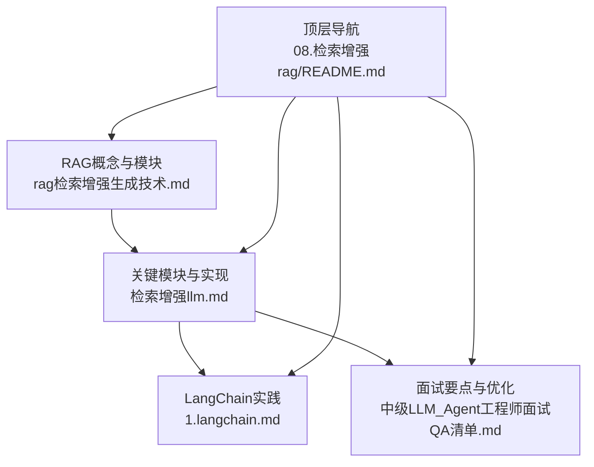
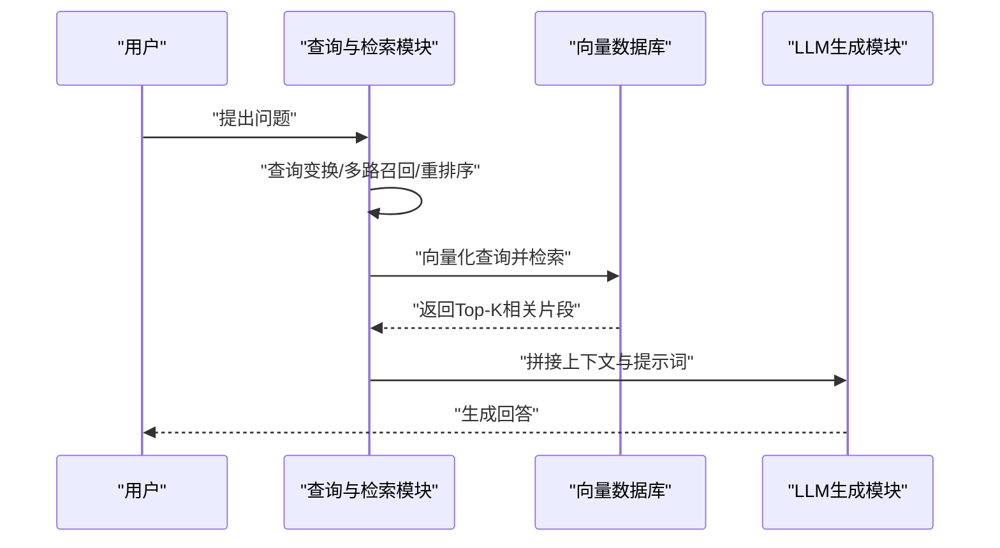
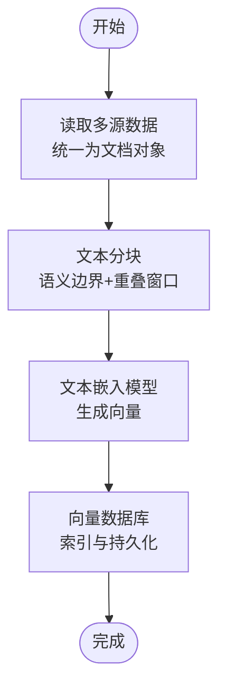
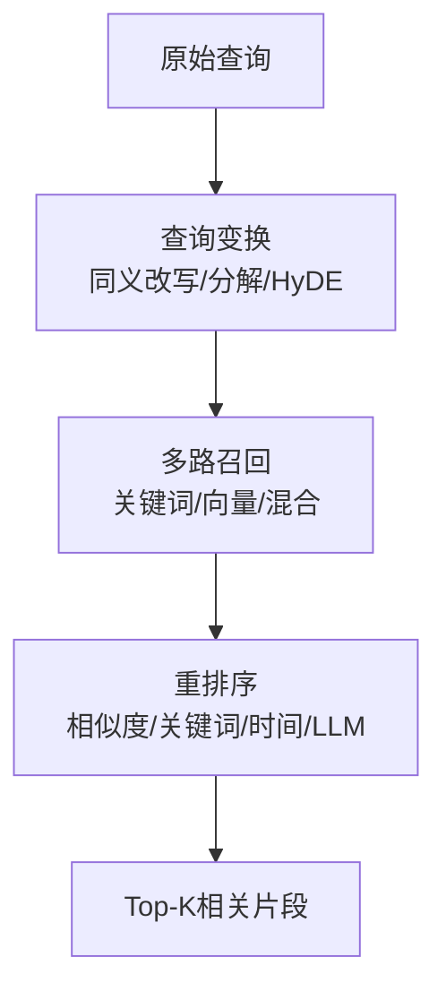
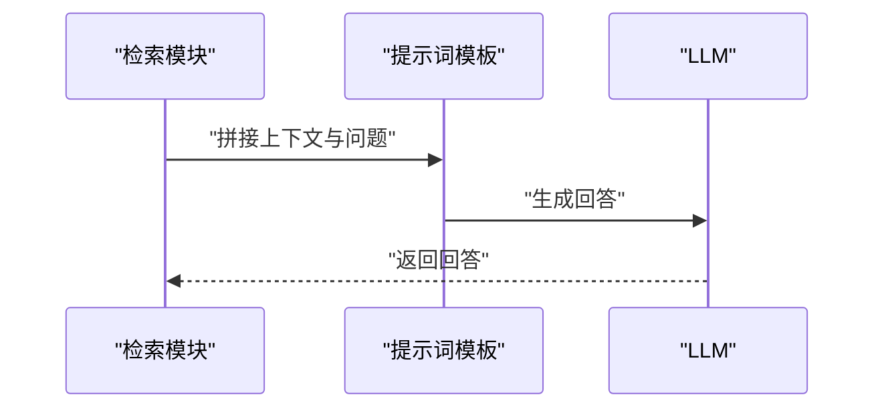
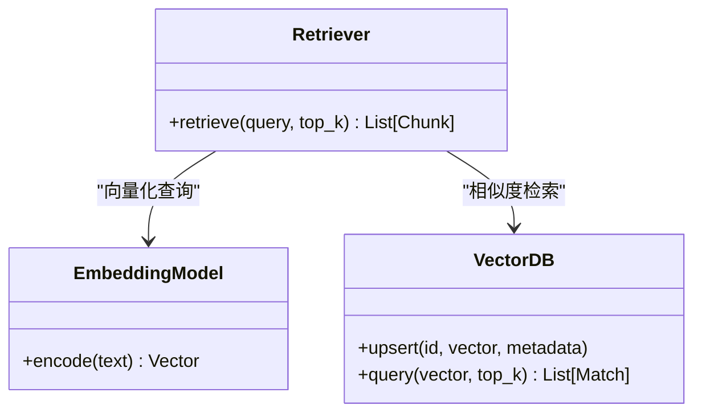
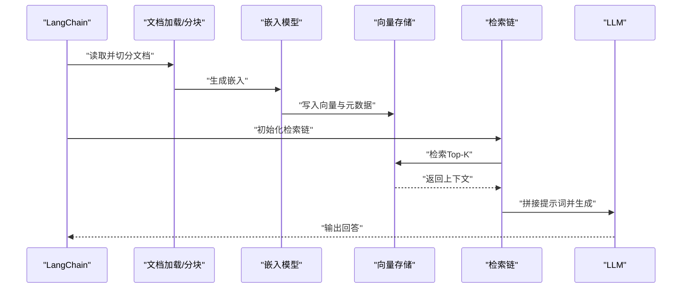
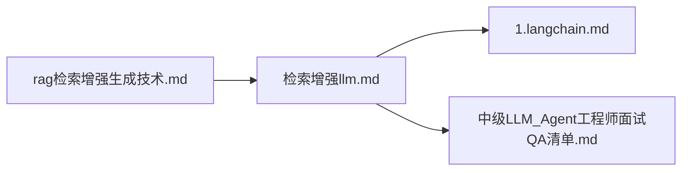

# RAG技术

<cite>
**本文引用的文件**
- [rag（检索增强生成）技术.md](file://08.检索增强rag/rag（检索增强生成）技术/rag（检索增强生成）技术.md)
- [检索增强llm.md](file://08.检索增强rag/检索增强llm/检索增强llm.md)
- [README.md](file://08.检索增强rag/README.md)
- [1.langchain.md](file://10.大语言模型应用/1.langchain/1.langchain.md)
- [中级LLM_Agent工程师面试QA清单.md](file://ai_generataion/中级LLM_Agent工程师面试QA清单.md)
- [README.md](file://README.md)
</cite>

## 目录
1. [简介](#简介)
2. [项目结构](#项目结构)
3. [核心组件](#核心组件)
4. [架构总览](#架构总览)
5. [详细组件分析](#详细组件分析)
6. [依赖关系分析](#依赖关系分析)
7. [性能考量](#性能考量)
8. [故障排查指南](#故障排查指南)
9. [结论](#结论)
10. [附录](#附录)

## 简介
本文件面向RAG（检索增强生成）技术，系统梳理其核心原理、关键模块、实现路径与工程化实践。重点覆盖：
- 检索机制与生成过程的两阶段协同
- 向量数据库与相似度检索
- 多路召回、重排序与查询优化
- 文档预处理、向量嵌入、相似度计算与生成调用的落地步骤
- 不同检索算法与策略的优缺点与选型建议

## 项目结构
本仓库围绕“检索增强生成”主题，提供了概念讲解、模块拆解、实现案例与对比分析等材料。RAG相关知识主要分布在以下文件：
- 概念与模块：08.检索增强rag/rag（检索增强生成）技术/rag（检索增强生成）技术.md
- 关键模块详解与实现：08.检索增强rag/检索增强llm/检索增强llm.md
- 框架实践：10.大语言模型应用/1.langchain/1.langchain.md
- 面试要点与优化策略：ai_generataion/中级LLM_Agent工程师面试QA清单.md
- 顶层导航与入口：08.检索增强rag/README.md

图表来源
- [rag（检索增强生成）技术.md:1-73](file://08.检索增强rag/rag（检索增强生成）技术/rag（检索增强生成）技术.md#L1-L73)
- [检索增强llm.md:1-526](file://08.检索增强rag/检索增强llm/检索增强llm.md#L1-L526)
- [1.langchain.md:300-417](file://10.大语言模型应用/1.langchain/1.langchain.md#L300-L417)
- [README.md:1-14](file://08.检索增强rag/README.md#L1-L14)

章节来源
- [README.md:1-14](file://08.检索增强rag/README.md#L1-L14)

## 核心组件
RAG系统通常由三大核心模块构成：
- 数据与索引模块：负责外部数据接入、清洗、分块与索引构建
- 查询与检索模块：负责查询变换、多路召回、重排序与后处理
- 响应生成模块：负责将检索到的相关片段拼接进提示词，驱动LLM生成最终回答

章节来源
- [检索增强llm.md:81-88](file://08.检索增强rag/检索增强llm/检索增强llm.md#L81-L88)

## 架构总览
RAG的典型调用模式包括三种：
- 非结构化数据先嵌入入库，再做检索拼接到提示词中生成回答
- 将问题向量化存入长时记忆库，回答后将答案也存入，形成“问题-答案”缓存
- 问题向量化后先查缓存，命中则直接返回，未命中再与LLM交互并回填缓存

图表来源
- [rag（检索增强生成）技术.md:47-57](file://08.检索增强rag/rag（检索增强生成）技术/rag（检索增强生成）技术.md#L47-L57)

章节来源
- [rag（检索增强生成）技术.md:47-57](file://08.检索增强rag/rag（检索增强生成）技术/rag（检索增强生成）技术.md#L47-L57)

## 详细组件分析

### 数据与索引模块
- 数据获取：统一文档对象，承载文本与元信息（时间、标题、关键词、摘要、分类等），支持多来源、多格式、多语种与结构化/非结构化数据
- 文本分块：按语义单元（句子/段落）切分，融合成块，控制块大小与重叠，平衡上下文长度与语义连贯性
- 索引构建：支持链式、树索引、关键词表与向量索引；向量索引为核心，依赖文本嵌入模型与向量数据库

图表来源
- [检索增强llm.md:91-149](file://08.检索增强rag/检索增强llm/检索增强llm.md#L91-L149)
- [检索增强llm.md:181-219](file://08.检索增强rag/检索增强llm/检索增强llm.md#L181-L219)

章节来源
- [检索增强llm.md:89-149](file://08.检索增强rag/检索增强llm/检索增强llm.md#L89-L149)
- [检索增强llm.md:181-219](file://08.检索增强rag/检索增强llm/检索增强llm.md#L181-L219)

### 查询与检索模块
- 查询变换：同义改写、查询分解（单步/多步）、HyDE（假设文档嵌入）
- 排序与后处理：相似度过滤/排序、关键词过滤、LLM二次重排、时间过滤/加权
- 多路召回与重排序：标题/内容/摘要联合嵌入、多跳检索、用户反馈微调

图表来源
- [检索增强llm.md:334-375](file://08.检索增强rag/检索增强llm/检索增强llm.md#L334-L375)
- [检索增强llm.md:360-365](file://08.检索增强rag/检索增强llm/检索增强llm.md#L360-L365)

章节来源
- [检索增强llm.md:334-375](file://08.检索增强rag/检索增强llm/检索增强llm.md#L334-L375)
- [检索增强llm.md:360-365](file://08.检索增强rag/检索增强llm/检索增强llm.md#L360-L365)

### 响应生成模块
- 生成策略：逐块修正/一次性拼接；Prompt模板需明确是否结合自身知识、无帮助时的处理
- 多轮对话：维护对话历史，逐步融合新上下文

图表来源
- [检索增强llm.md:376-413](file://08.检索增强rag/检索增强llm/检索增强llm.md#L376-L413)

章节来源
- [检索增强llm.md:376-413](file://08.检索增强rag/检索增强llm/检索增强llm.md#L376-L413)

### 向量数据库与相似度检索
- 文本嵌入模型：Sentence Transformers、OpenAI text-embedding-ada-002、Instructor、BGE等
- 相似向量检索：余弦相似度为主；小规模可用Numpy；大规模推荐Faiss；索引类型包括HNSW、LSH、Product Quantization等
- 向量数据库：Pinecone、Vespa、Weaviate、Milvus、Chroma、Tencent Cloud VectorDB等

图表来源
- [检索增强llm.md:223-279](file://08.检索增强rag/检索增强llm/检索增强llm.md#L223-L279)
- [检索增强llm.md:241-267](file://08.检索增强rag/检索增强llm/检索增强llm.md#L241-L267)

章节来源
- [检索增强llm.md:223-279](file://08.检索增强rag/检索增强llm/检索增强llm.md#L223-L279)
- [检索增强llm.md:241-267](file://08.检索增强rag/检索增强llm/检索增强llm.md#L241-L267)

### LangChain实践与实现案例
- 文档加载、分块、嵌入与向量存储：DirectoryLoader、CharacterTextSplitter、OpenAIEmbeddings、Chroma
- 检索链：ConversationalRetrievalChain、RetrievalQA
- 多轮对话：维护chat_history，逐步融合上下文

图表来源
- [1.langchain.md:356-414](file://10.大语言模型应用/1.langchain/1.langchain.md#L356-L414)

章节来源
- [1.langchain.md:340-414](file://10.大语言模型应用/1.langchain/1.langchain.md#L340-L414)

## 依赖关系分析
- 概念与模块：rag（检索增强生成）技术.md
- 关键实现：检索增强llm.md（数据与索引、查询与检索、响应生成）
- 框架实践：1.langchain.md（文档加载、分块、嵌入、向量存储、检索链）
- 面试要点：中级LLM_Agent工程师面试QA清单.md（RAG优化策略、多路召回、重排序、HyDE）

图表来源
- [rag（检索增强生成）技术.md:1-73](file://08.检索增强rag/rag（检索增强生成）技术/rag（检索增强生成）技术.md#L1-L73)
- [检索增强llm.md:1-526](file://08.检索增强rag/检索增强llm/检索增强llm.md#L1-L526)
- [1.langchain.md:300-417](file://10.大语言模型应用/1.langchain/1.langchain.md#L300-L417)
- [中级LLM_Agent工程师面试QA清单.md:1-133](file://ai_generataion/中级LLM_Agent工程师面试QA清单.md#L1-L133)

章节来源
- [README.md:1-14](file://08.检索增强rag/README.md#L1-L14)

## 性能考量
- 分块策略：依据内容类型、嵌入模型与问题长度选择chunk_size与重叠；评估不同分块大小的效果
- 相似度检索：小规模用Numpy，大规模用Faiss；索引类型按维度、吞吐与延迟权衡
- 向量数据库：关注可扩展性、数据管理与后处理能力
- 多路召回与重排序：提升召回质量与相关性排序，减少无关片段进入生成
- 查询优化：同义改写、查询分解、HyDE等策略提升检索质量
- 生成侧：Prompt模板明确是否结合自身知识、无帮助时的兜底策略

章节来源
- [检索增强llm.md:122-149](file://08.检索增强rag/检索增强llm/检索增强llm.md#L122-L149)
- [检索增强llm.md:241-267](file://08.检索增强rag/检索增强llm/检索增强llm.md#L241-L267)
- [检索增强llm.md:334-375](file://08.检索增强rag/检索增强llm/检索增强llm.md#L334-L375)
- [检索增强llm.md:360-365](file://08.检索增强rag/检索增强llm/检索增强llm.md#L360-L365)
- [中级LLM_Agent工程师面试QA清单.md:114-131](file://ai_generataion/中级LLM_Agent工程师面试QA清单.md#L114-L131)

## 故障排查指南
- 检索质量不佳
  - 检查分块策略是否合理（块大小、重叠、语义边界）
  - 确认嵌入模型与索引类型适配业务规模与延迟要求
  - 引入重排序（关键词过滤、时间过滤、LLM二次重排）
- 生成结果不可信
  - 明确Prompt模板，限定在上下文不足时不捏造
  - 引入多路召回与HyDE，提升相关性
- 多轮对话上下文过长
  - 控制上下文长度，必要时做摘要或历史精简
- 向量数据库写入/查询异常
  - 校验维度、指标与索引配置；检查API密钥与环境配置

章节来源
- [检索增强llm.md:366-375](file://08.检索增强rag/检索增强llm/检索增强llm.md#L366-L375)
- [检索增强llm.md:269-287](file://08.检索增强rag/检索增强llm/检索增强llm.md#L269-L287)
- [1.langchain.md:356-414](file://10.大语言模型应用/1.langchain/1.langchain.md#L356-L414)

## 结论
RAG通过“检索+生成”的两阶段协同，有效缓解长尾知识、私有数据、数据新鲜度与幻觉等问题。工程化落地的关键在于：
- 合理的文档预处理与分块策略
- 高效的向量嵌入与相似度检索
- 多路召回与重排序的组合拳
- 明确的生成Prompt与多轮上下文管理
- 以LangChain等框架快速搭建原型，再逐步优化索引与检索策略

## 附录
- RAG与SFT对比：数据形态、外部知识库、模型定制、幻觉缓解、透明度与相关技术栈
- 参考资料与实现示例：LangChain实践、向量数据库操作、面试要点与优化策略

章节来源
- [rag（检索增强生成）技术.md:59-73](file://08.检索增强rag/rag（检索增强生成）技术/rag（检索增强生成）技术.md#L59-L73)
- [检索增强llm.md:494-505](file://08.检索增强rag/检索增强llm/检索增强llm.md#L494-L505)
- [1.langchain.md:356-414](file://10.大语言模型应用/1.langchain/1.langchain.md#L356-L414)
- [中级LLM_Agent工程师面试QA清单.md:114-131](file://ai_generataion/中级LLM_Agent工程师面试QA清单.md#L114-L131)