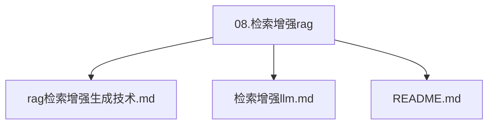
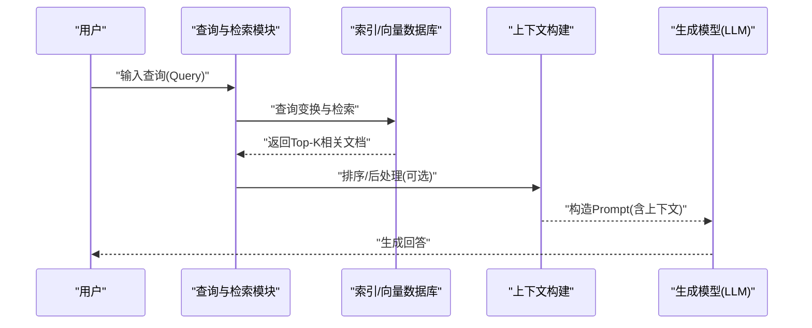
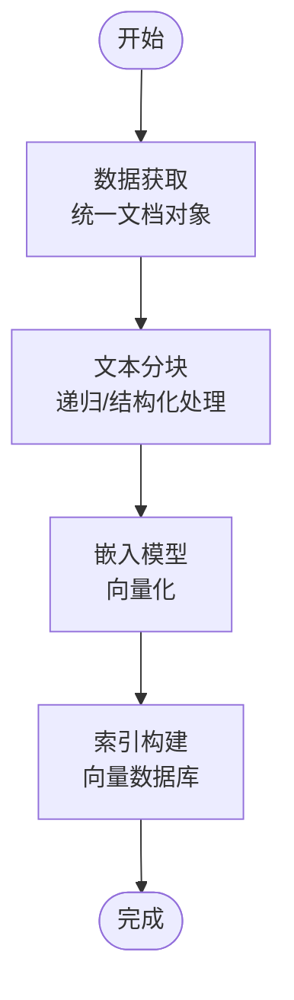
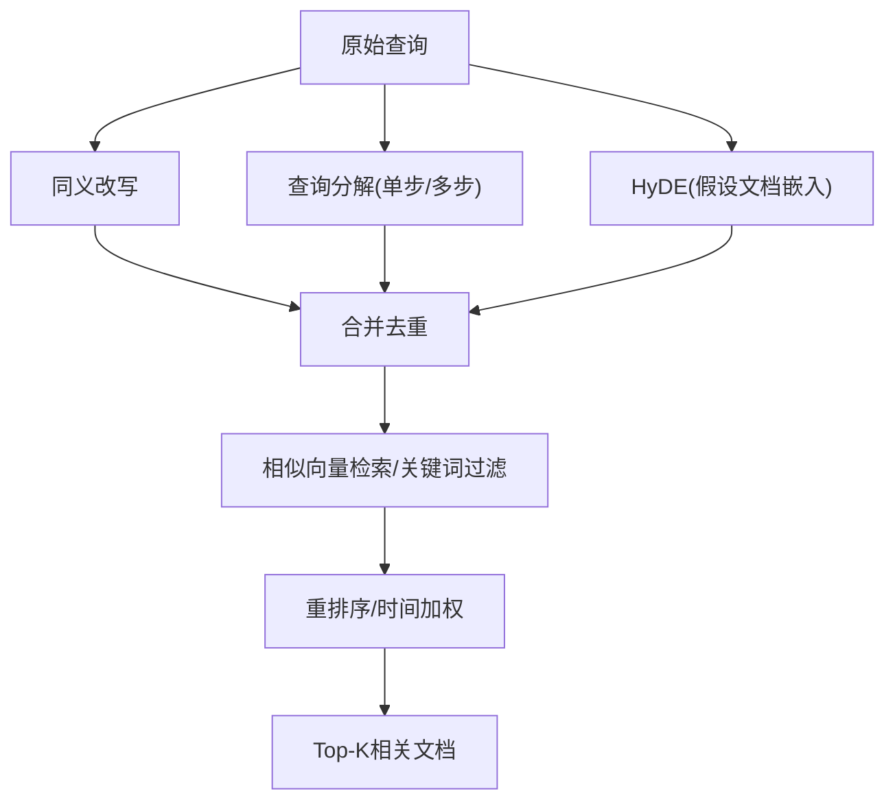
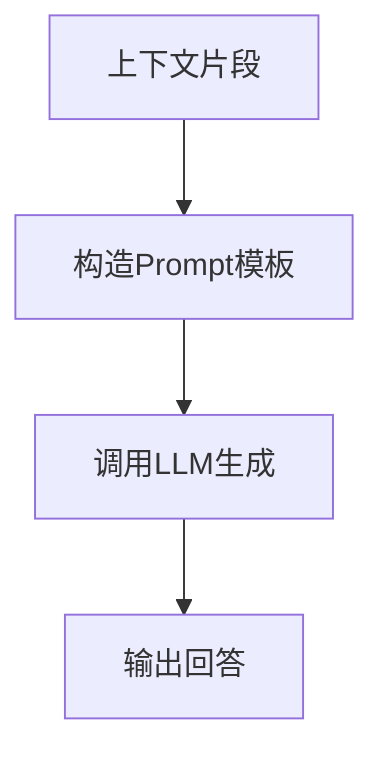
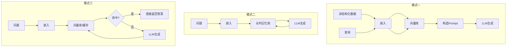
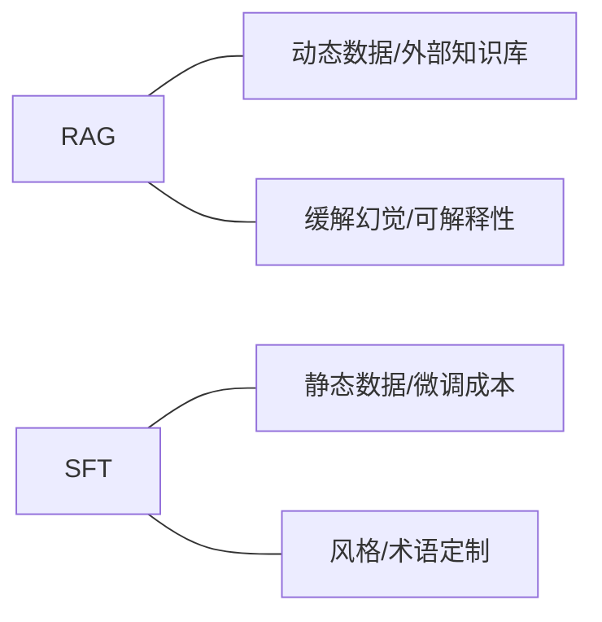
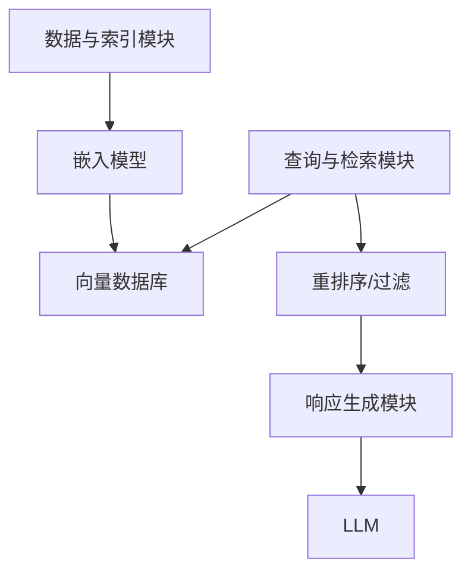

# RAG核心原理

<cite>
**本文引用的文件**
- [rag（检索增强生成）技术.md](file://08.检索增强rag/rag（检索增强生成）技术/rag（检索增强生成）技术.md)
- [检索增强llm.md](file://08.检索增强rag/检索增强llm/检索增强llm.md)
- [README.md](file://08.检索增强rag/README.md)
- [中级LLM_Agent工程师面试QA清单.md](file://ai_generataion/中级LLM_Agent工程师面试QA清单.md)
</cite>

## 目录
1. [简介](#简介)
2. [项目结构](#项目结构)
3. [核心组件](#核心组件)
4. [架构总览](#架构总览)
5. [详细组件分析](#详细组件分析)
6. [依赖分析](#依赖分析)
7. [性能考量](#性能考量)
8. [故障排查指南](#故障排查指南)
9. [结论](#结论)
10. [附录](#附录)

## 简介
本文件围绕检索增强生成（Retrieval-Augmented Generation, RAG）的核心原理与实现进行系统化技术文档编写。RAG通过将外部知识库与大语言模型（LLM）结合，使模型在回答问题时能够“检索—上下文构建—生成”三阶段协同工作，从而显著降低幻觉、提升时效性与可解释性。本文将从RAG的基本概念、解决的问题、关键模块、调用模式、与SFT的对比，以及流程图与代码示例路径等方面展开，帮助读者建立从输入查询到最终输出的完整认知闭环。

## 项目结构
本仓库中与RAG相关的主要文档集中在“08.检索增强rag”目录下，包含RAG基本概念与调用模式、检索增强LLM的系统化实现思路与模块拆分，以及一份关于RAG优化要点的面试问答清单。下图为与RAG主题相关的文件组织关系示意。

图表来源
- [README.md:1-14](file://08.检索增强rag/README.md#L1-L14)

章节来源
- [README.md:1-14](file://08.检索增强rag/README.md#L1-L14)

## 核心组件
RAG系统通常由以下三大核心模块构成：
- 数据与索引模块：负责将多源异构数据标准化为统一文档对象，进行分块与索引构建，支撑后续检索。
- 查询与检索模块：对用户查询进行变换与增强，执行高效检索，返回相关文档片段。
- 响应生成模块：将检索到的上下文整合到提示模板中，驱动LLM生成最终回答。

章节来源
- [检索增强llm.md:81-88](file://08.检索增强rag/检索增强llm/检索增强llm.md#L81-L88)

## 架构总览
RAG的典型工作流可概括为“检索—上下文构建—生成”。下图展示了从用户查询到最终输出的端到端流程。

图表来源
- [rag（检索增强生成）技术.md:47-57](file://08.检索增强rag/rag（检索增强生成）技术/rag（检索增强生成）技术.md#L47-L57)
- [检索增强llm.md:332-375](file://08.检索增强rag/检索增强llm/检索增强llm.md#L332-L375)

## 详细组件分析

### 1) 数据与索引模块
- 数据获取：将多源异构数据（文档、网页、API、本地文件等）统一为文档对象，附加元信息（时间戳、关键词、摘要等），便于检索与过滤。
- 文本分块：将长文本切分为适配上下文窗口与嵌入维度的片段，兼顾语义连贯与噪声过滤；支持按字符/标记计数、递归分层切分、结构化文本（代码、Markdown）特殊处理。
- 索引与向量检索：基于嵌入模型将文本映射为向量，存储于向量数据库；检索时对查询向量进行相似度计算，返回Top-K候选；可选关键词表、树索引等结构以提升效率与覆盖度。

图表来源
- [检索增强llm.md:89-180](file://08.检索增强rag/检索增强llm/检索增强llm.md#L89-L180)

章节来源
- [检索增强llm.md:89-180](file://08.检索增强rag/检索增强llm/检索增强llm.md#L89-L180)

### 2) 查询与检索模块
- 查询变换：通过同义改写、查询分解（单步/多步）、HyDE（假设文档嵌入）等方式增强检索覆盖面与准确性。
- 排序与后处理：基于相似度、关键词过滤、时间加权、LLM重排序等策略筛选候选，提升相关性与可解释性。

图表来源
- [检索增强llm.md:332-375](file://08.检索增强rag/检索增强llm/检索增强llm.md#L332-L375)

章节来源
- [检索增强llm.md:332-375](file://08.检索增强rag/检索增强llm/检索增强llm.md#L332-L375)

### 3) 响应生成模块
- Prompt模板：将检索到的上下文与原始问题拼接，指示LLM结合上下文与自身知识生成回答；可选“逐步修正”的模板以迭代优化。
- 生成策略：一次性将多段上下文放入Prompt，或逐段增量生成并修正；根据上下文长度与成本控制选择不同策略。

图表来源
- [检索增强llm.md:376-413](file://08.检索增强rag/检索增强llm/检索增强llm.md#L376-L413)

章节来源
- [检索增强llm.md:376-413](file://08.检索增强rag/检索增强llm/检索增强llm.md#L376-L413)

### 4) RAG调用模式
- 模式一：非结构化数据经嵌入存入向量库，用户查询向量化后检索，构造Prompt交给LLM。
- 模式二：问题与回答均向量化并持久化至长时记忆库，形成“问题—答案”缓存。
- 模式三：查询命中缓存则直接返回，未命中则与LLM交互并将回答写回缓存。

图表来源
- [rag（检索增强生成）技术.md:47-57](file://08.检索增强rag/rag（检索增强生成）技术/rag（检索增强生成）技术.md#L47-L57)

章节来源
- [rag（检索增强生成）技术.md:47-57](file://08.检索增强rag/rag（检索增强生成）技术/rag（检索增强生成）技术.md#L47-L57)

### 5) RAG vs. SFT（有监督微调）
- 数据新鲜度：RAG可动态查询外部源，无需频繁重训；SFT对动态数据易过时。
- 外部知识库：RAG擅长整合外部资源；SFT更易定制风格与领域知识。
- 幻觉缓解：RAG回答建立在检索证据之上，天然更不易幻觉；SFT在未知输入仍可能幻觉。
- 透明度：RAG阶段化检索与匹配提升可解释性；SFT更像黑盒。
- 相关技术：RAG需高效检索与数据库技术；SFT需高质量数据集与计算资源。

图表来源
- [rag（检索增强生成）技术.md:59-73](file://08.检索增强rag/rag（检索增强生成）技术/rag（检索增强生成）技术.md#L59-L73)

章节来源
- [rag（检索增强生成）技术.md:59-73](file://08.检索增强rag/rag（检索增强生成）技术/rag（检索增强生成）技术.md#L59-L73)

### 6) 优化要点与实践建议
- 文档分块策略：语义边界检测、重叠窗口，避免破坏上下文连贯性。
- 多向量检索：标题+内容+摘要联合嵌入，提升召回质量。
- 重排序（Re-ranking）：引入更精细的排序模型，结合语义与相关性。
- 查询扩展与改写：同义改写、查询分解、HyDE等策略扩大覆盖面。
- 多跳检索（Multi-hop）：复杂问题需跨步检索与聚合。
- 用户反馈：引入人工标注与点击反馈，持续优化检索模型。

章节来源
- [中级LLM_Agent工程师面试QA清单.md:114-131](file://ai_generataion/中级LLM_Agent工程师面试QA清单.md#L114-L131)

## 依赖分析
RAG系统的关键依赖关系如下：
- 数据与索引模块依赖嵌入模型与向量数据库；检索模块依赖索引与相似度计算；生成模块依赖LLM与Prompt模板。
- 查询变换与重排序模块对检索质量有直接影响，进而影响生成阶段的准确性与可解释性。

图表来源
- [检索增强llm.md:89-180](file://08.检索增强rag/检索增强llm/检索增强llm.md#L89-L180)
- [检索增强llm.md:332-375](file://08.检索增强rag/检索增强llm/检索增强llm.md#L332-L375)
- [检索增强llm.md:376-413](file://08.检索增强rag/检索增强llm/检索增强llm.md#L376-L413)

章节来源
- [检索增强llm.md:89-180](file://08.检索增强rag/检索增强llm/检索增强llm.md#L89-L180)
- [检索增强llm.md:332-375](file://08.检索增强rag/检索增强llm/检索增强llm.md#L332-L375)
- [检索增强llm.md:376-413](file://08.检索增强rag/检索增强llm/检索增强llm.md#L376-L413)

## 性能考量
- 上下文窗口与成本：上下文越长，推理成本越高；通过检索精选相关片段可降低成本。
- 相似度检索效率：小规模向量可用Numpy实现；大规模向量可采用Faiss等近似最近邻库；向量数据库提供托管与扩展能力。
- 分块策略：块大小与重叠需权衡召回与连贯性；分块过大可能超上下文限制，过小会增加检索与拼接复杂度。
- 重排序与后处理：在保证相关性的前提下尽量减少LLM调用次数，以降低延迟与费用。

章节来源
- [检索增强llm.md:73-79](file://08.检索增强rag/检索增强llm/检索增强llm.md#L73-L79)
- [检索增强llm.md:241-287](file://08.检索增强rag/检索增强llm/检索增强llm.md#L241-L287)

## 故障排查指南
- 检索命中率低：检查分块策略、嵌入维度与相似度阈值；尝试查询改写与多跳检索；引入重排序。
- 上下文过长：缩短单段上下文或采用分段生成策略；控制Prompt长度以适应模型上下文窗口。
- 幻觉与不可解释：优先使用检索证据驱动回答；在Prompt中明确指示“若上下文无帮助则不回答”；引入可解释性标注与溯源。
- 向量检索性能瓶颈：评估候选规模与索引类型；在CPU/GPU间选择合适实现；必要时引入缓存与预取策略。

章节来源
- [检索增强llm.md:366-375](file://08.检索增强rag/检索增强llm/检索增强llm.md#L366-L375)
- [检索增强llm.md:384-413](file://08.检索增强rag/检索增强llm/检索增强llm.md#L384-L413)

## 结论
RAG通过“检索—上下文构建—生成”的三阶段协同，有效缓解了LLM的幻觉、私有数据泄露与数据新鲜度等问题，同时提升了可解释性与可控性。实践中应重视数据与索引质量、查询变换与重排序策略、Prompt设计与生成策略的组合优化，并结合向量数据库与相似度检索技术实现高效稳定的端到端系统。

## 附录
- 代码示例路径（仅提供路径，不展示具体代码内容）：
  - 文本分块与嵌入示例：[langchain文本分块示例:150-179](file://08.检索增强rag/检索增强llm/检索增强llm.md#L150-L179)
  - 向量相似度检索（Numpy）示例：[相似向量检索示例:249-261](file://08.检索增强rag/检索增强llm/检索增强llm.md#L249-L261)
  - 向量数据库（Pinecone）示例：[向量数据库操作示例:288-330](file://08.检索增强rag/检索增强llm/检索增强llm.md#L288-L330)
  - 生成Prompt模板示例：[Prompt模板示例:388-412](file://08.检索增强rag/检索增强llm/检索增强llm.md#L388-L412)
  - ChatGPT检索插件接口说明：[插件接口说明:422-427](file://08.检索增强rag/检索增强llm/检索增强llm.md#L422-L427)