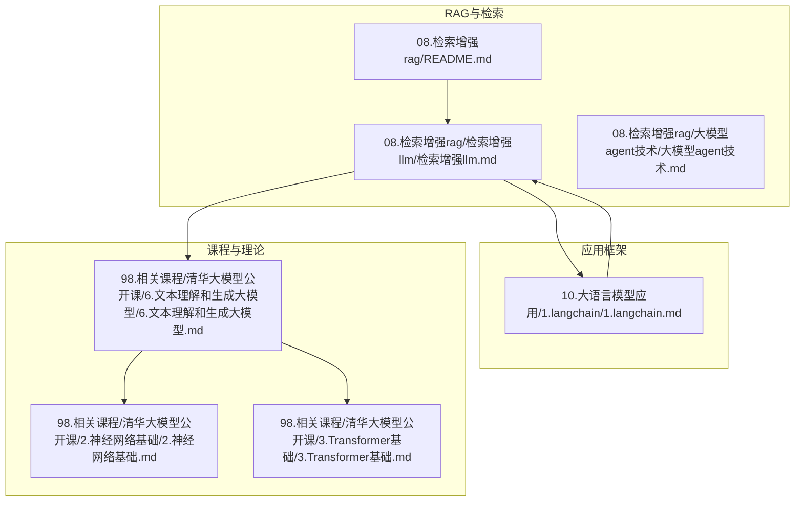
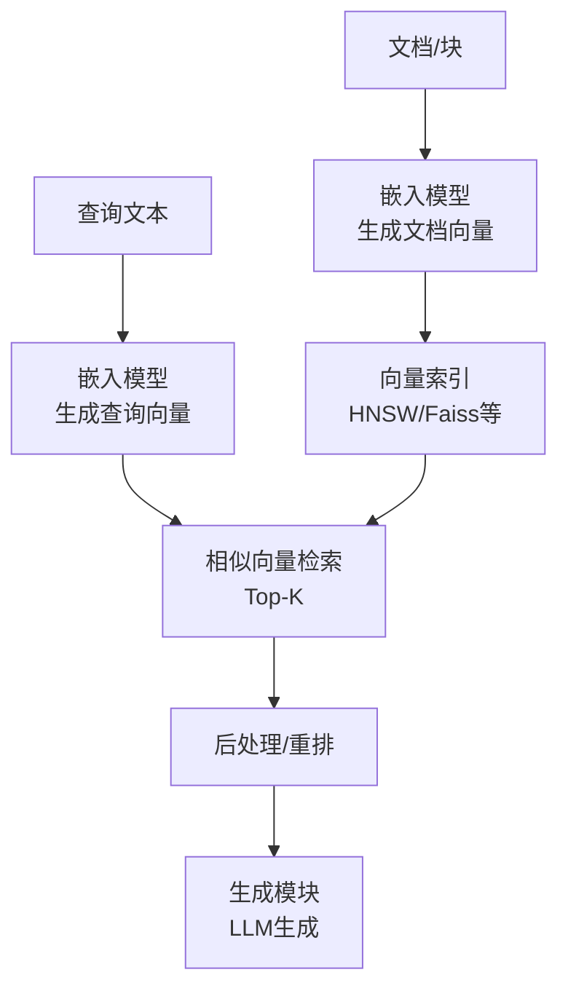
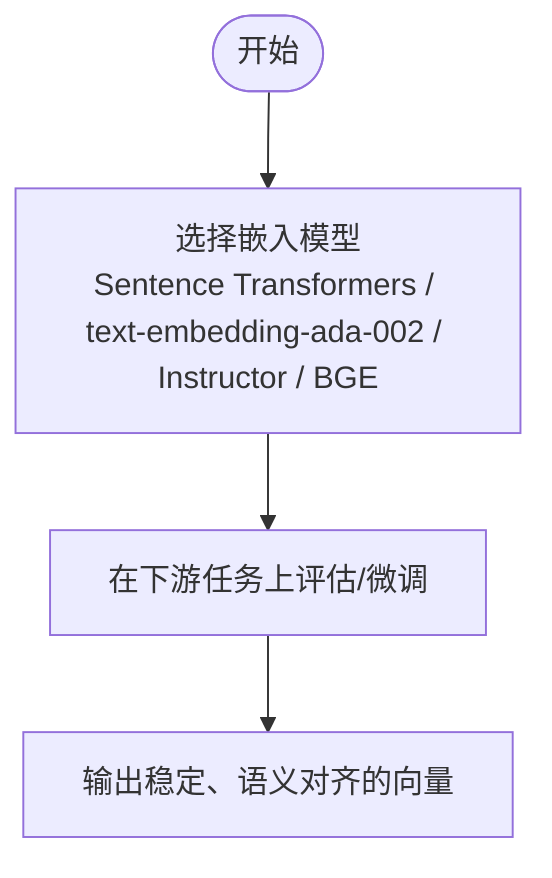
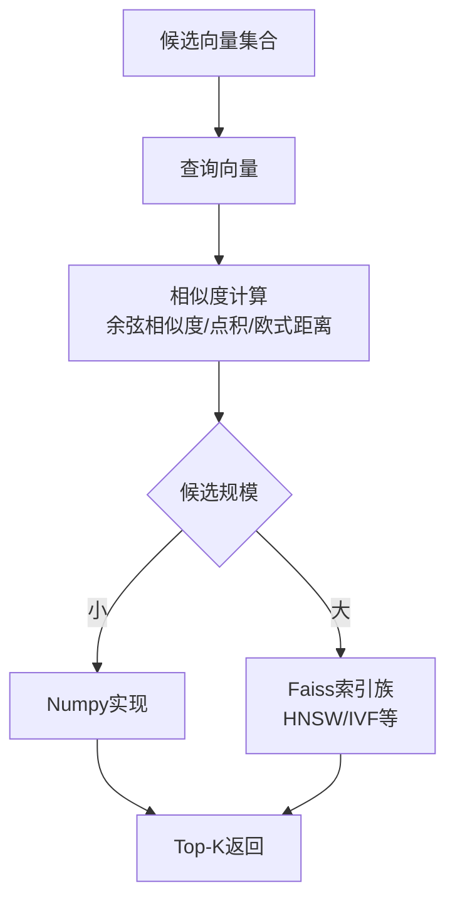
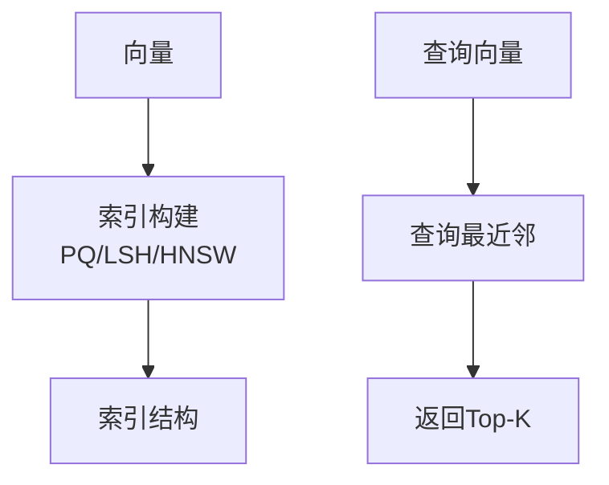
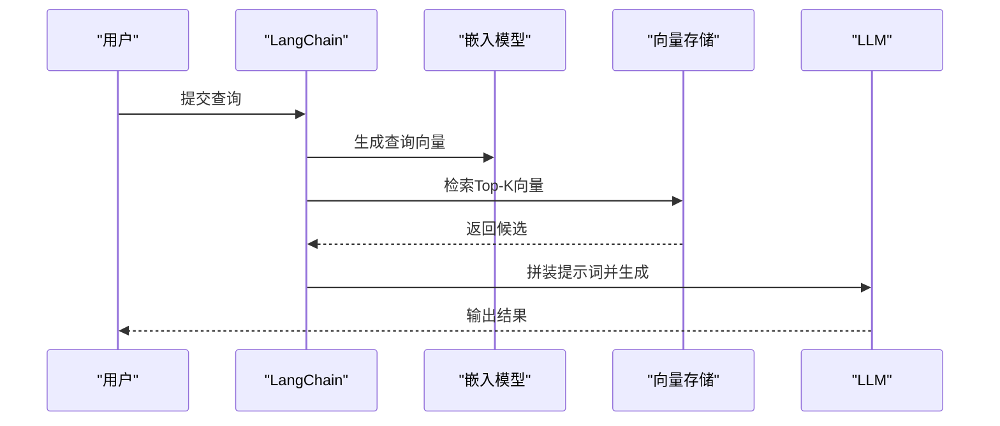
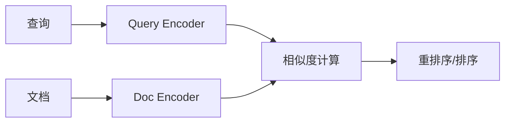
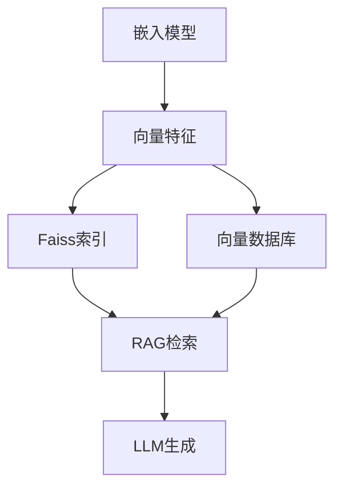

# 向量数据库应用

<cite>
**本文引用的文件**
- [检索增强llm.md](file://08.检索增强rag/检索增强llm/检索增强llm.md)
- [README.md](file://08.检索增强rag/README.md)
- [6.文本理解和生成大模型.md](file://98.相关课程/清华大模型公开课/6.文本理解和生成大模型/6.文本理解和生成大模型.md)
- [2.神经网络基础.md](file://98.相关课程/清华大模型公开课/2.神经网络基础/2.神经网络基础.md)
- [3.Transformer基础.md](file://98.相关课程/清华大模型公开课/3.Transformer基础/3.Transformer基础.md)
- [1.langchain.md](file://10.大语言模型应用/1.langchain/1.langchain.md)
</cite>

## 目录
1. [引言](#引言)
2. [项目结构](#项目结构)
3. [核心组件](#核心组件)
4. [架构总览](#架构总览)
5. [详细组件分析](#详细组件分析)
6. [依赖分析](#依赖分析)
7. [性能考量](#性能考量)
8. [故障排查指南](#故障排查指南)
9. [结论](#结论)
10. [附录](#附录)

## 引言
本技术文档围绕向量数据库在检索增强生成（RAG）中的应用展开，系统阐述向量数据库的基本概念、数据结构与存储方式，深入解析向量相似度计算方法（余弦相似度、点积、欧式距离等），并结合仓库中已有内容，梳理向量索引技术（如HNSW、Faiss索引族）在大规模向量检索中的性能优势。同时，提供向量嵌入模型的选择指南（预训练模型与自定义训练思路），并给出实现示例与性能优化建议，帮助读者在RAG系统中高效落地向量检索能力。

## 项目结构
本仓库与向量数据库和RAG相关的核心内容主要分布在“检索增强rag”“大语言模型应用”“相关课程”等目录中。下图给出与向量数据库、RAG、嵌入模型、索引与检索相关的文件与模块关系概览。

图表来源
- [README.md:1-14](file://08.检索增强rag/README.md#L1-L14)
- [检索增强llm.md:1-526](file://08.检索增强rag/检索增强llm/检索增强llm.md#L1-L526)
- [1.langchain.md:1-500](file://10.大语言模型应用/1.langchain/1.langchain.md#L1-L500)
- [6.文本理解和生成大模型.md:1-595](file://98.相关课程/清华大模型公开课/6.文本理解和生成大模型/6.文本理解和生成大模型.md#L1-L595)
- [2.神经网络基础.md:1-534](file://98.相关课程/清华大模型公开课/2.神经网络基础/2.神经网络基础.md#L1-L534)
- [3.Transformer基础.md:1-394](file://98.相关课程/清华大模型公开课/3.Transformer基础/3.Transformer基础.md#L1-L394)

章节来源
- [README.md:1-14](file://08.检索增强rag/README.md#L1-L14)
- [检索增强llm.md:1-526](file://08.检索增强rag/检索增强llm/检索增强llm.md#L1-L526)
- [1.langchain.md:1-500](file://10.大语言模型应用/1.langchain/1.langchain.md#L1-L500)
- [6.文本理解和生成大模型.md:1-595](file://98.相关课程/清华大模型公开课/6.文本理解和生成大模型/6.文本理解和生成大模型.md#L1-L595)
- [2.神经网络基础.md:1-534](file://98.相关课程/清华大模型公开课/2.神经网络基础/2.神经网络基础.md#L1-L534)
- [3.Transformer基础.md:1-394](file://98.相关课程/清华大模型公开课/3.Transformer基础/3.Transformer基础.md#L1-L394)

## 核心组件
- 文本嵌入模型：将非结构化文本映射为稠密向量，支撑RAG检索与生成。仓库中列举了多种可用模型与评估榜单。
- 相似向量检索：在候选向量集中，基于相似度度量（余弦相似度、点积、欧式距离等）高效检索最相似向量。
- 向量索引与数据库：对向量进行索引（如HNSW、Faiss索引族）并提供向量数据库服务，支撑大规模检索与后处理。
- 应用框架与集成：LangChain等框架提供向量存储、检索与提示词模板集成，便于快速搭建RAG系统。

章节来源
- [检索增强llm.md:213-330](file://08.检索增强rag/检索增强llm/检索增强llm.md#L213-L330)
- [1.langchain.md:100-360](file://10.大语言模型应用/1.langchain/1.langchain.md#L100-L360)

## 架构总览
下图展示RAG系统中向量数据库的典型数据流：文本分块与嵌入、向量入库与索引、查询向量化与相似检索、后处理与生成。

图表来源
- [检索增强llm.md:213-286](file://08.检索增强rag/检索增强llm/检索增强llm.md#L213-L286)
- [6.文本理解和生成大模型.md:148-202](file://98.相关课程/清华大模型公开课/6.文本理解和生成大模型/6.文本理解和生成大模型.md#L148-L202)

## 详细组件分析

### 文本嵌入模型
- 作用：将文本映射为稠密向量，支撑检索与生成。
- 选择要点：不同模型在不同任务与语种上的表现不同，需结合下游任务与数据域进行评估与微调。
- 仓库中列举的模型与评估资源：Sentence Transformers、text-embedding-ada-002、Instructor、BGE等，并提供MTEB榜单参考。

图表来源
- [检索增强llm.md:229-239](file://08.检索增强rag/检索增强llm/检索增强llm.md#L229-L239)

章节来源
- [检索增强llm.md:223-239](file://08.检索增强rag/检索增强llm/检索增强llm.md#L223-L239)

### 相似向量检索与度量
- 相似度度量：余弦相似度、点积、欧式距离、汉明距离等。仓库中明确指出通常可直接使用余弦相似度。
- 小规模向量：可使用Numpy实现，简单高效；大规模向量：推荐Faiss等高性能库。
- 仓库中提供了Numpy实现思路与Faiss索引族的对比参考。

图表来源
- [检索增强llm.md:241-267](file://08.检索增强rag/检索增强llm/检索增强llm.md#L241-L267)

章节来源
- [检索增强llm.md:241-267](file://08.检索增强rag/检索增强llm/检索增强llm.md#L241-L267)

### 向量索引与数据库
- 索引算法：乘积量化（PQ）、局部敏感哈希（LSH）、HNSW等，用于加速最近邻搜索。
- 数据库能力：托管与备份、数据管理（插入/删除/更新）、元数据存储、可扩展性（垂直/水平）。
- 仓库中列举了Pinecone、Vespa、Weaviate、Milvus、Chroma、Tencent Cloud VectorDB等向量数据库。

图表来源
- [检索增强llm.md:269-286](file://08.检索增强rag/检索增强llm/检索增强llm.md#L269-L286)

章节来源
- [检索增强llm.md:269-286](file://08.检索增强rag/检索增强llm/检索增强llm.md#L269-L286)

### 应用框架与集成（LangChain）
- 向量存储：与Chroma、FAISS、Lance等向量数据库集成，支持嵌入生成、向量保存与检索。
- RAG流程：数据加载→分块→嵌入→向量存储→检索→提示词模板→LLM生成。

图表来源
- [1.langchain.md:100-360](file://10.大语言模型应用/1.langchain/1.langchain.md#L100-L360)

章节来源
- [1.langchain.md:100-360](file://10.大语言模型应用/1.langchain/1.langchain.md#L100-L360)

### 神经网络与向量检索的理论基础
- 神经网络IR：将查询与文档映射到同一向量空间，计算相关性分数，避免词汇与语义失配。
- 双塔架构（Dual-Encoder）：独立编码查询与文档，缓存文档向量，查询时用Faiss等工具检索。
- Cross-Encoder：拼接查询与文档进行精细交互式建模，适合重排序阶段。

图表来源
- [6.文本理解和生成大模型.md:148-202](file://98.相关课程/清华大模型公开课/6.文本理解和生成大模型/6.文本理解和生成大模型.md#L148-L202)

章节来源
- [6.文本理解和生成大模型.md:148-202](file://98.相关课程/清华大模型公开课/6.文本理解和生成大模型/6.文本理解和生成大模型.md#L148-L202)

## 依赖分析
- 模型依赖：嵌入模型（Sentence Transformers、text-embedding-ada-002、Instructor、BGE）与下游任务评估（MTEB）。
- 索引与检索：Faiss索引族（HNSW/IVF等）与向量数据库（Pinecone、Milvus、Chroma等）。
- 应用框架：LangChain与向量存储的集成，支撑RAG端到端流程。

图表来源
- [检索增强llm.md:229-286](file://08.检索增强rag/检索增强llm/检索增强llm.md#L229-L286)
- [1.langchain.md:100-360](file://10.大语言模型应用/1.langchain/1.langchain.md#L100-L360)

章节来源
- [检索增强llm.md:229-286](file://08.检索增强rag/检索增强llm/检索增强llm.md#L229-L286)
- [1.langchain.md:100-360](file://10.大语言模型应用/1.langchain/1.langchain.md#L100-L360)

## 性能考量
- 候选规模与实现选择：小规模（数万量级）可用Numpy；大规模需使用Faiss等高性能库。
- 索引算法权衡：HNSW适合高召回与中等延迟；IVF适合高吞吐与可调延迟；PQ/LSH适合超大规模与低内存占用。
- 向量维度与相似度：维度越高，距离集中现象越明显，建议对向量进行归一化或使用余弦相似度。
- 向量数据库选型：根据数据量、写入/查询负载、扩展性与运维成本选择Pinecone、Milvus、Chroma等。
- 检索后处理：结合时间过滤、关键词过滤、LLM重排等方式提升相关性与稳定性。

章节来源
- [检索增强llm.md:241-286](file://08.检索增强rag/检索增强llm/检索增强llm.md#L241-L286)

## 故障排查指南
- 相似度异常：检查向量归一化、维度一致性与相似度度量选择；确认候选规模与实现方案匹配。
- 索引构建失败：核对维度、索引参数与硬件资源；优先使用Faiss CPU实现验证流程，再迁移至GPU。
- 向量数据库连接问题：确认API密钥、环境配置与索引维度一致；检查写入/查询接口参数。
- 生成质量不稳定：增加重排阶段（Cross-Encoder）或引入LLM二次排序；优化提示词模板与上下文拼接。

章节来源
- [检索增强llm.md:269-330](file://08.检索增强rag/检索增强llm/检索增强llm.md#L269-L330)

## 结论
向量数据库在RAG中扮演“检索增强”的关键角色：通过嵌入模型将文本映射为向量，借助HNSW、Faiss等索引与向量数据库实现高效相似检索，并在生成阶段提升答案的准确性与可解释性。结合仓库中的内容，建议在模型选择上以MTEB评估为参考，结合下游任务进行微调；在索引与数据库层面，依据数据规模与性能目标选择合适方案；在应用层面，利用LangChain等框架快速集成向量存储与检索，形成稳定的RAG流水线。

## 附录
- 嵌入模型选择与评估：参考仓库中对Sentence Transformers、text-embedding-ada-002、Instructor、BGE的介绍与MTEB榜单。
- 神经网络IR与双塔架构：参考课程资料中关于Dual-Encoder与Cross-Encoder的讲解。
- Transformer与注意力机制：为理解嵌入模型与检索机制提供理论基础。

章节来源
- [检索增强llm.md:229-239](file://08.检索增强rag/检索增强llm/检索增强llm.md#L229-L239)
- [6.文本理解和生成大模型.md:148-202](file://98.相关课程/清华大模型公开课/6.文本理解和生成大模型/6.文本理解和生成大模型.md#L148-L202)
- [3.Transformer基础.md:174-233](file://98.相关课程/清华大模型公开课/3.Transformer基础/3.Transformer基础.md#L174-L233)