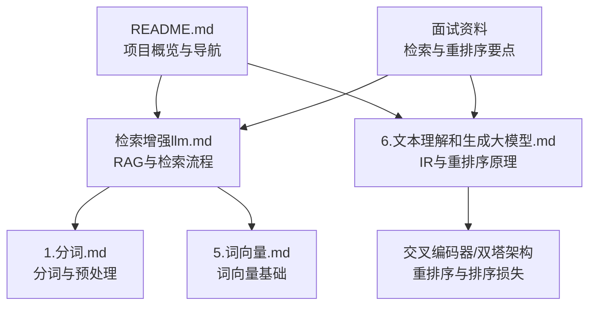
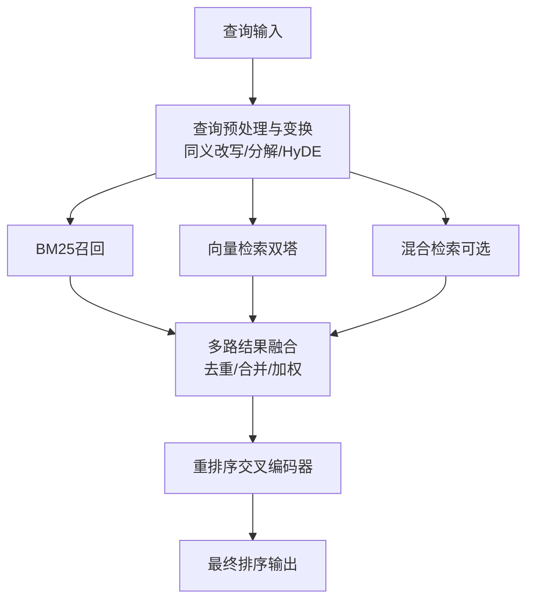
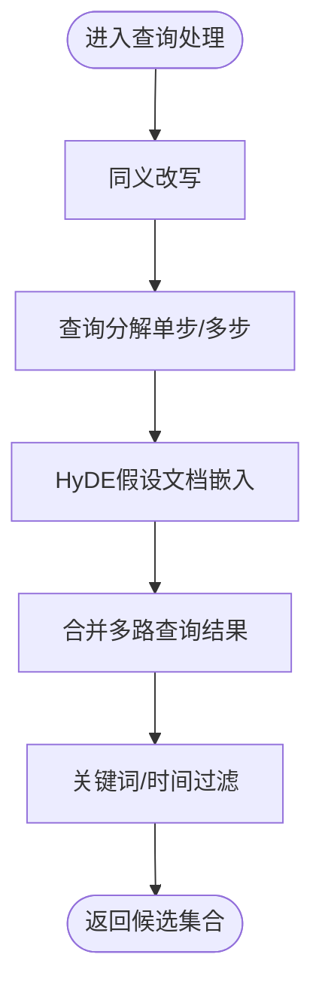
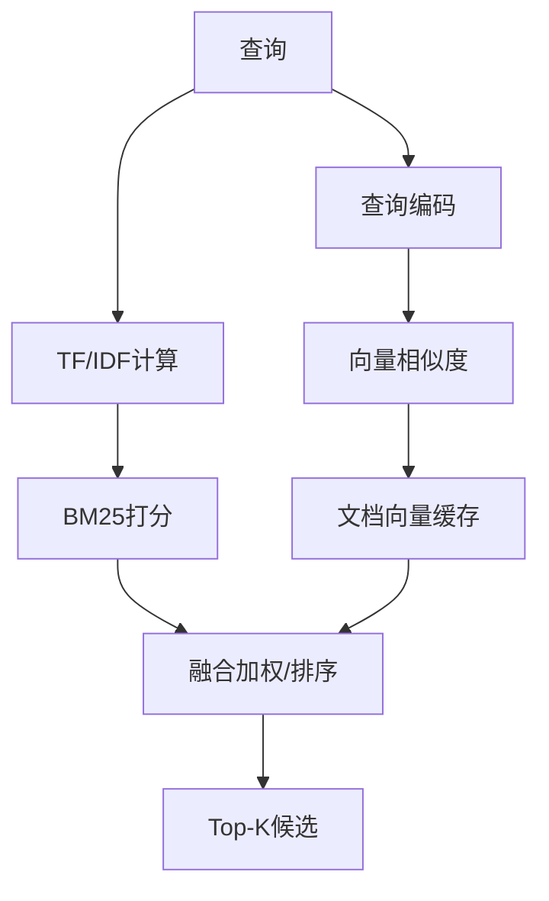
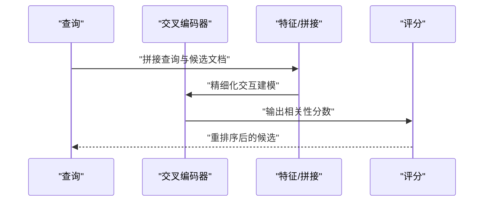
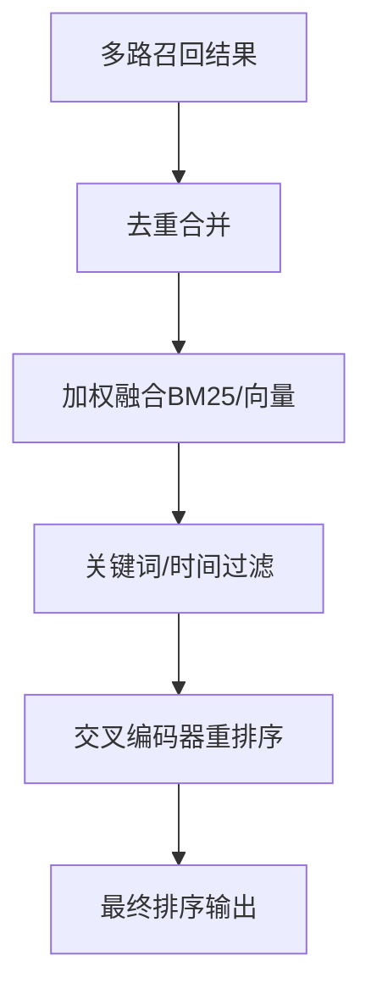
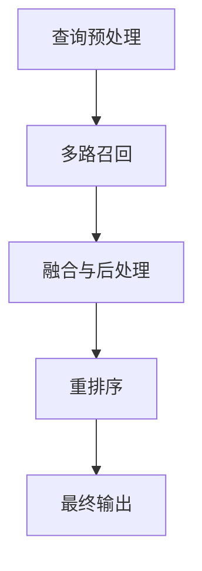

# 多路召回与重排序

<cite>
**本文引用的文件**
- [README.md](file://README.md)
- [检索增强llm.md](file://08.检索增强rag/检索增强llm/检索增强llm.md)
- [6.文本理解和生成大模型.md](file://98.相关课程/清华大模型公开课/6.文本理解和生成大模型/6.文本理解和生成大模型.md)
- [1.分词.md](file://01.大语言模型基础/1.分词/1.分词.md)
- [5.词向量.md](file://01.大语言模型基础/5.词向量/5.词向量.md)
- [中级LLM_Agent工程师面试QA清单.md](file://ai_generataion/中级LLM_Agent工程师面试QA清单.md)
- [中级LLM_Agent工程师面试QA清单_完整版.md](file://ai_generataion/中级LLM_Agent工程师面试QA清单_完整版.md)
- [中级LLM_Agent工程师面试_快速参考.md](file://ai_generataion/中级LLM_Agent工程师面试_快速参考.md)
</cite>

## 目录
1. [引言](#引言)
2. [项目结构](#项目结构)
3. [核心组件](#核心组件)
4. [架构总览](#架构总览)
5. [详细组件分析](#详细组件分析)
6. [依赖分析](#依赖分析)
7. [性能考量](#性能考量)
8. [故障排查指南](#故障排查指南)
9. [结论](#结论)
10. [附录](#附录)

## 引言
本技术文档围绕“多路召回与重排序”展开，系统阐述多路召回策略（如BM25、向量检索、混合检索）与重排序技术（交叉编码器、rerank模型、排序损失）的设计原理与工程实现要点。文档结合仓库中检索增强与神经IR相关材料，给出查询预处理、多路结果融合与最终排序的完整流程，并提供性能评估指标与调优方法，帮助读者在不同查询类型与业务场景下选择合适的召回策略与重排序方案。

## 项目结构
本仓库以知识笔记为主，检索增强与重排序相关内容主要分布在以下文件：
- 检索增强与RAG：08.检索增强rag/检索增强llm/检索增强llm.md
- 神经IR与重排序：98.相关课程/清华大模型公开课/6.文本理解和生成大模型/6.文本理解和生成大模型.md
- 分词与词向量基础：01.大语言模型基础/1.分词/1.分词.md、01.大语言模型基础/5.词向量/5.词向量.md
- 面试资料中的检索与重排序要点：ai_generataion/中级LLM_Agent工程师面试QA清单*.md

图表来源
- [README.md:1-169](file://README.md#L1-L169)
- [检索增强llm.md:1-526](file://08.检索增强rag/检索增强llm/检索增强llm.md#L1-L526)
- [6.文本理解和生成大模型.md:1-595](file://98.相关课程/清华大模型公开课/6.文本理解和生成大模型/6.文本理解和生成大模型.md#L1-L595)
- [1.分词.md:1-85](file://01.大语言模型基础/1.分词/1.分词.md#L1-L85)
- [5.词向量.md:1-307](file://01.大语言模型基础/5.词向量/5.词向量.md#L1-L307)

章节来源
- [README.md:1-169](file://README.md#L1-L169)

## 核心组件
- 查询预处理与变换
  - 同义改写、查询分解（单步/多步）、HyDE（假设文档嵌入）
  - 关键词过滤、时间过滤与加权
- 多路召回
  - BM25（基于词频与逆文档频率）
  - 向量检索（双塔/交叉编码器）
  - 混合检索（多路融合）
- 重排序
  - 交叉编码器（Cross-Encoder）精细化交互建模
  - 排序损失（如Pairwise Hinge Loss）
- 结果后处理与排序
  - 基于相似度分数过滤与排序
  - 基于时间与关键词的二次筛选

章节来源
- [检索增强llm.md:332-380](file://08.检索增强rag/检索增强llm/检索增强llm.md#L332-L380)
- [6.文本理解和生成大模型.md:115-202](file://98.相关课程/清华大模型公开课/6.文本理解和生成大模型/6.文本理解和生成大模型.md#L115-L202)

## 架构总览
下图展示从查询到最终排序的端到端流程，强调检索与重排序的两阶段分工与多路召回融合。

图表来源
- [检索增强llm.md:332-380](file://08.检索增强rag/检索增强llm/检索增强llm.md#L332-L380)
- [6.文本理解和生成大模型.md:159-176](file://98.相关课程/清华大模型公开课/6.文本理解和生成大模型/6.文本理解和生成大模型.md#L159-L176)

## 详细组件分析

### 查询预处理与变换
- 同义改写：将原始查询改写为语义等价的不同表达，扩大候选集合。
- 查询分解：单步/多步分解，逐步生成子查询，结合前一步回复迭代生成。
- HyDE：先用LLM生成假设文档，再以该假设作为查询进行检索。
- 过滤与排序：基于相似度、关键词、时间等进行二次筛选。

图表来源
- [检索增强llm.md:338-364](file://08.检索增强rag/检索增强llm/检索增强llm.md#L338-L364)

章节来源
- [检索增强llm.md:332-380](file://08.检索增强rag/检索增强llm/检索增强llm.md#L332-L380)

### 多路召回策略
- BM25
  - 基于TF/IDF的词级匹配，适合快速召回与覆盖广泛词汇。
  - 存在词汇失配与语义失配问题。
- 向量检索（双塔）
  - 使用独立编码器对查询与文档编码，计算向量相似度，适合大规模语义召回。
  - 可离线缓存文档向量，查询时仅需计算查询向量。
- 混合检索
  - 融合BM25与向量检索结果，兼顾速度与语义覆盖。

图表来源
- [6.文本理解和生成大模型.md:115-164](file://98.相关课程/清华大模型公开课/6.文本理解和生成大模型/6.文本理解和生成大模型.md#L115-L164)

章节来源
- [6.文本理解和生成大模型.md:115-164](file://98.相关课程/清华大模型公开课/6.文本理解和生成大模型/6.文本理解和生成大模型.md#L115-L164)

### 重排序技术
- 交叉编码器（Cross-Encoder）
  - 将查询与文档拼接后进行精细化交互建模，生成查询-文档共同表示与相关性分数。
  - 适合重排序阶段，性能优于检索阶段但计算代价较高。
- 排序损失
  - 常用Pairwise Hinge Loss等，训练时为相关文档分配更高分数。
- 双塔（DPR）与交叉编码器协同
  - 双塔用于快速检索，交叉编码器用于精排，形成“粗排+精排”的两阶段流水线。

图表来源
- [6.文本理解和生成大模型.md:166-181](file://98.相关课程/清华大模型公开课/6.文本理解和生成大模型/6.文本理解和生成大模型.md#L166-L181)

章节来源
- [6.文本理解和生成大模型.md:166-181](file://98.相关课程/清华大模型公开课/6.文本理解和生成大模型/6.文本理解和生成大模型.md#L166-L181)

### 多路结果融合与最终排序
- 融合策略
  - 去重合并：对多路召回结果进行去重与合并。
  - 加权融合：对BM25与向量检索结果赋予不同权重，综合排序。
  - 时间/关键词过滤：对候选集合进行二次筛选。
- 最终排序
  - 交叉编码器对候选进行精排，输出最终排序结果。

图表来源
- [检索增强llm.md:366-375](file://08.检索增强rag/检索增强llm/检索增强llm.md#L366-L375)
- [6.文本理解和生成大模型.md:159-176](file://98.相关课程/清华大模型公开课/6.文本理解和生成大模型/6.文本理解和生成大模型.md#L159-L176)

章节来源
- [检索增强llm.md:366-375](file://08.检索增强rag/检索增强llm/检索增强llm.md#L366-L375)

## 依赖分析
- 组件耦合
  - 查询预处理与多路召回：预处理质量直接影响召回效果。
  - 双塔与交叉编码器：双塔负责粗排，交叉编码器负责精排，两者在数据流上串联。
  - 融合与后处理：融合策略与过滤规则对最终排序稳定性与覆盖率有显著影响。
- 外部依赖
  - 向量相似度检索：可使用Faiss等库实现高效近似最近邻搜索。
  - 向量数据库：Pinecone/Weaviate/Milvus等提供向量索引与查询能力。
- 潜在循环依赖
  - 本仓库未见循环依赖迹象，检索与重排序模块职责清晰。

图表来源
- [检索增强llm.md:332-380](file://08.检索增强rag/检索增强llm/检索增强llm.md#L332-L380)
- [6.文本理解和生成大模型.md:159-176](file://98.相关课程/清华大模型公开课/6.文本理解和生成大模型/6.文本理解和生成大模型.md#L159-L176)

章节来源
- [检索增强llm.md:332-380](file://08.检索增强rag/检索增强llm/检索增强llm.md#L332-L380)
- [6.文本理解和生成大模型.md:159-176](file://98.相关课程/清华大模型公开课/6.文本理解和生成大模型/6.文本理解和生成大模型.md#L159-L176)

## 性能考量
- 指标体系
  - MRR@k、MAP@k、NDCG@k：衡量排序质量与相关性分布。
- 评估与调优
  - 召回阶段：优先提升召回覆盖率与速度，可采用BM25与向量检索的混合策略。
  - 重排阶段：以交叉编码器为主，结合排序损失训练，提升精排效果。
  - 融合策略：通过网格搜索或贝叶斯优化确定BM25与向量检索的权重。
  - 过滤策略：基于关键词与时间的二次筛选，平衡相关性与时效性。
- 工程优化
  - 向量检索：使用Faiss/HNSW等索引库，合理设置维度与索引类型。
  - 缓存策略：对文档向量进行离线缓存，减少在线计算开销。
  - 并行化：预处理、向量编码、相似度计算与重排序可并行执行。

章节来源
- [6.文本理解和生成大模型.md:68-113](file://98.相关课程/清华大模型公开课/6.文本理解和生成大模型/6.文本理解和生成大模型.md#L68-L113)
- [检索增强llm.md:241-290](file://08.检索增强rag/检索增强llm/检索增强llm.md#L241-L290)

## 故障排查指南
- 常见问题
  - 召回质量差：检查预处理是否充分（同义改写/分解/HyDE），确认BM25与向量检索参数设置。
  - 重排耗时长：确认交叉编码器批处理大小与设备资源，必要时降低top-k或启用缓存。
  - 融合冲突：去重策略不当导致信息丢失，建议采用基于内容指纹的去重与加权融合。
  - 过滤误伤：关键词过滤过于严格，建议动态阈值与可配置开关。
- 调试建议
  - 增加中间结果日志（候选数量、相似度分布、重排分数分布）。
  - 对比不同融合权重与过滤规则的指标变化，定位瓶颈。
  - 使用小规模数据集进行端到端回归测试，确保流程稳定。

章节来源
- [检索增强llm.md:366-375](file://08.检索增强rag/检索增强llm/检索增强llm.md#L366-L375)
- [6.文本理解和生成大模型.md:159-176](file://98.相关课程/清华大模型公开课/6.文本理解和生成大模型/6.文本理解和生成大模型.md#L159-L176)

## 结论
多路召回与重排序是现代检索系统的核心。通过BM25与向量检索的组合，结合查询预处理与多路融合策略，能够在速度与语义覆盖之间取得平衡；在重排序阶段采用交叉编码器与排序损失，可显著提升最终排序质量。结合合理的评估指标与工程优化手段，可在不同查询类型与业务场景下实现稳定高效的检索与重排序。

## 附录
- 相关面试要点（来自仓库面试资料）
  - 多向量检索：标题+内容+摘要的联合嵌入
  - 重排序技术的应用
  - 基于语义相似度的向量检索
  - 智能分块、多向量检索、重排序、查询扩展、上下文感知

章节来源
- [中级LLM_Agent工程师面试QA清单.md:117-118](file://ai_generataion/中级LLM_Agent工程师面试QA清单.md#L117-L118)
- [中级LLM_Agent工程师面试QA清单_完整版.md:123](file://ai_generataion/中级LLM_Agent工程师面试QA清单_完整版.md#L123)
- [中级LLM_Agent工程师面试QA清单_完整版.md:152](file://ai_generataion/中级LLM_Agent工程师面试QA清单_完整版.md#L152)
- [中级LLM_Agent工程师面试_快速参考.md:18](file://ai_generataion/中级LLM_Agent工程师面试_快速参考.md#L18)