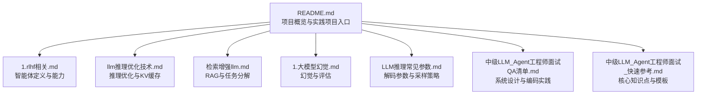
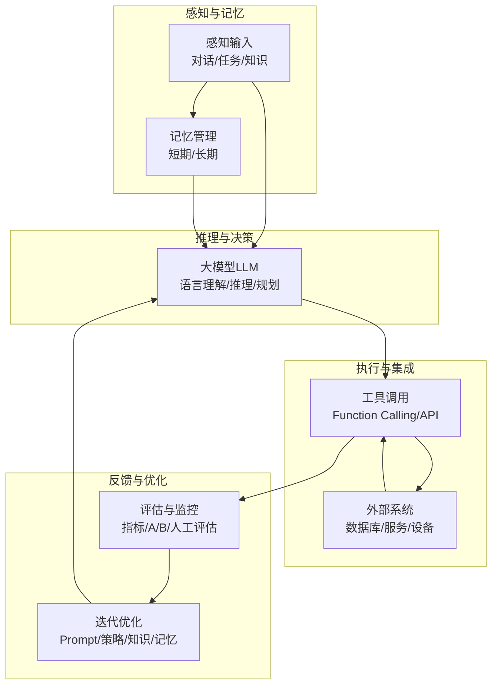
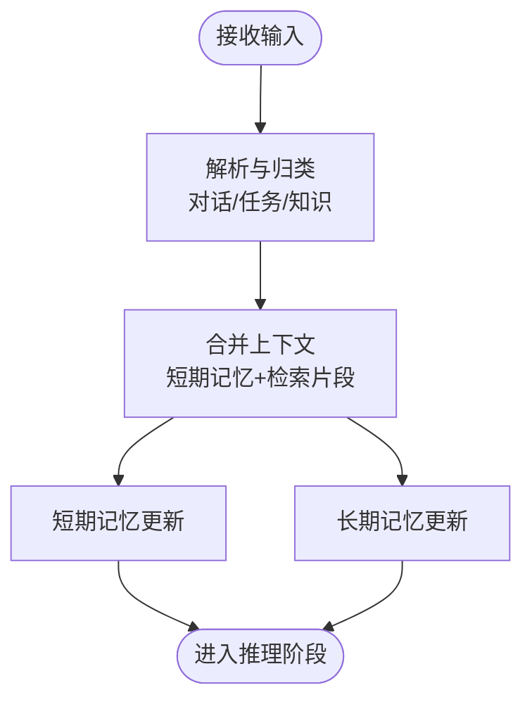
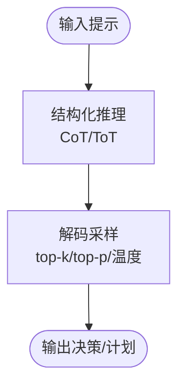
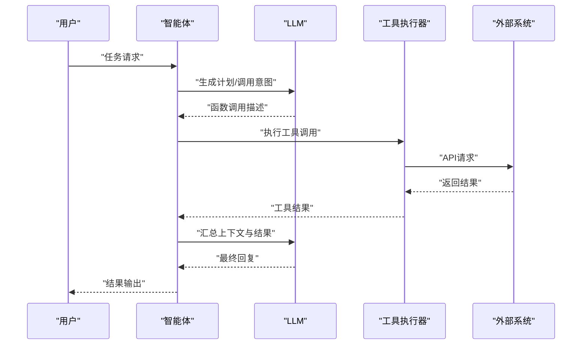
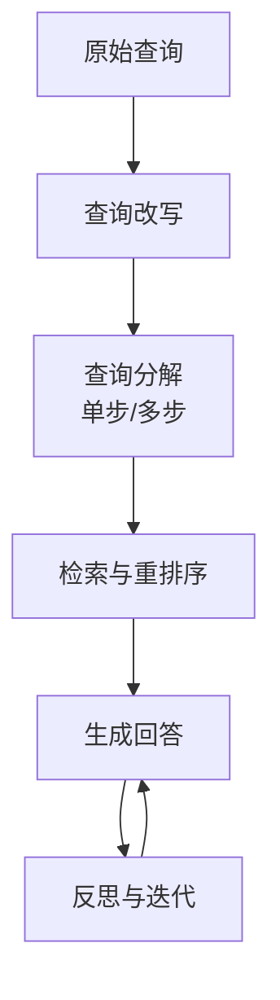
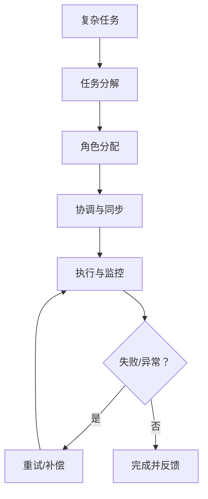
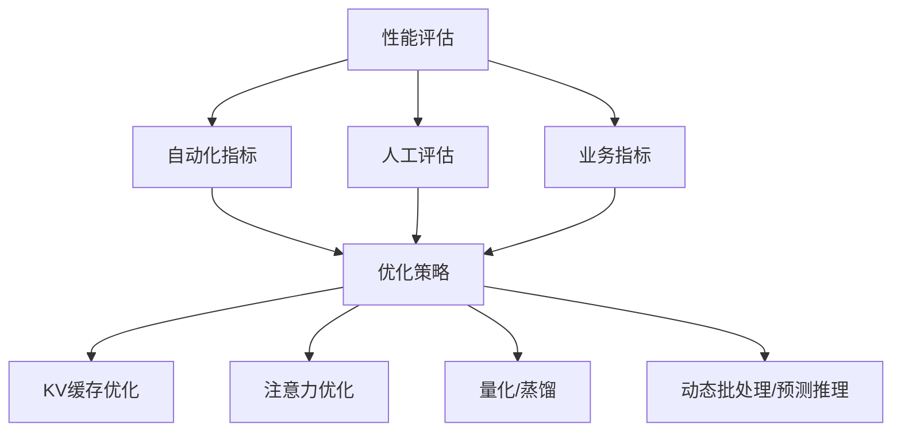
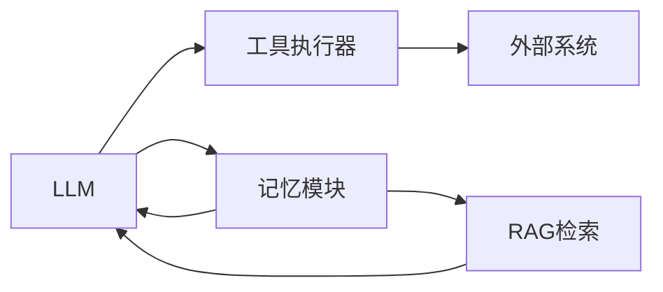

# 智能体技术

<cite>
**本文引用的文件**
- [README.md](file://README.md)
- [1.rlhf相关.md](file://07.强化学习/1.rlhf相关/1.rlhf相关.md)
- [llm推理优化技术.md](file://06.推理/llm推理优化技术/llm推理优化技术.md)
- [LLM推理常见参数.md](file://06.推理/LLM推理常见参数/LLM推理常见参数.md)
- [检索增强llm.md](file://08.检索增强rag/检索增强llm/检索增强llm.md)
- [中级LLM_Agent工程师面试QA清单.md](file://ai_generataion/中级LLM_Agent工程师面试QA清单.md)
- [中级LLM_Agent工程师面试_快速参考.md](file://ai_generataion/中级LLM_Agent工程师面试_快速参考.md)
- [1.大模型幻觉.md](file://09.大语言模型评估/1.大模型幻觉/1.大模型幻觉.md)
</cite>

## 目录
1. [简介](#简介)
2. [项目结构](#项目结构)
3. [核心组件](#核心组件)
4. [架构总览](#架构总览)
5. [详细组件分析](#详细组件分析)
6. [依赖分析](#依赖分析)
7. [性能考量](#性能考量)
8. [故障排查指南](#故障排查指南)
9. [结论](#结论)
10. [附录](#附录)

## 简介
本文件面向大模型智能体（Agent）技术，围绕感知、推理、决策与执行四大核心模块，系统梳理工具调用机制（Function Calling、API 调用与外部系统集成）、状态与记忆管理、长期交互能力，并提供多轮对话、任务分解执行与错误处理的实现思路与评估方法。文档内容均基于仓库现有资料提炼与整合，力求在有限篇幅内呈现可操作的工程实践与系统设计要点。

## 项目结构
本仓库以主题分类组织，与智能体相关的内容主要集中在以下板块：
- 强化学习与人类反馈：涵盖智能体的定义、能力、类型与监督/自监督的自主能力来源
- 推理与性能优化：覆盖KV缓存、注意力优化、分页KV管理、量化与蒸馏等推理优化技术
- 检索增强与任务分解：提供查询改写、检索模块、任务分解与多步检索等RAG与Agent协同能力
- 评估与幻觉：提供幻觉定义、类型、成因与缓解策略，以及性能评估框架

图表来源
- [README.md:1-32](file://README.md#L1-L32)
- [1.rlhf相关.md:122-156](file://07.强化学习/1.rlhf相关/1.rlhf相关.md#L122-L156)
- [llm推理优化技术.md:1-271](file://06.推理/llm推理优化技术/llm推理优化技术.md#L1-L271)
- [检索增强llm.md:332-354](file://08.检索增强rag/检索增强llm/检索增强llm.md#L332-L354)
- [1.大模型幻觉.md:1-109](file://09.大语言模型评估/1.大模型幻觉/1.大模型幻觉.md#L1-L109)
- [LLM推理常见参数.md:1-17](file://06.推理/LLM推理常见参数/LLM推理常见参数.md#L1-L17)
- [中级LLM_Agent工程师面试QA清单.md:55-133](file://ai_generataion/中级LLM_Agent工程师面试QA清单.md#L55-L133)
- [中级LLM_Agent工程师面试_快速参考.md:1-66](file://ai_generataion/中级LLM_Agent工程师面试_快速参考.md#L1-L66)

章节来源
- [README.md:1-32](file://README.md#L1-L32)

## 核心组件
- 智能体定义与能力
  - 智能体以大模型为核心引擎，具备对话、任务完成、推理与一定自主行为能力
  - 关键能力：工具套件（计算器、API、搜索引擎）调用、逻辑推理（Chain-of-Thought、Tree-of-Thought）、定制文本生成、半自动响应、多模态对接
- 构建要素
  - Agent = LLM + Prompt Recipe + Tools + Interface + Knowledge + Memory
  - Knowledge：通用专业知识，分为专业、常识与程序知识
  - Memory：短期与长期记忆，支撑个性化上下文与多步任务一致性
- 类型
  - 会话型：个性化讨论，注重上下文与风格
  - 任务型：目标驱动，分析prompt、提取参数、制定计划、调用API、执行并生成结果

章节来源
- [1.rlhf相关.md:122-156](file://07.强化学习/1.rlhf相关/1.rlhf相关.md#L122-L156)
- [1.rlhf相关.md:137-156](file://07.强化学习/1.rlhf相关/1.rlhf相关.md#L137-L156)

## 架构总览
智能体系统可抽象为“感知—推理—决策—执行—反馈—记忆”的闭环。感知与记忆负责上下文与状态；推理与决策由大模型承担；执行通过工具调用与外部系统集成；反馈（人工/自动）驱动迭代优化。

## 详细组件分析

### 感知与记忆
- 感知输入
  - 多轮对话上下文、任务描述、外部知识片段、工具返回结果
- 记忆管理
  - 短期记忆：维持当前对话与任务步骤的上下文
  - 长期记忆：跨会话与任务的用户画像、偏好、历史交互与经验沉淀
- 记忆与检索协同
  - RAG检索模块可作为长期记忆的“知识源”，通过查询改写、多步检索与重排序提升相关性

章节来源
- [1.rlhf相关.md:137-156](file://07.强化学习/1.rlhf相关/1.rlhf相关.md#L137-L156)
- [检索增强llm.md:332-354](file://08.检索增强rag/检索增强llm/检索增强llm.md#L332-L354)

### 推理与决策
- 推理范式
  - Chain-of-Thought（思维链）、Tree-of-Thought（思维树）等结构化推理
- 解码策略
  - top-k、top-p、温度、重复惩罚等参数对生成质量与多样性的影响
- 推理优化
  - KV缓存、注意力优化（MHA/MQA/GQA）、分页KV管理（PagedAttention）、量化与蒸馏

章节来源
- [llm推理优化技术.md:1-271](file://06.推理/llm推理优化技术/llm推理优化技术.md#L1-L271)
- [LLM推理常见参数.md:1-17](file://06.推理/LLM推理常见参数/LLM推理常见参数.md#L1-L17)

### 工具调用与外部系统集成
- Function Calling
  - 将工具调用封装为函数签名，模型输出函数名与参数，由执行器调用外部API或服务
- API调用
  - 对外服务接口（REST/GraphQL）集成，支持鉴权、限流与重试
- 外部系统集成
  - 数据库、搜索引擎、图像生成器、第三方SDK等
- 多Agent协作
  - Orchestrator负责任务分解，Planner/Executor/Critic各司其职，Memory Manager统一状态

章节来源
- [1.rlhf相关.md:122-156](file://07.强化学习/1.rlhf相关/1.rlhf相关.md#L122-L156)
- [中级LLM_Agent工程师面试QA清单.md:55-133](file://ai_generataion/中级LLM_Agent工程师面试QA清单.md#L55-L133)

### 多轮对话管理
- 上下文维护
  - 通过短期记忆与检索片段保持连贯性
- 查询改写与分解
  - 同义改写、单步/多步分解提升检索质量与回答准确性
- 任务型Agent的提示工程
  - 将目标型Agent拆分为“制定战略任务—串联思路—反思—迭代改进”

章节来源
- [检索增强llm.md:332-354](file://08.检索增强rag/检索增强llm/检索增强llm.md#L332-L354)
- [中级LLM_Agent工程师面试QA清单.md:55-133](file://ai_generataion/中级LLM_Agent工程师面试QA清单.md#L55-L133)

### 任务分解执行
- 任务分解
  - 将复杂任务拆分为子任务，明确依赖与优先级
- 协作与通信
  - 多Agent角色分工、消息格式与路由机制
- 错误处理与重试
  - 超时控制、降级策略、幂等性与补偿机制

章节来源
- [中级LLM_Agent工程师面试QA清单.md:55-133](file://ai_generataion/中级LLM_Agent工程师面试QA清单.md#L55-L133)

### 评估与性能优化
- 评估指标
  - 自动化指标：准确率、召回率、F1、ROUGE、BLEU、METEOR、延迟、吞吐量、错误率
  - 人工评估：相关性、流畅性、有用性评分；A/B测试与用户满意度
  - 业务指标：留存率、任务完成率、客服工单减少量、转化率提升
- 幻觉缓解
  - 外部知识验证、解码策略调整、多输出一致性检查（SelfCheckGPT）
- 推理性能优化
  - KV缓存池与分页管理、注意力优化（MQA/GQA/FlashAttention）、量化、蒸馏、动态批处理、预测推理

章节来源
- [中级LLM_Agent工程师面试QA清单.md:248-291](file://ai_generataion/中级LLM_Agent工程师面试QA清单.md#L248-L291)
- [1.大模型幻觉.md:43-109](file://09.大语言模型评估/1.大模型幻觉/1.大模型幻觉.md#L43-L109)
- [llm推理优化技术.md:1-271](file://06.推理/llm推理优化技术/llm推理优化技术.md#L1-L271)

## 依赖分析
- 模块耦合
  - LLM与工具执行器松耦合，通过函数签名与API协议解耦
  - 记忆模块与检索模块相互依赖，共同支撑上下文与知识
  - 多Agent系统通过消息协议与状态同步实现弱耦合协作
- 外部依赖
  - 推理优化依赖GPU内存与带宽，KV缓存与注意力优化直接影响吞吐与延迟
  - RAG依赖向量数据库与检索质量，影响生成准确性

## 性能考量
- KV缓存与分页管理
  - 预分配与循环缓冲区设计，避免频繁内存分配；PagedAttention提升内存利用率
- 注意力优化
  - MQA/GQA在质量与效率间折衷；FlashAttention减少I/O开销
- 解码策略
  - 合理设置top-k、top-p与温度，平衡多样性与准确性
- 批处理与预测推理
  - 动态批处理提升GPU利用率；预测推理并行生成多个token以缩短延迟

章节来源
- [llm推理优化技术.md:1-271](file://06.推理/llm推理优化技术/llm推理优化技术.md#L1-L271)
- [LLM推理常见参数.md:1-17](file://06.推理/LLM推理常见参数/LLM推理常见参数.md#L1-L17)

## 故障排查指南
- 幻觉问题
  - 通过外部知识验证、降低top-p或温度、多输出一致性检查缓解
- 评估数据偏见
  - 采用多维度人工评估与A/B测试，建立持续监控与告警机制
- 多Agent死锁
  - 明确通信协议与超时控制，避免循环依赖；引入监督Agent进行纠偏
- 推理延迟与吞吐
  - 优化KV缓存与注意力，采用动态批处理与预测推理；量化与蒸馏降低显存占用

章节来源
- [1.大模型幻觉.md:43-109](file://09.大语言模型评估/1.大模型幻觉/1.大模型幻觉.md#L43-L109)
- [中级LLM_Agent工程师面试QA清单.md:248-291](file://ai_generataion/中级LLM_Agent工程师面试QA清单.md#L248-L291)
- [中级LLM_Agent工程师面试QA清单.md:55-133](file://ai_generataion/中级LLM_Agent工程师面试QA清单.md#L55-L133)

## 结论
智能体技术以“感知—推理—决策—执行—反馈—记忆”闭环为核心，结合工具调用与外部系统集成，实现从对话到任务的多样化能力。通过合理的记忆与检索、结构化推理、解码策略与推理优化，可显著提升准确性与性能。评估体系与幻觉缓解策略为工程落地提供保障。多Agent协作与任务分解执行则拓展了智能体在复杂场景中的适用性。

## 附录
- 实践项目入口
  - tiny-llm-zh、tiny-rag、tiny-mcp、llama3-from-scratch-zh等项目可作为动手实践与验证的起点

章节来源
- [README.md:10-14](file://README.md#L10-L14)