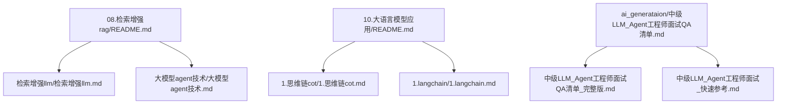
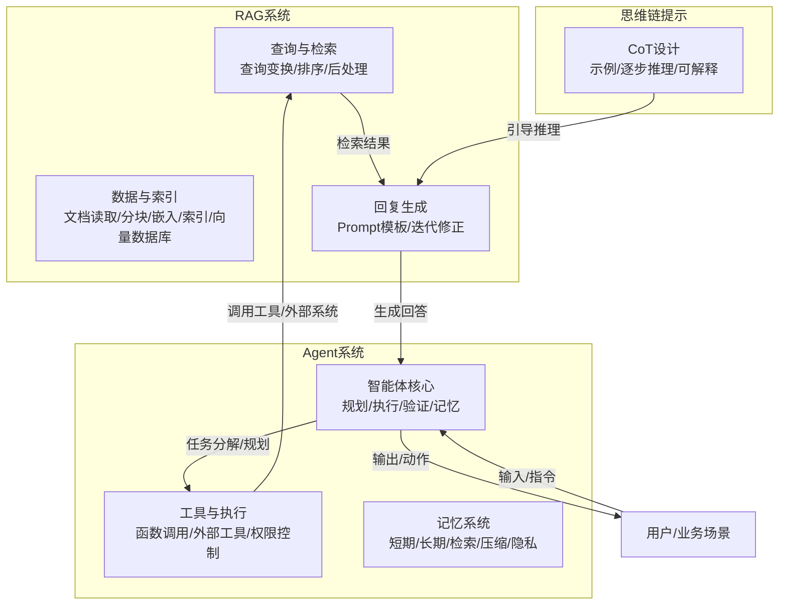
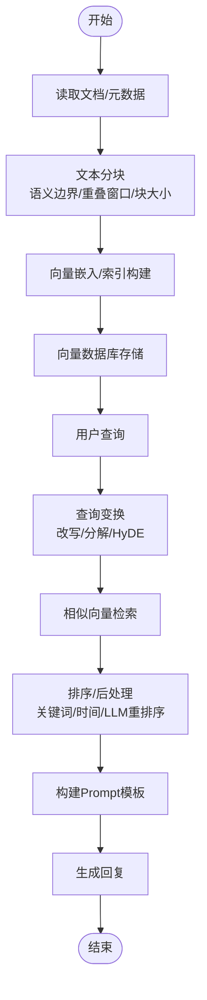
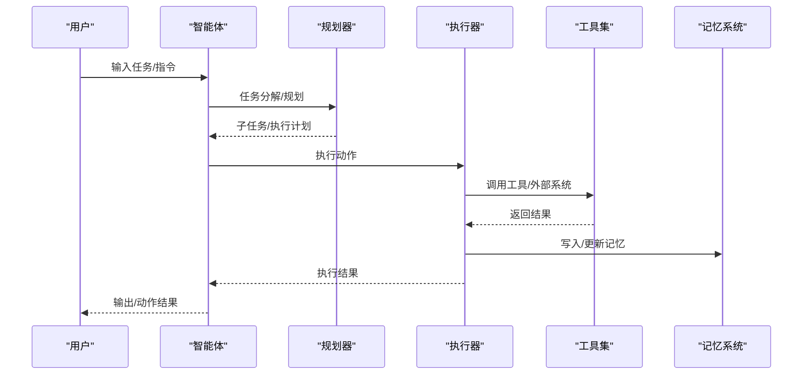
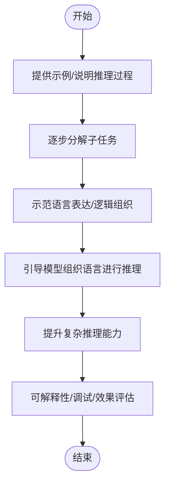
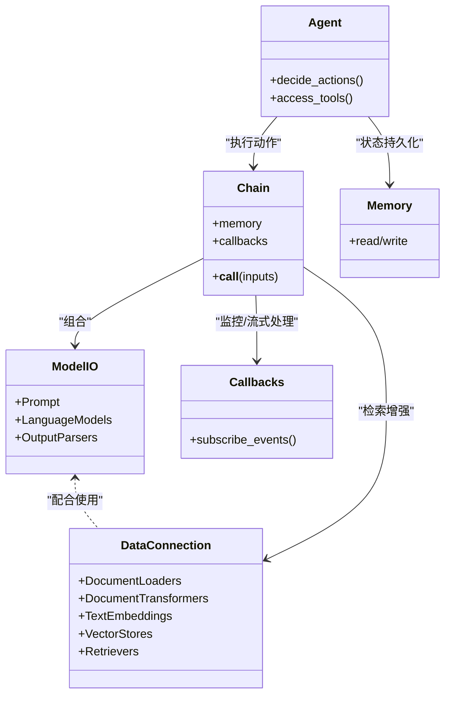
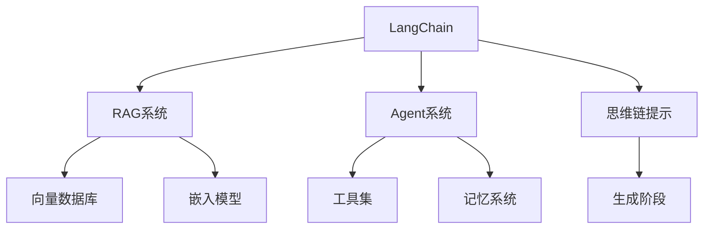

# 应用技术

<cite>
**本文引用的文件**
- [08.检索增强rag/README.md](file://08.检索增强rag/README.md)
- [08.检索增强rag/检索增强llm/检索增强llm.md](file://08.检索增强rag/检索增强llm/检索增强llm.md)
- [08.检索增强rag/大模型agent技术/大模型agent技术.md](file://08.检索增强rag/大模型agent技术/大模型agent技术.md)
- [10.大语言模型应用/README.md](file://10.大语言模型应用/README.md)
- [10.大语言模型应用/1.思维链（cot）/1.思维链（cot）.md](file://10.大语言模型应用/1.思维链（cot）/1.思维链（cot）.md)
- [10.大语言模型应用/1.langchain/1.langchain.md](file://10.大语言模型应用/1.langchain/1.langchain.md)
- [ai_generataion/中级LLM_Agent工程师面试QA清单.md](file://ai_generataion/中级LLM_Agent工程师面试QA清单.md)
- [ai_generataion/中级LLM_Agent工程师面试QA清单_完整版.md](file://ai_generataion/中级LLM_Agent工程师面试QA清单_完整版.md)
- [ai_generataion/中级LLM_Agent工程师面试_快速参考.md](file://ai_generataion/中级LLM_Agent工程师面试_快速参考.md)
</cite>

## 目录
1. [简介](#简介)
2. [项目结构](#项目结构)
3. [核心组件](#核心组件)
4. [架构总览](#架构总览)
5. [详细组件分析](#详细组件分析)
6. [依赖关系分析](#依赖关系分析)
7. [性能考量](#性能考量)
8. [故障排查指南](#故障排查指南)
9. [结论](#结论)
10. [附录](#附录)

## 简介
本章节聚焦于应用技术模块，围绕两大核心技术主线展开：检索增强生成（RAG）与智能体（Agent）技术，以及思维链提示（Chain-of-Thought, CoT）方法。RAG通过“检索-生成”两阶段，将外部知识库与大模型结合，缓解幻觉、提升数据新鲜度与可解释性；智能体则将大模型作为推理引擎，结合工具与记忆，实现可执行的自动化任务；思维链提示则通过引导模型逐步推理，提升复杂任务的准确率与可解释性。本文将从系统架构、关键模块、数据与处理流程、性能与可靠性、实际案例与代码实现路径等方面进行深入阐述，帮助读者将大语言模型应用于实际业务场景。

## 项目结构
本仓库以主题模块划分，应用技术相关内容主要分布在“检索增强rag”“大语言模型应用”“面试资料”等目录中。下图给出与应用技术相关的核心文件与关系：

图表来源
- [08.检索增强rag/README.md:1-14](file://08.检索增强rag/README.md#L1-L14)
- [08.检索增强rag/检索增强llm/检索增强llm.md:1-526](file://08.检索增强rag/检索增强llm/检索增强llm.md#L1-L526)
- [08.检索增强rag/大模型agent技术/大模型agent技术.md:1-483](file://08.检索增强rag/大模型agent技术/大模型agent技术.md#L1-L483)
- [10.大语言模型应用/README.md:1-10](file://10.大语言模型应用/README.md#L1-L10)
- [10.大语言模型应用/1.思维链（cot）/1.思维链（cot）.md:1-147](file://10.大语言模型应用/1.思维链（cot）/1.思维链（cot）.md#L1-L147)
- [10.大语言模型应用/1.langchain/1.langchain.md:1-417](file://10.大语言模型应用/1.langchain/1.langchain.md#L1-L417)
- [ai_generataion/中级LLM_Agent工程师面试QA清单.md:1-343](file://ai_generataion/中级LLM_Agent工程师面试QA清单.md#L1-L343)
- [ai_generataion/中级LLM_Agent工程师面试QA清单_完整版.md:1-483](file://ai_generataion/中级LLM_Agent工程师面试QA清单_完整版.md#L1-L483)
- [ai_generataion/中级LLM_Agent工程师面试_快速参考.md:1-66](file://ai_generataion/中级LLM_Agent工程师面试_快速参考.md#L1-L66)

章节来源
- [08.检索增强rag/README.md:1-14](file://08.检索增强rag/README.md#L1-L14)
- [10.大语言模型应用/README.md:1-10](file://10.大语言模型应用/README.md#L1-L10)

## 核心组件
- 检索增强生成（RAG）系统
  - 数据与索引模块：文档读取、文本分块、向量嵌入与索引、向量数据库
  - 查询与检索模块：查询变换（改写/分解/HyDE）、排序与后处理
  - 回复生成模块：Prompt模板、迭代修正、生成策略
- 智能体（Agent）系统
  - 角色与任务：规划、执行、验证、记忆、通信
  - 工具与执行：函数调用、外部工具、权限与安全
  - 记忆与状态：短期/长期记忆、检索与压缩、隐私保护
- 思维链提示（CoT）
  - 思路链设计：示例引导、逐步推理、可解释性
  - 适用场景：算术推理、常识推理、符号推理、程序合成、翻译、总结、创作、问答、对话、可解释预测

章节来源
- [08.检索增强rag/检索增强llm/检索增强llm.md:81-413](file://08.检索增强rag/检索增强llm/检索增强llm.md#L81-L413)
- [08.检索增强rag/大模型agent技术/大模型agent技术.md:122-233](file://08.检索增强rag/大模型agent技术/大模型agent技术.md#L122-L233)
- [10.大语言模型应用/1.思维链（cot）/1.思维链（cot）.md:6-121](file://10.大语言模型应用/1.思维链（cot）/1.思维链（cot）.md#L6-L121)

## 架构总览
下图展示RAG与Agent在实际业务中的典型架构与交互关系，以及与思维链提示的协同应用。

图表来源
- [08.检索增强rag/检索增强llm/检索增强llm.md:332-413](file://08.检索增强rag/检索增强llm/检索增强llm.md#L332-L413)
- [08.检索增强rag/大模型agent技术/大模型agent技术.md:122-233](file://08.检索增强rag/大模型agent技术/大模型agent技术.md#L122-L233)
- [10.大语言模型应用/1.思维链（cot）/1.思维链（cot）.md:6-121](file://10.大语言模型应用/1.思维链（cot）/1.思维链（cot）.md#L6-L121)

## 详细组件分析

### RAG系统：检索增强生成
- 数据与索引模块
  - 文档读取：支持多来源、多格式、多语种、多模态（文本为主）
  - 文本分块：基于语义边界、重叠窗口、块大小（字符/Token）策略
  - 索引与向量数据库：链式/树/关键词/向量索引；嵌入模型选择；相似向量检索（余弦/点积/欧式）；向量数据库（Pinecone/Weaviate/Milvus/Chroma等）
- 查询与检索模块
  - 查询变换：同义改写、查询分解（单步/多步）、HyDE（假设文档嵌入）
  - 排序与后处理：相似度过滤、关键词过滤、时间过滤、LLM重排序、加权排序
- 回复生成模块
  - Prompt模板：上下文分隔、是否结合自身知识、无帮助时的处理
  - 生成策略：逐块修正/一次性拼接；多轮对话与上下文管理

图表来源
- [08.检索增强rag/检索增强llm/检索增强llm.md:89-413](file://08.检索增强rag/检索增强llm/检索增强llm.md#L89-L413)

章节来源
- [08.检索增强rag/检索增强llm/检索增强llm.md:81-413](file://08.检索增强rag/检索增强llm/检索增强llm.md#L81-L413)

### 智能体（Agent）系统
- 角色与任务
  - 角色：规划者、执行者、验证者、记忆管理者
  - 任务：任务分解、协调、错误处理、状态同步
- 工具与执行
  - 函数调用与外部工具：权限控制、输入验证、沙箱执行、审计日志、速率限制、敏感操作确认
- 记忆与状态
  - 分层存储：短期（当前对话）与长期（向量数据库）记忆
  - 检索机制：语义相似度检索、记忆压缩、过期策略、隐私保护

图表来源
- [08.检索增强rag/大模型agent技术/大模型agent技术.md:122-233](file://08.检索增强rag/大模型agent技术/大模型agent技术.md#L122-L233)

章节来源
- [08.检索增强rag/大模型agent技术/大模型agent技术.md:122-233](file://08.检索增强rag/大模型agent技术/大模型agent技术.md#L122-L233)

### 思维链提示（CoT）
- CoT本质：通过示例或具体说明引导模型逐步推理，提升复杂任务（算术、常识、符号）的准确率
- 设计要点：分解复杂问题、提供步骤示范、引导组织语言、加强逻辑思维、调动背景知识、提供解释性、单模型多任务、少样本学习
- 适用场景：数学文本问题、CSQA/StrategyQA、符号操作、程序合成、翻译、总结、创作、问答、对话、可解释预测

图表来源
- [10.大语言模型应用/1.思维链（cot）/1.思维链（cot）.md:6-121](file://10.大语言模型应用/1.思维链（cot）/1.思维链（cot）.md#L6-L121)

章节来源
- [10.大语言模型应用/1.思维链（cot）/1.思维链（cot）.md:6-121](file://10.大语言模型应用/1.思维链（cot）/1.思维链（cot）.md#L6-L121)

### 框架与实践：LangChain
- 核心模块：模型I/O（Prompt/LM/Output Parser）、数据连接（Document loaders/Transformers/Embeddings/Vector stores/Retrievers）、链（Chain）、智能体（Agent）、记忆（Memory）、回调（Callbacks）
- 知识问答实践：文档加载→文本拆分→嵌入→向量存储→检索器→问答链→生成回复

图表来源
- [10.大语言模型应用/1.langchain/1.langchain.md:17-216](file://10.大语言模型应用/1.langchain/1.langchain.md#L17-L216)

章节来源
- [10.大语言模型应用/1.langchain/1.langchain.md:17-216](file://10.大语言模型应用/1.langchain/1.langchain.md#L17-L216)

## 依赖关系分析
- RAG与Agent的耦合
  - Agent可作为RAG的“执行器”，在检索到相关文档后，通过智能体决策调用工具或生成最终动作/回复
  - Agent可维护长期记忆，结合RAG的向量检索，形成“检索-记忆-执行”的闭环
- 思维链与RAG/Agent的协同
  - CoT可作为生成阶段的Prompt设计策略，提升RAG生成的可解释性与准确性
  - 在Agent规划与执行阶段，CoT可引导模型进行更稳健的推理与决策
- 框架与工具链
  - LangChain提供组件化抽象，便于RAG与Agent的快速搭建与集成
  - 向量数据库与嵌入模型为RAG提供检索基础，工具与权限控制为Agent提供执行保障

图表来源
- [08.检索增强rag/检索增强llm/检索增强llm.md:213-331](file://08.检索增强rag/检索增强llm/检索增强llm.md#L213-L331)
- [08.检索增强rag/大模型agent技术/大模型agent技术.md:122-233](file://08.检索增强rag/大模型agent技术/大模型agent技术.md#L122-L233)
- [10.大语言模型应用/1.langchain/1.langchain.md:17-216](file://10.大语言模型应用/1.langchain/1.langchain.md#L17-L216)

章节来源
- [08.检索增强rag/检索增强llm/检索增强llm.md:213-331](file://08.检索增强rag/检索增强llm/检索增强llm.md#L213-L331)
- [08.检索增强rag/大模型agent技术/大模型agent技术.md:122-233](file://08.检索增强rag/大模型agent技术/大模型agent技术.md#L122-L233)
- [10.大语言模型应用/1.langchain/1.langchain.md:17-216](file://10.大语言模型应用/1.langchain/1.langchain.md#L17-L216)

## 性能考量
- RAG检索性能
  - 索引与检索：HNSW/IVF/倒排等索引结构；相似度度量（余弦/点积/欧式）；向量数据库的扩展性与查询延迟
  - 分块策略：语义边界、重叠窗口、块大小（字符/Token）；多向量检索与重排序
  - 缓存与优化：热门查询缓存、查询扩展、HyDE、多跳检索、用户反馈微调
- 推理与生成性能
  - 生成策略：一次性拼接 vs 逐块修正；Prompt模板设计；上下文长度与窗口限制
  - 推理优化：KV Cache内存池、PagedAttention、连续批处理、量化、动态批处理
- Agent系统性能
  - 工具调用异步化、权限与安全控制、审计与速率限制、错误处理与重试
  - 记忆系统的检索效率与隐私保护、长期/短期记忆的权衡

章节来源
- [08.检索增强rag/检索增强llm/检索增强llm.md:241-331](file://08.检索增强rag/检索增强llm/检索增强llm.md#L241-L331)
- [ai_generataion/中级LLM_Agent工程师面试QA清单_完整版.md:53-97](file://ai_generataion/中级LLM_Agent工程师面试QA清单_完整版.md#L53-L97)

## 故障排查指南
- RAG检索问题
  - 检索质量差：调整分块策略、嵌入模型、相似度度量、重排序器；引入查询扩展与HyDE
  - 向量数据库性能：索引类型选择、维度与数据规模、查询Top-K与过滤策略
  - 生成质量不稳定：Prompt模板优化、迭代修正策略、上下文长度与窗口限制
- Agent执行问题
  - 工具调用失败：权限不足、输入验证失败、沙箱执行异常；审计日志与重试机制
  - 记忆不一致：短期/长期记忆冲突、检索一致性、隐私与脱敏
- 思维链提示问题
  - 推理链不准确：示例质量、提示设计、模型规模与温度参数；可解释性与事实性
- 系统监控与调试
  - 延迟、吞吐量、错误率、资源使用；Profiling与日志分析；A/B测试与回归分析

章节来源
- [08.检索增强rag/检索增强llm/检索增强llm.md:366-413](file://08.检索增强rag/检索增强llm/检索增强llm.md#L366-L413)
- [08.检索增强rag/大模型agent技术/大模型agent技术.md:122-233](file://08.检索增强rag/大模型agent技术/大模型agent技术.md#L122-L233)
- [10.大语言模型应用/1.思维链（cot）/1.思维链（cot）.md:56-91](file://10.大语言模型应用/1.思维链（cot）/1.思维链（cot）.md#L56-L91)
- [ai_generataion/中级LLM_Agent工程师面试QA清单_完整版.md:276-302](file://ai_generataion/中级LLM_Agent工程师面试QA清单_完整版.md#L276-L302)

## 结论
RAG、Agent与思维链提示构成了将大语言模型落地到实际业务场景的关键技术支点。RAG通过检索增强缓解幻觉与知识新鲜度问题，Agent通过工具与记忆实现可执行的自动化任务，思维链提示则提升复杂推理的准确性与可解释性。结合LangChain等框架，可在工程上快速搭建端到端系统，并通过向量数据库、嵌入模型、工具与权限控制、记忆系统等组件实现高可用、高性能、可扩展的业务应用。

## 附录
- 实际应用案例与代码实现路径
  - RAG知识问答实践（LangChain）：[知识问答实践代码路径:340-414](file://10.大语言模型应用/1.langchain/1.langchain.md#L340-L414)
  - 向量数据库与相似向量检索示例（Pinecone）：[向量数据库示例路径:288-330](file://08.检索增强rag/检索增强llm/检索增强llm.md#L288-L330)
  - 采样与KV Cache实现（面试题）：[Top-k采样实现路径:307-356](file://ai_generataion/中级LLM_Agent工程师面试QA清单_完整版.md#L307-L356)、[KV Cache管理器实现路径:368-410](file://ai_generataion/中级LLM_Agent工程师面试QA清单_完整版.md#L368-L410)
- 面试与项目经验要点
  - 面试清单与快速参考：[面试清单:1-343](file://ai_generataion/中级LLM_Agent工程师面试QA清单.md#L1-L343)、[快速参考:1-66](file://ai_generataion/中级LLM_Agent工程师面试_快速参考.md#L1-L66)
  - 系统设计与编码实践：[系统设计要点:33-36](file://ai_generataion/中级LLM_Agent工程师面试_快速参考.md#L33-L36)、[编码题模板:21-31](file://ai_generataion/中级LLM_Agent工程师面试_快速参考.md#L21-L31)