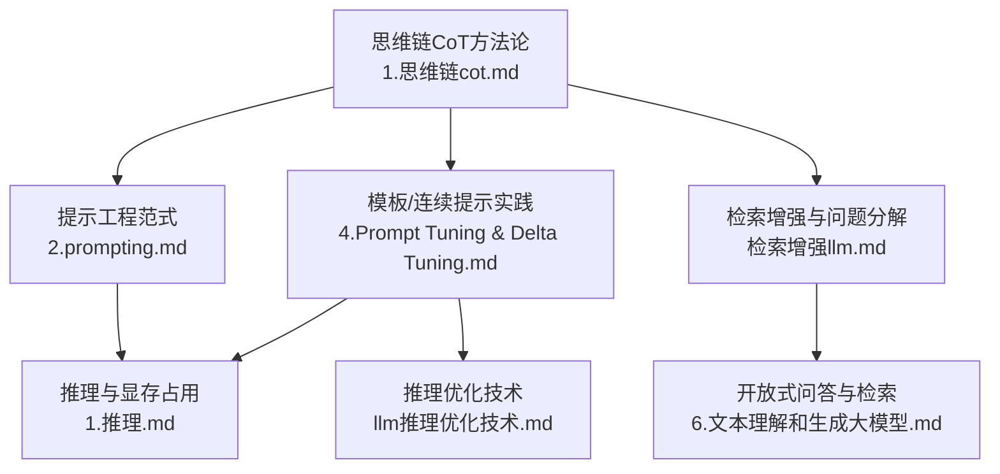
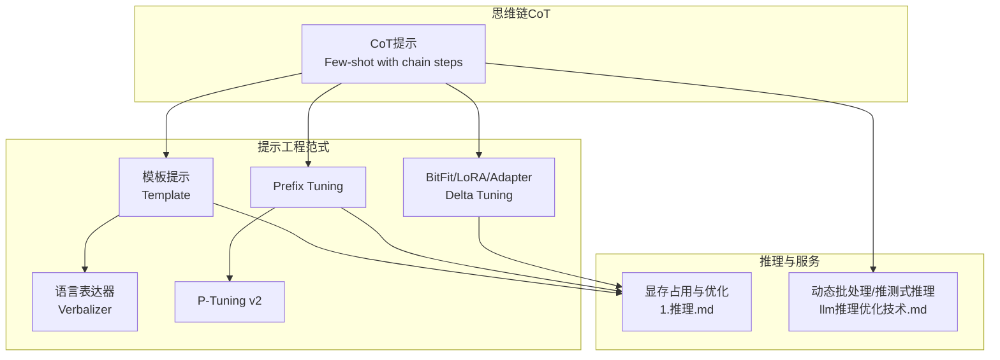
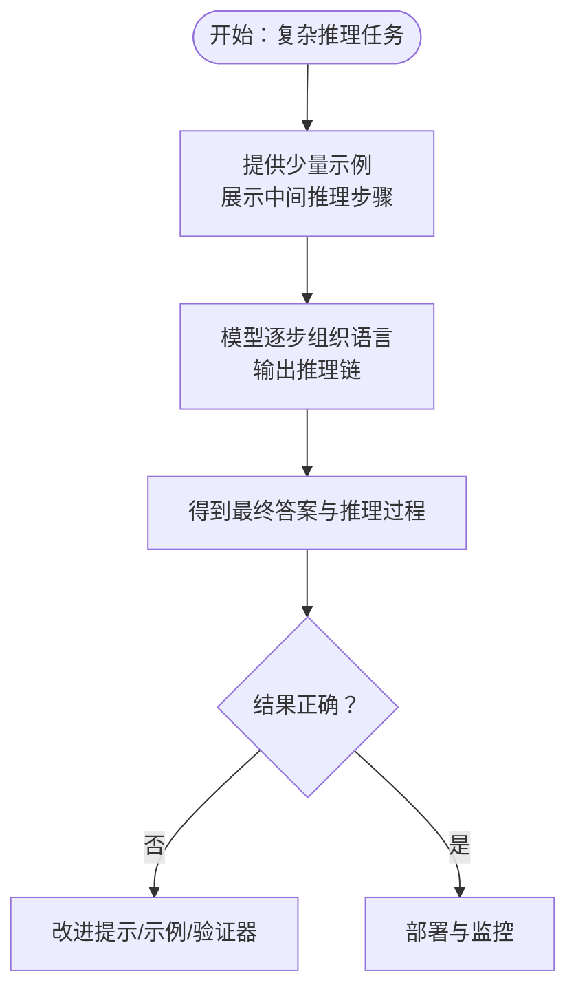
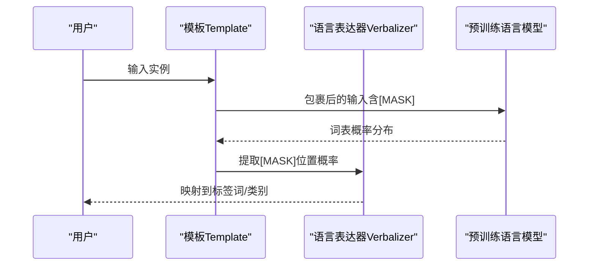
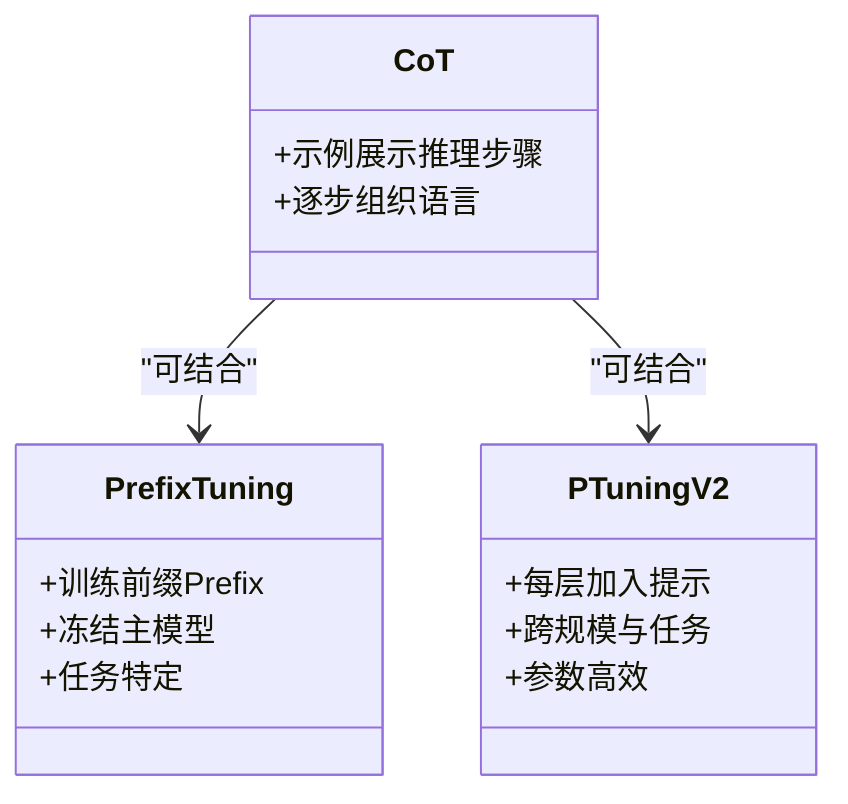
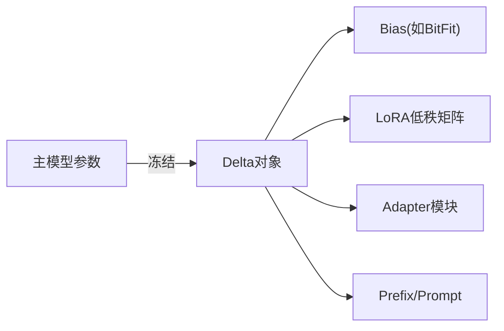
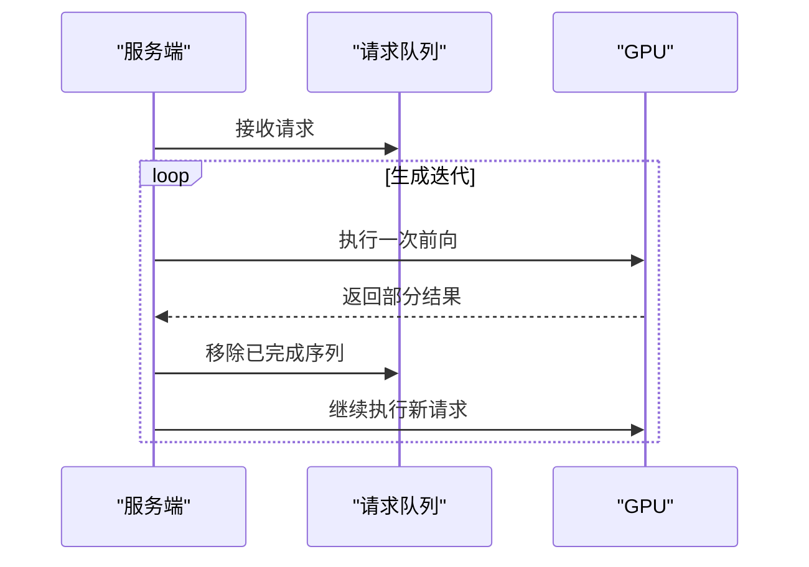
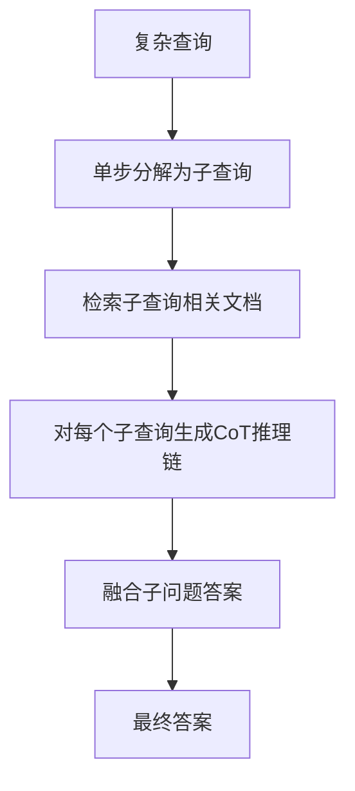
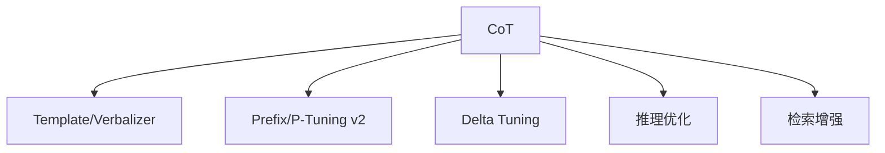

# 思维链提示

<cite>
**本文引用的文件列表**
- [1.思维链（cot）.md](file://10.大语言模型应用/1.思维链（cot）/1.思维链（cot）.md)
- [2.prompting.md](file://05.有监督微调/2.prompting/2.prompting.md)
- [4.Prompt Tuning & Delta Tuning.md](file://98.相关课程/清华大模型公开课/4.Prompt Tuning & Delta Tuning/4.Prompt Tuning & Delta Tuning.md)
- [1.推理.md](file://06.推理/1.推理/1.推理.md)
- [llm推理优化技术.md](file://06.推理/llm推理优化技术/llm推理优化技术.md)
- [检索增强llm.md](file://08.检索增强rag/检索增强llm/检索增强llm.md)
- [6.文本理解和生成大模型.md](file://98.相关课程/清华大模型公开课/6.文本理解和生成大模型/6.文本理解和生成大模型.md)
</cite>

## 目录
1. [引言](#引言)
2. [项目结构](#项目结构)
3. [核心组件](#核心组件)
4. [架构总览](#架构总览)
5. [详细组件分析](#详细组件分析)
6. [依赖关系分析](#依赖关系分析)
7. [性能考量](#性能考量)
8. [故障排查指南](#故障排查指南)
9. [结论](#结论)
10. [附录](#附录)

## 引言
本指南围绕思维链提示（Chain-of-Thought, CoT）展开，系统阐述其理论基础、实现原理、提示工程最佳实践、多步推理设计与优化、错误处理策略，并结合数学计算、逻辑推理、数据分析等实际应用案例，解释CoT与其他提示技术（如模板提示、连续提示、Delta Tuning）的区别与优势，帮助读者在不同场景下选择合适的提示策略并落地实践。

## 项目结构
本仓库包含与提示工程、思维链、推理优化、检索增强等相关的内容，形成从基础概念到工程实践的完整知识体系。与CoT直接相关的知识主要分布在如下文件：
- 思维链方法论与实验验证：10.大语言模型应用/1.思维链（cot）/1.思维链（cot）.md
- 提示工程与模板/连续提示范式：05.有监督微调/2.prompting/2.prompting.md、98.相关课程/清华大模型公开课/4.Prompt Tuning & Delta Tuning/4.Prompt Tuning & Delta Tuning.md
- 推理与性能优化：06.推理/1.推理/1.推理.md、06.推理/llm推理优化技术/llm推理优化技术.md
- 检索增强与复杂问题分解：08.检索增强rag/检索增强llm/检索增强llm.md、98.相关课程/清华大模型公开课/6.文本理解和生成大模型/6.文本理解和生成大模型.md

**图表来源**
- [1.思维链（cot）.md:1-147](file://10.大语言模型应用/1.思维链（cot）/1.思维链（cot）.md#L1-L147)
- [2.prompting.md:1-173](file://05.有监督微调/2.prompting/2.prompting.md#L1-L173)
- [4.Prompt Tuning & Delta Tuning.md:1-1108](file://98.相关课程/清华大模型公开课/4.Prompt Tuning & Delta Tuning/4.Prompt Tuning & Delta Tuning.md#L1-L1108)
- [1.推理.md:1-14](file://06.推理/1.推理/1.推理.md#L1-L14)
- [llm推理优化技术.md:233-248](file://06.推理/llm推理优化技术/llm推理优化技术.md#L233-L248)
- [检索增强llm.md:59-354](file://08.检索增强rag/检索增强llm/检索增强llm.md#L59-L354)
- [6.文本理解和生成大模型.md:355-403](file://98.相关课程/清华大模型公开课/6.文本理解和生成大模型/6.文本理解和生成大模型.md#L355-L403)

**章节来源**
- [1.思维链（cot）.md:1-147](file://10.大语言模型应用/1.思维链（cot）/1.思维链（cot）.md#L1-L147)
- [2.prompting.md:1-173](file://05.有监督微调/2.prompting/2.prompting.md#L1-L173)
- [4.Prompt Tuning & Delta Tuning.md:1-1108](file://98.相关课程/清华大模型公开课/4.Prompt Tuning & Delta Tuning/4.Prompt Tuning & Delta Tuning.md#L1-L1108)

## 核心组件
- 思维链提示（CoT）：通过少量示例展示中间推理步骤，引导模型逐步组织语言进行多步推理，显著提升复杂任务表现。
- 模板提示（Template）与语言表达器（Verbalizer）：将任务映射为统一的文本到文本范式，通过掩码位置预测标签词，实现少样本/零样本学习。
- 连续提示（Prefix/Prompt Tuning/P-Tuning v2）：将提示表示为可学习的连续向量，融入输入层或每层隐藏状态，实现参数高效与跨任务泛化。
- Delta Tuning：固定主模型参数，仅微调少量delta对象（如Adapter、LoRA、BitFit），在超大规模模型上高效适配下游任务。
- 推理优化：显存占用与动态批处理、推测式推理等技术，保障生产级推理稳定性与吞吐。

**章节来源**
- [1.思维链（cot）.md:6-42](file://10.大语言模型应用/1.思维链（cot）/1.思维链（cot）.md#L6-L42)
- [2.prompting.md:3-173](file://05.有监督微调/2.prompting/2.prompting.md#L3-L173)
- [4.Prompt Tuning & Delta Tuning.md:100-173](file://98.相关课程/清华大模型公开课/4.Prompt Tuning & Delta Tuning/4.Prompt Tuning & Delta Tuning.md#L100-L173)

## 架构总览
下图展示CoT在提示工程体系中的定位与与其他范式的协同关系：CoT强调“推理路径”，模板/连续提示负责“任务表达与参数高效”，Delta Tuning负责“模型适配与部署”。

**图表来源**
- [1.思维链（cot）.md:6-42](file://10.大语言模型应用/1.思维链（cot）/1.思维链（cot）.md#L6-L42)
- [2.prompting.md:3-173](file://05.有监督微调/2.prompting/2.prompting.md#L3-L173)
- [4.Prompt Tuning & Delta Tuning.md:36-173](file://98.相关课程/清华大模型公开课/4.Prompt Tuning & Delta Tuning/4.Prompt Tuning & Delta Tuning.md#L36-L173)
- [1.推理.md:5-14](file://06.推理/1.推理/1.推理.md#L5-L14)
- [llm推理优化技术.md:233-248](file://06.推理/llm推理优化技术/llm推理优化技术.md#L233-L248)

## 详细组件分析

### 思维链（CoT）方法论与优势
- 方法本质：在少样本中提供中间推理步骤作为“思路链”，引导模型逐步组织语言进行多步推理，显著提升算术、常识、符号推理任务表现。
- 优势：分解复杂问题、提供步骤示范、引导语言组织、强化逻辑思维、激活背景知识、提供解释性、适用范围广、单模型多任务、少样本学习。
- 适用场景：算术推理（如GSM8K）、常识推理（CSQA、StrategyQA）、符号推理（长度泛化）。
- 局限与改进方向：思路链事实性、模型规模依赖、标注成本、提示工程影响、内在机制理解、小任务提升有限、小模型应用、模型架构与预训练方式影响。

**图表来源**
- [1.思维链（cot）.md:14-54](file://10.大语言模型应用/1.思维链（cot）/1.思维链（cot）.md#L14-L54)

**章节来源**
- [1.思维链（cot）.md:14-54](file://10.大语言模型应用/1.思维链（cot）/1.思维链（cot）.md#L14-L54)

### 模板提示与语言表达器（Template + Verbalizer）
- 模板（Template）：在输入中插入掩码位置，将任务映射为MLM或生成任务，弥补预训练与微调之间的差距。
- 语言表达器（Verbalizer）：将标签映射为一个或多个词，支持手工设计或自动扩展，提升少样本效果。
- 多模板集成：通过多个模板的均匀/加权平均稳定任务性能。
- 自动生成与搜索：基于梯度搜索或编码器-解码器生成提示，突破人工设计局限。

**图表来源**
- [4.Prompt Tuning & Delta Tuning.md:110-149](file://98.相关课程/清华大模型公开课/4.Prompt Tuning & Delta Tuning/4.Prompt Tuning & Delta Tuning.md#L110-L149)

**章节来源**
- [4.Prompt Tuning & Delta Tuning.md:110-173](file://98.相关课程/清华大模型公开课/4.Prompt Tuning & Delta Tuning/4.Prompt Tuning & Delta Tuning.md#L110-L173)

### 连续提示与深度提示优化（Prefix Tuning / P-Tuning v2）
- Prefix Tuning：在输入前添加任务特定的连续提示，冻结主模型参数，仅训练Prefix，实现参数高效与任务特定引导。
- P-Tuning v2：在每层都加入提示，提升可学习参数与对预测的直接影响，跨规模与任务通用，适合NLU与序列标注等困难任务。
- 与CoT结合：在CoT示例中加入连续提示，提升推理路径的稳定性与泛化能力。

**图表来源**
- [2.prompting.md:36-173](file://05.有监督微调/2.prompting/2.prompting.md#L36-L173)
- [4.Prompt Tuning & Delta Tuning.md:281-392](file://98.相关课程/清华大模型公开课/4.Prompt Tuning & Delta Tuning/4.Prompt Tuning & Delta Tuning.md#L281-L392)

**章节来源**
- [2.prompting.md:36-173](file://05.有监督微调/2.prompting/2.prompting.md#L36-L173)
- [4.Prompt Tuning & Delta Tuning.md:281-392](file://98.相关课程/清华大模型公开课/4.Prompt Tuning & Delta Tuning/4.Prompt Tuning & Delta Tuning.md#L281-L392)

### Delta Tuning（BitFit/LoRA/Adapter）
- BitFit：仅训练bias参数，参数量极小，仍可达到与全量微调相近效果。
- LoRA：低秩适应，将大矩阵分解为低秩组合，显著减少计算与存储。
- Adapter：在Transformer层间插入小网络模块，参数高效且效果接近全量微调。
- 与CoT结合：在CoT推理链生成后，用Delta Tuning对特定任务进行轻量适配，降低部署成本。

**图表来源**
- [2.prompting.md:407-498](file://05.有监督微调/2.prompting/2.prompting.md#L407-L498)

**章节来源**
- [2.prompting.md:407-498](file://05.有监督微调/2.prompting/2.prompting.md#L407-L498)

### 推理优化与显存管理
- 显存占用：模型参数、输入数据、中间计算结果、内存管理策略共同导致显存占用高且常驻。
- 动态批处理（In-flight batching）：在生成过程中剔除已完成序列，立即执行新请求，提升GPU利用率。
- 推测式推理：并行执行序列的多个不同步骤，缩短端到端延迟。

**图表来源**
- [llm推理优化技术.md:240-248](file://06.推理/llm推理优化技术/llm推理优化技术.md#L240-L248)

**章节来源**
- [1.推理.md:5-14](file://06.推理/1.推理/1.推理.md#L5-L14)
- [llm推理优化技术.md:233-248](file://06.推理/llm推理优化技术/llm推理优化技术.md#L233-L248)

### 检索增强与复杂问题分解
- 数据新鲜度与来源验证：通过检索外部知识增强LLM输出的可解释性与可控性。
- 查询变换：同义改写与查询分解（单步/多步）提升检索质量，进而提升生成效果。
- 与CoT结合：在复杂问题上先分解为子问题，再对每个子问题使用CoT生成推理链，最后融合答案。

**图表来源**
- [检索增强llm.md:332-354](file://08.检索增强rag/检索增强llm/检索增强llm.md#L332-L354)

**章节来源**
- [检索增强llm.md:59-354](file://08.检索增强rag/检索增强llm/检索增强llm.md#L59-L354)
- [6.文本理解和生成大模型.md:355-403](file://98.相关课程/清华大模型公开课/6.文本理解和生成大模型/6.文本理解和生成大模型.md#L355-L403)

## 依赖关系分析
- CoT依赖于提示工程范式（模板/连续提示）与Delta Tuning，以实现少样本学习与参数高效适配。
- 推理优化技术服务于CoT在生产环境中的稳定性与吞吐。
- 检索增强为复杂问题提供外部知识，与CoT结合提升可解释性与准确性。

**图表来源**
- [1.思维链（cot）.md:20-42](file://10.大语言模型应用/1.思维链（cot）/1.思维链（cot）.md#L20-L42)
- [2.prompting.md:36-173](file://05.有监督微调/2.prompting/2.prompting.md#L36-L173)
- [llm推理优化技术.md:233-248](file://06.推理/llm推理优化技术/llm推理优化技术.md#L233-L248)
- [检索增强llm.md:59-354](file://08.检索增强rag/检索增强llm/检索增强llm.md#L59-L354)

**章节来源**
- [1.思维链（cot）.md:20-42](file://10.大语言模型应用/1.思维链（cot）/1.思维链（cot）.md#L20-L42)
- [2.prompting.md:36-173](file://05.有监督微调/2.prompting/2.prompting.md#L36-L173)
- [llm推理优化技术.md:233-248](file://06.推理/llm推理优化技术/llm推理优化技术.md#L233-L248)
- [检索增强llm.md:59-354](file://08.检索增强rag/检索增强llm/检索增强llm.md#L59-L354)

## 性能考量
- 显存占用与释放：模型参数、输入数据、中间结果与框架内存管理策略共同决定显存占用与释放行为。
- 动态批处理：在生成过程中剔除已完成序列，立即执行新请求，提升GPU利用率。
- 推测式推理：并行执行序列的多个不同步骤，缩短端到端延迟。
- 与CoT结合：在推理链较长时，建议结合动态批处理与推测式推理，平衡吞吐与延迟。

**章节来源**
- [1.推理.md:5-14](file://06.推理/1.推理/1.推理.md#L5-L14)
- [llm推理优化技术.md:233-248](file://06.推理/llm推理优化技术/llm推理优化技术.md#L233-L248)

## 故障排查指南
- 显存溢出与常驻：检查模型参数量、输入长度、中间结果缓存与框架显存策略，必要时减小批量或优化显存分配。
- 推理吞吐低：启用动态批处理与推测式推理，评估不同解码策略（beam search、top-k、top-p）对吞吐与质量的影响。
- CoT结果不可信：引入验证器（如外部校验、规则约束）或增加示例数量；对提示进行多模板集成与自动搜索优化。
- 检索质量差：对查询进行同义改写与分解，提升召回与排序质量；在生成阶段标注来源，增强可解释性。

**章节来源**
- [1.推理.md:5-14](file://06.推理/1.推理/1.推理.md#L5-L14)
- [llm推理优化技术.md:233-248](file://06.推理/llm推理优化技术/llm推理优化技术.md#L233-L248)
- [检索增强llm.md:59-354](file://08.检索增强rag/检索增强llm/检索增强llm.md#L59-L354)

## 结论
思维链提示通过“逐步推理路径”显著提升复杂任务表现，与模板/连续提示、Delta Tuning、推理优化、检索增强等技术协同，可在少样本、参数高效、可解释性与生产级推理等多个维度实现端到端优化。针对不同场景，应综合考虑任务复杂度、数据可用性、资源约束与可解释性需求，选择合适的提示策略与工程方案。

## 附录
- 实践建议
  - 设计提示模板：从任务特性出发，结合模板与语言表达器，进行多模板集成与自动搜索优化。
  - 构建推理链：在示例中展示清晰的中间步骤，必要时结合检索增强与问题分解。
  - 错误处理：引入验证器、规则约束与多策略解码，提升结果可信度与稳定性。
  - 工程落地：结合动态批处理、推测式推理与Delta Tuning，实现低资源消耗与高吞吐的生产部署。