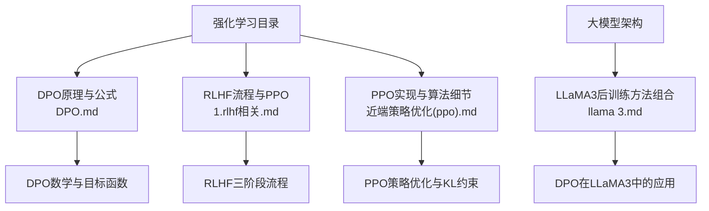
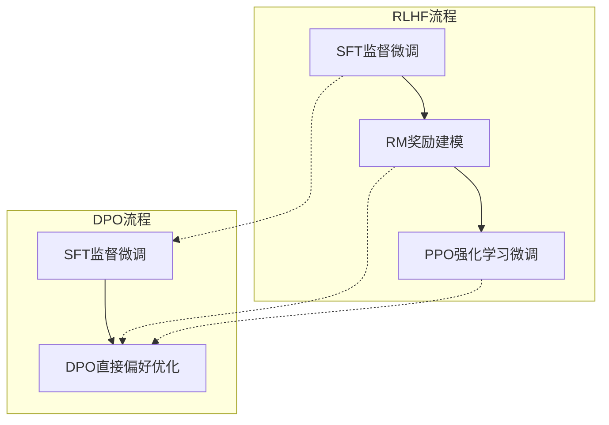
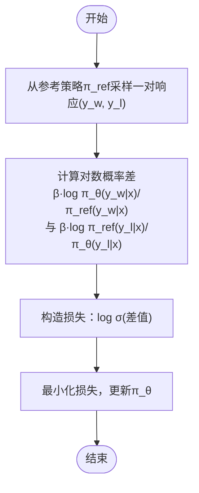
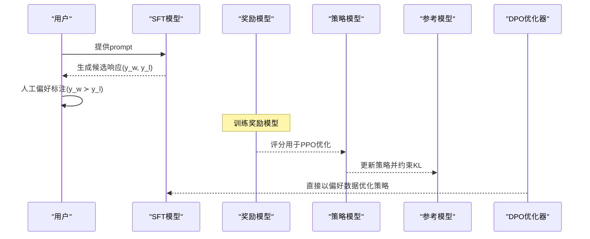
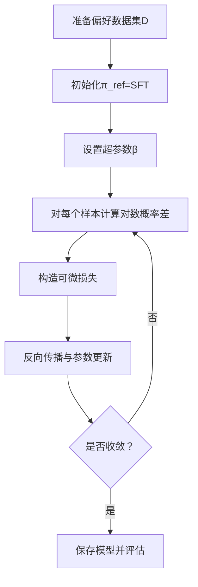
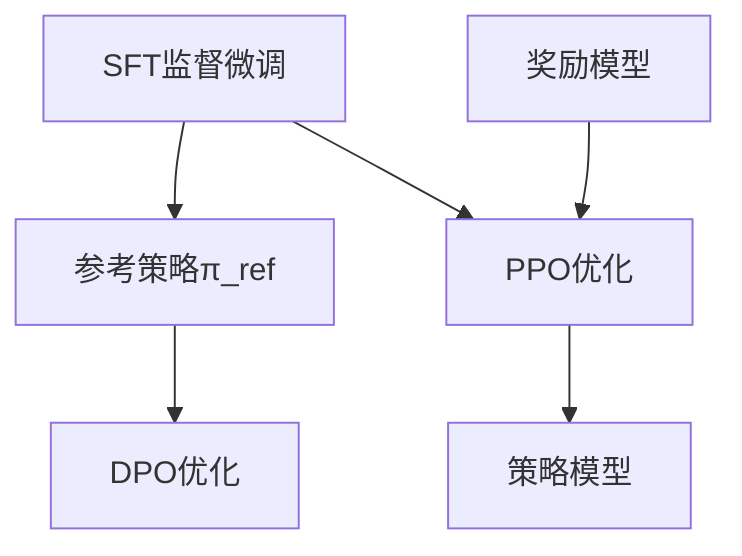

# DPO直接偏好优化

<cite>
**本文引用的文件**
- [DPO.md](file://07.强化学习/DPO/DPO.md)
- [1.rlhf相关.md](file://07.强化学习/1.rlhf相关/1.rlhf相关.md)
- [近端策略优化(ppo).md](file://07.强化学习/近端策略优化(ppo)/近端策略优化(ppo).md)
- [llama 3.md](file://02.大语言模型架构/llama 3/llama 3.md)
- [README.md](file://07.强化学习/README.md)
</cite>

## 目录
1. [简介](#简介)
2. [项目结构](#项目结构)
3. [核心组件](#核心组件)
4. [架构概览](#架构概览)
5. [详细组件分析](#详细组件分析)
6. [依赖分析](#依赖分析)
7. [性能考量](#性能考量)
8. [故障排查指南](#故障排查指南)
9. [结论](#结论)
10. [附录](#附录)

## 简介
本文件围绕DPO（Direct Preference Optimization，直接偏好优化）方法，系统梳理其相对于传统RLHF（基于人类反馈的强化学习）的创新点与优势，包括简化训练流程、减少样本需求、避免奖励建模与强化学习复杂性等。文档从数学原理、损失函数设计、优化策略出发，结合与PPO的对比分析，给出算法实现步骤、实验结果解读与实践建议，帮助读者在理解理论的同时，掌握DPO在实际训练中的应用要点。

## 项目结构
本仓库中与DPO相关的核心资料集中在“强化学习”目录下，包含DPO原理与公式推导、RLHF流程与PPO实现说明，以及LLaMA3中对DPO的实际应用背景。下图展示了与DPO相关的知识组织关系。

图表来源
- [DPO.md](file://07.强化学习/DPO/DPO.md)
- [1.rlhf相关.md](file://07.强化学习/1.rlhf相关/1.rlhf相关.md)
- [近端策略优化(ppo).md](file://07.强化学习/近端策略优化(ppo)/近端策略优化(ppo).md)
- [llama 3.md](file://02.大语言模型架构/llama 3/llama 3.md)

章节来源
- [README.md:1-22](file://07.强化学习/README.md#L1-L22)

## 核心组件
- DPO目标函数与优化策略：通过直接比较首选与非首选响应在参考策略与当前策略下的对数概率差，构造可微损失，避免显式奖励建模与强化学习优化。
- RLHF三阶段流程：SFT（监督微调）→RM（奖励建模）→PPO（强化学习微调），强调RM与PPO的复杂性与计算成本。
- PPO策略优化：重要性采样与KL约束，通过裁剪或惩罚项控制策略更新幅度，保证训练稳定性。
- LLAMA3后训练组合：SFT、拒绝采样、PPO、DPO的联合使用，体现DPO在实际大模型对齐中的地位与效果。

章节来源
- [DPO.md:54-116](file://07.强化学习/DPO/DPO.md#L54-L116)
- [1.rlhf相关.md:17-120](file://07.强化学习/1.rlhf相关/1.rlhf相关.md#L17-L120)
- [近端策略优化(ppo).md](file://07.强化学习/近端策略优化(ppo)/近端策略优化(ppo).md#L101-L187)
- [llama 3.md:73-77](file://02.大语言模型架构/llama 3/llama 3.md#L73-L77)

## 架构概览
下图展示了DPO与RLHF/PPO在训练流程上的关键差异：DPO绕过奖励建模与强化学习，直接以偏好数据优化策略；RLHF需RM与PPO协同，训练周期长、计算成本高。

图表来源
- [DPO.md:18-53](file://07.强化学习/DPO/DPO.md#L18-L53)
- [1.rlhf相关.md:17-120](file://07.强化学习/1.rlhf相关/1.rlhf相关.md#L17-L120)

## 详细组件分析

### 数学原理与目标函数
- DPO目标函数通过比较首选与非首选响应在参考策略与当前策略下的对数概率差，构造可微损失，使偏好响应在当前策略下更可能被采样，非偏好响应更不可能被采样。
- 参考策略π_ref的作用：作为对比基准，若π_ref对偏好响应得分较低或对非偏好响应得分较高，DPO会相应放大奖励系数，引导策略向偏好方向移动。
- β超参数：控制当前策略与参考策略之间的KL约束强度，平衡奖励最大化与分布稳定性。

图表来源
- [DPO.md:69-97](file://07.强化学习/DPO/DPO.md#L69-L97)

章节来源
- [DPO.md:69-97](file://07.强化学习/DPO/DPO.md#L69-L97)

### 与PPO的对比分析
- 训练复杂度：PPO需要策略模型、奖励模型、评论模型与参考模型四类组件，且依赖强化学习优化；DPO仅需参考策略与当前策略，直接以偏好数据优化，显著简化实现与训练。
- 稳定性与样本效率：DPO通过显式的对数概率差与可微损失，避免了强化学习的不稳定性；实验显示DPO在不同采样温度下更鲁棒，且在保持较小KL散度的同时达到更高奖励。
- 实践成本：PPO的多模型与超参数调整增加了训练成本与调试难度；DPO无需奖励建模与采样，降低了计算与数据标注成本。

图表来源
- [1.rlhf相关.md:17-120](file://07.强化学习/1.rlhf相关/1.rlhf相关.md#L17-L120)
- [近端策略优化(ppo).md](file://07.强化学习/近端策略优化(ppo)/近端策略优化(ppo).md#L101-L187)
- [DPO.md:54-97](file://07.强化学习/DPO/DPO.md#L54-L97)

章节来源
- [1.rlhf相关.md:17-120](file://07.强化学习/1.rlhf相关/1.rlhf相关.md#L17-L120)
- [近端策略优化(ppo).md](file://07.强化学习/近端策略优化(ppo)/近端策略优化(ppo).md#L101-L187)
- [DPO.md:54-97](file://07.强化学习/DPO/DPO.md#L54-L97)

### 算法实现步骤（流程化）
- 数据准备：从参考策略π_ref采样一对响应(y_w, y_l)，构建偏好数据集D。
- 初始化：参考策略π_ref可初始化为SFT模型；β为KL约束超参数。
- 损失计算：对每个样本计算对数概率差并构造可微损失。
- 优化更新：最小化损失，更新当前策略π_θ，保持与参考策略的KL约束。
- 评估与迭代：在验证集上评估KL散度与奖励，按需调整β与学习率。

图表来源
- [DPO.md:94-105](file://07.强化学习/DPO/DPO.md#L94-L105)

章节来源
- [DPO.md:94-105](file://07.强化学习/DPO/DPO.md#L94-L105)

### 实验结果与对比解读
- 奖励与KL散度：DPO在保持较小KL散度的同时达到更高奖励，相较PPO在奖励增大时KL散度随之增大的现象更具稳定性。
- 采样温度鲁棒性：DPO在不同采样温度下全面优于PPO，且在Best of N基线的最佳温度下也更胜一筹。
- 实际应用：LLaMA3在后训练中采用SFT、拒绝采样、PPO与DPO的组合，偏好排名对提升推理与编码性能有显著帮助。

章节来源
- [DPO.md:107-116](file://07.强化学习/DPO/DPO.md#L107-L116)
- [llama 3.md:73-77](file://02.大语言模型架构/llama 3/llama 3.md#L73-L77)

## 依赖分析
- DPO依赖SFT阶段提供的参考策略π_ref，通常初始化为SFT模型，以缓解真实π_ref与DPO使用的π_ref之间的分布偏移。
- DPO与PPO在目标函数设计上存在本质差异：DPO直接优化策略，避免奖励建模与强化学习的复杂性；PPO通过奖励模型与KL约束实现策略更新。
- 在实际工程中，DPO可作为PPO的替代方案，尤其在需要简化训练流程、降低计算成本与提高稳定性时。

图表来源
- [DPO.md:94-105](file://07.强化学习/DPO/DPO.md#L94-L105)
- [1.rlhf相关.md:17-120](file://07.强化学习/1.rlhf相关/1.rlhf相关.md#L17-L120)

章节来源
- [DPO.md:94-105](file://07.强化学习/DPO/DPO.md#L94-L105)
- [1.rlhf相关.md:17-120](file://07.强化学习/1.rlhf相关/1.rlhf相关.md#L17-L120)

## 性能考量
- 计算成本：DPO避免奖励建模与强化学习，显著降低训练与推理成本，适合资源受限场景。
- 样本效率：偏好数据集可直接用于DPO优化，减少采样与标注成本；在实践中可复用公开偏好数据集。
- 稳定性：DPO通过可微损失与KL约束，避免PPO在强化学习中的不稳定性与超参数敏感性。
- 实践建议：优先使用SFT初始化π_ref；合理设置β以平衡奖励与稳定性；在不同采样温度下评估鲁棒性。

## 故障排查指南
- 参考策略初始化不当：若π_ref与SFT差异过大，可能导致DPO优化困难。建议使用SFT初始化π_ref，并在数据层面进行质量控制。
- β设置不合理：β过小可能导致策略更新缓慢，β过大可能导致过度约束与欠拟合。建议通过验证集评估KL散度与奖励，动态调整β。
- 偏好数据质量：偏好标注的主观性与噪声会影响DPO效果。建议采用多轮质量保证与一致性校验，减少标注偏差。
- 与PPO对比：若PPO在特定任务上表现更优，可考虑在关键阶段使用PPO，其余阶段采用DPO以降低成本。

章节来源
- [DPO.md:94-105](file://07.强化学习/DPO/DPO.md#L94-L105)
- [1.rlhf相关.md:53-87](file://07.强化学习/1.rlhf相关/1.rlhf相关.md#L53-L87)

## 结论
DPO通过直接偏好优化，绕过了RLHF中的奖励建模与强化学习复杂性，实现了更稳定、高效且易于实现的对齐方法。相比PPO，DPO在训练流程、计算成本与稳定性方面具备显著优势，尤其适合需要快速迭代与资源受限的场景。结合LLaMA3等实际应用，DPO已成为现代大模型对齐的重要工具之一。

## 附录
- 参考资料与链接：DPO论文与代码仓库、PPO实现与RLHF流程说明、LLaMA3后训练组合。
- 相关主题：策略梯度、重要性采样、KL散度约束、奖励建模与强化学习。

章节来源
- [DPO.md:1-7](file://07.强化学习/DPO/DPO.md#L1-L7)
- [近端策略优化(ppo).md](file://07.强化学习/近端策略优化(ppo)/近端策略优化(ppo).md#L188-L466)
- [llama 3.md:73-77](file://02.大语言模型架构/llama 3/llama 3.md#L73-L77)