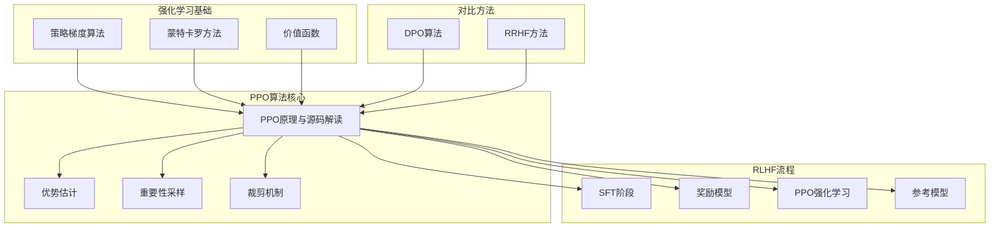
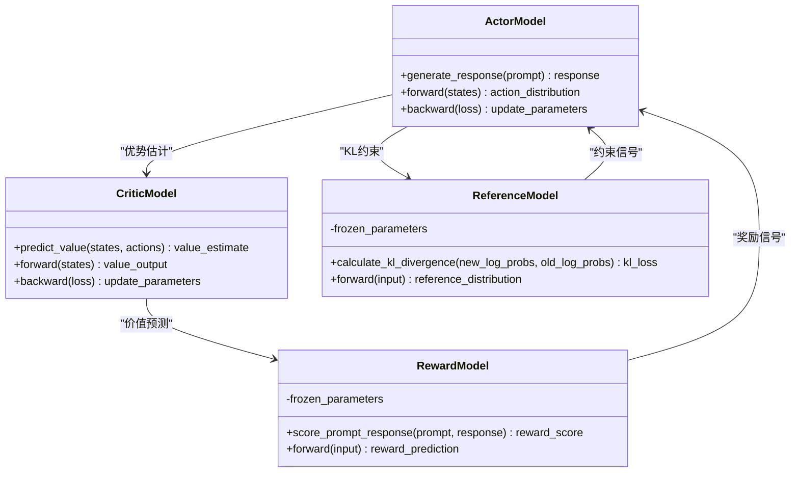
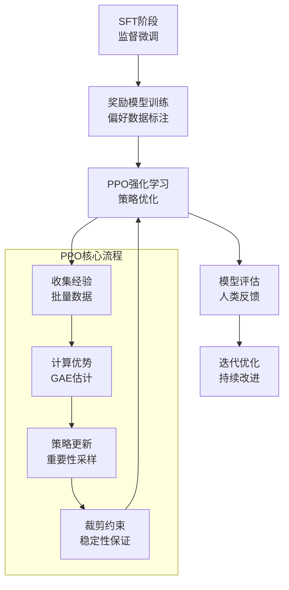
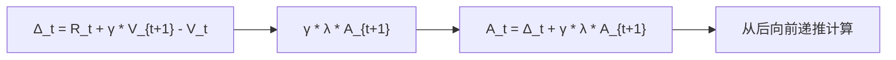
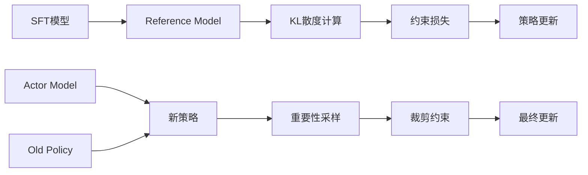
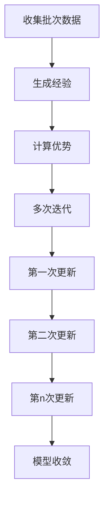
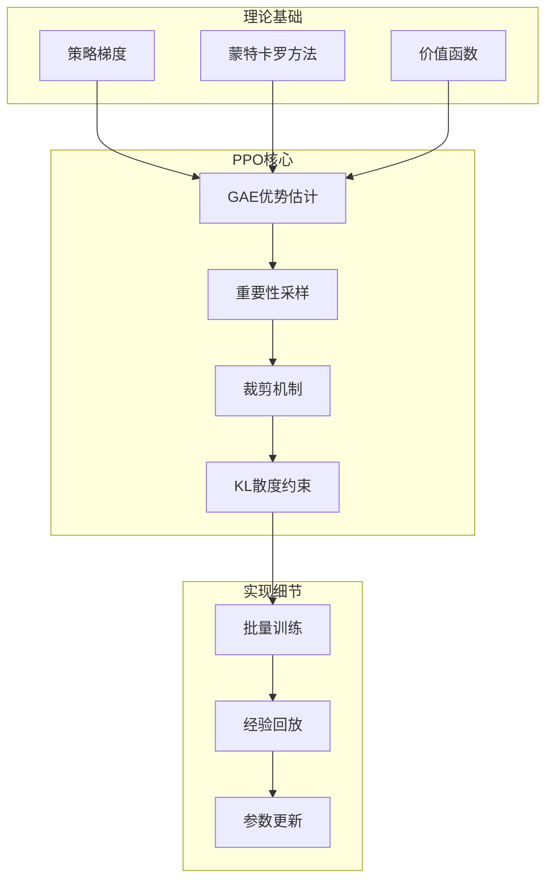
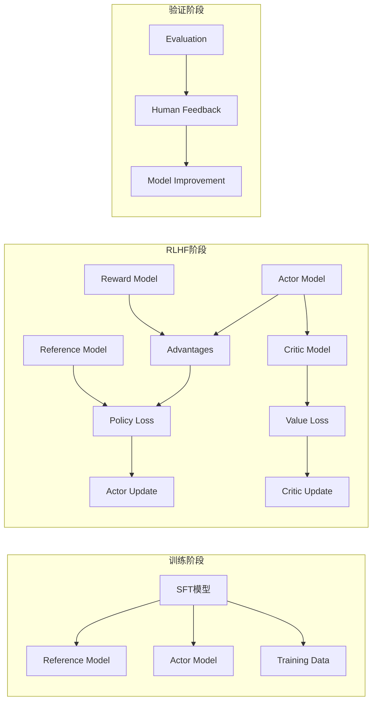
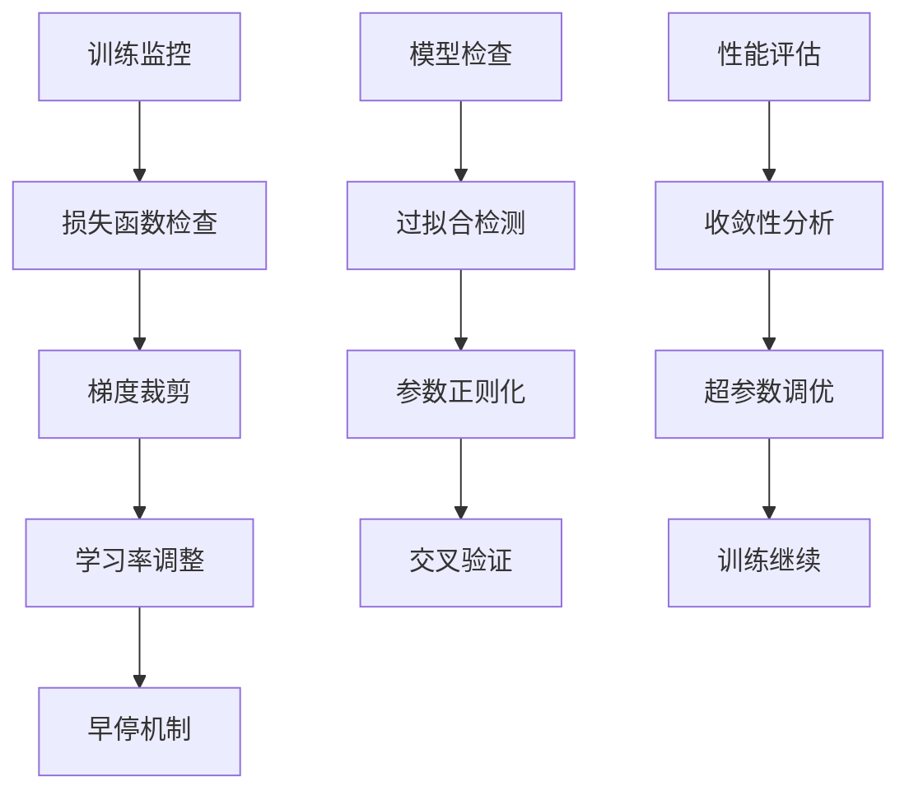
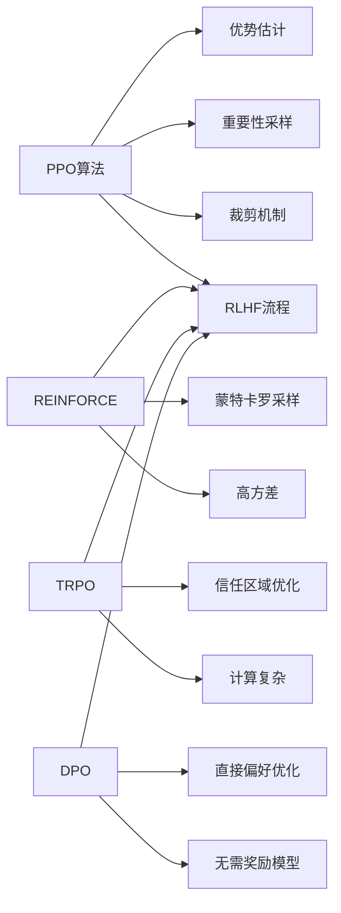

# PPO策略优化算法

<cite>
**本文档引用的文件**
- [大模型RLHF：PPO原理与源码解读.md](file://07.强化学习/大模型RLHF：PPO原理与源码解读/大模型RLHF：PPO原理与源码解读.md)
- [策略梯度（pg）.md](file://07.强化学习/策略梯度（pg）/策略梯度（pg）.md)
- [DPO.md](file://07.强化学习/DPO/DPO.md)
- [1.rlhf相关.md](file://07.强化学习/1.rlhf相关/1.rlhf相关.md)
- [README.md](file://README.md)
</cite>

## 目录
1. [引言](#引言)
2. [项目结构](#项目结构)
3. [核心组件](#核心组件)
4. [架构概览](#架构概览)
5. [详细组件分析](#详细组件分析)
6. [依赖关系分析](#依赖关系分析)
7. [性能考虑](#性能考虑)
8. [故障排除指南](#故障排除指南)
9. [结论](#结论)
10. [附录](#附录)

## 引言

PPO（近端策略优化）算法是强化学习领域的重要突破，特别适用于大语言模型的训练和微调。本文档基于深度学习社区开源项目deepspeed-chat的源码实现，深入解析PPO算法的核心思想和技术细节，包括重要性采样、裁剪机制和优势估计等关键技术。

PPO算法在RLHF（基于人类反馈的强化学习）流程中扮演着关键角色，通过四个核心模型的协同工作：演员模型（Actor）、评论家模型（Critic）、奖励模型（Reward）和参考模型（Reference）。这种设计使得大语言模型能够在保持稳定性的同时，有效提升生成内容的质量和人类偏好匹配度。

## 项目结构

本项目围绕大语言模型的强化学习训练构建，重点关注PPO算法的理论基础和实践应用。项目结构清晰地展示了从基础理论到高级应用的学习路径：



**图表来源**
- [README.md:133-142](file://README.md#L133-L142)
- [大模型RLHF：PPO原理与源码解读.md:1-568](file://07.强化学习/大模型RLHF：PPO原理与源码解读/大模型RLHF：PPO原理与源码解读.md#L1-L568)

**章节来源**
- [README.md:37-169](file://README.md#L37-L169)

## 核心组件

### 四个核心模型架构

PPO算法在RLHF流程中涉及四个关键模型，每个模型都有明确的职责分工：



**图表来源**
- [大模型RLHF：PPO原理与源码解读.md:81-170](file://07.强化学习/大模型RLHF：PPO原理与源码解读/大模型RLHF：PPO原理与源码解读.md#L81-L170)

### 关键算法组件

PPO算法的核心实现包含以下关键组件：

1. **优势估计模块**：基于广义优势估计（GAE）计算优势函数
2. **重要性采样模块**：计算新旧策略之间的比率
3. **裁剪机制模块**：限制策略更新的幅度
4. **KL散度约束模块**：防止策略过度偏离参考模型

**章节来源**
- [大模型RLHF：PPO原理与源码解读.md:171-568](file://07.强化学习/大模型RLHF：PPO原理与源码解读/大模型RLHF：PPO原理与源码解读.md#L171-L568)

## 架构概览

### RLHF整体流程架构

PPO算法在RLHF流程中的位置和作用：



**图表来源**
- [1.rlhf相关.md:100-121](file://07.强化学习/1.rlhf相关/1.rlhf相关.md#L100-L121)
- [大模型RLHF：PPO原理与源码解读.md:391-430](file://07.强化学习/大模型RLHF：PPO原理与源码解读/大模型RLHF：PPO原理与源码解读.md#L391-L430)

### PPO算法核心流程

```mermaid
sequenceDiagram
participant Env as 环境
participant Actor as 演员模型
participant Critic as 评论家模型
participant Ref as 参考模型
participant RM as 奖励模型
Env->>Actor : 获取prompt
Actor->>Env : 生成response
Env->>RM : 计算即时奖励Rt
RM-->>Env : 返回奖励分数
Env->>Critic : 价值估计Vt
Critic-->>Env : 返回价值预测
Note over Actor,Critic : 优势估计
Env->>Env : 计算Advantages
Env->>Actor : 重要性采样比率
Env->>Actor : 裁剪约束
loop PPO-epochs
Actor->>Actor : 策略更新
Critic->>Critic : 价值函数更新
end
Actor->>Ref : KL散度约束
Ref-->>Actor : 参考分布
```

**图表来源**
- [大模型RLHF：PPO原理与源码解读.md:404-484](file://07.强化学习/大模型RLHF：PPO原理与源码解读/大模型RLHF：PPO原理与源码解读.md#L404-L484)

## 详细组件分析

### 优势估计与GAE算法

优势函数是PPO算法的核心概念，它衡量了在特定状态下采取某个动作相对于平均表现的优劣程度。

#### 传统优势估计

传统的优势估计基于即时奖励和价值函数的差值：

```
Advantage_t = R_t + γ * V_{t+1} - V_t
```

其中：
- `R_t`：即时奖励
- `γ`：折扣因子
- `V_t`：状态价值函数

#### GAE优势估计

广义优势估计（GAE）通过引入衰减因子λ来平衡偏差和方差：



**图表来源**
- [大模型RLHF：PPO原理与源码解读.md:319-374](file://07.强化学习/大模型RLHF：PPO原理与源码解读/大模型RLHF：PPO原理与源码解读.md#L319-L374)

**章节来源**
- [大模型RLHF：PPO原理与源码解读.md:205-374](file://07.强化学习/大模型RLHF：PPO原理与源码解读/大模型RLHF：PPO原理与源码解读.md#L205-L374)

### 重要性采样与裁剪机制

#### 重要性采样原理

重要性采样是PPO算法的关键创新，它解决了策略评估和策略改进之间的冲突：

```
ρ_t = π_θ(a_t|s_t) / π_old(a_t|s_t)
```

其中：
- `π_θ`：新策略
- `π_old`：旧策略（收集经验时使用的策略）

#### 裁剪机制实现

为了保持训练稳定性，PPO引入了裁剪机制：

```mermaid
flowchart TD
A[比率计算] --> B{|ρ_t - 1| ≤ ε?}
B --> |是| C[使用原始比率]
B --> |否| D[使用裁剪边界]
C["ρ̃_t = ρ_t"]
D["ρ̃_t = clip(ρ_t, 1-ε, 1+ε)"]
E[损失计算] --> F[裁剪损失]
F --> G[min(Adv_t * ρ_t, Adv_t * ρ̃_t)]
```

**图表来源**
- [大模型RLHF：PPO原理与源码解读.md:449-484](file://07.强化学习/大模型RLHF：PPO原理与源码解读/大模型RLHF：PPO原理与源码解读.md#L449-L484)

**章节来源**
- [大模型RLHF：PPO原理与源码解读.md:437-484](file://07.强化学习/大模型RLHF：PPO原理与源码解读/大模型RLHF：PPO原理与源码解读.md#L437-L484)

### KL散度约束与参考模型

#### KL散度的作用

KL散度约束防止策略更新过大，保持与参考模型的相似性：

```
KL[π_old || π_ref] = Σ P(s) * Σ_a π_old(a|s) * log(π_old(a|s)/π_ref(a|s))
```

#### 参考模型的实现

参考模型通常使用SFT阶段的模型初始化，参数保持冻结状态：



**图表来源**
- [大模型RLHF：PPO原理与源码解读.md:111-130](file://07.强化学习/大模型RLHF：PPO原理与源码解读/大模型RLHF：PPO原理与源码解读.md#L111-L130)

**章节来源**
- [大模型RLHF：PPO原理与源码解读.md:111-130](file://07.强化学习/大模型RLHF：PPO原理与源码解读/大模型RLHF：PPO原理与源码解读.md#L111-L130)

### 批量训练与PPO-epochs

#### 批量训练策略

PPO算法采用批量训练策略，充分利用收集到的经验数据：



#### PPO-epochs的作用

通过多次迭代使用相同批次数据，PPO算法实现了：

1. **样本效率提升**：充分利用单次收集的数据
2. **训练稳定性**：使用相同的经验数据进行多次更新
3. **收敛性改善**：通过多次迭代逐步优化策略

**章节来源**
- [大模型RLHF：PPO原理与源码解读.md:404-430](file://07.强化学习/大模型RLHF：PPO原理与源码解读/大模型RLHF：PPO原理与源码解读.md#L404-L430)

## 依赖关系分析

### 算法依赖关系

PPO算法的各个组件之间存在复杂的依赖关系：



**图表来源**
- [策略梯度（pg）.md:32-132](file://07.强化学习/策略梯度（pg）/策略梯度（pg）.md#L32-L132)
- [大模型RLHF：PPO原理与源码解读.md:171-568](file://07.强化学习/大模型RLHF：PPO原理与源码解读/大模型RLHF：PPO原理与源码解读.md#L171-L568)

### 模型间依赖关系



**图表来源**
- [1.rlhf相关.md:17-42](file://07.强化学习/1.rlhf相关/1.rlhf相关.md#L17-L42)
- [大模型RLHF：PPO原理与源码解读.md:81-170](file://07.强化学习/大模型RLHF：PPO原理与源码解读/大模型RLHF：PPO原理与源码解读.md#L81-L170)

**章节来源**
- [1.rlhf相关.md:17-42](file://07.强化学习/1.rlhf相关/1.rlhf相关.md#L17-L42)

## 性能考虑

### 计算资源优化

PPO算法在大语言模型训练中面临的主要性能挑战：

1. **内存使用优化**：通过批量训练减少内存峰值
2. **计算效率提升**：利用GPU并行计算优势
3. **数据传输优化**：减少模型间通信开销

### 训练稳定性保障



### 收敛性分析

PPO算法的收敛特性：

1. **理论收敛性**：在适当条件下保证收敛
2. **实际收敛性**：通过超参数调优改善收敛速度
3. **稳定性保证**：裁剪机制确保训练稳定

## 故障排除指南

### 常见问题诊断

#### 训练不稳定问题

**症状**：损失函数波动大，训练结果不稳定

**可能原因**：
1. 学习率设置不当
2. 裁剪范围设置过小
3. 批次大小不合适

**解决方案**：
1. 调整学习率参数
2. 适当扩大裁剪范围
3. 优化批次大小设置

#### 收敛缓慢问题

**症状**：训练进度缓慢，需要大量迭代

**可能原因**：
1. 优势估计不准确
2. KL散度约束过强
3. PPO-epochs设置不当

**解决方案**：
1. 优化GAE参数设置
2. 调整KL散度权重
3. 合理设置训练轮数

#### 内存溢出问题

**症状**：训练过程中出现内存不足错误

**可能原因**：
1. 批次大小过大
2. 模型参数过多
3. GPU内存不足

**解决方案**：
1. 减小批次大小
2. 使用梯度累积
3. 优化模型结构

**章节来源**
- [大模型RLHF：PPO原理与源码解读.md:502-568](file://07.强化学习/大模型RLHF：PPO原理与源码解读/大模型RLHF：PPO原理与源码解读.md#L502-L568)

## 结论

PPO算法作为强化学习领域的重要突破，在大语言模型训练中展现了卓越的性能和稳定性。通过深入分析deepspeed-chat项目的源码实现，我们可以看到PPO算法在理论和实践层面的完美结合。

### 主要优势

1. **稳定性**：通过裁剪机制和KL散度约束保证训练稳定
2. **样本效率**：批量训练策略大幅提升数据利用率
3. **收敛性**：GAE优势估计提供更好的收敛性能
4. **实用性**：在RLHF流程中发挥关键作用

### 技术创新

1. **重要性采样**：解决策略评估和改进的冲突
2. **GAE优势估计**：平衡偏差和方差的估计方法
3. **批量训练**：充分利用经验数据的训练策略
4. **多模型协同**：四个核心模型的有机结合

### 应用前景

PPO算法在大语言模型训练中的应用前景广阔，特别是在以下方面：

1. **对话系统优化**：提升对话质量和用户体验
2. **内容生成改进**：生成更符合人类偏好的内容
3. **多模态应用**：扩展到图像、音频等多模态任务
4. **个性化服务**：根据不同用户需求定制模型

通过持续的研究和优化，PPO算法将继续在大语言模型的发展中发挥重要作用，推动人工智能技术向更高水平发展。

## 附录

### 超参数设置建议

基于源码实现的经验，以下是PPO算法的超参数设置建议：

| 参数名称 | 默认值 | 建议范围 | 说明 |
|---------|--------|----------|------|
| kl_ctl | 0.1 | 0.05-0.2 | KL散度控制系数 |
| clip_reward_value | 5 | 3-10 | 奖励裁剪上限 |
| cliprange | 0.2 | 0.1-0.3 | 裁剪范围 |
| cliprange_value | 0.2 | 0.1-0.3 | 价值函数裁剪范围 |
| gamma | 0.99 | 0.95-0.99 | 折扣因子 |
| lam | 0.95 | 0.9-0.95 | GAE衰减因子 |
| ppo_epochs | 4 | 1-8 | 训练轮数 |

### 实际应用案例

#### 对话系统优化

在对话系统中，PPO算法可以：
1. 提升对话连贯性和逻辑性
2. 减少不当内容的产生
3. 改善用户满意度

#### 内容创作助手

在内容创作场景中，PPO算法能够：
1. 生成更符合用户需求的内容
2. 保持内容的原创性和质量
3. 提升创作效率

#### 代码生成助手

在编程辅助场景中，PPO算法的作用包括：
1. 生成更准确的代码片段
2. 提供更好的编程建议
3. 减少代码错误率

### 相关算法对比



**图表来源**
- [DPO.md:54-117](file://07.强化学习/DPO/DPO.md#L54-L117)