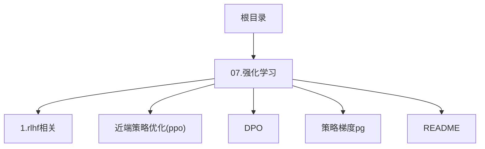
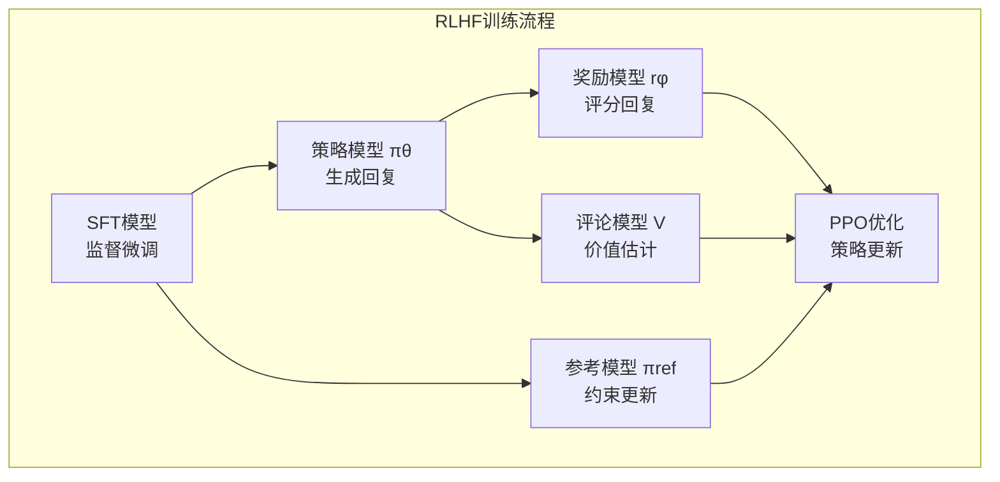
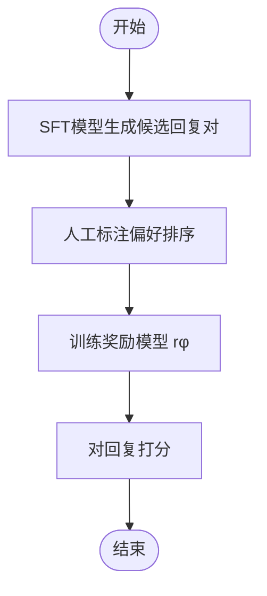
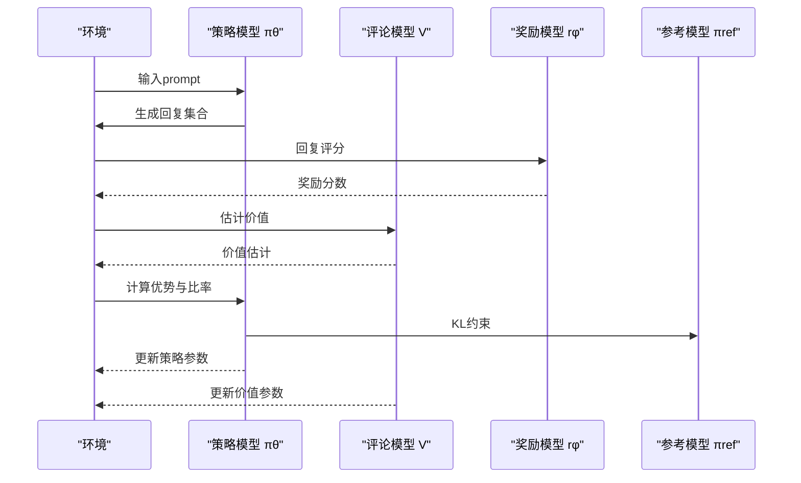
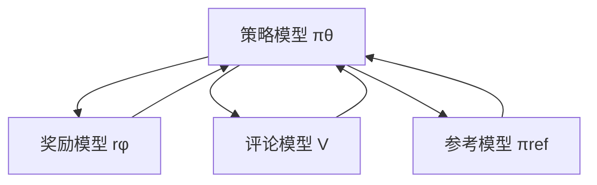

# RLHF原理与实现

<cite>
**本文档引用的文件**
- [07.强化学习/1.rlhf相关/1.rlhf相关.md](file://07.强化学习/1.rlhf相关/1.rlhf相关.md)
- [07.强化学习/近端策略优化(ppo)/近端策略优化(ppo).md](file://07.强化学习/近端策略优化(ppo)/近端策略优化(ppo).md)
- [07.强化学习/DPO/DPO.md](file://07.强化学习/DPO/DPO.md)
- [07.强化学习/策略梯度（pg）/策略梯度（pg）.md](file://07.强化学习/策略梯度（pg）/策略梯度（pg）.md)
- [07.强化学习/README.md](file://07.强化学习/README.md)
- [README.md](file://README.md)
</cite>

## 目录
1. [简介](#简介)
2. [项目结构](#项目结构)
3. [核心组件](#核心组件)
4. [架构概览](#架构概览)
5. [详细组件分析](#详细组件分析)
6. [依赖分析](#依赖分析)
7. [性能考量](#性能考量)
8. [故障排查指南](#故障排查指南)
9. [结论](#结论)
10. [附录](#附录)

## 简介
本文件围绕基于人类反馈的强化学习（RLHF）原理与实现展开，系统阐述奖励建模、人类偏好收集、策略优化等关键步骤，并重点解析PPO（近端策略优化）在RLHF中的应用。文档结合仓库中的理论与实践资料，提供算法流程图与代码实现示例路径，帮助读者理解如何通过人类反馈数据训练模型，使其输出更符合人类价值观与期望，并覆盖实际训练流程、参数调优与性能评估方法。

## 项目结构
本仓库聚焦于大语言模型的强化学习与RLHF相关内容，核心分布在“07.强化学习”目录下，包含RLHF流程、PPO算法原理与实现、DPO对比方案以及策略梯度基础等材料。整体组织以主题模块划分，便于按需查阅。

图表来源
- [README.md:133-142](file://README.md#L133-L142)
- [07.强化学习/README.md:1-22](file://07.强化学习/README.md#L1-L22)

章节来源
- [README.md:133-142](file://README.md#L133-L142)
- [07.强化学习/README.md:1-22](file://07.强化学习/README.md#L1-L22)

## 核心组件
- 奖励模型（Reward Model, RM）：通过人类偏好排序数据训练，输出回复质量的奖励分数，用于RL阶段的策略优化。
- 策略模型（Policy Model, πθ）：在RLHF中指经SFT微调后的语言模型，负责生成回复并接受RM评分。
- 评论模型（Critic Model, V）：估计状态-动作价值，辅助优势估计与策略更新。
- 参考模型（Reference Model, πref）：提供SFT模型备份，约束策略更新幅度，防止过大漂移。
- 人类偏好数据（Preference Data）：由人类标注的排序数据，用于训练RM与RL阶段的偏好引导。

章节来源
- [07.强化学习/1.rlhf相关/1.rlhf相关.md:100-120](file://07.强化学习/1.rlhf相关/1.rlhf相关.md#L100-L120)
- [07.强化学习/DPO/DPO.md:42-52](file://07.强化学习/DPO/DPO.md#L42-L52)

## 架构概览
RLHF的整体流程分为三阶段：监督微调（SFT）、奖励建模（RM）、强化学习微调（PPO）。下图展示了四模型交互与数据流的关键节点。

图表来源
- [07.强化学习/1.rlhf相关/1.rlhf相关.md:100-120](file://07.强化学习/1.rlhf相关/1.rlhf相关.md#L100-L120)
- [07.强化学习/DPO/DPO.md:42-52](file://07.强化学习/DPO/DPO.md#L42-L52)

## 详细组件分析

### 奖励建模（Reward Modeling）
- 数据来源：SFT模型对同一prompt生成的候选回复对（choice/reject），经人类标注偏好排序。
- 模型目标：将偏好排序关系映射为奖励分数，使偏好回复得分高于非偏好回复。
- 损失函数：二元分类的负对数似然，通过sigmoid连接偏好差分，鼓励RM对偏好对做出正确排序。

图表来源
- [07.强化学习/1.rlhf相关/1.rlhf相关.md:25-41](file://07.强化学习/1.rlhf相关/1.rlhf相关.md#L25-L41)
- [07.强化学习/DPO/DPO.md:30-41](file://07.强化学习/DPO/DPO.md#L30-L41)

章节来源
- [07.强化学习/1.rlhf相关/1.rlhf相关.md:25-41](file://07.强化学习/1.rlhf相关/1.rlhf相关.md#L25-L41)
- [07.强化学习/DPO/DPO.md:30-41](file://07.强化学习/DPO/DPO.md#L30-L41)

### 人类偏好收集与数据生产
- 采样策略：SFT模型对同一prompt生成多个回复，使用beam search等策略扩大多样性。
- 标注成本：排序标注相比逐字生成标注成本更低，适合规模化生产。
- 数据质量保障：通过模拟数据、主动学习、在线学习、众包协作等方式提升数据生产效率与质量。

章节来源
- [07.强化学习/1.rlhf相关/1.rlhf相关.md:25-41](file://07.强化学习/1.rlhf相关/1.rlhf相关.md#L25-L41)
- [07.强化学习/1.rlhf相关/1.rlhf相关.md:65-75](file://07.强化学习/1.rlhf相关/1.rlhf相关.md#L65-L75)

### 策略优化（PPO在RLHF中的应用）
- 优化目标：最大化期望奖励，同时加入KL散度正则项，约束策略更新幅度，防止偏离参考策略过大。
- 关键步骤：
  1) 环境采样：策略模型基于输入生成回复，奖励模型打分。
  2) 优势估计：评论模型预测未来累积奖励，结合广义优势估计（GAE）估计优势函数。
  3) 优化调整：使用重要性采样比率与裁剪（clip）策略，结合评论模型价值误差，更新策略与评论模型。

图表来源
- [07.强化学习/1.rlhf相关/1.rlhf相关.md:116-120](file://07.强化学习/1.rlhf相关/1.rlhf相关.md#L116-L120)
- [07.强化学习/近端策略优化(ppo)/近端策略优化(ppo).md:188-441](file://07.强化学习/近端策略优化(ppo)/近端策略优化(ppo).md#L188-L441)

章节来源
- [07.强化学习/1.rlhf相关/1.rlhf相关.md:116-120](file://07.强化学习/1.rlhf相关/1.rlhf相关.md#L116-L120)
- [07.强化学习/近端策略优化(ppo)/近端策略优化(ppo).md:188-441](file://07.强化学习/近端策略优化(ppo)/近端策略优化(ppo).md#L188-L441)

### PPO算法要点与实现路径
- 重要性采样与裁剪：通过比率裁剪避免更新幅度过大，提升稳定性。
- 优势估计与价值误差：结合GAE与评论模型价值误差，稳定策略更新。
- 超参数与调优：裁剪范围ε、学习率、KL散度系数β、更新轮数等需结合任务调优。

章节来源
- [07.强化学习/近端策略优化(ppo)/近端策略优化(ppo).md:144-187](file://07.强化学习/近端策略优化(ppo)/近端策略优化(ppo).md#L144-L187)
- [07.强化学习/近端策略优化(ppo)/近端策略优化(ppo).md:224-441](file://07.强化学习/近端策略优化(ppo)/近端策略优化(ppo).md#L224-L441)

### DPO对比与优势
- DPO绕过奖励建模，直接使用偏好数据优化策略，避免采样与奖励建模的复杂性。
- 目标函数通过参考策略与当前策略的概率差分，引导偏好回复概率上升、非偏好回复概率下降。
- 实验显示DPO在多项指标上与RLHF相当或更优，且实现更简洁、训练更稳定。

章节来源
- [07.强化学习/DPO/DPO.md:54-117](file://07.强化学习/DPO/DPO.md#L54-L117)

### 策略梯度基础
- PG将策略参数化为神经网络，通过蒙特卡洛采样与对数概率梯度估计，实现策略优化。
- 为理解PPO的异策略与重要性采样提供基础。

章节来源
- [07.强化学习/策略梯度（pg）/策略梯度（pg）.md:202-330](file://07.强化学习/策略梯度（pg）/策略梯度（pg）.md#L202-L330)

## 依赖分析
- 组件耦合关系
  - 策略模型与奖励模型：RL阶段依赖RM评分；RM训练依赖SFT模型生成的回复对。
  - 评论模型与策略模型：共同参与优势估计与策略更新。
  - 参考模型：约束策略更新，避免过大漂移。
- 外部依赖
  - 人类偏好标注：数据生产成本与质量直接影响RLHF效果。
  - 计算资源：PPO阶段需要同时维护训练与推理的多个模型，资源开销较高。

图表来源
- [07.强化学习/1.rlhf相关/1.rlhf相关.md:109-115](file://07.强化学习/1.rlhf相关/1.rlhf相关.md#L109-L115)

章节来源
- [07.强化学习/1.rlhf相关/1.rlhf相关.md:109-115](file://07.强化学习/1.rlhf相关/1.rlhf相关.md#L109-L115)

## 性能考量
- 计算资源优化
  - 并行化与分布式训练：加速SFT、RM、PPO各阶段训练。
  - RRHF模式：减少模型数量，降低资源占用。
- 数据生产效率
  - 主动学习、模拟数据、在线学习、众包协作等手段提升数据规模化与质量。
- 算法稳定性
  - PPO中ε、β等超参数调优；KL散度约束与价值误差损失共同提升稳定性。

章节来源
- [07.强化学习/1.rlhf相关/1.rlhf相关.md:77-87](file://07.强化学习/1.rlhf相关/1.rlhf相关.md#L77-L87)
- [07.强化学习/1.rlhf相关/1.rlhf相关.md:89-99](file://07.强化学习/1.rlhf相关/1.rlhf相关.md#L89-L99)

## 故障排查指南
- 人类反馈主观性与延迟
  - 通过多专家标注、一致性校验与在线学习缓解主观性与延迟问题。
- 反馈错误影响
  - 建立反馈质量评估机制，过滤异常标注，减少错误反馈对策略的负面影响。
- 探索与利用平衡
  - 结合自适应探索策略，避免过度依赖人类反馈导致探索不足。

章节来源
- [07.强化学习/1.rlhf相关/1.rlhf相关.md:53-63](file://07.强化学习/1.rlhf相关/1.rlhf相关.md#L53-L63)

## 结论
RLHF通过奖励建模与PPO策略优化，将人类偏好对齐到语言模型输出，显著提升回复质量与安全性。DPO提供了更简洁稳定的替代方案，避免奖励建模与采样复杂性。实践中应重视数据生产效率、资源优化与超参数调优，以实现高质量、低成本的RLHF训练与部署。

## 附录
- 实现示例路径
  - PPO完整实现与训练流程：参见“近端策略优化(ppo)”文件中的PPO类与训练循环。
  - 策略梯度基础示例：参见“策略梯度（pg）”文件中的PG类与训练脚本。
- 相关文件导航
  - RLHF流程与四模型关系：参见“1.rlhf相关”文件。
  - DPO目标函数与实现思路：参见“DPO”文件。

章节来源
- [07.强化学习/近端策略优化(ppo)/近端策略优化(ppo).md:224-441](file://07.强化学习/近端策略优化(ppo)/近端策略优化(ppo).md#L224-L441)
- [07.强化学习/策略梯度（pg）/策略梯度（pg）.md:202-330](file://07.强化学习/策略梯度（pg）/策略梯度（pg）.md#L202-L330)
- [07.强化学习/1.rlhf相关/1.rlhf相关.md:100-120](file://07.强化学习/1.rlhf相关/1.rlhf相关.md#L100-L120)
- [07.强化学习/DPO/DPO.md:54-117](file://07.强化学习/DPO/DPO.md#L54-L117)