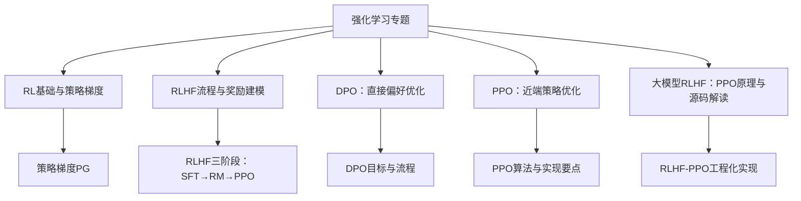
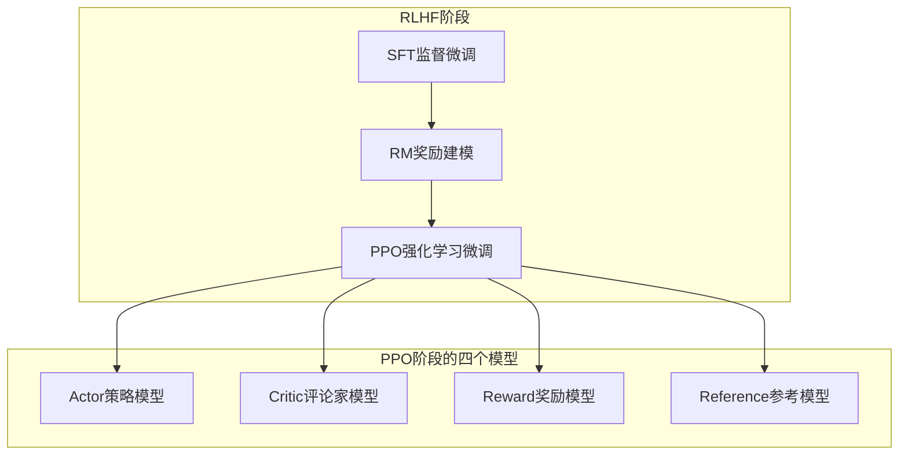
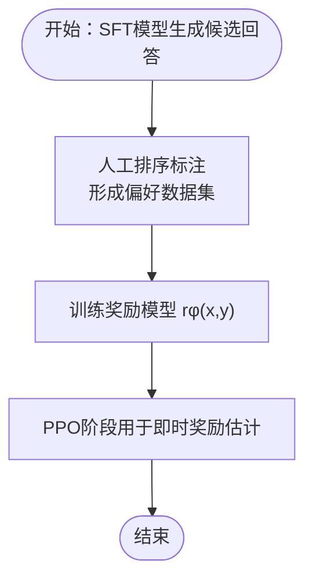
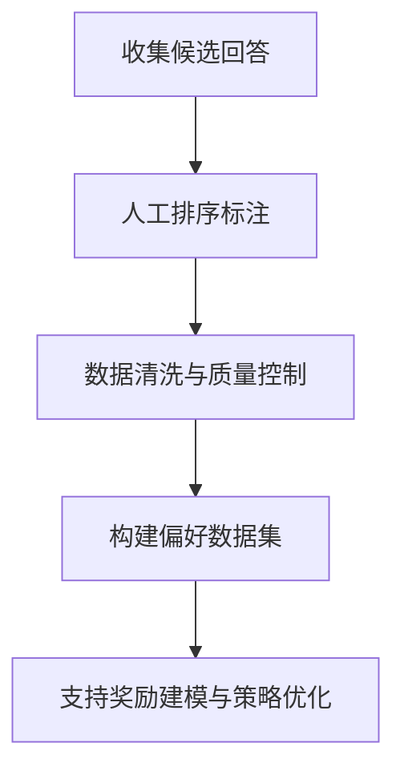
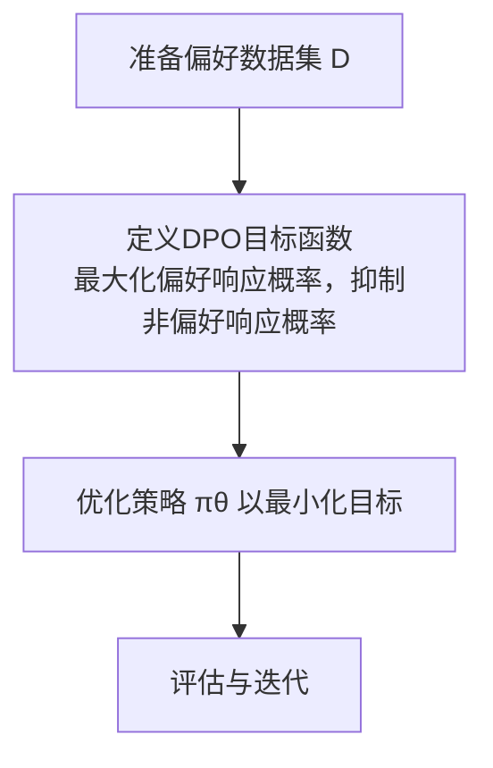
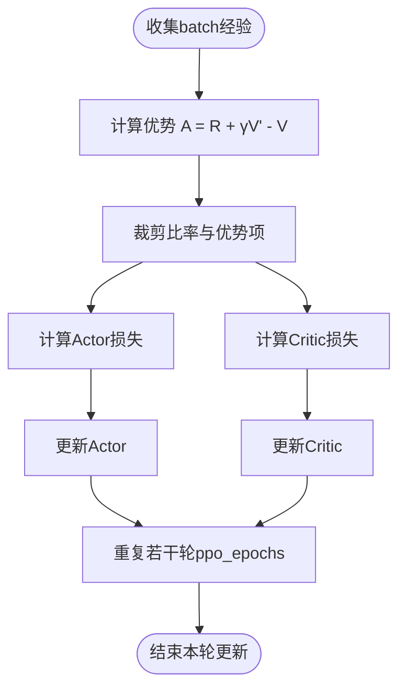
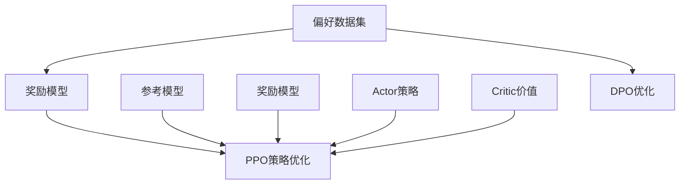

# 强化学习

<cite>
**本文引用的文件**
- [强化学习/README.md](file://07.强化学习/README.md)
- [强化学习/1.rlhf相关/1.rlhf相关.md](file://07.强化学习/1.rlhf相关/1.rlhf相关.md)
- [强化学习/DPO/DPO.md](file://07.强化学习/DPO/DPO.md)
- [强化学习/近端策略优化(ppo)/近端策略优化(ppo).md](file://07.强化学习/近端策略优化(ppo)/近端策略优化(ppo).md)
- [强化学习/策略梯度（pg）/策略梯度（pg）.md](file://07.强化学习/策略梯度（pg）/策略梯度（pg）.md)
- [强化学习/大模型RLHF：PPO原理与源码解读/大模型RLHF：PPO原理与源码解读.md](file://07.强化学习/大模型RLHF：PPO原理与源码解读/大模型RLHF：PPO原理与源码解读.md)
</cite>

## 目录
1. [引言](#引言)
2. [项目结构](#项目结构)
3. [核心组件](#核心组件)
4. [架构概览](#架构概览)
5. [详细组件分析](#详细组件分析)
6. [依赖分析](#依赖分析)
7. [性能考虑](#性能考虑)
8. [故障排查指南](#故障排查指南)
9. [结论](#结论)
10. [附录](#附录)

## 引言
本章节面向“基于人类反馈的强化学习（RLHF）”主题，系统梳理奖励建模、人类偏好收集、DPO（直接偏好优化）与PPO（近端策略优化）等关键环节，结合仓库中的资料，给出原理、流程与实现要点，帮助读者理解如何通过强化学习提升模型的对话质量与对齐效果。

## 项目结构
本仓库的“强化学习”专题由若干文档构成，覆盖RL基础、RLHF流程、DPO与PPO原理与实现要点，以及大模型RLHF的工程化实践。目录组织以主题为导向，便于按需查阅。



**图表来源**
- [强化学习/README.md:1-22](file://07.强化学习/README.md#L1-L22)

**章节来源**
- [强化学习/README.md:1-22](file://07.强化学习/README.md#L1-L22)

## 核心组件
- 奖励建模（Reward Modeling，RM）：从人类偏好数据中学习奖励函数，为策略优化提供反馈信号。
- 人类偏好收集：通过排序标注等方式构建偏好数据集，支撑奖励模型训练。
- 直接偏好优化（DPO）：绕过奖励建模，直接使用偏好数据优化策略，降低训练复杂度。
- 近端策略优化（PPO）：在RLHF中用于策略更新，结合优势估计与裁剪机制，稳定训练。
- 大模型RLHF-PPO工程化：在多模型（Actor/Critic/Reward/Reference）协同下，实现从prompt到response的对齐优化。

**章节来源**
- [强化学习/1.rlhf相关/1.rlhf相关.md:17-41](file://07.强化学习/1.rlhf相关/1.rlhf相关.md#L17-L41)
- [强化学习/DPO/DPO.md:54-117](file://07.强化学习/DPO/DPO.md#L54-L117)
- [强化学习/近端策略优化(ppo)/近端策略优化(ppo).md](file://07.强化学习/近端策略优化(ppo)/近端策略优化(ppo).md#L101-L187)
- [强化学习/大模型RLHF：PPO原理与源码解读/大模型RLHF：PPO原理与源码解读.md:81-171](file://07.强化学习/大模型RLHF：PPO原理与源码解读/大模型RLHF：PPO原理与源码解读.md#L81-L171)

## 架构概览
RLHF在大模型中的典型流程包含三个阶段：监督微调（SFT）、奖励建模（RM）、强化学习微调（PPO）。在PPO阶段，通常涉及四个模型协同：Actor（策略模型）、Critic（评论家模型）、Reward（奖励模型）、Reference（参考模型）。



**图表来源**
- [强化学习/1.rlhf相关/1.rlhf相关.md:18-41](file://07.强化学习/1.rlhf相关/1.rlhf相关.md#L18-L41)
- [强化学习/大模型RLHF：PPO原理与源码解读/大模型RLHF：PPO原理与源码解读.md:81-171](file://07.强化学习/大模型RLHF：PPO原理与源码解读/大模型RLHF：PPO原理与源码解读.md#L81-L171)

## 详细组件分析

### 奖励建模（RM）
- 数据来源：SFT模型对同一prompt生成的候选回答，经人工排序标注形成偏好数据集。
- 模型目标：学习奖励函数 rφ(x, y)，使得偏好排序关系得以保持；常用二元分类损失（sigmoid + 负对数似然）。
- 实践要点：奖励模型初始化可基于SFT模型；训练后用于PPO阶段的即时奖励估计。



**图表来源**
- [强化学习/1.rlhf相关/1.rlhf相关.md:25-41](file://07.强化学习/1.rlhf相关/1.rlhf相关.md#L25-L41)
- [强化学习/DPO/DPO.md:30-41](file://07.强化学习/DPO/DPO.md#L30-L41)

**章节来源**
- [强化学习/1.rlhf相关/1.rlhf相关.md:25-41](file://07.强化学习/1.rlhf相关/1.rlhf相关.md#L25-L41)
- [强化学习/DPO/DPO.md:30-41](file://07.强化学习/DPO/DPO.md#L30-L41)

### 人类偏好收集
- 目标：构建高质量、可扩展的偏好数据集，支撑奖励建模与策略优化。
- 方法：模拟数据、主动学习、在线学习、众包协作、数据增强与迁移学习等，以降低成本与提升规模化能力。
- 挑战：标注成本高、主观性强、反馈延迟与稀疏、错误反馈影响、探索与利用平衡。



**图表来源**
- [强化学习/1.rlhf相关/1.rlhf相关.md:65-75](file://07.强化学习/1.rlhf相关/1.rlhf相关.md#L65-L75)

**章节来源**
- [强化学习/1.rlhf相关/1.rlhf相关.md:53-75](file://07.强化学习/1.rlhf相关/1.rlhf相关.md#L53-L75)

### DPO（直接偏好优化）
- 核心思想：绕过奖励建模，直接使用偏好数据优化策略，避免采样与超参数调整，提升稳定性与效率。
- 目标函数：基于参考策略与偏好数据，最大化偏好响应的概率，同时抑制非偏好响应的概率。
- 优势：简化实现、降低计算开销、在多项任务上达到或超越RLHF效果。



**图表来源**
- [强化学习/DPO/DPO.md:54-117](file://07.强化学习/DPO/DPO.md#L54-L117)

**章节来源**
- [强化学习/DPO/DPO.md:54-117](file://07.强化学习/DPO/DPO.md#L54-L117)

### PPO（近端策略优化）
- 算法要点：重要性采样与裁剪（clip）结合，限制策略更新幅度，提升训练稳定性；优势估计（含GAE）用于衡量动作价值。
- 实现要点：Actor/Critic分离、优势估计（Advantage）、裁剪（clip）与KL约束、重复利用经验（ppo_epochs）。
- 工程化：在大模型RLHF中，PPO阶段通常配合Reward/Critic/Reference模型，形成“奖励-损失”计算体系。



**图表来源**
- [强化学习/近端策略优化(ppo)/近端策略优化(ppo).md](file://07.强化学习/近端策略优化(ppo)/近端策略优化(ppo).md#L144-L187)
- [强化学习/大模型RLHF：PPO原理与源码解读/大模型RLHF：PPO原理与源码解读.md:376-501](file://07.强化学习/大模型RLHF：PPO原理与源码解读/大模型RLHF：PPO原理与源码解读.md#L376-L501)

**章节来源**
- [强化学习/近端策略优化(ppo)/近端策略优化(ppo).md](file://07.强化学习/近端策略优化(ppo)/近端策略优化(ppo).md#L101-L187)
- [强化学习/大模型RLHF：PPO原理与源码解读/大模型RLHF：PPO原理与源码解读.md:376-501](file://07.强化学习/大模型RLHF：PPO原理与源码解读/大模型RLHF：PPO原理与源码解读.md#L376-L501)

### 大模型RLHF-PPO工程化实现
- 四模型角色：Actor（策略）、Critic（价值估计）、Reward（即时奖励）、Reference（约束）。
- 损失设计：Actor损失基于优势与KL约束；Critic损失基于裁剪的价值估计与实际收益。
- 优势估计：采用广义优势估计（GAE），从后向前动态规划计算优势序列。
- 重复利用经验：通过ppo_epochs在单batch上多次更新，提升样本效率。

```mermaid
sequenceDiagram
participant Prompts as "Prompts"
participant Actor as "Actor模型"
participant Critic as "Critic模型"
participant Reward as "Reward模型"
participant Ref as "Reference模型"
Prompts->>Actor : 生成Response
Actor-->>Critic : "prompt + response" 用于价值估计
Actor-->>Reward : "prompt + response" 用于即时奖励
Actor-->>Ref : 计算KL约束项
Critic-->>Actor : 优势估计GAE
Actor-->>Actor : 计算Actor损失并更新
Critic-->>Critic : 计算Critic损失并更新
```

**图表来源**
- [强化学习/大模型RLHF：PPO原理与源码解读/大模型RLHF：PPO原理与源码解读.md:81-171](file://07.强化学习/大模型RLHF：PPO原理与源码解读/大模型RLHF：PPO原理与源码解读.md#L81-L171)
- [强化学习/大模型RLHF：PPO原理与源码解读/大模型RLHF：PPO原理与源码解读.md:171-568](file://07.强化学习/大模型RLHF：PPO原理与源码解读/大模型RLHF：PPO原理与源码解读.md#L171-L568)

**章节来源**
- [强化学习/大模型RLHF：PPO原理与源码解读/大模型RLHF：PPO原理与源码解读.md:81-568](file://07.强化学习/大模型RLHF：PPO原理与源码解读/大模型RLHF：PPO原理与源码解读.md#L81-L568)

## 依赖分析
- 组件耦合：PPO阶段依赖RM（即时奖励）与Reference（KL约束），同时与Actor/Critic形成闭环优化。
- 数据依赖：RM依赖偏好数据集；DPO直接依赖偏好数据集，无需显式奖励建模。
- 外部依赖：工程化实现常依赖分布式/并行训练、缓存与采样策略，以提升效率与稳定性。



**图表来源**
- [强化学习/1.rlhf相关/1.rlhf相关.md:18-41](file://07.强化学习/1.rlhf相关/1.rlhf相关.md#L18-L41)
- [强化学习/DPO/DPO.md:54-117](file://07.强化学习/DPO/DPO.md#L54-L117)
- [强化学习/大模型RLHF：PPO原理与源码解读/大模型RLHF：PPO原理与源码解读.md:81-171](file://07.强化学习/大模型RLHF：PPO原理与源码解读/大模型RLHF：PPO原理与源码解读.md#L81-L171)

**章节来源**
- [强化学习/1.rlhf相关/1.rlhf相关.md:18-41](file://07.强化学习/1.rlhf相关/1.rlhf相关.md#L18-L41)
- [强化学习/DPO/DPO.md:54-117](file://07.强化学习/DPO/DPO.md#L54-L117)
- [强化学习/大模型RLHF：PPO原理与源码解读/大模型RLHF：PPO原理与源码解读.md:81-171](file://07.强化学习/大模型RLHF：PPO原理与源码解读/大模型RLHF：PPO原理与源码解读.md#L81-L171)

## 性能考虑
- 计算资源：PPO阶段通常需要同时运行多个模型（Actor/Critic/Reward/Reference），对显存与吞吐要求较高。
- 数据效率：通过ppo_epochs重复利用单batch经验，减少采样开销；DPO避免奖励建模与采样，降低整体开销。
- 稳定性：PPO的裁剪与KL约束有助于稳定训练；GAE降低优势估计方差，提升收敛性。
- 可扩展性：并行化、分布式训练、主动学习与模拟数据可提升偏好数据收集效率。

**章节来源**
- [强化学习/1.rlhf相关/1.rlhf相关.md:77-87](file://07.强化学习/1.rlhf相关/1.rlhf相关.md#L77-L87)
- [强化学习/近端策略优化(ppo)/近端策略优化(ppo).md](file://07.强化学习/近端策略优化(ppo)/近端策略优化(ppo).md#L101-L187)
- [强化学习/DPO/DPO.md:14-16](file://07.强化学习/DPO/DPO.md#L14-L16)

## 故障排查指南
- 偏好数据质量：检查排序标注一致性与代表性，避免偏差与噪声影响奖励模型与策略优化。
- 训练不稳定：关注PPO裁剪范围与KL约束强度，适当调整clip与KL系数；检查优势估计与GAE参数。
- 计算瓶颈：优化batch规模、并行策略与内存占用；在工程实现中启用梯度累积与混合精度。
- 人类反馈主观性：通过多轮标注与一致性校验，降低标注者差异对模型的影响。

**章节来源**
- [强化学习/1.rlhf相关/1.rlhf相关.md:53-63](file://07.强化学习/1.rlhf相关/1.rlhf相关.md#L53-L63)
- [强化学习/大模型RLHF：PPO原理与源码解读/大模型RLHF：PPO原理与源码解读.md:376-501](file://07.强化学习/大模型RLHF：PPO原理与源码解读/大模型RLHF：PPO原理与源码解读.md#L376-L501)

## 结论
- RLHF通过奖励建模与强化学习实现模型对齐，PPO在工程化中广泛采用；DPO以更简洁的流程实现类似效果，适合追求效率与稳定的场景。
- 奖励建模与人类偏好收集是RLHF的关键，需重视数据质量与成本控制。
- 工程化层面，PPO的裁剪、KL约束与GAE等机制对稳定性至关重要；通过并行化与数据策略可提升效率。

## 附录
- 相关算法与实现要点可参考：
  - [策略梯度（PG）:1-341](file://07.强化学习/策略梯度（pg）/策略梯度（pg）.md#L1-L341)
  - [近端策略优化（PPO）](file://07.强化学习/近端策略优化(ppo)/近端策略优化(ppo).md#L1-L466)
  - [大模型RLHF：PPO原理与源码解读:1-568](file://07.强化学习/大模型RLHF：PPO原理与源码解读/大模型RLHF：PPO原理与源码解读.md#L1-L568)