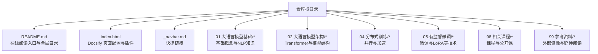
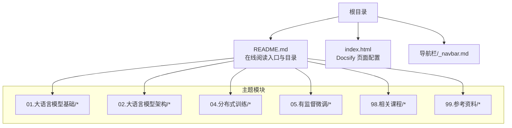
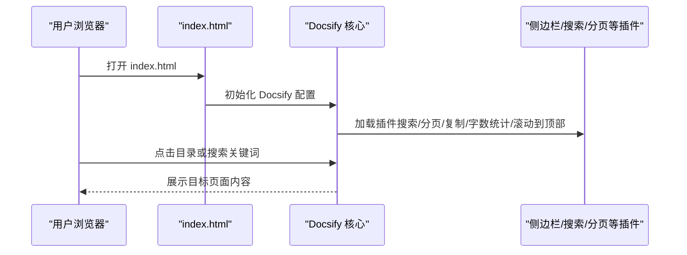
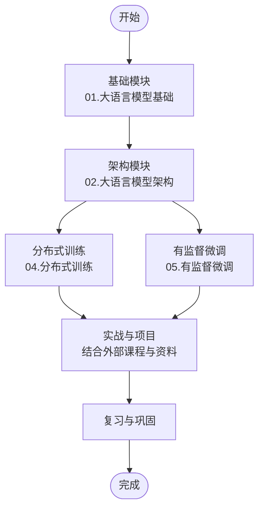
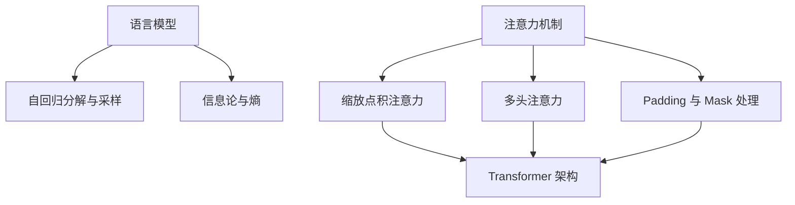
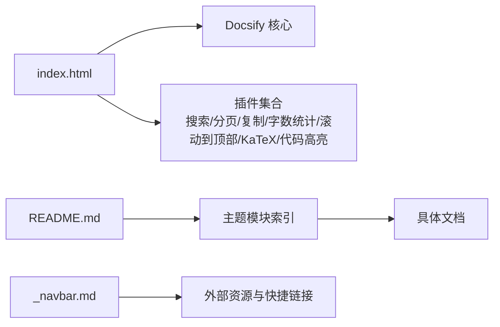

# 快速开始

<cite>
**本文引用的文件**
- [README.md](file://README.md)
- [index.html](file://index.html)
- [_navbar.md](file://_navbar.md)
- [01.大语言模型基础/README.md](file://01.大语言模型基础/README.md)
- [02.大语言模型架构/README.md](file://02.大语言模型架构/README.md)
- [04.分布式训练/README.md](file://04.分布式训练/README.md)
- [05.有监督微调/README.md](file://05.有监督微调/README.md)
- [98.相关课程/README.md](file://98.相关课程/README.md)
- [99.参考资料/README.md](file://99.参考资料/README.md)
- [01.大语言模型基础/1.语言模型/1.语言模型.md](file://01.大语言模型基础/1.语言模型/1.语言模型.md)
- [02.大语言模型架构/1.attention/1.attention.md](file://02.大语言模型架构/1.attention/1.attention.md)
</cite>

## 目录
1. [简介](#简介)
2. [项目结构](#项目结构)
3. [核心组件](#核心组件)
4. [架构总览](#架构总览)
5. [详细组件解析](#详细组件解析)
6. [依赖关系分析](#依赖关系分析)
7. [性能与使用建议](#性能与使用建议)
8. [故障排查指南](#故障排查指南)
9. [结语](#结语)
10. [附录](#附录)

## 简介
本指南面向准备系统学习与面试大模型（LLM）知识的读者，提供从“初次访问”到“有效利用知识库”的完整路径。内容覆盖在线阅读、离线下载、学习路径建议与前置知识，帮助你在最短时间内建立知识体系并高效复习。

- 在线阅读入口与导航：[在线阅读:23-26](file://README.md#L23-L26)
- 在线阅读页面配置与功能：[Docsify 配置:14-66](file://index.html#L14-L66)

**章节来源**
- [README.md:23-26](file://README.md#L23-L26)
- [index.html:14-66](file://index.html#L14-L66)

## 项目结构
本仓库采用“主题模块 + 子目录 + 文档”的组织方式，便于按主题浏览与检索。首页 README 提供全局目录导航，index.html 使用 Docsify 提供在线阅读体验与交互功能（搜索、分页、复制、字数统计等）。

**图表来源**
- [README.md:37-161](file://README.md#L37-L161)
- [index.html:14-66](file://index.html#L14-L66)
- [01.大语言模型基础/README.md:1-36](file://01.大语言模型基础/README.md#L1-L36)
- [02.大语言模型架构/README.md:1-52](file://02.大语言模型架构/README.md#L1-L52)
- [04.分布式训练/README.md:1-45](file://04.分布式训练/README.md#L1-L45)
- [05.有监督微调/README.md:1-30](file://05.有监督微调/README.md#L1-L30)
- [98.相关课程/README.md:1-4](file://98.相关课程/README.md#L1-L4)
- [99.参考资料/README.md:1-10](file://99.参考资料/README.md#L1-L10)

**章节来源**
- [README.md:37-161](file://README.md#L37-L161)
- [index.html:14-66](file://index.html#L14-L66)

## 核心组件
- 在线阅读与导航
  - 在线阅读入口与目录：[在线阅读:23-26](file://README.md#L23-L26)、[全局目录:37-161](file://README.md#L37-L161)
  - Docsify 页面配置：[Docsify 初始化与插件:14-66](file://index.html#L14-L66)
- 快捷链接与外部资源
  - 侧边栏快捷链接：[快捷链接:3-5](file://_navbar.md#L3-L5)
  - 相关课程与参考资料：[相关课程:1-4](file://98.相关课程/README.md#L1-L4)、[参考资料:1-10](file://99.参考资料/README.md#L1-L10)
- 主题模块
  - 基础知识模块：[01.大语言模型基础:1-36](file://01.大语言模型基础/README.md#L1-L36)
  - 架构模块：[02.大语言模型架构:1-52](file://02.大语言模型架构/README.md#L1-L52)
  - 分布式训练模块：[04.分布式训练:1-45](file://04.分布式训练/README.md#L1-L45)
  - 有监督微调模块：[05.有监督微调:1-30](file://05.有监督微调/README.md#L1-L30)

**章节来源**
- [README.md:23-26](file://README.md#L23-L26)
- [README.md:37-161](file://README.md#L37-L161)
- [index.html:14-66](file://index.html#L14-L66)
- [_navbar.md:3-5](file://_navbar.md#L3-L5)
- [98.相关课程/README.md:1-4](file://98.相关课程/README.md#L1-L4)
- [99.参考资料/README.md:1-10](file://99.参考资料/README.md#L1-L10)
- [01.大语言模型基础/README.md:1-36](file://01.大语言模型基础/README.md#L1-L36)
- [02.大语言模型架构/README.md:1-52](file://02.大语言模型架构/README.md#L1-L52)
- [04.分布式训练/README.md:1-45](file://04.分布式训练/README.md#L1-L45)
- [05.有监督微调/README.md:1-30](file://05.有监督微调/README.md#L1-L30)

## 架构总览
下图展示“在线阅读—主题模块—具体内容”的层次关系，帮助你快速定位学习内容与跳转路径。

**图表来源**
- [README.md:37-161](file://README.md#L37-L161)
- [index.html:14-66](file://index.html#L14-L66)
- [_navbar.md:3-5](file://_navbar.md#L3-L5)
- [01.大语言模型基础/README.md:1-36](file://01.大语言模型基础/README.md#L1-L36)
- [02.大语言模型架构/README.md:1-52](file://02.大语言模型架构/README.md#L1-L52)
- [04.分布式训练/README.md:1-45](file://04.分布式训练/README.md#L1-L45)
- [05.有监督微调/README.md:1-30](file://05.有监督微调/README.md#L1-L30)
- [98.相关课程/README.md:1-4](file://98.相关课程/README.md#L1-L4)
- [99.参考资料/README.md:1-10](file://99.参考资料/README.md#L1-L10)

## 详细组件解析

### 在线阅读与导航
- 在线阅读入口与目录
  - 在线阅读地址与导航条目：[在线阅读:23-26](file://README.md#L23-L26)、[全局目录:37-161](file://README.md#L37-L161)
- Docsify 页面配置
  - 功能：侧边栏、分页、搜索、字数统计、回到顶部、页脚、代码高亮、KaTeX 支持等
  - 配置项与插件：[Docsify 初始化与插件:14-66](file://index.html#L14-L66)

**图表来源**
- [index.html:14-66](file://index.html#L14-L66)

**章节来源**
- [README.md:23-26](file://README.md#L23-L26)
- [README.md:37-161](file://README.md#L37-L161)
- [index.html:14-66](file://index.html#L14-L66)

### 快捷链接与外部资源
- 快捷链接
  - Tiny LLM 项目与体验地址：[快捷链接:3-5](file://_navbar.md#L3-L5)
- 相关课程与参考资料
  - 课程入口与参考资料列表：[相关课程:1-4](file://98.相关课程/README.md#L1-L4)、[参考资料:1-10](file://99.参考资料/README.md#L1-L10)

**章节来源**
- [_navbar.md:3-5](file://_navbar.md#L3-L5)
- [98.相关课程/README.md:1-4](file://98.相关课程/README.md#L1-L4)
- [99.参考资料/README.md:1-10](file://99.参考资料/README.md#L1-L10)

### 主题模块概览与学习路径建议
- 基础模块（建议优先）
  - 语言模型与NLP基础：[01.大语言模型基础:1-36](file://01.大语言模型基础/README.md#L1-L36)
  - 示例内容：语言模型定义与自回归生成、n-gram与熵、信息论背景等
- 架构模块（进阶）
  - Transformer与注意力机制：[02.大语言模型架构:1-52](file://02.大语言模型架构/README.md#L1-L52)
  - 示例内容：Attention 计算、Multi-Head Attention、Self-Attention、位置编码、解码策略等
- 分布式训练（工程实践）
  - 并行策略与加速：[04.分布式训练:1-45](file://04.分布式训练/README.md#L1-L45)
- 有监督微调（实战）
  - LoRA、Adapter、Prompting 等：[05.有监督微调:1-30](file://05.有监督微调/README.md#L1-L30)

**图表来源**
- [01.大语言模型基础/README.md:1-36](file://01.大语言模型基础/README.md#L1-L36)
- [02.大语言模型架构/README.md:1-52](file://02.大语言模型架构/README.md#L1-L52)
- [04.分布式训练/README.md:1-45](file://04.分布式训练/README.md#L1-L45)
- [05.有监督微调/README.md:1-30](file://05.有监督微调/README.md#L1-L30)

**章节来源**
- [01.大语言模型基础/README.md:1-36](file://01.大语言模型基础/README.md#L1-L36)
- [02.大语言模型架构/README.md:1-52](file://02.大语言模型架构/README.md#L1-L52)
- [04.分布式训练/README.md:1-45](file://04.分布式训练/README.md#L1-L45)
- [05.有监督微调/README.md:1-30](file://05.有监督微调/README.md#L1-L30)

### 关键知识点与示例（按主题）
- 语言模型与自回归生成
  - 内容要点：语言模型的概率定义、自回归分解、温度参数与采样、n-gram 与熵、信息论背景
  - 示例路径：[1.语言模型:1-200](file://01.大语言模型基础/1.语言模型/1.语言模型.md#L1-L200)
- 注意力机制与Transformer
  - 内容要点：Attention 计算步骤、Self-Attention 与 Multi-Head Attention、缩放因子、Mask 处理、相对位置编码、Transformer-XL 等
  - 示例路径：[1.attention:1-200](file://02.大语言模型架构/1.attention/1.attention.md#L1-L200)

**图表来源**
- [01.大语言模型基础/1.语言模型/1.语言模型.md:1-200](file://01.大语言模型基础/1.语言模型/1.语言模型.md#L1-L200)
- [02.大语言模型架构/1.attention/1.attention.md:1-200](file://02.大语言模型架构/1.attention/1.attention.md#L1-L200)

**章节来源**
- [01.大语言模型基础/1.语言模型/1.语言模型.md:1-200](file://01.大语言模型基础/1.语言模型/1.语言模型.md#L1-L200)
- [02.大语言模型架构/1.attention/1.attention.md:1-200](file://02.大语言模型架构/1.attention/1.attention.md#L1-L200)

## 依赖关系分析
- 在线阅读依赖
  - index.html 依赖 Docsify 核心与各类插件（搜索、分页、复制、字数统计、滚动到顶部、KaTeX、代码高亮等）
  - README.md 提供全局目录与入口链接
- 主题模块依赖
  - 各模块 README 作为子目录索引，指向具体文档
- 外部资源依赖
  - 课程与参考资料作为补充学习材料

**图表来源**
- [index.html:14-66](file://index.html#L14-L66)
- [README.md:37-161](file://README.md#L37-L161)
- [_navbar.md:3-5](file://_navbar.md#L3-L5)

**章节来源**
- [index.html:14-66](file://index.html#L14-L66)
- [README.md:37-161](file://README.md#L37-L161)
- [_navbar.md:3-5](file://_navbar.md#L3-L5)

## 性能与使用建议
- 在线阅读体验
  - 利用 Docsify 的分页与搜索功能，快速定位主题与关键词
  - 使用“回到顶部”与“字数统计”提升阅读效率
- 离线阅读建议
  - 当前仓库未包含 PDF 输出配置或导出脚本，建议使用浏览器“另存为 PDF”或第三方工具导出所需章节
  - 若需批量导出，可结合 Docsify 插件生态或外部静态站点生成工具进行二次处理（本仓库未提供具体实现）

**章节来源**
- [index.html:14-66](file://index.html#L14-L66)

## 故障排查指南
- 在线阅读无法加载或样式异常
  - 检查 CDN 资源是否可用（Docsify、KaTeX、PrismJS 等）
  - 确认浏览器未启用阻止第三方脚本的扩展
- 搜索/分页/复制等功能无效
  - 确认 index.html 中对应插件已正确加载
  - 如为本地部署，请确保静态资源路径与插件 CDN 正确
- 目录跳转异常
  - 检查 README.md 中的目录链接是否与实际文件路径一致

**章节来源**
- [index.html:14-66](file://index.html#L14-L66)
- [README.md:37-161](file://README.md#L37-L161)

## 结语
通过本快速开始指南，你可以：
- 在线高效阅读与检索知识库
- 明确学习路径与优先级
- 结合外部课程与参考资料深化理解
- 逐步建立从基础到工程实践的知识体系

祝你学习顺利，面试成功！

## 附录

### 在线阅读与离线下载步骤
- 在线阅读
  - 打开在线阅读入口：[在线阅读:23-26](file://README.md#L23-L26)
  - 使用侧边栏与全局目录导航至目标主题与文档
  - 利用搜索、分页、复制、字数统计等功能提升阅读效率：[Docsify 配置:14-66](file://index.html#L14-L66)
- 离线下载
  - 方法一：浏览器“另存为 PDF”或使用第三方工具导出所需章节
  - 方法二：将仓库克隆至本地后，结合静态站点生成工具进行离线打包（本仓库未提供具体实现）

**章节来源**
- [README.md:23-26](file://README.md#L23-L26)
- [index.html:14-66](file://index.html#L14-L66)

### 学习路径建议（按主题）
- 基础优先
  - 语言模型与NLP基础：[01.大语言模型基础:1-36](file://01.大语言模型基础/README.md#L1-L36)
  - 示例内容：语言模型定义、自回归生成、n-gram、熵与信息论背景
- 架构进阶
  - Transformer与注意力机制：[02.大语言模型架构:1-52](file://02.大语言模型架构/README.md#L1-L52)
  - 示例内容：Attention 计算、Multi-Head Attention、Self-Attention、位置编码、解码策略
- 工程实践
  - 分布式训练与加速：[04.分布式训练:1-45](file://04.分布式训练/README.md#L1-L45)
  - 有监督微调与LoRA等：[05.有监督微调:1-30](file://05.有监督微调/README.md#L1-L30)
- 课程与资料
  - 相关课程与参考资料：[相关课程:1-4](file://98.相关课程/README.md#L1-L4)、[参考资料:1-10](file://99.参考资料/README.md#L1-L10)

**章节来源**
- [01.大语言模型基础/README.md:1-36](file://01.大语言模型基础/README.md#L1-L36)
- [02.大语言模型架构/README.md:1-52](file://02.大语言模型架构/README.md#L1-L52)
- [04.分布式训练/README.md:1-45](file://04.分布式训练/README.md#L1-L45)
- [05.有监督微调/README.md:1-30](file://05.有监督微调/README.md#L1-L30)
- [98.相关课程/README.md:1-4](file://98.相关课程/README.md#L1-L4)
- [99.参考资料/README.md:1-10](file://99.参考资料/README.md#L1-L10)