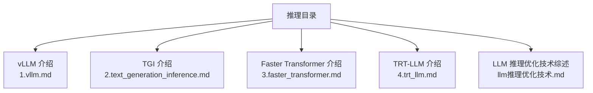
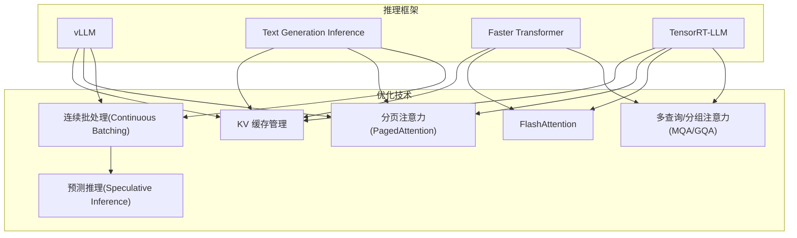
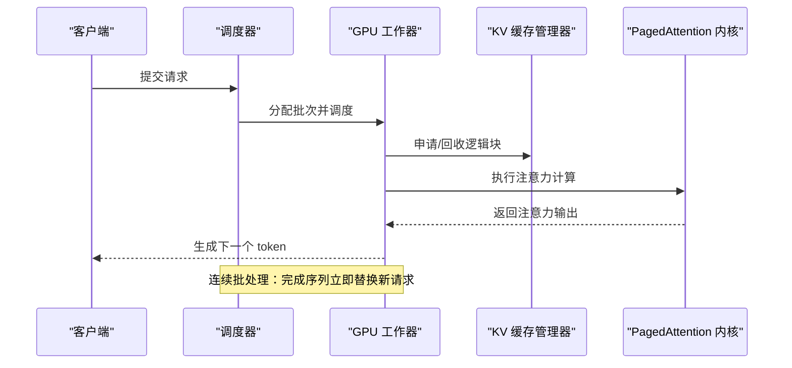
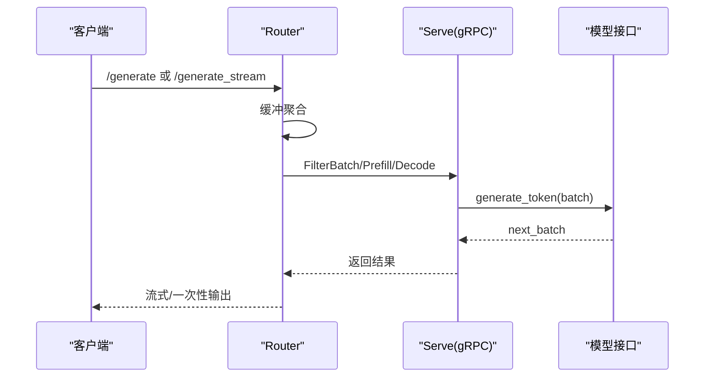
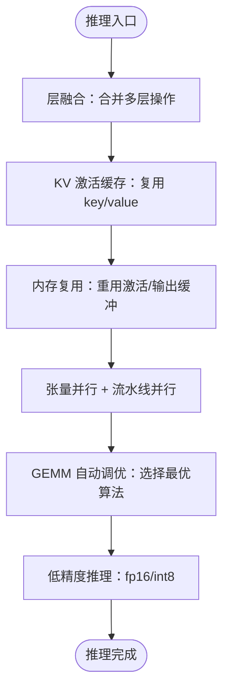
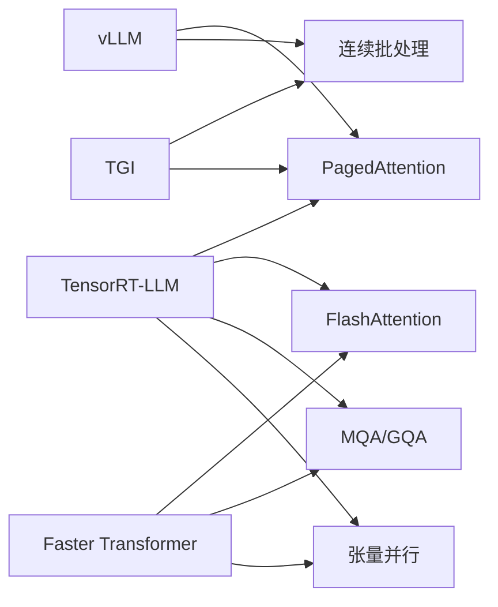

# 推理优化

<cite>
**本文引用的文件**
- [1.vllm.md](file://06.推理/1.vllm/1.vllm.md)
- [2.text_generation_inference.md](file://06.推理/2.text_generation_inference/2.text_generation_inference.md)
- [3.faster_transformer.md](file://06.推理/3.faster_transformer/3.faster_transformer.md)
- [4.trt_llm.md](file://06.推理/4.trt_llm/4.trt_llm.md)
- [llm推理优化技术.md](file://06.推理/llm推理优化技术/llm推理优化技术.md)
</cite>

## 目录
1. [简介](#简介)
2. [项目结构](#项目结构)
3. [核心组件](#核心组件)
4. [架构总览](#架构总览)
5. [详细组件分析](#详细组件分析)
6. [依赖关系分析](#依赖关系分析)
7. [性能考量](#性能考量)
8. [故障排查指南](#故障排查指南)
9. [结论](#结论)
10. [附录](#附录)

## 简介
本章节面向推理优化主题，系统梳理主流推理框架的原理与实现，重点覆盖 vLLM、Text Generation Inference（TGI）、Faster Transformer、TensorRT-LLM 等。内容围绕 KV Cache 缓存机制、分页注意力（PagedAttention）、连续批处理（Continuous Batching）、预测推理（Speculative Inference）等关键技术展开，辅以性能对比与应用场景建议，帮助读者在不同业务场景下选择合适的推理优化方案。

## 项目结构
本仓库与推理优化相关的内容主要集中在“推理”目录下，包含各推理框架的介绍与技术要点，以及统一的“LLM 推理优化技术”综述文档。下图为与推理优化相关的文件组织概览。

图表来源
- [1.vllm.md:1-32](file://06.推理/1.vllm/1.vllm.md#L1-L32)
- [2.text_generation_inference.md:1-36](file://06.推理/2.text_generation_inference/2.text_generation_inference.md#L1-L36)
- [3.faster_transformer.md:1-12](file://06.推理/3.faster_transformer/3.faster_transformer.md#L1-L12)
- [4.trt_llm.md:1-8](file://06.推理/4.trt_llm/4.trt_llm.md#L1-L8)
- [llm推理优化技术.md:1-271](file://06.推理/llm推理优化技术/llm推理优化技术.md#L1-L271)

章节来源
- [1.vllm.md:1-32](file://06.推理/1.vllm/1.vllm.md#L1-L32)
- [2.text_generation_inference.md:1-36](file://06.推理/2.text_generation_inference/2.text_generation_inference.md#L1-L36)
- [3.faster_transformer.md:1-12](file://06.推理/3.faster_transformer/3.faster_transformer.md#L1-L12)
- [4.trt_llm.md:1-8](file://06.推理/4.trt_llm/4.trt_llm.md#L1-L8)
- [llm推理优化技术.md:1-271](file://06.推理/llm推理优化技术/llm推理优化技术.md#L1-L271)

## 核心组件
- vLLM：强调高性能吞吐、连续批处理、PagedAttention、张量并行与 OpenAI 兼容 API。
- TGI：HuggingFace 生态的推理服务，支持张量并行、连续批处理、Flash-Attention/PagedAttention、量化、gRPC 路由与服务发现。
- Faster Transformer：NVIDIA 的 Transformer 推理加速引擎，支持层融合、KV 激活缓存、内存复用、张量/流水线并行、GEMM 自动调优、低精度推理等。
- TensorRT-LLM：NVIDIA 推出的 LLM 推理编译器与优化套件，继承并发展 Faster Transformer 的优化能力，提供更易用的实现与生态支持。

章节来源
- [1.vllm.md:3-14](file://06.推理/1.vllm/1.vllm.md#L3-L14)
- [2.text_generation_inference.md:3-17](file://06.推理/2.text_generation_inference/2.text_generation_inference.md#L3-L17)
- [3.faster_transformer.md:5-23](file://06.推理/3.faster_transformer/3.faster_transformer.md#L5-L23)
- [4.trt_llm.md:1-8](file://06.推理/4.trt_llm/4.trt_llm.md#L1-L8)

## 架构总览
下图展示推理优化的关键技术与框架之间的关系，突出 KV Cache 管理、注意力优化、批处理策略与服务化组件的协同。

图表来源
- [1.vllm.md:55-146](file://06.推理/1.vllm/1.vllm.md#L55-L146)
- [2.text_generation_inference.md:38-134](file://06.推理/2.text_generation_inference/2.text_generation_inference.md#L38-L134)
- [3.faster_transformer.md:24-64](file://06.推理/3.faster_transformer/3.faster_transformer.md#L24-L64)
- [llm推理优化技术.md:168-266](file://06.推理/llm推理优化技术/llm推理优化技术.md#L168-L266)

## 详细组件分析

### vLLM 组件分析
- 连续批处理（Continuous Batching）
  - 原理：当批次中某条序列提前完成生成，立即用新请求替代其位置，提升 GPU 利用率。
  - 优势：避免静态批处理中不同序列生成长度造成的空闲，提高吞吐。
- 分页注意力（PagedAttention）
  - 原理：将 KV 缓存切分为固定大小的块，块在物理内存中可不连续存储，按需分配与回收。
  - 优势：显著降低内存碎片与浪费，提升批大小与吞吐，支持高效内存共享。
- 架构要点
  - 集中式调度器协调分布式 GPU Worker，KV 缓存管理由 PagedAttention 驱动。
  - 支持张量并行、OpenAI 兼容 API、多种采样策略（并行采样、束搜索等）。
- 性能与实践
  - 通过 PagedAttention 与连续批处理，实现更高吞吐与更低延迟；适合大规模在线服务与离线批处理。

图表来源
- [1.vllm.md:89-146](file://06.推理/1.vllm/1.vllm.md#L89-L146)

章节来源
- [1.vllm.md:55-146](file://06.推理/1.vllm/1.vllm.md#L55-L146)

### Text Generation Inference 组件分析
- 架构分层
  - Launcher：启动与下载模型、启动 Router 与 Serve。
  - Router：接收请求、缓冲聚合、以 RPC 方式下发至 Serve。
  - Serve：gRPC 服务，提供 Info、Health、ServiceDiscovery、ClearCache、FilterBatch、Prefill、Decode 等接口。
- 关键流程
  - Prefill：接收批次、整理信息、Tokenizer 转词向量、调用模型生成 token 并返回 next_batch。
  - Decode：从缓存获取批次，生成新 token 并更新缓存。
  - 缓存单位为 batch，缓存中保存词向量，减少重复计算。
- 优化点
  - 连续批处理、Flash-Attention/PagedAttention（部分模型支持）、张量并行、量化（LLM.int8/GPT-Q）、指标与追踪。

图表来源
- [2.text_generation_inference.md:38-134](file://06.推理/2.text_generation_inference/2.text_generation_inference.md#L38-L134)

章节来源
- [2.text_generation_inference.md:38-134](file://06.推理/2.text_generation_inference/2.text_generation_inference.md#L38-L134)

### Faster Transformer 组件分析
- 优化技术
  - 层融合（Layer Fusion）：合并多层操作到单一核，减少数据搬运与提升数学密度。
  - 激活缓存（KV 激活缓存）：避免重复计算每个新 token 的 key/value，分配缓冲区存储。
  - 内存优化：在不同解码器层重用激活/输出缓冲，显著降低激活内存占用。
  - 并行化：张量并行（TP）与流水线并行（PP）结合，支持多 GPU/多节点。
  - GEMM 自动调优：对底层算法进行实时基准测试，选择最优实现。
  - 低精度推理：fp16/int8，配合 Tensor Core 加速。
- 支持模型：GPT-3、GPT-J、BERT、ViT、Swin、Longformer、T5、XLNet 等。
- 发展趋势：已过渡到 TensorRT-LLM，持续获得最新改进。

图表来源
- [3.faster_transformer.md:24-64](file://06.推理/3.faster_transformer/3.faster_transformer.md#L24-L64)

章节来源
- [3.faster_transformer.md:24-64](file://06.推理/3.faster_transformer/3.faster_transformer.md#L24-L64)

### TensorRT-LLM 组件分析
- 定位：NVIDIA 的 LLM 推理编译器与优化套件，继承并发展 Faster Transformer 的优化能力。
- 能力：提供优化内核、预处理/后处理、多 GPU/多节点通信原语，实现突破性性能。
- 文档与博客：官方文档与技术博客提供使用指南与最佳实践。

章节来源
- [4.trt_llm.md:1-8](file://06.推理/4.trt_llm/4.trt_llm.md#L1-L8)

## 依赖关系分析
- vLLM 与 TGI 在 KV 缓存管理与连续批处理方面有相似目标，但实现路径不同：vLLM 更强调 PagedAttention 与调度器集中化，TGI 强调 Router 的批聚合与 Serve 的 gRPC 接口。
- Faster Transformer 与 TensorRT-LLM 在注意力优化、并行化与低精度推理方面形成演进关系，后者提供更易用的实现与生态支持。
- 通用优化技术（KV 缓存、分页注意力、FlashAttention、MQA/GQA、连续批处理、预测推理）在各框架中均有体现，是跨框架的共性优化点。

图表来源
- [1.vllm.md:55-146](file://06.推理/1.vllm/1.vllm.md#L55-L146)
- [2.text_generation_inference.md:38-134](file://06.推理/2.text_generation_inference/2.text_generation_inference.md#L38-L134)
- [3.faster_transformer.md:24-64](file://06.推理/3.faster_transformer/3.faster_transformer.md#L24-L64)
- [llm推理优化技术.md:168-266](file://06.推理/llm推理优化技术/llm推理优化技术.md#L168-L266)

章节来源
- [1.vllm.md:55-146](file://06.推理/1.vllm/1.vllm.md#L55-L146)
- [2.text_generation_inference.md:38-134](file://06.推理/2.text_generation_inference/2.text_generation_inference.md#L38-L134)
- [3.faster_transformer.md:24-64](file://06.推理/3.faster_transformer/3.faster_transformer.md#L24-L64)
- [llm推理优化技术.md:168-266](file://06.推理/llm推理优化技术/llm推理优化技术.md#L168-L266)

## 性能考量
- 内存瓶颈与 KV 缓存
  - 解码阶段是内存受限的，KV 缓存占用与序列长度、层数、头数、维度、精度呈线性关系。优化目标是降低 KV 缓存占用与碎片，提升批大小与吞吐。
- 注意力优化
  - FlashAttention 通过 I/O 感知的融合与重排，减少内存搬运；MQA/GQA 通过减少 KV 头数量降低内存读取与 KV 缓存占用。
- 批处理策略
  - 静态批处理易造成空闲与等待，连续批处理（In-flight Batching）可显著提升 GPU 利用率。
- 预测推理
  - 通过临时模型并行生成多个 token，验证模型确认后接受，减少自回归串行等待，提升吞吐。
- 并行化与低精度
  - 张量并行与流水线并行扩展模型规模；GEMM 自动调优与低精度（fp16/int8）提升吞吐与带宽利用。

章节来源
- [llm推理优化技术.md:11-72](file://06.推理/llm推理优化技术/llm推理优化技术.md#L11-L72)
- [llm推理优化技术.md:116-167](file://06.推理/llm推理优化技术/llm推理优化技术.md#L116-L167)
- [llm推理优化技术.md:233-266](file://06.推理/llm推理优化技术/llm推理优化技术.md#L233-L266)
- [3.faster_transformer.md:24-64](file://06.推理/3.faster_transformer/3.faster_transformer.md#L24-L64)

## 故障排查指南
- KV 缓存相关
  - 现象：显存不足、批大小受限、长上下文服务不稳定。
  - 排查：检查 KV 缓存配置与块大小、是否启用 PagedAttention、是否存在过度配置与碎片。
  - 建议：优先启用分页注意力与连续批处理；合理设置批大小与序列长度上限。
- 批处理与路由
  - 现象：请求延迟波动大、吞吐不稳定。
  - 排查：确认 Router 是否正确聚合请求、Serve 是否及时返回 next_batch、缓存单位是否为 batch。
  - 建议：优化 Router 缓冲阈值与 Serve 的批处理策略。
- 并行化与精度
  - 现象：吞吐未达预期、带宽受限。
  - 排查：确认是否启用张量并行/流水线并行、GEMM 自动调优是否生效、是否使用低精度推理。
  - 建议：根据硬件能力与模型规模调整并行策略与精度配置。

章节来源
- [1.vllm.md:95-146](file://06.推理/1.vllm/1.vllm.md#L95-L146)
- [2.text_generation_inference.md:111-134](file://06.推理/2.text_generation_inference/2.text_generation_inference.md#L111-L134)
- [3.faster_transformer.md:24-64](file://06.推理/3.faster_transformer/3.faster_transformer.md#L24-L64)

## 结论
- vLLM 与 TGI 在 KV 缓存管理与连续批处理方面各有侧重，前者强调 PagedAttention 与调度器集中化，后者强调 Router 的批聚合与 gRPC 服务化。
- Faster Transformer 与 TensorRT-LLM 在注意力优化、并行化与低精度推理方面形成演进，后者提供更易用的实现与生态支持。
- 通用优化技术（KV 缓存、分页注意力、FlashAttention、MQA/GQA、连续批处理、预测推理）是跨框架的共性优化点，应结合业务场景与硬件条件综合选择。

## 附录
- 实际应用案例建议
  - 高吞吐在线服务：优先考虑 vLLM（PagedAttention + 连续批处理）或 TGI（Router + Serve 架构）。
  - HuggingFace 生态集成：TGI 更贴合生态与 API 设计。
  - 大模型并行与极致性能：Faster Transformer/TensorRT-LLM（层融合、GEMM 自动调优、低精度）。
  - 长上下文与内存敏感场景：重点启用分页注意力与 KV 缓存优化，控制批大小与序列长度。

章节来源
- [1.vllm.md:3-14](file://06.推理/1.vllm/1.vllm.md#L3-L14)
- [2.text_generation_inference.md:34-36](file://06.推理/2.text_generation_inference/2.text_generation_inference.md#L34-L36)
- [3.faster_transformer.md:1-12](file://06.推理/3.faster_transformer/3.faster_transformer.md#L1-L12)
- [4.trt_llm.md:1-8](file://06.推理/4.trt_llm/4.trt_llm.md#L1-L8)
- [llm推理优化技术.md:268-271](file://06.推理/llm推理优化技术/llm推理优化技术.md#L268-L271)