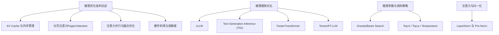
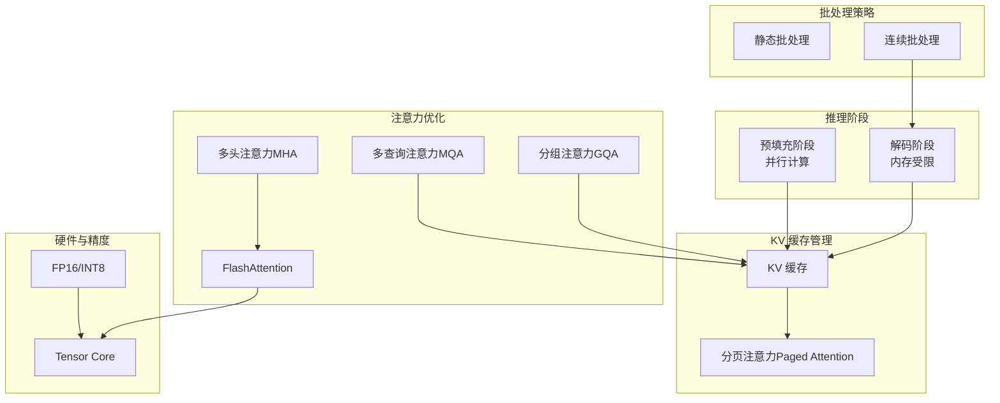
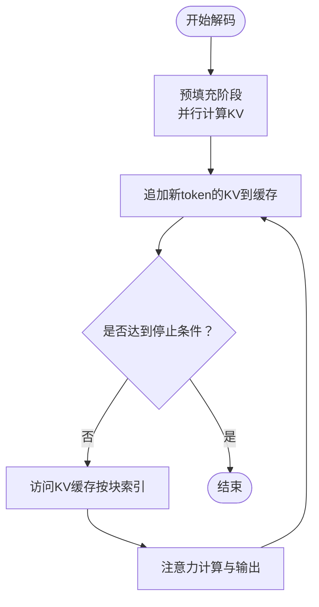
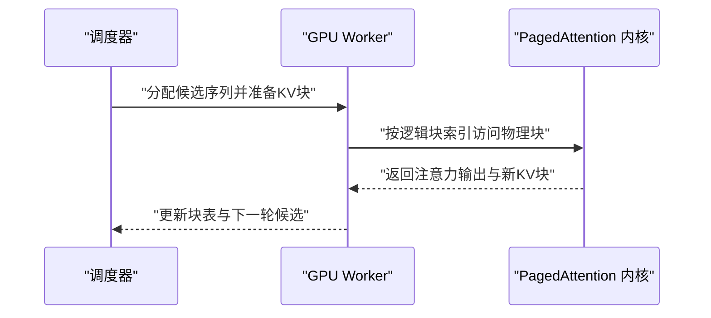
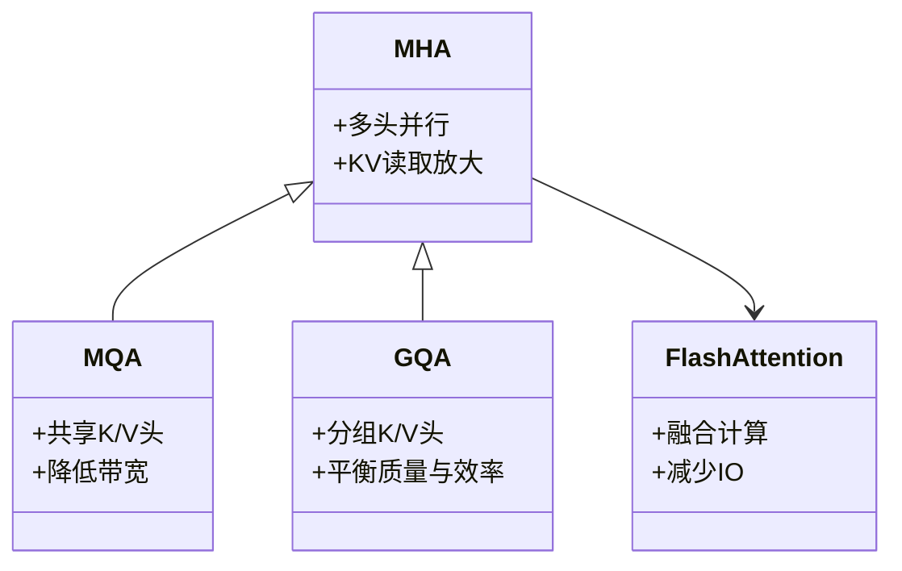
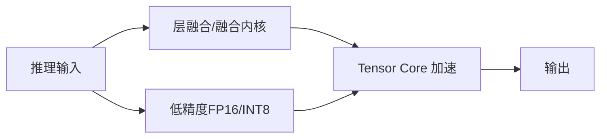
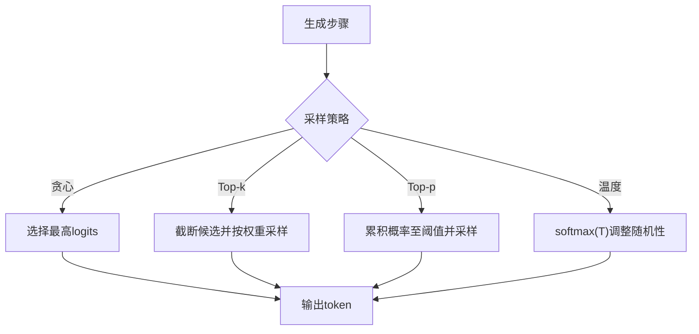
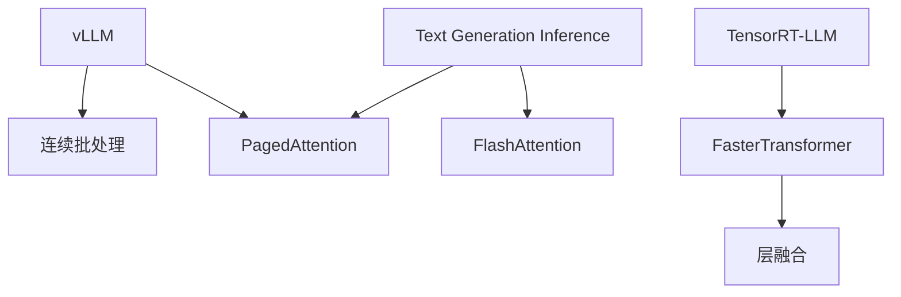
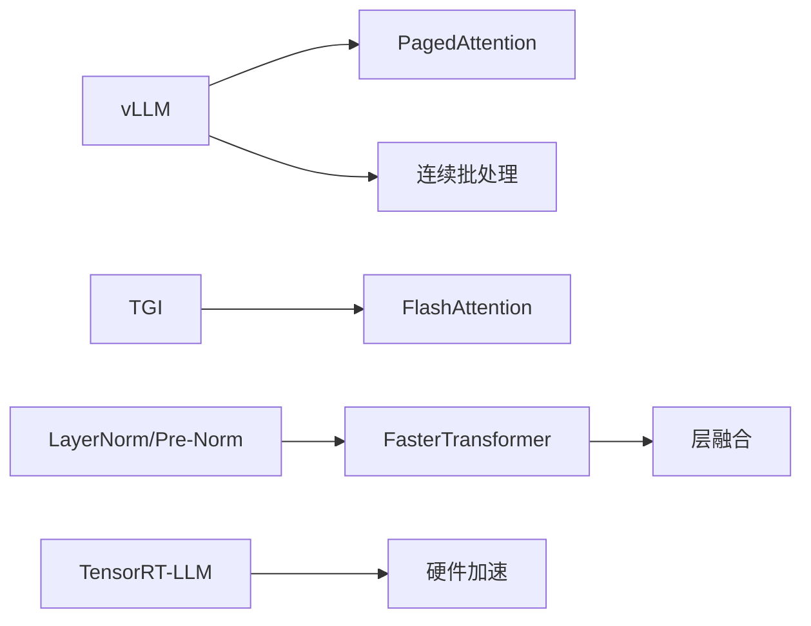

# 推理优化技术

<cite>
**本文引用的文件**
- [llm推理优化技术.md](file://06.推理/llm推理优化技术/llm推理优化技术.md)
- [1.vllm.md](file://06.推理/1.vllm/1.vllm.md)
- [1.推理.md](file://06.推理/1.推理/1.推理.md)
- [LLM推理常见参数.md](file://06.推理/LLM推理常见参数/LLM推理常见参数.md)
- [2.text_generation_inference.md](file://06.推理/2.text_generation_inference/2.text_generation_inference.md)
- [3.faster_transformer.md](file://06.推理/3.faster_transformer/3.faster_transformer.md)
- [4.trt_llm.md](file://06.推理/4.trt_llm/4.trt_llm.md)
- [0.llm推理框架简单总结.md](file://06.推理/0.llm推理框架简单总结/0.llm推理框架简单总结.md)
- [BN VS LN.md](file://02.大语言模型架构/1.attention/BN VS LN.md)
</cite>

## 目录
1. [引言](#引言)
2. [项目结构](#项目结构)
3. [核心组件](#核心组件)
4. [架构概览](#架构概览)
5. [详细组件分析](#详细组件分析)
6. [依赖分析](#依赖分析)
7. [性能考量](#性能考量)
8. [故障排查指南](#故障排查指南)
9. [结论](#结论)
10. [附录](#附录)

## 引言
本技术文档聚焦于大语言模型（LLM）推理阶段的关键优化技术，围绕以下主题展开：
- KV Cache 缓存机制与内存管理策略
- 分页注意力（Paged Attention）的实现细节与优势
- 注意力计算的并行化与融合优化
- 推理加速的硬件利用技术（如 Tensor Core、低精度）
- 推理参数调优（batch size、序列长度、温度采样等）对性能的影响
- 实际性能测试与优化案例，帮助在不同硬件环境下实现最优推理性能

## 项目结构
本仓库与推理优化相关的知识主要集中在“推理”专题下，涵盖：
- 推理优化技术综述与原理
- 主流推理框架（vLLM、TGI、FasterTransformer、TensorRT-LLM）的特性与实践
- 推理参数与采样策略
- 架构层面的归一化（LayerNorm）与注意力机制

**章节来源**
- [llm推理优化技术.md:1-271](file://06.推理/llm推理优化技术/llm推理优化技术.md#L1-L271)
- [1.vllm.md:1-220](file://06.推理/1.vllm/1.vllm.md#L1-L220)
- [2.text_generation_inference.md:1-140](file://06.推理/2.text_generation_inference/2.text_generation_inference.md#L1-L140)
- [3.faster_transformer.md:1-73](file://06.推理/3.faster_transformer/3.faster_transformer.md#L1-L73)
- [4.trt_llm.md:1-8](file://06.推理/4.trt_llm/4.trt_llm.md#L1-L8)
- [0.llm推理框架简单总结.md:1-455](file://06.推理/0.llm推理框架简单总结/0.llm推理框架简单总结.md#L1-L455)
- [LLM推理常见参数.md:1-183](file://06.推理/LLM推理常见参数/LLM推理常见参数.md#L1-L183)
- [BN VS LN.md:1-107](file://02.大语言模型架构/1.attention/BN VS LN.md#L1-L107)

## 核心组件
- KV Cache 与内存瓶颈：解码阶段的内存受限特性决定了批处理与缓存管理的优先级。
- 分页注意力（Paged Attention）：以块（block/page）为单位管理 KV 缓存，显著降低碎片与浪费。
- 注意力并行与融合：多头注意力的并行化、融合计算以减少内存搬运与提升吞吐。
- 硬件利用与低精度：利用 Tensor Core、FP16/INT8 等加速推理，降低带宽压力。
- 推理参数与采样策略：温度、Top-k/p、重复惩罚等影响生成质量与稳定性，间接影响吞吐与延迟。

**章节来源**
- [llm推理优化技术.md:37-73](file://06.推理/llm推理优化技术/llm推理优化技术.md#L37-L73)
- [1.vllm.md:55-135](file://06.推理/1.vllm/1.vllm.md#L55-L135)
- [3.faster_transformer.md:24-65](file://06.推理/3.faster_transformer/3.faster_transformer.md#L24-L65)
- [LLM推理常见参数.md:32-183](file://06.推理/LLM推理常见参数/LLM推理常见参数.md#L32-L183)

## 架构概览
下图展示推理阶段的关键路径与优化点：预填充阶段（并行）与解码阶段（内存受限）；批处理与连续批处理；KV 缓存与分页管理；注意力融合与并行；硬件加速与低精度。

**图表来源**
- [llm推理优化技术.md:17-73](file://06.推理/llm推理优化技术/llm推理优化技术.md#L17-L73)
- [1.vllm.md:55-135](file://06.推理/1.vllm/1.vllm.md#L55-L135)
- [3.faster_transformer.md:24-65](file://06.推理/3.faster_transformer/3.faster_transformer.md#L24-L65)

**章节来源**
- [llm推理优化技术.md:11-73](file://06.推理/llm推理优化技术/llm推理优化技术.md#L11-L73)
- [1.vllm.md:55-135](file://06.推理/1.vllm/1.vllm.md#L55-L135)
- [3.faster_transformer.md:24-65](file://06.推理/3.faster_transformer/3.faster_transformer.md#L24-L65)

## 详细组件分析

### KV Cache 缓存机制与内存管理
- 解码阶段的 KV 缓存是内存瓶颈的关键：每个时间步的 key/value 需要累积，导致显存占用随序列长度线性增长。
- 传统静态批处理在不同序列长度下造成 GPU 空闲，连续批处理（in-flight batching）可提升利用率。
- vLLM 的 PagedAttention 将 KV 缓存按固定块大小分页，块在物理内存中可不连续，显著降低碎片与浪费，提升吞吐。

**图表来源**
- [1.vllm.md:65-135](file://06.推理/1.vllm/1.vllm.md#L65-L135)
- [llm推理优化技术.md:37-73](file://06.推理/llm推理优化技术/llm推理优化技术.md#L37-L73)

**章节来源**
- [1.vllm.md:65-135](file://06.推理/1.vllm/1.vllm.md#L65-L135)
- [llm推理优化技术.md:37-73](file://06.推理/llm推理优化技术/llm推理优化技术.md#L37-L73)

### 分页注意力（Paged Attention）实现细节
- PagedAttention 将每个序列的 KV 缓存划分为固定大小的块（block size），块在物理内存中可不连续，通过逻辑块表映射到物理块。
- 优势：
  - 显著降低内存浪费（仅最后一个块未填满）
  - 支持高效内存共享（同一 prompt 的多输出序列共享前缀）
  - 提升硬件利用率，降低延迟

**图表来源**
- [1.vllm.md:95-151](file://06.推理/1.vllm/1.vllm.md#L95-L151)

**章节来源**
- [1.vllm.md:95-151](file://06.推理/1.vllm/1.vllm.md#L95-L151)

### 注意力计算的并行化与融合优化
- 多头注意力（MHA）：通过并行头提升吞吐，但 KV 读取与带宽成为瓶颈。
- 多查询注意力（MQA）与分组注意力（GQA）：减少 KV 头数量，降低内存带宽压力，同时保持接近 MHA 的质量。
- FlashAttention：通过 I/O 感知的融合计算，减少中间结果写回，提升吞吐与能效。

**图表来源**
- [llm推理优化技术.md:120-167](file://06.推理/llm推理优化技术/llm推理优化技术.md#L120-L167)

**章节来源**
- [llm推理优化技术.md:120-167](file://06.推理/llm推理优化技术/llm推理优化技术.md#L120-L167)

### 硬件利用与低精度优化
- Tensor Core：在 Volta 及以上架构上支持 fp16/int8 计算，显著提升吞吐。
- 低精度推理：FP16/INT8 可降低带宽与内存占用，加速推理。
- FasterTransformer 的层融合、激活重用与自动 GEMM 选择，进一步提升性能。

**图表来源**
- [3.faster_transformer.md:24-65](file://06.推理/3.faster_transformer/3.faster_transformer.md#L24-L65)

**章节来源**
- [3.faster_transformer.md:24-65](file://06.推理/3.faster_transformer/3.faster_transformer.md#L24-L65)

### 推理参数调优与采样策略
- Greedy Search：确定性输出，适合严格对齐场景。
- Beam Search：保留多候选，提升质量但增加计算与 KV 缓存开销。
- Top-k / Top-p：动态候选集合，提升多样性。
- Temperature：控制采样随机性，T 越大分布越平滑，T 越小越接近贪心。
- Repetition Penalty：抑制重复，可调节惩罚强度。

**图表来源**
- [LLM推理常见参数.md:32-183](file://06.推理/LLM推理常见参数/LLM推理常见参数.md#L32-L183)

**章节来源**
- [LLM推理常见参数.md:32-183](file://06.推理/LLM推理常见参数/LLM推理常见参数.md#L32-L183)

### 推理框架对比与实践要点
- vLLM：强调连续批处理与 PagedAttention，吞吐领先；支持 OpenAI 兼容 API。
- TGI：HuggingFace 生态集成，内置服务评估与量化；支持 FlashAttention/PagedAttention。
- FasterTransformer：层融合、激活重用、MPI/NCCL 通信；现已过渡到 TensorRT-LLM。
- TensorRT-LLM：NVIDIA 推出的统一推理编译与优化栈，面向生产部署。

**图表来源**
- [0.llm推理框架简单总结.md:19-84](file://06.推理/0.llm推理框架简单总结/0.llm推理框架简单总结.md#L19-L84)
- [2.text_generation_inference.md:1-140](file://06.推理/2.text_generation_inference/2.text_generation_inference.md#L1-L140)
- [3.faster_transformer.md:1-73](file://06.推理/3.faster_transformer/3.faster_transformer.md#L1-L73)
- [4.trt_llm.md:1-8](file://06.推理/4.trt_llm/4.trt_llm.md#L1-L8)

**章节来源**
- [0.llm推理框架简单总结.md:19-84](file://06.推理/0.llm推理框架简单总结/0.llm推理框架简单总结.md#L19-L84)
- [2.text_generation_inference.md:1-140](file://06.推理/2.text_generation_inference/2.text_generation_inference.md#L1-L140)
- [3.faster_transformer.md:1-73](file://06.推理/3.faster_transformer/3.faster_transformer.md#L1-L73)
- [4.trt_llm.md:1-8](file://06.推理/4.trt_llm/4.trt_llm.md#L1-L8)

## 依赖分析
- vLLM 依赖 PagedAttention 与连续批处理实现高吞吐；TGI 在 HuggingFace 生态中提供服务评估与优化；FasterTransformer 与 TensorRT-LLM 提供底层融合与硬件加速。
- 注意力优化依赖于注意力并行与融合（MHA/MQA/GQA/FlashAttention）。
- 归一化（LayerNorm/Pre-Norm/RMSNorm）在训练与推理一致性、稳定性方面发挥关键作用。

**图表来源**
- [1.vllm.md:89-151](file://06.推理/1.vllm/1.vllm.md#L89-L151)
- [2.text_generation_inference.md:1-140](file://06.推理/2.text_generation_inference/2.text_generation_inference.md#L1-L140)
- [3.faster_transformer.md:24-65](file://06.推理/3.faster_transformer/3.faster_transformer.md#L24-L65)
- [BN VS LN.md:37-78](file://02.大语言模型架构/1.attention/BN VS LN.md#L37-L78)

**章节来源**
- [1.vllm.md:89-151](file://06.推理/1.vllm/1.vllm.md#L89-L151)
- [2.text_generation_inference.md:1-140](file://06.推理/2.text_generation_inference/2.text_generation_inference.md#L1-L140)
- [3.faster_transformer.md:24-65](file://06.推理/3.faster_transformer/3.faster_transformer.md#L24-L65)
- [BN VS LN.md:37-78](file://02.大语言模型架构/1.attention/BN VS LN.md#L37-L78)

## 性能考量
- 内存瓶颈与批处理：解码阶段内存受限，连续批处理可提升 GPU 利用率；KV 缓存大小与序列长度呈线性关系，需权衡吞吐与显存。
- 注意力优化：MQA/GQA/FlashAttention 降低 KV 读取与带宽压力；分页管理减少碎片与浪费。
- 硬件与精度：FP16/INT8 与 Tensor Core 可显著提升吞吐；层融合与自动 GEMM 选择进一步优化。
- 参数调优：温度、Top-k/p、重复惩罚影响生成质量与稳定性，间接影响吞吐与延迟；Beam Search 增加计算与 KV 缓存开销。

**章节来源**
- [1.推理.md:5-26](file://06.推理/1.推理/1.推理.md#L5-L26)
- [LLM推理常见参数.md:32-183](file://06.推理/LLM推理常见参数/LLM推理常见参数.md#L32-L183)
- [3.faster_transformer.md:24-65](file://06.推理/3.faster_transformer/3.faster_transformer.md#L24-L65)

## 故障排查指南
- 显存占用高且不释放：检查内存管理策略与延迟释放机制；确认批处理与 KV 缓存大小是否合理。
- 推理速度慢：评估是否受内存带宽限制；尝试 FP16/INT8、分页注意力与层融合；调整 batch size 与序列长度。
- 采样多样性不足：提高温度或启用 Top-k/p；适当降低重复惩罚。
- 框架选择与部署：根据生态与硬件选择 vLLM/TGI/FT/TRT；确保模型与优化技术兼容。

**章节来源**
- [1.推理.md:5-26](file://06.推理/1.推理/1.推理.md#L5-L26)
- [LLM推理常见参数.md:32-183](file://06.推理/LLM推理常见参数/LLM推理常见参数.md#L32-L183)
- [0.llm推理框架简单总结.md:19-84](file://06.推理/0.llm推理框架简单总结/0.llm推理框架简单总结.md#L19-L84)

## 结论
- 解码阶段的内存瓶颈决定了 KV 缓存与批处理策略的优先级。
- PagedAttention 与连续批处理显著提升吞吐与 GPU 利用率。
- 注意力并行与融合（MHA/MQA/GQA/FlashAttention）降低带宽压力。
- 硬件利用（Tensor Core）与低精度（FP16/INT8）是吞吐与能效的关键。
- 参数调优（温度、Top-k/p、重复惩罚）影响质量与稳定性，需结合业务场景权衡。
- 选择合适的推理框架（vLLM/TGI/FT/TRT）并结合硬件与模型特性进行优化，是实现最优推理性能的关键。

## 附录
- 推理参数与采样策略参考：[LLM推理常见参数.md:32-183](file://06.推理/LLM推理常见参数/LLM推理常见参数.md#L32-L183)
- 推理框架对比与实践：[0.llm推理框架简单总结.md:19-84](file://06.推理/0.llm推理框架简单总结/0.llm推理框架简单总结.md#L19-L84)
- 归一化与注意力机制：[BN VS LN.md:37-78](file://02.大语言模型架构/1.attention/BN VS LN.md#L37-L78)