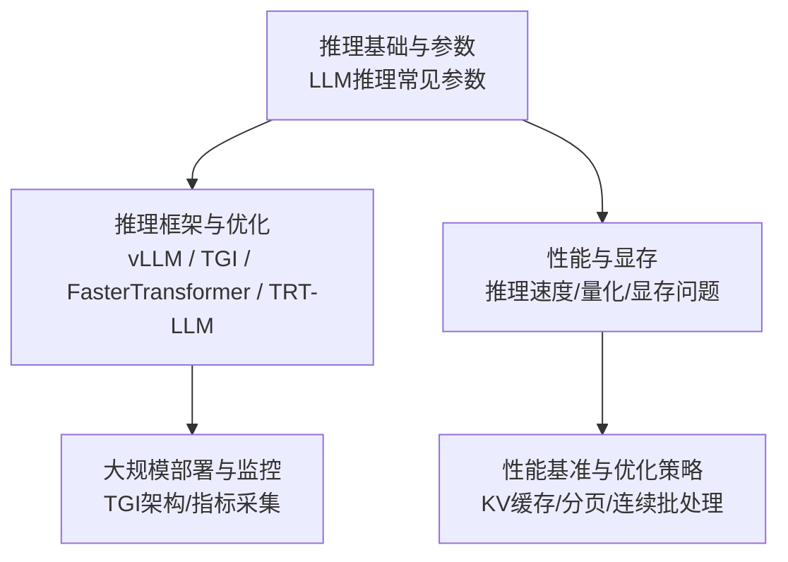
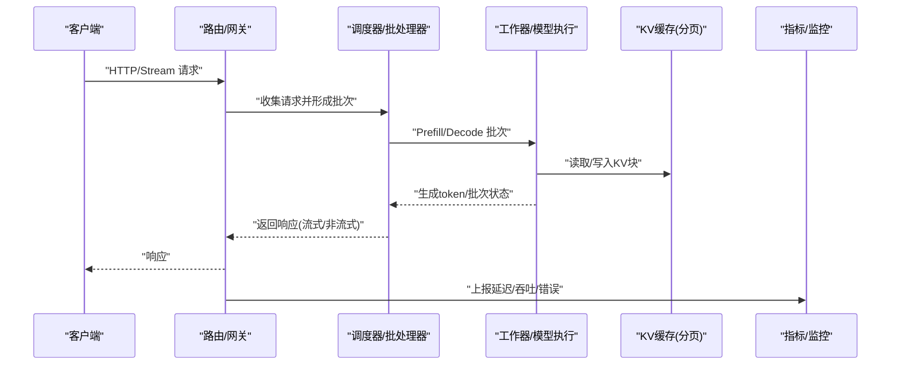
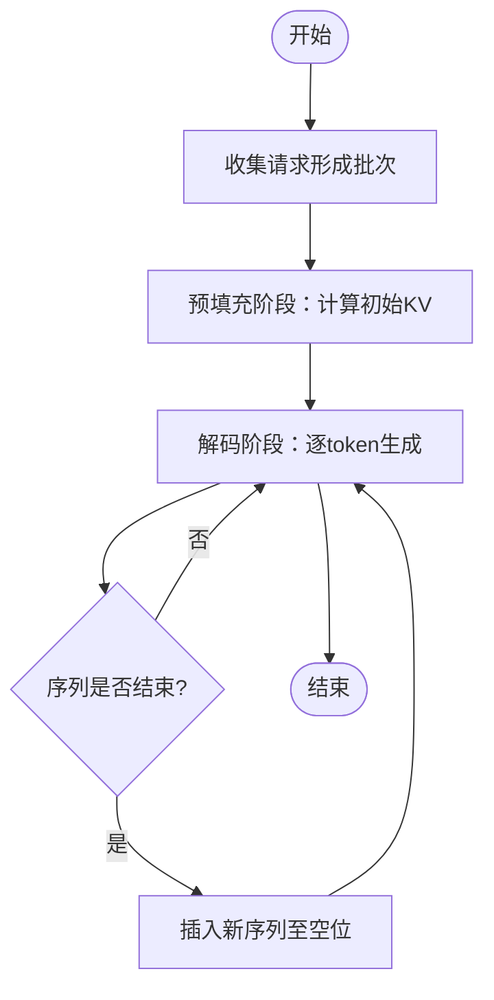
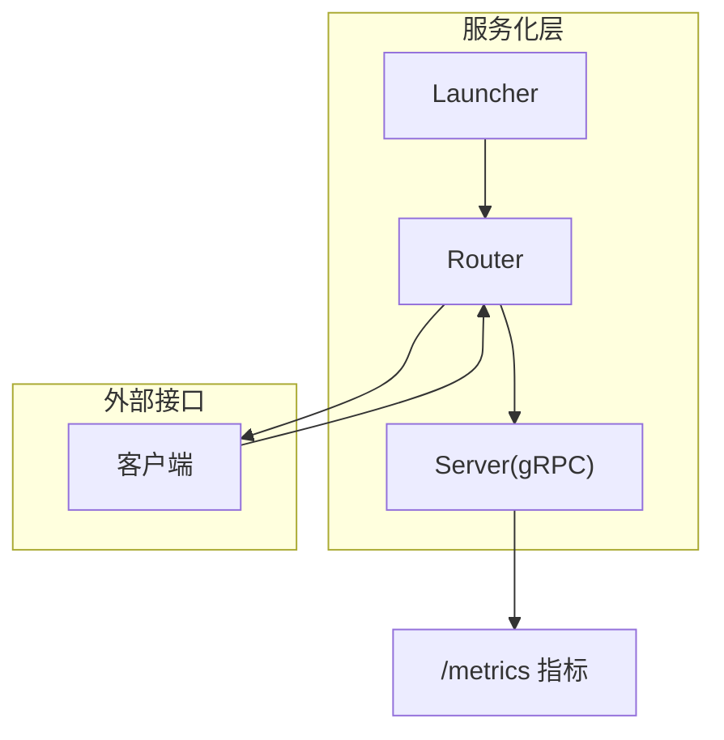
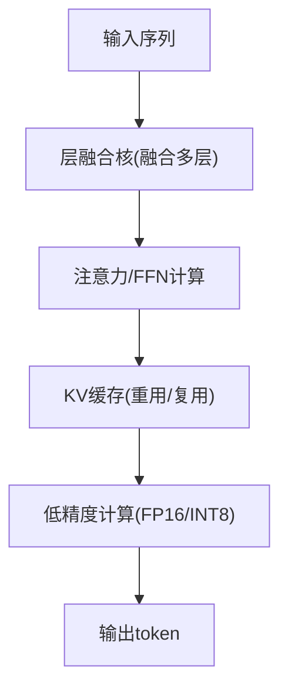
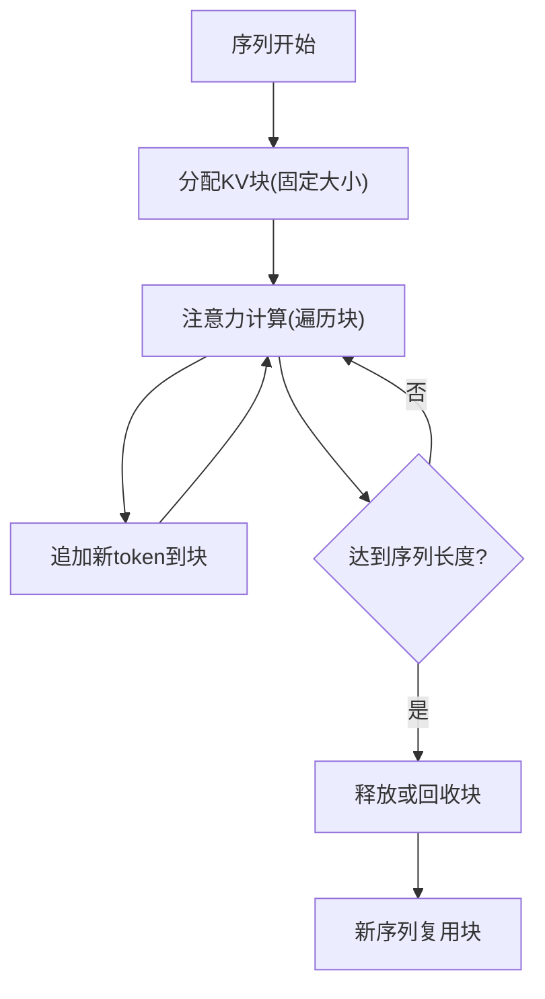
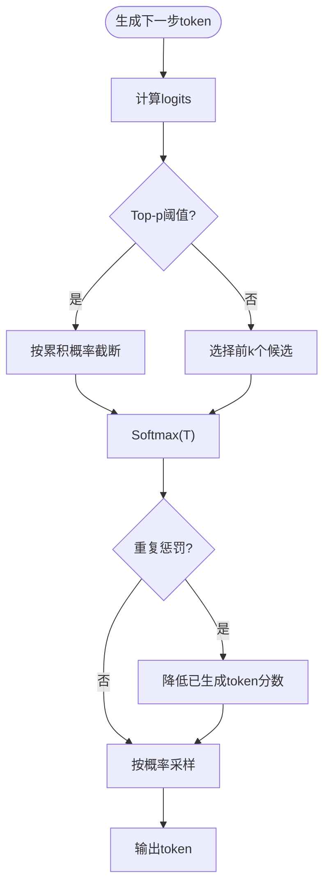
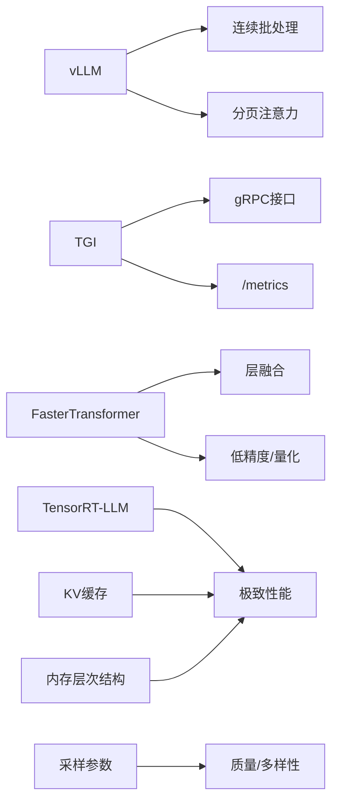

# 推理实践案例

<cite>
**本文引用的文件**
- [06.推理/1.vllm/1.vllm.md](file://06.推理/1.vllm/1.vllm.md)
- [06.推理/2.text_generation_inference/2.text_generation_inference.md](file://06.推理/2.text_generation_inference/2.text_generation_inference.md)
- [06.推理/3.faster_transformer/3.faster_transformer.md](file://06.推理/3.faster_transformer/3.faster_transformer.md)
- [06.推理/4.trt_llm/4.trt_llm.md](file://06.推理/4.trt_llm/4.trt_llm.md)
- [06.推理/llm推理优化技术/llm推理优化技术.md](file://06.推理/llm推理优化技术/llm推理优化技术.md)
- [06.推理/LLM推理常见参数/LLM推理常见参数.md](file://06.推理/LLM推理常见参数/LLM推理常见参数.md)
- [06.推理/1.推理/1.推理.md](file://06.推理/1.推理/1.推理.md)
- [04.分布式训练/1.显存问题/1.显存问题.md](file://04.分布式训练/1.显存问题/1.显存问题.md)
- [ai_generataion/中级LLM_Agent工程师面试QA清单.md](file://ai_generataion/中级LLM_Agent工程师面试QA清单.md)
</cite>

## 更新摘要
**变更内容**
- 新增SRAM与DRAM在LLM推理中的角色分析，完善内存层次结构理解
- 增加模型参数量与激活参数量的详细对比，深化显存瓶颈认知
- 补充KV Cache内存池管理的系统设计实践
- 丰富采样策略与参数调优的工程化配置指导

## 目录
1. [引言](#引言)
2. [项目结构](#项目结构)
3. [核心组件](#核心组件)
4. [架构总览](#架构总览)
5. [详细组件分析](#详细组件分析)
6. [依赖分析](#依赖分析)
7. [性能考量](#性能考量)
8. [故障排查指南](#故障排查指南)
9. [结论](#结论)
10. [附录](#附录)

## 引言
本文件面向"推理实践案例"的落地需求，聚焦以下主题：模型部署的性能基准测试、不同硬件平台的推理配置、大规模部署的架构设计、实时推理的延迟优化策略。文档基于仓库中推理相关资料，提炼可操作的优化路径与实践建议，并提供可视化图示与参考路径，帮助开发者将理论知识转化为可执行的工程方案。

## 项目结构
围绕"推理"主题，仓库中与本文件目标高度相关的知识分布在如下章节：
- 推理框架与优化技术：vLLM、TGI、FasterTransformer、TensorRT-LLM、通用推理优化技术
- 推理参数与采样策略：温度、Top-k、Top-p、重复惩罚、贪心与束搜索
- 性能与显存：GPU/CPU推理速度对比、INT8/FP16/FP32性能差异、显存瓶颈与激活重计算
- 评估与监控：指标采集、A/B测试、持续监控与告警

**章节来源**
- [06.推理/1.vllm/1.vllm.md:1-220](file://06.推理/1.vllm/1.vllm.md#L1-L220)
- [06.推理/2.text_generation_inference/2.text_generation_inference.md:1-140](file://06.推理/2.text_generation_inference/2.text_generation_inference.md#L1-L140)
- [06.推理/3.faster_transformer/3.faster_transformer.md:1-73](file://06.推理/3.faster_transformer/3.faster_transformer.md#L1-L73)
- [06.推理/4.trt_llm/4.trt_llm.md:1-8](file://06.推理/4.trt_llm/4.trt_llm.md#L1-L8)
- [06.推理/llm推理优化技术/llm推理优化技术.md:1-271](file://06.推理/llm推理优化技术/llm推理优化技术.md#L1-L271)
- [06.推理/LLM推理常见参数/LLM推理常见参数.md:1-183](file://06.推理/LLM推理常见参数/LLM推理常见参数.md#L1-L183)
- [06.推理/1.推理/1.推理.md:1-125](file://06.推理/1.推理/1.推理.md#L1-L125)
- [04.分布式训练/1.显存问题/1.显存问题.md:1-127](file://04.分布式训练/1.显存问题/1.显存问题.md#L1-L127)

## 核心组件
- 推理框架
  - vLLM：强调连续批处理与分页注意力，适合高吞吐与低延迟的在线服务
  - Text Generation Inference（TGI）：提供服务端gRPC接口与metrics端点，便于集成与观测
  - FasterTransformer：强调层融合、KV缓存、低精度与多GPU通信
  - TensorRT-LLM：NVIDIA官方LLM推理编译与优化套件
- 推理优化技术
  - KV缓存与分页管理（PagedAttention）
  - 连续批处理（In-flight batching）
  - 注意力优化（MQA/GQA、FlashAttention）
  - 量化（INT8/FP16）、稀疏化、蒸馏
- 推理参数与采样策略
  - Temperature、Top-k、Top-p、重复惩罚、贪心与束搜索
- 性能与显存
  - GPU vs CPU推理速度
  - INT8/FP16/FP32性能差异
  - 显存瓶颈与激活重计算

**章节来源**
- [06.推理/1.vllm/1.vllm.md:55-151](file://06.推理/1.vllm/1.vllm.md#L55-L151)
- [06.推理/2.text_generation_inference/2.text_generation_inference.md:38-134](file://06.推理/2.text_generation_inference/2.text_generation_inference.md#L38-L134)
- [06.推理/3.faster_transformer/3.faster_transformer.md:24-64](file://06.推理/3.faster_transformer/3.faster_transformer.md#L24-L64)
- [06.推理/llm推理优化技术/llm推理优化技术.md:168-271](file://06.推理/llm推理优化技术/llm推理优化技术.md#L168-L271)
- [06.推理/LLM推理常见参数/LLM推理常见参数.md:32-183](file://06.推理/LLM推理常见参数/LLM推理常见参数.md#L32-L183)
- [06.推理/1.推理/1.推理.md:16-38](file://06.推理/1.推理/1.推理.md#L16-L38)
- [04.分布式训练/1.显存问题/1.显存问题.md:37-70](file://04.分布式训练/1.显存问题/1.显存问题.md#L37-L70)

## 架构总览
下图展示典型推理服务的端到端流程：客户端请求经路由/网关进入，按批调度与KV缓存管理，随后在工作器上执行注意力与解码，最终返回流式或非流式响应。TGI与vLLM分别代表"服务化+指标"和"连续批处理+分页"的两条主线。

**图表来源**
- [06.推理/2.text_generation_inference/2.text_generation_inference.md:64-134](file://06.推理/2.text_generation_inference/2.text_generation_inference.md#L64-L134)
- [06.推理/1.vllm/1.vllm.md:55-151](file://06.推理/1.vllm/1.vllm.md#L55-L151)

**章节来源**
- [06.推理/2.text_generation_inference/2.text_generation_inference.md:38-134](file://06.推理/2.text_generation_inference/2.text_generation_inference.md#L38-L134)
- [06.推理/1.vllm/1.vllm.md:55-151](file://06.推理/1.vllm/1.vllm.md#L55-L151)

## 详细组件分析

### 组件A：vLLM（连续批处理与分页注意力）
- 连续批处理：在序列完成时即时插入新序列，提升GPU利用率
- 分页注意力：将KV缓存切分为块，非连续存储，降低碎片与浪费
- 适用场景：高吞吐在线服务、长上下文、低延迟要求

**图表来源**
- [06.推理/1.vllm/1.vllm.md:55-151](file://06.推理/1.vllm/1.vllm.md#L55-L151)

**章节来源**
- [06.推理/1.vllm/1.vllm.md:55-151](file://06.推理/1.vllm/1.vllm.md#L55-L151)

### 组件B：TGI（服务化与指标）
- 架构：Launcher/Router/Server三层，Router负责批聚合与路由，Server提供gRPC接口
- 指标端点：/metrics用于观测负载与性能
- 适用场景：与HuggingFace生态集成、快速上线与可观测

**图表来源**
- [06.推理/2.text_generation_inference/2.text_generation_inference.md:38-134](file://06.推理/2.text_generation_inference/2.text_generation_inference.md#L38-L134)

**章节来源**
- [06.推理/2.text_generation_inference/2.text_generation_inference.md:38-134](file://06.推理/2.text_generation_inference/2.text_generation_inference.md#L38-L134)

### 组件C：FasterTransformer（层融合与低精度）
- 层融合：多层融合为单核，减少数据搬运
- 激活缓存：避免重复计算Key/Value
- 低精度：INT8/FP16，结合Tensor Core加速
- 适用场景：高性能推理部署、多GPU/多节点

**图表来源**
- [06.推理/3.faster_transformer/3.faster_transformer.md:24-64](file://06.推理/3.faster_transformer/3.faster_transformer.md#L24-L64)

**章节来源**
- [06.推理/3.faster_transformer/3.faster_transformer.md:24-64](file://06.推理/3.faster_transformer/3.faster_transformer.md#L24-L64)

### 组件D：TensorRT-LLM（NVIDIA官方推理编译套件）
- 官方文档与博客：提供优化内核、通信原语与部署指南
- 适用场景：追求极致性能与稳定性的生产环境

**章节来源**
- [06.推理/4.trt_llm/4.trt_llm.md:1-8](file://06.推理/4.trt_llm/4.trt_llm.md#L1-L8)

### 组件E：KV缓存与分页管理
- KV缓存：解码阶段依赖的历史状态，内存瓶颈关键
- 分页管理：块粒度KV缓存，降低碎片与浪费
- 适用场景：长上下文、高吞吐、低延迟

**图表来源**
- [06.推理/llm推理优化技术/llm推理优化技术.md:168-180](file://06.推理/llm推理优化技术/llm推理优化技术.md#L168-L180)

**章节来源**
- [06.推理/llm推理优化技术/llm推理优化技术.md:168-180](file://06.推理/llm推理优化技术/llm推理优化技术.md#L168-L180)

### 组件F：采样策略与参数调优
- Greedy/Beam Search：确定性/高成本
- Top-k/Top-p：引入随机性，提升多样性
- Temperature：控制分布平滑度
- 重复惩罚：抑制重复输出
- 适用场景：对话、创作、评测一致性与多样性平衡

**图表来源**
- [06.推理/LLM推理常见参数/LLM推理常见参数.md:32-183](file://06.推理/LLM推理常见参数/LLM推理常见参数.md#L32-L183)

**章节来源**
- [06.推理/LLM推理常见参数/LLM推理常见参数.md:32-183](file://06.推理/LLM推理常见参数/LLM推理常见参数.md#L32-L183)

### 组件G：内存层次结构优化
- SRAM与DRAM对比：SRAM速度快但容量小，DRAM容量大但带宽有限
- Flash Attention优化：利用SRAM做分块计算，减少HBM读写次数
- KV Cache管理：存储在HBM中，注意力计算时需从HBM读取到SRAM
- PagedAttention优化：优化KV Cache在HBM中的显存管理

**章节来源**
- [06.推理/1.推理/1.推理.md:44-68](file://06.推理/1.推理/1.推理.md#L44-L68)

### 组件H：显存瓶颈分析与优化
- 模型参数量vs激活参数量：模型参数量是静态知识容量，激活参数量是动态思考草稿
- 显存占用对比：模型参数量与batch_size无关，激活参数量与batch_size和seq_len成正比
- 优化策略：激活重计算、混合精度训练、模型并行
- 显存计算公式：训练显存 ≈ 模型参数 × (2~4) + 激活值 × batch_size

**章节来源**
- [04.分布式训练/1.显存问题/1.显存问题.md:15-66](file://04.分布式训练/1.显存问题/1.显存问题.md#L15-L66)

## 依赖分析
- vLLM依赖连续批处理与分页注意力，适合在线服务高吞吐与低延迟
- TGI依赖gRPC与指标端点，适合快速集成与可观测
- FasterTransformer依赖层融合与低精度，适合高性能部署
- TensorRT-LLM为NVIDIA官方套件，适合追求极致性能
- 采样策略与KV缓存管理贯穿各框架，是性能与质量的关键抓手
- 内存层次结构优化（SRAM/DRAM）为推理性能提供硬件层面支撑

**图表来源**
- [06.推理/1.vllm/1.vllm.md:55-151](file://06.推理/1.vllm/1.vllm.md#L55-L151)
- [06.推理/2.text_generation_inference/2.text_generation_inference.md:64-134](file://06.推理/2.text_generation_inference/2.text_generation_inference.md#L64-L134)
- [06.推理/3.faster_transformer/3.faster_transformer.md:24-64](file://06.推理/3.faster_transformer/3.faster_transformer.md#L24-L64)
- [06.推理/4.trt_llm/4.trt_llm.md:1-8](file://06.推理/4.trt_llm/4.trt_llm.md#L1-L8)
- [06.推理/LLM推理常见参数/LLM推理常见参数.md:32-183](file://06.推理/LLM推理常见参数/LLM推理常见参数.md#L32-L183)
- [06.推理/llm推理优化技术/llm推理优化技术.md:168-180](file://06.推理/llm推理优化技术/llm推理优化技术.md#L168-L180)

**章节来源**
- [06.推理/1.vllm/1.vllm.md:55-151](file://06.推理/1.vllm/1.vllm.md#L55-L151)
- [06.推理/2.text_generation_inference/2.text_generation_inference.md:64-134](file://06.推理/2.text_generation_inference/2.text_generation_inference.md#L64-L134)
- [06.推理/3.faster_transformer/3.faster_transformer.md:24-64](file://06.推理/3.faster_transformer/3.faster_transformer.md#L24-L64)
- [06.推理/4.trt_llm/4.trt_llm.md:1-8](file://06.推理/4.trt_llm/4.trt_llm.md#L1-L8)
- [06.推理/LLM推理常见参数/LLM推理常见参数.md:32-183](file://06.推理/LLM推理常见参数/LLM推理常见参数.md#L32-L183)
- [06.推理/llm推理优化技术/llm推理优化技术.md:168-180](file://06.推理/llm推理优化技术/llm推理优化技术.md#L168-L180)

## 性能考量
- 显存与吞吐：显存瓶颈主要来自模型参数与KV缓存，可通过量化、分页、连续批处理缓解
- 硬件选择：GPU相较CPU在LLM推理上具备明显优势；INT8/FP16相较FP32可提升吞吐与降低带宽压力
- 内存层次优化：SRAM与DRAM的合理利用，Flash Attention的内存I/O优化
- 采样与质量：Top-k/Top-p与温度控制随机性，重复惩罚抑制重复；贪心/束搜索在确定性与成本间权衡
- 指标与监控：通过指标端点与A/B测试建立持续监控与告警

**章节来源**
- [06.推理/1.推理/1.推理.md:16-38](file://06.推理/1.推理/1.推理.md#L16-L38)
- [06.推理/LLM推理常见参数/LLM推理常见参数.md:32-183](file://06.推理/LLM推理常见参数/LLM推理常见参数.md#L32-L183)
- [04.分布式训练/1.显存问题/1.显存问题.md:37-70](file://04.分布式训练/1.显存问题/1.显存问题.md#L37-L70)
- [ai_generataion/中级LLM_Agent工程师面试QA清单.md:260-343](file://ai_generataion/中级LLM_Agent工程师面试QA清单.md#L260-L343)

## 故障排查指南
- 显存不足
  - 现象：OOM、推理失败、吞吐骤降
  - 措施：降低batch/序列长度、启用分页注意力、量化、激活重计算
- 延迟升高
  - 现象：P95/P99延迟上升
  - 措施：启用连续批处理、优化KV缓存、调整采样策略、检查网络与gRPC开销
- 质量不稳定
  - 现象：多样性不足或重复
  - 措施：调节Top-k/Top-p/温度、开启重复惩罚、评估一致性与多样性平衡
- 内存层次问题
  - 现象：内存带宽受限、KV缓存碎片化
  - 措施：优化Flash Attention实现、改进KV Cache管理、使用PagedAttention
- 可观测性缺失
  - 现象：无法定位瓶颈
  - 措施：接入指标端点、建立A/B测试、持续监控与告警

**章节来源**
- [06.推理/1.vllm/1.vllm.md:55-151](file://06.推理/1.vllm/1.vllm.md#L55-L151)
- [06.推理/2.text_generation_inference/2.text_generation_inference.md:64-134](file://06.推理/2.text_generation_inference/2.text_generation_inference.md#L64-L134)
- [06.推理/LLM推理常见参数/LLM推理常见参数.md:32-183](file://06.推理/LLM推理常见参数/LLM推理常见参数.md#L32-L183)
- [ai_generataion/中级LLM_Agent工程师面试QA清单.md:260-343](file://ai_generataion/中级LLM_Agent工程师面试QA清单.md#L260-L343)

## 结论
- 选择框架：在线高吞吐优先vLLM，快速集成与可观测优先TGI，极致性能优先TensorRT-LLM，多GPU部署优先FasterTransformer
- 优化抓手：KV缓存分页、连续批处理、注意力优化、量化与低精度
- 内存层次优化：充分利用SRAM与DRAM的特性，通过Flash Attention和PagedAttention提升内存I/O效率
- 质量与稳定性：采样参数与重复惩罚的工程化配置，配合指标与A/B测试闭环
- 实践建议：从最小可行方案起步，逐步引入分页、连续批处理与量化，建立监控与告警，持续迭代

## 附录
- 实战参考路径
  - vLLM离线推理示例：[06.推理/1.vllm/1.vllm.md:183-212](file://06.推理/1.vllm/1.vllm.md#L183-L212)
  - TGI服务端接口与指标端点：[06.推理/2.text_generation_inference/2.text_generation_inference.md:68-134](file://06.推理/2.text_generation_inference/2.text_generation_inference.md#L68-L134)
  - FasterTransformer优化要点：[06.推理/3.faster_transformer/3.faster_transformer.md:24-64](file://06.推理/3.faster_transformer/3.faster_transformer.md#L24-L64)
  - KV Cache内存池管理实现：[ai_generataion/中级LLM_Agent工程师面试QA清单.md:185-225](file://ai_generataion/中级LLM_Agent工程师面试QA清单.md#L185-L225)
  - 评估与监控模板：[ai_generataion/中级LLM_Agent工程师面试QA清单.md:262-284](file://ai_generataion/中级LLM_Agent工程师面试QA清单.md#L262-L284)