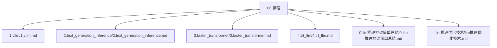
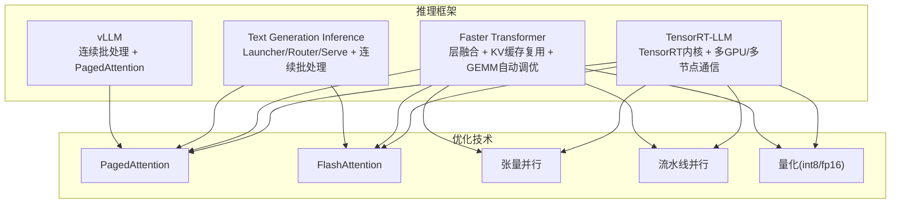
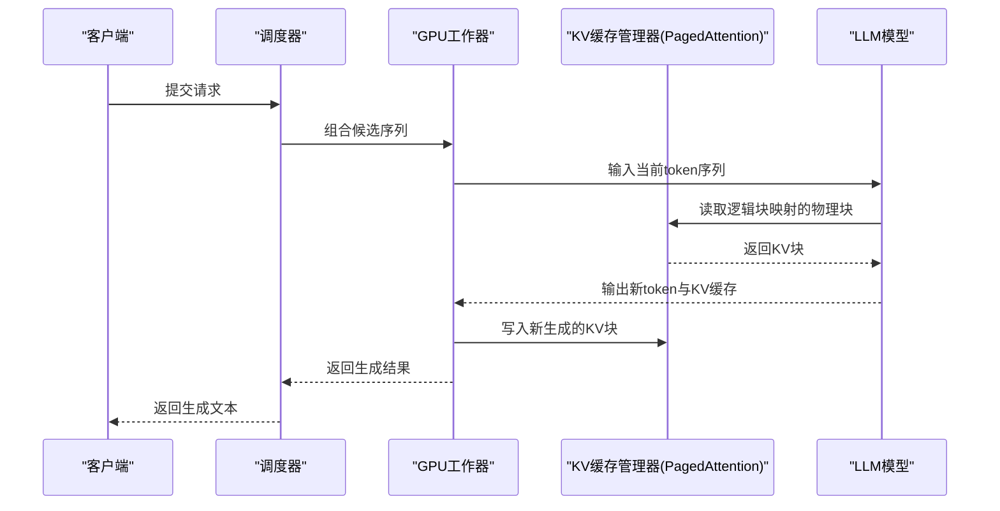
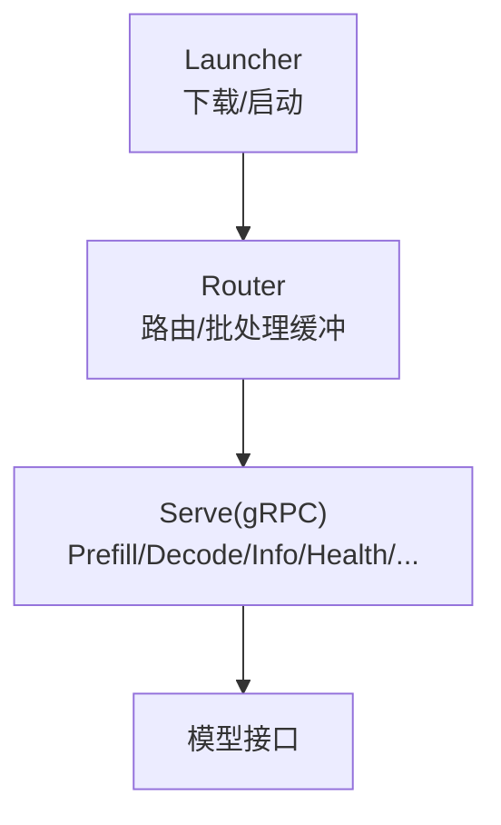
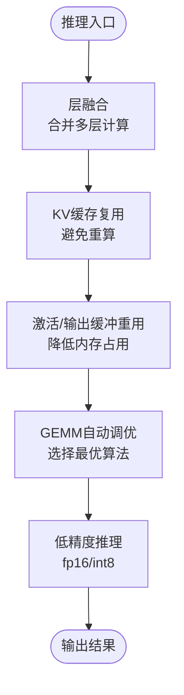
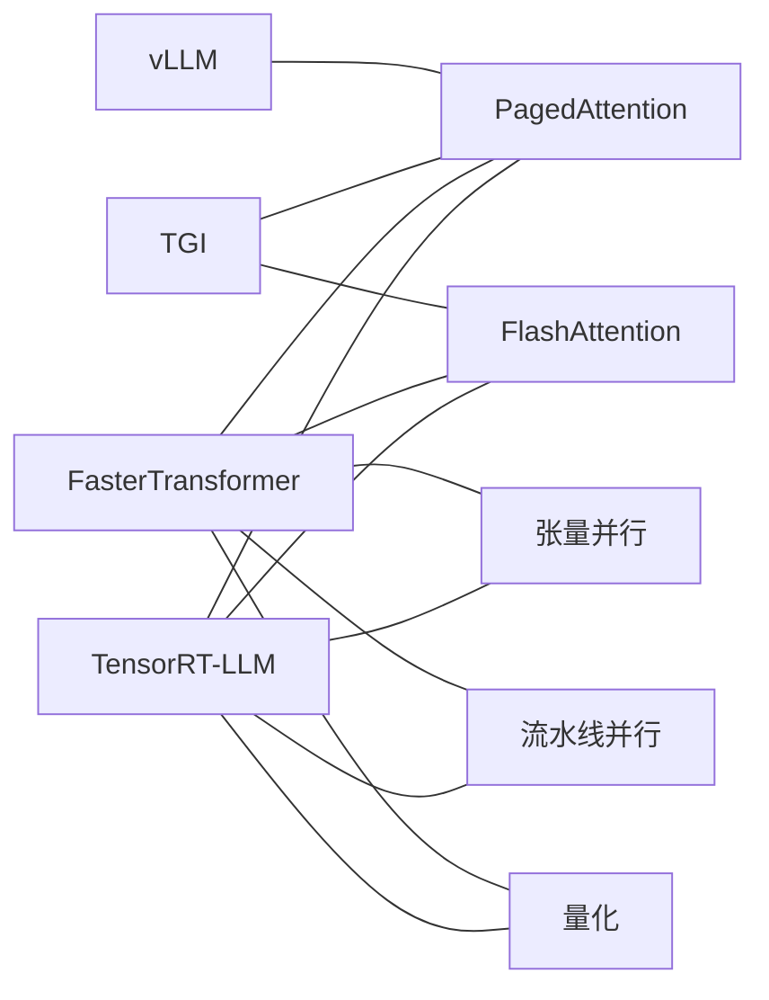

# 推理框架

<cite>
**本文引用的文件**
- [1.vllm.md](file://06.推理/1.vllm/1.vllm.md)
- [2.text_generation_inference.md](file://06.推理/2.text_generation_inference/2.text_generation_inference.md)
- [3.faster_transformer.md](file://06.推理/3.faster_transformer/3.faster_transformer.md)
- [4.trt_llm.md](file://06.推理/4.trt_llm/4.trt_llm.md)
- [0.llm推理框架简单总结.md](file://06.推理/0.llm推理框架简单总结/0.llm推理框架简单总结.md)
- [llm推理优化技术.md](file://06.推理/llm推理优化技术/llm推理优化技术.md)
</cite>

## 目录
1. [简介](#简介)
2. [项目结构](#项目结构)
3. [核心组件](#核心组件)
4. [架构总览](#架构总览)
5. [详细组件分析](#详细组件分析)
6. [依赖关系分析](#依赖关系分析)
7. [性能考量](#性能考量)
8. [故障排查指南](#故障排查指南)
9. [结论](#结论)
10. [附录](#附录)

## 简介
本章节面向推理框架的技术选型与实践，聚焦四大主流LLM推理框架：vLLM、Text Generation Inference（TGI）、Faster Transformer、TensorRT-LLM。我们将从架构设计、实现原理、优化技术、吞吐与延迟表现、内存占用、配置参数与使用示例等方面进行系统化梳理，帮助开发者在不同业务场景下做出合适的选择。

**更新** 本次更新大幅增强了教育内容，特别是连续批处理原则和PagedAttention机制的详细解释，为开发者提供了更深入的理论基础和实践指导。

## 项目结构
本仓库中与推理框架相关的资料集中在"06.推理"目录下，包含各框架的背景、特性、架构、优化技术与使用示例等。下图为与本主题相关的文件组织概览。

图表来源
- [1.vllm.md:1-220](file://06.推理/1.vllm/1.vllm.md#L1-L220)
- [2.text_generation_inference.md:1-140](file://06.推理/2.text_generation_inference/2.text_generation_inference.md#L1-L140)
- [3.faster_transformer.md:1-73](file://06.推理/3.faster_transformer/3.faster_transformer.md#L1-L73)
- [4.trt_llm.md:1-8](file://06.推理/4.trt_llm/4.trt_llm.md#L1-L8)
- [0.llm推理框架简单总结.md:1-505](file://06.推理/0.llm推理框架简单总结/0.llm推理框架简单总结.md#L1-L505)
- [llm推理优化技术.md:1-271](file://06.推理/llm推理优化技术/llm推理优化技术.md#L1-L271)

章节来源
- [1.vllm.md:1-220](file://06.推理/1.vllm/1.vllm.md#L1-L220)
- [2.text_generation_inference.md:1-140](file://06.推理/2.text_generation_inference/2.text_generation_inference.md#L1-L140)
- [3.faster_transformer.md:1-73](file://06.推理/3.faster_transformer/3.faster_transformer.md#L1-L73)
- [4.trt_llm.md:1-8](file://06.推理/4.trt_llm/4.trt_llm.md#L1-L8)
- [0.llm推理框架简单总结.md:1-505](file://06.推理/0.llm推理框架简单总结/0.llm推理框架简单总结.md#L1-L505)
- [llm推理优化技术.md:1-271](file://06.推理/llm推理优化技术/llm推理优化技术.md#L1-L271)

## 核心组件
- vLLM：以高性能吞吐为目标，采用连续批处理（continuous batching）与分页注意力（PagedAttention）管理KV缓存，支持多种解码策略与张量并行，兼容OpenAI API风格。
- Text Generation Inference（TGI）：以HuggingFace生态为核心，提供Rust+Python+gRPC服务，支持张量并行、连续批处理、FlashAttention/PagedAttention优化、量化与服务指标监控。
- Faster Transformer（FT）：NVIDIA早期推理加速引擎，强调层融合、KV缓存复用、内存优化、MPI/NCCL通信、GEMM自动调优与低精度推理，现已过渡至TensorRT-LLM。
- TensorRT-LLM：NVIDIA官方LLM推理编译与优化栈，集成TensorRT内核、预处理/后处理、多GPU/多节点通信原语，提供端到端高性能推理。

**更新** 新增了对连续批处理原则和PagedAttention机制的深入解释，为理解各框架的性能优势提供了理论基础。

章节来源
- [1.vllm.md:3-14](file://06.推理/1.vllm/1.vllm.md#L3-L14)
- [2.text_generation_inference.md:3-16](file://06.推理/2.text_generation_inference/2.text_generation_inference.md#L3-L16)
- [3.faster_transformer.md:5-22](file://06.推理/3.faster_transformer/3.faster_transformer.md#L5-L22)
- [4.trt_llm.md:1-8](file://06.推理/4.trt_llm/4.trt_llm.md#L1-L8)

## 架构总览
下图展示四个框架在推理系统中的角色定位与关键优化点，便于横向对比。

图表来源
- [1.vllm.md:5-14](file://06.推理/1.vllm/1.vllm.md#L5-L14)
- [2.text_generation_inference.md:7-16](file://06.推理/2.text_generation_inference/2.text_generation_inference.md#L7-L16)
- [3.faster_transformer.md:24-64](file://06.推理/3.faster_transformer/3.faster_transformer.md#L24-L64)
- [4.trt_llm.md:1-8](file://06.推理/4.trt_llm/4.trt_llm.md#L1-L8)

## 详细组件分析

### vLLM：异步并发与分页KV缓存
- 连续批处理（Continuous Batching）：在一次迭代中，若某条序列提前完成，系统可立即插入新序列，最大化GPU利用率，避免静态批处理中"长尾等待"造成的空闲。
- PagedAttention：将KV缓存按固定块大小切分，块在物理内存中可不连续，显著降低碎片与浪费，提升内存使用效率，支持高效共享与并行处理。
- 解码流程：调度器选择候选序列，连接当前输入token，调用LLM计算，PagedAttention内核访问逻辑块映射的物理块，新生成的KV缓存落盘到物理块。
- 性能与兼容：宣称吞吐量领先，支持多种解码算法（并行采样、束搜索等），张量并行，兼容OpenAI API风格端点。

**更新** 增加了详细的连续批处理原理分析，包括静态批处理的局限性和连续批处理的优势对比。

图表来源
- [1.vllm.md:89-146](file://06.推理/1.vllm/1.vllm.md#L89-L146)

章节来源
- [1.vllm.md:55-146](file://06.推理/1.vllm/1.vllm.md#L55-L146)

### Text Generation Inference（TGI）：生产级部署与服务化
- 架构三件套：Launcher（启动与下载模型/启动Router/启动Serve）、Router（请求路由与批处理缓冲）、Serve（gRPC服务，提供Info/Health/ServiceDiscovery/ClearCache/FilterBatch/Prefill/Decode等接口）。
- 连续批处理：Router收集一定量请求后以batch形式发送给Serve，减少频繁RPC开销。
- 优化与量化：支持FlashAttention与PagedAttention优化（非所有模型内置），支持bitsandbytes与GPT-Q量化；内置服务指标与分布式追踪。
- 适用场景：依赖HuggingFace模型、无需为核心模型叠加多个adapter的场景。

图表来源
- [2.text_generation_inference.md:38-131](file://06.推理/2.text_generation_inference/2.text_generation_inference.md#L38-L131)

章节来源
- [2.text_generation_inference.md:3-131](file://06.推理/2.text_generation_inference/2.text_generation_inference.md#L3-L131)

### Faster Transformer（FT）：CUDA内核优化与分布式推理
- 层融合（Layer Fusion）：将多层神经网络合并为单一核，减少数据搬运与提升数学密度。
- 激活缓存（KV缓存复用）：避免重复计算先前的key/value，显著降低重算成本。
- 内存优化：在不同解码器层重用激活/输出缓冲，大幅降低激活内存占用。
- 并行与通信：支持张量并行与流水线并行，底层依赖MPI/NCCL/Gloo；GEMM自动调优（GemmBatchedEx）选择最优底层算法；支持fp16/int8低精度推理。
- 发展趋势：已过渡至TensorRT-LLM，后续不再维护。

图表来源
- [3.faster_transformer.md:24-64](file://06.推理/3.faster_transformer/3.faster_transformer.md#L24-L64)

章节来源
- [3.faster_transformer.md:24-73](file://06.推理/3.faster_transformer/3.faster_transformer.md#L24-L73)

### TensorRT-LLM：TensorRT集成与端到端优化
- 定位：NVIDIA官方LLM推理编译与优化栈，集成TensorRT内核、预处理/后处理、多GPU/多节点通信原语。
- 优化点：与FT共享的优化理念（PagedAttention/FlashAttention、KV缓存管理、量化、并行策略），在NVIDIA硬件生态下提供端到端高性能推理。

章节来源
- [4.trt_llm.md:1-8](file://06.推理/4.trt_llm/4.trt_llm.md#L1-L8)
- [llm推理优化技术.md:168-178](file://06.推理/llm推理优化技术/llm推理优化技术.md#L168-L178)

## 依赖关系分析
- vLLM与TGI均采用"批处理+KV缓存管理"的通用思路，但vLLM侧重连续批处理与PagedAttention，TGI侧重服务化与优化的可插拔性。
- FT与TRT-LLM在内核层面高度互补：FT强调CUDA内核优化与分布式并行，TRT-LLM强调编译期优化与端到端流水线。
- 共性优化：KV缓存分页管理、注意力融合、低精度推理、并行策略（张量/流水线/序列并行）。

**更新** 新增了对连续批处理和PagedAttention等核心优化技术的深入分析，体现了各框架在理论基础方面的共同追求。

图表来源
- [1.vllm.md:5-14](file://06.推理/1.vllm/1.vllm.md#L5-L14)
- [2.text_generation_inference.md:7-16](file://06.推理/2.text_generation_inference/2.text_generation_inference.md#L7-L16)
- [3.faster_transformer.md:24-64](file://06.推理/3.faster_transformer/3.faster_transformer.md#L24-L64)
- [4.trt_llm.md:1-8](file://06.推理/4.trt_llm/4.trt_llm.md#L1-L8)

## 性能考量
- 吞吐与延迟：vLLM在大规模批量与长上下文场景下具备明显吞吐优势；TGI在服务化与可观测性方面更成熟；FT/TRT-LLM在内核与编译优化上具备深度潜力。
- 内存占用：PagedAttention与KV缓存复用显著降低碎片与浪费；量化（int8/fp16）可降低显存占用与带宽压力；并行策略（TP/PP/Sequence）影响显存与通信开销。
- 扩展性：FT/TP-LLM在多GPU/多节点环境下具备更强的并行能力；TGI提供服务化与指标监控，便于生产部署。

**更新** 增强了对内存管理优化的理论分析，特别是PagedAttention如何借鉴操作系统分页机制来解决KV缓存的内存碎片问题。

章节来源
- [0.llm推理框架简单总结.md:17-83](file://06.推理/0.llm推理框架简单总结/0.llm推理框架简单总结.md#L17-L83)
- [llm推理优化技术.md:168-271](file://06.推理/llm推理优化技术/llm推理优化技术.md#L168-L271)

## 故障排查指南
- vLLM
  - 现象：显存不足导致批处理受限
  - 排查：检查KV缓存块大小与序列长度；确认是否启用PagedAttention；适当降低批大小或序列长度
  - 参考：KV缓存管理与PagedAttention实现路径
- TGI
  - 现象：服务端延迟高或吞吐低
  - 排查：确认是否启用FlashAttention/PagedAttention；检查Router批处理阈值；核对量化配置
  - 参考：Launcher/Router/Serve接口与内部流程
- FT/TP-LLM
  - 现象：内核性能不佳或通信瓶颈
  - 排查：检查GEMM算法选择、并行策略配置、量化精度；确认NCCL/MPI通信链路
  - 参考：层融合、KV缓存复用、GEMM自动调优与并行策略

**更新** 故障排查指南现在包含了对连续批处理和PagedAttention等核心优化技术的故障诊断要点。

章节来源
- [1.vllm.md:61-146](file://06.推理/1.vllm/1.vllm.md#L61-L146)
- [2.text_generation_inference.md:38-131](file://06.推理/2.text_generation_inference/2.text_generation_inference.md#L38-L131)
- [3.faster_transformer.md:24-73](file://06.推理/3.faster_transformer/3.faster_transformer.md#L24-L73)

## 结论
- 若追求极致吞吐与低延迟，优先考虑vLLM；若重视服务化与可观测性，优先考虑TGI；若需要深度内核优化与编译期加速，优先考虑FT/TP-LLM。
- 在实际落地中，应综合考虑模型生态（HuggingFace）、硬件平台（NVIDIA）、部署形态（容器/Docker）、运维能力（指标/监控）等因素，选择最适合的推理框架。

**更新** 结论部分现在更加注重理论与实践的结合，强调了连续批处理和PagedAttention等优化技术在实际应用中的重要性。

## 附录

### 使用示例与配置要点（路径指引）
- vLLM
  - 离线批量推理与API Server示例路径：[1.vllm.md:25-62](file://06.推理/1.vllm/1.vllm.md#L25-L62)
  - 示例代码路径：[1.vllm.md:189-212](file://06.推理/1.vllm/1.vllm.md#L189-L212)
- TGI
  - Docker运行Web服务与查询示例路径：[2.text_generation_inference.md:91-112](file://06.推理/2.text_generation_inference/2.text_generation_inference.md#L91-L112)
- FT
  - 优化技术概览路径：[3.faster_transformer.md:24-64](file://06.推理/3.faster_transformer/3.faster_transformer.md#L24-L64)
- TRT-LLM
  - 文档与博客链接路径：[4.trt_llm.md:1-8](file://06.推理/4.trt_llm/4.trt_llm.md#L1-L8)

### 关键参数与优化建议（路径指引）
- KV缓存与分页管理：[1.vllm.md:61-146](file://06.推理/1.vllm/1.vllm.md#L61-L146)、[llm推理优化技术.md:168-178](file://06.推理/llm推理优化技术/llm推理优化技术.md#L168-L178)
- 连续批处理与调度：[1.vllm.md:55-59](file://06.推理/1.vllm/1.vllm.md#L55-L59)、[2.text_generation_inference.md:64-66](file://06.推理/2.text_generation_inference/2.text_generation_inference.md#L64-L66)
- 注意力优化（FlashAttention/MQA/GQA）：[llm推理优化技术.md:152-158](file://06.推理/llm推理优化技术/llm推理优化技术.md#L152-L158)、[llm推理优化技术.md:132-150](file://06.推理/llm推理优化技术/llm推理优化技术.md#L132-L150)
- 并行策略（张量/流水线/序列并行）：[llm推理优化技术.md:74-114](file://06.推理/llm推理优化技术/llm推理优化技术.md#L74-L114)
- 量化（int8/fp16）：[3.faster_transformer.md:60-64](file://06.推理/3.faster_transformer/3.faster_transformer.md#L60-L64)、[2.text_generation_inference.md:11-12](file://06.推理/2.text_generation_inference/2.text_generation_inference.md#L11-L12)

**更新** 附录部分现在包含了更多关于连续批处理和PagedAttention等核心优化技术的参数配置和使用建议。