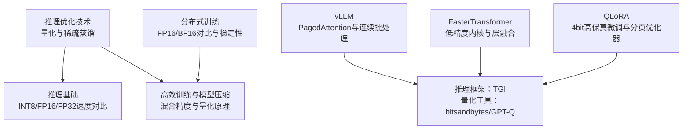
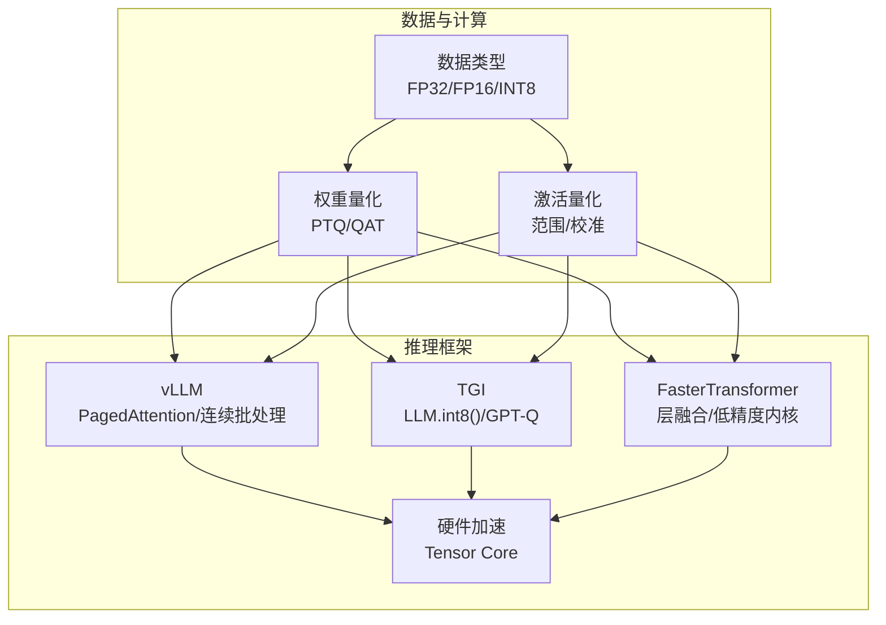
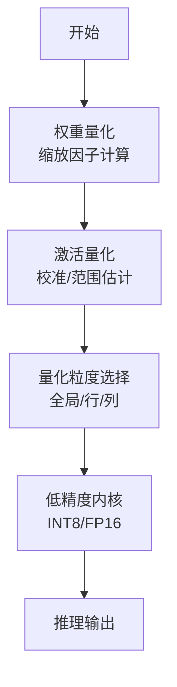
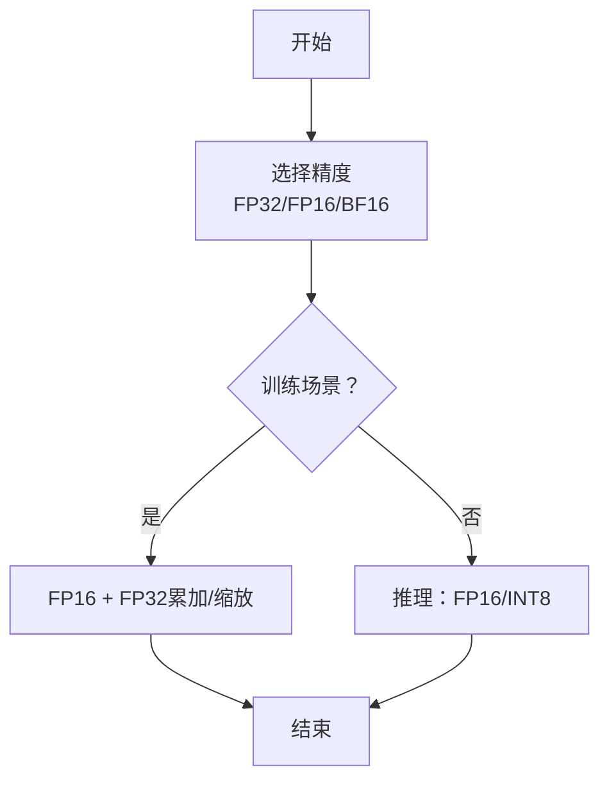
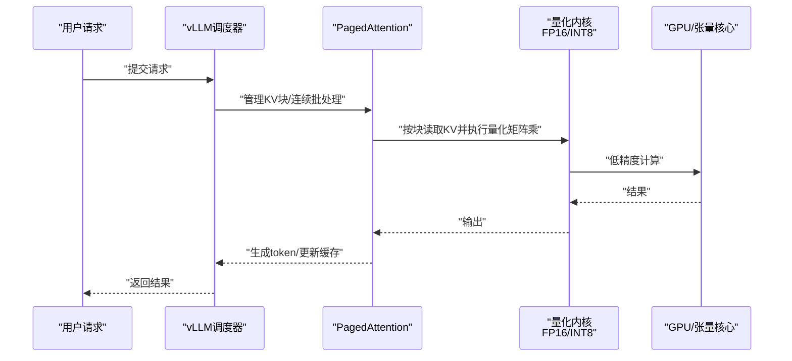
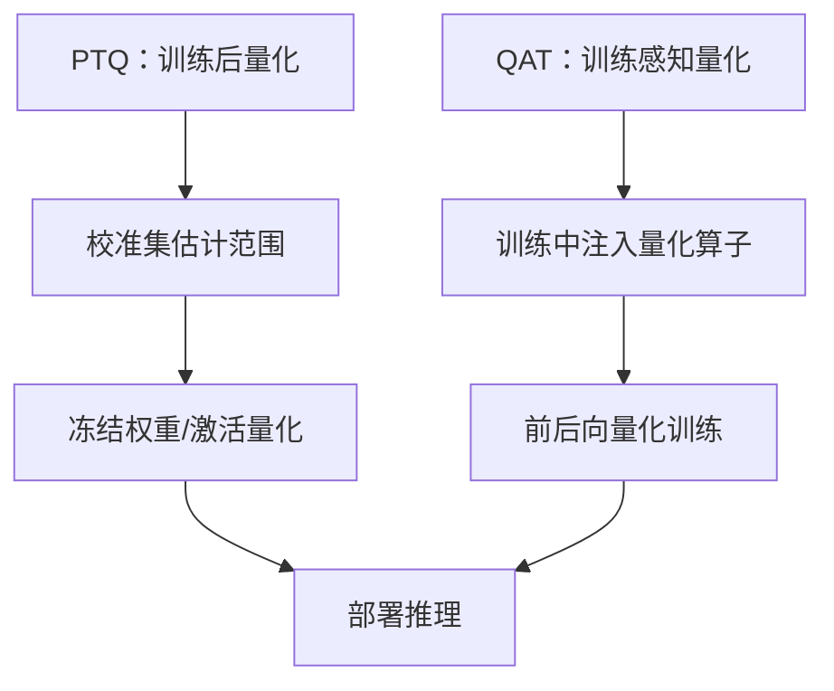
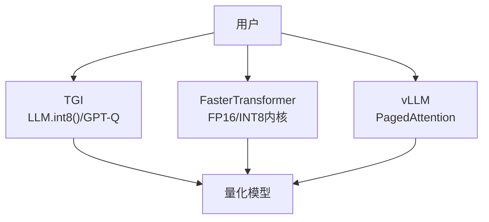
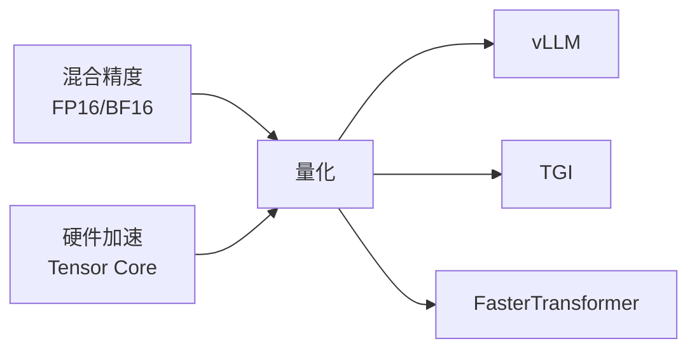

# 量化技术

<cite>
**本文引用的文件**
- [llm推理优化技术.md](file://06.推理/llm推理优化技术/llm推理优化技术.md)
- [1.推理.md](file://06.推理/1.推理/1.推理.md)
- [5.高效训练&模型压缩.md](file://98.相关课程/清华大模型公开课/5.高效训练&模型压缩/5.高效训练&模型压缩.md)
- [1.vllm.md](file://06.推理/1.vllm/1.vllm.md)
- [2.text_generation_inference.md](file://06.推理/2.text_generation_inference/2.text_generation_inference.md)
- [3.faster_transformer.md](file://06.推理/3.faster_transformer/3.faster_transformer.md)
- [4.lora.md](file://05.有监督微调/4.lora/4.lora.md)
- [9.总结.md](file://04.分布式训练/9.总结/9.总结.md)
</cite>

## 目录
1. [引言](#引言)
2. [项目结构](#项目结构)
3. [核心组件](#核心组件)
4. [架构总览](#架构总览)
5. [详细组件分析](#详细组件分析)
6. [依赖分析](#依赖分析)
7. [性能考量](#性能考量)
8. [故障排查指南](#故障排查指南)
9. [结论](#结论)
10. [附录](#附录)

## 引言
本文件聚焦于大语言模型（LLM）推理中的量化技术，系统梳理 INT8 量化、FP16 量化与混合精度推理的原理、实现细节与工程实践，覆盖精度损失控制、训练后量化（Post-Training Quantization, PTQ）与训练感知量化（Quantization-Aware Training, QAT）的差异，以及量化模型的部署与推理优化路径。同时提供量化工具的使用指引与性能对比建议，帮助开发者在模型精度与推理速度之间找到最佳平衡点。

## 项目结构
围绕量化主题，知识库中与之直接相关的内容主要分布在“推理优化技术”“推理基础”“高效训练与模型压缩”“推理框架（vLLM、TGI、FasterTransformer）”“LoRA与QLoRA微调”“分布式训练（BF16/FP16对比）”等章节。下图给出与量化相关的知识结构概览：

**图表来源**
- [llm推理优化技术.md:184-216](file://06.推理/llm推理优化技术/llm推理优化技术.md#L184-L216)
- [1.推理.md:28-38](file://06.推理/1.推理/1.推理.md#L28-L38)
- [5.高效训练&模型压缩.md:497-517](file://98.相关课程/清华大模型公开课/5.高效训练&模型压缩/5.高效训练&模型压缩.md#L497-L517)
- [1.vllm.md:41-151](file://06.推理/1.vllm/1.vllm.md#L41-L151)
- [2.text_generation_inference.md:11-16](file://06.推理/2.text_generation_inference/2.text_generation_inference.md#L11-L16)
- [3.faster_transformer.md:60-65](file://06.推理/3.faster_transformer/3.faster_transformer.md#L60-L65)
- [4.lora.md:81-114](file://05.有监督微调/4.lora/4.lora.md#L81-L114)
- [9.总结.md:110-120](file://04.分布式训练/9.总结/9.总结.md#L110-L120)

**章节来源**
- [llm推理优化技术.md:1-271](file://06.推理/llm推理优化技术/llm推理优化技术.md#L1-L271)
- [1.推理.md:1-94](file://06.推理/1.推理/1.推理.md#L1-L94)
- [5.高效训练&模型压缩.md:1-564](file://98.相关课程/清华大模型公开课/5.高效训练&模型压缩/5.高效训练&模型压缩.md#L1-L564)
- [1.vllm.md:1-220](file://06.推理/1.vllm/1.vllm.md#L1-L220)
- [2.text_generation_inference.md:1-140](file://06.推理/2.text_generation_inference/2.text_generation_inference.md#L1-L140)
- [3.faster_transformer.md:1-73](file://06.推理/3.faster_transformer/3.faster_transformer.md#L1-L73)
- [4.lora.md:77-114](file://05.有监督微调/4.lora/4.lora.md#L77-L114)
- [9.总结.md:110-120](file://04.分布式训练/9.总结/9.总结.md#L110-L120)

## 核心组件
- 量化基础与原理
  - 量化是降低模型权重与激活精度的过程，通过将浮点值映射到更低比特表示（如 INT8、FP16），减少内存占用与带宽压力，从而提升推理吞吐与速度。
  - 权重量化相对简单，因权重在训练后固定；激活量化更具挑战，因激活向量常含异常值，动态范围大，需谨慎选择范围与校准策略。
- 混合精度推理
  - 在推理中使用 FP16/INT8 等低精度数据类型，配合张量核心（Tensor Core）等硬件加速，可显著降低内存带宽与计算开销。
- 稀疏与蒸馏
  - 稀疏化与知识蒸馏可与量化协同，进一步压缩模型规模与加速推理。
- 推理框架与工程优化
  - vLLM 的 PagedAttention 与连续批处理（Continuous Batching）有效缓解 KV 缓存内存瓶颈；TGI 支持 bitsandbytes（LLM.int8）与 GPT-Q 量化；FasterTransformer 提供低精度内核与层融合优化。

**章节来源**
- [llm推理优化技术.md:184-216](file://06.推理/llm推理优化技术/llm推理优化技术.md#L184-L216)
- [1.推理.md:28-38](file://06.推理/1.推理/1.推理.md#L28-L38)
- [5.高效训练&模型压缩.md:497-517](file://98.相关课程/清华大模型公开课/5.高效训练&模型压缩/5.高效训练&模型压缩.md#L497-L517)
- [1.vllm.md:41-151](file://06.推理/1.vllm/1.vllm.md#L41-L151)
- [2.text_generation_inference.md:11-16](file://06.推理/2.text_generation_inference/2.text_generation_inference.md#L11-L16)
- [3.faster_transformer.md:60-65](file://06.推理/3.faster_transformer/3.faster_transformer.md#L60-L65)

## 架构总览
下图展示量化在 LLM 推理中的关键位置与影响面：从数据类型选择（FP32/FP16/INT8）到激活量化与权重量化，再到推理框架（vLLM/TGI/FT）的工程优化（PagedAttention、连续批处理、层融合、低精度内核），最终影响吞吐与延迟。

**图表来源**
- [llm推理优化技术.md:184-216](file://06.推理/llm推理优化技术/llm推理优化技术.md#L184-L216)
- [1.vllm.md:41-151](file://06.推理/1.vllm/1.vllm.md#L41-L151)
- [2.text_generation_inference.md:11-16](file://06.推理/2.text_generation_inference/2.text_generation_inference.md#L11-L16)
- [3.faster_transformer.md:60-65](file://06.推理/3.faster_transformer/3.faster_transformer.md#L60-L65)

## 详细组件分析

### 组件A：量化原理与实现（权重与激活）
- 权重量化（PTQ）
  - 将浮点权重映射到 INT8/INT4 等整数表示，通常通过缩放因子将权重线性映射至 [-127,127] 区间，随后进行四舍五入。
  - 优点：实现简单、推理时可复用低精度内核；缺点：若激活仍为高精度，需在乘法前回灌到更高精度，带来额外开销。
- 激活量化
  - 激活向量常含异常值，动态范围大，直接低精度表示易失真。
  - 常见策略：代表性数据集校准以定位异常值；或借用权重动态范围重用到激活。
- 粒度与范围
  - 全局缩放因子在大矩阵（如 Transformer）上较难适配；更细粒度（按行/列）缩放可提升效果。
- 混合精度与低精度内核
  - 在推理中使用 FP16/INT8，配合张量核心可显著降低带宽与计算成本。

**图表来源**
- [5.高效训练&模型压缩.md:497-517](file://98.相关课程/清华大模型公开课/5.高效训练&模型压缩/5.高效训练&模型压缩.md#L497-L517)
- [llm推理优化技术.md:184-201](file://06.推理/llm推理优化技术/llm推理优化技术.md#L184-L201)

**章节来源**
- [5.高效训练&模型压缩.md:497-517](file://98.相关课程/清华大模型公开课/5.高效训练&模型压缩/5.高效训练&模型压缩.md#L497-L517)
- [llm推理优化技术.md:184-201](file://06.推理/llm推理优化技术/llm推理优化技术.md#L184-L201)

### 组件B：混合精度与BF16/FP16对比
- 混合精度在训练中广泛采用 FP16，但存在下溢风险；通过 FP32 累加与损失缩放等策略缓解。
- BF16 保留与 FP32 相同的动态范围，牺牲一定精度，但在训练稳定性上具优势。
- 推理侧可直接使用 FP16/INT8，显著降低带宽与内存占用。

**图表来源**
- [9.总结.md:110-120](file://04.分布式训练/9.总结/9.总结.md#L110-L120)
- [1.推理.md:28-38](file://06.推理/1.推理/1.推理.md#L28-L38)

**章节来源**
- [9.总结.md:110-120](file://04.分布式训练/9.总结/9.总结.md#L110-L120)
- [1.推理.md:28-38](file://06.推理/1.推理/1.推理.md#L28-L38)

### 组件C：推理框架与量化协同（vLLM/TGI/FT）
- vLLM
  - PagedAttention 将 KV 缓存分块存储，显著降低内存碎片与浪费，提升吞吐。
  - 连续批处理（Continuous Batching）在序列完成时插入新请求，提升 GPU 利用率。
  - 与量化结合：在相同显存下提升 batch size 与 seqlen，缓解内存瓶颈。
- TGI
  - 支持 bitsandbytes（LLM.int8）与 GPT-Q 量化，便于快速部署量化模型。
- FasterTransformer
  - 提供低精度内核（FP16/INT8）、层融合、激活缓存与张量/流水线并行，降低延迟、提升吞吐。

**图表来源**
- [1.vllm.md:41-151](file://06.推理/1.vllm/1.vllm.md#L41-L151)
- [2.text_generation_inference.md:11-16](file://06.推理/2.text_generation_inference/2.text_generation_inference.md#L11-L16)
- [3.faster_transformer.md:60-65](file://06.推理/3.faster_transformer/3.faster_transformer.md#L60-L65)

**章节来源**
- [1.vllm.md:41-151](file://06.推理/1.vllm/1.vllm.md#L41-L151)
- [2.text_generation_inference.md:11-16](file://06.推理/2.text_generation_inference/2.text_generation_inference.md#L11-L16)
- [3.faster_transformer.md:60-65](file://06.推理/3.faster_transformer/3.faster_transformer.md#L60-L65)

### 组件D：训练后量化与训练感知量化的区别
- 训练后量化（PTQ）
  - 在模型训练完成后进行，通常通过校准集估计激活范围，实现权重/激活的低精度表示。
  - 实现简单、部署友好，但可能引入精度损失。
- 训练感知量化（QAT）
  - 在训练过程中引入量化算子（前后向），使模型在训练阶段就适应低精度计算，通常能更好保持精度。
  - 需要更复杂的训练流程与校准策略，但收益更高。

**图表来源**
- [llm推理优化技术.md:184-201](file://06.推理/llm推理优化技术/llm推理优化技术.md#L184-L201)

**章节来源**
- [llm推理优化技术.md:184-201](file://06.推理/llm推理优化技术/llm推理优化技术.md#L184-L201)

### 组件E：量化工具与使用指南
- bitsandbytes（LLM.int8）
  - 通过低秩近似与整数量化实现快速部署，适合中小规模模型或边缘设备。
- GPT-Q
  - 面向大模型的高精度量化工具，支持更高精度的权重表示与推理。
- TGI
  - 集成上述量化工具，提供一键部署与监控能力。
- QLoRA
  - 在 4bit 存储与 BFloat16 计算的组合下，通过低秩适配器恢复性能，实现“4bit 高保真微调”。

**图表来源**
- [2.text_generation_inference.md:11-16](file://06.推理/2.text_generation_inference/2.text_generation_inference.md#L11-L16)
- [3.faster_transformer.md:60-65](file://06.推理/3.faster_transformer/3.faster_transformer.md#L60-L65)
- [4.lora.md:81-114](file://05.有监督微调/4.lora/4.lora.md#L81-L114)

**章节来源**
- [2.text_generation_inference.md:11-16](file://06.推理/2.text_generation_inference/2.text_generation_inference.md#L11-L16)
- [3.faster_transformer.md:60-65](file://06.推理/3.faster_transformer/3.faster_transformer.md#L60-L65)
- [4.lora.md:81-114](file://05.有监督微调/4.lora/4.lora.md#L81-L114)

## 依赖分析
- 量化与推理框架耦合紧密：vLLM 的 PagedAttention 与连续批处理显著受益于量化带来的内存节省；TGI 与 FasterTransformer 则通过低精度内核与层融合进一步放大量化收益。
- 混合精度与硬件加速：BF16/FP16 的稳定性与 INT8/FP16 的低带宽特性在不同场景下互补，需结合硬件能力与任务需求选择。
- 训练与部署的衔接：QAT 更适合对精度要求极高的场景，PTQ 更适合快速部署与边缘设备。

**图表来源**
- [1.vllm.md:41-151](file://06.推理/1.vllm/1.vllm.md#L41-L151)
- [2.text_generation_inference.md:11-16](file://06.推理/2.text_generation_inference/2.text_generation_inference.md#L11-L16)
- [3.faster_transformer.md:60-65](file://06.推理/3.faster_transformer/3.faster_transformer.md#L60-L65)
- [9.总结.md:110-120](file://04.分布式训练/9.总结/9.总结.md#L110-L120)

**章节来源**
- [1.vllm.md:41-151](file://06.推理/1.vllm/1.vllm.md#L41-L151)
- [2.text_generation_inference.md:11-16](file://06.推理/2.text_generation_inference/2.text_generation_inference.md#L11-L16)
- [3.faster_transformer.md:60-65](file://06.推理/3.faster_transformer/3.faster_transformer.md#L60-L65)
- [9.总结.md:110-120](file://04.分布式训练/9.总结/9.总结.md#L110-L120)

## 性能考量
- 内存瓶颈与吞吐提升
  - LLM 推理多为内存受限（Memory-bound），量化可显著降低 KV 缓存与权重占用，提升 batch size 与 seqlen，进而提升吞吐。
  - vLLM 的 PagedAttention 与连续批处理在量化基础上进一步减少内存碎片与空闲时间。
- 精度与速度的权衡
  - INT8/FP16 在带宽与计算上更高效，但需注意激活量化与异常值处理；BF16/FP16 在训练稳定性上更优，推理侧可直接采用 FP16/INT8。
- 工具链与部署
  - TGI 提供一键量化部署与监控；FasterTransformer 提供低精度内核与层融合，适合高性能推理场景。

**章节来源**
- [1.vllm.md:41-151](file://06.推理/1.vllm/1.vllm.md#L41-L151)
- [1.推理.md:28-38](file://06.推理/1.推理/1.推理.md#L28-L38)
- [2.text_generation_inference.md:11-16](file://06.推理/2.text_generation_inference/2.text_generation_inference.md#L11-L16)
- [3.faster_transformer.md:60-65](file://06.推理/3.faster_transformer/3.faster_transformer.md#L60-L65)

## 故障排查指南
- 显存占用与释放
  - 推理时显存占用高且不释放，可能与框架的延迟释放策略、中间结果与 KV 缓存占用有关。可通过调整 batch size、序列长度与缓存管理策略缓解。
- 量化精度损失
  - 若激活量化导致明显精度下降，可尝试更精细的范围估计（按行/列缩放）、校准集覆盖更多场景，或采用 QAT 提升鲁棒性。
- 混合精度稳定性
  - FP16 训练易出现溢出与不收敛，BF16 可缓解；推理侧建议直接使用 FP16/INT8，避免不必要的回灌。
- 工具链问题
  - TGI 的 bitsandbytes 与 GPT-Q 量化需确认模型兼容性与版本匹配；FasterTransformer 的低精度内核需确保硬件支持。

**章节来源**
- [1.推理.md:5-14](file://06.推理/1.推理/1.推理.md#L5-L14)
- [llm推理优化技术.md:184-201](file://06.推理/llm推理优化技术/llm推理优化技术.md#L184-L201)
- [9.总结.md:110-120](file://04.分布式训练/9.总结/9.总结.md#L110-L120)
- [2.text_generation_inference.md:11-16](file://06.推理/2.text_generation_inference/2.text_generation_inference.md#L11-L16)

## 结论
量化是 LLM 推理优化的关键手段，结合 PTQ/QAT、PagedAttention、连续批处理与低精度内核，可在显著降低内存占用的同时提升吞吐与速度。在工程实践中，应根据任务精度要求、硬件能力与部署场景，选择合适的量化策略与工具链，并通过校准与监控保障精度与稳定性。

## 附录
- 术语
  - PTQ：训练后量化
  - QAT：训练感知量化
  - PagedAttention：分页KV缓存管理
  - 连续批处理：动态批处理，提升 GPU 利用率
  - 张量核心：NVIDIA 硬件加速单元，支持低精度矩阵乘
- 参考资料
  - vLLM：PagedAttention 与连续批处理
  - TGI：LLM.int8()/GPT-Q 量化
  - FasterTransformer：低精度内核与层融合
  - QLoRA：4bit 高保真微调与分页优化器