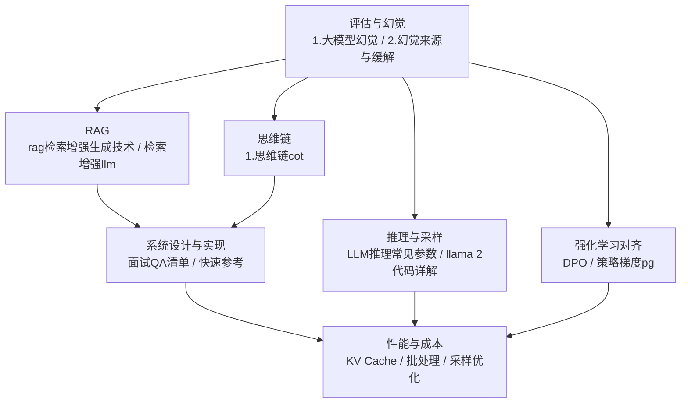
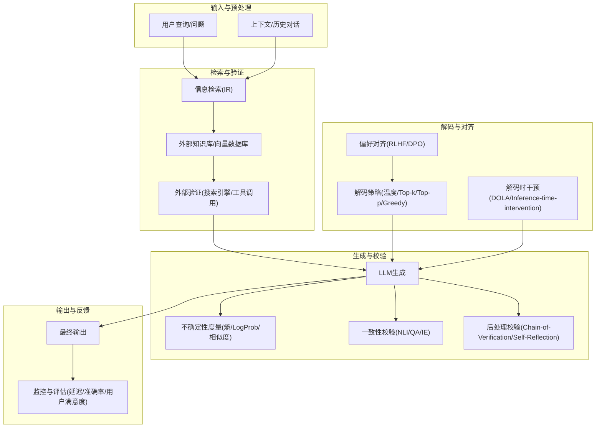
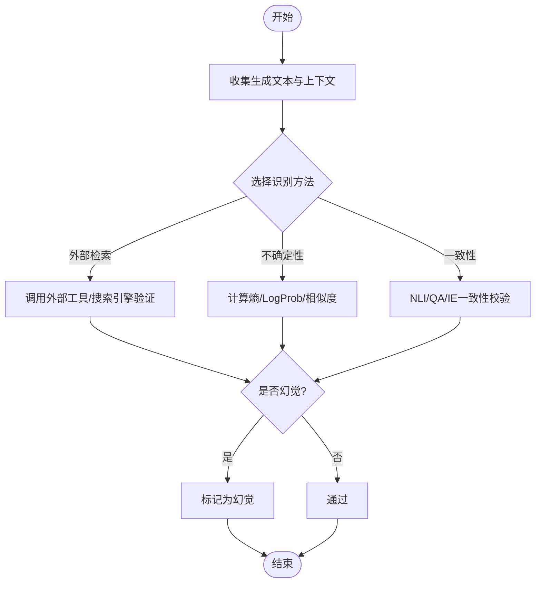
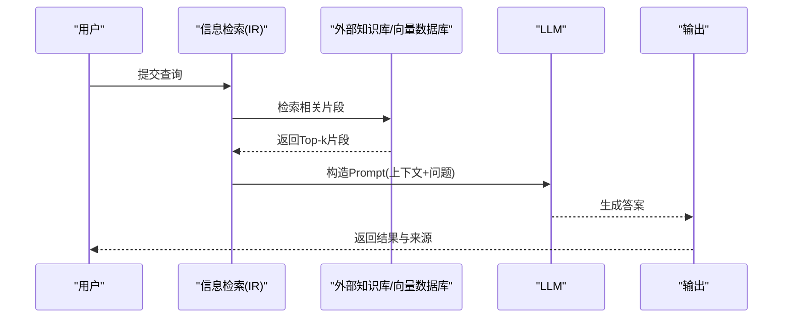
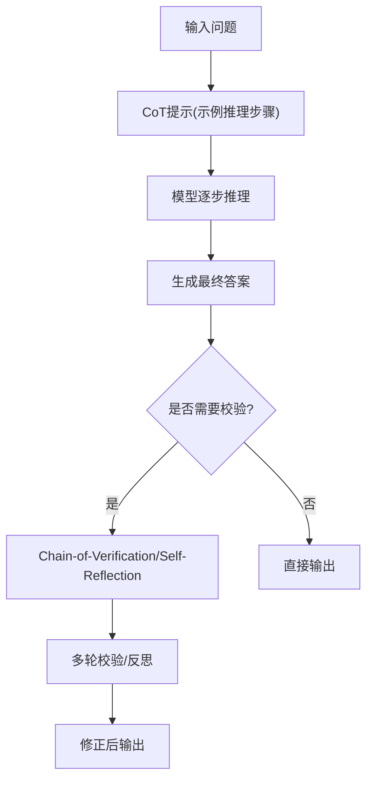
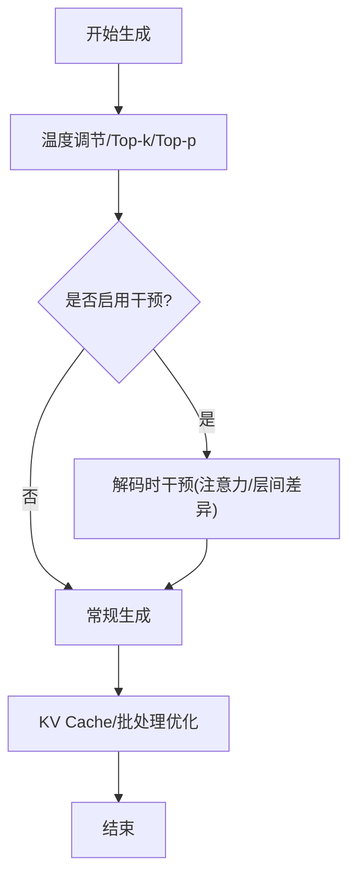
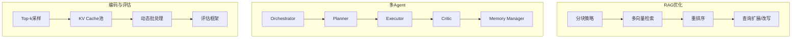
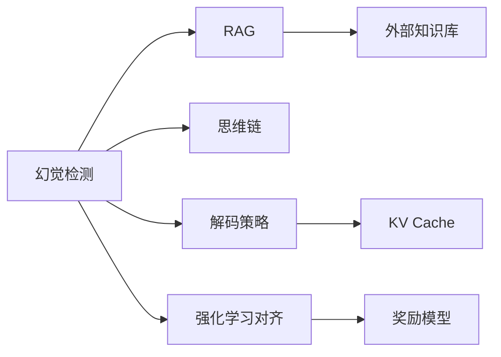

# 幻觉检测与缓解

<cite>
**本文引用的文件**
- [09.大语言模型评估/1.大模型幻觉/1.大模型幻觉.md](file://09.大语言模型评估/1.大模型幻觉/1.大模型幻觉.md)
- [09.大语言模型评估/2.幻觉来源与缓解/2.幻觉来源与缓解.md](file://09.大语言模型评估/2.幻觉来源与缓解/2.幻觉来源与缓解.md)
- [08.检索增强rag/rag（检索增强生成）技术/rag（检索增强生成）技术.md](file://08.检索增强rag/rag（检索增强生成）技术/rag（检索增强生成）技术.md)
- [08.检索增强rag/检索增强llm/检索增强llm.md](file://08.检索增强rag/检索增强llm/检索增强llm.md)
- [10.大语言模型应用/1.思维链（cot）/1.思维链（cot）.md](file://10.大语言模型应用/1.思维链（cot）/1.思维链（cot）.md)
- [ai_generataion/中级LLM_Agent工程师面试QA清单.md](file://ai_generataion/中级LLM_Agent工程师面试QA清单.md)
- [ai_generataion/中级LLM_Agent工程师面试_快速参考.md](file://ai_generataion/中级LLM_Agent工程师面试_快速参考.md)
- [07.强化学习/DPO/DPO.md](file://07.强化学习/DPO/DPO.md)
- [07.强化学习/策略梯度（pg）/策略梯度（pg）.md](file://07.强化学习/策略梯度（pg）/策略梯度（pg）.md)
- [06.推理/LLM推理常见参数/LLM推理常见参数.md](file://06.推理/LLM推理常见参数/LLM推理常见参数.md)
- [02.大语言模型架构/llama 2代码详解/llama 2代码详解.md](file://02.大语言模型架构/llama 2代码详解/llama 2代码详解.md)
</cite>

## 目录
1. [简介](#简介)
2. [项目结构](#项目结构)
3. [核心组件](#核心组件)
4. [架构总览](#架构总览)
5. [详细组件分析](#详细组件分析)
6. [依赖分析](#依赖分析)
7. [性能考量](#性能考量)
8. [故障排查指南](#故障排查指南)
9. [结论](#结论)
10. [附录](#附录)

## 简介
本文件围绕“幻觉检测与缓解”主题，系统梳理大模型幻觉的成因、识别与缓解策略，结合仓库中关于幻觉定义、检测方法、缓解技术、RAG、思维链（Chain-of-Thought）、推理参数与采样策略、强化学习对齐等资料，构建从理论到实践的完整知识体系。文档特别强调：
- 幻觉类型与成因：事实性错误、虚构信息、逻辑矛盾、上下文冲突等
- 检测技术：外部检索验证、不确定性度量、一致性校验、NLI/QA/IE等
- 缓解技术：RAG、知识注入、多步推理、解码干预、后处理校验、强化学习对齐
- 实战建议：模块化架构、性能与成本权衡、可解释性与可追溯性

## 项目结构
本仓库与“幻觉检测与缓解”相关的内容主要分布在以下模块：
- 评估与幻觉：定义幻觉、分类、检测与缓解策略
- RAG：检索增强生成的动机、模块与调用模式
- 思维链：多步推理与可解释性
- 推理与采样：解码策略、温度/Top-k/Top-p、KV缓存与性能
- 强化学习：偏好对齐与幻觉缓解的工程化路径
- 面试与实践：系统设计、编码实现与评估框架



**图表来源**
- [09.大语言模型评估/1.大模型幻觉/1.大模型幻觉.md](file://09.大语言模型评估/1.大模型幻觉/1.大模型幻觉.md)
- [09.大语言模型评估/2.幻觉来源与缓解/2.幻觉来源与缓解.md](file://09.大语言模型评估/2.幻觉来源与缓解/2.幻觉来源与缓解.md)
- [08.检索增强rag/rag（检索增强生成）技术/rag（检索增强生成）技术.md](file://08.检索增强rag/rag（检索增强生成）技术/rag（检索增强生成）技术.md)
- [08.检索增强rag/检索增强llm/检索增强llm.md](file://08.检索增强rag/检索增强llm/检索增强llm.md)
- [10.大语言模型应用/1.思维链（cot）/1.思维链（cot）.md](file://10.大语言模型应用/1.思维链（cot）/1.思维链（cot）.md)
- [ai_generataion/中级LLM_Agent工程师面试QA清单.md](file://ai_generataion/中级LLM_Agent工程师面试QA清单.md)
- [ai_generataion/中级LLM_Agent工程师面试_快速参考.md](file://ai_generataion/中级LLM_Agent工程师面试_快速参考.md)
- [06.推理/LLM推理常见参数/LLM推理常见参数.md](file://06.推理/LLM推理常见参数/LLM推理常见参数.md)
- [02.大语言模型架构/llama 2代码详解/llama 2代码详解.md](file://02.大语言模型架构/llama 2代码详解/llama 2代码详解.md)
- [07.强化学习/DPO/DPO.md](file://07.强化学习/DPO/DPO.md)
- [07.强化学习/策略梯度（pg）/策略梯度（pg）.md](file://07.强化学习/策略梯度（pg）/策略梯度（pg）.md)

**章节来源**
- [09.大语言模型评估/1.大模型幻觉/1.大模型幻觉.md](file://09.大语言模型评估/1.大模型幻觉/1.大模型幻觉.md)
- [09.大语言模型评估/2.幻觉来源与缓解/2.幻觉来源与缓解.md](file://09.大语言模型评估/2.幻觉来源与缓解/2.幻觉来源与缓解.md)
- [08.检索增强rag/rag（检索增强生成）技术/rag（检索增强生成）技术.md](file://08.检索增强rag/rag（检索增强生成）技术/rag（检索增强生成）技术.md)
- [08.检索增强rag/检索增强llm/检索增强llm.md](file://08.检索增强rag/检索增强llm/检索增强llm.md)
- [10.大语言模型应用/1.思维链（cot）/1.思维链（cot）.md](file://10.大语言模型应用/1.思维链（cot）/1.思维链（cot）.md)
- [ai_generataion/中级LLM_Agent工程师面试QA清单.md](file://ai_generataion/中级LLM_Agent工程师面试QA清单.md)
- [ai_generataion/中级LLM_Agent工程师面试_快速参考.md](file://ai_generataion/中级LLM_Agent工程师面试_快速参考.md)
- [06.推理/LLM推理常见参数/LLM推理常见参数.md](file://06.推理/LLM推理常见参数/LLM推理常见参数.md)
- [02.大语言模型架构/llama 2代码详解/llama 2代码详解.md](file://02.大语言模型架构/llama 2代码详解/llama 2代码详解.md)
- [07.强化学习/DPO/DPO.md](file://07.强化学习/DPO/DPO.md)
- [07.强化学习/策略梯度（pg）/策略梯度（pg）.md](file://07.强化学习/策略梯度（pg）/策略梯度（pg）.md)

## 核心组件
- 幻觉识别与度量
  - 命名实体误差、蕴含率、基于模型的评估、问答一致性、信息抽取一致性
- 幻觉缓解策略
  - 外部知识验证、事实核心采样、SelfCheckGPT、RAG、思维链、解码干预、后处理校验、强化学习对齐
- RAG系统关键模块
  - 数据与索引、查询与检索、响应生成
- 推理与采样
  - 温度、Top-k、Top-p、贪心解码、KV Cache、动态批处理
- 强化学习对齐
  - SFT、奖励建模、RLHF/偏好对齐、DPO

**章节来源**
- [09.大语言模型评估/1.大模型幻觉/1.大模型幻觉.md](file://09.大语言模型评估/1.大模型幻觉/1.大模型幻觉.md)
- [09.大语言模型评估/2.幻觉来源与缓解/2.幻觉来源与缓解.md](file://09.大语言模型评估/2.幻觉来源与缓解/2.幻觉来源与缓解.md)
- [08.检索增强rag/rag（检索增强生成）技术/rag（检索增强生成）技术.md](file://08.检索增强rag/rag（检索增强生成）技术/rag（检索增强生成）技术.md)
- [08.检索增强rag/检索增强llm/检索增强llm.md](file://08.检索增强rag/检索增强llm/检索增强llm.md)
- [10.大语言模型应用/1.思维链（cot）/1.思维链（cot）.md](file://10.大语言模型应用/1.思维链（cot）/1.思维链（cot）.md)
- [06.推理/LLM推理常见参数/LLM推理常见参数.md](file://06.推理/LLM推理常见参数/LLM推理常见参数.md)
- [02.大语言模型架构/llama 2代码详解/llama 2代码详解.md](file://02.大语言模型架构/llama 2代码详解/llama 2代码详解.md)
- [07.强化学习/DPO/DPO.md](file://07.强化学习/DPO/DPO.md)
- [07.强化学习/策略梯度（pg）/策略梯度（pg）.md](file://07.强化学习/策略梯度（pg）/策略梯度（pg）.md)

## 架构总览
下图展示“幻觉检测与缓解”的端到端架构：从输入到生成，贯穿外部知识检索、上下文一致性校验、不确定性度量、多步推理、解码干预与后处理校验，最终输出可信结果。



**图表来源**
- [09.大语言模型评估/2.幻觉来源与缓解/2.幻觉来源与缓解.md](file://09.大语言模型评估/2.幻觉来源与缓解/2.幻觉来源与缓解.md)
- [08.检索增强rag/rag（检索增强生成）技术/rag（检索增强生成）技术.md](file://08.检索增强rag/rag（检索增强生成）技术/rag（检索增强生成）技术.md)
- [08.检索增强rag/检索增强llm/检索增强llm.md](file://08.检索增强rag/检索增强llm/检索增强llm.md)
- [10.大语言模型应用/1.思维链（cot）/1.思维链（cot）.md](file://10.大语言模型应用/1.思维链（cot）/1.思维链（cot）.md)
- [06.推理/LLM推理常见参数/LLM推理常见参数.md](file://06.推理/LLM推理常见参数/LLM推理常见参数.md)
- [02.大语言模型架构/llama 2代码详解/llama 2代码详解.md](file://02.大语言模型架构/llama 2代码详解/llama 2代码详解.md)
- [07.强化学习/DPO/DPO.md](file://07.强化学习/DPO/DPO.md)
- [07.强化学习/策略梯度（pg）/策略梯度（pg）.md](file://07.强化学习/策略梯度（pg）/策略梯度（pg）.md)

## 详细组件分析

### 组件A：幻觉识别与度量
- 识别方法
  - 外部检索验证：通过搜索引擎或工具调用核验事实
  - 不确定性度量：熵、条件对数概率、多次采样相似度
  - 一致性校验：NLI/蕴含、QA问答、信息抽取（三元组）
- 适用场景
  - 事实性错误、虚构信息、逻辑矛盾、上下文冲突
- 实施要点
  - 优先使用“少量更相关的信息”以提升准确性
  - 结合人类评估与自动化指标进行综合判定



**图表来源**
- [09.大语言模型评估/1.大模型幻觉/1.大模型幻觉.md](file://09.大语言模型评估/1.大模型幻觉/1.大模型幻觉.md)
- [09.大语言模型评估/2.幻觉来源与缓解/2.幻觉来源与缓解.md](file://09.大语言模型评估/2.幻觉来源与缓解/2.幻觉来源与缓解.md)

**章节来源**
- [09.大语言模型评估/1.大模型幻觉/1.大模型幻觉.md](file://09.大语言模型评估/1.大模型幻觉/1.大模型幻觉.md)
- [09.大语言模型评估/2.幻觉来源与缓解/2.幻觉来源与缓解.md](file://09.大语言模型评估/2.幻觉来源与缓解/2.幻觉来源与缓解.md)

### 组件B：RAG系统（检索增强生成）
- 动机与优势
  - 长尾知识、私有数据、数据新鲜度、来源验证与可解释性
- 关键模块
  - 数据与索引：统一文档对象、元信息（时间、标题、关键词、摘要）
  - 查询与检索：准确高效检索
  - 响应生成：结合检索结果增强输出
- 调用模式
  - 非结构化数据嵌入→构造Prompt→LLM生成
  - 多轮对话长时记忆（向量数据库）
  - Cache命中优先，未命中则与LLM交互并回填



**图表来源**
- [08.检索增强rag/rag（检索增强生成）技术/rag（检索增强生成）技术.md](file://08.检索增强rag/rag（检索增强生成）技术/rag（检索增强生成）技术.md)
- [08.检索增强rag/检索增强llm/检索增强llm.md](file://08.检索增强rag/检索增强llm/检索增强llm.md)

**章节来源**
- [08.检索增强rag/rag（检索增强生成）技术/rag（检索增强生成）技术.md](file://08.检索增强rag/rag（检索增强生成）技术/rag（检索增强生成）技术.md)
- [08.检索增强rag/检索增强llm/检索增强llm.md](file://08.检索增强rag/检索增强llm/检索增强llm.md)

### 组件C：思维链（CoT）与多步推理
- 思维链提示本质
  - 通过少量示例展示推理步骤，引导模型逐步组织语言进行多步推理
- 优势
  - 分解复杂问题、提供步骤示范、引导逻辑思维、提升可解释性
- 局限与改进
  - 结果不一定事实准确；可结合验证器、自动生成提示、小模型泛化等方向改进



**图表来源**
- [10.大语言模型应用/1.思维链（cot）/1.思维链（cot）.md](file://10.大语言模型应用/1.思维链（cot）/1.思维链（cot）.md)

**章节来源**
- [10.大语言模型应用/1.思维链（cot）/1.思维链（cot）.md](file://10.大语言模型应用/1.思维链（cot）/1.思维链（cot）.md)

### 组件D：解码策略与解码时干预
- 解码策略
  - 温度、Top-k、Top-p、贪心解码；温度越高多样性越高，但可能增加幻觉
- 解码时干预
  - DOLA：利用层间残差连接差异抑制低层噪声
  - Inference-time-intervention：干预与事实性相关的注意力头
- KV Cache与批处理
  - 预分配内存块、循环缓冲区、PagedAttention优化



**图表来源**
- [06.推理/LLM推理常见参数/LLM推理常见参数.md](file://06.推理/LLM推理常见参数/LLM推理常见参数.md)
- [02.大语言模型架构/llama 2代码详解/llama 2代码详解.md](file://02.大语言模型架构/llama 2代码详解/llama 2代码详解.md)

**章节来源**
- [06.推理/LLM推理常见参数/LLM推理常见参数.md](file://06.推理/LLM推理常见参数/LLM推理常见参数.md)
- [02.大语言模型架构/llama 2代码详解/llama 2代码详解.md](file://02.大语言模型架构/llama 2代码详解/llama 2代码详解.md)

### 组件E：强化学习对齐与幻觉缓解
- SFT：监督微调获得初版策略π^{SFT}
- 奖励建模：二元偏好标签，奖励模型r_φ
- RL微调：最大化期望奖励并正则KL
- DPO：直接偏好优化，避免奖励建模复杂度

```mermaid
sequenceDiagram
participant X as "提示x"
participant PI as "策略π"
participant HM as "人类标注"
participant RM as "奖励模型r_φ"
participant OPT as "优化器"
X->>PI : 采样一对回答(y1,y2)
PI-->>HM : 人类偏好标签(yw≻yl)
HM-->>RM : 训练奖励模型
RM-->>OPT : 计算策略梯度
OPT-->>PI : 更新策略(偏好对齐)
```

**图表来源**
- [07.强化学习/DPO/DPO.md](file://07.强化学习/DPO/DPO.md)
- [07.强化学习/策略梯度（pg）/策略梯度（pg）.md](file://07.强化学习/策略梯度（pg）/策略梯度（pg）.md)

**章节来源**
- [07.强化学习/DPO/DPO.md](file://07.强化学习/DPO/DPO.md)
- [07.强化学习/策略梯度（pg）/策略梯度（pg）.md](file://07.强化学习/策略梯度（pg）/策略梯度（pg）.md)

### 组件F：系统设计与工程实践
- RAG优化要点
  - 文档分块（语义边界、重叠窗口）、多向量检索（标题+内容+摘要）、重排序、查询扩展/改写
  - HyDE、多跳检索、用户反馈微调
- 多Agent协作
  - Planner/Executor/Critic/Memory Manager，Orchestrator任务分解，避免死锁与状态同步
- 编码与评估
  - Top-k采样、KV Cache池、动态批处理、延迟/吞吐/准确率/用户满意度



**图表来源**
- [ai_generataion/中级LLM_Agent工程师面试QA清单.md](file://ai_generataion/中级LLM_Agent工程师面试QA清单.md)
- [ai_generataion/中级LLM_Agent工程师面试_快速参考.md](file://ai_generataion/中级LLM_Agent工程师面试_快速参考.md)

**章节来源**
- [ai_generataion/中级LLM_Agent工程师面试QA清单.md](file://ai_generataion/中级LLM_Agent工程师面试QA清单.md)
- [ai_generataion/中级LLM_Agent工程师面试_快速参考.md](file://ai_generataion/中级LLM_Agent工程师面试_快速参考.md)

## 依赖分析
- 组件耦合
  - 幻觉检测与RAG、思维链、解码策略、强化学习对齐相互独立但可组合
  - RAG依赖外部知识库与检索质量；思维链依赖提示质量；解码策略影响不确定性与幻觉概率；强化学习对齐影响模型偏好与置信度
- 外部依赖
  - 向量数据库（FAISS/Pinecone等）、搜索引擎、工具调用API
- 潜在风险
  - 检索质量差导致“虚假相关”；解码策略不当放大幻觉；强化学习标注偏差；KV Cache内存碎片



**图表来源**
- [09.大语言模型评估/2.幻觉来源与缓解/2.幻觉来源与缓解.md](file://09.大语言模型评估/2.幻觉来源与缓解/2.幻觉来源与缓解.md)
- [08.检索增强rag/rag（检索增强生成）技术/rag（检索增强生成）技术.md](file://08.检索增强rag/rag（检索增强生成）技术/rag（检索增强生成）技术.md)
- [10.大语言模型应用/1.思维链（cot）/1.思维链（cot）.md](file://10.大语言模型应用/1.思维链（cot）/1.思维链（cot）.md)
- [06.推理/LLM推理常见参数/LLM推理常见参数.md](file://06.推理/LLM推理常见参数/LLM推理常见参数.md)
- [07.强化学习/DPO/DPO.md](file://07.强化学习/DPO/DPO.md)

**章节来源**
- [09.大语言模型评估/2.幻觉来源与缓解/2.幻觉来源与缓解.md](file://09.大语言模型评估/2.幻觉来源与缓解/2.幻觉来源与缓解.md)
- [08.检索增强rag/rag（检索增强生成）技术/rag（检索增强生成）技术.md](file://08.检索增强rag/rag（检索增强生成）技术/rag（检索增强生成）技术.md)
- [10.大语言模型应用/1.思维链（cot）/1.思维链（cot）.md](file://10.大语言模型应用/1.思维链（cot）/1.思维链（cot）.md)
- [06.推理/LLM推理常见参数/LLM推理常见参数.md](file://06.推理/LLM推理常见参数/LLM推理常见参数.md)
- [07.强化学习/DPO/DPO.md](file://07.强化学习/DPO/DPO.md)

## 性能考量
- 检索与生成成本
  - 检索质量与延迟权衡：分块策略、重排序、查询扩展
  - 上下文窗口与成本：提供少量更相关的信息，避免“信息过载”
- 推理优化
  - KV Cache池、PagedAttention、动态批处理、温度与Top-k/Top-p的采样效率
- 评估与监控
  - 自动化指标（准确率、延迟、吞吐、ROUGE/BLEU）与人工评估（相关性、有用性、满意度）

[本节为通用性能讨论，不直接分析具体文件]

## 故障排查指南
- 幻觉高发
  - 检查检索质量：是否命中虚假相关；是否启用重排序与查询扩展
  - 检查解码策略：温度是否过高；是否启用解码时干预
  - 检查思维链：是否提供足够示例；是否结合后处理校验
- RAG不可用或延迟高
  - 检查向量数据库索引与查询性能；确认分块策略与重叠窗口设置
  - 检查缓存与批处理配置（KV Cache池、动态批处理）
- 强化学习对齐异常
  - 检查偏好标注质量与数量；确认奖励模型训练稳定；DPO是否收敛

**章节来源**
- [09.大语言模型评估/2.幻觉来源与缓解/2.幻觉来源与缓解.md](file://09.大语言模型评估/2.幻觉来源与缓解/2.幻觉来源与缓解.md)
- [08.检索增强rag/rag（检索增强生成）技术/rag（检索增强生成）技术.md](file://08.检索增强rag/rag（检索增强生成）技术/rag（检索增强生成）技术.md)
- [06.推理/LLM推理常见参数/LLM推理常见参数.md](file://06.推理/LLM推理常见参数/LLM推理常见参数.md)
- [07.强化学习/DPO/DPO.md](file://07.强化学习/DPO/DPO.md)

## 结论
- 幻觉检测与缓解需要“多管齐下”：外部验证、不确定性度量、一致性校验、思维链、RAG、解码干预、后处理校验、强化学习对齐
- RAG在缓解长尾知识、私有数据与数据新鲜度方面尤为有效，配合检索优化与可解释性设计，可显著降低幻觉
- 推理优化（KV Cache、动态批处理、采样策略）与强化学习对齐是保障输出质量与可控性的关键
- 建议在生产中建立“检测-干预-校验-评估-反馈”的闭环，持续迭代

[本节为总结性内容，不直接分析具体文件]

## 附录
- 最佳实践清单
  - 检索优化：语义分块、重叠窗口、多向量检索、重排序、查询扩展
  - 生成优化：温度与Top-p/Top-k平衡、解码时干预、思维链+后处理校验
  - 系统优化：KV Cache池、PagedAttention、动态批处理、监控与评估
  - 对齐优化：SFT→奖励建模→RLHF/DPO，标注质量与稳定性
- 参考路径
  - [09.大语言模型评估/1.大模型幻觉/1.大模型幻觉.md](file://09.大语言模型评估/1.大模型幻觉/1.大模型幻觉.md)
  - [09.大语言模型评估/2.幻觉来源与缓解/2.幻觉来源与缓解.md](file://09.大语言模型评估/2.幻觉来源与缓解/2.幻觉来源与缓解.md)
  - [08.检索增强rag/rag（检索增强生成）技术/rag（检索增强生成）技术.md](file://08.检索增强rag/rag（检索增强生成）技术/rag（检索增强生成）技术.md)
  - [08.检索增强rag/检索增强llm/检索增强llm.md](file://08.检索增强rag/检索增强llm/检索增强llm.md)
  - [10.大语言模型应用/1.思维链（cot）/1.思维链（cot）.md](file://10.大语言模型应用/1.思维链（cot）/1.思维链（cot）.md)
  - [ai_generataion/中级LLM_Agent工程师面试QA清单.md](file://ai_generataion/中级LLM_Agent工程师面试QA清单.md)
  - [ai_generataion/中级LLM_Agent工程师面试_快速参考.md](file://ai_generataion/中级LLM_Agent工程师面试_快速参考.md)
  - [06.推理/LLM推理常见参数/LLM推理常见参数.md](file://06.推理/LLM推理常见参数/LLM推理常见参数.md)
  - [02.大语言模型架构/llama 2代码详解/llama 2代码详解.md](file://02.大语言模型架构/llama 2代码详解/llama 2代码详解.md)
  - [07.强化学习/DPO/DPO.md](file://07.强化学习/DPO/DPO.md)
  - [07.强化学习/策略梯度（pg）/策略梯度（pg）.md](file://07.强化学习/策略梯度（pg）/策略梯度（pg）.md)