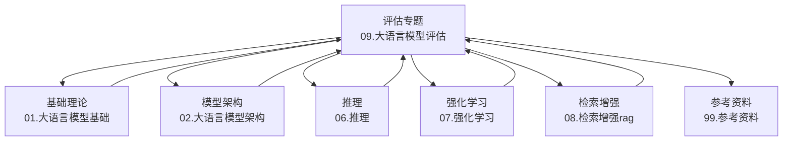
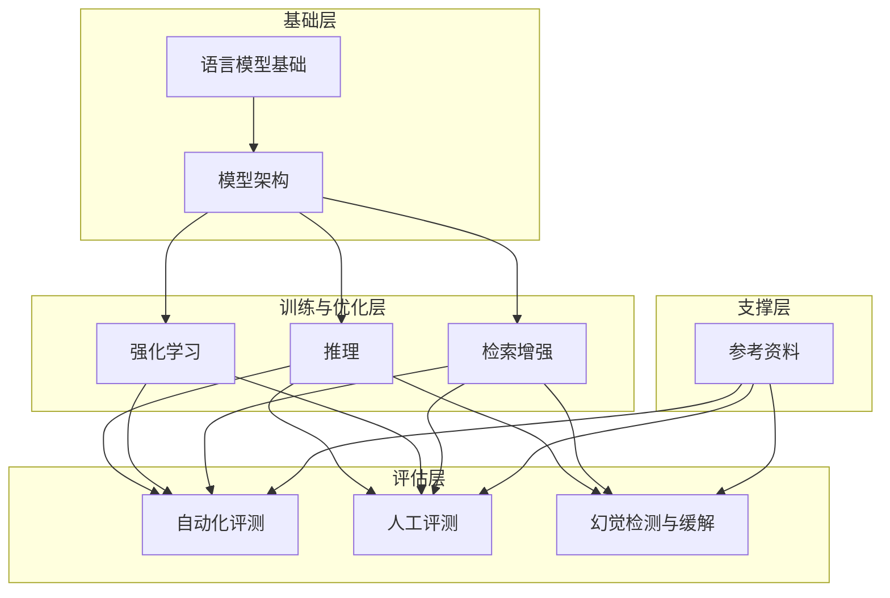
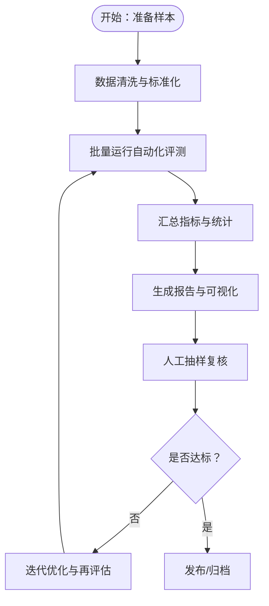
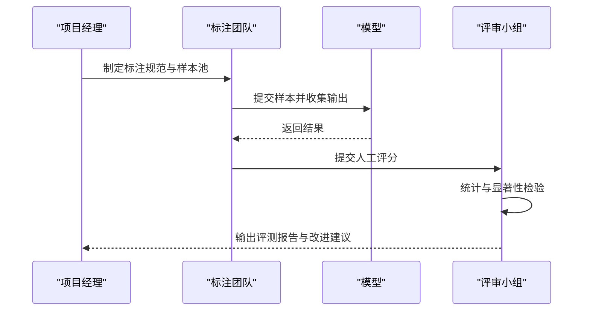
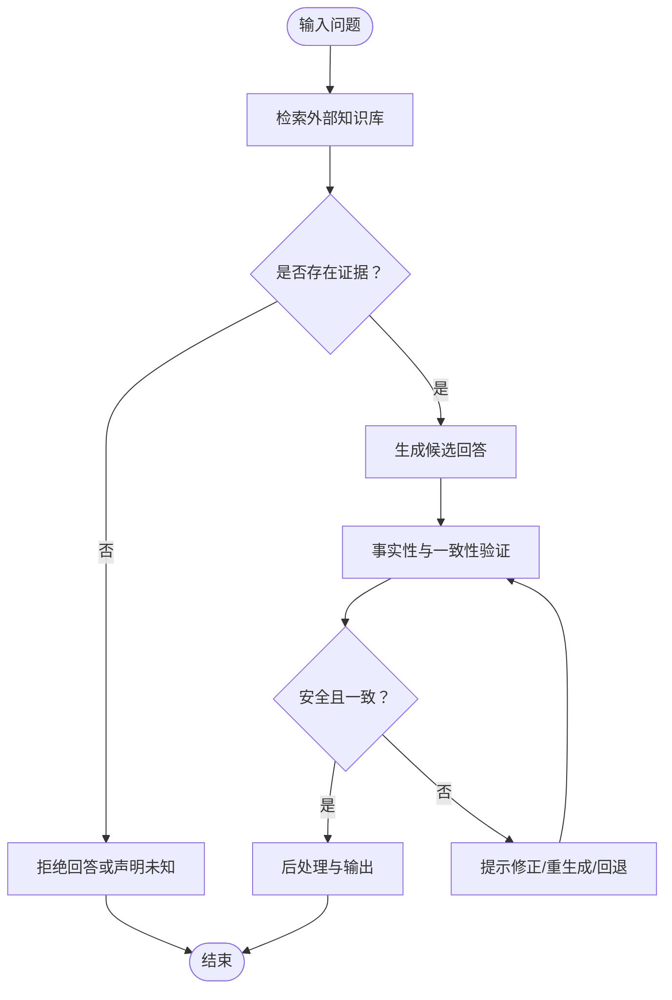
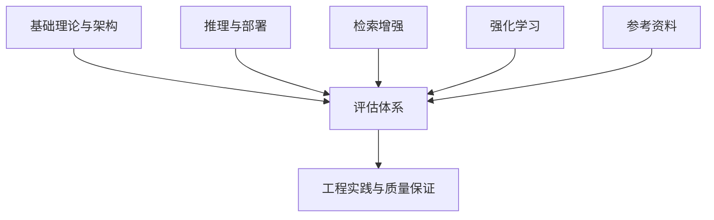
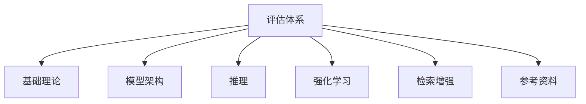

# 模型评估

<cite>
**本文引用的文件**
- [09.大语言模型评估/README.md](file://09.大语言模型评估/README.md)
- [01.大语言模型基础/README.md](file://01.大语言模型基础/README.md)
- [02.大语言模型架构/README.md](file://02.大语言模型架构/README.md)
- [06.推理/README.md](file://06.推理/README.md)
- [07.强化学习/README.md](file://07.强化学习/README.md)
- [08.检索增强rag/README.md](file://08.检索增强rag/README.md)
- [99.参考资料/README.md](file://99.参考资料/README.md)
</cite>

## 目录
1. [引言](#引言)
2. [项目结构](#项目结构)
3. [核心组件](#核心组件)
4. [架构总览](#架构总览)
5. [详细组件分析](#详细组件分析)
6. [依赖分析](#依赖分析)
7. [性能考虑](#性能考虑)
8. [故障排查指南](#故障排查指南)
9. [结论](#结论)
10. [附录](#附录)

## 引言
本文件围绕“模型评估”主题，系统梳理自动化评测指标与人工评测标准，并结合大模型幻觉的识别、检测与缓解技术，提出可落地的质量保证方法与最佳实践。文档以仓库现有资料为基础，构建从基础理论到工程实践的完整评估体系，帮助读者在真实应用场景中建立可靠的模型评估流程，确保模型的安全性与稳定性。

## 项目结构
评估相关内容主要分布在“评估”专题目录下，同时与基础理论、架构、推理、强化学习、RAG 等模块存在交叉引用。下图给出与评估相关的主要模块关系概览：

图表来源
- [09.大语言模型评估/README.md:1-12](file://09.大语言模型评估/README.md#L1-L12)
- [01.大语言模型基础/README.md](file://01.大语言模型基础/README.md)
- [02.大语言模型架构/README.md](file://02.大语言模型架构/README.md)
- [06.推理/README.md](file://06.推理/README.md)
- [07.强化学习/README.md](file://07.强化学习/README.md)
- [08.检索增强rag/README.md](file://08.检索增强rag/README.md)
- [99.参考资料/README.md](file://99.参考资料/README.md)

章节来源
- [09.大语言模型评估/README.md:1-12](file://09.大语言模型评估/README.md#L1-L12)

## 核心组件
- 自动化评测指标
  - 质量与一致性：基于预定义规则与外部知识库的准确性校验、事实一致性检查。
  - 可靠性与鲁棒性：对抗样本测试、边界条件与噪声注入评估、长文本与跨域泛化能力。
  - 效率与成本：吞吐量、延迟、资源占用与能耗评估。
  - 安全与合规：偏见检测、敏感信息泄露风险、恶意提示注入与误导性输出识别。
- 人工评测标准
  - 评分维度：正确性、完整性、可读性、安全性、可解释性、用户满意度。
  - 评测流程：样本池构建、标注规范制定、双盲或多评审机制、统计显著性检验。
  - 场景化评估：问答、摘要、对话、代码生成、多模态理解等任务类型。
- 幻觉识别、检测与缓解
  - 识别：事实性错误、虚构来源、逻辑矛盾、前后不一致。
  - 检测：基于规则/启发式、基于外部知识检索、基于置信度阈值、基于对比一致性。
  - 缓解：检索增强、后处理过滤、提示工程、重排序与校正、迭代修正与反馈闭环。

章节来源
- [09.大语言模型评估/README.md:1-12](file://09.大语言模型评估/README.md#L1-L12)

## 架构总览
下图展示评估体系在整体技术栈中的位置与交互关系，强调从基础到应用的贯通路径：

图表来源
- [09.大语言模型评估/README.md:1-12](file://09.大语言模型评估/README.md#L1-L12)
- [01.大语言模型基础/README.md](file://01.大语言模型基础/README.md)
- [02.大语言模型架构/README.md](file://02.大语言模型架构/README.md)
- [06.推理/README.md](file://06.推理/README.md)
- [07.强化学习/README.md](file://07.强化学习/README.md)
- [08.检索增强rag/README.md](file://08.检索增强rag/README.md)
- [99.参考资料/README.md](file://99.参考资料/README.md)

## 详细组件分析

### 组件一：自动化评测指标
- 设计原则
  - 可复现：统一数据集、评分脚本与评估环境。
  - 可扩展：支持新任务与新指标的增量接入。
  - 可解释：每个指标具备明确语义与阈值设定。
- 关键指标
  - 准确性：与权威答案或知识库比对的一致性得分。
  - 一致性：同一输入在不同时间/配置下的输出稳定性。
  - 鲁棒性：在噪声、对抗样本与边界输入下的表现。
  - 效率：吞吐、延迟、资源消耗与成本。
  - 安全性：敏感内容识别与拒绝策略有效性。
- 流程与工具
  - 数据准备：标准化样本格式与元数据。
  - 批量执行：并行调度与结果聚合。
  - 报告生成：可视化趋势与差异分析。
- 场景化策略
  - 问答：抽取式/生成式两种范式的差异化评估。
  - 对话：连贯性、上下文一致性、情感适配。
  - 代码：语法正确性、功能等价性、可维护性。
  - 多模态：图像/文本对齐与跨模态一致性。

图表来源
- [09.大语言模型评估/README.md:1-12](file://09.大语言模型评估/README.md#L1-L12)

章节来源
- [09.大语言模型评估/README.md:1-12](file://09.大语言模型评估/README.md#L1-L12)

### 组件二：人工评测标准
- 评分维度
  - 正确性：事实无误、逻辑自洽。
  - 完整性：覆盖关键要点、避免遗漏。
  - 可读性：语言通顺、结构清晰。
  - 安全性：不包含敏感或有害内容。
  - 可解释性：理由充分、步骤可追踪。
  - 用户满意度：通过问卷或打分收集。
- 评测流程
  - 样本池构建：覆盖多领域、多难度与多场景。
  - 标注规范：统一评分细则与争议处理机制。
  - 双盲评审：避免主观偏差，必要时引入多评审员。
  - 显著性检验：使用统计方法验证改进的显著性。
- 场景化评估
  - 问答：答案长度、引用来源、推理深度。
  - 对话：连贯性、角色一致性、情感适配。
  - 代码：正确性、可读性、健壮性。
  - 多模态：图文匹配、跨模态一致性。

图表来源
- [09.大语言模型评估/README.md:1-12](file://09.大语言模型评估/README.md#L1-L12)

章节来源
- [09.大语言模型评估/README.md:1-12](file://09.大语言模型评估/README.md#L1-L12)

### 组件三：大模型幻觉的识别、检测与缓解
- 幻觉类型
  - 事实性错误：虚构事实、编造数据或引用不存在的文献。
  - 来源混淆：将推断当作已知事实，或将不同来源混同。
  - 逻辑矛盾：前后不一致、因果倒置、概念冲突。
- 识别与检测
  - 规则与启发式：关键词触发、模式匹配、结构化约束。
  - 外部知识检索：与权威数据库/知识图谱比对。
  - 置信度与一致性：基于概率阈值与多轮一致性检查。
  - 对比与回退：与基线模型或检索结果对比。
- 缓解策略
  - 检索增强：引入外部知识，限制在证据范围内的回答。
  - 后处理过滤：基于规则或分类器剔除高风险输出。
  - 提示工程：引导模型承认不确定性、要求引用来源。
  - 迭代修正：通过人类反馈与模型自我修正形成闭环。

图表来源
- [09.大语言模型评估/README.md:1-12](file://09.大语言模型评估/README.md#L1-L12)

章节来源
- [09.大语言模型评估/README.md:1-12](file://09.大语言模型评估/README.md#L1-L12)

### 组件四：跨模块协同与质量保证
- 基础理论与架构
  - 语言模型基础与架构决定了模型能力边界，直接影响评估指标的选择与权重。
- 推理与部署
  - 推理效率与稳定性影响自动化评测的吞吐与一致性；RAG 与提示工程提升回答质量与可解释性。
- 强化学习
  - RLHF/偏好学习可改善模型行为与安全性，需纳入评测维度与回归测试。
- 资料参考
  - 统一的参考资料有助于建立一致的评测基准与术语体系。

图表来源
- [01.大语言模型基础/README.md](file://01.大语言模型基础/README.md)
- [02.大语言模型架构/README.md](file://02.大语言模型架构/README.md)
- [06.推理/README.md](file://06.推理/README.md)
- [07.强化学习/README.md](file://07.强化学习/README.md)
- [08.检索增强rag/README.md](file://08.检索增强rag/README.md)
- [99.参考资料/README.md](file://99.参考资料/README.md)

章节来源
- [01.大语言模型基础/README.md](file://01.大语言模型基础/README.md)
- [02.大语言模型架构/README.md](file://02.大语言模型架构/README.md)
- [06.推理/README.md](file://06.推理/README.md)
- [07.强化学习/README.md](file://07.强化学习/README.md)
- [08.检索增强rag/README.md](file://08.检索增强rag/README.md)
- [99.参考资料/README.md](file://99.参考资料/README.md)

## 依赖分析
- 内聚性
  - 评估体系内部指标与流程高度内聚，便于统一管理与持续演进。
- 耦合性
  - 与基础理论、架构、推理、强化学习、RAG 的耦合度较高，需保持接口稳定与版本兼容。
- 外部依赖
  - 外部知识库、权威数据源、第三方评测工具与平台，需关注可用性与一致性。
- 循环依赖
  - 当前结构未发现循环依赖，但建议在引入新的评测工具或平台时进行依赖审计。

图表来源
- [09.大语言模型评估/README.md:1-12](file://09.大语言模型评估/README.md#L1-L12)
- [01.大语言模型基础/README.md](file://01.大语言模型基础/README.md)
- [02.大语言模型架构/README.md](file://02.大语言模型架构/README.md)
- [06.推理/README.md](file://06.推理/README.md)
- [07.强化学习/README.md](file://07.强化学习/README.md)
- [08.检索增强rag/README.md](file://08.检索增强rag/README.md)
- [99.参考资料/README.md](file://99.参考资料/README.md)

章节来源
- [09.大语言模型评估/README.md:1-12](file://09.大语言模型评估/README.md#L1-L12)

## 性能考虑
- 自动化评测
  - 批量化与并行化：提高吞吐，缩短评估周期。
  - 资源隔离：独立的评测环境，避免对线上服务的影响。
  - 结果缓存与增量更新：减少重复计算。
- 人工评测
  - 样本池规模与多样性：平衡代表性与可评测性。
  - 评审员培训与一致性：通过校准样例与Kappa系数评估一致性。
- 幻觉缓解
  - 检索质量优先：高质量知识库与检索策略决定缓解效果上限。
  - 实时监控与回放：对高风险输出进行实时拦截与记录。

## 故障排查指南
- 评测结果异常
  - 检查样本格式与元数据是否一致。
  - 核对评测脚本版本与依赖环境。
  - 对比基线模型与当前模型的输出差异。
- 幻觉高发
  - 回溯检索过程与证据链，确认来源可靠性。
  - 检查提示工程与后处理策略是否生效。
  - 引入人工复核与反馈，完善规则与阈值。
- 评测流程阻塞
  - 检查外部依赖（如知识库、第三方服务）的可用性与限流策略。
  - 优化批处理大小与并发度，避免资源瓶颈。

## 结论
通过构建自动化与人工相结合的评测体系，并将幻觉识别、检测与缓解贯穿于评估全流程，可以有效提升模型在真实场景中的可靠性与安全性。建议以场景化指标为核心，结合跨模块协同与持续改进机制，逐步完善评估标准与工具链，最终实现可衡量、可追溯、可持续的质量保证体系。

## 附录
- 参考资料
  - 统一术语与基准：建立共享的知识库与评测手册。
  - 最佳实践：总结典型场景的评估策略与工具组合。
  - 版本与变更：记录评估指标与流程的演进历史。

章节来源
- [99.参考资料/README.md](file://99.参考资料/README.md)