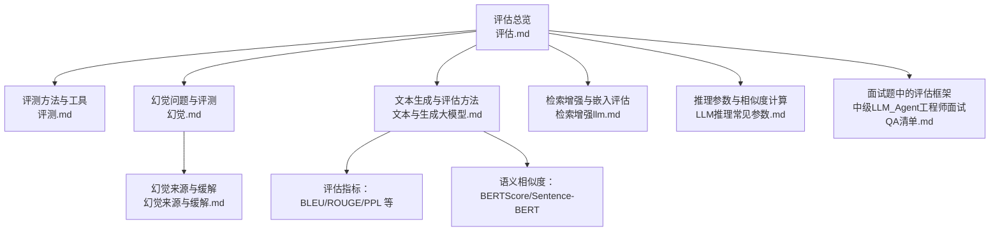
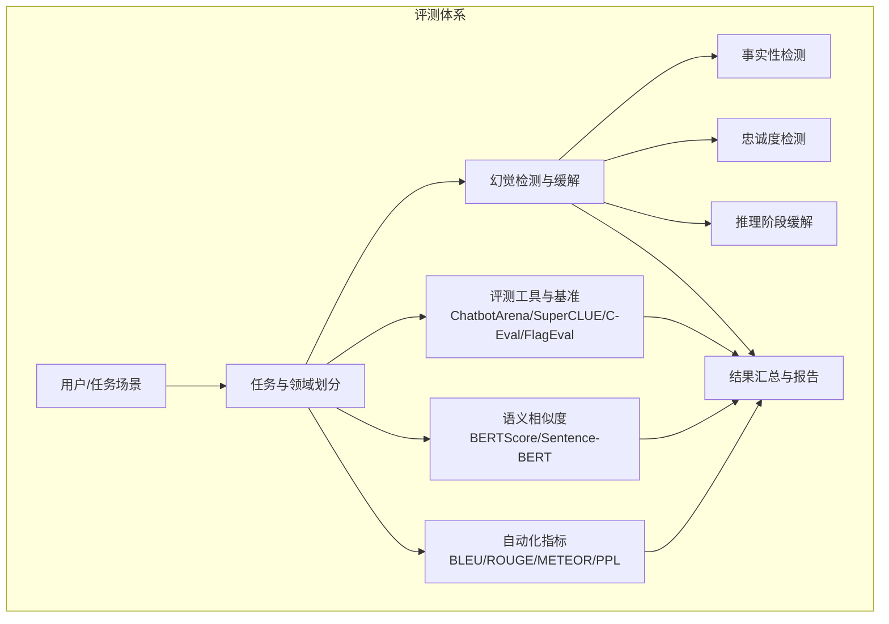
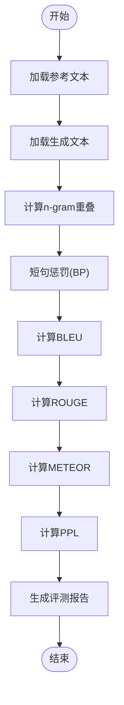
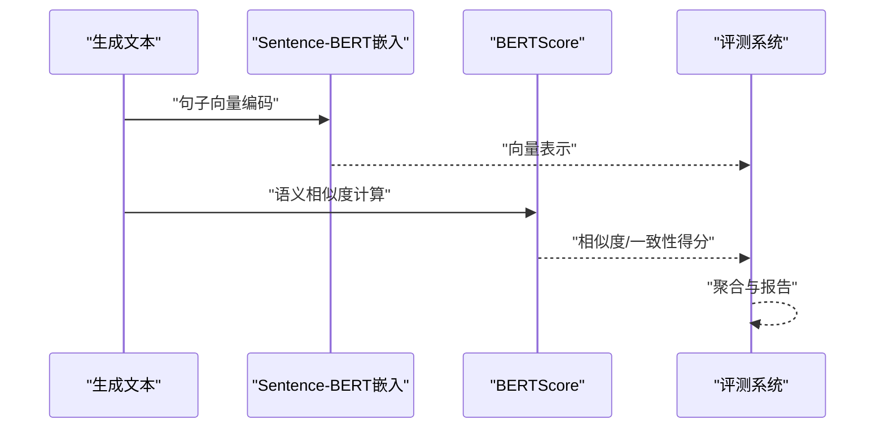
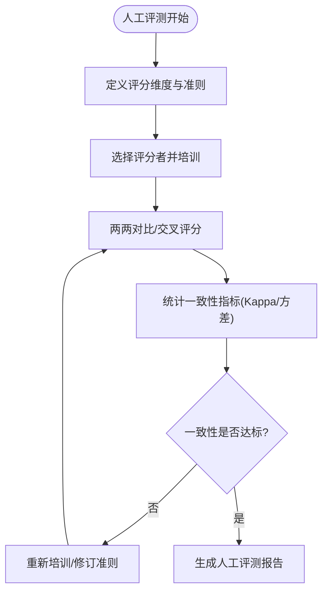
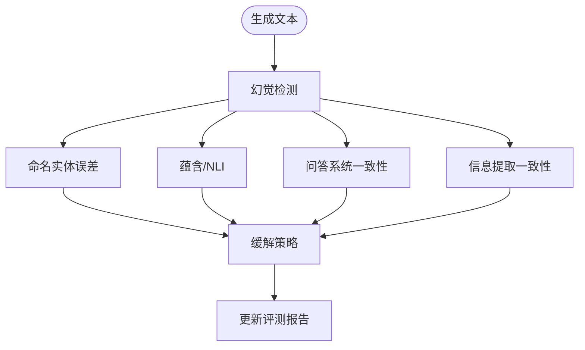
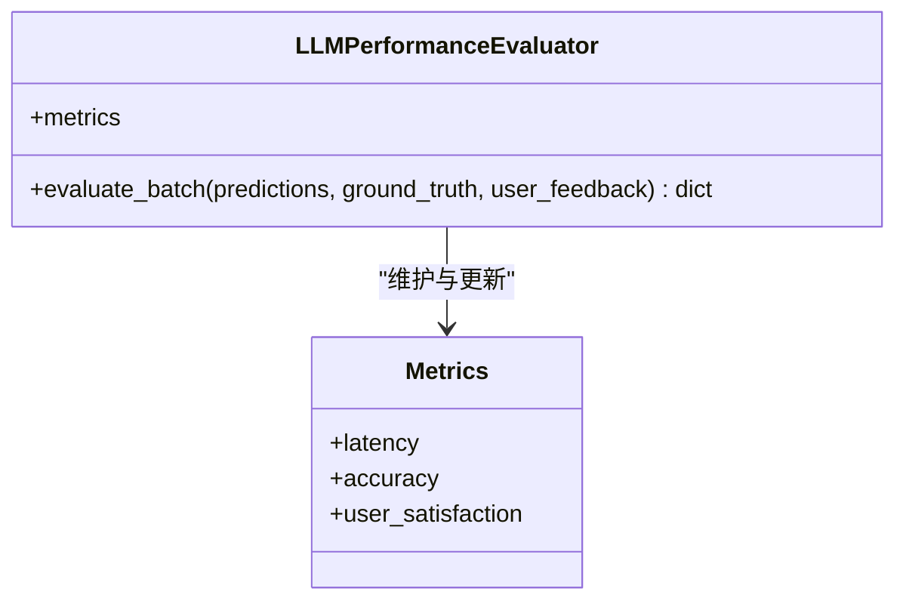
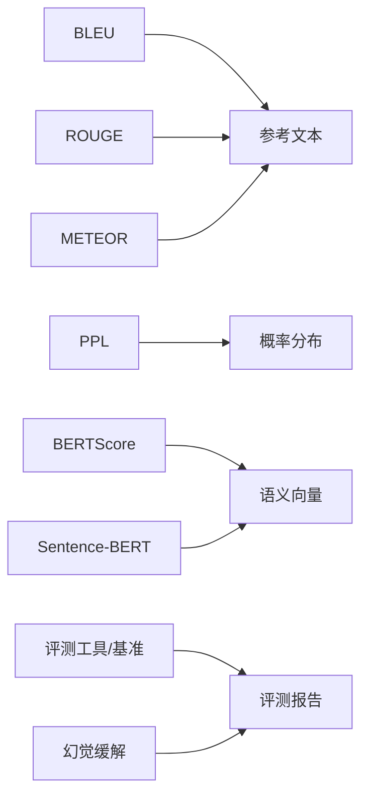

# 评测方法

<cite>
**本文引用的文件**   
- [评测.md](file://09.大语言模型评估/1.评测/1.评测.md)
- [评估.md](file://09.大语言模型评估/README.md)
- [幻觉.md](file://09.大语言模型评估/1.大模型幻觉/1.大模型幻觉.md)
- [幻觉来源与缓解.md](file://09.大语言模型评估/2.幻觉来源与缓解/2.幻觉来源与缓解.md)
- [文本与生成大模型.md](file://98.相关课程/清华大模型公开课/6.文本理解和生成大模型/6.文本理解和生成大模型.md)
- [检索增强llm.md](file://08.检索增强rag/检索增强llm/检索增强llm.md)
- [LLM推理常见参数.md](file://06.推理/LLM推理常见参数/LLM推理常见参数.md)
- [中级LLM_Agent工程师面试QA清单.md](file://ai_generataion/中级LLM_Agent工程师面试QA清单.md)
</cite>

## 目录
1. [引言](#引言)
2. [项目结构](#项目结构)
3. [核心组件](#核心组件)
4. [架构总览](#架构总览)
5. [详细组件分析](#详细组件分析)
6. [依赖分析](#依赖分析)
7. [性能考量](#性能考量)
8. [故障排查指南](#故障排查指南)
9. [结论](#结论)
10. [附录](#附录)

## 引言
本文件围绕评测方法展开，系统梳理自动化评测指标（BLEU、ROUGE、METEOR、PPL、BERTScore、Sentence-BERT 等）与人工评测标准（评分维度、评价准则、一致性检验），并结合不同应用场景（文本生成、问答系统、对话系统）给出策略选择建议。同时，结合仓库中的幻觉相关知识，说明幻觉对评测的影响与缓解手段，帮助构建全面、客观、可靠的模型评估体系。

## 项目结构
本仓库与评测相关的内容主要分布在“评估”“幻觉”“文本与生成大模型”“检索增强”“推理参数”“面试题”等章节。下图给出与评测方法相关的知识组织概览。

图表来源
- [评估.md:1-12](file://09.大语言模型评估/README.md#L1-L12)
- [评测.md:1-43](file://09.大语言模型评估/1.评测/1.评测.md#L1-L43)
- [幻觉.md:1-109](file://09.大语言模型评估/1.大模型幻觉/1.大模型幻觉.md#L1-L109)
- [幻觉来源与缓解.md:1-193](file://09.大语言模型评估/2.幻觉来源与缓解/2.幻觉来源与缓解.md#L1-L193)
- [文本与生成大模型.md:563-584](file://98.相关课程/清华大模型公开课/6.文本理解和生成大模型/6.文本理解和生成大模型.md#L563-L584)
- [检索增强llm.md:229-239](file://08.检索增强rag/检索增强llm/检索增强llm.md#L229-L239)
- [LLM推理常见参数.md:59-81](file://06.推理/LLM推理常见参数/LLM推理常见参数.md#L59-L81)
- [中级LLM_Agent工程师面试QA清单.md:248-285](file://ai_generataion/中级LLM_Agent工程师面试QA清单.md#L248-L285)

章节来源
- [评估.md:1-12](file://09.大语言模型评估/README.md#L1-L12)

## 核心组件
- 自动评测指标
  - 传统指标：BLEU、ROUGE、METEOR、PPL
  - 语义相似度：BERTScore、Sentence-BERT
- 人工评测标准
  - 评分维度、评价准则、一致性检验
- 评测工具与基准
  - ChatbotArena、SuperCLUE、C-Eval、FlagEval
- 幻觉与评测
  - 幻觉类型、检测与缓解对评测的影响
- 应用场景评测策略
  - 文本生成、问答系统、对话系统

章节来源
- [评测.md:31-43](file://09.大语言模型评估/1.评测/1.评测.md#L31-L43)
- [文本与生成大模型.md:569-583](file://98.相关课程/清华大模型公开课/6.文本理解和生成大模型/6.文本理解和生成大模型.md#L569-L583)
- [幻觉来源与缓解.md:25-65](file://09.大语言模型评估/2.幻觉来源与缓解/2.幻觉来源与缓解.md#L25-L65)

## 架构总览
下图展示评测体系的整体构成：自动化指标与人工评测双轨并行，结合幻觉检测与缓解策略，形成覆盖任务、指标、工具与场景的评估闭环。

图表来源
- [评测.md:19-43](file://09.大语言模型评估/1.评测/1.评测.md#L19-L43)
- [幻觉来源与缓解.md:25-193](file://09.大语言模型评估/2.幻觉来源与缓解/2.幻觉来源与缓解.md#L25-L193)
- [文本与生成大模型.md:569-583](file://98.相关课程/清华大模型公开课/6.文本理解和生成大模型/6.文本理解和生成大模型.md#L569-L583)

## 详细组件分析

### 自动评测指标：BLEU、ROUGE、METEOR、PPL
- BLEU
  - 评估生成文本与参考文本的n-gram重叠，结合短句惩罚因子，适合衡量生成与参考的局部相似度。
- ROUGE
  - 基于召回的指标，强调召回率，有助于缓解生成低召回率的问题。
- METEOR
  - 综合词干、同义词匹配与词序惩罚，兼顾语义与结构相似度。
- PPL（困惑度）
  - 衡量模型在测试集上的拟合度，越低表示模型对数据分布拟合越好。

图表来源
- [文本与生成大模型.md:569-583](file://98.相关课程/清华大模型公开课/6.文本理解和生成大模型/6.文本理解和生成大模型.md#L569-L583)

章节来源
- [文本与生成大模型.md:569-583](file://98.相关课程/清华大模型公开课/6.文本理解和生成大模型/6.文本理解和生成大模型.md#L569-L583)

### 语义相似度评估：BERTScore、Sentence-BERT
- BERTScore
  - 基于BERT的语义相似度，常用于检测与缓解幻觉，通过多次采样与信息一致性评估生成内容的事实性。
- Sentence-BERT（SBERT）
  - 将句子映射到语义向量空间，便于计算余弦相似度，适合检索增强与嵌入质量评估。

图表来源
- [幻觉来源与缓解.md:88-95](file://09.大语言模型评估/2.幻觉来源与缓解/2.幻觉来源与缓解.md#L88-L95)
- [检索增强llm.md:229-239](file://08.检索增强rag/检索增强llm/检索增强llm.md#L229-L239)

章节来源
- [幻觉来源与缓解.md:88-95](file://09.大语言模型评估/2.幻觉来源与缓解/2.幻觉来源与缓解.md#L88-L95)
- [检索增强llm.md:229-239](file://08.检索增强rag/检索增强llm/检索增强llm.md#L229-L239)

### 人工评测标准：评分维度、评价准则与一致性检验
- 评分维度
  - 相关性、流畅性、有用性等维度，用于人工评估生成质量。
- 评价准则
  - 明确各维度的评分标准与阈值，确保评分可操作。
- 一致性检验
  - 通过多评分者打分、Kappa系数或方差分析等方法，评估评分稳定性和可重复性。

图表来源
- [评测.md:7-11](file://09.大语言模型评估/1.评测/1.评测.md#L7-L11)

章节来源
- [评测.md:7-11](file://09.大语言模型评估/1.评测/1.评测.md#L7-L11)

### 评测工具与基准：ChatbotArena、SuperCLUE、C-Eval、FlagEval
- ChatbotArena：借鉴游戏排位机制，人类对模型两两评价，适合比较与排序。
- SuperCLUE：中文通用大模型综合性评测基准，尝试全自动测评。
- C-Eval：涵盖52个学科的选择题，评估中文能力。
- FlagEval：采用“能力—任务—指标”三维评测框架，系统化评估。

章节来源
- [评测.md:37-43](file://09.大语言模型评估/1.评测/1.评测.md#L37-L43)

### 幻觉与评测：类型、检测与缓解
- 类型
  - 内在幻觉（与源内容矛盾）、外在幻觉（无法从源内容验证）。
- 检测
  - 命名实体误差、蕴含率、基于模型的评估、问答系统、信息提取系统。
- 缓解
  - 外部知识验证、解码策略调整、多次采样一致性检查、事实核心采样、SelfCheckGPT等。

图表来源
- [幻觉.md:43-52](file://09.大语言模型评估/1.大模型幻觉/1.大模型幻觉.md#L43-L52)
- [幻觉来源与缓解.md:25-65](file://09.大语言模型评估/2.幻觉来源与缓解/2.幻觉来源与缓解.md#L25-L65)

章节来源
- [幻觉.md:43-52](file://09.大语言模型评估/1.大模型幻觉/1.大模型幻觉.md#L43-L52)
- [幻觉来源与缓解.md:25-65](file://09.大语言模型评估/2.幻觉来源与缓解/2.幻觉来源与缓解.md#L25-L65)

### 应用场景评测策略选择指南
- 文本生成
  - 优先使用BLEU/ROUGE/METEOR/PPL等通用指标；结合语义相似度（BERTScore/Sentence-BERT）评估语义一致性。
- 问答系统
  - 结合检索增强（RAG）与嵌入质量评估（MTEB榜单），使用NLI、QA一致性、实体/三元组重叠等指标。
- 对话系统
  - 关注连贯性、一致性与上下文忠实度，可采用熵、logprob、相似度等不确定性度量，结合人工评测。

章节来源
- [文本与生成大模型.md:569-583](file://98.相关课程/清华大模型公开课/6.文本理解和生成大模型/6.文本理解和生成大模型.md#L569-L583)
- [检索增强llm.md:229-239](file://08.检索增强rag/检索增强llm/检索增强llm.md#L229-L239)
- [幻觉来源与缓解.md:47-65](file://09.大语言模型评估/2.幻觉来源与缓解/2.幻觉来源与缓解.md#L47-L65)

### 实际案例：构建全面的模型评估体系
- 案例要点
  - 自动化指标：准确率、召回率、F1分数（特定任务）；ROUGE、BLEU、METEOR（文本生成质量）；延迟、吞吐量、错误率（系统性能）。
  - 人工评估：相关性、流畅性、有用性评分；A/B测试与用户满意度调查。
  - 业务指标：用户留存率、任务完成率、客服工单减少量、转化率提升。
- 评估框架
  - 建议采用批处理评估，结合自动化指标与人工反馈，形成闭环。

图表来源
- [中级LLM_Agent工程师面试QA清单.md:262-285](file://ai_generataion/中级LLM_Agent工程师面试QA清单.md#L262-L285)

章节来源
- [中级LLM_Agent工程师面试QA清单.md:248-285](file://ai_generataion/中级LLM_Agent工程师面试QA清单.md#L248-L285)

## 依赖分析
- 指标依赖
  - BLEU/ROUGE/METEOR依赖参考文本与生成文本；PPL依赖模型概率分布；BERTScore/Sentence-BERT依赖语义向量。
- 工具与基准
  - ChatbotArena、SuperCLUE、C-Eval、FlagEval提供标准化评测入口与报告格式。
- 幻觉缓解对评测的影响
  - 幻觉检测与缓解策略会影响评测结果的稳定性与可靠性，需纳入评测流程。

图表来源
- [文本与生成大模型.md:569-583](file://98.相关课程/清华大模型公开课/6.文本理解和生成大模型/6.文本理解和生成大模型.md#L569-L583)
- [检索增强llm.md:229-239](file://08.检索增强rag/检索增强llm/检索增强llm.md#L229-L239)
- [评测.md:37-43](file://09.大语言模型评估/1.评测/1.评测.md#L37-L43)
- [幻觉来源与缓解.md:88-95](file://09.大语言模型评估/2.幻觉来源与缓解/2.幻觉来源与缓解.md#L88-L95)

## 性能考量
- 指标选择
  - 根据任务特性选择合适指标组合，避免单一指标误导。
- 评测成本
  - 自动化指标快速高效，人工评测成本高但更深入；应结合两者。
- 幻觉影响
  - 幻觉会显著影响评测稳定性，需在评测流程中加入检测与缓解步骤。

## 故障排查指南
- 指标异常
  - 检查参考文本与生成文本格式、长度与预处理一致性；确认n-gram窗口与惩罚因子设置。
- 语义相似度偏差
  - 检查嵌入模型质量与任务适配性；必要时在下游数据上微调嵌入。
- 人工评测不一致
  - 通过Kappa系数或方差分析评估一致性；重新培训评分者或修订评分准则。
- 幻觉问题
  - 使用外部知识验证、解码策略调整、多次采样一致性检查等方法；结合NLI与QA一致性评估。

章节来源
- [幻觉来源与缓解.md:173-193](file://09.大语言模型评估/2.幻觉来源与缓解/2.幻觉来源与缓解.md#L173-L193)
- [LLM推理常见参数.md:59-81](file://06.推理/LLM推理常见参数/LLM推理常见参数.md#L59-L81)

## 结论
评测方法应坚持自动化与人工评测并重，结合任务场景选择恰当指标与工具，并将幻觉检测与缓解纳入评测流程。通过统一的评估框架与持续的优化，确保评测结果的客观性与可靠性，为模型迭代与应用落地提供坚实支撑。

## 附录
- 任务与领域划分
  - 自然语言处理、鲁棒性与伦理、医学应用、社会科学、自然科学与工程、代理应用、其他应用。
- 评测方法分类
  - 直接评估指标、间接/分解启发式、基于模型的评估。

章节来源
- [评测.md:19-36](file://09.大语言模型评估/1.评测/1.评测.md#L19-L36)