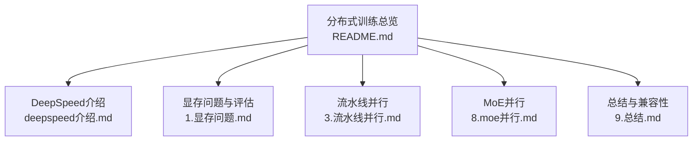
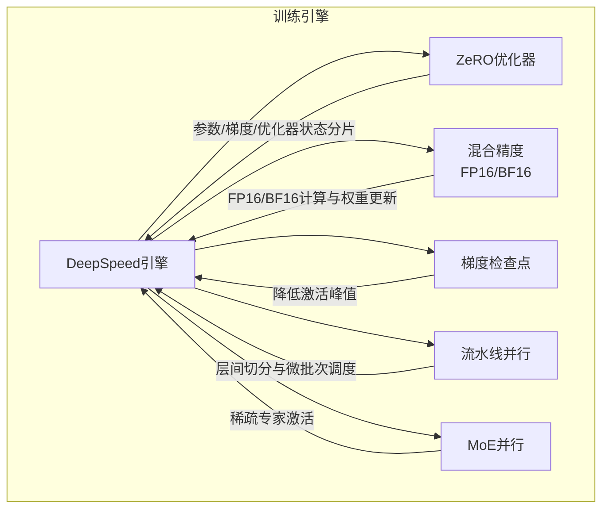
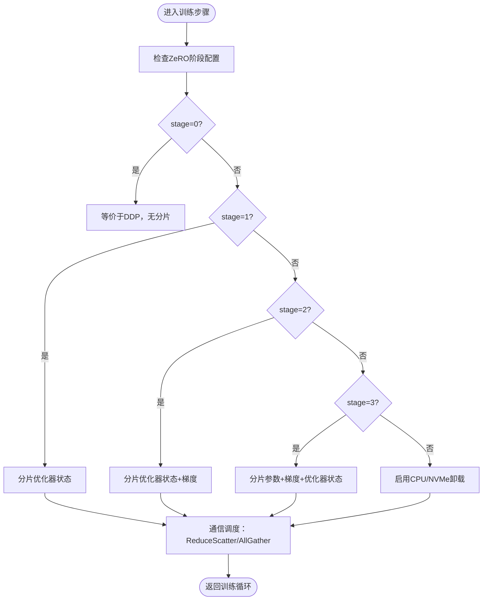
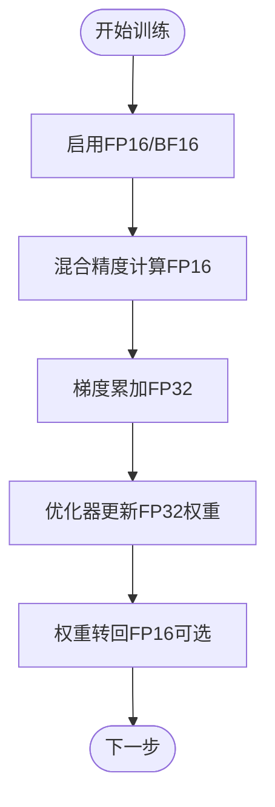
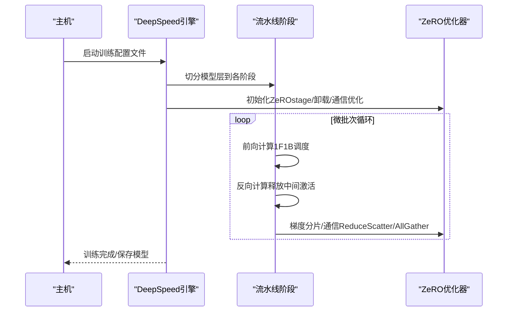
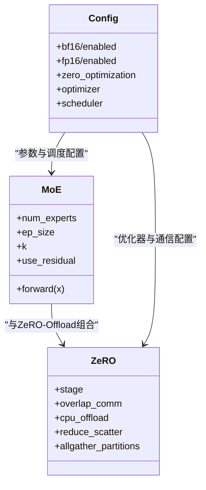

# DeepSpeed框架

<cite>
**本文引用的文件**
- [deepspeed介绍.md](file://04.分布式训练/deepspeed介绍/deepspeed介绍.md)
- [1.显存问题.md](file://04.分布式训练/1.显存问题/1.显存问题.md)
- [8.moe并行.md](file://04.分布式训练/8.moe并行/8.moe并行.md)
- [3.流水线并行.md](file://04.分布式训练/3.流水线并行/3.流水线并行.md)
- [9.总结.md](file://04.分布式训练/9.总结/9.总结.md)
- [README.md](file://04.分布式训练/README.md)
</cite>

## 目录
1. [引言](#引言)
2. [项目结构](#项目结构)
3. [核心组件](#核心组件)
4. [架构概览](#架构概览)
5. [详细组件分析](#详细组件分析)
6. [依赖分析](#依赖分析)
7. [性能考虑](#性能考虑)
8. [故障排查指南](#故障排查指南)
9. [结论](#结论)
10. [附录](#附录)

## 引言
本文件面向希望系统掌握DeepSpeed框架的读者，围绕以下目标展开：深入解释ZeRO优化器（含三个阶段：ZeRO-1、ZeRO-2、ZeRO-3）在内存优化方面的贡献；阐述混合精度训练（FP16/BF16）与梯度检查点（Activation Checkpointing）在显存与吞吐上的协同作用；梳理DeepSpeed在流水线并行（PP）中的调度策略与兼容性；给出安装配置、配置文件格式与关键参数设置的实践指南；并通过真实训练示例展示在不同规模模型上的应用路径与调优要点。

## 项目结构
本仓库中与DeepSpeed相关的内容主要集中在“分布式训练”章节，涵盖基础并行理念、流水线并行、MoE并行、显存瓶颈与评估方法，以及DeepSpeed的使用与配置示例。下图给出与DeepSpeed相关内容的组织关系。

图表来源
- [README.md:1-45](file://04.分布式训练/README.md#L1-L45)
- [deepspeed介绍.md:1-765](file://04.分布式训练/deepspeed介绍/deepspeed介绍.md#L1-L765)
- [1.显存问题.md:1-127](file://04.分布式训练/1.显存问题/1.显存问题.md#L1-L127)
- [3.流水线并行.md:1-264](file://04.分布式训练/3.流水线并行/3.流水线并行.md#L1-L264)
- [8.moe并行.md:1-317](file://04.分布式训练/8.moe并行/8.moe并行.md#L1-L317)
- [9.总结.md:1-125](file://04.分布式训练/9.总结/9.总结.md#L1-L125)

章节来源
- [README.md:1-45](file://04.分布式训练/README.md#L1-L45)

## 核心组件
- ZeRO优化器（Zero Redundancy Optimizer）
  - 通过在数据并行进程中划分模型状态（参数、梯度、优化器状态），消除冗余，实现内存线性扩展。
  - 阶段划分：ZeRO-0（禁用分片）、ZeRO-1（分片优化器状态）、ZeRO-2（分片优化器状态与梯度）、ZeRO-3（分片参数、梯度、优化器状态）。
  - 支持卸载（Offload）与通信重叠（Overlap Comm）等优化开关。
- 混合精度训练（FP16/BF16）
  - 通过在配置中启用fp16或bf16，降低模型状态与梯度的显存占用，配合动态损失缩放与优化器FP32权重更新，保障数值稳定。
- 梯度检查点（Activation Checkpointing）
  - 以重计算换取显存，显著降低激活峰值，常与ZeRO、流水线并行配合使用。
- 流水线并行（Pipeline Parallelism）
  - 将模型层切分到不同设备，通过微批次与1F1B/非交错调度策略平衡吞吐与显存。
- MoE并行
  - 通过专家（expert）与门（gate）机制实现稀疏激活，结合DeepSpeed的MoE层与ZeRO-Offload，支持更大规模MoE模型训练。

章节来源
- [deepspeed介绍.md:71-127](file://04.分布式训练/deepspeed介绍/deepspeed介绍.md#L71-L127)
- [deepspeed介绍.md:295-410](file://04.分布式训练/deepspeed介绍/deepspeed介绍.md#L295-L410)
- [3.流水线并行.md:132-251](file://04.分布式训练/3.流水线并行/3.流水线并行.md#L132-L251)
- [8.moe并行.md:182-312](file://04.分布式训练/8.moe并行/8.moe并行.md#L182-L312)
- [9.总结.md:95-101](file://04.分布式训练/9.总结/9.总结.md#L95-L101)

## 架构概览
下图展示DeepSpeed在训练流水线中的关键模块与交互：ZeRO优化器、混合精度、梯度检查点、流水线并行与MoE并行的协同关系。

图表来源
- [deepspeed介绍.md:71-127](file://04.分布式训练/deepspeed介绍/deepspeed介绍.md#L71-L127)
- [3.流水线并行.md:132-251](file://04.分布式训练/3.流水线并行/3.流水线并行.md#L132-L251)
- [8.moe并行.md:182-312](file://04.分布式训练/8.moe并行/8.moe并行.md#L182-L312)

## 详细组件分析

### ZeRO优化器（内存优化与通信权衡）
- 阶段划分与内存收益
  - ZeRO-1：分片优化器状态，内存减少约4倍，通信量与数据并行相当。
  - ZeRO-2：在ZeRO-1基础上分片梯度，进一步降低内存，通信量仍与数据并行相当。
  - ZeRO-3：在ZeRO-2基础上分片参数，内存与并行度线性相关，适合超大规模模型。
  - ZeRO-Offload与ZeRO-Infinity：将优化器状态与参数卸载到CPU/NVMe，进一步扩大模型规模。
- 通信与吞吐
  - 在使用Pos（优化器状态分片）与Pg（梯度分片）时，通信量不显著增加；当叠加Pp（参数分片）时，通信量增加约1.5倍，但内存收益显著。
- 配置要点
  - 通过配置文件设置zero_optimization.stage与offload_optimizer/offload_param等参数，结合overlap_comm、contiguous_gradients、bucket大小等优化项，平衡通信与计算。

图表来源
- [deepspeed介绍.md:90-105](file://04.分布式训练/deepspeed介绍/deepspeed介绍.md#L90-L105)
- [deepspeed介绍.md:211-235](file://04.分布式训练/deepspeed介绍/deepspeed介绍.md#L211-L235)

章节来源
- [deepspeed介绍.md:90-105](file://04.分布式训练/deepspeed介绍/deepspeed介绍.md#L90-L105)
- [deepspeed介绍.md:211-235](file://04.分布式训练/deepspeed介绍/deepspeed介绍.md#L211-L235)
- [9.总结.md:95-101](file://04.分布式训练/9.总结/9.总结.md#L95-L101)

### 混合精度训练（FP16/BF16）
- FP16
  - 以半精度存储与计算降低显存占用，配合动态损失缩放与优化器FP32权重更新，提升稳定性。
- BF16
  - 与FP16相比具有更宽的动态范围，适合更大模型训练；在部分平台（如特定GPU）不被支持。
- 配置要点
  - 在配置文件中启用fp16或bf16，并设置损失缩放窗口、初始缩放幂等参数；在训练脚本中可通过Trainer参数覆盖。

图表来源
- [deepspeed介绍.md:106-127](file://04.分布式训练/deepspeed介绍/deepspeed介绍.md#L106-L127)
- [deepspeed介绍.md:295-349](file://04.分布式训练/deepspeed介绍/deepspeed介绍.md#L295-L349)
- [deepspeed介绍.md:361-410](file://04.分布式训练/deepspeed介绍/deepspeed介绍.md#L361-L410)

章节来源
- [deepspeed介绍.md:106-127](file://04.分布式训练/deepspeed介绍/deepspeed介绍.md#L106-L127)
- [deepspeed介绍.md:295-410](file://04.分布式训练/deepspeed介绍/deepspeed介绍.md#L295-L410)

### 梯度检查点（Activation Checkpointing）
- 原理
  - 以重计算换取显存，仅保存部分中间激活，反向时按需重建，显著降低峰值显存。
- 配置要点
  - 在配置文件中开启activation_checkpointing，并设置partition_activations与contiguous_memory_optimization等参数，与ZeRO、流水线并行协同使用效果更佳。

章节来源
- [deepspeed介绍.md:594-599](file://04.分布式训练/deepspeed介绍/deepspeed介绍.md#L594-L599)
- [1.显存问题.md:62-66](file://04.分布式训练/1.显存问题/1.显存问题.md#L62-L66)

### 流水线并行（Pipeline Parallelism）
- 策略与调度
  - F-then-B：先前向后反向，易导致显存峰值高。
  - 1F1B：前向与反向交叉，尽早释放中间激活，显著降低显存峰值。
  - 非交错式与交错式调度：交错式通过虚拟流水线阶段进一步降低空泡，但增加通信。
- 与ZeRO兼容性
  - 与ZeRO-2/3组合可能不兼容，建议与ZeRO-1组合；在多机多卡且通信受限场景，优先考虑ZeRO-1+PP或ZeRO-3替代方案。

图表来源
- [3.流水线并行.md:132-251](file://04.分布式训练/3.流水线并行/3.流水线并行.md#L132-L251)
- [9.总结.md:95-101](file://04.分布式训练/9.总结/9.总结.md#L95-L101)

章节来源
- [3.流水线并行.md:132-251](file://04.分布式训练/3.流水线并行/3.流水线并行.md#L132-L251)
- [9.总结.md:95-101](file://04.分布式训练/9.总结/9.总结.md#L95-L101)

### MoE并行（专家并行）
- 结构与路由
  - 门（gate）网络选择少量专家（Top-k）进行计算，实现稀疏激活与高效训练。
- DeepSpeed支持
  - 提供MoE层封装与参数分组工具，可与ZeRO-Offload组合，支持CPU卸载与通信优化。
- 配置要点
  - 在配置文件中启用bf16/fp16、zero_optimization（stage、overlap_comm、cpu_offload等），并使用split_params_into_different_moe_groups_for_optimizer进行参数分组。

图表来源
- [8.moe并行.md:182-312](file://04.分布式训练/8.moe并行/8.moe并行.md#L182-L312)

章节来源
- [8.moe并行.md:182-312](file://04.分布式训练/8.moe并行/8.moe并行.md#L182-L312)

## 依赖分析
- 模块耦合
  - ZeRO与混合精度、梯度检查点存在强耦合：ZeRO-3显著降低参数/梯度/优化器状态显存，混合精度进一步压缩模型状态，梯度检查点降低激活峰值，三者协同可支撑更大模型。
  - 流水线并行与ZeRO-1可组合；与ZeRO-2/3组合需谨慎，建议在通信受限场景优先考虑ZeRO-3替代方案。
  - MoE并行与ZeRO-Offload组合，可将专家参数与优化器状态卸载到CPU，扩大专家规模。
- 外部依赖
  - 通信库：NCCL（GPU）、MPI/Gloo（CPU集群）。
  - 训练框架：HuggingFace Transformers（Trainer集成DeepSpeed）。

章节来源
- [deepspeed介绍.md:42-51](file://04.分布式训练/deepspeed介绍/deepspeed介绍.md#L42-L51)
- [9.总结.md:95-101](file://04.分布式训练/9.总结/9.总结.md#L95-L101)

## 性能考虑
- 显存优化
  - 优先启用ZeRO-1或ZeRO-3；在ZeRO-3基础上结合bf16/fp16与梯度检查点，可显著降低峰值显存。
  - 使用overlap_comm与contiguous_gradients减少通信与内存碎片。
- 吞吐与通信
  - 在节点内具备NVLink/NVSwitch时，ZeRO、PP、TP可并行使用；无高速互联时，优先考虑ZeRO-1+PP或ZeRO-3替代方案。
- 训练稳定性
  - 混合精度需配合动态损失缩放与梯度裁剪；BF16在部分平台不被支持，需确认硬件兼容性。
- 评估指标
  - 使用flops_profiler与ds_report评估GPU利用率与环境配置；结合吞吐量估算与实际观测对比。

章节来源
- [1.显存问题.md:70-114](file://04.分布式训练/1.显存问题/1.显存问题.md#L70-L114)
- [9.总结.md:86-101](file://04.分布式训练/9.总结/9.总结.md#L86-L101)

## 故障排查指南
- 环境与工具
  - 使用ds_report检查DeepSpeed环境配置是否正确。
  - 使用iftop监控多机通信带宽，nvidia-smi topo查看NVLink拓扑。
- 常见问题
  - ZeRO-2与流水线并行不兼容：建议改用ZeRO-1+PP或ZeRO-3。
  - BF16不被支持：切换fp16或确认硬件平台。
  - 显存不足：启用ZeRO-3、梯度检查点与bf16/fp16；检查是否有内存碎片。
- 性能诊断
  - 通过flops_profiler输出文件定位热点模块；结合日志与评估指标判断瓶颈。

章节来源
- [1.显存问题.md:116-127](file://04.分布式训练/1.显存问题/1.显存问题.md#L116-L127)
- [9.总结.md:95-101](file://04.分布式训练/9.总结/9.总结.md#L95-L101)

## 结论
DeepSpeed通过ZeRO优化器、混合精度、梯度检查点、流水线并行与MoE并行，形成一套可扩展的大模型训练体系。实践中应根据硬件条件与模型规模选择合适的组合策略：在单机多卡优先考虑ZeRO-1+PP或ZeRO-3；在多机多卡且通信受限时优先ZeRO-3；在MoE场景结合ZeRO-Offload与bf16/fp16。通过合理的配置与调优，可在保证稳定性的同时最大化吞吐与显存效率。

## 附录

### 安装与环境准备
- 安装DeepSpeed
  - 使用pip安装DeepSpeed。
- 环境检查
  - 使用ds_report检查DeepSpeed环境配置。
- 通信库
  - GPU集群使用NCCL；CPU集群可选MPI/Gloo。

章节来源
- [deepspeed介绍.md:240-245](file://04.分布式训练/deepspeed介绍/deepspeed介绍.md#L240-L245)
- [deepspeed介绍.md:251-280](file://04.分布式训练/deepspeed介绍/deepspeed介绍.md#L251-L280)
- [deepspeed介绍.md:42-51](file://04.分布式训练/deepspeed介绍/deepspeed介绍.md#L42-L51)

### 配置文件格式与关键参数
- 混合精度
  - fp16.enabled或bf16.enabled；loss_scale、loss_scale_window、initial_scale_power等。
- 优化器与调度
  - optimizer.type与params（如AdamW、学习率、权重衰减）；scheduler.type与warmup参数。
- ZeRO优化器
  - zero_optimization.stage；offload_optimizer/offload_param（device、pin_memory）；overlap_comm、contiguous_gradients、bucket大小等。
- 梯度检查点
  - activation_checkpointing.partition_activations、contiguous_memory_optimization。
- MoE并行
  - bf16/fp16、zero_optimization（stage、overlap_comm、cpu_offload）、optimizer/scheduler等。

章节来源
- [deepspeed介绍.md:295-410](file://04.分布式训练/deepspeed介绍/deepspeed介绍.md#L295-L410)
- [8.moe并行.md:258-312](file://04.分布式训练/8.moe并行/8.moe并行.md#L258-L312)

### 使用示例（路径指引）
- 使用命令行运行训练脚本（单机/多机）
  - 单机：deepspeed --num_gpus=N train.py
  - 多机：deepspeed --hostfile=hostfile --master_port=PORT --include="..." run.py --deepspeed ds_config.json
- HuggingFace Trainer集成
  - 在TrainingArguments中设置deepspeed=ds_config.json；在训练脚本中创建Trainer并调用trainer.train()。
- Bloom LoRA微调示例
  - 配置文件：zero_optimization.stage=2，启用fp16与activation_checkpointing；训练脚本：使用Trainer与LoRA配置。

章节来源
- [deepspeed介绍.md:266-290](file://04.分布式训练/deepspeed介绍/deepspeed介绍.md#L266-L290)
- [deepspeed介绍.md:351-556](file://04.分布式训练/deepspeed介绍/deepspeed介绍.md#L351-L556)
- [deepspeed介绍.md:560-762](file://04.分布式训练/deepspeed介绍/deepspeed介绍.md#L560-L762)