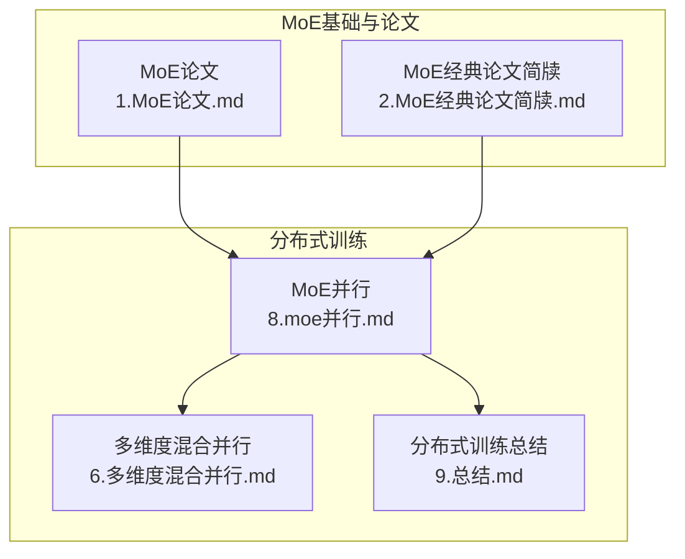
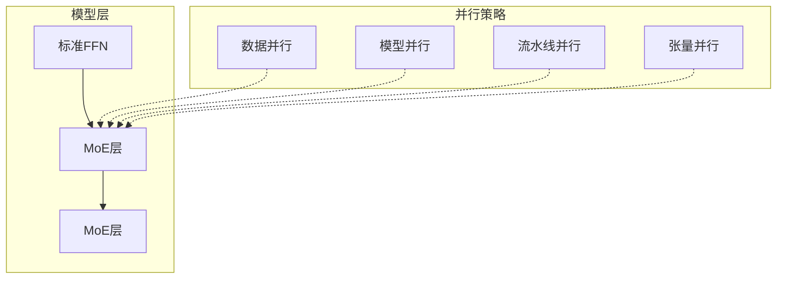
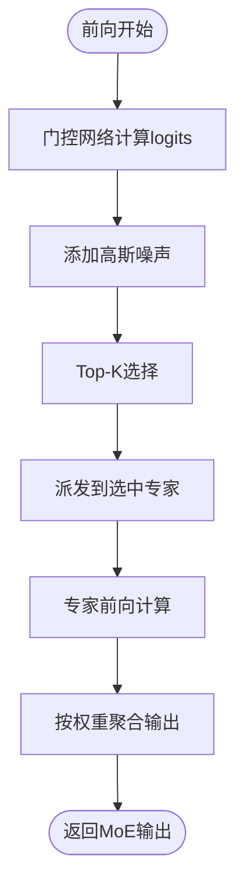
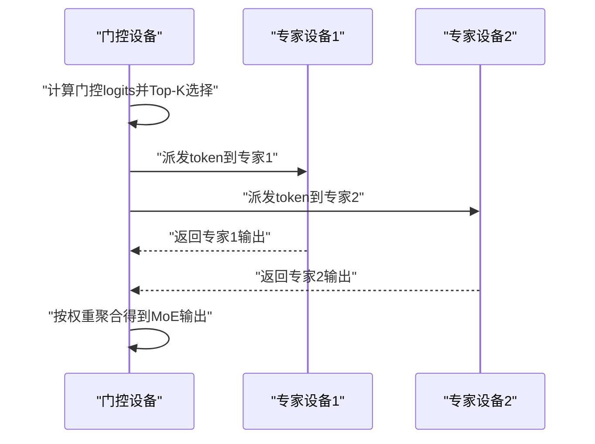
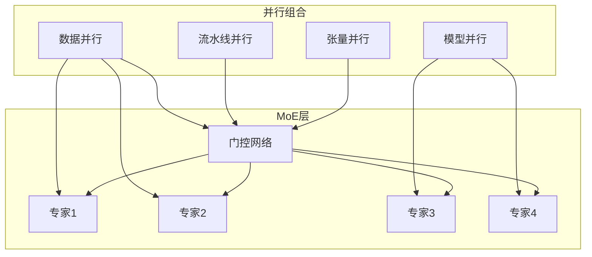
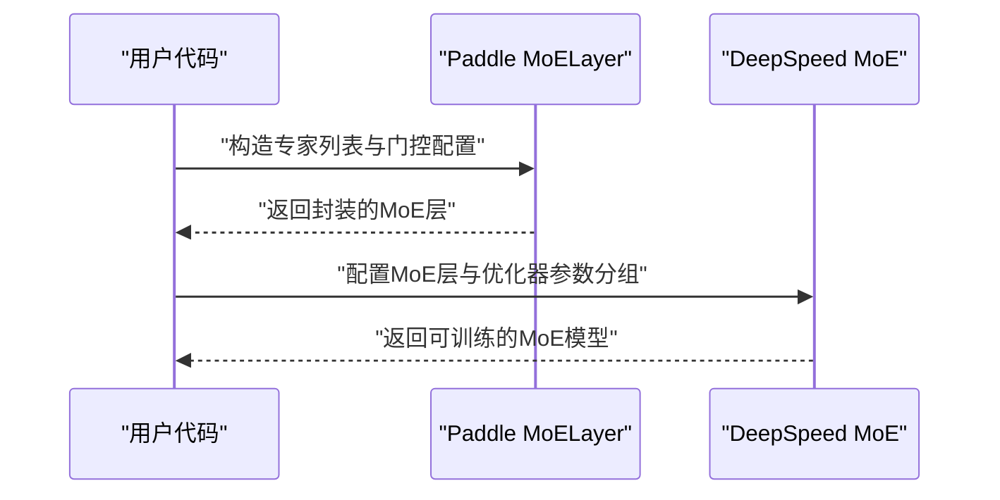
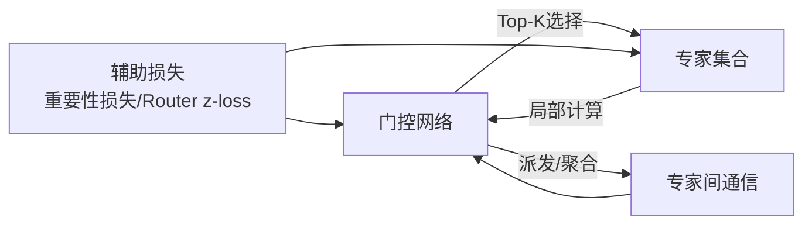

# MoE并行

<cite>
**本文引用的文件**
- [MoE论文.md](file://02.大语言模型架构/1.MoE论文/1.MoE论文.md)
- [MoE经典论文简牍.md](file://02.大语言模型架构/2.MoE经典论文简牍/2.MoE经典论文简牍.md)
- [MoE并行.md](file://04.分布式训练/8.moe并行/8.moe并行.md)
- [多维度混合并行.md](file://04.分布式训练/6.多维度混合并行/6.多维度混合并行.md)
- [分布式训练总结.md](file://04.分布式训练/9.总结/9.总结.md)
</cite>

## 目录
1. [引言](#引言)
2. [项目结构](#项目结构)
3. [核心组件](#核心组件)
4. [架构总览](#架构总览)
5. [详细组件分析](#详细组件分析)
6. [依赖分析](#依赖分析)
7. [性能考量](#性能考量)
8. [故障排查指南](#故障排查指南)
9. [结论](#结论)
10. [附录](#附录)

## 引言
本文件围绕Mixture-of-Experts（MoE）并行技术，系统阐述其在超大规模模型训练中的关键挑战与工程化策略。MoE通过“门控路由”在专家集合中稀疏激活部分专家，从而在几乎不牺牲计算效率的前提下显著提升模型容量。本文聚焦以下主题：
- 并行挑战：专家数量众多、路由机制复杂、负载分布不均
- 并行策略：专家级、专家内部、专家间并行的协同
- 特有通信模式：专家选择、门控路由与专家间数据传输
- 实现指南：专家分片、路由优化、负载均衡
- 性能瓶颈与优化：稀疏激活、专家容量管理、通信优化
- 工程实践：结合业界方案（GShard、Switch-Transformer、GLaM）与训练框架（PaddlePaddle、DeepSpeed）

## 项目结构
本仓库与MoE并行相关的知识主要分布在“大语言模型架构”和“分布式训练”两大板块：
- MoE基础与论文综述：涵盖MoE层结构、门控机制、层次化MoE、负载均衡与训练稳定性
- 分布式训练：涵盖MoE并行策略、与数据并行/模型并行/流水线并行的组合、业界实现与训练框架集成

**图表来源**
- [MoE论文.md:1-238](file://02.大语言模型架构/1.MoE论文/1.MoE论文.md#L1-L238)
- [MoE经典论文简牍.md:1-359](file://02.大语言模型架构/2.MoE经典论文简牍/2.MoE经典论文简牍.md#L1-L359)
- [MoE并行.md:1-317](file://04.分布式训练/8.moe并行/8.moe并行.md#L1-L317)
- [多维度混合并行.md:1-109](file://04.分布式训练/6.多维度混合并行/6.多维度混合并行.md#L1-L109)
- [分布式训练总结.md:1-125](file://04.分布式训练/9.总结/9.总结.md#L1-L125)

**章节来源**
- [MoE论文.md:1-238](file://02.大语言模型架构/1.MoE论文/1.MoE论文.md#L1-L238)
- [MoE经典论文简牍.md:1-359](file://02.大语言模型架构/2.MoE经典论文简牍/2.MoE经典论文简牍.md#L1-L359)
- [MoE并行.md:1-317](file://04.分布式训练/8.moe并行/8.moe并行.md#L1-L317)
- [多维度混合并行.md:1-109](file://04.分布式训练/6.多维度混合并行/6.多维度混合并行.md#L1-L109)
- [分布式训练总结.md:1-125](file://04.分布式训练/9.总结/9.总结.md#L1-L125)

## 核心组件
- MoE层与门控网络
  - MoE层由n个专家网络与一个可训练门控网络构成，输出为门控权重与专家输出的加权和
  - 门控网络常采用Softmax Top-K策略，结合噪声以促进负载均衡
- 专家分片与容量
  - 专家容量（Expert Capacity）定义单个专家可处理的token上限，避免溢出与内存压力
  - 通过容量平衡与局部分组派发（Local group dispatching）提升并行效率
- 路由与负载均衡
  - 引入重要性损失（Importance Loss）与Router z-loss等辅助损失，稳定训练并缓解“赢者通吃”
- 并行范式
  - 数据并行+MoE：门控与专家复制，适合中小规模专家
  - 模型并行+MoE：专家跨设备分片，引入专家间通信
  - 多维混合并行：与流水线并行、张量并行协同

**章节来源**
- [MoE论文.md:78-144](file://02.大语言模型架构/1.MoE论文/1.MoE论文.md#L78-L144)
- [MoE并行.md:25-50](file://04.分布式训练/8.moe并行/8.moe并行.md#L25-L50)
- [MoE经典论文简牍.md:132-187](file://02.大语言模型架构/2.MoE经典论文简牍/2.MoE经典论文简牍.md#L132-L187)

## 架构总览
下图展示MoE层在Transformer中的典型位置与并行组织方式，以及与数据/模型并行的组合关系。

**图表来源**
- [MoE并行.md:29-49](file://04.分布式训练/8.moe并行/8.moe并行.md#L29-L49)
- [多维度混合并行.md:17-37](file://04.分布式训练/6.多维度混合并行/6.多维度混合并行.md#L17-L37)

## 详细组件分析

### 组件A：MoE层与门控路由
- 结构要点
  - MoE层：n个专家网络 + 门控网络G(x)
  - 输出：对每个样本，仅Top-K专家参与计算并加权求和
  - 门控：Softmax + KeepTopK + 高斯噪声，兼顾稀疏性与负载均衡
- 路由通信
  - 门控计算在每个设备上进行
  - 专家间通信用于派发（Dispatch）与聚合（Combine）
- 负载均衡
  - 重要性损失：鼓励各专家被使用次数接近
  - Router z-loss：抑制logits过大，稳定训练

**图表来源**
- [MoE论文.md:115-143](file://02.大语言模型架构/1.MoE论文/1.MoE论文.md#L115-L143)
- [MoE经典论文简牍.md:300-313](file://02.大语言模型架构/2.MoE经典论文简牍/2.MoE经典论文简牍.md#L300-L313)

**章节来源**
- [MoE论文.md:78-144](file://02.大语言模型架构/1.MoE论文/1.MoE论文.md#L78-L144)
- [MoE经典论文简牍.md:300-313](file://02.大语言模型架构/2.MoE经典论文简牍/2.MoE经典论文简牍.md#L300-L313)

### 组件B：专家分片与专家间通信
- 专家分片策略
  - 模型并行：专家跨设备分片，门控复制
  - 专家容量：限制单专家处理的token数，避免溢出
  - 局部分组派发：将batch内的token按组分派至专家，提升并行度
- 通信模式
  - 派发阶段：将token从门控设备发送至目标专家设备
  - 聚合阶段：将专家输出按权重合并回门控设备
- 负载均衡与稳定性
  - 辅助损失：重要性损失、Router z-loss
  - 随机路由：Top-2场景下第二专家按权重随机选择，缓解“赢者通吃”

**图表来源**
- [MoE并行.md:39-49](file://04.分布式训练/8.moe并行/8.moe并行.md#L39-L49)
- [MoE经典论文简牍.md:175-187](file://02.大语言模型架构/2.MoE经典论文简牍/2.MoE经典论文简牍.md#L175-L187)

**章节来源**
- [MoE并行.md:39-49](file://04.分布式训练/8.moe并行/8.moe并行.md#L39-L49)
- [MoE经典论文简牍.md:175-187](file://02.大语言模型架构/2.MoE经典论文简牍/2.MoE经典论文简牍.md#L175-L187)

### 组件C：与多维并行的组合
- 数据并行+MoE：适合专家规模较小或显存受限场景
- 模型并行+MoE：专家跨设备分片，引入专家间通信
- 多维混合并行：与流水线并行、张量并行协同，形成3D/多维并行
- 业界实践
  - GShard：每隔一层替换为MoE，Top-2门控，专家容量平衡与局部分组派发
  - Switch-Transformer：简化路由为Top-1，追求最高稀疏性与计算效率
  - GLaM：大规模MoE（1.2T参数），推理仅激活约8%参数，显著降低计算与存储

**图表来源**
- [MoE并行.md:51-84](file://04.分布式训练/8.moe并行/8.moe并行.md#L51-L84)
- [多维度混合并行.md:17-37](file://04.分布式训练/6.多维度混合并行/6.多维度混合并行.md#L17-L37)

**章节来源**
- [MoE并行.md:51-84](file://04.分布式训练/8.moe并行/8.moe并行.md#L51-L84)
- [多维度混合并行.md:17-37](file://04.分布式训练/6.多维度混合并行/6.多维度混合并行.md#L17-L37)

### 组件D：训练框架中的MoE并行实践
- PaddlePaddle
  - 使用MoELayer封装，配置门控类型与Top-K，构建专家通信组，进行分布式MoE训练
- DeepSpeed
  - 支持多种MoE并行形式，可与ZeRO Offload组合，提供专家参数分组与优化器接口
- 实践要点
  - 明确专家分片策略与通信组
  - 合理设置Top-K与专家容量
  - 使用辅助损失与随机路由稳定训练

**图表来源**
- [MoE并行.md:92-180](file://04.分布式训练/8.moe并行/8.moe并行.md#L92-L180)
- [MoE并行.md:182-312](file://04.分布式训练/8.moe并行/8.moe并行.md#L182-L312)

**章节来源**
- [MoE并行.md:92-180](file://04.分布式训练/8.moe并行/8.moe并行.md#L92-L180)
- [MoE并行.md:182-312](file://04.分布式训练/8.moe并行/8.moe并行.md#L182-L312)

## 依赖分析
- MoE层依赖门控网络与专家集合，门控负责稀疏选择，专家负责局部计算
- 并行策略依赖通信原语（派发/聚合），并受专家容量与Top-K限制
- 训练稳定性依赖辅助损失（重要性损失、Router z-loss）与随机路由

**图表来源**
- [MoE论文.md:145-175](file://02.大语言模型架构/1.MoE论文/1.MoE论文.md#L145-L175)
- [MoE经典论文简牍.md:300-313](file://02.大语言模型架构/2.MoE经典论文简牍/2.MoE经典论文简牍.md#L300-L313)

**章节来源**
- [MoE论文.md:145-175](file://02.大语言模型架构/1.MoE论文/1.MoE论文.md#L145-L175)
- [MoE经典论文简牍.md:300-313](file://02.大语言模型架构/2.MoE经典论文简牍/2.MoE经典论文简牍.md#L300-L313)

## 性能考量
- 稀疏激活与Top-K
  - 通过Top-K显著减少专家计算量，但需关注门控计算与通信开销
- 专家容量管理
  - 专家容量过小导致溢出与丢弃，过大增加内存占用；应结合batch规模与专家数动态调整
- 负载均衡
  - 重要性损失与Router z-loss可缓解“赢者通吃”，提升整体利用率
- 通信优化
  - 局部分组派发与专家容量平衡可降低通信频次与流量
- 与多维并行协同
  - 与流水线并行、张量并行组合时，需权衡通信与计算的折中

**章节来源**
- [MoE论文.md:149-175](file://02.大语言模型架构/1.MoE论文/1.MoE论文.md#L149-L175)
- [MoE经典论文简牍.md:175-187](file://02.大语言模型架构/2.MoE经典论文简牍/2.MoE经典论文简牍.md#L175-L187)
- [分布式训练总结.md:32-44](file://04.分布式训练/9.总结/9.总结.md#L32-L44)

## 故障排查指南
- 训练不稳定
  - 检查门控logits是否过大，考虑引入Router z-loss
  - 调整Top-K与专家容量，避免过度稀疏或溢出
- 负载不均衡
  - 增加重要性损失权重，或启用随机路由
- 通信瓶颈
  - 优化局部分组派发策略，减少跨设备通信
  - 调整专家分片粒度与通信组划分
- 混合并行兼容性
  - 注意流水线并行与ZeRO 2/3的兼容性问题，必要时采用ZeRO 1或替代组合

**章节来源**
- [MoE经典论文简牍.md:300-344](file://02.大语言模型架构/2.MoE经典论文简牍/2.MoE经典论文简牍.md#L300-L344)
- [分布式训练总结.md:95-109](file://04.分布式训练/9.总结/9.总结.md#L95-L109)

## 结论
MoE并行通过“稀疏激活 + 专家分片 + 路由优化 + 负载均衡”四大支柱，实现超大规模模型的高效训练与推理。结合数据并行、模型并行与流水线/张量并行的多维混合策略，可在不同硬件拓扑与任务场景下取得最佳性价比。工程实践中，应重视门控稳定性、专家容量与通信优化，并借助辅助损失与随机路由提升训练鲁棒性。

## 附录
- 术语速览
  - 专家（Expert）：独立的子网络，负责局部计算
  - 门控（Gating）：可训练的稀疏选择机制
  - 专家容量（Expert Capacity）：单专家可处理的最大token数
  - 局部分组派发（Local group dispatching）：按组分派token以提升并行度
  - Router z-loss：稳定门控训练的辅助损失
- 参考资料
  - [MoE论文.md:1-238](file://02.大语言模型架构/1.MoE论文/1.MoE论文.md#L1-L238)
  - [MoE经典论文简牍.md:1-359](file://02.大语言模型架构/2.MoE经典论文简牍/2.MoE经典论文简牍.md#L1-L359)
  - [MoE并行.md:1-317](file://04.分布式训练/8.moe并行/8.moe并行.md#L1-L317)
  - [多维度混合并行.md:1-109](file://04.分布式训练/6.多维度混合并行/6.多维度混合并行.md#L1-L109)
  - [分布式训练总结.md:1-125](file://04.分布式训练/9.总结/9.总结.md#L1-L125)